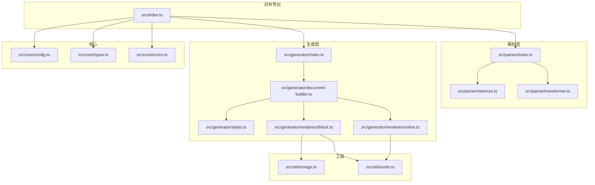
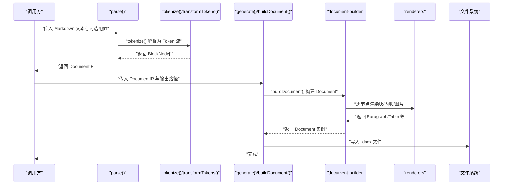
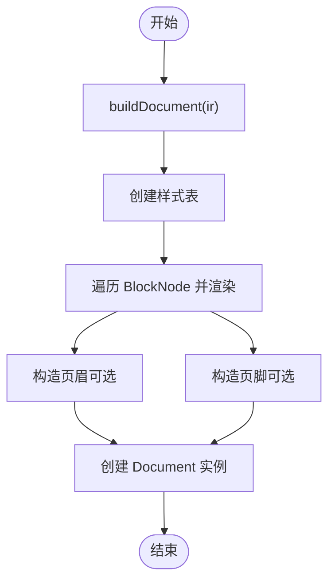
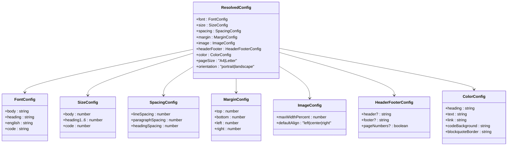
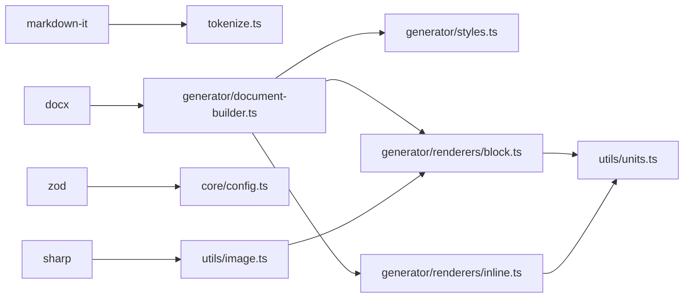

# API 参考

<cite>
**本文引用的文件**
- [src/index.ts](file://src/index.ts)
- [src/parser/index.ts](file://src/parser/index.ts)
- [src/parser/tokenize.ts](file://src/parser/tokenize.ts)
- [src/parser/transformer.ts](file://src/parser/transformer.ts)
- [src/generator/index.ts](file://src/generator/index.ts)
- [src/generator/document-builder.ts](file://src/generator/document-builder.ts)
- [src/generator/styles.ts](file://src/generator/styles.ts)
- [src/generator/renderers/block.ts](file://src/generator/renderers/block.ts)
- [src/generator/renderers/inline.ts](file://src/generator/renderers/inline.ts)
- [src/core/config.ts](file://src/core/config.ts)
- [src/core/types.ts](file://src/core/types.ts)
- [src/core/errors.ts](file://src/core/errors.ts)
- [src/utils/image.ts](file://src/utils/image.ts)
- [src/utils/units.ts](file://src/utils/units.ts)
- [package.json](file://package.json)
</cite>

## 目录
1. [简介](#简介)
2. [项目结构](#项目结构)
3. [核心组件](#核心组件)
4. [架构总览](#架构总览)
5. [详细组件分析](#详细组件分析)
6. [依赖关系分析](#依赖关系分析)
7. [性能考量](#性能考量)
8. [故障排查指南](#故障排查指南)
9. [结论](#结论)
10. [附录](#附录)

## 简介
本文件为 Markdown 到 Word（.docx）转换器的完整 API 参考，覆盖从解析 Markdown 文本到生成最终 Word 文档的全流程。内容包括：
- 公共 API：parse()、generate()、buildDocument() 等
- 配置 API：createConfig()、mergeConfig()、defaultConfig、configSchema
- 类型与接口：DocumentIR、ResolvedConfig、BlockNode、InlineNode 等
- 错误类型与异常处理
- 使用示例与最佳实践

## 项目结构
该库采用模块化设计，按职责划分为 parser（解析）、generator（生成）、core（类型与配置）、utils（工具）等子模块；对外通过统一入口导出 API。

图表来源
- [src/index.ts:1-25](file://src/index.ts#L1-L25)
- [src/parser/index.ts:1-24](file://src/parser/index.ts#L1-L24)
- [src/parser/tokenize.ts:1-16](file://src/parser/tokenize.ts#L1-L16)
- [src/parser/transformer.ts:1-360](file://src/parser/transformer.ts#L1-L360)
- [src/generator/index.ts:1-21](file://src/generator/index.ts#L1-L21)
- [src/generator/document-builder.ts:1-112](file://src/generator/document-builder.ts#L1-L112)
- [src/generator/styles.ts:1-122](file://src/generator/styles.ts#L1-L122)
- [src/generator/renderers/block.ts:1-266](file://src/generator/renderers/block.ts#L1-L266)
- [src/generator/renderers/inline.ts:1-110](file://src/generator/renderers/inline.ts#L1-L110)
- [src/core/config.ts:1-91](file://src/core/config.ts#L1-L91)
- [src/core/types.ts:1-198](file://src/core/types.ts#L1-L198)
- [src/core/errors.ts:1-28](file://src/core/errors.ts#L1-L28)
- [src/utils/image.ts:1-58](file://src/utils/image.ts#L1-L58)
- [src/utils/units.ts:1-45](file://src/utils/units.ts#L1-L45)

章节来源
- [src/index.ts:1-25](file://src/index.ts#L1-L25)
- [package.json:1-47](file://package.json#L1-L47)

## 核心组件
本节概述对外公开的 API 与类型，便于快速定位与使用。

- 对外导出入口
  - 解析：parse(markdown, options?) → DocumentIR
  - 生成：generate(ir, outputPath) → Promise<void>
  - 文档构建：buildDocument(ir) → Promise<Document>
  - 配置：createConfig(input?)、mergeConfig(base, override)、defaultConfig、configSchema
  - 类型：DocumentIR、DocumentMeta、BlockNode、InlineNode、ResolvedConfig、FontConfig、SizeConfig、SpacingConfig、MarginConfig、ImageConfig、HeaderFooterConfig、ColorConfig
  - 错误：MarkdownParseError、DocxGenerationError、ImageProcessingError、ConfigValidationError

章节来源
- [src/index.ts:1-25](file://src/index.ts#L1-L25)
- [src/parser/index.ts:11-21](file://src/parser/index.ts#L11-L21)
- [src/generator/index.ts:7-18](file://src/generator/index.ts#L7-L18)
- [src/generator/document-builder.ts:17-106](file://src/generator/document-builder.ts#L17-L106)
- [src/core/config.ts:68-91](file://src/core/config.ts#L68-L91)
- [src/core/types.ts:1-198](file://src/core/types.ts#L1-L198)
- [src/core/errors.ts:1-28](file://src/core/errors.ts#L1-L28)

## 架构总览
下图展示从输入 Markdown 到输出 .docx 的端到端流程，以及各模块之间的调用关系。

图表来源
- [src/parser/index.ts:11-21](file://src/parser/index.ts#L11-L21)
- [src/parser/tokenize.ts:12-15](file://src/parser/tokenize.ts#L12-L15)
- [src/parser/transformer.ts:25-39](file://src/parser/transformer.ts#L25-L39)
- [src/generator/index.ts:7-18](file://src/generator/index.ts#L7-L18)
- [src/generator/document-builder.ts:17-106](file://src/generator/document-builder.ts#L17-L106)
- [src/generator/renderers/block.ts:28-58](file://src/generator/renderers/block.ts#L28-L58)
- [src/generator/renderers/inline.ts:12-109](file://src/generator/renderers/inline.ts#L12-L109)

## 详细组件分析

### 解析 API：parse()
- 功能：将 Markdown 字符串解析为内部文档表示 DocumentIR，支持元信息与配置注入。
- 参数
  - markdown: string
  - options?: ParseOptions
    - meta?: DocumentMeta（标题、作者、日期）
    - config?: ResolvedConfig（默认使用 defaultConfig）
- 返回：DocumentIR
- 复杂度：O(n)，n 为 Token 数量
- 边界与异常
  - 若 MarkdownIt 解析失败，抛出 MarkdownParseError（由上层捕获或传播）
- 使用示例（参考路径）
  - [示例：基础解析:11-21](file://src/parser/index.ts#L11-L21)

章节来源
- [src/parser/index.ts:6-21](file://src/parser/index.ts#L6-L21)
- [src/core/types.ts:1-12](file://src/core/types.ts#L1-L12)
- [src/core/errors.ts:1-6](file://src/core/errors.ts#L1-L6)

### 生成 API：generate() 与 buildDocument()
- generate(ir, outputPath)
  - 功能：将 DocumentIR 写入指定路径的 .docx 文件
  - 参数
    - ir: DocumentIR
    - outputPath: string（绝对或相对路径）
  - 返回：Promise<void>
  - 异常：DocxGenerationError（包装底层错误）
- buildDocument(ir)
  - 功能：将 DocumentIR 渲染为 docx.Document 实例
  - 参数：ir: DocumentIR
  - 返回：Promise<Document>
  - 特性：根据配置设置页边距、方向、页眉页脚、样式表等
- 使用示例（参考路径）
  - [示例：生成文件:7-18](file://src/generator/index.ts#L7-L18)
  - [示例：构建 Document:17-106](file://src/generator/document-builder.ts#L17-L106)

图表来源
- [src/generator/document-builder.ts:17-106](file://src/generator/document-builder.ts#L17-L106)
- [src/generator/styles.ts:5-109](file://src/generator/styles.ts#L5-L109)
- [src/generator/renderers/block.ts:28-58](file://src/generator/renderers/block.ts#L28-L58)

章节来源
- [src/generator/index.ts:7-21](file://src/generator/index.ts#L7-L21)
- [src/generator/document-builder.ts:17-112](file://src/generator/document-builder.ts#L17-L112)
- [src/core/errors.ts:8-13](file://src/core/errors.ts#L8-L13)

### 配置 API：createConfig()、mergeConfig()、defaultConfig、configSchema
- createConfig(input?)
  - 功能：校验并规范化用户输入，生成 ResolvedConfig
  - 输入：ConfigInput（由 zod schema 定义）
  - 默认值：字体、字号、间距、页边距、图片、页眉页脚、颜色、纸张尺寸与方向
- mergeConfig(base, override)
  - 功能：以 base 为基础，合并 override 后重新校验
- defaultConfig
  - 功能：内置默认配置实例
- configSchema
  - 功能：zod schema，用于运行时校验与类型推断
- 配置项概览（字段与默认值见下方“附录”）
- 使用示例（参考路径）
  - [示例：创建配置:68-81](file://src/core/config.ts#L68-L81)
  - [示例：合并配置:83-88](file://src/core/config.ts#L83-L88)

图表来源
- [src/core/config.ts:54-64](file://src/core/config.ts#L54-L64)
- [src/core/types.ts:137-197](file://src/core/types.ts#L137-L197)

章节来源
- [src/core/config.ts:66-91](file://src/core/config.ts#L66-L91)
- [src/core/types.ts:136-198](file://src/core/types.ts#L136-L198)

### 数据模型与类型定义
- 文档 IR
  - DocumentIR：type='document' + meta + config + children(BlockNode[])
  - DocumentMeta：title、author、date
- 块级节点 BlockNode
  - HeadingNode、ParagraphNode、ListNode、ListItemNode、BlockquoteNode、CodeBlockNode、TableNode、TableRowNode、TableCellNode、ImageNode、ThematicBreakNode
- 行内节点 InlineNode
  - TextNode、BoldNode、ItalicNode、UnderlineNode、InlineCodeNode、LinkNode、LineBreakNode
- 配置类型
  - ResolvedConfig、FontConfig、SizeConfig、SpacingConfig、MarginConfig、ImageConfig、HeaderFooterConfig、ColorConfig

章节来源
- [src/core/types.ts:1-198](file://src/core/types.ts#L1-L198)

### 错误处理与异常类型
- MarkdownParseError：解析阶段错误
- DocxGenerationError：生成 .docx 过程中的错误
- ImageProcessingError：图片读取/缩放等处理错误
- ConfigValidationError：配置校验失败
- 捕获与传播
  - generate() 包裹底层异常为 DocxGenerationError
  - readImage() 将底层错误转为 ImageProcessingError
  - createConfig() 通过 zod 校验，失败抛出 ConfigValidationError

章节来源
- [src/core/errors.ts:1-28](file://src/core/errors.ts#L1-L28)
- [src/generator/index.ts:12-17](file://src/generator/index.ts#L12-L17)
- [src/utils/image.ts:38-42](file://src/utils/image.ts#L38-L42)

### 图片处理与单位转换
- readImage(src)
  - 支持本地文件与 HTTP(S) 链接
  - 使用 sharp 获取尺寸与格式
  - 返回 ImageMetadata：width、height、buffer、extension
- calculateScaledDimensions(w,h,maxW)
  - 按最大宽度计算缩放后的宽高
- 单位转换
  - pxToEmu、ptToHalfPt、ptToTwip
  - getPageWidthEmu/getPageHeightEmu（基于 A4/Letter 与方向）

章节来源
- [src/utils/image.ts:12-58](file://src/utils/image.ts#L12-L58)
- [src/utils/units.ts:6-44](file://src/utils/units.ts#L6-L44)

## 依赖关系分析
- 外部依赖
  - docx：生成 .docx 文档
  - markdown-it：解析 Markdown
  - sharp：图片处理
  - zod：配置校验
- 内部模块耦合
  - parser 仅依赖 tokenizer 与 transformer，输出 DocumentIR
  - generator 依赖 document-builder、styles 与 renderers
  - renderers 依赖 utils/units 与 utils/image（图片）
  - core 提供类型、配置与错误定义

图表来源
- [package.json:27-36](file://package.json#L27-L36)
- [src/parser/tokenize.ts:1-16](file://src/parser/tokenize.ts#L1-L16)
- [src/utils/image.ts:1-58](file://src/utils/image.ts#L1-L58)
- [src/core/config.ts:1-2](file://src/core/config.ts#L1-L2)
- [src/generator/document-builder.ts:1-12](file://src/generator/document-builder.ts#L1-L12)
- [src/generator/renderers/block.ts:26-26](file://src/generator/renderers/block.ts#L26-L26)
- [src/generator/renderers/inline.ts:3-3](file://src/generator/renderers/inline.ts#L3-L3)
- [src/utils/units.ts:1-45](file://src/utils/units.ts#L1-L45)

章节来源
- [package.json:27-36](file://package.json#L27-L36)

## 性能考量
- 解析阶段
  - tokenize/transformTokens 为 O(n) 线性扫描 Token 流
  - 建议对超长 Markdown 分段处理或流式输入
- 渲染阶段
  - renderBlock/renderInline 递归遍历节点树，复杂度 O(N)
  - 大表格与多图片会增加渲染时间
- I/O 与内存
  - generate() 将整份文档打包为 Buffer 再写盘，注意内存峰值
  - 大图片建议预缩放或外部优化
- 建议
  - 合理设置页边距与行距，避免过度分页
  - 使用 mergeConfig 复用已校验配置，减少重复校验开销

## 故障排查指南
- 常见问题与定位
  - 配置无效：确认使用 createConfig() 或 mergeConfig() 生成 ResolvedConfig
  - 生成失败：捕获 DocxGenerationError，检查 ir.config 与输出路径权限
  - 图片加载失败：捕获 ImageProcessingError，检查 src 是否可达、格式是否受支持
  - 解析异常：捕获 MarkdownParseError，检查 Markdown 语法与扩展（如表格）
- 边界条件
  - 空 Markdown：返回空 children 的 DocumentIR
  - 超大图片：readImage 自动降采样，注意最终像素尺寸
  - 非法配置：zod 校验失败抛出 ConfigValidationError

章节来源
- [src/core/errors.ts:1-28](file://src/core/errors.ts#L1-L28)
- [src/generator/index.ts:12-17](file://src/generator/index.ts#L12-L17)
- [src/utils/image.ts:38-42](file://src/utils/image.ts#L38-L42)

## 结论
本库提供了清晰的解析—渲染—生成链路与完善的配置体系，适合在服务端或 CLI 中批量转换 Markdown 到 .docx。通过统一的类型与错误模型，开发者可以安全地集成与扩展功能。

## 附录

### API 一览与签名
- parse(markdown: string, options?: ParseOptions): DocumentIR
- generate(ir: DocumentIR, outputPath: string): Promise<void>
- buildDocument(ir: DocumentIR): Promise<Document>
- createConfig(input?: ConfigInput): ResolvedConfig
- mergeConfig(base: ResolvedConfig, override: ConfigInput): ResolvedConfig
- defaultConfig: ResolvedConfig
- configSchema: zod schema

章节来源
- [src/parser/index.ts:11-21](file://src/parser/index.ts#L11-L21)
- [src/generator/index.ts:7-21](file://src/generator/index.ts#L7-L21)
- [src/generator/document-builder.ts:17-106](file://src/generator/document-builder.ts#L17-L106)
- [src/core/config.ts:68-91](file://src/core/config.ts#L68-L91)

### 配置项与默认值（摘要）
- 字体：body、heading、english、code（默认中英文字体与代码字体）
- 字号：body、heading1..6、code（pt）
- 间距：行距、段前段后、标题间距（pt）
- 页边距：top、bottom、left、right（twip）
- 图片：maxWidthPercent（1–100）、defaultAlign（left/center/right）
- 页眉页脚：header、footer、pageNumbers
- 颜色：heading、text、link、codeBackground、blockquoteBorder
- 页面：pageSize（A4、Letter）、orientation（portrait、landscape）

章节来源
- [src/core/config.ts:4-64](file://src/core/config.ts#L4-L64)
- [src/core/types.ts:137-197](file://src/core/types.ts#L137-L197)

### 使用场景与示例（参考路径）
- 基础转换
  - 步骤：parse() → generate() → 输出 .docx
  - 参考：[parse():11-21](file://src/parser/index.ts#L11-L21)、[generate():7-18](file://src/generator/index.ts#L7-L18)
- 自定义样式
  - 使用 createConfig()/mergeConfig() 设置字体、字号、颜色
  - 参考：[createConfig():68-81](file://src/core/config.ts#L68-L81)、[mergeConfig():83-88](file://src/core/config.ts#L83-L88)
- 页眉页脚与分页
  - 在 config.headerFooter 中启用页码与文本
  - 参考：[document-builder 页眉页脚逻辑:30-69](file://src/generator/document-builder.ts#L30-L69)
- 处理图片
  - 支持本地与网络图片，自动缩放
  - 参考：[readImage():12-42](file://src/utils/image.ts#L12-L42)、[renderImage()](file://src/generator/renderers/image.ts)