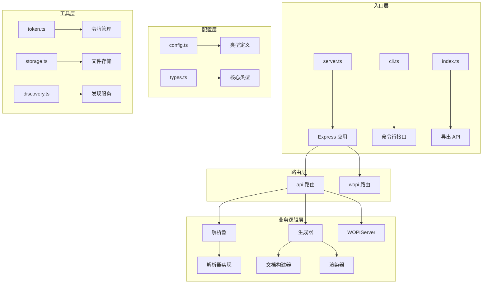
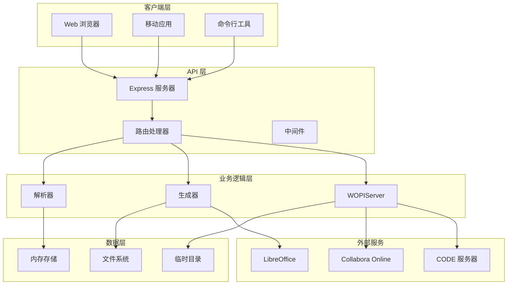
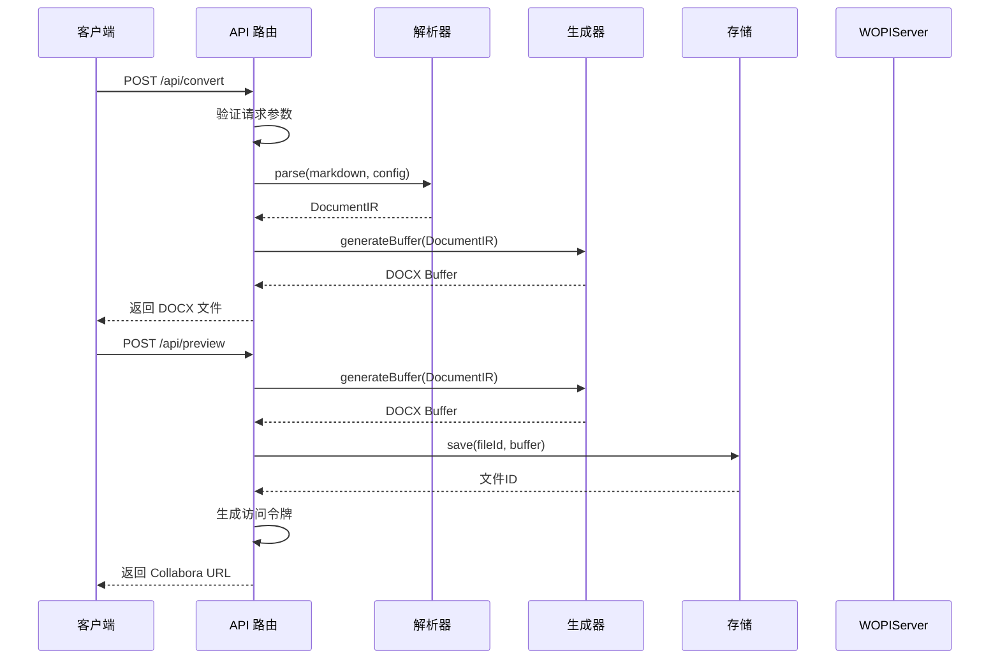
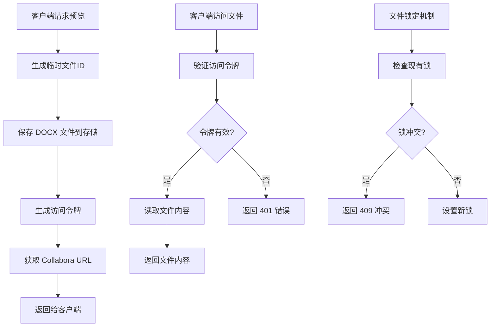
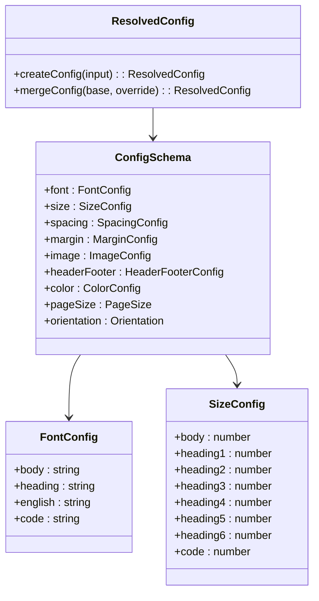
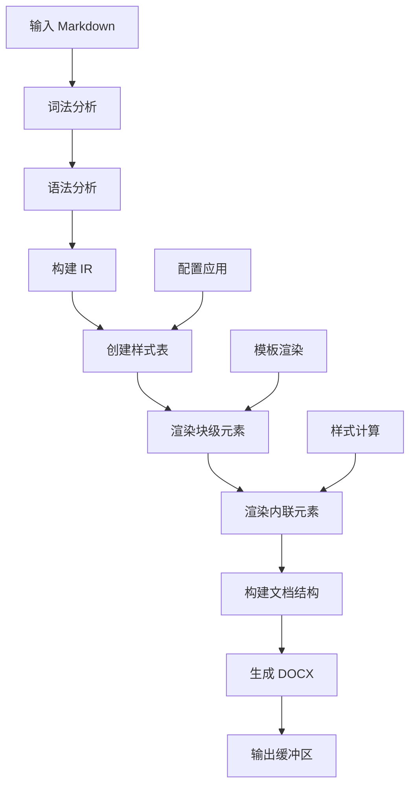
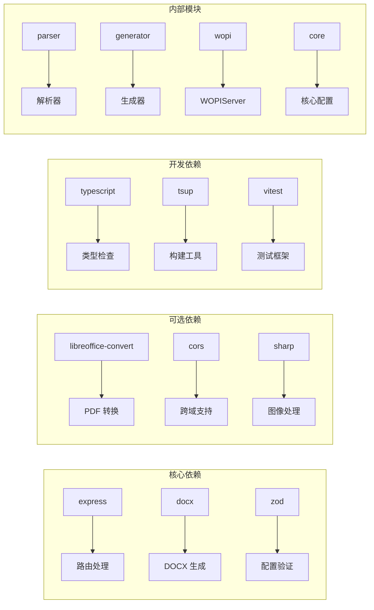

# 增强的 API 功能

<cite>
**本文档引用的文件**
- [src/index.ts](file://src/index.ts)
- [src/server.ts](file://src/server.ts)
- [src/routes/api.ts](file://src/routes/api.ts)
- [src/cli.ts](file://src/cli.ts)
- [src/core/config.ts](file://src/core/config.ts)
- [src/generator/document-builder.ts](file://src/generator/document-builder.ts)
- [src/parser/index.ts](file://src/parser/index.ts)
- [src/wopi/index.ts](file://src/wopi/index.ts)
- [src/wopi/token.ts](file://src/wopi/token.ts)
- [src/wopi/storage.ts](file://src/wopi/storage.ts)
- [src/wopi/discovery.ts](file://src/wopi/discovery.ts)
- [src/generator/renderers/block.ts](file://src/generator/renderers/block.ts)
- [src/generator/styles.ts](file://src/generator/styles.ts)
- [src/core/types.ts](file://src/core/types.ts)
- [package.json](file://package.json)
</cite>

## 目录
1. [简介](#简介)
2. [项目结构](#项目结构)
3. [核心组件](#核心组件)
4. [架构概览](#架构概览)
5. [详细组件分析](#详细组件分析)
6. [依赖关系分析](#依赖关系分析)
7. [性能考虑](#性能考虑)
8. [故障排除指南](#故障排除指南)
9. [结论](#结论)

## 简介

这是一个基于 Node.js 的 Markdown 到 Word 文档转换器，提供了完整的 API 功能集，支持多种输出格式和协作编辑能力。该系统通过 Express.js 提供 RESTful API 接口，支持实时预览、PDF 导出、WOPIServer 协议集成等功能。

主要特性包括：
- Markdown 到 DOCX 格式的转换
- 实时在线预览（基于 Collabora Online）
- PDF 格式导出
- 配置化样式定制
- 文件存储管理
- 安全令牌验证

## 项目结构

项目采用模块化架构设计，主要分为以下几个核心模块：

**图表来源**
- [src/server.ts:1-40](file://src/server.ts#L1-L40)
- [src/routes/api.ts:1-127](file://src/routes/api.ts#L1-L127)
- [src/cli.ts:1-113](file://src/cli.ts#L1-L113)

**章节来源**
- [src/server.ts:1-40](file://src/server.ts#L1-L40)
- [src/index.ts:1-25](file://src/index.ts#L1-L25)
- [package.json:1-51](file://package.json#L1-L51)

## 核心组件

### API 路由组件

系统提供完整的 RESTful API 接口，支持以下核心功能：

1. **文档转换接口** (`/api/convert`)
   - 将 Markdown 内容转换为 DOCX 文件
   - 支持自定义配置参数
   - 返回二进制 DOCX 文件流

2. **实时预览接口** (`/api/preview`)
   - 创建临时文件会话
   - 生成访问令牌
   - 返回 Collabora Online 编辑 URL

3. **文件下载接口** (`/api/files/:fileId/download`)
   - 下载已生成的 DOCX 文件
   - 基于令牌的安全访问控制

4. **PDF 导出接口** (`/api/files/:fileId/export/pdf`)
   - 将 DOCX 文件转换为 PDF
   - 使用 LibreOffice 进行转换

5. **直接 PDF 转换** (`/api/convert/pdf`)
   - 直接从 Markdown 生成 PDF 文件

**章节来源**
- [src/routes/api.ts:15-124](file://src/routes/api.ts#L15-L124)

### 配置管理系统

系统提供强大的配置管理功能，支持以下配置项：

- **字体配置**：中文字体、英文字体、代码字体
- **尺寸配置**：正文、标题各级别的字体大小
- **间距配置**：行间距、段落间距、标题间距
- **边距配置**：页面四边边距
- **图片配置**：最大宽度百分比、默认对齐方式
- **页眉页脚配置**：内容和页码显示
- **颜色配置**：标题、文本、链接、代码背景色等

**章节来源**
- [src/core/config.ts:1-91](file://src/core/config.ts#L1-L91)
- [src/core/types.ts:142-204](file://src/core/types.ts#L142-L204)

### 解析器组件

Markdown 解析器负责将 Markdown 文本转换为内部表示（IR）：

- **词法分析**：使用 markdown-it 进行标记化
- **语法树转换**：将标记转换为块级节点和内联节点
- **IR 构建**：生成统一的中间表示结构

**章节来源**
- [src/parser/index.ts:1-24](file://src/parser/index.ts#L1-L24)

### 生成器组件

文档生成器将 IR 转换为最终的 DOCX 文件：

- **样式创建**：根据配置生成样式表
- **块级渲染**：处理标题、段落、列表、表格等
- **内联渲染**：处理文本、粗体、斜体、链接等
- **文档构建**：使用 docx 库创建最终文档

**章节来源**
- [src/generator/document-builder.ts:18-193](file://src/generator/document-builder.ts#L18-L193)
- [src/generator/renderers/block.ts:35-286](file://src/generator/renderers/block.ts#L35-L286)

## 架构概览

系统采用分层架构设计，确保各层职责清晰分离：

**图表来源**
- [src/server.ts:13-39](file://src/server.ts#L13-L39)
- [src/routes/api.ts:1-127](file://src/routes/api.ts#L1-L127)
- [src/wopi/index.ts:1-112](file://src/wopi/index.ts#L1-L112)

## 详细组件分析

### API 路由处理流程

系统的核心 API 处理流程如下：

**图表来源**
- [src/routes/api.ts:15-59](file://src/routes/api.ts#L15-L59)
- [src/parser/index.ts:11-21](file://src/parser/index.ts#L11-L21)
- [src/generator/document-builder.ts:189-192](file://src/generator/document-builder.ts#L189-L192)

### WOPIServer 协议实现

系统实现了完整的 WOPIServer 协议，支持在线协作编辑：

**图表来源**
- [src/routes/api.ts:36-59](file://src/routes/api.ts#L36-L59)
- [src/wopi/index.ts:7-14](file://src/wopi/index.ts#L7-L14)
- [src/wopi/storage.ts:56-71](file://src/wopi/storage.ts#L56-L71)

### 配置系统架构

配置系统采用 Zod 验证和类型安全设计：

**图表来源**
- [src/core/config.ts:54-81](file://src/core/config.ts#L54-L81)
- [src/core/types.ts:142-204](file://src/core/types.ts#L142-L204)

**章节来源**
- [src/wopi/token.ts:1-27](file://src/wopi/token.ts#L1-L27)
- [src/wopi/storage.ts:19-54](file://src/wopi/storage.ts#L19-L54)
- [src/wopi/discovery.ts:38-57](file://src/wopi/discovery.ts#L38-L57)

### 文档生成流程

文档生成过程包含多个处理阶段：

**图表来源**
- [src/parser/index.ts:11-21](file://src/parser/index.ts#L11-L21)
- [src/generator/document-builder.ts:18-187](file://src/generator/document-builder.ts#L18-L187)
- [src/generator/styles.ts:5-109](file://src/generator/styles.ts#L5-L109)

**章节来源**
- [src/generator/renderers/block.ts:35-286](file://src/generator/renderers/block.ts#L35-L286)
- [src/generator/styles.ts:1-122](file://src/generator/styles.ts#L1-L122)

## 依赖关系分析

系统依赖关系图展示了各模块间的耦合程度：

**图表来源**
- [package.json:29-49](file://package.json#L29-L49)

**章节来源**
- [package.json:11-20](file://package.json#L11-L20)

## 性能考虑

### 内存管理
- 使用流式处理避免大文件内存占用
- 实现临时文件清理机制防止磁盘空间泄漏
- 配置合理的超时时间和重试策略

### 并发处理
- Express 默认支持多请求并发处理
- 文件操作使用异步 API 避免阻塞
- LibreOffice 转换使用进程池管理

### 缓存策略
- 发现服务结果缓存减少网络请求
- 令牌验证结果本地缓存
- 配置对象复用避免重复创建

## 故障排除指南

### 常见错误及解决方案

1. **LibreOffice 未找到**
   - 确保系统已安装 LibreOffice
   - 检查 soffice 可执行文件路径
   - 配置正确的环境变量

2. **WOPIServer 发现失败**
   - 验证 CODE 服务器地址配置
   - 检查网络连接和防火墙设置
   - 查看发现服务日志

3. **文件存储权限问题**
   - 确认临时目录存在且可写
   - 检查磁盘空间是否充足
   - 验证文件系统权限

4. **令牌验证失败**
   - 检查 WOPI_SECRET 配置
   - 验证令牌过期时间设置
   - 确认文件ID格式正确

**章节来源**
- [src/routes/api.ts:90-99](file://src/routes/api.ts#L90-L99)
- [src/wopi/token.ts:14-26](file://src/wopi/token.ts#L14-L26)
- [src/wopi/storage.ts:12-17](file://src/wopi/storage.ts#L12-L17)

## 结论

该系统提供了完整的 Markdown 到 Word 文档转换解决方案，具有以下优势：

1. **功能完整性**：涵盖转换、预览、导出等核心功能
2. **架构清晰**：模块化设计便于维护和扩展
3. **配置灵活**：丰富的样式和布局配置选项
4. **安全性**：完善的访问控制和令牌验证机制
5. **可扩展性**：良好的插件架构支持功能扩展

建议的后续改进方向：
- 添加更多的输出格式支持
- 实现更精细的权限控制
- 增加批量处理功能
- 优化大文件处理性能
- 扩展模板系统功能