# 增强的 API 功能

<cite>
**本文档引用的文件**
- [src/index.ts](file://src/index.ts)
- [src/server.ts](file://src/server.ts)
- [src/routes/api.ts](file://src/routes/api.ts)
- [src/cli.ts](file://src/cli.ts)
- [src/core/config.ts](file://src/core/config.ts)
- [src/core/types.ts](file://src/core/types.ts)
- [src/generator/index.ts](file://src/generator/index.ts)
- [src/generator/document-builder.ts](file://src/generator/document-builder.ts)
- [src/parser/index.ts](file://src/parser/index.ts)
- [src/parser/tokenize.ts](file://src/parser/tokenize.ts)
- [src/parser/transformer.ts](file://src/parser/transformer.ts)
- [src/wopi/index.ts](file://src/wopi/index.ts)
- [src/wopi/token.ts](file://src/wopi/token.ts)
- [src/wopi/storage.ts](file://src/wopi/storage.ts)
- [package.json](file://package.json)
</cite>

## 目录
1. [简介](#简介)
2. [项目结构](#项目结构)
3. [核心组件](#核心组件)
4. [架构概览](#架构概览)
5. [详细组件分析](#详细组件分析)
6. [依赖关系分析](#依赖关系分析)
7. [性能考虑](#性能考虑)
8. [故障排除指南](#故障排除指南)
9. [结论](#结论)

## 简介

这是一个基于 Node.js 的 Markdown 到 Word 文档转换器，提供了完整的 API 功能集，支持在线转换、预览、PDF 导出以及 WOPIServer 协议集成。该系统采用模块化设计，包含解析器、生成器、配置管理等核心组件，为用户提供从 Markdown 内容到格式化 DOCX 文档的完整转换流程。

## 项目结构

项目采用清晰的模块化架构，主要分为以下核心目录：

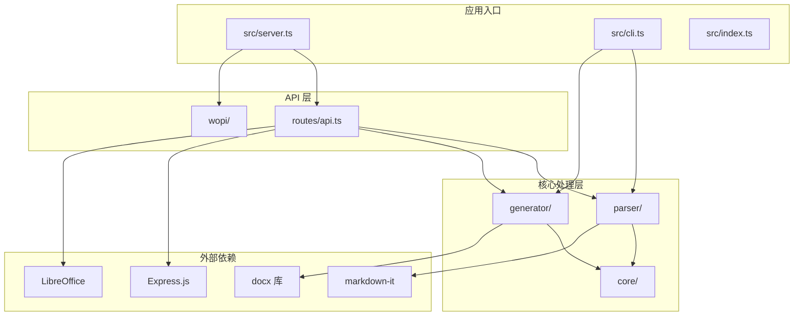

**图表来源**
- [src/server.ts:1-40](file://src/server.ts#L1-L40)
- [src/routes/api.ts:1-103](file://src/routes/api.ts#L1-L103)
- [src/cli.ts:1-113](file://src/cli.ts#L1-L113)

**章节来源**
- [src/server.ts:1-40](file://src/server.ts#L1-L40)
- [src/index.ts:1-25](file://src/index.ts#L1-L25)
- [package.json:1-51](file://package.json#L1-L51)

## 核心组件

### API 路由系统

系统提供四个主要的 API 端点，支持完整的文档转换工作流：

1. **POST /api/convert** - 直接转换 Markdown 到 DOCX
2. **POST /api/preview** - 创建预览会话，集成 Collabora 在线编辑
3. **GET /api/files/:fileId/download** - 下载已保存的文档
4. **POST /api/files/:fileId/export/pdf** - 将 DOCX 导出为 PDF

### 配置管理系统

采用 Zod 验证的类型安全配置系统，支持字体、尺寸、间距、边距、颜色等全方位的样式定制：

- 字体配置：中文字体、英文字体、代码字体
- 尺寸配置：正文、各级标题、代码块大小
- 间距配置：行间距、段落间距、标题间距
- 边距配置：页面四边距
- 图片配置：最大宽度百分比、默认对齐方式
- 头尾配置：页眉、页脚内容、页码显示

### 解析器引擎

基于 markdown-it 的强大解析器，支持：
- 标准 Markdown 语法
- 表格支持
- HTML 内联元素
- 自动链接识别
- 类型安全的令牌转换

### 生成器系统

使用 docx 库创建高质量的 Word 文档，支持：
- 完整的文档结构
- 自定义样式系统
- 页眉页脚
- 分页控制
- 缓冲区直接输出

**章节来源**
- [src/routes/api.ts:15-100](file://src/routes/api.ts#L15-L100)
- [src/core/config.ts:68-91](file://src/core/config.ts#L68-L91)
- [src/parser/transformer.ts:25-39](file://src/parser/transformer.ts#L25-L39)
- [src/generator/document-builder.ts:17-106](file://src/generator/document-builder.ts#L17-L106)

## 架构概览

系统采用分层架构设计，确保了良好的可维护性和扩展性：

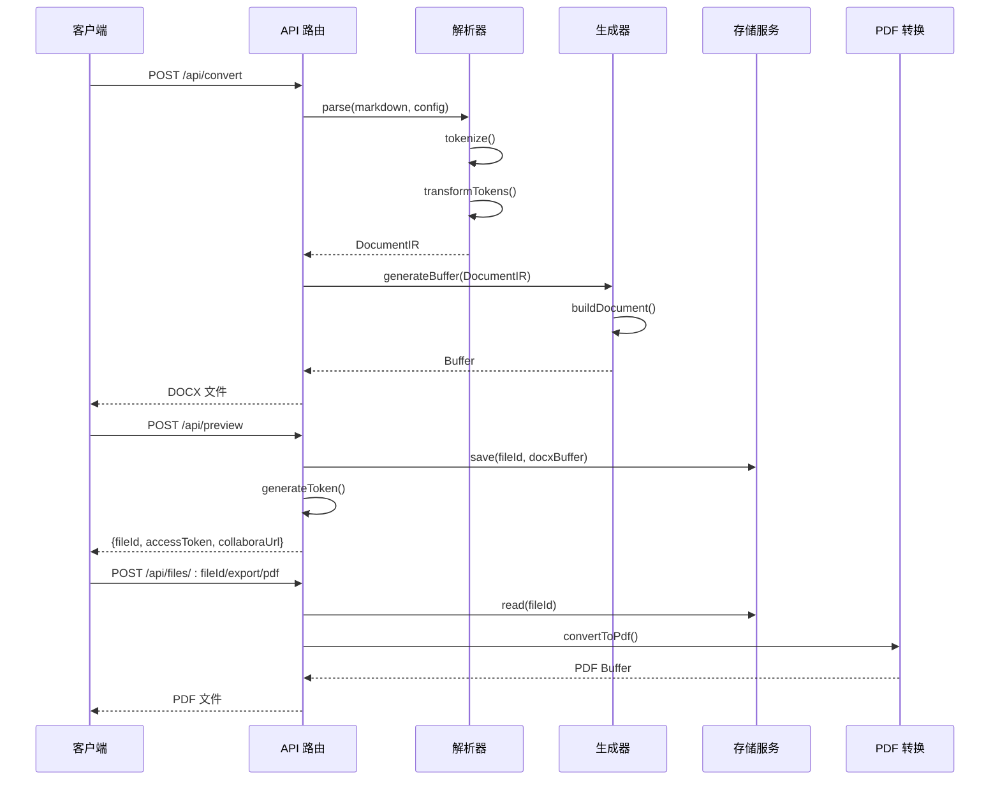

**图表来源**
- [src/routes/api.ts:15-100](file://src/routes/api.ts#L15-L100)
- [src/parser/index.ts:11-21](file://src/parser/index.ts#L11-L21)
- [src/generator/document-builder.ts:108-112](file://src/generator/document-builder.ts#L108-L112)
- [src/wopi/storage.ts:19-25](file://src/wopi/storage.ts#L19-L25)

## 详细组件分析

### API 路由组件

API 路由系统是整个应用的核心接口，负责处理所有外部请求：

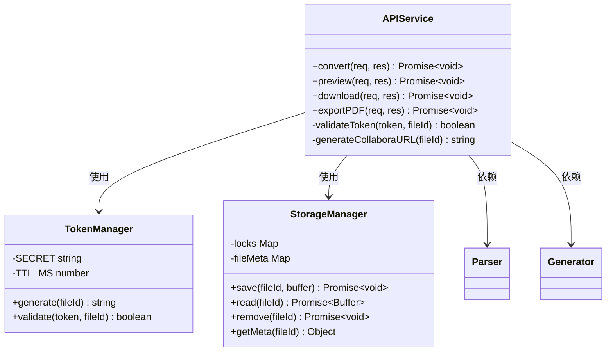

**图表来源**
- [src/routes/api.ts:15-100](file://src/routes/api.ts#L15-L100)
- [src/wopi/token.ts:6-26](file://src/wopi/token.ts#L6-L26)
- [src/wopi/storage.ts:19-54](file://src/wopi/storage.ts#L19-L54)

#### 转换流程分析

转换过程涉及多个步骤的复杂数据流：

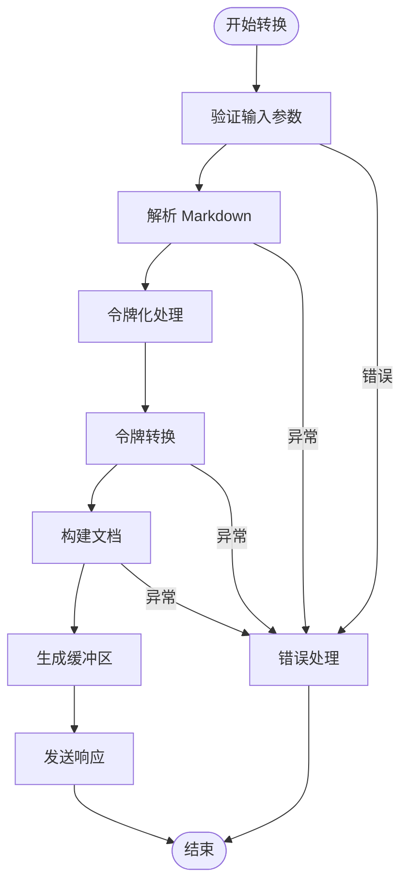

**图表来源**
- [src/routes/api.ts:15-34](file://src/routes/api.ts#L15-L34)
- [src/parser/index.ts:11-21](file://src/parser/index.ts#L11-L21)
- [src/generator/document-builder.ts:108-112](file://src/generator/document-builder.ts#L108-L112)

**章节来源**
- [src/routes/api.ts:15-100](file://src/routes/api.ts#L15-L100)
- [src/parser/index.ts:11-21](file://src/parser/index.ts#L11-L21)
- [src/generator/document-builder.ts:17-106](file://src/generator/document-builder.ts#L17-L106)

### 配置管理系统

配置系统采用类型安全的设计模式，确保运行时的配置正确性：

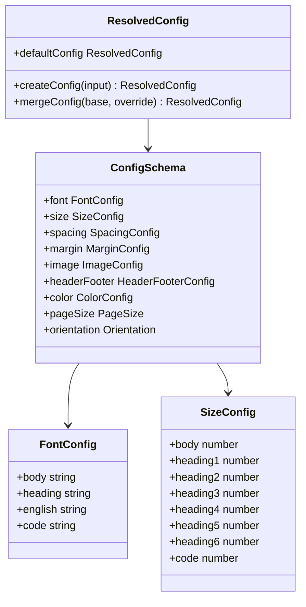

**图表来源**
- [src/core/config.ts:54-81](file://src/core/config.ts#L54-L81)
- [src/core/types.ts:137-198](file://src/core/types.ts#L137-L198)

#### 配置验证流程

配置验证采用 Zod 库实现类型安全的验证：

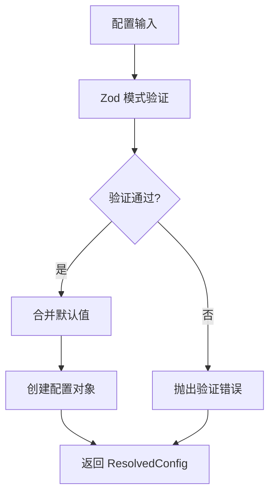

**图表来源**
- [src/core/config.ts:68-81](file://src/core/config.ts#L68-L81)

**章节来源**
- [src/core/config.ts:1-91](file://src/core/config.ts#L1-L91)
- [src/core/types.ts:1-198](file://src/core/types.ts#L1-L198)

### 解析器组件

解析器系统基于 markdown-it 提供强大的 Markdown 解析能力：

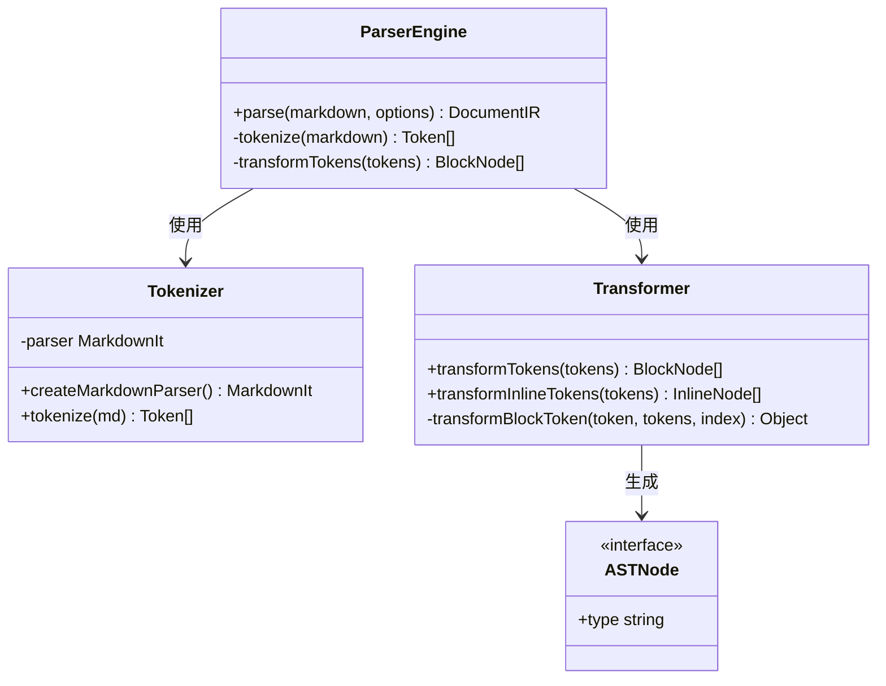

**图表来源**
- [src/parser/index.ts:11-21](file://src/parser/index.ts#L11-L21)
- [src/parser/tokenize.ts:12-15](file://src/parser/tokenize.ts#L12-L15)
- [src/parser/transformer.ts:25-39](file://src/parser/transformer.ts#L25-L39)

#### 令牌转换算法

令牌转换过程实现了复杂的语法树构建：

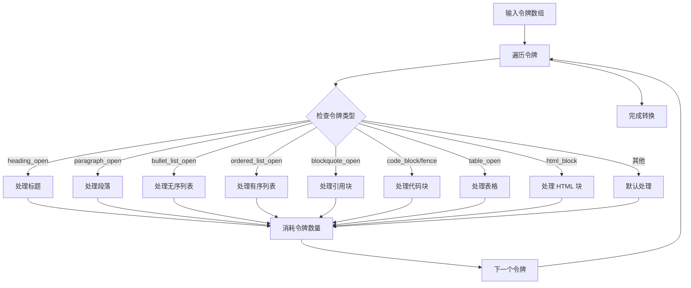

**图表来源**
- [src/parser/transformer.ts:41-122](file://src/parser/transformer.ts#L41-L122)
- [src/parser/transformer.ts:124-162](file://src/parser/transformer.ts#L124-L162)

**章节来源**
- [src/parser/index.ts:1-24](file://src/parser/index.ts#L1-L24)
- [src/parser/tokenize.ts:1-16](file://src/parser/tokenize.ts#L1-L16)
- [src/parser/transformer.ts:1-360](file://src/parser/transformer.ts#L1-L360)

### 生成器组件

生成器系统使用 docx 库创建高质量的 Word 文档：

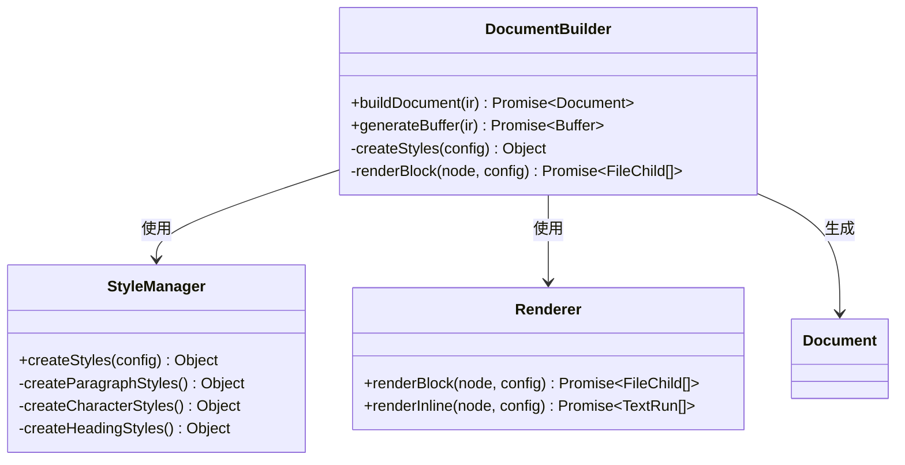

**图表来源**
- [src/generator/document-builder.ts:17-106](file://src/generator/document-builder.ts#L17-L106)
- [src/generator/styles.ts](file://src/generator/styles.ts)

#### 文档构建流程

文档构建过程涉及多层抽象和复杂的样式应用：

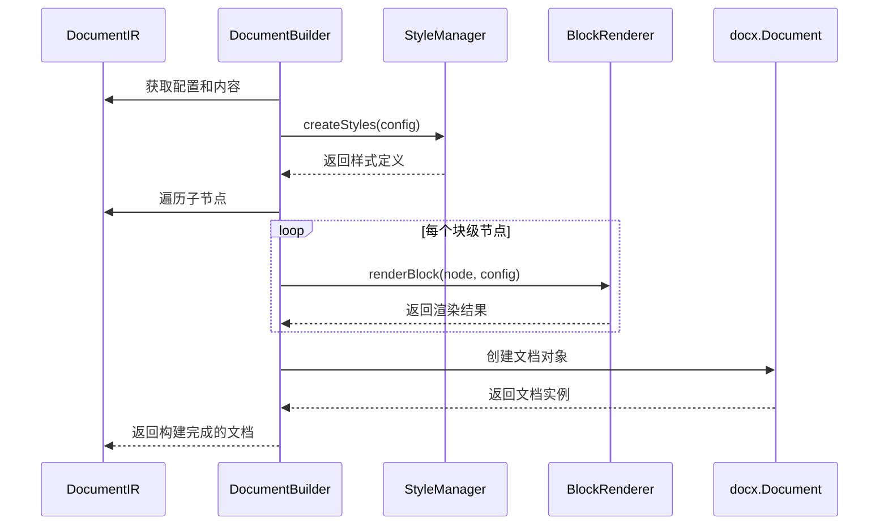

**图表来源**
- [src/generator/document-builder.ts:17-106](file://src/generator/document-builder.ts#L17-L106)
- [src/generator/renderers/block.ts](file://src/generator/renderers/block.ts)

**章节来源**
- [src/generator/index.ts:1-21](file://src/generator/index.ts#L1-L21)
- [src/generator/document-builder.ts:1-112](file://src/generator/document-builder.ts#L1-L112)

### WOPI 服务器集成

系统集成了 WOPIServer 协议，支持 Collabora 在线编辑：

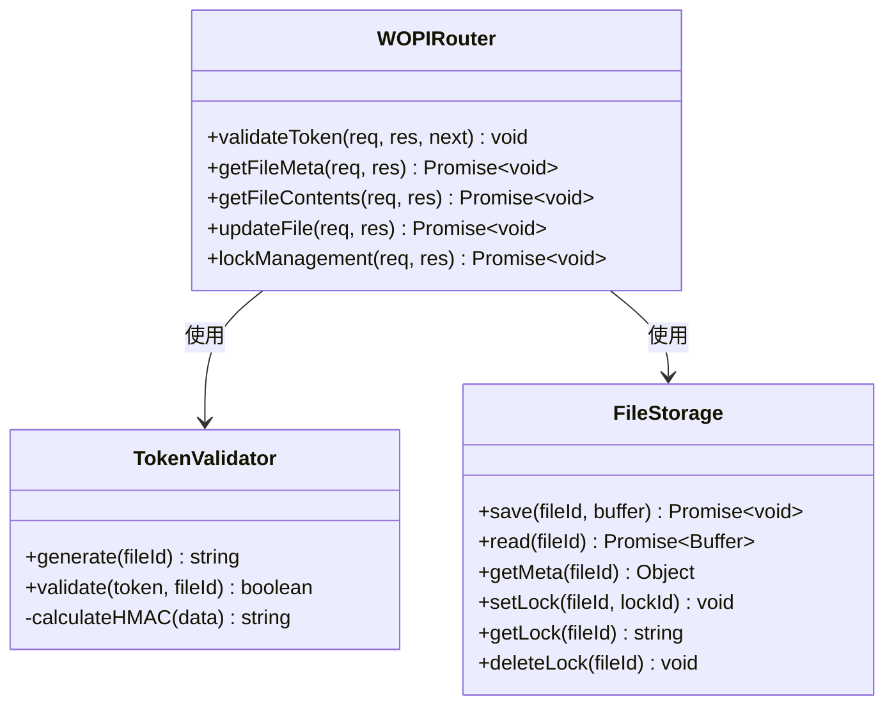

**图表来源**
- [src/wopi/index.ts:7-112](file://src/wopi/index.ts#L7-L112)
- [src/wopi/token.ts:6-26](file://src/wopi/token.ts#L6-L26)
- [src/wopi/storage.ts:19-71](file://src/wopi/storage.ts#L19-L71)

#### WOPI 锁机制

WOPIServer 协议实现了完整的文件锁定和并发控制：

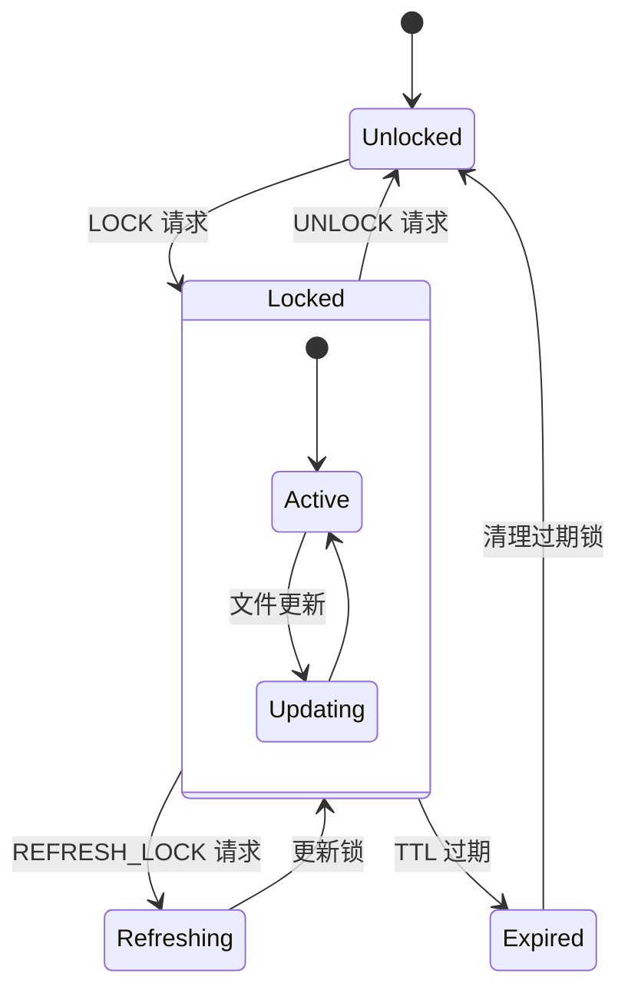

**图表来源**
- [src/wopi/index.ts:54-87](file://src/wopi/index.ts#L54-L87)
- [src/wopi/storage.ts:56-71](file://src/wopi/storage.ts#L56-L71)

**章节来源**
- [src/wopi/index.ts:1-112](file://src/wopi/index.ts#L1-L112)
- [src/wopi/token.ts:1-27](file://src/wopi/token.ts#L1-L27)
- [src/wopi/storage.ts:1-81](file://src/wopi/storage.ts#L1-L81)

## 依赖关系分析

系统依赖关系清晰，采用模块化设计降低耦合度：

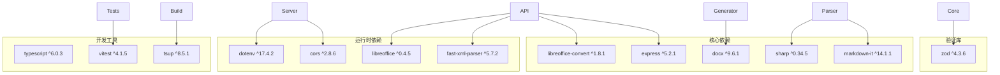

**图表来源**
- [package.json:29-49](file://package.json#L29-L49)

**章节来源**
- [package.json:1-51](file://package.json#L1-L51)

## 性能考虑

### 内存管理优化

系统在处理大文档时采用了多项内存优化策略：

1. **流式处理**：API 路由支持 10MB 限制的请求体大小
2. **临时文件管理**：WOPIServer 使用临时目录存储中间文件
3. **垃圾回收**：定期清理过期的临时文件和锁信息

### 并发处理

- **异步操作**：所有 I/O 操作都采用 Promise 和 async/await
- **连接池**：Express 应用程序支持多连接并发
- **超时控制**：LibreOffice 转换设置了合理的超时时间

### 缓存策略

- **配置缓存**：解析后的配置对象可以重复使用
- **样式缓存**：生成的样式定义可以缓存避免重复计算
- **文件缓存**：WOPIServer 实现了文件元数据缓存

## 故障排除指南

### 常见错误类型

系统定义了多种错误类型以提供清晰的错误信息：

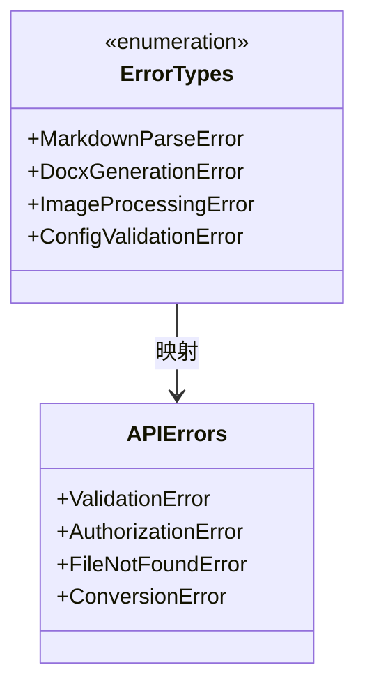

**图表来源**
- [src/core/errors.ts](file://src/core/errors.ts)

### 错误处理流程

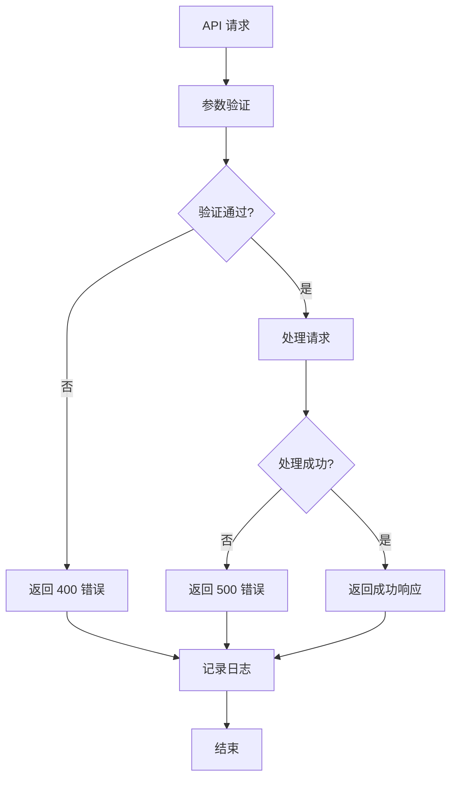

### 调试建议

1. **启用详细日志**：查看控制台输出的错误信息
2. **检查环境变量**：确保 WOPI_SECRET 和其他配置正确设置
3. **验证输入格式**：确认 Markdown 内容格式正确
4. **监控资源使用**：注意内存和磁盘空间使用情况

**章节来源**
- [src/routes/api.ts:27-33](file://src/routes/api.ts#L27-L33)
- [src/routes/api.ts:52-58](file://src/routes/api.ts#L52-L58)
- [src/routes/api.ts:90-99](file://src/routes/api.ts#L90-L99)

## 结论

该 Markdown 到 Word 转换器提供了完整的 API 功能集，具有以下优势：

1. **模块化设计**：清晰的组件分离便于维护和扩展
2. **类型安全**：使用 TypeScript 和 Zod 确保运行时安全
3. **功能完整**：支持转换、预览、导出等多种功能
4. **协议兼容**：集成 WOPIServer 支持在线协作编辑
5. **性能优化**：采用异步处理和内存优化策略

系统适合在企业环境中部署，为用户提供从 Markdown 内容到专业 Word 文档的完整解决方案。通过合理的配置管理和错误处理机制，确保了系统的稳定性和可靠性。