# 增强的 API 功能

<cite>
**本文档引用的文件**
- [src/index.ts](file://src/index.ts)
- [src/server.ts](file://src/server.ts)
- [src/routes/api.ts](file://src/routes/api.ts)
- [src/cli.ts](file://src/cli.ts)
- [src/core/config.ts](file://src/core/config.ts)
- [src/core/types.ts](file://src/core/types.ts)
- [src/generator/index.ts](file://src/generator/index.ts)
- [src/generator/document-builder.ts](file://src/generator/document-builder.ts)
- [src/generator/styles.ts](file://src/generator/styles.ts)
- [src/parser/index.ts](file://src/parser/index.ts)
- [src/parser/tokenize.ts](file://src/parser/tokenize.ts)
- [src/parser/transformer.ts](file://src/parser/transformer.ts)
- [src/wopi/index.ts](file://src/wopi/index.ts)
- [src/wopi/token.ts](file://src/wopi/token.ts)
- [src/wopi/storage.ts](file://src/wopi/storage.ts)
- [src/wopi/discovery.ts](file://src/wopi/discovery.ts)
- [frontend/src/services/api.ts](file://frontend/src/services/api.ts)
- [frontend/src/store/useStore.ts](file://frontend/src/store/useStore.ts)
- [frontend/src/components/preview/PreviewPanel.tsx](file://frontend/src/components/preview/PreviewPanel.tsx)
- [frontend/src/components/editor/MarkdownEditor.tsx](file://frontend/src/components/editor/MarkdownEditor.tsx)
- [frontend/src/utils/templates.ts](file://frontend/src/utils/templates.ts)
- [frontend/src/utils/smartParser.ts](file://frontend/src/utils/smartParser.ts)
- [frontend/src/App.tsx](file://frontend/src/App.tsx)
- [frontend/src/main.tsx](file://frontend/src/main.tsx)
- [frontend/src/i18n.ts](file://frontend/src/i18n.ts)
- [CONFIG_SPEC.md](file://CONFIG_SPEC.md)
- [GEMINI.md](file://GEMINI.md)
- [TODO.md](file://TODO.md)
- [package.json](file://package.json)
</cite>

## 更新摘要
**所做更改**
- 新增自动颜色格式转换功能，前端API服务自动处理十六进制颜色格式
- 增强PreviewPanel的Collabora集成，支持完整的在线协作编辑流程
- 完善整体API功能，包括预览会话管理和文件下载导出
- 更新智能配置导入系统，支持颜色配置的自然语言解析
- 新增详细的颜色配置规范和验证机制

## 目录
1. [简介](#简介)
2. [项目结构](#项目结构)
3. [核心组件](#核心组件)
4. [架构概览](#架构概览)
5. [详细组件分析](#详细组件分析)
6. [前端集成架构](#前端集成架构)
7. [协作编辑系统](#协作编辑系统)
8. [智能配置系统](#智能配置系统)
9. [颜色格式转换系统](#颜色格式转换系统)
10. [依赖关系分析](#依赖关系分析)
11. [性能考虑](#性能考虑)
12. [故障排除指南](#故障排除指南)
13. [结论](#结论)

## 简介

这是一个基于 Node.js 的 Markdown 到 Word 文档转换器，现已发展为完整的前端集成解决方案，提供了增强的 API 功能集，支持在线转换、实时预览、协作编辑、文件管理和智能配置导入。该系统采用前后端分离的现代化架构，包含解析器、生成器、配置管理等核心组件，为用户提供从 Markdown 内容到格式化 DOCX 文档的完整转换流程，同时提供丰富的前端交互体验。

**更新** 新增自动颜色格式转换功能，支持十六进制颜色值的自动处理；增强PreviewPanel的Collabora集成，提供完整的在线协作编辑体验。

## 项目结构

项目采用模块化架构，分为后端服务层和前端应用层两大核心部分：

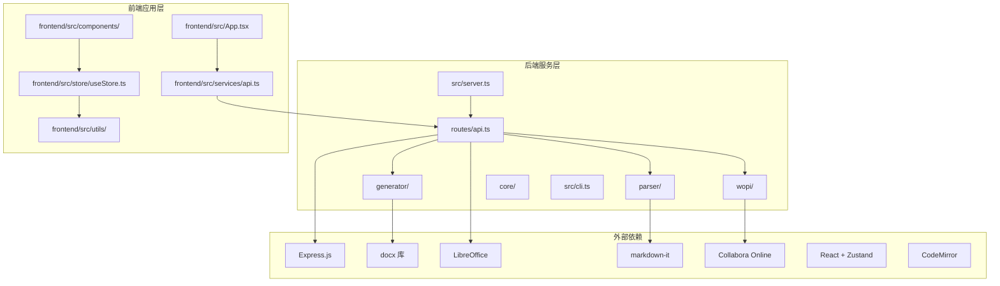
```mermaid
graph TB
subgraph "后端服务层"
Server[src/server.ts]
API[routes/api.ts]
WOPI[wopi/]
Parser[parser/]
Generator[generator/]
Core[core/]
CLI[src/cli.ts]
end
subgraph "前端应用层"
App[frontend/src/App.tsx]
Services[frontend/src/services/api.ts]
Store[frontend/src/store/useStore.ts]
Components[frontend/src/components/]
Utils[frontend/src/utils/]
end
subgraph "外部依赖"
Express[Express.js]
Docx[docx 库]
LibreOffice[LibreOffice]
MarkdownIt[markdown-it]
Collabora[Collabora Online]
React[React + Zustand]
CodeMirror[CodeMirror]
end
Server --> API
API --> Parser
API --> Generator
API --> WOPI
App --> Services
Services --> API
Components --> Store
Store --> Utils
API --> Express
Generator --> Docx
API --> LibreOffice
Parser --> MarkdownIt
WOPI --> Collabora
```

**图表来源**
- [src/server.ts:1-40](file://src/server.ts#L1-L40)
- [src/routes/api.ts:1-127](file://src/routes/api.ts#L1-L127)
- [frontend/src/App.tsx:1-68](file://frontend/src/App.tsx#L1-L68)
- [frontend/src/services/api.ts:1-83](file://frontend/src/services/api.ts#L1-L83)

**章节来源**
- [src/server.ts:1-40](file://src/server.ts#L1-L40)
- [src/index.ts:1-25](file://src/index.ts#L1-L25)
- [package.json:1-57](file://package.json#L1-L57)

## 核心组件

### 增强的 API 路由系统

系统提供七个主要的 API 端点，支持完整的文档工作流：

1. **POST /api/convert** - 直接转换 Markdown 到 DOCX
2. **POST /api/preview** - 创建预览会话，集成 Collabora 在线编辑
3. **GET /api/files/:fileId/download** - 下载已保存的文档
4. **POST /api/files/:fileId/export/pdf** - 将 DOCX 导出为 PDF
5. **POST /api/convert/pdf** - 直接转换 Markdown 到 PDF
6. **GET /api/wopi/files/:fileId** - WOPI 协议文件元数据查询
7. **POST /api/wopi/files/:fileId** - WOPI 协议文件锁定管理

### 智能配置管理系统

采用 Zod 验证的类型安全配置系统，支持多种配置格式：

- **键值对格式**：`body-font: SimSun` 的人类可读格式
- **JSON 格式**：标准 JSON 配置对象
- **自然语言格式**：中文自然语言描述配置需求
- **预设模板**：学术论文、商务报告、简历等预设配置

### 增强的解析器引擎

基于 markdown-it 的强大解析器，支持：
- 标准 Markdown 语法
- 表格支持
- HTML 内联元素
- 自动链接识别
- 类型安全的令牌转换
- 增强的代码块处理

### 完善的生成器系统

使用 docx 库创建高质量的 Word 文档，支持：
- 完整的文档结构
- 自定义样式系统
- 页眉页脚
- 分页控制
- 缓冲区直接输出
- 图片处理和嵌入

**章节来源**
- [src/routes/api.ts:15-127](file://src/routes/api.ts#L15-L127)
- [src/core/config.ts:68-91](file://src/core/config.ts#L68-L91)
- [src/parser/transformer.ts:25-39](file://src/parser/transformer.ts#L25-L39)
- [src/generator/document-builder.ts:17-106](file://src/generator/document-builder.ts#L17-L106)

## 架构概览

系统采用分层架构设计，确保了良好的可维护性和扩展性：

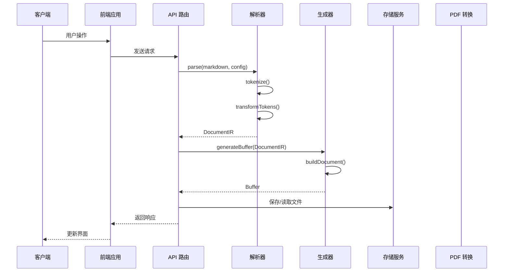
```mermaid
sequenceDiagram
participant Client as 客户端
participant Frontend as 前端应用
participant API as API 路由
participant Parser as 解析器
participant Generator as 生成器
participant Storage as 存储服务
participant LibreOffice as PDF 转换
Client->>Frontend : 用户操作
Frontend->>API : 发送请求
API->>Parser : parse(markdown, config)
Parser->>Parser : tokenize()
Parser->>Parser : transformTokens()
Parser-->>API : DocumentIR
API->>Generator : generateBuffer(DocumentIR)
Generator->>Generator : buildDocument()
Generator-->>API : Buffer
API->>Storage : 保存/读取文件
API-->>Frontend : 返回响应
Frontend-->>Client : 更新界面
```

**图表来源**
- [src/routes/api.ts:15-127](file://src/routes/api.ts#L15-L127)
- [src/parser/index.ts:11-21](file://src/parser/index.ts#L11-L21)
- [src/generator/document-builder.ts:108-112](file://src/generator/document-builder.ts#L108-L112)
- [src/wopi/storage.ts:19-25](file://src/wopi/storage.ts#L19-L25)

## 详细组件分析

### API 路由组件

API 路由系统是整个应用的核心接口，负责处理所有外部请求：

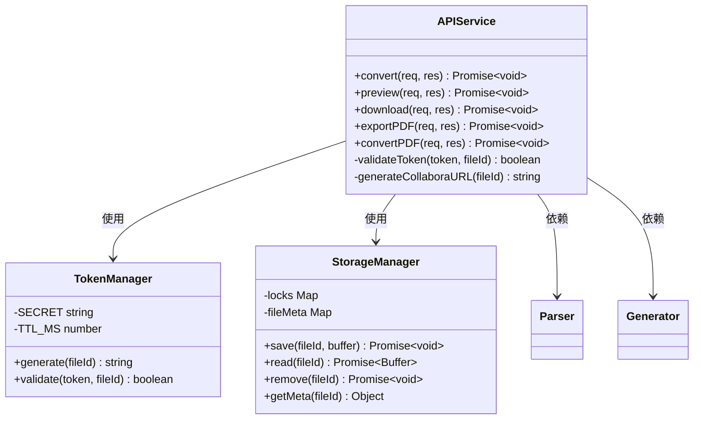
```mermaid
classDiagram
class APIService {
+convert(req, res) Promise~void~
+preview(req, res) Promise~void~
+download(req, res) Promise~void~
+exportPDF(req, res) Promise~void~
+convertPDF(req, res) Promise~void~
-validateToken(token, fileId) boolean
-generateCollaboraURL(fileId) string
}
class TokenManager {
+generate(fileId) string
+validate(token, fileId) boolean
-SECRET string
-TTL_MS number
}
class StorageManager {
+save(fileId, buffer) Promise~void~
+read(fileId) Promise~Buffer~
+remove(fileId) Promise~void~
+getMeta(fileId) Object
-locks Map
-fileMeta Map
}
APIService --> TokenManager : 使用
APIService --> StorageManager : 使用
APIService --> Parser : 依赖
APIService --> Generator : 依赖
```

**图表来源**
- [src/routes/api.ts:15-127](file://src/routes/api.ts#L15-L127)
- [src/wopi/token.ts:6-26](file://src/wopi/token.ts#L6-L26)
- [src/wopi/storage.ts:19-54](file://src/wopi/storage.ts#L19-L54)

#### 转换流程分析

转换过程涉及多个步骤的复杂数据流：

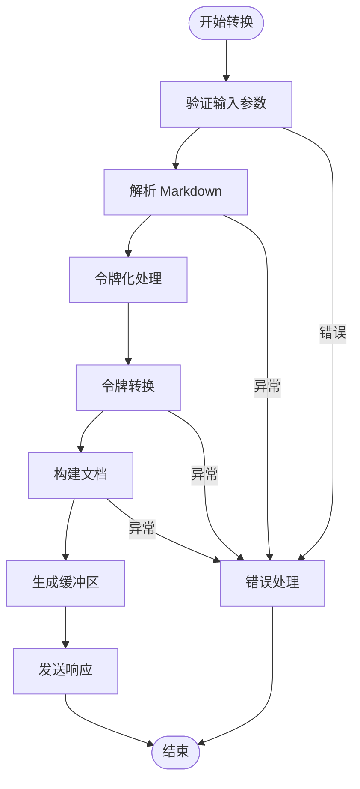
```mermaid
flowchart TD
Start([开始转换]) --> ValidateInput["验证输入参数"]
ValidateInput --> ParseMarkdown["解析 Markdown"]
ParseMarkdown --> Tokenize["令牌化处理"]
Tokenize --> Transform["令牌转换"]
Transform --> BuildDoc["构建文档"]
BuildDoc --> GenerateBuffer["生成缓冲区"]
GenerateBuffer --> SendResponse["发送响应"]
SendResponse --> End([结束])
ValidateInput --> |错误| ErrorHandler["错误处理"]
ErrorHandler --> End
ParseMarkdown --> |异常| ErrorHandler
Transform --> |异常| ErrorHandler
BuildDoc --> |异常| ErrorHandler
```

**图表来源**
- [src/routes/api.ts:15-34](file://src/routes/api.ts#L15-L34)
- [src/parser/index.ts:11-21](file://src/parser/index.ts#L11-L21)
- [src/generator/document-builder.ts:108-112](file://src/generator/document-builder.ts#L108-L112)

**章节来源**
- [src/routes/api.ts:15-127](file://src/routes/api.ts#L15-L127)
- [src/parser/index.ts:11-21](file://src/parser/index.ts#L11-L21)
- [src/generator/document-builder.ts:17-106](file://src/generator/document-builder.ts#L17-L106)

### 配置管理系统

配置系统采用类型安全的设计模式，确保运行时的配置正确性：

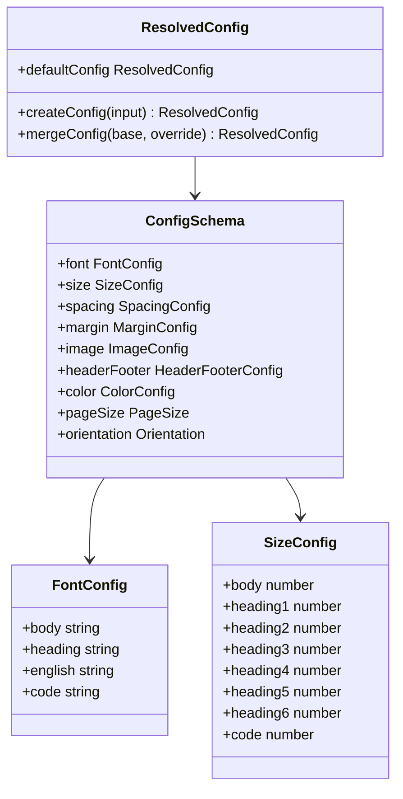
```mermaid
classDiagram
class ConfigSchema {
+font FontConfig
+size SizeConfig
+spacing SpacingConfig
+margin MarginConfig
+image ImageConfig
+headerFooter HeaderFooterConfig
+color ColorConfig
+pageSize PageSize
+orientation Orientation
}
class FontConfig {
+body string
+heading string
+english string
+code string
}
class SizeConfig {
+body number
+heading1 number
+heading2 number
+heading3 number
+heading4 number
+heading5 number
+heading6 number
+code number
}
class ResolvedConfig {
+createConfig(input) ResolvedConfig
+mergeConfig(base, override) ResolvedConfig
+defaultConfig ResolvedConfig
}
ConfigSchema --> FontConfig
ConfigSchema --> SizeConfig
ResolvedConfig --> ConfigSchema
```

**图表来源**
- [src/core/config.ts:54-81](file://src/core/config.ts#L54-L81)
- [src/core/types.ts:137-198](file://src/core/types.ts#L137-L198)

#### 配置验证流程

配置验证采用 Zod 库实现类型安全的验证：

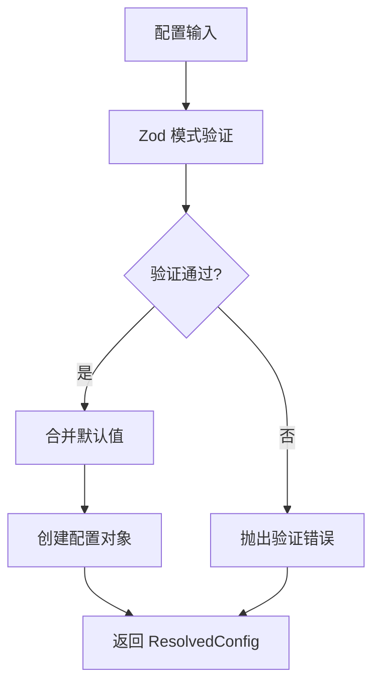
```mermaid
flowchart TD
Input[配置输入] --> Schema[Zod 模式验证]
Schema --> Valid{验证通过?}
Valid --> |是| Merge[合并默认值]
Valid --> |否| Error[抛出验证错误]
Merge --> CreateConfig[创建配置对象]
CreateConfig --> Output[返回 ResolvedConfig]
Error --> Output
```

**图表来源**
- [src/core/config.ts:68-81](file://src/core/config.ts#L68-L81)

**章节来源**
- [src/core/config.ts:1-91](file://src/core/config.ts#L1-L91)
- [src/core/types.ts:1-198](file://src/core/types.ts#L1-L198)

### 解析器组件

解析器系统基于 markdown-it 提供强大的 Markdown 解析能力：

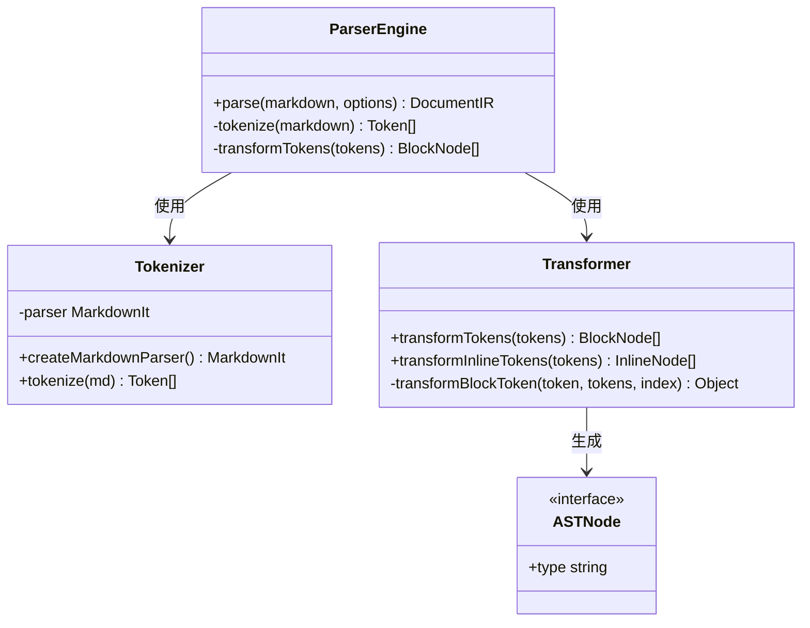
```mermaid
classDiagram
class ParserEngine {
+parse(markdown, options) DocumentIR
-tokenize(markdown) Token[]
-transformTokens(tokens) BlockNode[]
}
class Tokenizer {
+createMarkdownParser() MarkdownIt
+tokenize(md) Token[]
-parser MarkdownIt
}
class Transformer {
+transformTokens(tokens) BlockNode[]
+transformInlineTokens(tokens) InlineNode[]
-transformBlockToken(token, tokens, index) Object
}
class ASTNode {
<<interface>>
+type string
}
ParserEngine --> Tokenizer : 使用
ParserEngine --> Transformer : 使用
Transformer --> ASTNode : 生成
```

**图表来源**
- [src/parser/index.ts:11-21](file://src/parser/index.ts#L11-L21)
- [src/parser/tokenize.ts:12-15](file://src/parser/tokenize.ts#L12-L15)
- [src/parser/transformer.ts:25-39](file://src/parser/transformer.ts#L25-L39)

#### 令牌转换算法

令牌转换过程实现了复杂的语法树构建：

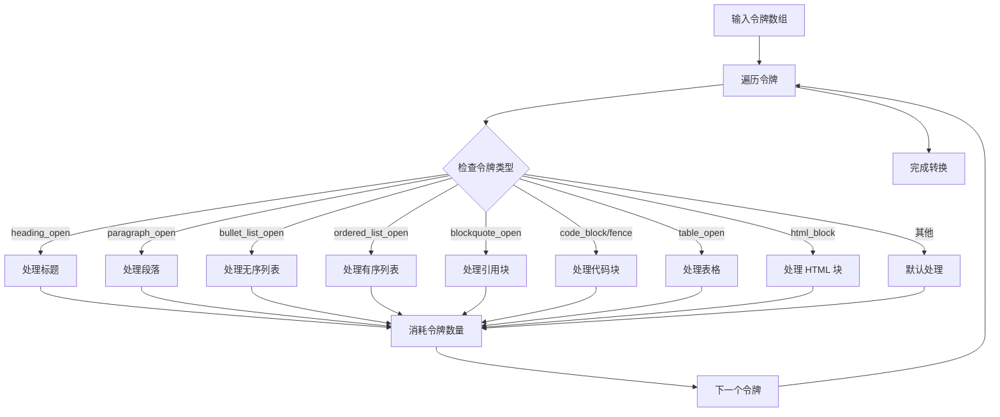
```mermaid
flowchart TD
Tokens[输入令牌数组] --> Loop[遍历令牌]
Loop --> CheckType{检查令牌类型}
CheckType --> |heading_open| Heading[处理标题]
CheckType --> |paragraph_open| Paragraph[处理段落]
CheckType --> |bullet_list_open| BulletList[处理无序列表]
CheckType --> |ordered_list_open| OrderedList[处理有序列表]
CheckType --> |blockquote_open| Blockquote[处理引用块]
CheckType --> |code_block/fence| CodeBlock[处理代码块]
CheckType --> |table_open| Table[处理表格]
CheckType --> |html_block| HTMLBlock[处理 HTML 块]
CheckType --> |其他| Default[默认处理]
Heading --> Consume[消耗令牌数量]
Paragraph --> Consume
BulletList --> Consume
OrderedList --> Consume
Blockquote --> Consume
CodeBlock --> Consume
Table --> Consume
HTMLBlock --> Consume
Default --> Consume
Consume --> Next[下一个令牌]
Next --> Loop
Loop --> Done[完成转换]
```

**图表来源**
- [src/parser/transformer.ts:41-122](file://src/parser/transformer.ts#L41-L122)
- [src/parser/transformer.ts:124-162](file://src/parser/transformer.ts#L124-L162)

**章节来源**
- [src/parser/index.ts:1-24](file://src/parser/index.ts#L1-L24)
- [src/parser/tokenize.ts:1-16](file://src/parser/tokenize.ts#L1-L16)
- [src/parser/transformer.ts:1-360](file://src/parser/transformer.ts#L1-L360)

### 生成器组件

生成器系统使用 docx 库创建高质量的 Word 文档：

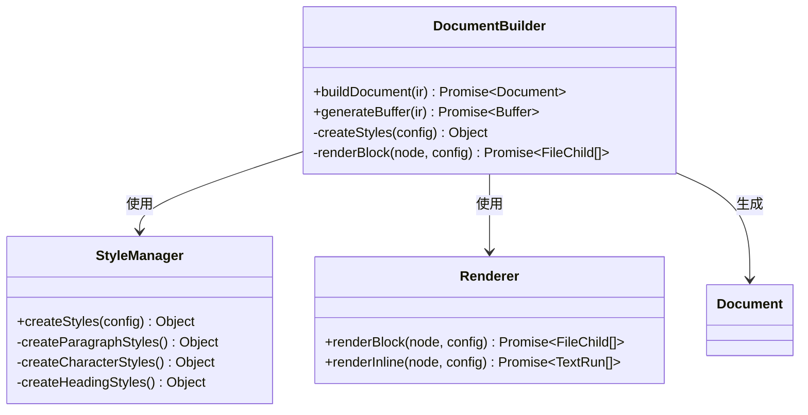
```mermaid
classDiagram
class DocumentBuilder {
+buildDocument(ir) Promise~Document~
+generateBuffer(ir) Promise~Buffer~
-createStyles(config) Object
-renderBlock(node, config) Promise~FileChild[]~
}
class StyleManager {
+createStyles(config) Object
-createParagraphStyles() Object
-createCharacterStyles() Object
-createHeadingStyles() Object
}
class Renderer {
+renderBlock(node, config) Promise~FileChild[]~
+renderInline(node, config) Promise~TextRun[]~
}
DocumentBuilder --> StyleManager : 使用
DocumentBuilder --> Renderer : 使用
DocumentBuilder --> Document : 生成
```

**图表来源**
- [src/generator/document-builder.ts:17-106](file://src/generator/document-builder.ts#L17-L106)
- [src/generator/styles.ts](file://src/generator/styles.ts)

#### 文档构建流程

文档构建过程涉及多层抽象和复杂的样式应用：

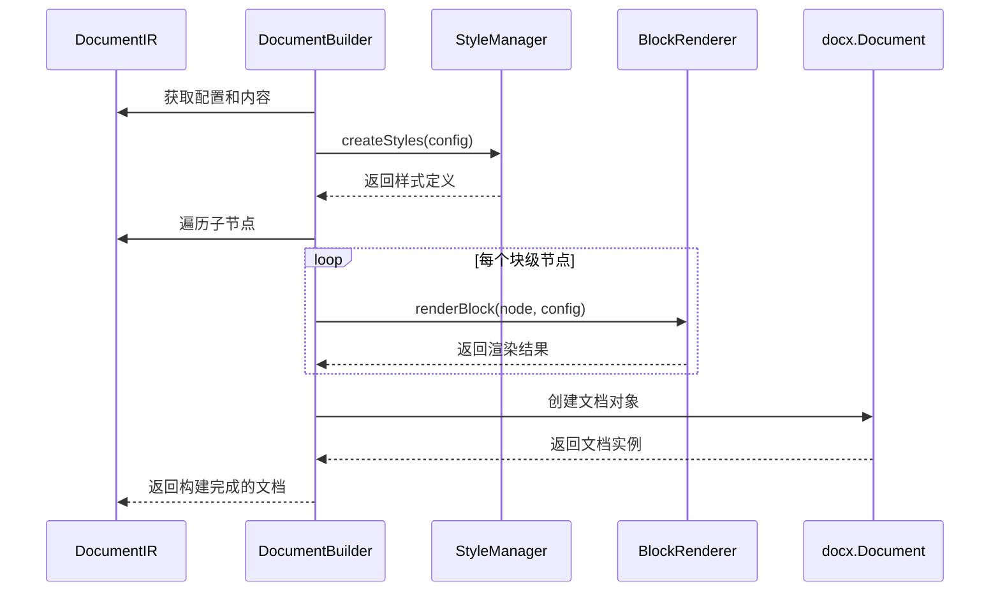
```mermaid
sequenceDiagram
participant IR as DocumentIR
participant Builder as DocumentBuilder
participant Styles as StyleManager
participant Renderer as BlockRenderer
participant Docx as docx.Document
Builder->>IR : 获取配置和内容
Builder->>Styles : createStyles(config)
Styles-->>Builder : 返回样式定义
Builder->>IR : 遍历子节点
loop 每个块级节点
Builder->>Renderer : renderBlock(node, config)
Renderer-->>Builder : 返回渲染结果
end
Builder->>Docx : 创建文档对象
Docx-->>Builder : 返回文档实例
Builder-->>IR : 返回构建完成的文档
```

**图表来源**
- [src/generator/document-builder.ts:17-106](file://src/generator/document-builder.ts#L17-L106)
- [src/generator/renderers/block.ts](file://src/generator/renderers/block.ts)

**章节来源**
- [src/generator/index.ts:1-21](file://src/generator/index.ts#L1-L21)
- [src/generator/document-builder.ts:1-112](file://src/generator/document-builder.ts#L1-L112)

## 前端集成架构

### React 前端应用

前端采用 React + TypeScript 构建，使用 Zustand 进行状态管理：

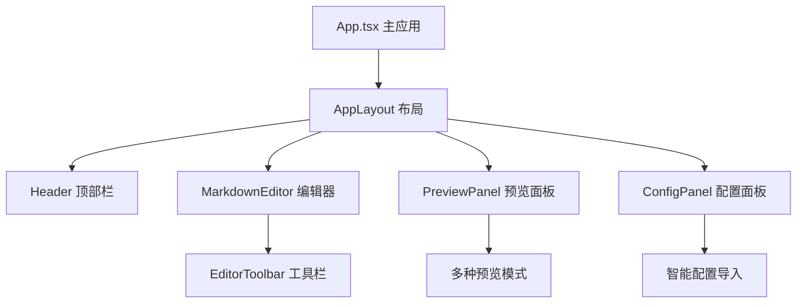
```mermaid
graph TB
App[App.tsx 主应用] --> Layout[AppLayout 布局]
Layout --> Header[Header 顶部栏]
Layout --> Editor[MarkdownEditor 编辑器]
Layout --> Preview[PreviewPanel 预览面板]
Layout --> Config[ConfigPanel 配置面板]
Editor --> Toolbar[EditorToolbar 工具栏]
Preview --> Modes[多种预览模式]
Config --> SmartConfig[智能配置导入]
```

**图表来源**
- [frontend/src/App.tsx:1-68](file://frontend/src/App.tsx#L1-L68)
- [frontend/src/components/editor/MarkdownEditor.tsx:1-125](file://frontend/src/components/editor/MarkdownEditor.tsx#L1-L125)
- [frontend/src/components/preview/PreviewPanel.tsx:1-86](file://frontend/src/components/preview/PreviewPanel.tsx#L1-L86)

#### 状态管理系统

使用 Zustand 实现全局状态管理：

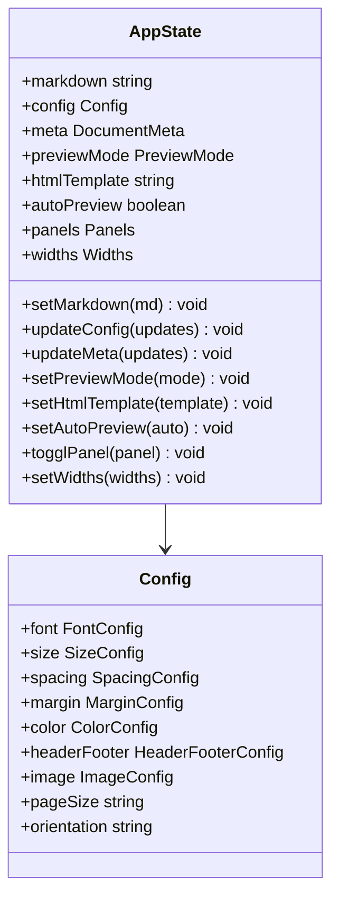
```mermaid
classDiagram
class AppState {
+markdown string
+config Config
+meta DocumentMeta
+previewMode PreviewMode
+htmlTemplate string
+autoPreview boolean
+panels Panels
+widths Widths
+setMarkdown(md) void
+updateConfig(updates) void
+updateMeta(updates) void
+setPreviewMode(mode) void
+setHtmlTemplate(template) void
+setAutoPreview(auto) void
+togglPanel(panel) void
+setWidths(widths) void
}
class Config {
+font FontConfig
+size SizeConfig
+spacing SpacingConfig
+margin MarginConfig
+color ColorConfig
+headerFooter HeaderFooterConfig
+image ImageConfig
+pageSize string
+orientation string
}
AppState --> Config
```

**图表来源**
- [frontend/src/store/useStore.ts:146-210](file://frontend/src/store/useStore.ts#L146-L210)

**章节来源**
- [frontend/src/App.tsx:1-68](file://frontend/src/App.tsx#L1-L68)
- [frontend/src/store/useStore.ts:1-210](file://frontend/src/store/useStore.ts#L1-L210)

### 前端 API 服务封装

提供统一的 API 服务接口：

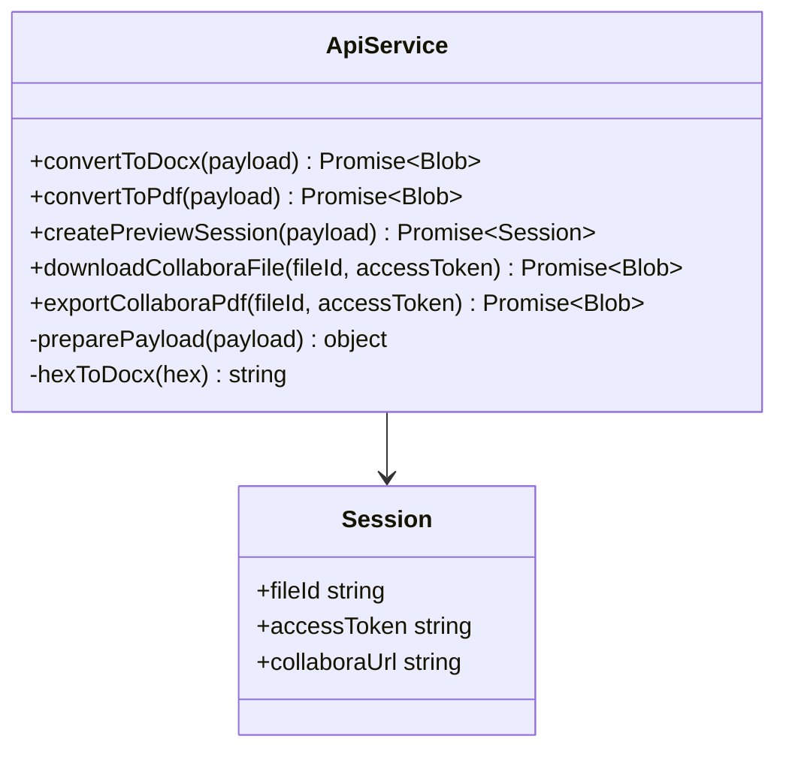
```mermaid
classDiagram
class ApiService {
+convertToDocx(payload) Promise~Blob~
+convertToPdf(payload) Promise~Blob~
+createPreviewSession(payload) Promise~Session~
+downloadCollaboraFile(fileId, accessToken) Promise~Blob~
+exportCollaboraPdf(fileId, accessToken) Promise~Blob~
-preparePayload(payload) object
-hexToDocx(hex) string
}
class Session {
+fileId string
+accessToken string
+collaboraUrl string
}
ApiService --> Session
```

**图表来源**
- [frontend/src/services/api.ts:31-83](file://frontend/src/services/api.ts#L31-L83)

#### 预览模式系统

支持五种不同的预览模式：

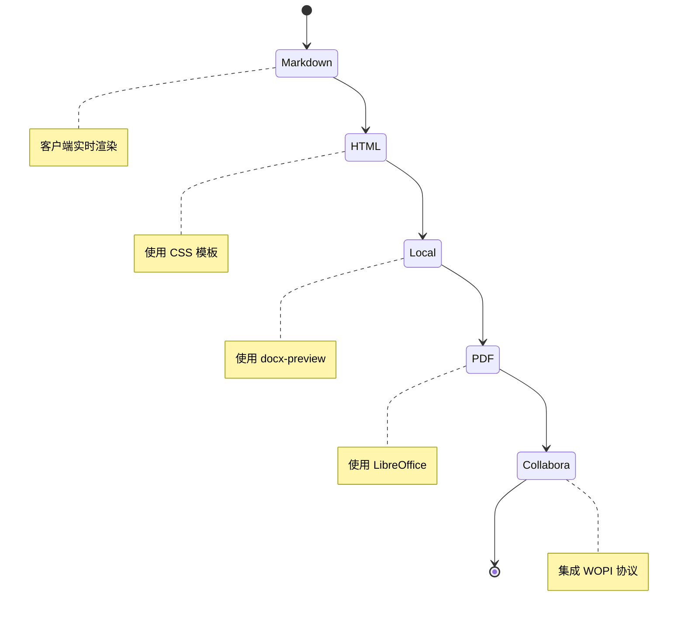
```mermaid
stateDiagram-v2
[*] --> Markdown
Markdown --> HTML
HTML --> Local
Local --> PDF
PDF --> Collabora
Collabora --> [*]
note right of Collabora : 集成 WOPI 协议
note right of PDF : 使用 LibreOffice
note right of Local : 使用 docx-preview
note right of HTML : 使用 CSS 模板
note right of Markdown : 客户端实时渲染
```

**图表来源**
- [frontend/src/store/useStore.ts:56](file://frontend/src/store/useStore.ts#L56)
- [frontend/src/components/preview/PreviewPanel.tsx:19-86](file://frontend/src/components/preview/PreviewPanel.tsx#L19-L86)

**章节来源**
- [frontend/src/services/api.ts:1-83](file://frontend/src/services/api.ts#L1-L83)
- [frontend/src/components/preview/PreviewPanel.tsx:1-86](file://frontend/src/components/preview/PreviewPanel.tsx#L1-L86)

## 协作编辑系统

### WOPI 协议集成

系统集成了 WOPIServer 协议，支持 Collabora 在线编辑：

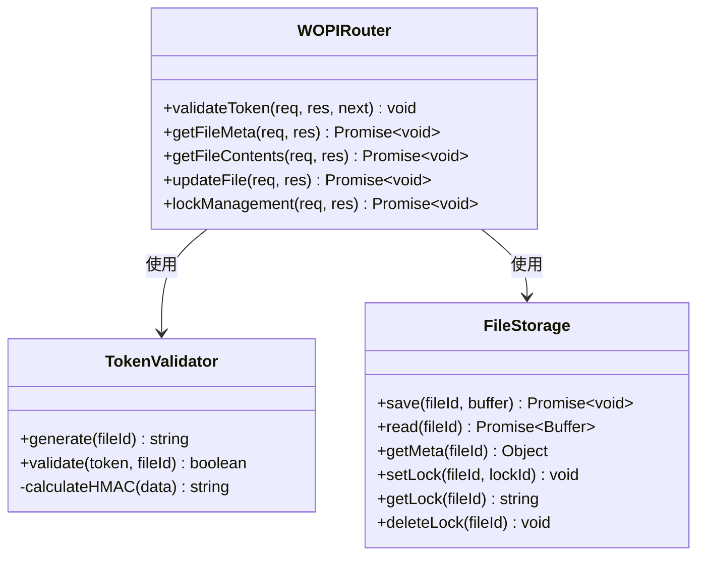
```mermaid
classDiagram
class WOPIRouter {
+validateToken(req, res, next) void
+getFileMeta(req, res) Promise~void~
+getFileContents(req, res) Promise~void~
+updateFile(req, res) Promise~void~
+lockManagement(req, res) Promise~void~
}
class TokenValidator {
+generate(fileId) string
+validate(token, fileId) boolean
-calculateHMAC(data) string
}
class FileStorage {
+save(fileId, buffer) Promise~void~
+read(fileId) Promise~Buffer~
+getMeta(fileId) Object
+setLock(fileId, lockId) void
+getLock(fileId) string
+deleteLock(fileId) void
}
WOPIRouter --> TokenValidator : 使用
WOPIRouter --> FileStorage : 使用
```

**图表来源**
- [src/wopi/index.ts:7-112](file://src/wopi/index.ts#L7-L112)
- [src/wopi/token.ts:6-26](file://src/wopi/token.ts#L6-L26)
- [src/wopi/storage.ts:19-71](file://src/wopi/storage.ts#L19-L71)

#### WOPI 锁机制

WOPIServer 协议实现了完整的文件锁定和并发控制：

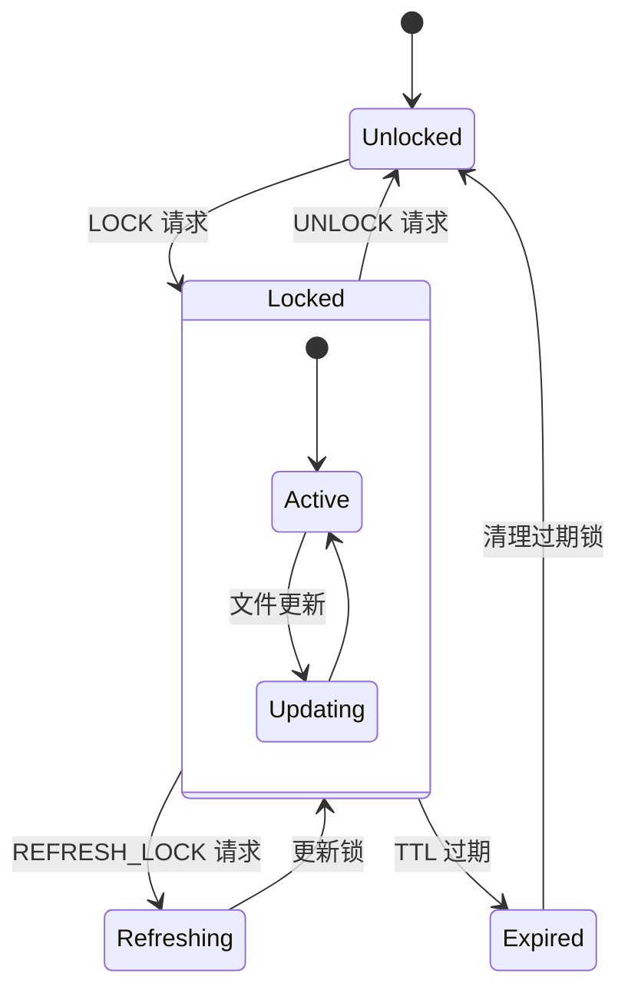
```mermaid
stateDiagram-v2
[*] --> Unlocked
Unlocked --> Locked : LOCK 请求
Locked --> Refreshing : REFRESH_LOCK 请求
Refreshing --> Locked : 更新锁
Locked --> Unlocked : UNLOCK 请求
Locked --> Expired : TTL 过期
Expired --> Unlocked : 清理过期锁
state Locked {
[*] --> Active
Active --> Updating : 文件更新
Updating --> Active
}
```

**图表来源**
- [src/wopi/index.ts:54-87](file://src/wopi/index.ts#L54-L87)
- [src/wopi/storage.ts:56-71](file://src/wopi/storage.ts#L56-L71)

**章节来源**
- [src/wopi/index.ts:1-112](file://src/wopi/index.ts#L1-L112)
- [src/wopi/token.ts:1-27](file://src/wopi/token.ts#L1-L27)
- [src/wopi/storage.ts:1-81](file://src/wopi/storage.ts#L1-L81)

### Collabora 在线编辑

预览功能通过 WOPI 协议使用 Collabora Online：

1. **服务器生成 DOCX 缓冲区 → 保存到临时存储**
2. **生成基于 HMAC 的访问令牌**
3. **返回带 WOPI 源的 Collabora iframe URL**
4. **Collabora 通过 WOPI 端点获取/保存**

**章节来源**
- [GEMINI.md:113-125](file://GEMINI.md#L113-L125)
- [src/routes/api.ts:36-59](file://src/routes/api.ts#L36-L59)

## 智能配置系统

### 多格式配置支持

系统支持三种配置格式的自动检测和转换：

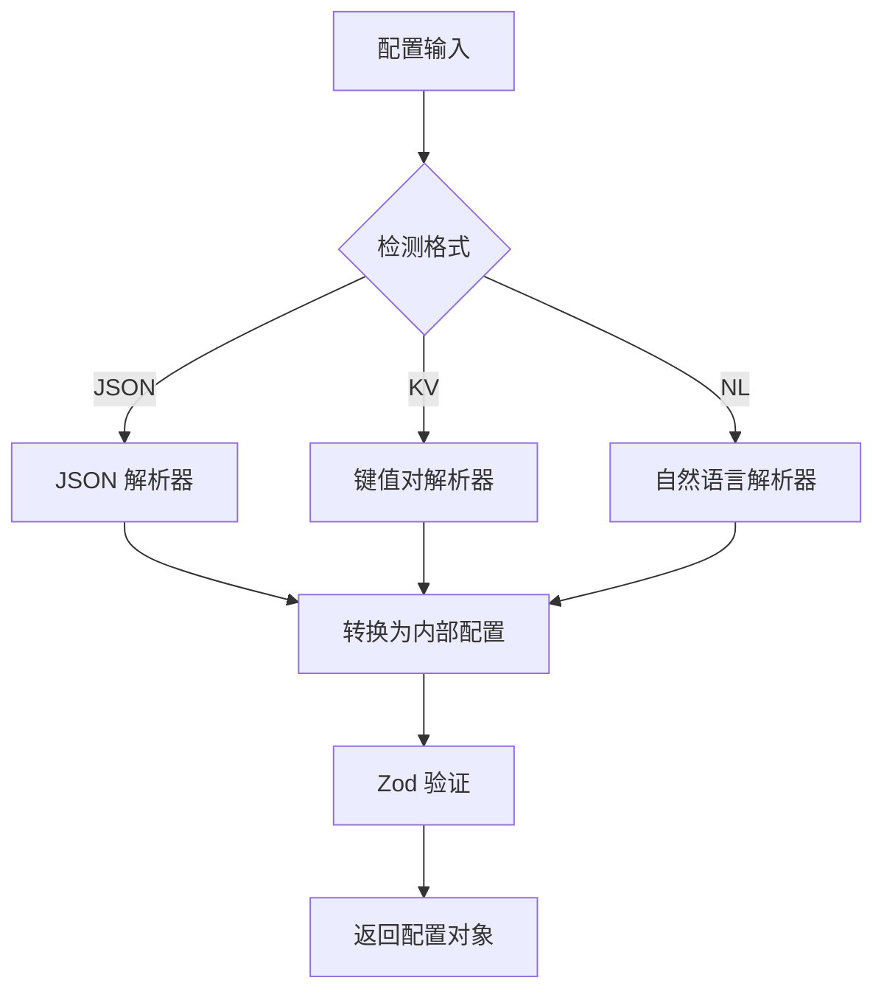
```mermaid
flowchart TD
Input[配置输入] --> Detect{检测格式}
Detect --> |JSON| JSONParser[JSON 解析器]
Detect --> |KV| KVParser[键值对解析器]
Detect --> |NL| NLParser[自然语言解析器]
JSONParser --> Transform[转换为内部配置]
KVParser --> Transform
NLParser --> Transform
Transform --> Validate[Zod 验证]
Validate --> Output[返回配置对象]
```

**图表来源**
- [frontend/src/utils/smartParser.ts:21-87](file://frontend/src/utils/smartParser.ts#L21-L87)

#### 配置模板系统

内置四种 HTML 创意模板：

1. **现代暗黑风格** - 深色主题，科技感设计
2. **玻璃拟态风格** - 半透明效果，现代简约
3. **杂志风格** - 经典排版，优雅设计
4. **霓虹网络风格** - 荧光色彩，未来感十足

**章节来源**
- [frontend/src/utils/templates.ts:1-166](file://frontend/src/utils/templates.ts#L1-L166)
- [frontend/src/utils/smartParser.ts:1-87](file://frontend/src/utils/smartParser.ts#L1-L87)
- [CONFIG_SPEC.md:1-314](file://CONFIG_SPEC.md#L1-L314)

## 颜色格式转换系统

### 自动颜色格式转换功能

**更新** 新增自动颜色格式转换功能，解决十六进制颜色值在 API 传输中的格式问题。

系统实现了完整的颜色格式转换机制，确保前端传入的十六进制颜色值能够正确传递到后端：

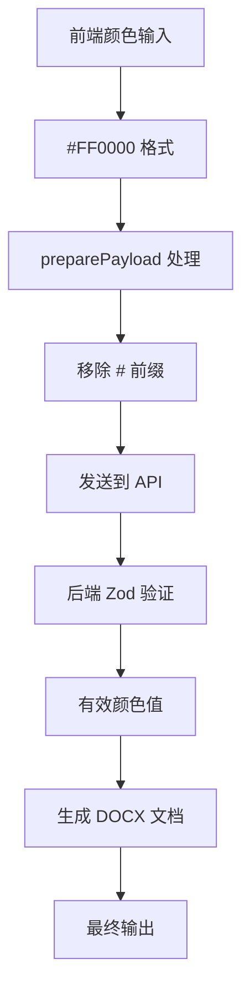
```mermaid
flowchart TD
Input[前端颜色输入] --> HexColor["#FF0000 格式"]
HexColor --> PreparePayload["preparePayload 处理"]
PreparePayload --> RemoveHash["移除 # 前缀"]
RemoveHash --> SendAPI["发送到 API"]
SendAPI --> BackendValidation["后端 Zod 验证"]
BackendValidation --> ValidColor["有效颜色值"]
ValidColor --> GenerateDocx["生成 DOCX 文档"]
GenerateDocx --> Output[最终输出]
```

**图表来源**
- [frontend/src/services/api.ts:15-29](file://frontend/src/services/api.ts#L15-L29)
- [src/core/config.ts:46-52](file://src/core/config.ts#L46-L52)

#### 颜色配置验证机制

后端使用 Zod 验证器确保颜色值的有效性：

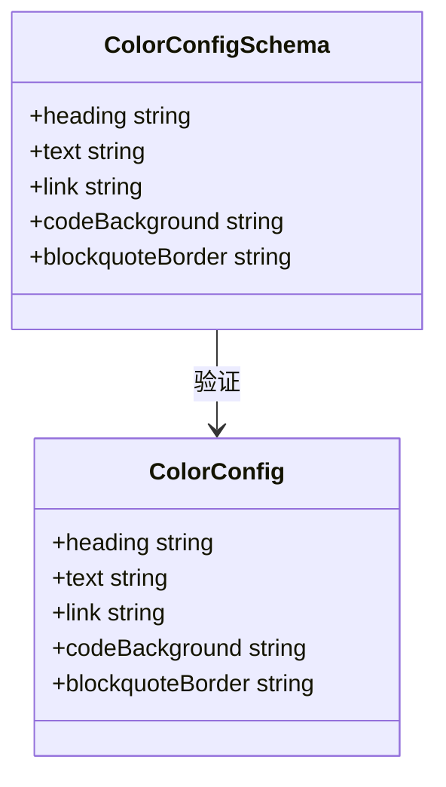
```mermaid
classDiagram
class ColorConfigSchema {
+heading string
+text string
+link string
+codeBackground string
+blockquoteBorder string
}
class ColorConfig {
+heading string
+text string
+link string
+codeBackground string
+blockquoteBorder string
}
ColorConfigSchema --> ColorConfig : 验证
```

**图表来源**
- [src/core/config.ts:46-52](file://src/core/config.ts#L46-L52)
- [src/core/types.ts:185-191](file://src/core/types.ts#L185-L191)

#### 颜色配置规范

系统支持以下颜色配置选项：

- **标题颜色** (`heading-color`)：默认 `#000000`
- **正文颜色** (`text-color`)：默认 `#000000`
- **链接颜色** (`link-color`)：默认 `#0563C1`
- **代码背景色** (`code-bg-color`)：默认 `#F5F5F5`
- **引用边框色** (`quote-border-color`)：默认 `#CCCCCC`

**章节来源**
- [frontend/src/services/api.ts:11-29](file://frontend/src/services/api.ts#L11-L29)
- [src/core/config.ts:46-52](file://src/core/config.ts#L46-L52)
- [src/core/types.ts:185-191](file://src/core/types.ts#L185-L191)

## 依赖关系分析

系统依赖关系清晰，采用模块化设计降低耦合度：

```mermaid
graph TB
subgraph "核心依赖"
Express[express ^5.2.1]
Docx[docx ^9.6.1]
LibreConvert[libreoffice-convert ^1.8.1]
MarkdownIt[markdown-it ^14.1.1]
Sharp[sharp ^0.34.5]
end
subgraph "前端依赖"
React[react ^18.2.0]
Zustand[zustand ^4.4.1]
CodeMirror[@uiw/react-codemirror ^4.0.0]
end
subgraph "验证库"
Zod[zod ^4.3.6]
end
subgraph "开发工具"
TypeScript[typescript ^6.0.3]
Vitest[vitest ^4.1.5]
Tsup[tsup ^8.5.1]
end
subgraph "运行时依赖"
CORS[cors ^2.8.6]
Dotenv[dotenv ^17.4.2]
FastXML[fast-xml-parser ^5.7.2]
LibreOffice[libreoffice ^0.4.5]
CollaboraOnline[Collabora Online]
end
API --> Express
Generator --> Docx
API --> LibreConvert
Parser --> MarkdownIt
Parser --> Sharp
Core --> Zod
Tests --> Vitest
Build --> Tsup
Server --> CORS
Server --> Dotenv
API --> FastXML
API --> LibreOffice
Frontend --> React
Frontend --> Zustand
Frontend --> CodeMirror
```

**图表来源**
- [package.json:29-57](file://package.json#L29-L57)

**章节来源**
- [package.json:1-57](file://package.json#L1-L57)

## 性能考虑

### 内存管理优化

系统在处理大文档时采用了多项内存优化策略：

1. **流式处理**：API 路由支持 10MB 限制的请求体大小
2. **临时文件管理**：WOPIServer 使用临时目录存储中间文件
3. **垃圾回收**：定期清理过期的临时文件和锁信息
4. **前端状态优化**：使用 Zustand 减少不必要的重渲染

### 并发处理

- **异步操作**：所有 I/O 操作都采用 Promise 和 async/await
- **连接池**：Express 应用程序支持多连接并发
- **超时控制**：LibreOffice 转换设置了合理的超时时间
- **前端防抖**：编辑器输入防抖 800ms，减少 API 调用频率

### 缓存策略

- **配置缓存**：解析后的配置对象可以重复使用
- **样式缓存**：生成的样式定义可以缓存避免重复计算
- **文件缓存**：WOPIServer 实现了文件元数据缓存
- **模板缓存**：HTML 模板在前端进行缓存

## 故障排除指南

### 常见错误类型

系统定义了多种错误类型以提供清晰的错误信息：

```mermaid
classDiagram
class ErrorTypes {
<<enumeration>>
+MarkdownParseError
+DocxGenerationError
+ImageProcessingError
+ConfigValidationError
+LibreOfficeError
+CollaboraError
}
class APIErrors {
+ValidationError
+AuthorizationError
+FileNotFoundError
+ConversionError
+PreviewError
}
ErrorTypes --> APIErrors : 映射
```

**图表来源**
- [src/core/errors.ts](file://src/core/errors.ts)

### 错误处理流程

```mermaid
flowchart TD
Request[API 请求] --> Validate[参数验证]
Validate --> Valid{验证通过?}
Valid --> |否| ValidationError[返回 400 错误]
Valid --> |是| Process[处理请求]
Process --> Success{处理成功?}
Success --> |否| InternalError[返回 500 错误]
Success --> |是| Response[返回成功响应]
ValidationError --> Log[记录日志]
InternalError --> Log
Response --> Log
Log --> End[结束]
```

### 调试建议

1. **启用详细日志**：查看控制台输出的错误信息
2. **检查环境变量**：确保 WOPI_SECRET 和其他配置正确设置
3. **验证输入格式**：确认 Markdown 内容格式正确
4. **监控资源使用**：注意内存和磁盘空间使用情况
5. **前端调试**：使用浏览器开发者工具检查 API 调用和状态变化

**章节来源**
- [src/routes/api.ts:27-33](file://src/routes/api.ts#L27-L33)
- [src/routes/api.ts:52-58](file://src/routes/api.ts#L52-L58)
- [src/routes/api.ts:90-99](file://src/routes/api.ts#L90-L99)

## 结论

该 Markdown 到 Word 转换器现已发展为功能完整的前端集成解决方案，具有以下优势：

1. **现代化架构**：前后端分离设计，采用 React + TypeScript 构建
2. **模块化设计**：清晰的组件分离便于维护和扩展
3. **类型安全**：使用 TypeScript 和 Zod 确保运行时安全
4. **功能完整**：支持转换、预览、导出、协作编辑等多种功能
5. **协议兼容**：集成 WOPIServer 支持在线协作编辑
6. **智能配置**：支持多种配置格式和自然语言描述
7. **性能优化**：采用异步处理、内存优化和前端状态管理
8. **用户体验**：提供丰富的预览模式和实时编辑体验
9. **颜色格式转换**：自动处理十六进制颜色值，确保跨平台兼容性
10. **增强的协作编辑**：完整的 Collabora 集成，支持在线文档编辑

**更新** 最新的功能改进包括：
- **自动颜色格式转换**：前端自动移除颜色值的 `#` 前缀，确保与后端验证器兼容
- **增强的 Collabora 集成**：提供完整的在线协作编辑体验，支持文件下载和 PDF 导出
- **改进的 API 功能**：优化预览会话管理和文件操作流程

系统适合在企业环境中部署，为用户提供从 Markdown 内容到专业 Word 文档的完整解决方案。通过合理的配置管理和错误处理机制，确保了系统的稳定性和可靠性。增强的前端集成为用户提供了更加直观和高效的文档编辑体验。