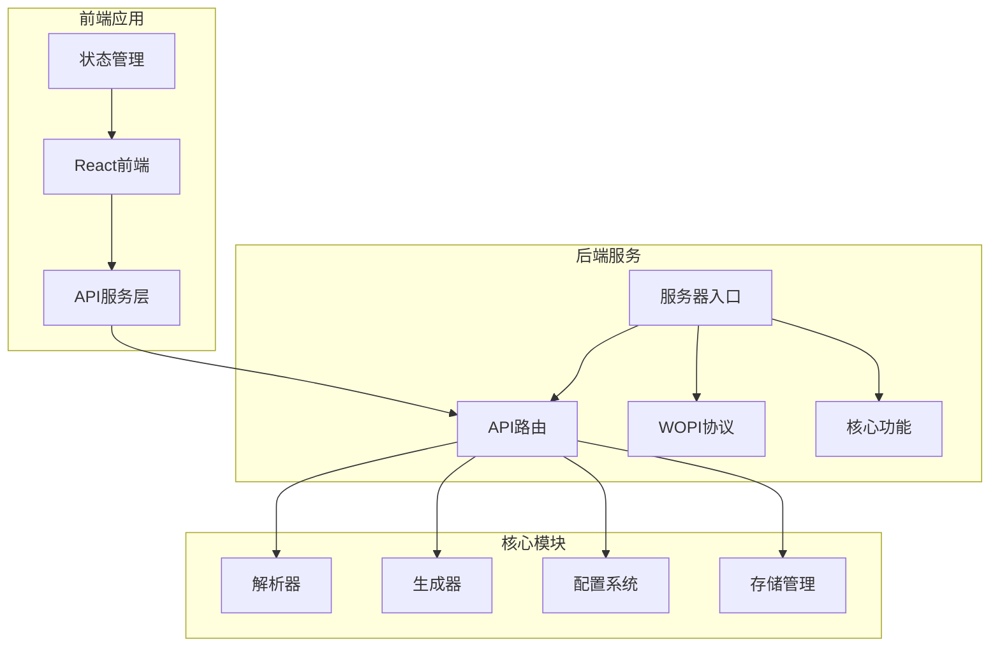
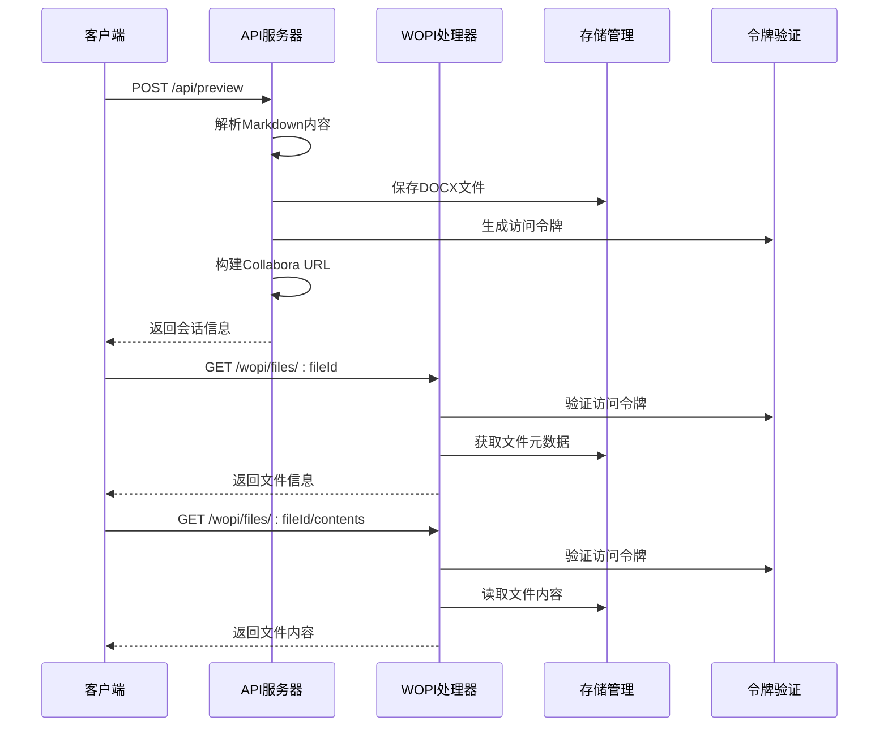
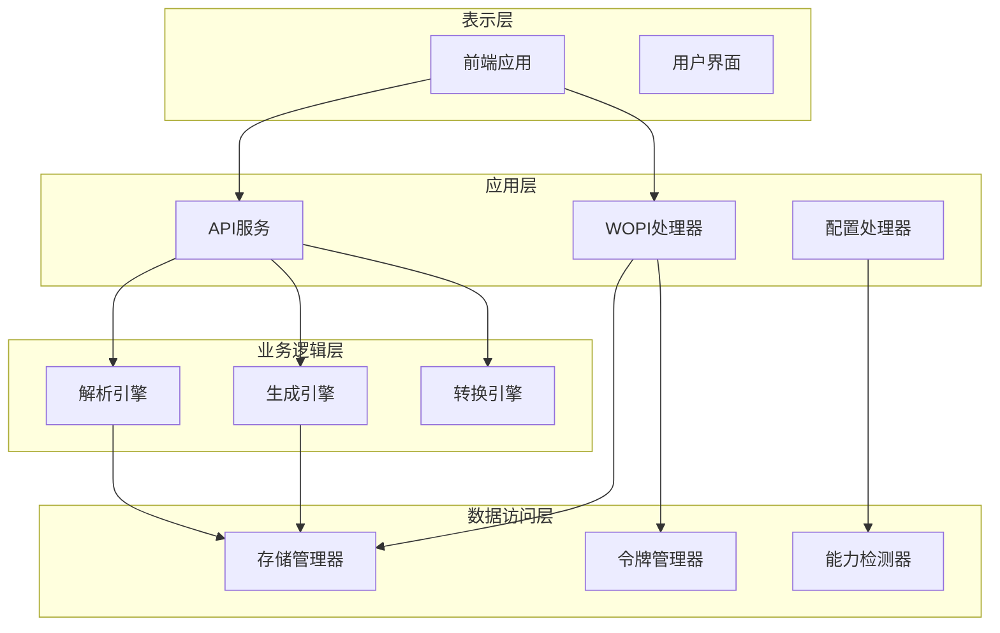
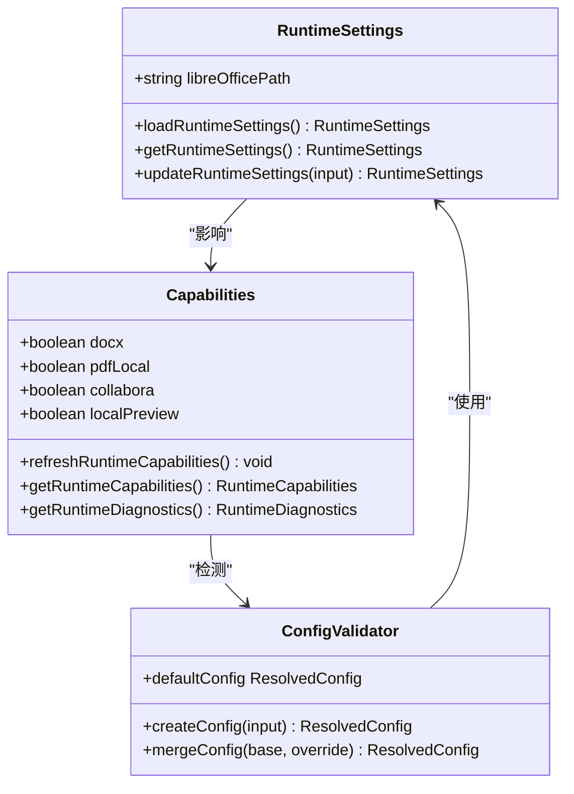
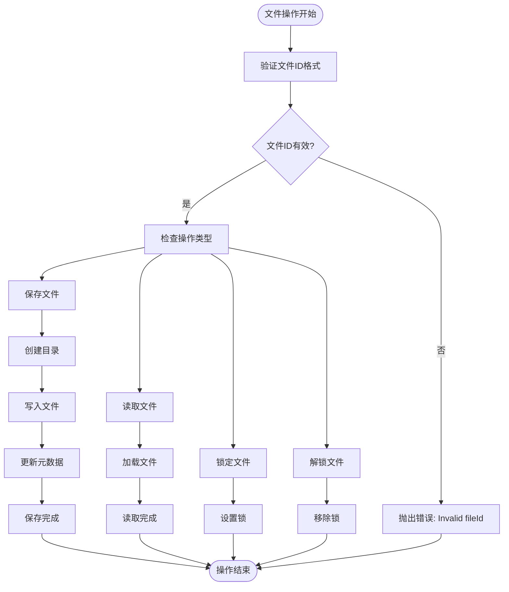
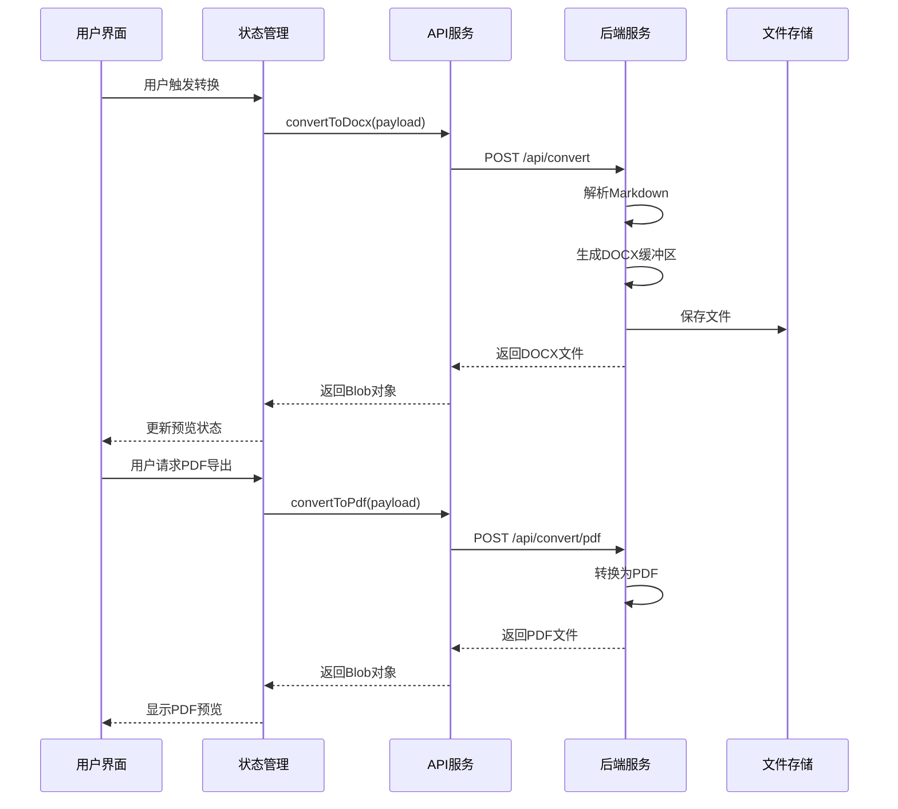
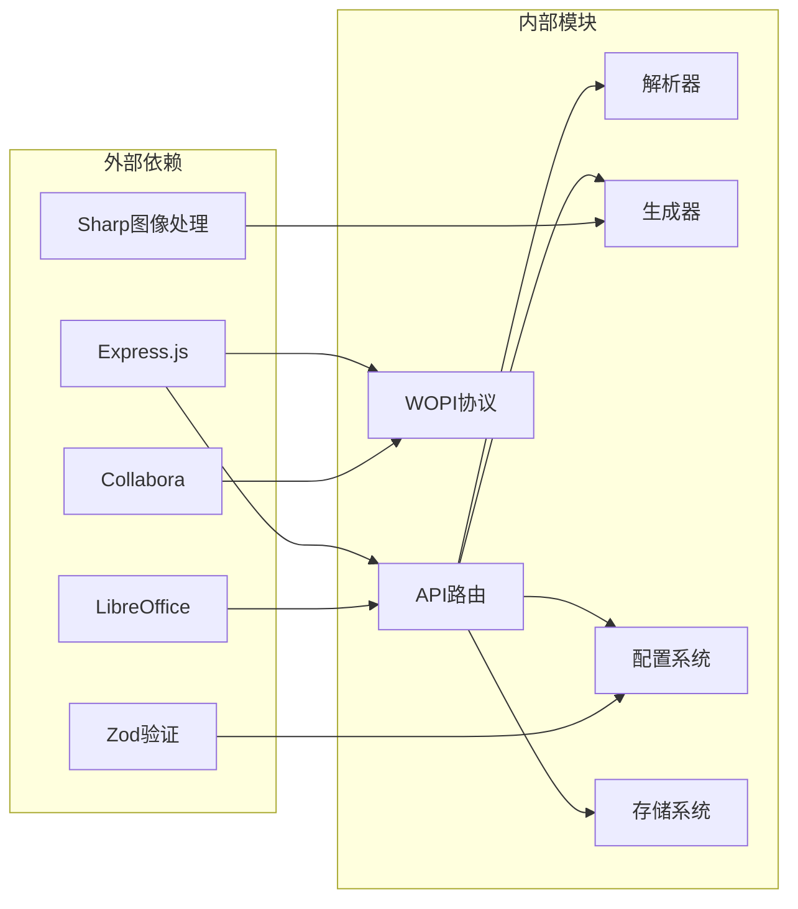

# 增强的API端点

<cite>
**本文档中引用的文件**
- [src/routes/api.ts](file://src/routes/api.ts)
- [src/server.ts](file://src/server.ts)
- [src/wopi/index.ts](file://src/wopi/index.ts)
- [src/wopi/token.ts](file://src/wopi/token.ts)
- [src/wopi/storage.ts](file://src/wopi/storage.ts)
- [src/wopi/discovery.ts](file://src/wopi/discovery.ts)
- [src/core/capabilities.ts](file://src/core/capabilities.ts)
- [src/core/runtimesettings.ts](file://src/core/runtime-settings.ts)
- [src/core/config.ts](file://src/core/config.ts)
- [src/core/types.ts](file://src/core/types.ts)
- [frontend/src/services/api.ts](file://frontend/src/services/api.ts)
- [frontend/src/store/useStore.ts](file://frontend/src/store/useStore.ts)
- [frontend/src/App.tsx](file://frontend/src/App.tsx)
- [package.json](file://package.json)
</cite>

## 目录
1. [简介](#简介)
2. [项目结构](#项目结构)
3. [核心组件](#核心组件)
4. [架构概览](#架构概览)
5. [详细组件分析](#详细组件分析)
6. [依赖关系分析](#依赖关系分析)
7. [性能考虑](#性能考虑)
8. [故障排除指南](#故障排除指南)
9. [结论](#结论)

## 简介

这是一个基于 Node.js 的 Markdown 到 Word 文档转换服务，提供了完整的 API 端点来处理文档转换、预览和协作编辑功能。该系统支持多种输出格式（DOCX 和 PDF），集成了 Collabora 在线办公套件进行实时协作编辑，并提供了灵活的配置选项来自定义文档样式。

## 项目结构

项目采用模块化架构设计，主要分为以下几个核心部分：

**图表来源**
- [src/server.ts:1-53](file://src/server.ts#L1-L53)
- [src/routes/api.ts:1-196](file://src/routes/api.ts#L1-L196)

**章节来源**
- [src/server.ts:1-53](file://src/server.ts#L1-L53)
- [package.json:1-59](file://package.json#L1-L59)

## 核心组件

### API 路由系统

系统提供了一组完整的 API 端点，涵盖文档转换、预览、协作编辑和运行时配置等功能：

| 端点 | 方法 | 描述 | 功能 |
|------|------|------|------|
| `/api/runtime/settings` | GET/POST | 运行时设置管理 | 获取和更新 LibreOffice 路径配置 |
| `/api/convert` | POST | DOCX 转换 | 将 Markdown 转换为 DOCX 文件 |
| `/api/convert/pdf` | POST | PDF 转换 | 将 Markdown 转换为 PDF 文件 |
| `/api/preview` | POST | 预览会话创建 | 创建 Collabora 协作编辑会话 |
| `/api/files/:fileId/download` | GET | 文件下载 | 下载协作编辑的 DOCX 文件 |
| `/api/files/:fileId/export/pdf` | POST | PDF 导出 | 将协作文件导出为 PDF |

### WOPI 协议支持

系统实现了完整的 WOPI（Web Application Open Platform Interface）协议，支持与 Collabora 在线办公套件的集成：

**图表来源**
- [src/routes/api.ts:84-114](file://src/routes/api.ts#L84-L114)
- [src/wopi/index.ts:18-47](file://src/wopi/index.ts#L18-L47)

**章节来源**
- [src/routes/api.ts:17-196](file://src/routes/api.ts#L17-L196)
- [src/wopi/index.ts:1-112](file://src/wopi/index.ts#L1-L112)

## 架构概览

系统采用分层架构设计，确保了良好的可维护性和扩展性：

**图表来源**
- [src/server.ts:14-26](file://src/server.ts#L14-L26)
- [src/core/capabilities.ts:68-90](file://src/core/capabilities.ts#L68-L90)

## 详细组件分析

### 运行时配置系统

运行时配置系统允许动态调整应用程序的行为，特别是 LibreOffice 的路径配置：

**图表来源**
- [src/core/runtime-settings.ts:4-42](file://src/core/runtime-settings.ts#L4-L42)
- [src/core/capabilities.ts:5-111](file://src/core/capabilities.ts#L5-L111)
- [src/core/config.ts:68-91](file://src/core/config.ts#L68-L91)

### 文件存储和安全机制

系统实现了基于临时文件的存储机制，配合 HMAC 令牌验证确保文件访问的安全性：

**图表来源**
- [src/wopi/storage.ts:19-54](file://src/wopi/storage.ts#L19-L54)
- [src/wopi/token.ts:6-26](file://src/wopi/token.ts#L6-L26)

**章节来源**
- [src/core/runtime-settings.ts:14-41](file://src/core/runtime-settings.ts#L14-L41)
- [src/core/capabilities.ts:68-110](file://src/core/capabilities.ts#L68-L110)
- [src/wopi/storage.ts:19-81](file://src/wopi/storage.ts#L19-L81)
- [src/wopi/token.ts:6-26](file://src/wopi/token.ts#L6-L26)

### 前端 API 服务集成

前端通过统一的 API 服务层与后端进行交互，提供了类型安全的接口：

**图表来源**
- [frontend/src/services/api.ts:78-102](file://frontend/src/services/api.ts#L78-L102)
- [frontend/src/App.tsx:33-39](file://frontend/src/App.tsx#L33-L39)

**章节来源**
- [frontend/src/services/api.ts:52-129](file://frontend/src/services/api.ts#L52-L129)
- [frontend/src/store/useStore.ts:208-291](file://frontend/src/store/useStore.ts#L208-L291)

## 依赖关系分析

系统的关键依赖关系如下：

**图表来源**
- [package.json:36-47](file://package.json#L36-L47)
- [src/server.ts:1-53](file://src/server.ts#L1-L53)

**章节来源**
- [package.json:36-59](file://package.json#L36-L59)
- [src/server.ts:1-53](file://src/server.ts#L1-L53)

## 性能考虑

系统在设计时考虑了多个性能优化方面：

### 内存管理
- 使用流式处理避免大文件内存溢出
- 实现文件缓存清理机制防止磁盘空间耗尽
- 限制请求体大小防止资源滥用

### 缓存策略
- 运行时能力检测结果缓存
- 配置信息本地缓存
- 前端状态持久化到本地存储

### 并发处理
- 异步文件操作避免阻塞主线程
- 并发请求处理能力
- 连接池管理

## 故障排除指南

### 常见问题及解决方案

| 问题类型 | 错误代码 | 可能原因 | 解决方案 |
|----------|----------|----------|----------|
| LibreOffice 未找到 | 503 | soffice 命令不可用 | 设置 LIBREOFFICE_PATH 环境变量 |
| Collabora 不可用 | 503 | discovery.xml 获取失败 | 检查 CODE_URL 配置 |
| 文件ID无效 | 400 | UUID 格式不正确 | 验证文件ID格式 |
| 访问令牌过期 | 401 | 令牌超时 | 重新生成访问令牌 |
| 内存不足 | 500 | 大文件处理 | 增加内存限制或优化配置 |

### 调试技巧

1. **启用详细日志**：检查控制台输出的错误信息
2. **验证环境变量**：确认所有必需的环境变量已正确设置
3. **测试依赖项**：验证 LibreOffice 和 Collabora 是否正常运行
4. **监控资源使用**：观察内存和 CPU 使用情况

**章节来源**
- [src/routes/api.ts:75-82](file://src/routes/api.ts#L75-L82)
- [src/wopi/storage.ts:13-17](file://src/wopi/storage.ts#L13-L17)
- [src/wopi/token.ts:14-26](file://src/wopi/token.ts#L14-L26)

## 结论

该增强的 API 端点系统提供了完整的 Markdown 到 Word 文档转换解决方案，具有以下特点：

### 主要优势
- **模块化设计**：清晰的分层架构便于维护和扩展
- **安全性**：完善的文件访问控制和令牌验证机制
- **灵活性**：支持多种输出格式和自定义配置
- **协作能力**：集成 Collabora 实现实时协作编辑
- **性能优化**：合理的资源管理和并发处理

### 技术亮点
- 基于 WOPI 协议的标准化集成
- 类型安全的配置验证系统
- 灵活的运行时配置管理
- 完善的错误处理和诊断机制

该系统为企业级文档处理提供了可靠的技术基础，可以根据具体需求进一步扩展功能和优化性能。