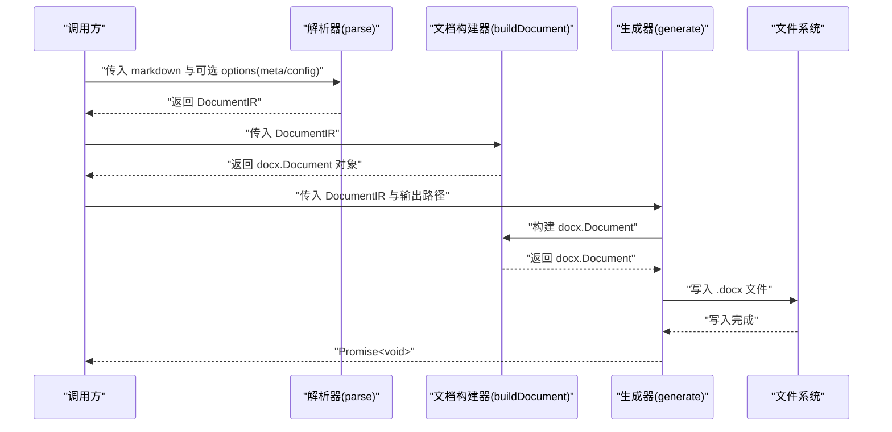
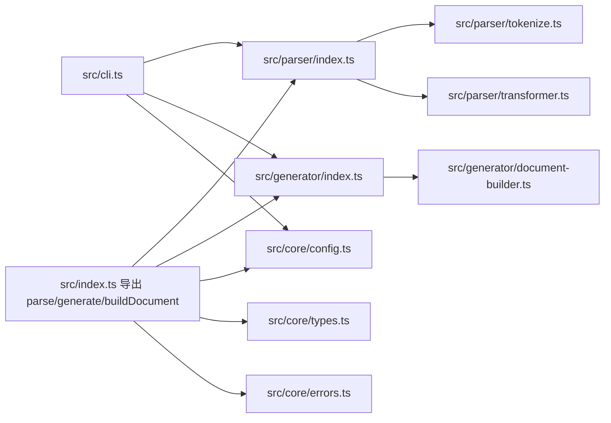

# 核心 API

<cite>
**本文档引用的文件**
- [src/index.ts](file://src/index.ts)
- [src/parser/index.ts](file://src/parser/index.ts)
- [src/parser/tokenize.ts](file://src/parser/tokenize.ts)
- [src/parser/transformer.ts](file://src/parser/transformer.ts)
- [src/generator/index.ts](file://src/generator/index.ts)
- [src/generator/document-builder.ts](file://src/generator/document-builder.ts)
- [src/core/types.ts](file://src/core/types.ts)
- [src/core/config.ts](file://src/core/config.ts)
- [src/core/errors.ts](file://src/core/errors.ts)
- [src/cli.ts](file://src/cli.ts)
- [tests/e2e/full-pipeline.test.ts](file://tests/e2e/full-pipeline.test.ts)
- [tests/unit/parser/transformer.test.ts](file://tests/unit/parser/transformer.test.ts)
- [tests/fixtures/markdown/sample.md](file://tests/fixtures/markdown/sample.md)
</cite>

## 目录
1. [简介](#简介)
2. [项目结构](#项目结构)
3. [核心组件](#核心组件)
4. [架构总览](#架构总览)
5. [详细组件分析](#详细组件分析)
6. [依赖关系分析](#依赖关系分析)
7. [性能考虑](#性能考虑)
8. [故障排除指南](#故障排除指南)
9. [结论](#结论)
10. [附录](#附录)

## 简介
本文件聚焦于项目的核心 API：parse()、generate() 和 buildDocument()，并配套说明与之密切相关的数据模型与配置体系。目标是帮助开发者准确理解这些 API 的参数、返回值、使用方式、错误处理与典型应用场景，从而高效完成从 Markdown 到 Word（.docx）的转换。

## 项目结构
项目采用模块化设计，核心能力由解析器（parser）、生成器（generator）与核心类型/配置/错误定义组成，并通过统一出口导出供 CLI、服务端或直接调用使用。

```mermaid
graph TB
subgraph "导出入口"
IDX["src/index.ts"]
end
subgraph "解析器"
PIDX["src/parser/index.ts"]
PTZ["src/parser/tokenize.ts"]
PTR["src/parser/transformer.ts"]
end
subgraph "生成器"
GIDX["src/generator/index.ts"]
DBLD["src/generator/document-builder.ts"]
end
subgraph "核心类型与配置"
TYP["src/core/types.ts"]
CFG["src/core/config.ts"]
ERR["src/core/errors.ts"]
end
subgraph "CLI"
CLI["src/cli.ts"]
end
IDX --> PIDX
IDX --> GIDX
IDX --> CFG
IDX --> TYP
IDX --> ERR
PIDX --> PTZ
PIDX --> PTR
GIDX --> DBLD
CLI --> PIDX
CLI --> GIDX
CLI --> CFG
```

图表来源
- [src/index.ts:1-25](file://src/index.ts#L1-L25)
- [src/parser/index.ts:1-24](file://src/parser/index.ts#L1-L24)
- [src/parser/tokenize.ts:1-16](file://src/parser/tokenize.ts#L1-L16)
- [src/parser/transformer.ts:1-360](file://src/parser/transformer.ts#L1-L360)
- [src/generator/index.ts:1-21](file://src/generator/index.ts#L1-L21)
- [src/generator/document-builder.ts:1-112](file://src/generator/document-builder.ts#L1-L112)
- [src/core/types.ts:1-198](file://src/core/types.ts#L1-L198)
- [src/core/config.ts:1-91](file://src/core/config.ts#L1-L91)
- [src/core/errors.ts:1-28](file://src/core/errors.ts#L1-L28)
- [src/cli.ts:1-113](file://src/cli.ts#L1-L113)

章节来源
- [src/index.ts:1-25](file://src/index.ts#L1-L25)

## 核心组件
- 解析器（parse）：将 Markdown 文本解析为内部 IR（文档中间表示），包含元信息与配置。
- 生成器（generate）：将 IR 渲染为 docx 文件，写入指定路径。
- 文档构建器（buildDocument）：将 IR 转换为 docx 库的 Document 对象，供打包为文件或 Buffer 使用。
- 类型系统（types）：定义 IR、块级节点、行内节点、配置等数据结构。
- 配置系统（config）：提供默认配置、校验与合并能力。
- 错误体系（errors）：针对解析、生成、图片处理、配置校验的专用错误类型。

章节来源
- [src/parser/index.ts:11-21](file://src/parser/index.ts#L11-L21)
- [src/generator/index.ts:7-18](file://src/generator/index.ts#L7-L18)
- [src/generator/document-builder.ts:17-106](file://src/generator/document-builder.ts#L17-L106)
- [src/core/types.ts:1-198](file://src/core/types.ts#L1-L198)
- [src/core/config.ts:68-91](file://src/core/config.ts#L68-L91)
- [src/core/errors.ts:1-28](file://src/core/errors.ts#L1-L28)

## 架构总览
整体流程：CLI/调用方提供 Markdown 字符串 → 解析器生成 IR → 文档构建器渲染为 docx 对象 → 生成器写入文件或导出 Buffer。



图表来源
- [src/parser/index.ts:11-21](file://src/parser/index.ts#L11-L21)
- [src/generator/index.ts:7-18](file://src/generator/index.ts#L7-L18)
- [src/generator/document-builder.ts:17-106](file://src/generator/document-builder.ts#L17-L106)

## 详细组件分析

### parse() 函数
- 功能概述
  - 将 Markdown 文本解析为内部 IR（DocumentIR），包含文档类型、元信息、配置与块级节点树。
- 参数
  - markdown: string（必需）
  - options: ParseOptions（可选）
    - meta?: DocumentMeta（可选）
      - title?: string
      - author?: string
      - date?: string
    - config?: ResolvedConfig（可选）
- 返回值
  - DocumentIR
    - type: 'document'
    - meta: DocumentMeta
    - config: ResolvedConfig
    - children: BlockNode[]
- 处理流程
  - 使用 tokenize() 生成 Token 列表
  - 使用 transformTokens() 将 Token 转换为 BlockNode[]
  - 组装 DocumentIR，未提供的 meta/config 将使用默认值
- 典型使用场景
  - 从文件读取 Markdown 后立即解析为 IR，再交由生成器处理
  - 在 CLI 中结合用户传入的元信息与配置进行解析
- 错误处理
  - 解析阶段主要依赖底层解析器与转换器；若需捕获解析错误，建议在调用方捕获并包装为业务错误
- 参考实现位置
  - [src/parser/index.ts:11-21](file://src/parser/index.ts#L11-L21)
  - [src/parser/tokenize.ts:12-15](file://src/parser/tokenize.ts#L12-L15)
  - [src/parser/transformer.ts:25-39](file://src/parser/transformer.ts#L25-L39)
  - [src/core/types.ts:1-12](file://src/core/types.ts#L1-L12)
  - [src/core/config.ts:90](file://src/core/config.ts#L90)

章节来源
- [src/parser/index.ts:6-21](file://src/parser/index.ts#L6-L21)
- [src/parser/tokenize.ts:12-15](file://src/parser/tokenize.ts#L12-L15)
- [src/parser/transformer.ts:25-39](file://src/parser/transformer.ts#L25-L39)
- [src/core/types.ts:1-12](file://src/core/types.ts#L1-L12)
- [src/core/config.ts:90](file://src/core/config.ts#L90)

### generate() 函数
- 功能概述
  - 将 DocumentIR 渲染为 docx 文件并写入指定输出路径
- 参数
  - ir: DocumentIR（必需）
  - outputPath: string（必需）
- 返回值
  - Promise<void>
- 处理流程
  - 调用 buildDocument() 构建 docx.Document
  - 使用 docx.Packer 将 Document 转为 Buffer
  - 写入文件到 outputPath
- 配置选项
  - 通过 DocumentIR.config 控制字体、字号、间距、页边距、页码、方向等
- 输出格式
  - .docx 文件（ZIP 容器，内部包含 XML）
- 典型使用场景
  - CLI 工具链：解析后直接生成 .docx 文件
  - 服务端批量转换：接收 IR 并写出文件
- 错误处理
  - 任何阶段失败都会抛出 DocxGenerationError，包含原始错误上下文
- 参考实现位置
  - [src/generator/index.ts:7-18](file://src/generator/index.ts#L7-L18)
  - [src/generator/document-builder.ts:17-106](file://src/generator/document-builder.ts#L17-L106)
  - [src/core/errors.ts:8-13](file://src/core/errors.ts#L8-L13)

章节来源
- [src/generator/index.ts:7-18](file://src/generator/index.ts#L7-L18)
- [src/generator/document-builder.ts:17-106](file://src/generator/document-builder.ts#L17-L106)
- [src/core/errors.ts:8-13](file://src/core/errors.ts#L8-L13)

### buildDocument() 函数
- 功能概述
  - 将 DocumentIR 转换为 docx.Document 对象，供后续打包或进一步处理
- 参数
  - ir: DocumentIR（必需）
- 返回值
  - Promise<Document>（docx.Document 实例）
- 处理流程
  - 依据 ir.config 创建样式
  - 遍历 ir.children，逐个渲染为 docx 段落/表格等元素
  - 构建页眉/页脚（可选），设置页面方向与页边距
  - 返回包含样式与节（Section）的 Document
- 输出对象结构
  - Document（来自 docx 库）：包含作者、标题、描述、样式与节等属性
- 典型使用场景
  - 仅需要 Buffer 或内存中的 docx 对象时使用
  - 与其他工具链集成，不直接写文件
- 错误处理
  - 若渲染过程中出现异常，应由上层捕获并包装为业务错误
- 参考实现位置
  - [src/generator/document-builder.ts:17-106](file://src/generator/document-builder.ts#L17-L106)

章节来源
- [src/generator/document-builder.ts:17-106](file://src/generator/document-builder.ts#L17-L106)

### 数据模型与配置

#### DocumentIR 与节点类型
- DocumentIR
  - type: 'document'
  - meta: DocumentMeta
  - config: ResolvedConfig
  - children: BlockNode[]
- 块级节点（BlockNode）
  - heading: level: 1|2|3|4|5|6, children: InlineNode[]
  - paragraph: children: InlineNode[]
  - list/listItem: ordered: boolean, children: ListItemNode[]
  - blockquote: children: BlockNode[]
  - codeBlock: language?: string, value: string
  - table/tableRow/tableCell: 支持表头标记
  - image: src, alt?, width?, height?, align?
  - thematicBreak
- 行内节点（InlineNode）
  - text, bold, italic, underline, inlineCode, link, lineBreak
- 配置类型（ResolvedConfig）
  - font, size, spacing, margin, image, headerFooter, color, pageSize, orientation

章节来源
- [src/core/types.ts:1-198](file://src/core/types.ts#L1-L198)

#### 配置系统
- 默认配置
  - 通过 createConfig() 与 defaultConfig 提供默认值
- 配置校验
  - 使用 zod schema 校验，支持部分字段覆盖与合并
- 合并策略
  - mergeConfig(base, override) 将覆盖项合并到基础配置上

章节来源
- [src/core/config.ts:68-91](file://src/core/config.ts#L68-L91)

#### 错误类型
- MarkdownParseError：解析阶段错误
- DocxGenerationError：生成阶段错误（含 cause）
- ImageProcessingError：图片处理错误（含源地址与原因）
- ConfigValidationError：配置校验错误（含问题数组）

章节来源
- [src/core/errors.ts:1-28](file://src/core/errors.ts#L1-L28)

### 使用示例与场景

#### 示例一：端到端转换（CLI 场景）
- 步骤
  - 读取 Markdown 文件
  - createConfig() 生成配置
  - parse(markdown, { meta, config }) 得到 IR
  - generate(IR, output.docx) 写入文件
- 参考实现位置
  - [src/cli.ts:79-103](file://src/cli.ts#L79-L103)
  - [tests/e2e/full-pipeline.test.ts:9-34](file://tests/e2e/full-pipeline.test.ts#L9-L34)

章节来源
- [src/cli.ts:79-103](file://src/cli.ts#L79-L103)
- [tests/e2e/full-pipeline.test.ts:9-34](file://tests/e2e/full-pipeline.test.ts#L9-L34)

#### 示例二：复杂 Markdown 转换
- 使用测试夹具中的 sample.md，验证解析与生成流程
- 参考实现位置
  - [tests/fixtures/markdown/sample.md:1-51](file://tests/fixtures/markdown/sample.md#L1-L51)
  - [tests/e2e/full-pipeline.test.ts:36-51](file://tests/e2e/full-pipeline.test.ts#L36-L51)

章节来源
- [tests/fixtures/markdown/sample.md:1-51](file://tests/fixtures/markdown/sample.md#L1-L51)
- [tests/e2e/full-pipeline.test.ts:36-51](file://tests/e2e/full-pipeline.test.ts#L36-L51)

#### 示例三：仅生成 Buffer
- 使用 generateBuffer(IR) 直接得到 Buffer，用于内存处理或二次处理
- 参考实现位置
  - [src/generator/document-builder.ts:108-112](file://src/generator/document-builder.ts#L108-L112)
  - [tests/e2e/full-pipeline.test.ts:27-30](file://tests/e2e/full-pipeline.test.ts#L27-L30)

章节来源
- [src/generator/document-builder.ts:108-112](file://src/generator/document-builder.ts#L108-L112)
- [tests/e2e/full-pipeline.test.ts:27-30](file://tests/e2e/full-pipeline.test.ts#L27-L30)

#### 示例四：解析器单元测试验证
- 验证标题、段落、列表、代码块、引用块、表格等节点的解析结果
- 参考实现位置
  - [tests/unit/parser/transformer.test.ts:6-89](file://tests/unit/parser/transformer.test.ts#L6-L89)

章节来源
- [tests/unit/parser/transformer.test.ts:6-89](file://tests/unit/parser/transformer.test.ts#L6-L89)

## 依赖关系分析



图表来源
- [src/index.ts:1-25](file://src/index.ts#L1-L25)
- [src/parser/index.ts:1-24](file://src/parser/index.ts#L1-L24)
- [src/parser/tokenize.ts:1-16](file://src/parser/tokenize.ts#L1-L16)
- [src/parser/transformer.ts:1-360](file://src/parser/transformer.ts#L1-L360)
- [src/generator/index.ts:1-21](file://src/generator/index.ts#L1-L21)
- [src/generator/document-builder.ts:1-112](file://src/generator/document-builder.ts#L1-L112)
- [src/core/config.ts:1-91](file://src/core/config.ts#L1-L91)
- [src/core/types.ts:1-198](file://src/core/types.ts#L1-L198)
- [src/core/errors.ts:1-28](file://src/core/errors.ts#L1-L28)
- [src/cli.ts:1-113](file://src/cli.ts#L1-L113)

章节来源
- [src/index.ts:1-25](file://src/index.ts#L1-L25)

## 性能考虑
- 解析阶段
  - tokenize() 与 transformTokens() 会遍历 Token 与节点，复杂度与 Markdown 长度线性相关
  - 列表、表格等嵌套结构会增加递归深度，注意避免极长嵌套导致栈溢出
- 生成阶段
  - buildDocument() 会逐个渲染块级节点并应用样式，大文档建议分段处理或优化样式数量
  - generate() 写文件为同步 I/O，建议在高并发场景中串行化或使用队列
- 图片处理
  - 当前解析器对 HTML 图片有简单提取逻辑，如涉及大量图片建议预处理或异步加载

## 故障排除指南
- 解析错误
  - 现象：parse() 抛出 MarkdownParseError
  - 排查：检查 Markdown 语法是否符合 commonmark，表格/列表闭合是否正确
  - 参考
    - [src/core/errors.ts:1-6](file://src/core/errors.ts#L1-L6)
- 生成错误
  - 现象：generate() 抛出 DocxGenerationError
  - 排查：确认输出路径可写、磁盘空间充足；查看 cause 获取底层异常
  - 参考
    - [src/generator/index.ts:12-17](file://src/generator/index.ts#L12-L17)
    - [src/core/errors.ts:8-13](file://src/core/errors.ts#L8-L13)
- 图片处理错误
  - 现象：ImageProcessingError
  - 排查：检查图片 src 是否有效、网络可达、尺寸是否过大
  - 参考
    - [src/core/errors.ts:15-20](file://src/core/errors.ts#L15-L20)
- 配置校验错误
  - 现象：ConfigValidationError
  - 排查：核对配置字段类型与范围（如 margin、pageSize、orientation 等）
  - 参考
    - [src/core/errors.ts:22-27](file://src/core/errors.ts#L22-L27)
    - [src/core/config.ts:54-64](file://src/core/config.ts#L54-L64)

章节来源
- [src/core/errors.ts:1-28](file://src/core/errors.ts#L1-L28)
- [src/generator/index.ts:12-17](file://src/generator/index.ts#L12-L17)
- [src/core/config.ts:54-64](file://src/core/config.ts#L54-L64)

## 结论
- parse() 提供稳定的 Markdown 到 IR 的转换，适合与配置系统配合使用
- generate() 与 buildDocument() 分别面向“文件写入”和“内存对象”两种需求，前者便于落地，后者便于扩展
- 类型与配置体系清晰，错误类型明确，便于在生产环境稳定运行
- 建议在实际项目中结合 CLI 或服务端封装，统一处理错误与日志

## 附录

### API 规格速查

- parse(markdown: string, options?: ParseOptions): DocumentIR
  - options.meta: DocumentMeta
  - options.config: ResolvedConfig
  - 返回: DocumentIR
  - 参考
    - [src/parser/index.ts:11-21](file://src/parser/index.ts#L11-L21)

- generate(ir: DocumentIR, outputPath: string): Promise<void>
  - 输入: DocumentIR, 输出路径
  - 返回: Promise<void>
  - 参考
    - [src/generator/index.ts:7-18](file://src/generator/index.ts#L7-L18)

- buildDocument(ir: DocumentIR): Promise<Document>
  - 输入: DocumentIR
  - 返回: Promise<Document>
  - 参考
    - [src/generator/document-builder.ts:17-106](file://src/generator/document-builder.ts#L17-L106)

### 关键流程图：解析器内部转换


图表来源
- [src/parser/tokenize.ts:12-15](file://src/parser/tokenize.ts#L12-L15)
- [src/parser/transformer.ts:25-39](file://src/parser/transformer.ts#L25-L39)
- [src/parser/index.ts:15-20](file://src/parser/index.ts#L15-L20)