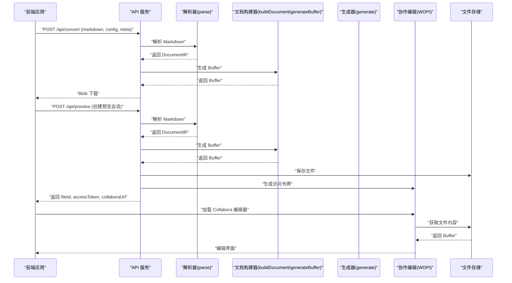
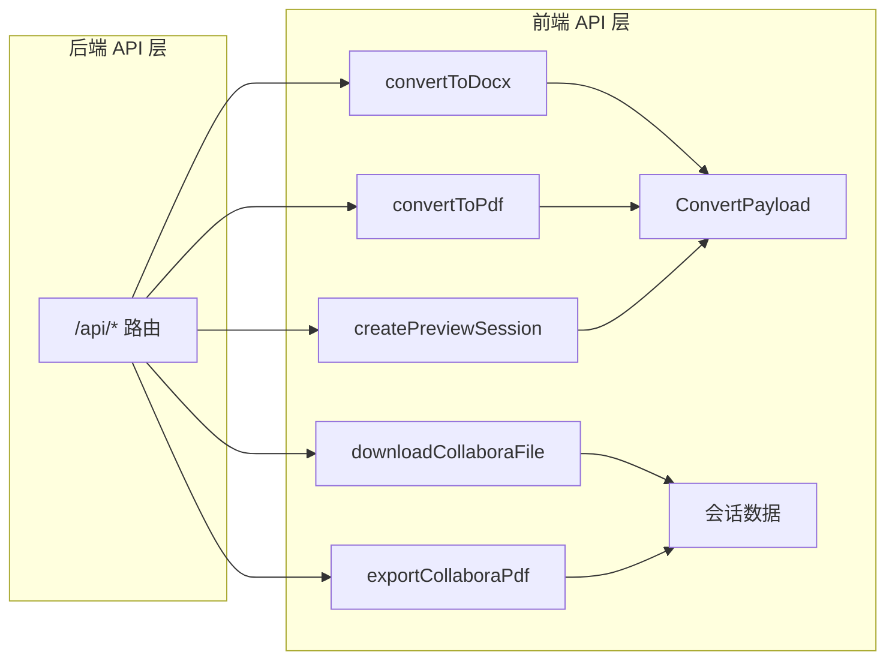
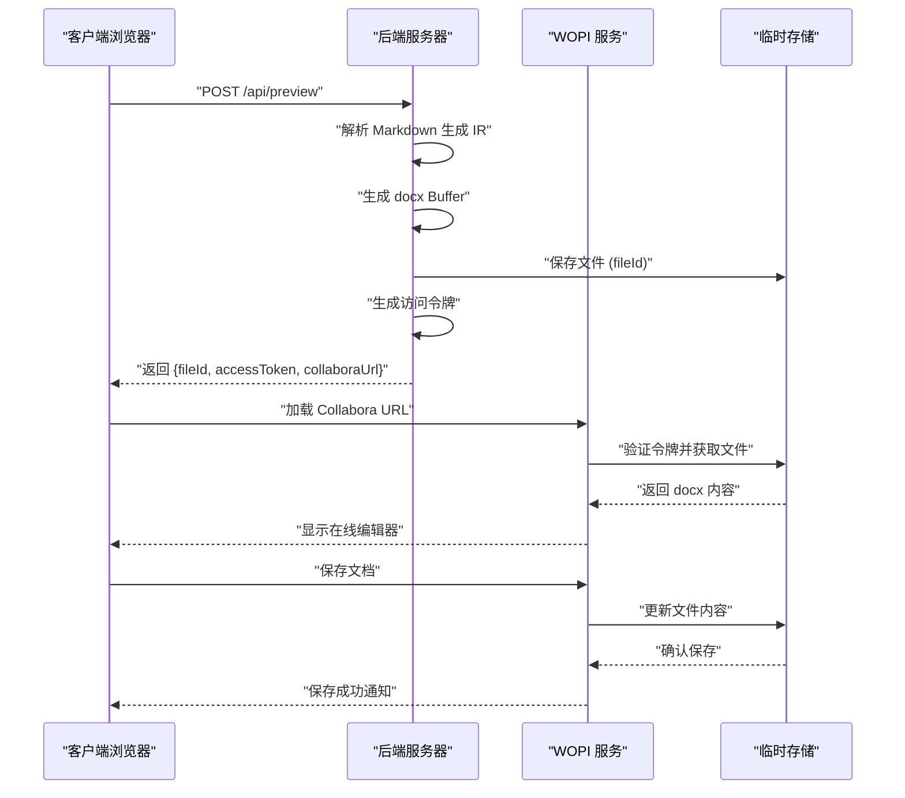
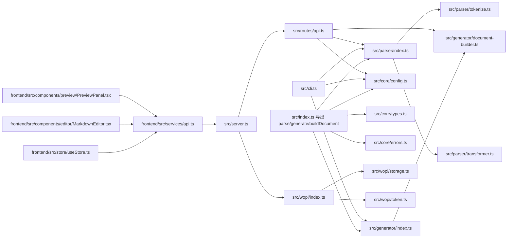
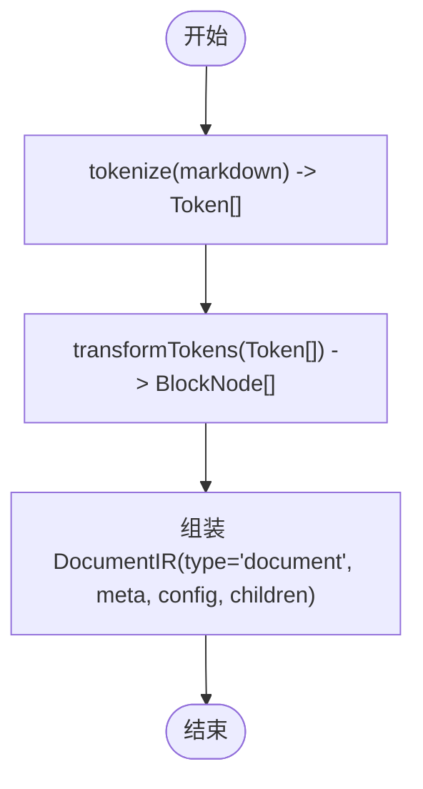
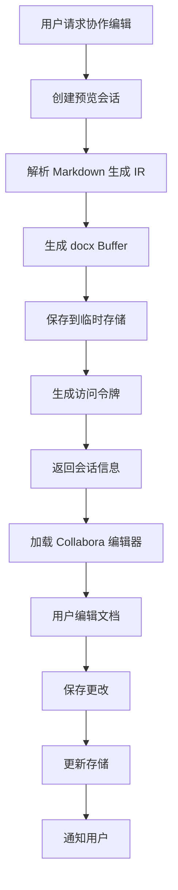

# 核心 API

<cite>
**本文档引用的文件**
- [src/index.ts](file://src/index.ts)
- [src/parser/index.ts](file://src/parser/index.ts)
- [src/parser/tokenize.ts](file://src/parser/tokenize.ts)
- [src/parser/transformer.ts](file://src/parser/transformer.ts)
- [src/generator/index.ts](file://src/generator/index.ts)
- [src/generator/document-builder.ts](file://src/generator/document-builder.ts)
- [src/core/types.ts](file://src/core/types.ts)
- [src/core/config.ts](file://src/core/config.ts)
- [src/core/errors.ts](file://src/core/errors.ts)
- [src/cli.ts](file://src/cli.ts)
- [src/server.ts](file://src/server.ts)
- [src/routes/api.ts](file://src/routes/api.ts)
- [src/wopi/index.ts](file://src/wopi/index.ts)
- [src/wopi/storage.ts](file://src/wopi/storage.ts)
- [src/wopi/token.ts](file://src/wopi/token.ts)
- [src/wopi/discovery.ts](file://src/wopi/discovery.ts)
- [frontend/src/services/api.ts](file://frontend/src/services/api.ts)
- [frontend/src/store/useStore.ts](file://frontend/src/store/useStore.ts)
- [frontend/src/components/editor/MarkdownEditor.tsx](file://frontend/src/components/editor/MarkdownEditor.tsx)
- [frontend/src/components/preview/PreviewPanel.tsx](file://frontend/src/components/preview/PreviewPanel.tsx)
- [frontend/src/utils/smartParser.ts](file://frontend/src/utils/smartParser.ts)
- [tests/e2e/full-pipeline.test.ts](file://tests/e2e/full-pipeline.test.ts)
- [tests/unit/parser/transformer.test.ts](file://tests/unit/parser/transformer.test.ts)
- [tests/fixtures/markdown/sample.md](file://tests/fixtures/markdown/sample.md)
</cite>

## 更新摘要
**所做更改**
- 新增前端集成 API 接口说明，包括文件上传、预览会话管理和协作编辑功能
- 更新 parse() 函数以支持前端状态管理集成
- 新增 generateBuffer() 函数用于直接生成 Buffer
- 扩展 API 规格以包含协作编辑和预览功能
- 添加 WOPI 协作编辑协议支持说明

## 目录
1. [简介](#简介)
2. [项目结构](#项目结构)
3. [核心组件](#核心组件)
4. [架构总览](#架构总览)
5. [详细组件分析](#详细组件分析)
6. [前端集成 API](#前端集成-api)
7. [协作编辑功能](#协作编辑功能)
8. [依赖关系分析](#依赖关系分析)
9. [性能考虑](#性能考虑)
10. [故障排除指南](#故障排除指南)
11. [结论](#结论)
12. [附录](#附录)

## 简介
本文件聚焦于项目的核心 API：parse()、generate() 和 buildDocument()，并配套说明与之密切相关的数据模型与配置体系。随着应用变更，现在需要支持前端集成，包括新的文件上传、预览会话管理、协作编辑等功能，以及与前端状态管理的集成。目标是帮助开发者准确理解这些 API 的参数、返回值、使用方式、错误处理与典型应用场景，从而高效完成从 Markdown 到 Word（.docx）的转换。

## 项目结构
项目采用模块化设计，核心能力由解析器（parser）、生成器（generator）与核心类型/配置/错误定义组成，并通过统一出口导出供 CLI、服务端或直接调用使用。新增了前端集成层和协作编辑支持。

```mermaid
graph TB
subgraph "前端集成层"
FE_API["frontend/src/services/api.ts"]
FE_STORE["frontend/src/store/useStore.ts"]
FE_EDITOR["frontend/src/components/editor/MarkdownEditor.tsx"]
FE_PREVIEW["frontend/src/components/preview/PreviewPanel.tsx"]
END
subgraph "后端服务层"
SERVER["src/server.ts"]
API_ROUTER["src/routes/api.ts"]
WOPI_ROUTER["src/wopi/index.ts"]
DISCOVERY["src/wopi/discovery.ts"]
STORAGE["src/wopi/storage.ts"]
TOKEN["src/wopi/token.ts"]
END
subgraph "核心处理层"
PARSER_IDX["src/parser/index.ts"]
TOKENIZE["src/parser/tokenize.ts"]
TRANSFORMER["src/parser/transformer.ts"]
GEN_INDEX["src/generator/index.ts"]
DOC_BUILDER["src/generator/document-builder.ts"]
END
subgraph "核心类型与配置"
TYPES["src/core/types.ts"]
CONFIG["src/core/config.ts"]
ERRORS["src/core/errors.ts"]
CLI["src/cli.ts"]
END
FE_API --> SERVER
FE_STORE --> FE_API
FE_EDITOR --> FE_API
FE_PREVIEW --> FE_API
SERVER --> API_ROUTER
SERVER --> WOPI_ROUTER
API_ROUTER --> PARSER_IDX
API_ROUTER --> DOC_BUILDER
API_ROUTER --> CONFIG
API_ROUTER --> TYPES
API_ROUTER --> ERRORS
WOPI_ROUTER --> STORAGE
WOPI_ROUTER --> TOKEN
DISCOVERY --> SERVER
```

**图表来源**
- [frontend/src/services/api.ts:1-83](file://frontend/src/services/api.ts#L1-L83)
- [frontend/src/store/useStore.ts:1-210](file://frontend/src/store/useStore.ts#L1-L210)
- [frontend/src/components/editor/MarkdownEditor.tsx:1-125](file://frontend/src/components/editor/MarkdownEditor.tsx#L1-L125)
- [frontend/src/components/preview/PreviewPanel.tsx:1-237](file://frontend/src/components/preview/PreviewPanel.tsx#L1-L237)
- [src/server.ts:1-44](file://src/server.ts#L1-L44)
- [src/routes/api.ts:1-127](file://src/routes/api.ts#L1-L127)
- [src/wopi/index.ts:1-112](file://src/wopi/index.ts#L1-L112)
- [src/wopi/discovery.ts:1-58](file://src/wopi/discovery.ts#L1-L58)
- [src/wopi/storage.ts:1-81](file://src/wopi/storage.ts#L1-L81)
- [src/wopi/token.ts:1-27](file://src/wopi/token.ts#L1-L27)

**章节来源**
- [src/server.ts:1-44](file://src/server.ts#L1-L44)

## 核心组件
- 解析器（parse）：将 Markdown 文本解析为内部 IR（文档中间表示），包含元信息与配置。
- 生成器（generate）：将 IR 渲染为 docx 文件，写入指定路径。
- 文档构建器（buildDocument）：将 IR 转换为 docx 库的 Document 对象，供打包为文件或 Buffer 使用。
- Buffer 生成器（generateBuffer）：直接生成 Buffer 格式的 docx 文件，用于前端下载和协作编辑。
- 类型系统（types）：定义 IR、块级节点、行内节点、配置等数据结构。
- 配置系统（config）：提供默认配置、校验与合并能力。
- 错误体系（errors）：针对解析、生成、图片处理、配置校验的专用错误类型。

**章节来源**
- [src/parser/index.ts:11-21](file://src/parser/index.ts#L11-L21)
- [src/generator/index.ts:7-18](file://src/generator/index.ts#L7-L18)
- [src/generator/document-builder.ts:17-112](file://src/generator/document-builder.ts#L17-L112)
- [src/core/types.ts:1-198](file://src/core/types.ts#L1-L198)
- [src/core/config.ts:68-91](file://src/core/config.ts#L68-L91)
- [src/core/errors.ts:1-28](file://src/core/errors.ts#L1-L28)

## 架构总览
整体流程：CLI/调用方提供 Markdown 字符串 → 解析器生成 IR → 文档构建器渲染为 docx 对象 → 生成器写入文件或导出 Buffer。新增前端集成层支持实时预览和协作编辑。



**图表来源**
- [src/routes/api.ts:15-34](file://src/routes/api.ts#L15-L34)
- [src/routes/api.ts:36-59](file://src/routes/api.ts#L36-L59)
- [src/wopi/index.ts:18-35](file://src/wopi/index.ts#L18-L35)
- [src/wopi/storage.ts:19-25](file://src/wopi/storage.ts#L19-L25)

## 详细组件分析

### parse() 函数
- 功能概述
  - 将 Markdown 文本解析为内部 IR（DocumentIR），包含文档类型、元信息、配置与块级节点树。
- 参数
  - markdown: string（必需）
  - options: ParseOptions（可选）
    - meta?: DocumentMeta（可选）
      - title?: string
      - author?: string
      - date?: string
    - config?: ResolvedConfig（可选）
- 返回值
  - DocumentIR
    - type: 'document'
    - meta: DocumentMeta
    - config: ResolvedConfig
    - children: BlockNode[]
- 处理流程
  - 使用 tokenize() 生成 Token 列表
  - 使用 transformTokens() 将 Token 转换为 BlockNode[]
  - 组装 DocumentIR，未提供的 meta/config 将使用默认值
- 典型使用场景
  - 从文件读取 Markdown 后立即解析为 IR，再交由生成器处理
  - 在 CLI 中结合用户传入的元信息与配置进行解析
  - 在前端集成中作为状态管理的基础数据源
- 错误处理
  - 解析阶段主要依赖底层解析器与转换器；若需捕获解析错误，建议在调用方捕获并包装为业务错误
- 参考实现位置
  - [src/parser/index.ts:11-21](file://src/parser/index.ts#L11-L21)
  - [src/parser/tokenize.ts:12-15](file://src/parser/tokenize.ts#L12-L15)
  - [src/parser/transformer.ts:25-39](file://src/parser/transformer.ts#L25-L39)
  - [src/core/types.ts:1-12](file://src/core/types.ts#L1-L12)
  - [src/core/config.ts:90](file://src/core/config.ts#L90)

**章节来源**
- [src/parser/index.ts:6-21](file://src/parser/index.ts#L6-L21)
- [src/parser/tokenize.ts:12-15](file://src/parser/tokenize.ts#L12-L15)
- [src/parser/transformer.ts:25-39](file://src/parser/transformer.ts#L25-L39)
- [src/core/types.ts:1-12](file://src/core/types.ts#L1-L12)
- [src/core/config.ts:90](file://src/core/config.ts#L90)

### generate() 函数
- 功能概述
  - 将 DocumentIR 渲染为 docx 文件并写入指定输出路径
- 参数
  - ir: DocumentIR（必需）
  - outputPath: string（必需）
- 返回值
  - Promise<void>
- 处理流程
  - 调用 buildDocument() 构建 docx.Document
  - 使用 docx.Packer 将 Document 转为 Buffer
  - 写入文件到 outputPath
- 配置选项
  - 通过 DocumentIR.config 控制字体、字号、间距、页边距、页码、方向等
- 输出格式
  - .docx 文件（ZIP 容器，内部包含 XML）
- 典型使用场景
  - CLI 工具链：解析后直接生成 .docx 文件
  - 服务端批量转换：接收 IR 并写出文件
  - 前端下载：通过 generateBuffer 生成 Buffer 后下载
- 错误处理
  - 任何阶段失败都会抛出 DocxGenerationError，包含原始错误上下文
- 参考实现位置
  - [src/generator/index.ts:7-18](file://src/generator/index.ts#L7-L18)
  - [src/generator/document-builder.ts:17-106](file://src/generator/document-builder.ts#L17-L106)
  - [src/core/errors.ts:8-13](file://src/core/errors.ts#L8-L13)

**章节来源**
- [src/generator/index.ts:7-18](file://src/generator/index.ts#L7-L18)
- [src/generator/document-builder.ts:17-106](file://src/generator/document-builder.ts#L17-L106)
- [src/core/errors.ts:8-13](file://src/core/errors.ts#L8-L13)

### buildDocument() 函数
- 功能概述
  - 将 DocumentIR 转换为 docx.Document 对象，供后续打包或进一步处理
- 参数
  - ir: DocumentIR（必需）
- 返回值
  - Promise<Document>（docx.Document 实例）
- 处理流程
  - 依据 ir.config 创建样式
  - 遍历 ir.children，逐个渲染为 docx 段落/表格等元素
  - 构建页眉/页脚（可选），设置页面方向与页边距
  - 返回包含样式与节（Section）的 Document
- 输出对象结构
  - Document（来自 docx 库）：包含作者、标题、描述、样式与节等属性
- 典型使用场景
  - 仅需要 Buffer 或内存中的 docx 对象时使用
  - 与其他工具链集成，不直接写文件
  - 前端协作编辑中的文档对象生成
- 错误处理
  - 若渲染过程中出现异常，应由上层捕获并包装为业务错误
- 参考实现位置
  - [src/generator/document-builder.ts:17-106](file://src/generator/document-builder.ts#L17-L106)

**章节来源**
- [src/generator/document-builder.ts:17-106](file://src/generator/document-builder.ts#L17-L106)

### generateBuffer() 函数
- 功能概述
  - 直接生成 Buffer 格式的 docx 文件，用于前端下载和协作编辑
- 参数
  - ir: DocumentIR（必需）
- 返回值
  - Promise<Buffer>
- 处理流程
  - 调用 buildDocument() 构建 docx.Document
  - 使用 docx.Packer 将 Document 转为 Buffer
  - 返回二进制 Buffer
- 典型使用场景
  - 前端实时预览：直接生成 Buffer 供 docx-preview 渲染
  - 协作编辑：通过 WOPI 协议传输文档内容
  - PDF 导出：先生成 docx Buffer 再转换为 PDF
- 错误处理
  - 任何阶段失败都会抛出 DocxGenerationError，包含原始错误上下文
- 参考实现位置
  - [src/generator/document-builder.ts:108-112](file://src/generator/document-builder.ts#L108-L112)

**章节来源**
- [src/generator/document-builder.ts:108-112](file://src/generator/document-builder.ts#L108-L112)

## 前端集成 API

### 前端 API 服务
前端通过 `api.ts` 提供完整的集成接口，支持多种输出格式和预览模式：



**图表来源**
- [frontend/src/services/api.ts:31-82](file://frontend/src/services/api.ts#L31-L82)
- [src/routes/api.ts:15-124](file://src/routes/api.ts#L15-L124)

### ConvertPayload 数据结构
前端集成的核心数据结构，用于传递转换请求：

- markdown: string（必需） - Markdown 源文本
- config: Config（必需） - 样式配置对象
- meta: DocumentMeta（必需） - 文档元信息

### 颜色配置处理
前端自动处理颜色格式转换，将十六进制颜色值转换为 docx 兼容格式：

**章节来源**
- [frontend/src/services/api.ts:5-29](file://frontend/src/services/api.ts#L5-L29)
- [frontend/src/store/useStore.ts:3-49](file://frontend/src/store/useStore.ts#L3-L49)

### 颜色配置映射
前端将颜色配置从十六进制转换为 docx 格式：

- heading: '#000000' → '000000'
- text: '#000000' → '000000'
- link: '#0563C1' → '0563C1'
- codeBackground: '#F5F5F5' → 'F5F5F5'
- blockquoteBorder: '#CCCCCC' → 'CCCCCC'

**章节来源**
- [frontend/src/services/api.ts:11-29](file://frontend/src/services/api.ts#L11-L29)

### 预览模式集成
前端支持多种预览模式，每种模式对应不同的后端处理流程：

- markdown: 即时渲染，使用 markdown-it 解析
- html: HTML 创意预览，支持多种模板
- local: docx-preview 本地预览，快速渲染
- pdf: PDF 预览，高质量渲染
- collabora: 协作编辑，支持多人实时编辑

**章节来源**
- [frontend/src/components/preview/PreviewPanel.tsx:11-154](file://frontend/src/components/preview/PreviewPanel.tsx#L11-L154)

## 协作编辑功能

### WOPI 协作编辑协议
系统集成了 WOPI（Web Application Open Platform Interface）协议，支持 Collabora 在线编辑器：



**图表来源**
- [src/routes/api.ts:36-59](file://src/routes/api.ts#L36-L59)
- [src/wopi/index.ts:18-109](file://src/wopi/index.ts#L18-L109)
- [src/wopi/storage.ts:19-54](file://src/wopi/storage.ts#L19-L54)

### 访问令牌管理
系统使用 HMAC 签名的访问令牌，确保文件访问安全：

- 令牌格式：`fileId:timestamp:hmac`
- TTL：默认 24 小时
- 生成算法：SHA-256 HMAC with SECRET
- 验证过程：重新计算 HMAC 并比较

**章节来源**
- [src/wopi/token.ts:6-26](file://src/wopi/token.ts#L6-L26)

### 文件存储管理
临时文件存储系统支持文件生命周期管理：

- 存储目录：`./tmp/wopi`（可配置）
- TTL：默认 30 分钟
- 自动清理：定时任务清理过期文件
- 锁机制：支持文件锁定防止并发修改

**章节来源**
- [src/wopi/storage.ts:19-81](file://src/wopi/storage.ts#L19-L81)

### Collabora 发现机制
系统自动发现 Collabora 服务配置：

- 通过 `/hosting/discovery` 获取服务配置
- 支持重试机制，最多 5 次重试
- 缓存发现结果，提高性能
- 支持自定义 CODE_URL 环境变量

**章节来源**
- [src/wopi/discovery.ts:7-57](file://src/wopi/discovery.ts#L7-L57)

### 前端协作编辑集成
前端通过 `PreviewPanel` 组件集成协作编辑功能：

- 自动检测 Collabora 服务可用性
- 支持 PostMessage 通信
- 实时状态同步
- 错误处理和用户提示

**章节来源**
- [frontend/src/components/preview/PreviewPanel.tsx:156-172](file://frontend/src/components/preview/PreviewPanel.tsx#L156-L172)

## 依赖关系分析



**图表来源**
- [src/index.ts:1-25](file://src/index.ts#L1-L25)
- [src/parser/index.ts:1-24](file://src/parser/index.ts#L1-L24)
- [src/parser/tokenize.ts:1-16](file://src/parser/tokenize.ts#L1-L16)
- [src/parser/transformer.ts:1-360](file://src/parser/transformer.ts#L1-L360)
- [src/generator/index.ts:1-21](file://src/generator/index.ts#L1-L21)
- [src/generator/document-builder.ts:1-112](file://src/generator/document-builder.ts#L1-L112)
- [src/core/config.ts:1-91](file://src/core/config.ts#L1-L91)
- [src/core/types.ts:1-198](file://src/core/types.ts#L1-L198)
- [src/core/errors.ts:1-28](file://src/core/errors.ts#L1-L28)
- [src/cli.ts:1-113](file://src/cli.ts#L1-L113)
- [src/server.ts:1-44](file://src/server.ts#L1-L44)
- [src/routes/api.ts:1-127](file://src/routes/api.ts#L1-L127)
- [src/wopi/index.ts:1-112](file://src/wopi/index.ts#L1-L112)
- [src/wopi/storage.ts:1-81](file://src/wopi/storage.ts#L1-L81)
- [src/wopi/token.ts:1-27](file://src/wopi/token.ts#L1-L27)
- [frontend/src/services/api.ts:1-83](file://frontend/src/services/api.ts#L1-L83)
- [frontend/src/store/useStore.ts:1-210](file://frontend/src/store/useStore.ts#L1-L210)
- [frontend/src/components/editor/MarkdownEditor.tsx:1-125](file://frontend/src/components/editor/MarkdownEditor.tsx#L1-L125)
- [frontend/src/components/preview/PreviewPanel.tsx:1-237](file://frontend/src/components/preview/PreviewPanel.tsx#L1-L237)

**章节来源**
- [src/index.ts:1-25](file://src/index.ts#L1-L25)

## 性能考虑
- 解析阶段
  - tokenize() 与 transformTokens() 会遍历 Token 与节点，复杂度与 Markdown 长度线性相关
  - 列表、表格等嵌套结构会增加递归深度，注意避免极长嵌套导致栈溢出
- 生成阶段
  - buildDocument() 会逐个渲染块级节点并应用样式，大文档建议分段处理或优化样式数量
  - generate() 写文件为同步 I/O，建议在高并发场景中串行化或使用队列
  - generateBuffer() 直接生成 Buffer，避免文件 I/O 开销
- 前端集成
  - 颜色格式转换在前端完成，减少后端处理负担
  - 预览缓存机制提升用户体验
  - 协作编辑使用流式传输，支持大文件处理
- 协作编辑
  - 文件存储使用临时目录，支持自动清理
  - 访问令牌带 TTL，确保安全性
  - 锁机制防止并发冲突

## 故障排除指南
- 解析错误
  - 现象：parse() 抛出 MarkdownParseError
  - 排查：检查 Markdown 语法是否符合 commonmark，表格/列表闭合是否正确
  - 参考
    - [src/core/errors.ts:1-6](file://src/core/errors.ts#L1-L6)
- 生成错误
  - 现象：generate() 抛出 DocxGenerationError
  - 排查：确认输出路径可写、磁盘空间充足；查看 cause 获取底层异常
  - 参考
    - [src/generator/index.ts:12-17](file://src/generator/index.ts#L12-L17)
    - [src/core/errors.ts:8-13](file://src/core/errors.ts#L8-L13)
- 前端集成错误
  - 现象：API 请求失败
  - 排查：检查 CORS 配置、网络连接、后端服务状态
  - 参考
    - [src/server.ts:16](file://src/server.ts#L16)
    - [frontend/src/services/api.ts:38-42](file://frontend/src/services/api.ts#L38-L42)
- 协作编辑错误
  - 现象：WOPI 服务不可用
  - 排查：检查 CODE_URL 配置、服务发现、网络连接
  - 参考
    - [src/wopi/discovery.ts:3](file://src/wopi/discovery.ts#L3)
    - [src/server.ts:31-43](file://src/server.ts#L31-L43)
- 图片处理错误
  - 现象：ImageProcessingError
  - 排查：检查图片 src 是否有效、网络可达、尺寸是否过大
  - 参考
    - [src/core/errors.ts:15-20](file://src/core/errors.ts#L15-L20)
- 配置校验错误
  - 现象：ConfigValidationError
  - 排查：核对配置字段类型与范围（如 margin、pageSize、orientation 等）
  - 参考
    - [src/core/errors.ts:22-27](file://src/core/errors.ts#L22-L27)
    - [src/core/config.ts:54-64](file://src/core/config.ts#L54-L64)

**章节来源**
- [src/core/errors.ts:1-28](file://src/core/errors.ts#L1-L28)
- [src/generator/index.ts:12-17](file://src/generator/index.ts#L12-L17)
- [src/core/config.ts:54-64](file://src/core/config.ts#L54-L64)
- [src/server.ts:16](file://src/server.ts#L16)
- [frontend/src/services/api.ts:38-42](file://frontend/src/services/api.ts#L38-L42)
- [src/wopi/discovery.ts:3](file://src/wopi/discovery.ts#L3)
- [src/server.ts:31-43](file://src/server.ts#L31-L43)

## 结论
- parse() 提供稳定的 Markdown 到 IR 的转换，适合与配置系统配合使用
- generate() 与 buildDocument() 分别面向"文件写入"和"内存对象"两种需求，前者便于落地，后者便于扩展
- generateBuffer() 专门用于前端集成，支持实时预览和协作编辑
- 类型与配置体系清晰，错误类型明确，便于在生产环境稳定运行
- 前端集成完善，支持多种预览模式和协作编辑功能
- 建议在实际项目中结合 CLI 或服务端封装，统一处理错误与日志

## 附录

### API 规格速查

- parse(markdown: string, options?: ParseOptions): DocumentIR
  - options.meta: DocumentMeta
  - options.config: ResolvedConfig
  - 返回: DocumentIR
  - 参考
    - [src/parser/index.ts:11-21](file://src/parser/index.ts#L11-L21)

- generate(ir: DocumentIR, outputPath: string): Promise<void>
  - 输入: DocumentIR, 输出路径
  - 返回: Promise<void>
  - 参考
    - [src/generator/index.ts:7-18](file://src/generator/index.ts#L7-L18)

- buildDocument(ir: DocumentIR): Promise<Document>
  - 输入: DocumentIR
  - 返回: Promise<Document>
  - 参考
    - [src/generator/document-builder.ts:17-106](file://src/generator/document-builder.ts#L17-L106)

- generateBuffer(ir: DocumentIR): Promise<Buffer>
  - 输入: DocumentIR
  - 返回: Promise<Buffer>
  - 参考
    - [src/generator/document-builder.ts:108-112](file://src/generator/document-builder.ts#L108-L112)

### 前端 API 规格

- convertToDocx(payload: ConvertPayload): Promise<Blob>
  - 输入: ConvertPayload (markdown, config, meta)
  - 返回: Promise<Blob> - 可下载的 .docx 文件
  - 参考
    - [frontend/src/services/api.ts:32-43](file://frontend/src/services/api.ts#L32-L43)

- convertToPdf(payload: ConvertPayload): Promise<Blob>
  - 输入: ConvertPayload (markdown, config, meta)
  - 返回: Promise<Blob> - 可下载的 .pdf 文件
  - 参考
    - [frontend/src/services/api.ts:45-56](file://frontend/src/services/api.ts#L45-L56)

- createPreviewSession(payload: ConvertPayload): Promise<{fileId: string, accessToken: string, collaboraUrl: string}>
  - 输入: ConvertPayload (markdown, config, meta)
  - 返回: Promise<SessionData> - 协作编辑会话信息
  - 参考
    - [frontend/src/services/api.ts:58-69](file://frontend/src/services/api.ts#L58-L69)

### 协作编辑 API 规格

- downloadCollaboraFile(fileId: string, accessToken: string): Promise<Blob>
  - 输入: fileId, accessToken
  - 返回: Promise<Blob> - 下载协作编辑文件
  - 参考
    - [frontend/src/services/api.ts:71-75](file://frontend/src/services/api.ts#L71-L75)

- exportCollaboraPdf(fileId: string, accessToken: string): Promise<Blob>
  - 输入: fileId, accessToken
  - 返回: Promise<Blob> - 导出 PDF
  - 参考
    - [frontend/src/services/api.ts:77-81](file://frontend/src/services/api.ts#L77-L81)

### 关键流程图：解析器内部转换



**图表来源**
- [src/parser/tokenize.ts:12-15](file://src/parser/tokenize.ts#L12-L15)
- [src/parser/transformer.ts:25-39](file://src/parser/transformer.ts#L25-L39)
- [src/parser/index.ts:15-20](file://src/parser/index.ts#L15-L20)

### 关键流程图：协作编辑工作流



**图表来源**
- [src/routes/api.ts:36-59](file://src/routes/api.ts#L36-L59)
- [src/wopi/index.ts:49-109](file://src/wopi/index.ts#L49-L109)
- [src/wopi/storage.ts:19-54](file://src/wopi/storage.ts#L19-L54)
- [src/wopi/token.ts:6-26](file://src/wopi/token.ts#L6-L26)