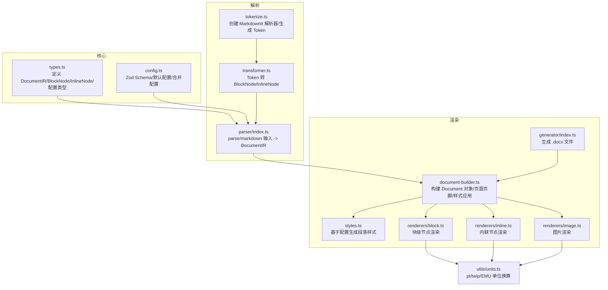
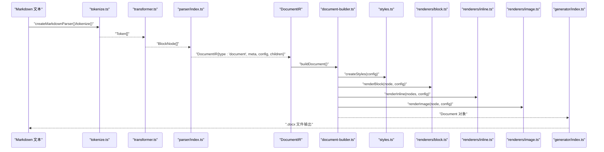
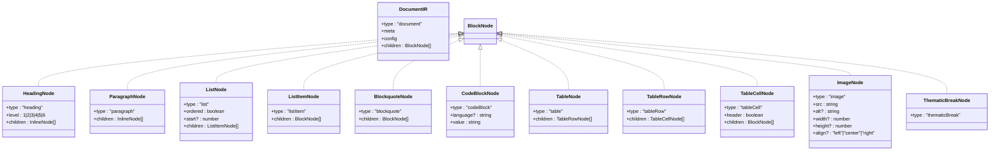
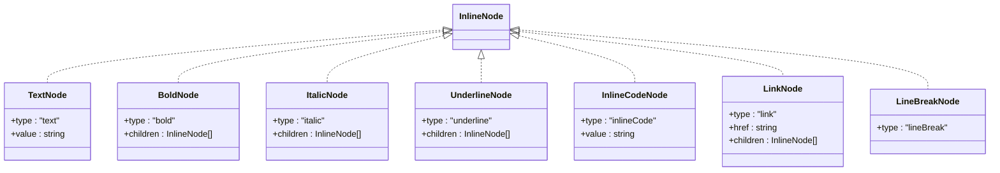
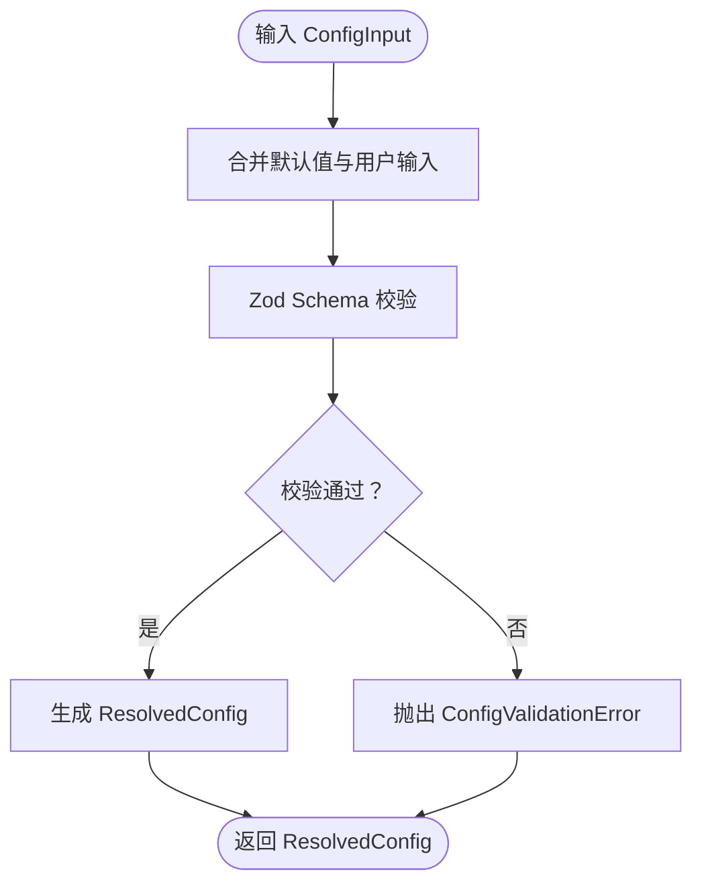
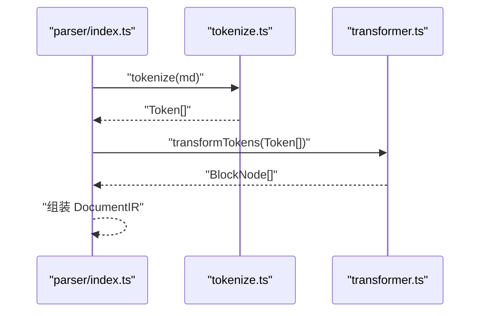
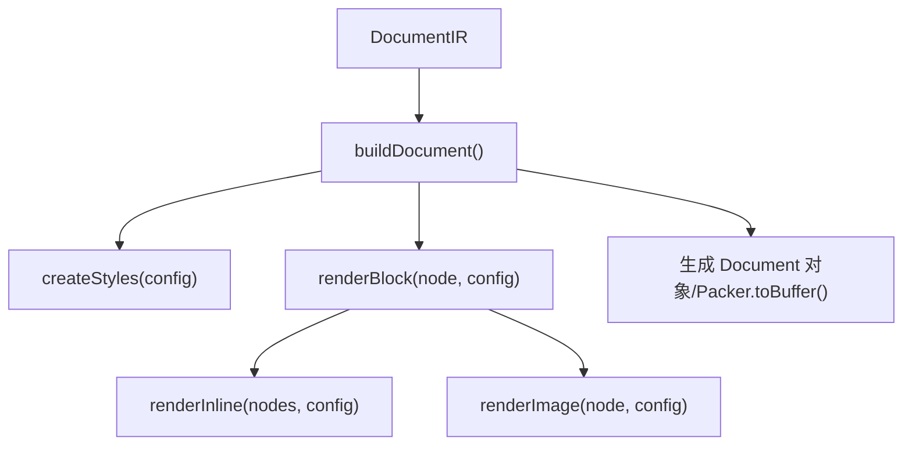
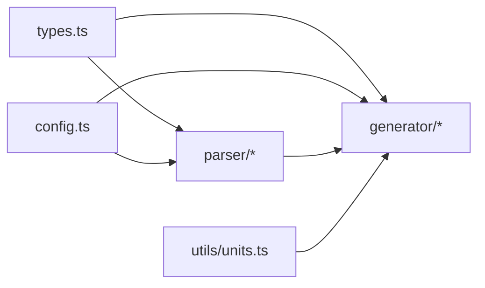

# 类型定义

<cite>
**本文引用的文件**
- [src/core/types.ts](file://src/core/types.ts)
- [src/core/config.ts](file://src/core/config.ts)
- [src/parser/tokenize.ts](file://src/parser/tokenize.ts)
- [src/parser/transformer.ts](file://src/parser/transformer.ts)
- [src/parser/index.ts](file://src/parser/index.ts)
- [src/generator/document-builder.ts](file://src/generator/document-builder.ts)
- [src/generator/styles.ts](file://src/generator/styles.ts)
- [src/generator/renderers/block.ts](file://src/generator/renderers/block.ts)
- [src/generator/renderers/inline.ts](file://src/generator/renderers/inline.ts)
- [src/generator/renderers/image.ts](file://src/generator/renderers/image.ts)
- [src/generator/index.ts](file://src/generator/index.ts)
- [src/utils/units.ts](file://src/utils/units.ts)
- [src/index.ts](file://src/index.ts)
- [tests/unit/core/config.test.ts](file://tests/unit/core/config.test.ts)
- [package.json](file://package.json)
</cite>

## 目录
1. [简介](#简介)
2. [项目结构](#项目结构)
3. [核心组件](#核心组件)
4. [架构总览](#架构总览)
5. [详细组件分析](#详细组件分析)
6. [依赖分析](#依赖分析)
7. [性能考虑](#性能考虑)
8. [故障排查指南](#故障排查指南)
9. [结论](#结论)
10. [附录](#附录)

## 简介
本文件系统性梳理项目中的类型定义与使用规范，覆盖文档中间表示（DocumentIR）、块级节点（BlockNode）、内联节点（InlineNode）以及配置类型（ResolvedConfig、FontConfig、SizeConfig 等）。文档同时说明接口规范、类型约束、类型推导机制与 TypeScript 集成方式，并提供可操作的最佳实践与排错建议。

## 项目结构
项目采用按职责分层的组织方式：
- 核心类型与配置：位于 core 层，定义文档 IR 与配置模型
- 解析层：将 Markdown 文本解析为 Token 并转换为 BlockNode 列表
- 渲染层：将 DocumentIR 渲染为 docx 文档对象
- 工具层：单位换算与图像处理辅助函数
- 导出入口：统一导出公共 API 与类型

图表来源
- [src/core/types.ts:1-198](file://src/core/types.ts#L1-L198)
- [src/core/config.ts:1-91](file://src/core/config.ts#L1-L91)
- [src/parser/tokenize.ts:1-16](file://src/parser/tokenize.ts#L1-L16)
- [src/parser/transformer.ts:1-360](file://src/parser/transformer.ts#L1-L360)
- [src/parser/index.ts:1-24](file://src/parser/index.ts#L1-L24)
- [src/generator/document-builder.ts:1-112](file://src/generator/document-builder.ts#L1-L112)
- [src/generator/styles.ts:1-122](file://src/generator/styles.ts#L1-L122)
- [src/generator/renderers/block.ts:1-266](file://src/generator/renderers/block.ts#L1-L266)
- [src/generator/renderers/inline.ts:1-110](file://src/generator/renderers/inline.ts#L1-L110)
- [src/generator/renderers/image.ts:1-61](file://src/generator/renderers/image.ts#L1-L61)
- [src/generator/index.ts:1-21](file://src/generator/index.ts#L1-L21)
- [src/utils/units.ts:1-45](file://src/utils/units.ts#L1-L45)

章节来源
- [src/core/types.ts:1-198](file://src/core/types.ts#L1-L198)
- [src/core/config.ts:1-91](file://src/core/config.ts#L1-L91)
- [src/parser/tokenize.ts:1-16](file://src/parser/tokenize.ts#L1-L16)
- [src/parser/transformer.ts:1-360](file://src/parser/transformer.ts#L1-L360)
- [src/parser/index.ts:1-24](file://src/parser/index.ts#L1-L24)
- [src/generator/document-builder.ts:1-112](file://src/generator/document-builder.ts#L1-L112)
- [src/generator/styles.ts:1-122](file://src/generator/styles.ts#L1-L122)
- [src/generator/renderers/block.ts:1-266](file://src/generator/renderers/block.ts#L1-L266)
- [src/generator/renderers/inline.ts:1-110](file://src/generator/renderers/inline.ts#L1-L110)
- [src/generator/renderers/image.ts:1-61](file://src/generator/renderers/image.ts#L1-L61)
- [src/generator/index.ts:1-21](file://src/generator/index.ts#L1-L21)
- [src/utils/units.ts:1-45](file://src/utils/units.ts#L1-L45)

## 核心组件
本节聚焦于核心数据类型与配置类型，明确字段、取值范围与约束条件。

- 文档中间表示（DocumentIR）
  - 字段
    - type: 固定为 document
    - meta: 文档元信息（标题、作者、日期等）
    - config: 已解析的配置（ResolvedConfig）
    - children: 块级节点数组（BlockNode[]）
  - 约束
    - children 必须由解析阶段产出，且仅包含受支持的块级节点类型
    - config 由 createConfig/mergeConfig 保证类型安全与默认值填充

- 块级节点（BlockNode）
  - 支持类型
    - 标题：level ∈ {1,2,3,4,5,6}，children 为 InlineNode[]
    - 段落：children 为 InlineNode[]
    - 列表：ordered ∈ boolean，可选 start，children 为 ListItemNode[]
    - 列表项：children 为 BlockNode[]
    - 引用块：children 为 BlockNode[]
    - 代码块：language?，value 为字符串
    - 表格：children 为 TableRowNode[]
    - 表格行：children 为 TableCellNode[]
    - 表格单元：header ∈ boolean，children 为 BlockNode[]
    - 图片：src、alt?、width?、height?、align ∈ {'left','center','right'}
    - 分隔线：无子节点
  - 约束
    - 各节点的 children 结构遵循其语义（如标题只含内联内容，表格单元通常包含段落）

- 内联节点（InlineNode）
  - 支持类型
    - 文本：value 为字符串
    - 粗体：children 为 InlineNode[]
    - 斜体：children 为 InlineNode[]
    - 下划线：children 为 InlineNode[]
    - 行内代码：value 为字符串
    - 链接：href 为字符串，children 为 InlineNode[]
    - 换行：无子节点
  - 约束
    - 嵌套结构保持一致，链接与格式化节点可递归嵌套

- 配置类型（ResolvedConfig）
  - 字段与取值范围
    - font: body/heading/english/code 字体名字符串
    - size: body/heading1..6/code 字号（pt）
    - spacing: lineSpacing（倍数）、paragraphSpacing、headingSpacing（pt）
    - margin: top/bottom/left/right（twip）
    - image: maxWidthPercent ∈ [1,100]、defaultAlign ∈ {'left','center','right'}
    - headerFooter: header?、footer?、pageNumbers?
    - color: heading/text/link/codeBackground/blockquoteBorder（颜色码）
    - pageSize ∈ {'A4','Letter'}
    - orientation ∈ {'portrait','landscape'}

- 配置输入与校验（ConfigInput）
  - 通过 Zod Schema 校验与默认值填充
  - 提供 createConfig/mergeConfig/defaultConfig 三种使用方式

章节来源
- [src/core/types.ts:1-198](file://src/core/types.ts#L1-L198)
- [src/core/config.ts:1-91](file://src/core/config.ts#L1-L91)

## 架构总览
下图展示从 Markdown 文本到最终 .docx 的类型流转过程，强调 DocumentIR 作为核心枢纽的作用。

图表来源
- [src/parser/tokenize.ts:1-16](file://src/parser/tokenize.ts#L1-L16)
- [src/parser/transformer.ts:1-360](file://src/parser/transformer.ts#L1-L360)
- [src/parser/index.ts:1-24](file://src/parser/index.ts#L1-L24)
- [src/generator/document-builder.ts:1-112](file://src/generator/document-builder.ts#L1-L112)
- [src/generator/styles.ts:1-122](file://src/generator/styles.ts#L1-L122)
- [src/generator/renderers/block.ts:1-266](file://src/generator/renderers/block.ts#L1-L266)
- [src/generator/renderers/inline.ts:1-110](file://src/generator/renderers/inline.ts#L1-L110)
- [src/generator/renderers/image.ts:1-61](file://src/generator/renderers/image.ts#L1-L61)
- [src/generator/index.ts:1-21](file://src/generator/index.ts#L1-L21)

## 详细组件分析

### DocumentIR 类型与使用
- 定义位置：[src/core/types.ts:7-12](file://src/core/types.ts#L7-L12)
- 用途：承载解析后的文档结构，作为渲染阶段的输入
- 关键点
  - children 为 BlockNode[]，必须由解析阶段严格生成
  - config 为 ResolvedConfig，确保渲染时具备完整样式与布局信息
  - meta 可选，用于设置标题、作者等元数据

章节来源
- [src/core/types.ts:7-12](file://src/core/types.ts#L7-L12)

### BlockNode 类型族
- 定义位置：[src/core/types.ts:14-89](file://src/core/types.ts#L14-L89)
- 使用场景
  - 解析阶段：transformer.ts 将 Token 映射为具体 BlockNode
  - 渲染阶段：renderers/block.ts 根据节点类型进行差异化渲染
- 约束与复杂度
  - 递归结构：列表项、表格单元可能包含多个块级节点
  - 时间复杂度：渲染时对每个 BlockNode 进行一次分支判断，整体 O(n)

图表来源
- [src/core/types.ts:7-89](file://src/core/types.ts#L7-L89)

章节来源
- [src/core/types.ts:14-89](file://src/core/types.ts#L14-L89)
- [src/parser/transformer.ts:25-122](file://src/parser/transformer.ts#L25-L122)

### InlineNode 类型族
- 定义位置：[src/core/types.ts:91-134](file://src/core/types.ts#L91-L134)
- 使用场景
  - 解析阶段：transformer.ts 将 Token 映射为 InlineNode[]
  - 渲染阶段：renderers/inline.ts 递归渲染内联样式
- 约束与复杂度
  - 支持多层嵌套（粗体/斜体/下划线/链接），渲染时需维护继承样式（TextStyle）

图表来源
- [src/core/types.ts:91-134](file://src/core/types.ts#L91-L134)

章节来源
- [src/core/types.ts:91-134](file://src/core/types.ts#L91-L134)
- [src/parser/transformer.ts:238-332](file://src/parser/transformer.ts#L238-L332)

### 配置类型族与校验
- 定义位置：[src/core/types.ts:136-197](file://src/core/types.ts#L136-L197)
- 校验与默认值：[src/core/config.ts:4-64](file://src/core/config.ts#L4-L64)
- 关键点
  - 所有数值字段均带有默认值与边界约束（如 maxWidthPercent ∈ [1,100]）
  - 枚举字段使用字面量联合类型，确保编译期安全
  - 提供 createConfig/mergeConfig/defaultConfig 三种使用模式

图表来源
- [src/core/config.ts:68-91](file://src/core/config.ts#L68-L91)

章节来源
- [src/core/types.ts:136-197](file://src/core/types.ts#L136-L197)
- [src/core/config.ts:1-91](file://src/core/config.ts#L1-L91)

### 解析流程与类型映射
- 解析入口：[src/parser/index.ts:11-21](file://src/parser/index.ts#L11-L21)
- Token 生成：[src/parser/tokenize.ts:12-15](file://src/parser/tokenize.ts#L12-L15)
- Token → BlockNode/InlineNode：[src/parser/transformer.ts:25-332](file://src/parser/transformer.ts#L25-L332)

图表来源
- [src/parser/index.ts:11-21](file://src/parser/index.ts#L11-L21)
- [src/parser/tokenize.ts:12-15](file://src/parser/tokenize.ts#L12-L15)
- [src/parser/transformer.ts:25-39](file://src/parser/transformer.ts#L25-L39)

章节来源
- [src/parser/index.ts:1-24](file://src/parser/index.ts#L1-L24)
- [src/parser/tokenize.ts:1-16](file://src/parser/tokenize.ts#L1-L16)
- [src/parser/transformer.ts:1-360](file://src/parser/transformer.ts#L1-L360)

### 渲染流程与类型约束
- 文档构建：[src/generator/document-builder.ts:17-106](file://src/generator/document-builder.ts#L17-L106)
- 样式生成：[src/generator/styles.ts:5-109](file://src/generator/styles.ts#L5-L109)
- 块级渲染：[src/generator/renderers/block.ts:28-58](file://src/generator/renderers/block.ts#L28-L58)
- 内联渲染：[src/generator/renderers/inline.ts:12-109](file://src/generator/renderers/inline.ts#L12-L109)
- 图片渲染：[src/generator/renderers/image.ts:6-60](file://src/generator/renderers/image.ts#L6-L60)
- 单位换算：[src/utils/units.ts:13-22](file://src/utils/units.ts#L13-L22)

图表来源
- [src/generator/document-builder.ts:17-106](file://src/generator/document-builder.ts#L17-L106)
- [src/generator/styles.ts:5-109](file://src/generator/styles.ts#L5-L109)
- [src/generator/renderers/block.ts:28-58](file://src/generator/renderers/block.ts#L28-L58)
- [src/generator/renderers/inline.ts:12-109](file://src/generator/renderers/inline.ts#L12-L109)
- [src/generator/renderers/image.ts:6-60](file://src/generator/renderers/image.ts#L6-L60)

章节来源
- [src/generator/document-builder.ts:1-112](file://src/generator/document-builder.ts#L1-L112)
- [src/generator/styles.ts:1-122](file://src/generator/styles.ts#L1-L122)
- [src/generator/renderers/block.ts:1-266](file://src/generator/renderers/block.ts#L1-L266)
- [src/generator/renderers/inline.ts:1-110](file://src/generator/renderers/inline.ts#L1-L110)
- [src/generator/renderers/image.ts:1-61](file://src/generator/renderers/image.ts#L1-L61)
- [src/utils/units.ts:1-45](file://src/utils/units.ts#L1-L45)

## 依赖分析
- 类型依赖
  - DocumentIR 依赖 BlockNode/InlineNode/ResolvedConfig
  - BlockNode/InlineNode 依赖 ResolvedConfig 中的字体、字号、颜色等
- 运行时依赖
  - 解析阶段依赖 markdown-it 与 table 插件
  - 渲染阶段依赖 docx 库与单位换算工具
- 配置依赖
  - ResolvedConfig 由 Zod Schema 校验，确保类型安全与默认值一致性

图表来源
- [src/core/types.ts:1-198](file://src/core/types.ts#L1-L198)
- [src/core/config.ts:1-91](file://src/core/config.ts#L1-L91)
- [src/parser/index.ts:1-24](file://src/parser/index.ts#L1-L24)
- [src/generator/document-builder.ts:1-112](file://src/generator/document-builder.ts#L1-L112)
- [src/utils/units.ts:1-45](file://src/utils/units.ts#L1-L45)

章节来源
- [src/core/types.ts:1-198](file://src/core/types.ts#L1-L198)
- [src/core/config.ts:1-91](file://src/core/config.ts#L1-L91)
- [src/parser/index.ts:1-24](file://src/parser/index.ts#L1-L24)
- [src/generator/document-builder.ts:1-112](file://src/generator/document-builder.ts#L1-L112)
- [src/utils/units.ts:1-45](file://src/utils/units.ts#L1-L45)

## 性能考虑
- 渲染复杂度
  - 块级渲染：O(n)，按节点类型分支处理
  - 内联渲染：O(m)，m 为内联节点总数
- 配置校验
  - createConfig/mergeConfig 仅在初始化或配置变更时执行，避免运行时重复校验
- 单位换算
  - ptToHalfPt/ptToTwip 为纯计算，开销极低；建议复用已计算结果

## 故障排查指南
- 配置校验失败
  - 现象：传入非法枚举值或越界数值导致抛出异常
  - 排查：检查 pageSize/orientation/font/size/spacing/margin/image/color 等字段
  - 参考：[src/core/config.ts:68-91](file://src/core/config.ts#L68-L91)
- 解析错误
  - 现象：Markdown 解析异常
  - 排查：确认 MarkdownIt 插件启用状态与 Token 流是否符合预期
  - 参考：[src/parser/tokenize.ts:4-10](file://src/parser/tokenize.ts#L4-L10)
- 渲染错误
  - 现象：生成 .docx 失败
  - 排查：捕获 DocxGenerationError 并查看 cause
  - 参考：[src/generator/index.ts:7-18](file://src/generator/index.ts#L7-L18)
- 图片渲染失败
  - 现象：图片无法加载或尺寸异常
  - 排查：检查 ImageProcessingError 与 fallback 逻辑
  - 参考：[src/generator/renderers/image.ts:47-60](file://src/generator/renderers/image.ts#L47-L60)

章节来源
- [src/core/config.ts:68-91](file://src/core/config.ts#L68-L91)
- [src/parser/tokenize.ts:4-10](file://src/parser/tokenize.ts#L4-L10)
- [src/generator/index.ts:7-18](file://src/generator/index.ts#L7-L18)
- [src/generator/renderers/image.ts:47-60](file://src/generator/renderers/image.ts#L47-L60)

## 结论
本文档系统化梳理了项目中的类型定义与使用规范，明确了 DocumentIR、BlockNode、InlineNode 的结构与用途，以及 ResolvedConfig、FontConfig、SizeConfig 等配置类型的字段与约束。通过解析与渲染流程的类型映射，开发者可以基于这些类型安全地扩展功能、集成 TypeScript 并获得良好的开发体验。

## 附录

### 类型使用示例与最佳实践
- 创建默认配置
  - 使用 createConfig() 获取 ResolvedConfig，默认值来自 Zod Schema
  - 参考：[src/core/config.ts:68-91](file://src/core/config.ts#L68-L91)
- 合并配置
  - 使用 mergeConfig(base, override) 实现增量覆盖
  - 参考：[src/core/config.ts:83-88](file://src/core/config.ts#L83-L88)
- 解析 Markdown
  - 使用 parse(markdown, { meta, config? }) 生成 DocumentIR
  - 参考：[src/parser/index.ts:11-21](file://src/parser/index.ts#L11-L21)
- 渲染为 .docx
  - 使用 generate(ir, outputPath) 输出文件
  - 参考：[src/generator/index.ts:7-18](file://src/generator/index.ts#L7-L18)

章节来源
- [src/core/config.ts:68-91](file://src/core/config.ts#L68-L91)
- [src/parser/index.ts:11-21](file://src/parser/index.ts#L11-L21)
- [src/generator/index.ts:7-18](file://src/generator/index.ts#L7-L18)

### TypeScript 集成指南
- 导出与导入
  - 通过 src/index.ts 统一导出类型与 API，便于外部模块引用
  - 参考：[src/index.ts:1-25](file://src/index.ts#L1-L25)
- 类型推导
  - 使用 ResolvedConfig、BlockNode、InlineNode 等类型自动推导参数与返回值
  - 使用 ConfigInput 作为配置输入类型，确保与 Schema 一致
- 构建与声明
  - package.json 使用 tsup 生成 d.ts 声明文件，确保类型可见性
  - 参考：[package.json:12-13](file://package.json#L12-L13)

章节来源
- [src/index.ts:1-25](file://src/index.ts#L1-L25)
- [package.json:1-47](file://package.json#L1-L47)