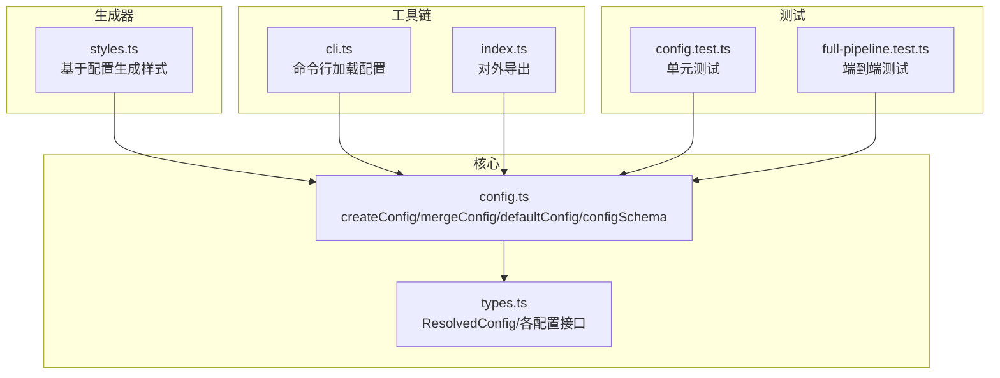
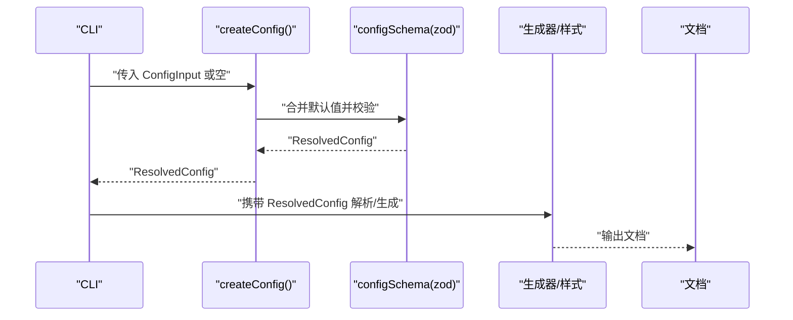
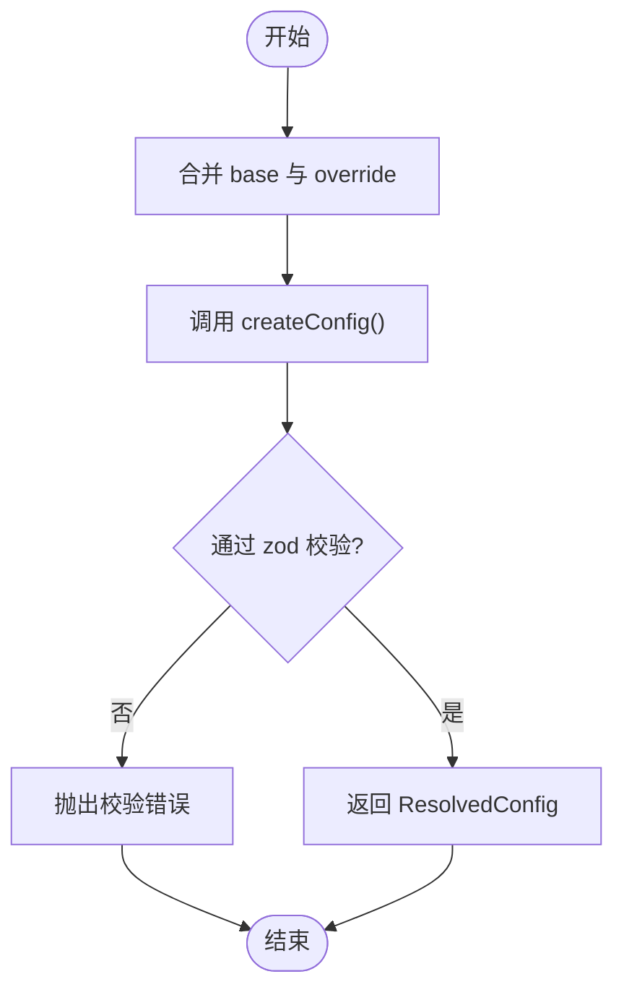
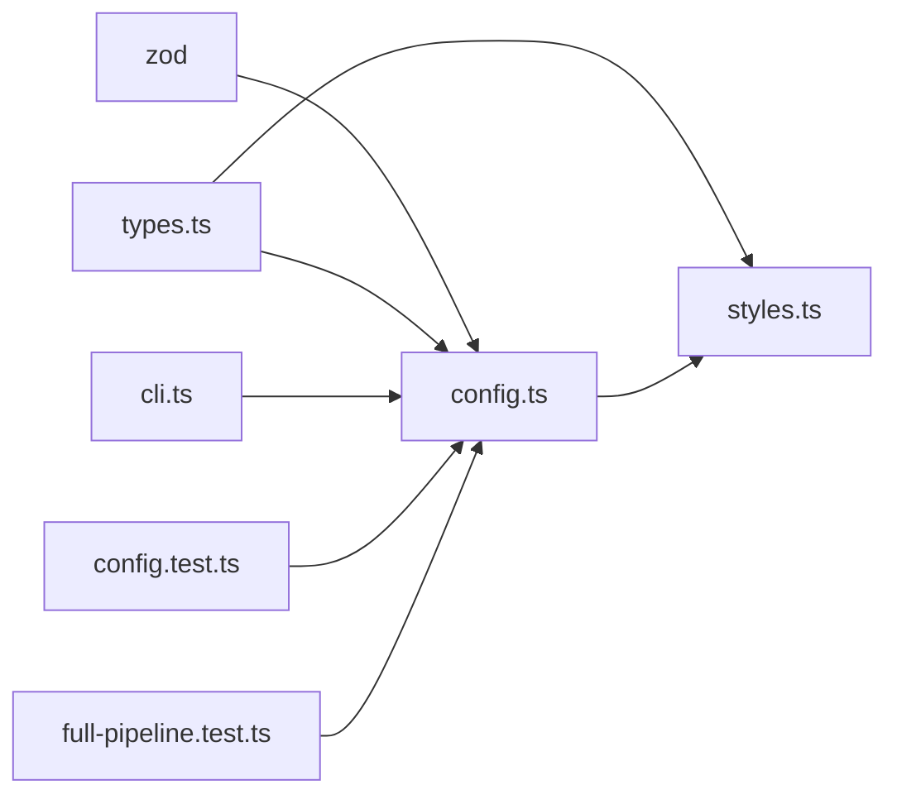

# 配置 API

<cite>
**本文引用的文件**
- [config.ts](file://src/core/config.ts)
- [types.ts](file://src/core/types.ts)
- [styles.ts](file://src/generator/styles.ts)
- [config.test.ts](file://tests/unit/core/config.test.ts)
- [cli.ts](file://src/cli.ts)
- [full-pipeline.test.ts](file://tests/e2e/full-pipeline.test.ts)
- [index.ts](file://src/index.ts)
</cite>

## 目录
1. [简介](#简介)
2. [项目结构](#项目结构)
3. [核心组件](#核心组件)
4. [架构总览](#架构总览)
5. [详细组件分析](#详细组件分析)
6. [依赖关系分析](#依赖关系分析)
7. [性能考量](#性能考量)
8. [故障排查指南](#故障排查指南)
9. [结论](#结论)
10. [附录](#附录)

## 简介
本文件系统化地记录了配置 API 的设计与使用方式，覆盖以下关键点：
- createConfig() 的参数规格、默认值与可选配置项
- mergeConfig() 的合并机制与优先级规则
- defaultConfig 的完整结构与默认值来源
- configSchema 的验证规则与类型约束
- 常见配置场景（字体、样式、页面布局）示例
- 配置验证错误的处理与调试技巧

## 项目结构
配置 API 位于核心模块中，并被解析器、生成器与 CLI 工具广泛使用。主要文件与职责如下：
- 核心配置定义：src/core/config.ts
- 类型定义：src/core/types.ts
- 文档样式生成：src/generator/styles.ts
- 单元测试与端到端测试：tests/unit/core/config.test.ts、tests/e2e/full-pipeline.test.ts
- CLI 使用入口：src/cli.ts
- 导出入口：src/index.ts

图表来源
- [config.ts:1-91](file://src/core/config.ts#L1-L91)
- [types.ts:136-198](file://src/core/types.ts#L136-L198)
- [styles.ts:1-122](file://src/generator/styles.ts#L1-L122)
- [cli.ts:1-113](file://src/cli.ts#L1-L113)
- [index.ts:1-25](file://src/index.ts#L1-L25)
- [config.test.ts:1-32](file://tests/unit/core/config.test.ts#L1-L32)
- [full-pipeline.test.ts:1-52](file://tests/e2e/full-pipeline.test.ts#L1-L52)

章节来源
- [config.ts:1-91](file://src/core/config.ts#L1-L91)
- [types.ts:136-198](file://src/core/types.ts#L136-L198)

## 核心组件
- 配置模式与校验
  - 使用 zod 定义 configSchema，覆盖字体、字号、间距、页边距、图片、页眉页脚、颜色、纸张尺寸与方向等字段。
  - 每个子配置对象均提供默认值，最终通过 createConfig() 合并输入与默认值，得到 ResolvedConfig。

- 创建配置
  - createConfig(input?): 接收可选输入，内部以空对象为基底，逐层合并默认值与用户输入，再由 zod 校验后返回 ResolvedConfig。

- 合并配置
  - mergeConfig(base, override): 将 base 与 override 并集合并后再次调用 createConfig()，实现“override 覆盖 base”的语义。

- 默认配置
  - defaultConfig: 通过 createConfig() 无参调用生成，包含所有默认值。

章节来源
- [config.ts:54-91](file://src/core/config.ts#L54-L91)
- [types.ts:187-198](file://src/core/types.ts#L187-L198)

## 架构总览
下图展示了配置从输入到渲染样式的流转过程：

图表来源
- [config.ts:68-81](file://src/core/config.ts#L68-L81)
- [cli.ts:82-88](file://src/cli.ts#L82-L88)
- [styles.ts:5-109](file://src/generator/styles.ts#L5-L109)

## 详细组件分析

### createConfig() 参数与默认值
- 输入类型：ConfigInput（由 zod 推断）
- 合并策略：以空对象为基底，逐层合并默认子对象与用户输入，再进行整体校验
- 返回类型：ResolvedConfig（已通过 zod 校验）

关键行为与默认值来源：
- 字体族：body、heading、english、code 分别有默认字体名
- 字号：body、heading1..6、code 有默认字号
- 间距：行距、段前段后、标题间距有默认值
- 页边距：上下左右默认值
- 图片：最大宽度百分比范围与对齐枚举默认值
- 页眉页脚：header/footer 可选，pageNumbers 默认 false
- 颜色：标题、正文、链接、代码背景、引用边框色默认值
- 纸张与方向：pageSize 默认 A4；orientation 默认 portrait

章节来源
- [config.ts:4-64](file://src/core/config.ts#L4-L64)
- [config.ts:68-81](file://src/core/config.ts#L68-L81)
- [types.ts:137-197](file://src/core/types.ts#L137-L197)

### mergeConfig() 合并与优先级
- 合并逻辑：将 base 与 override 进行浅合并，然后重新调用 createConfig() 完成校验与默认值填充
- 优先级规则：override 中出现的键会覆盖 base 中对应键；未提供的键保持不变

图表来源
- [config.ts:83-88](file://src/core/config.ts#L83-L88)
- [config.ts:68-81](file://src/core/config.ts#L68-L81)

章节来源
- [config.ts:83-88](file://src/core/config.ts#L83-L88)

### defaultConfig 结构与默认值
- defaultConfig 由 createConfig() 无参调用生成，包含所有字段的默认值
- 具体字段与默认值请参考 createConfig() 的合并流程与 configSchema 的默认值定义

章节来源
- [config.ts:90](file://src/core/config.ts#L90)
- [config.ts:68-81](file://src/core/config.ts#L68-L81)

### configSchema 验证规则与类型约束
- 字体组（font）
  - body/heading/english/code：字符串，默认值存在
- 字号组（size）
  - body/heading1..6/code：数字，默认值存在
- 间距组（spacing）
  - lineSpacing/paragraphSpacing/headingSpacing：数字，默认值存在
- 页边距（margin）
  - top/bottom/left/right：数字，默认值存在
- 图片（image）
  - maxWidthPercent：1 到 100 的整数，默认 80
  - defaultAlign：枚举 'left' | 'center' | 'right'，默认 'center'
- 页眉页脚（headerFooter）
  - header/footer：可选字符串
  - pageNumbers：布尔，默认 false
- 颜色（color）
  - heading/text/link/codeBackground/blockquoteBorder：字符串颜色值，默认值存在
- 页面（pageSize）
  - 枚举 'A4' | 'Letter'，默认 'A4'
- 方向（orientation）
  - 枚举 'portrait' | 'landscape'，默认 'portrait'

章节来源
- [config.ts:4-64](file://src/core/config.ts#L4-L64)

### 配置场景示例
以下示例展示常见配置场景，具体字段请参考上述章节来源与类型定义。

- 字体设置
  - 修改正文与标题字体族
  - 修改英文正文与代码字体族
  - 示例路径参考：[config.test.ts:14-20](file://tests/unit/core/config.test.ts#L14-L20)

- 样式配置
  - 调整字号（如正文、各级标题、代码块）
  - 调整行距与段前段后间距
  - 示例路径参考：[config.test.ts:26-30](file://tests/unit/core/config.test.ts#L26-L30)

- 页面布局
  - 设置纸张大小（A4/Letter）
  - 设置页面方向（纵向/横向）
  - 示例路径参考：[config.test.ts:5-12](file://tests/unit/core/config.test.ts#L5-L12)

- 图片与页眉页脚
  - 设置图片最大宽度百分比与默认对齐
  - 设置页眉/页脚文本与页码显示
  - 示例路径参考：[config.ts:35-44](file://src/core/config.ts#L35-L44)

- 颜色主题
  - 设置标题、正文、链接、代码背景与引用边框颜色
  - 示例路径参考：[config.ts:46-52](file://src/core/config.ts#L46-L52)

- 端到端使用
  - 在解析阶段传入配置，生成文档缓冲区
  - 示例路径参考：[full-pipeline.test.ts:22-25](file://tests/e2e/full-pipeline.test.ts#L22-L25)

章节来源
- [config.test.ts:5-30](file://tests/unit/core/config.test.ts#L5-L30)
- [full-pipeline.test.ts:22-25](file://tests/e2e/full-pipeline.test.ts#L22-L25)

### 配置验证错误处理与调试
- 错误类型
  - 当传入的配置不满足 configSchema 规则时，zod 校验会抛出异常
  - CLI 层捕获异常并打印错误信息，退出进程

- 常见问题与定位
  - 枚举值不在允许集合内（如 pageSize='A3'）
  - 数值越界或类型不符（如 maxWidthPercent 不在 1..100）
  - 缺少必需字段但未提供默认值（虽然当前模式多为可选/带默认）

- 调试建议
  - 在调用 createConfig() 前打印输入对象，确认字段与类型
  - 使用最小化配置逐步增加字段，快速定位违规项
  - 参考单元测试中的断言，对照期望字段与默认值

章节来源
- [config.test.ts:22-24](file://tests/unit/core/config.test.ts#L22-L24)
- [cli.ts:106-109](file://src/cli.ts#L106-L109)

## 依赖关系分析
- 组件耦合
  - config.ts 依赖 zod 进行运行时校验
  - types.ts 提供 ResolvedConfig 与各配置接口，被 config.ts 与 styles.ts 使用
  - styles.ts 读取 ResolvedConfig 生成样式，体现配置对渲染的影响
  - CLI 与测试用例通过 createConfig()/mergeConfig() 使用配置 API

图表来源
- [config.ts:1-2](file://src/core/config.ts#L1-L2)
- [types.ts:136-198](file://src/core/types.ts#L136-L198)
- [styles.ts:1-3](file://src/generator/styles.ts#L1-L3)
- [cli.ts:6](file://src/cli.ts#L6)
- [config.test.ts:2](file://tests/unit/core/config.test.ts#L2)
- [full-pipeline.test.ts:6](file://tests/e2e/full-pipeline.test.ts#L6)

章节来源
- [config.ts:1-91](file://src/core/config.ts#L1-L91)
- [types.ts:136-198](file://src/core/types.ts#L136-L198)
- [styles.ts:1-122](file://src/generator/styles.ts#L1-L122)
- [cli.ts:1-113](file://src/cli.ts#L1-L113)
- [config.test.ts:1-32](file://tests/unit/core/config.test.ts#L1-L32)
- [full-pipeline.test.ts:1-52](file://tests/e2e/full-pipeline.test.ts#L1-L52)

## 性能考量
- 校验成本
  - createConfig() 每次都会执行 zod 校验，建议在应用启动或配置变更时调用，避免在高频路径重复调用
- 合并开销
  - mergeConfig() 采用浅合并后再整体校验，复杂度与配置层级深度线性相关
- 建议
  - 对频繁使用的配置进行缓存，仅在配置变化时重建
  - 将默认值集中在一处维护，减少重复计算

## 故障排查指南
- 症状：运行时报错，提示配置不合法
  - 检查字段类型与取值范围是否符合 configSchema
  - 参考单元测试中的断言，逐项核对默认值与期望值
- 症状：合并后的配置不符合预期
  - 确认 override 是否覆盖了正确的键
  - 使用最小化配置验证合并逻辑
- 症状：CLI 报错退出
  - 查看标准错误输出中的错误信息
  - 逐步注释配置项，定位违规字段

章节来源
- [config.test.ts:22-30](file://tests/unit/core/config.test.ts#L22-L30)
- [cli.ts:106-109](file://src/cli.ts#L106-L109)

## 结论
配置 API 通过 zod schema 实现强类型与运行时校验，结合默认值与浅合并策略，提供了灵活且安全的配置管理能力。推荐在应用启动时集中创建与校验配置，并在需要时使用 mergeConfig() 进行增量覆盖。配合单元与端到端测试，可有效保障配置的正确性与稳定性。

## 附录
- 对外导出
  - createConfig、mergeConfig、defaultConfig、configSchema、ConfigInput、ResolvedConfig 等
  - 示例路径参考：[index.ts:3-18](file://src/index.ts#L3-L18)

章节来源
- [index.ts:3-18](file://src/index.ts#L3-L18)