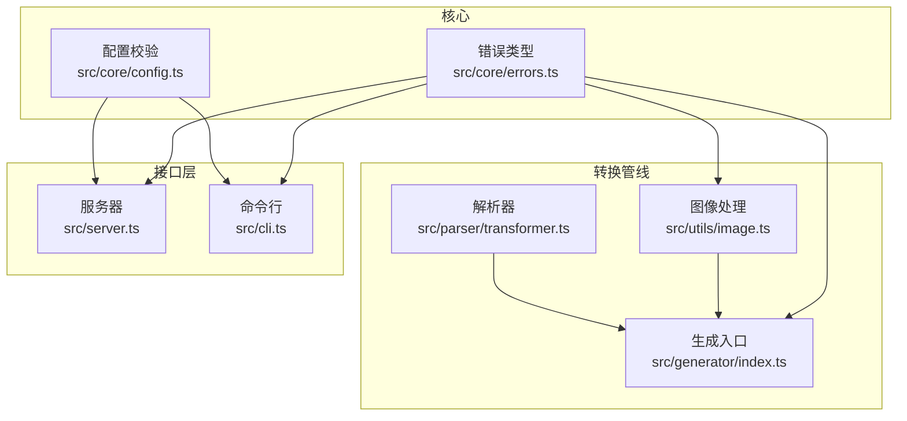
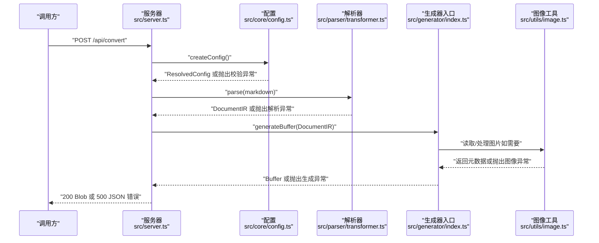
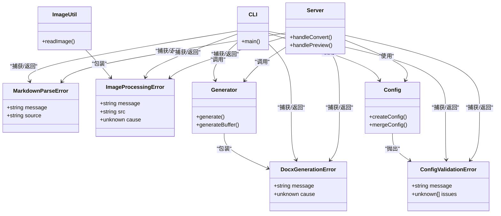
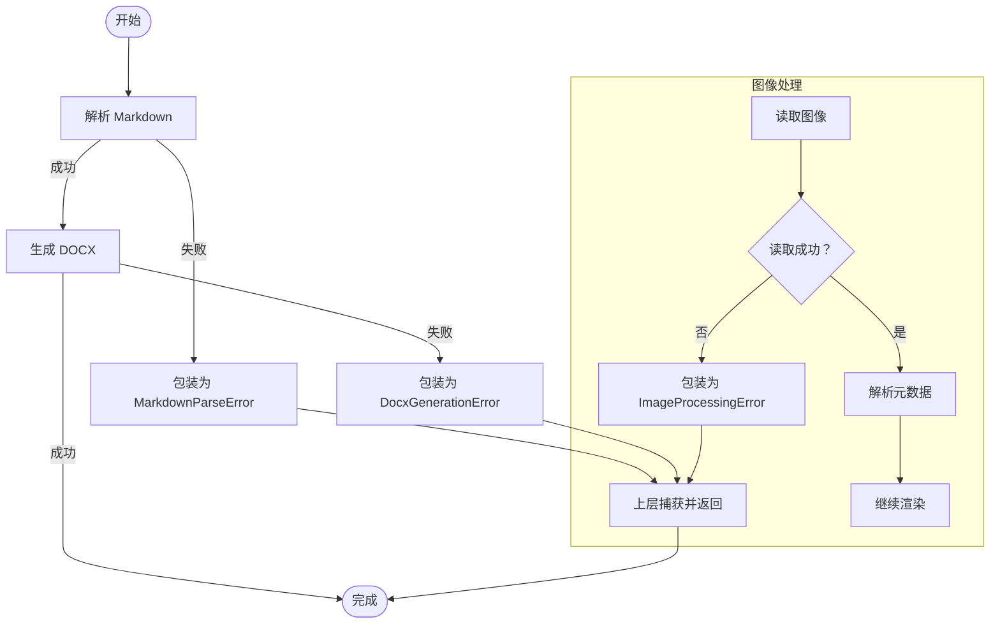

# 错误处理

<cite>
**本文引用的文件**
- [src/core/errors.ts](file://src/core/errors.ts)
- [src/generator/index.ts](file://src/generator/index.ts)
- [src/utils/image.ts](file://src/utils/image.ts)
- [src/core/config.ts](file://src/core/config.ts)
- [src/server.ts](file://src/server.ts)
- [src/cli.ts](file://src/cli.ts)
- [src/parser/transformer.ts](file://src/parser/transformer.ts)
- [tests/unit/core/config.test.ts](file://tests/unit/core/config.test.ts)
</cite>

## 目录
1. [简介](#简介)
2. [项目结构](#项目结构)
3. [核心组件](#核心组件)
4. [架构总览](#架构总览)
5. [详细组件分析](#详细组件分析)
6. [依赖分析](#依赖分析)
7. [性能考虑](#性能考虑)
8. [故障排查指南](#故障排查指南)
9. [结论](#结论)
10. [附录](#附录)

## 简介
本文件系统性梳理本项目的错误处理 API，聚焦以下错误类型：MarkdownParseError、DocxGenerationError、ImageProcessingError、ConfigValidationError。内容涵盖：
- 错误类型结构与字段
- 触发场景与典型错误消息来源
- 建议的错误码与消息格式（统一化建议）
- 捕获与处理示例（以路径代替具体代码）
- 调试技巧与常见问题解决
- 错误恢复与降级策略

## 项目结构
围绕错误处理的关键模块与文件如下：
- 错误类型定义：src/core/errors.ts
- 文档生成流程：src/generator/index.ts
- 图像处理流程：src/utils/image.ts
- 配置校验与解析：src/core/config.ts
- 服务端入口与错误响应：src/server.ts
- CLI 入口与错误输出：src/cli.ts
- 解析器（含图像提取逻辑）：src/parser/transformer.ts
- 配置校验单元测试：tests/unit/core/config.test.ts

图表来源
- [src/core/errors.ts:1-27](file://src/core/errors.ts#L1-L27)
- [src/core/config.ts:68-81](file://src/core/config.ts#L68-L81)
- [src/parser/transformer.ts:102-117](file://src/parser/transformer.ts#L102-L117)
- [src/generator/index.ts:7-18](file://src/generator/index.ts#L7-L18)
- [src/utils/image.ts:12-42](file://src/utils/image.ts#L12-L42)
- [src/server.ts:23-49](file://src/server.ts#L23-L49)
- [src/cli.ts:69-110](file://src/cli.ts#L69-L110)

章节来源
- [src/core/errors.ts:1-27](file://src/core/errors.ts#L1-L27)
- [src/core/config.ts:68-81](file://src/core/config.ts#L68-L81)
- [src/generator/index.ts:7-18](file://src/generator/index.ts#L7-L18)
- [src/utils/image.ts:12-42](file://src/utils/image.ts#L12-L42)
- [src/server.ts:23-49](file://src/server.ts#L23-L49)
- [src/cli.ts:69-110](file://src/cli.ts#L69-L110)
- [src/parser/transformer.ts:102-117](file://src/parser/transformer.ts#L102-L117)

## 核心组件
本项目通过一组专用错误类实现清晰的错误语义与上下文传递：
- MarkdownParseError：用于标记解析阶段的异常，携带可选的 source 字段以便定位来源。
- DocxGenerationError：用于文档生成阶段的异常，携带可选的 cause 以便透传底层错误。
- ImageProcessingError：用于图像读取与元数据解析阶段的异常，携带 src 与可选 cause。
- ConfigValidationError：用于配置输入校验失败时的异常，携带可选 issues 列表。

这些错误类均继承自原生 Error，便于在不同运行环境（CLI、服务器、浏览器）中一致处理。

章节来源
- [src/core/errors.ts:1-27](file://src/core/errors.ts#L1-L27)

## 架构总览
下图展示从输入到输出的完整流程以及错误在各环节的传播路径：

图表来源
- [src/server.ts:23-49](file://src/server.ts#L23-L49)
- [src/core/config.ts:68-81](file://src/core/config.ts#L68-L81)
- [src/parser/transformer.ts:102-117](file://src/parser/transformer.ts#L102-L117)
- [src/generator/index.ts:7-18](file://src/generator/index.ts#L7-L18)
- [src/utils/image.ts:12-42](file://src/utils/image.ts#L12-L42)

## 详细组件分析

### MarkdownParseError
- 结构要点
  - 继承自 Error
  - 可选 source 字段，用于标识错误来源（例如原始 Markdown 片段或文件名）
- 触发条件
  - 解析器在处理令牌时遇到不支持或不完整的语法结构
  - 解析器在提取 HTML 块中的图像时，无法匹配到有效的 src
- 建议错误码与消息格式
  - 错误码：MP001
  - 消息格式："解析失败：{message}（来源：{source}）"
- 处理建议
  - 在解析器内部捕获并包装为 MarkdownParseError
  - 将 source 设置为当前处理的 token 或块的标识
  - 在上层（服务器/CLI）统一捕获并返回标准错误响应
- 示例路径
  - 解析器中 HTML 块图像提取失败的分支：[src/parser/transformer.ts:102-117](file://src/parser/transformer.ts#L102-L117)
  - 服务器端捕获与响应：[src/server.ts:23-49](file://src/server.ts#L23-L49)
  - CLI 端捕获与退出：[src/cli.ts:69-110](file://src/cli.ts#L69-L110)

章节来源
- [src/parser/transformer.ts:102-117](file://src/parser/transformer.ts#L102-L117)
- [src/server.ts:23-49](file://src/server.ts#L23-L49)
- [src/cli.ts:69-110](file://src/cli.ts#L69-L110)

### DocxGenerationError
- 结构要点
  - 继承自 Error
  - 可选 cause 字段，用于承载底层生成异常
- 触发条件
  - 生成器在构建 Document 或序列化为 Buffer 时发生异常
- 建议错误码与消息格式
  - 错误码：DG001
  - 消息格式："文档生成失败：{message}（原因：{cause}）"
- 处理建议
  - 在生成器入口处捕获所有异常并包装为 DocxGenerationError
  - 将 cause 设为原始错误对象，便于上层诊断
  - 服务器端统一返回 500 并包含 message
- 示例路径
  - 生成器入口捕获与重抛：[src/generator/index.ts:7-18](file://src/generator/index.ts#L7-L18)
  - 服务器端捕获与响应：[src/server.ts:23-49](file://src/server.ts#L23-L49)
  - CLI 端捕获与退出：[src/cli.ts:69-110](file://src/cli.ts#L69-L110)

章节来源
- [src/generator/index.ts:7-18](file://src/generator/index.ts#L7-L18)
- [src/server.ts:23-49](file://src/server.ts#L23-L49)
- [src/cli.ts:69-110](file://src/cli.ts#L69-L110)

### ImageProcessingError
- 结构要点
  - 继承自 Error
  - 必填 src 字段，记录导致失败的图像地址
  - 可选 cause 字段，承载底层异常
- 触发条件
  - 读取远程图片时网络请求失败
  - 读取本地文件时文件不存在或权限不足
  - 使用图像库解析元数据失败
- 建议错误码与消息格式
  - 错误码：IP001
  - 消息格式："图像处理失败：{message}（源地址：{src}）"
- 处理建议
  - 在图像工具函数内优先捕获并抛出 ImageProcessingError
  - 对于已知的 ImageProcessingError 直接 rethrow，避免重复包装
  - 上层根据需要降级为占位文本或跳过该图片
- 示例路径
  - 远程/本地读取与元数据解析：[src/utils/image.ts:12-42](file://src/utils/image.ts#L12-L42)
  - 服务器端捕获与响应：[src/server.ts:23-49](file://src/server.ts#L23-L49)
  - CLI 端捕获与退出：[src/cli.ts:69-110](file://src/cli.ts#L69-L110)

章节来源
- [src/utils/image.ts:12-42](file://src/utils/image.ts#L12-L42)
- [src/server.ts:23-49](file://src/server.ts#L23-L49)
- [src/cli.ts:69-110](file://src/cli.ts#L69-L110)

### ConfigValidationError
- 结构要点
  - 继承自 Error
  - 可选 issues 字段，承载校验器返回的详细问题列表
- 触发条件
  - createConfig 或 mergeConfig 在解析用户输入时触发 Zod 校验失败
- 建议错误码与消息格式
  - 错误码：CV001
  - 消息格式："配置校验失败：{message}（问题详情：{issues}）"
- 处理建议
  - 在配置创建与合并处直接使用 Zod 校验，失败即抛出 ConfigValidationError
  - 服务器端捕获后返回 400，并包含 message 与 issues
  - CLI 端打印错误并优雅退出
- 示例路径
  - 配置校验与创建：[src/core/config.ts:68-81](file://src/core/config.ts#L68-L81)
  - 服务器端捕获与响应：[src/server.ts:23-49](file://src/server.ts#L23-L49)
  - CLI 端捕获与退出：[src/cli.ts:69-110](file://src/cli.ts#L69-L110)
  - 单元测试断言无效值抛错：[tests/unit/core/config.test.ts:22-24](file://tests/unit/core/config.test.ts#L22-L24)

章节来源
- [src/core/config.ts:68-81](file://src/core/config.ts#L68-L81)
- [src/server.ts:23-49](file://src/server.ts#L23-L49)
- [src/cli.ts:69-110](file://src/cli.ts#L69-L110)
- [tests/unit/core/config.test.ts:22-24](file://tests/unit/core/config.test.ts#L22-L24)

## 依赖分析
- 错误类型被广泛复用：
  - 服务器端：统一捕获并返回标准化错误
  - CLI 端：捕获后打印 message 并退出
  - 生成器入口：捕获底层异常并包装为 DocxGenerationError
  - 图像工具：捕获底层异常并包装为 ImageProcessingError
  - 配置模块：Zod 校验失败时抛出 ConfigValidationError
- 解析器在提取 HTML 块中的图像时，若未匹配到有效 src，会触发 MarkdownParseError（由上层包装）

图表来源
- [src/core/errors.ts:1-27](file://src/core/errors.ts#L1-L27)
- [src/server.ts:23-49](file://src/server.ts#L23-L49)
- [src/cli.ts:69-110](file://src/cli.ts#L69-L110)
- [src/generator/index.ts:7-18](file://src/generator/index.ts#L7-L18)
- [src/utils/image.ts:12-42](file://src/utils/image.ts#L12-L42)
- [src/core/config.ts:68-81](file://src/core/config.ts#L68-L81)

## 性能考虑
- 错误包装与传播成本极低，主要开销在于异常堆栈收集与序列化。建议：
  - 在高频路径（如图像处理循环）避免重复包装同一错误
  - 仅在必要时保留 cause，减少序列化体积
  - 在服务器端对错误进行轻量级日志记录，避免阻塞响应

## 故障排查指南
- 常见问题与定位
  - 配置校验失败：检查输入字段类型与范围，参考配置校验规则与单元测试断言
    - 参考：[src/core/config.ts:68-81](file://src/core/config.ts#L68-L81)，[tests/unit/core/config.test.ts:22-24](file://tests/unit/core/config.test.ts#L22-L24)
  - 图像处理失败：确认 src 是否为有效 URL 或本地路径；检查网络连通性与文件权限
    - 参考：[src/utils/image.ts:12-42](file://src/utils/image.ts#L12-L42)
  - 文档生成失败：检查生成器构建过程与第三方库依赖（如 docx 序列化）
    - 参考：[src/generator/index.ts:7-18](file://src/generator/index.ts#L7-L18)
  - 服务器端 500：查看控制台日志与错误 message；区分是否为 LibreOffice 缺失导致的预览失败
    - 参考：[src/server.ts:23-49](file://src/server.ts#L23-L49)，[src/server.ts:51-84](file://src/server.ts#L51-L84)
- 调试技巧
  - 在 CLI 中添加更详细的日志输出（如错误堆栈）
  - 在服务器端记录请求 ID 与错误上下文，便于追踪
  - 使用单元测试覆盖边界条件（如非法配置、空图像 src）

章节来源
- [src/core/config.ts:68-81](file://src/core/config.ts#L68-L81)
- [tests/unit/core/config.test.ts:22-24](file://tests/unit/core/config.test.ts#L22-L24)
- [src/utils/image.ts:12-42](file://src/utils/image.ts#L12-L42)
- [src/generator/index.ts:7-18](file://src/generator/index.ts#L7-L18)
- [src/server.ts:23-49](file://src/server.ts#L23-L49)
- [src/server.ts:51-84](file://src/server.ts#L51-L84)

## 结论
本项目通过明确的错误类型与一致的包装策略，实现了从解析、生成到图像处理与配置校验的全链路错误管理。建议在生产环境中：
- 统一错误码与消息格式，便于监控与告警
- 在上层统一捕获并返回标准化错误响应
- 对关键路径增加降级策略（如图像失败时替换为占位文本）

## 附录

### 错误类型与处理流程图

图表来源
- [src/parser/transformer.ts:102-117](file://src/parser/transformer.ts#L102-L117)
- [src/generator/index.ts:7-18](file://src/generator/index.ts#L7-L18)
- [src/utils/image.ts:12-42](file://src/utils/image.ts#L12-L42)