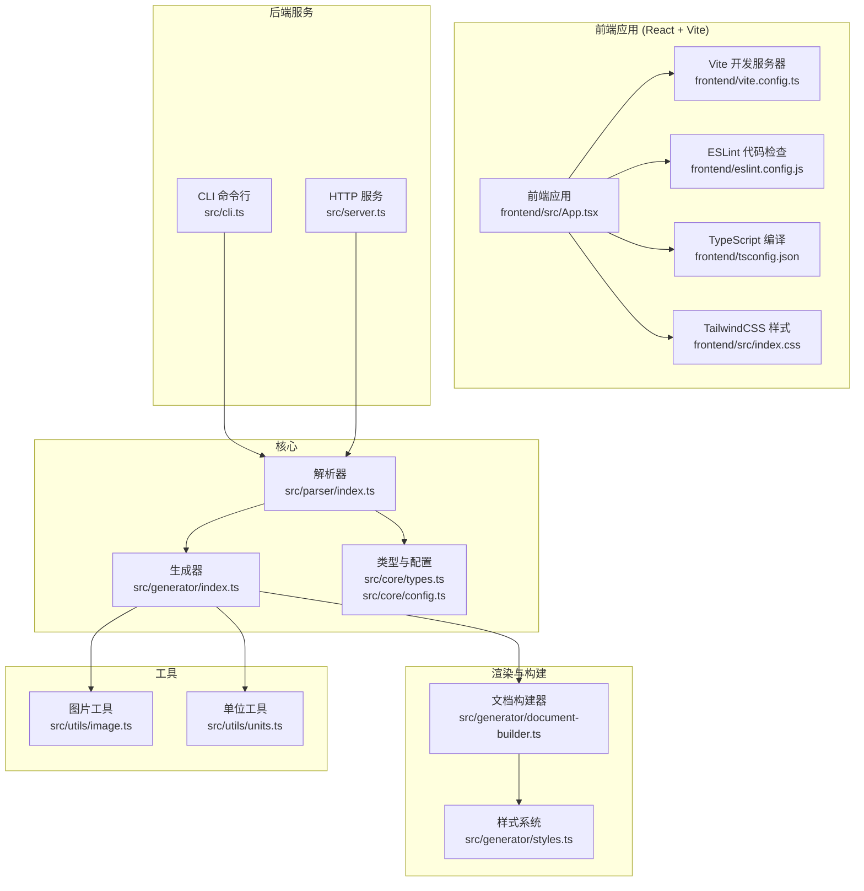
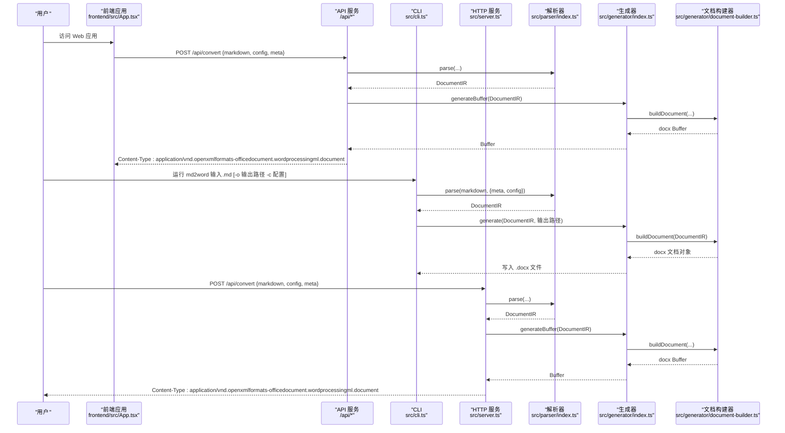
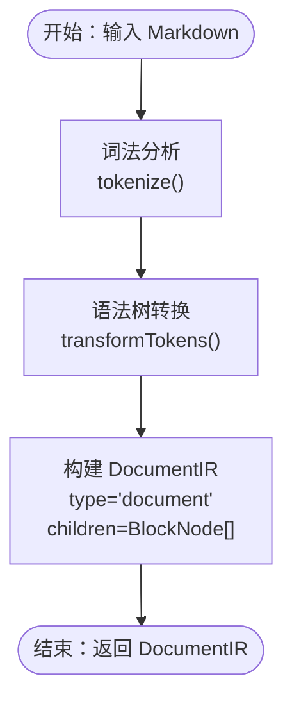
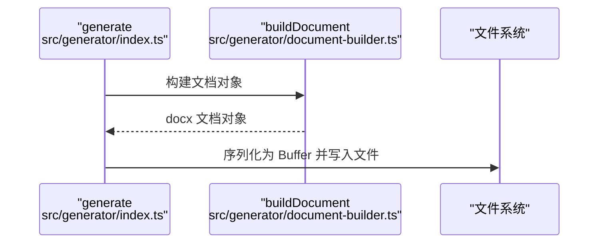
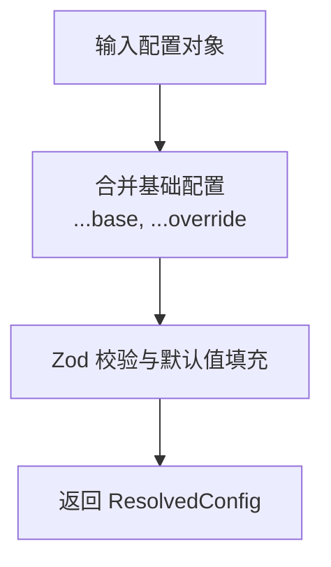
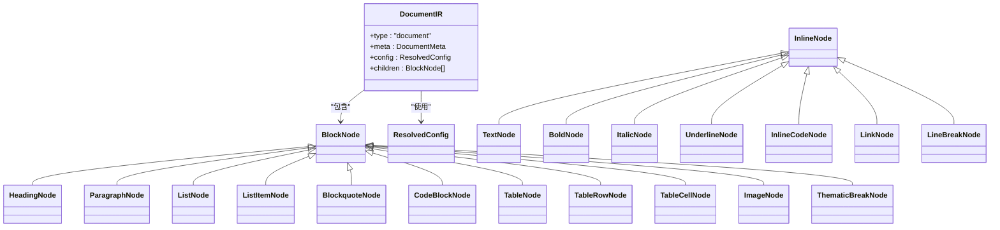
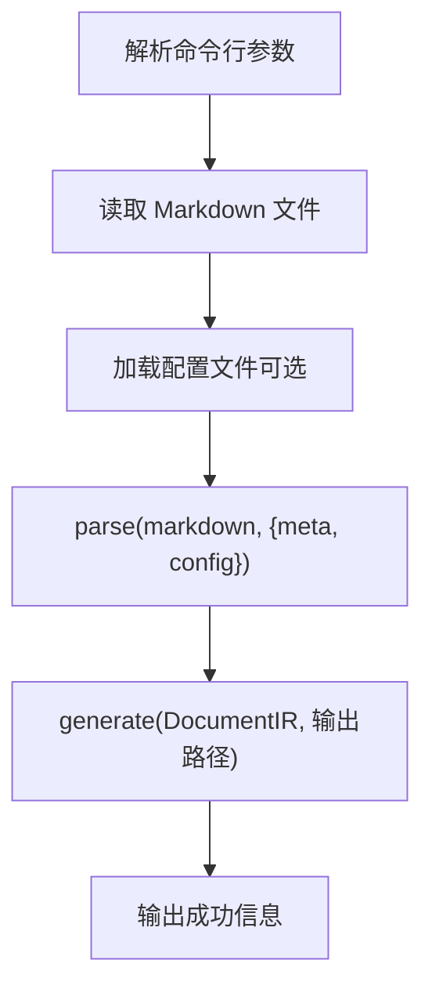
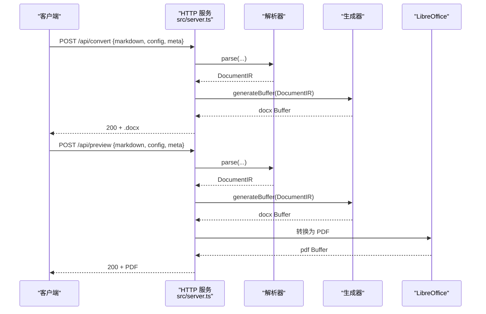
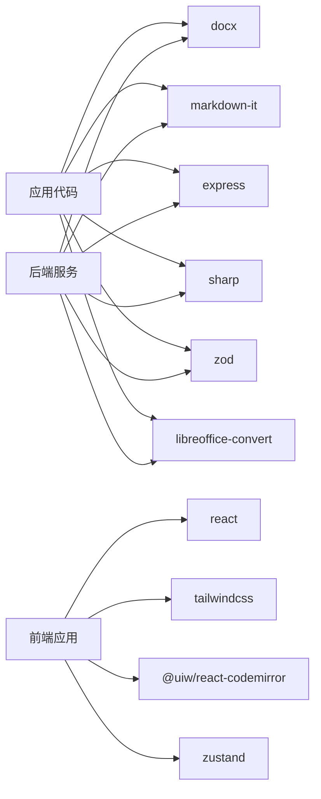

# 开发指南

<cite>
**本文引用的文件**
- [package.json](file://package.json)
- [frontend/package.json](file://frontend/package.json)
- [frontend/vite.config.ts](file://frontend/vite.config.ts)
- [frontend/eslint.config.js](file://frontend/eslint.config.js)
- [frontend/tsconfig.json](file://frontend/tsconfig.json)
- [frontend/tsconfig.app.json](file://frontend/tsconfig.app.json)
- [frontend/src/main.tsx](file://frontend/src/main.tsx)
- [frontend/src/App.tsx](file://frontend/src/App.tsx)
- [frontend/src/index.css](file://frontend/src/index.css)
- [frontend/src/components/editor/MarkdownEditor.tsx](file://frontend/src/components/editor/MarkdownEditor.tsx)
- [frontend/src/components/preview/PreviewPanel.tsx](file://frontend/src/components/preview/PreviewPanel.tsx)
- [frontend/src/store/useStore.ts](file://frontend/src/store/useStore.ts)
- [frontend/src/services/api.ts](file://frontend/src/services/api.ts)
- [frontend/src/utils/smartParser.ts](file://frontend/src/utils/smartParser.ts)
- [src/index.ts](file://src/index.ts)
- [src/parser/index.ts](file://src/parser/index.ts)
- [src/generator/index.ts](file://src/generator/index.ts)
- [src/core/types.ts](file://src/core/types.ts)
- [src/core/config.ts](file://src/core/config.ts)
- [src/cli.ts](file://src/cli.ts)
- [src/server.ts](file://src/server.ts)
- [src/generator/document-builder.ts](file://src/generator/document-builder.ts)
- [src/generator/styles.ts](file://src/generator/styles.ts)
- [src/parser/tokenize.ts](file://src/parser/tokenize.ts)
- [src/parser/transformer.ts](file://src/parser/transformer.ts)
- [src/utils/image.ts](file://src/utils/image.ts)
- [src/utils/units.ts](file://src/utils/units.ts)
- [tests/e2e/full-pipeline.test.ts](file://tests/e2e/full-pipeline.test.ts)
- [tests/unit/parser/transformer.test.ts](file://tests/unit/parser/transformer.test.ts)
- [tests/unit/core/config.test.ts](file://tests/unit/core/config.test.ts)
</cite>

## 目录
1. [简介](#简介)
2. [项目结构](#项目结构)
3. [核心组件](#核心组件)
4. [架构总览](#架构总览)
5. [详细组件分析](#详细组件分析)
6. [开发环境与工具链](#开发环境与工具链)
7. [依赖分析](#依赖分析)
8. [性能考虑](#性能考虑)
9. [故障排查指南](#故障排查指南)
10. [结论](#结论)
11. [附录](#附录)

## 简介
本项目是一个可定制样式的 Markdown 到 Word（.docx）转换器，提供命令行工具与 Web 服务两种使用方式。其核心由三部分组成：解析器负责将 Markdown 文本转为内部文档中间表示（IR），生成器将 IR 渲染为 docx 文档，配置系统提供字体、字号、间距、页边距、颜色等样式参数的校验与合并。项目还包含 CLI、HTTP 服务器、图片处理与单位转换等辅助模块，并配有端到端与单元测试。

**更新** 项目现已采用现代化前端开发流程，包含 Vite 开发服务器、TypeScript 编译、ESLint 代码检查与 TailwindCSS 样式框架，提供完整的前端开发体验。

## 项目结构
项目采用按功能分层的组织方式，核心目录与职责如下：
- src/core：类型定义与配置系统（Zod 校验、默认配置）
- src/parser：解析器（tokenize + transformer），输出 DocumentIR
- src/generator：生成器（document-builder + styles），输出 docx 文档
- src/utils：通用工具（图片处理、单位换算）
- src/cli.ts：命令行入口
- src/server.ts：Web 服务（/api/convert、/api/preview、/health）
- tests：端到端与单元测试
- public：静态页面（用于演示）
- frontend：React + TypeScript 前端应用，使用 Vite 开发服务器

**图表来源**
- [frontend/src/App.tsx:1-68](file://frontend/src/App.tsx#L1-L68)
- [frontend/vite.config.ts:1-22](file://frontend/vite.config.ts#L1-L22)
- [frontend/eslint.config.js:1-23](file://frontend/eslint.config.js#L1-L23)
- [frontend/tsconfig.json:1-8](file://frontend/tsconfig.json#L1-L8)
- [frontend/src/index.css:1-48](file://frontend/src/index.css#L1-L48)

**章节来源**
- [package.json:1-57](file://package.json#L1-L57)
- [frontend/package.json:1-44](file://frontend/package.json#L1-L44)
- [src/index.ts:1-25](file://src/index.ts#L1-L25)

## 核心组件
- 解析器（Parser）
  - 输入：Markdown 字符串
  - 处理：先进行词法分析（tokenize），再进行语法树转换（transformer），最终生成 DocumentIR
  - 输出：DocumentIR（包含元信息、配置与块级节点列表）
- 生成器（Generator）
  - 输入：DocumentIR
  - 处理：构建 docx 文档对象，序列化为 Buffer 并写入文件或返回
  - 错误：捕获生成异常并抛出 DocxGenerationError
- 配置系统（Core Config）
  - 使用 Zod 对配置进行强类型校验与默认值填充
  - 提供 createConfig 与 mergeConfig，支持运行时覆盖
- 类型系统（Core Types）
  - 定义 DocumentIR、块级节点、内联节点、配置项等完整类型体系

**章节来源**
- [src/parser/index.ts:11-21](file://src/parser/index.ts#L11-L21)
- [src/generator/index.ts:7-18](file://src/generator/index.ts#L7-L18)
- [src/core/config.ts:68-91](file://src/core/config.ts#L68-L91)
- [src/core/types.ts:1-198](file://src/core/types.ts#L1-L198)

## 架构总览
下图展示了从输入 Markdown 到输出 .docx 的整体流程，以及 CLI 与 HTTP 服务的调用路径。

**图表来源**
- [frontend/src/services/api.ts:31-82](file://frontend/src/services/api.ts#L31-L82)
- [src/cli.ts:69-113](file://src/cli.ts#L69-L113)
- [src/server.ts:23-49](file://src/server.ts#L23-L49)
- [src/parser/index.ts:11-21](file://src/parser/index.ts#L11-L21)
- [src/generator/index.ts:7-18](file://src/generator/index.ts#L7-L18)
- [src/generator/document-builder.ts](file://src/generator/document-builder.ts)

## 详细组件分析

### 解析器（Parser）
- 词法分析（tokenize）
  - 将 Markdown 文本切分为标记序列，为后续语法树构建做准备
- 语法树转换（transformer）
  - 将标记序列转换为块级节点（Heading、Paragraph、List、Blockquote、CodeBlock、Table、Image、ThematicBreak）与内联节点（Text、Bold、Italic、Underline、InlineCode、Link、LineBreak）的嵌套结构
- 中间表示（DocumentIR）
  - 包含文档元信息（标题、作者、日期）、解析配置（ResolvedConfig）与块级节点数组

**图表来源**
- [src/parser/index.ts:11-21](file://src/parser/index.ts#L11-L21)
- [src/parser/tokenize.ts](file://src/parser/tokenize.ts)
- [src/parser/transformer.ts](file://src/parser/transformer.ts)
- [src/core/types.ts:7-89](file://src/core/types.ts#L7-L89)

**章节来源**
- [src/parser/index.ts:1-24](file://src/parser/index.ts#L1-L24)
- [src/core/types.ts:14-135](file://src/core/types.ts#L14-L135)

### 生成器（Generator）
- generate
  - 接收 DocumentIR 与输出路径，构建 docx 文档并写入文件
  - 异常包装为 DocxGenerationError
- buildDocument
  - 由文档构建器实现，将 IR 转换为 docx 文档对象
- 样式系统（styles）
  - 定义字体、字号、段落间距、页边距、颜色等样式映射规则

**图表来源**
- [src/generator/index.ts:7-18](file://src/generator/index.ts#L7-L18)
- [src/generator/document-builder.ts](file://src/generator/document-builder.ts)
- [src/generator/styles.ts](file://src/generator/styles.ts)

**章节来源**
- [src/generator/index.ts:1-21](file://src/generator/index.ts#L1-L21)
- [src/generator/styles.ts](file://src/generator/styles.ts)

### 配置系统（Core Config）
- 使用 Zod Schema 定义配置字段与默认值
- createConfig：对传入配置进行校验与合并，默认值填充
- mergeConfig：在已有配置基础上进行增量覆盖
- defaultConfig：完整的默认配置对象

**图表来源**
- [src/core/config.ts:68-91](file://src/core/config.ts#L68-L91)

**章节来源**
- [src/core/config.ts:1-91](file://src/core/config.ts#L1-L91)

### 类型系统（Core Types）
- DocumentIR：文档根节点，包含元信息、配置与块级节点数组
- 块级节点：Heading、Paragraph、List、ListItem、Blockquote、CodeBlock、Table、TableRow、TableCell、Image、ThematicBreak
- 内联节点：Text、Bold、Italic、Underline、InlineCode、Link、LineBreak
- 配置项：Font、Size、Spacing、Margin、Image、HeaderFooter、Color、PageSize、Orientation

**图表来源**
- [src/core/types.ts:7-198](file://src/core/types.ts#L7-L198)

**章节来源**
- [src/core/types.ts:1-198](file://src/core/types.ts#L1-L198)

### 工具函数（Utils）
- 图片处理（src/utils/image.ts）
  - 支持图片尺寸调整、格式转换、内联图片处理等能力
- 单位换算（src/utils/units.ts）
  - 提供像素、磅、英寸等单位之间的换算工具

**章节来源**
- [src/utils/image.ts](file://src/utils/image.ts)
- [src/utils/units.ts](file://src/utils/units.ts)

### 命令行工具（CLI）
- 支持参数：输入文件、输出路径、配置文件、标题、作者、帮助
- 流程：读取 Markdown → 加载配置 → 解析 → 生成 .docx → 输出成功信息

**图表来源**
- [src/cli.ts:27-113](file://src/cli.ts#L27-L113)

**章节来源**
- [src/cli.ts:1-113](file://src/cli.ts#L1-L113)

### Web 服务（Server）
- /api/convert：接收 markdown、config、meta，返回 .docx 文件
- /api/preview：生成 .docx 后通过 LibreOffice 转换为 PDF 预览
- /health：健康检查
- 错误处理：针对缺少 soffice 二进制的情况给出明确提示

**图表来源**
- [src/server.ts:23-85](file://src/server.ts#L23-L85)

**章节来源**
- [src/server.ts:1-94](file://src/server.ts#L1-L94)

### 前端应用（React + Vite）
- 应用入口：frontend/src/main.tsx 创建 React 根实例
- 主组件：frontend/src/App.tsx 实现响应式布局与状态管理
- 编辑器：frontend/src/components/editor/MarkdownEditor.tsx 基于 CodeMirror 的 Markdown 编辑器
- 预览面板：frontend/src/components/preview/PreviewPanel.tsx 支持多种预览模式（Markdown、HTML、docx-preview、PDF、Collabora）
- 状态管理：frontend/src/store/useStore.ts 使用 Zustand 管理全局状态
- API 服务：frontend/src/services/api.ts 封装后端 API 调用
- 智能解析：frontend/src/utils/smartParser.ts 支持自然语言配置输入

**章节来源**
- [frontend/src/main.tsx:1-11](file://frontend/src/main.tsx#L1-L11)
- [frontend/src/App.tsx:1-68](file://frontend/src/App.tsx#L1-L68)
- [frontend/src/components/editor/MarkdownEditor.tsx:1-125](file://frontend/src/components/editor/MarkdownEditor.tsx#L1-L125)
- [frontend/src/components/preview/PreviewPanel.tsx:1-237](file://frontend/src/components/preview/PreviewPanel.tsx#L1-L237)
- [frontend/src/store/useStore.ts:1-210](file://frontend/src/store/useStore.ts#L1-L210)
- [frontend/src/services/api.ts:1-83](file://frontend/src/services/api.ts#L1-L83)
- [frontend/src/utils/smartParser.ts:1-87](file://frontend/src/utils/smartParser.ts#L1-L87)

## 开发环境与工具链

### 前端开发环境
项目采用现代化前端技术栈，提供完整的开发体验：

- **Vite 开发服务器**
  - 快速热重载开发服务器
  - 内置代理配置，支持 API 跨域请求
  - 生产构建输出到 public 目录

- **TypeScript 支持**
  - 分离的应用配置与 Node.js 配置
  - ES2023 目标环境，支持现代 JavaScript 特性
  - JSX 支持，React 类型安全

- **ESLint 代码检查**
  - 基于 TypeScript ESLint 推荐配置
  - React Hooks 和 React Refresh 插件
  - 全局浏览器环境配置

- **样式框架**
  - TailwindCSS v4 + @tailwindcss/vite 插件
  - 自定义滚动条样式
  - Markdown 预览样式定制

### 后端开发环境
- **TypeScript 编译**
  - 使用 tsup 进行 ESM 格式编译
  - 自动生成类型声明文件
  - 支持 watch 模式开发

- **并发开发**
  - 同时启动后端、前端和服务器进程
  - 独立的开发脚本分离前后端

### 开发脚本
- `npm run dev`：启动完整开发环境（后端 + 服务器 + 前端）
- `npm run dev:backend`：仅启动后端开发服务器
- `npm run dev:frontend`：启动前端 Vite 开发服务器
- `npm run dev:server`：启动生产服务器
- `npm run build`：构建完整应用（后端 + 前端）
- `npm run build:frontend`：仅构建前端应用

**章节来源**
- [package.json:11-25](file://package.json#L11-L25)
- [frontend/package.json:6-11](file://frontend/package.json#L6-L11)
- [frontend/vite.config.ts:1-22](file://frontend/vite.config.ts#L1-L22)
- [frontend/eslint.config.js:1-23](file://frontend/eslint.config.js#L1-L23)
- [frontend/tsconfig.json:1-8](file://frontend/tsconfig.json#L1-L8)
- [frontend/tsconfig.app.json:1-26](file://frontend/tsconfig.app.json#L1-L26)

## 依赖分析
- 运行时依赖
  - docx：生成 .docx 文档
  - markdown-it：解析 Markdown
  - express + cors：Web 服务
  - sharp：图片处理
  - libreoffice、libreoffice-convert：PDF 预览
  - zod：配置校验
- 开发依赖
  - TypeScript、tsup、Vitest 等
  - Vite、React、TailwindCSS 等前端开发工具

**图表来源**
- [package.json:34-55](file://package.json#L34-L55)
- [frontend/package.json:12-42](file://frontend/package.json#L12-L42)

**章节来源**
- [package.json:1-57](file://package.json#L1-L57)
- [frontend/package.json:1-44](file://frontend/package.json#L1-L44)

## 性能考虑
- 解析阶段
  - 将 Markdown 先进行词法分析再转换，避免重复扫描，提升可维护性
- 生成阶段
  - 使用 docx 的打包器一次性生成 Buffer，减少多次 I/O
  - 对大图片建议在生成前预处理，降低内存峰值
- 服务端
  - 限制请求体大小，避免超大文档导致内存溢出
  - PDF 预览依赖外部 LibreOffice，需确保环境可用，否则回退错误提示
- 缓存与复用
  - 可在业务层缓存常用配置与样式映射，减少重复计算
- 前端性能
  - 使用 React.memo 优化组件渲染
  - 智能预览延迟加载，避免频繁转换
  - Zustand 状态管理减少不必要的重渲染

## 故障排查指南
- CLI/服务端报错
  - 检查输入文件是否存在、权限是否正确
  - 确认配置 JSON 结构与字段名符合 ResolvedConfig
- 生成失败
  - 捕获 DocxGenerationError，查看底层异常栈定位问题
- PDF 预览失败
  - 若提示找不到 soffice 二进制，安装 LibreOffice 并确保 PATH 可找到
- 前端开发问题
  - Vite 代理配置：确认 /api 和 /wopi 代理指向正确的后端地址
  - TypeScript 类型错误：检查配置接口与实际数据结构匹配
  - ESLint 报错：根据推荐配置修复代码风格问题
- 单元测试与端到端测试
  - 使用 Vitest 运行测试，定位类型校验、解析转换、配置合并等问题

**章节来源**
- [src/generator/index.ts:12-17](file://src/generator/index.ts#L12-L17)
- [src/server.ts:74-84](file://src/server.ts#L74-L84)
- [frontend/vite.config.ts:15-20](file://frontend/vite.config.ts#L15-L20)
- [frontend/eslint.config.js:8-22](file://frontend/eslint.config.js#L8-L22)
- [tests/e2e/full-pipeline.test.ts](file://tests/e2e/full-pipeline.test.ts)
- [tests/unit/parser/transformer.test.ts](file://tests/unit/parser/transformer.test.ts)
- [tests/unit/core/config.test.ts](file://tests/unit/core/config.test.ts)

## 结论
本项目以清晰的分层架构实现了从 Markdown 到 .docx 的转换：解析器负责将文本抽象为 IR，生成器负责将 IR 渲染为文档对象并写出文件；配置系统提供强类型的样式控制。CLI 与 HTTP 服务分别满足本地与在线场景。通过完善的测试与错误处理，项目具备良好的可维护性与扩展性。

**更新** 现代化前端开发流程的引入使得项目具备了更优秀的开发体验：Vite 提供快速热重载，TypeScript 确保类型安全，ESLint 保证代码质量，React + Zustand 提供响应式状态管理，为用户提供了直观易用的 Web 界面。

## 附录

### 代码贡献指南
- 开发环境
  - 安装 Node.js 与包管理器
  - 安装依赖：npm install
  - 安装 LibreOffice（用于 PDF 预览）：https://www.libreoffice.org/download/download/
  - 前端依赖：cd frontend && npm install
- 代码规范
  - 使用 TypeScript，遵循现有命名与导出风格
  - 前端使用 ESLint 检查，遵循推荐配置
  - 新增功能需补充类型定义与 Zod Schema 校验
- 测试要求
  - 单元测试：tests/unit 下新增对应测试文件
  - 端到端测试：tests/e2e 下新增场景测试
  - 运行测试：npm test 或 npm run test:watch
- 提交流程
  - 分支命名：feature/xxx、fix/xxx、docs/xxx
  - 提交信息：遵循 Conventional Commits 规范
  - 发起 Pull Request 前确保所有测试通过
- 前端开发
  - 使用 Vite 开发服务器进行实时预览
  - 遵循 React 组件设计模式
  - 使用 TailwindCSS 进行样式开发

**章节来源**
- [package.json:11-18](file://package.json#L11-L18)
- [frontend/package.json:6-11](file://frontend/package.json#L6-L11)
- [frontend/eslint.config.js:8-22](file://frontend/eslint.config.js#L8-L22)
- [tests/e2e/full-pipeline.test.ts](file://tests/e2e/full-pipeline.test.ts)
- [tests/unit/core/config.test.ts](file://tests/unit/core/config.test.ts)
- [tests/unit/parser/transformer.test.ts](file://tests/unit/parser/transformer.test.ts)

### 扩展点与插件开发
- 自定义渲染器
  - 在生成器中扩展渲染逻辑，将新的 BlockNode/InlineNode 映射到 docx 组件
  - 保持与现有 styles.ts 的样式映射一致
- 自定义配置项
  - 在 ResolvedConfig 中新增字段，并在 configSchema 中定义默认值与校验
  - 在 createConfig/mergeConfig 中合并新字段
- 自定义工具函数
  - 在 src/utils 下新增模块，遵循现有导出与命名约定
- 前端扩展
  - 新增 React 组件：在 frontend/src/components 下创建新组件
  - 添加新预览模式：在 PreviewPanel 中扩展模式选择器
  - 自定义样式：在 frontend/src/index.css 中添加新样式规则

**章节来源**
- [src/core/config.ts:54-81](file://src/core/config.ts#L54-L81)
- [src/generator/styles.ts](file://src/generator/styles.ts)
- [frontend/src/components/preview/PreviewPanel.tsx:152-201](file://frontend/src/components/preview/PreviewPanel.tsx#L152-L201)
- [frontend/src/index.css:1-48](file://frontend/src/index.css#L1-L48)

### 开发环境配置
- Vite 配置
  - 代理设置：/api -> http://localhost:3000, /wopi -> http://localhost:3000
  - 构建输出：../public 目录
  - 插件：React + TailwindCSS
- TypeScript 配置
  - 应用配置：ES2023 目标，React JSX
  - Node 配置：ESNext 目标，TypeScript Node 环境
- ESLint 配置
  - 推荐配置：JavaScript、TypeScript、React Hooks、React Refresh
  - 全局环境：浏览器环境
  - 忽略目录：dist

**章节来源**
- [frontend/vite.config.ts:1-22](file://frontend/vite.config.ts#L1-L22)
- [frontend/tsconfig.app.json:1-26](file://frontend/tsconfig.app.json#L1-L26)
- [frontend/eslint.config.js:1-23](file://frontend/eslint.config.js#L1-L23)