# 扩展与定制开发

<cite>
**本文档引用的文件**
- [block.ts](file://src/generator/renderers/block.ts)
- [inline.ts](file://src/generator/renderers/inline.ts)
- [image.ts](file://src/generator/renderers/image.ts)
- [config.ts](file://src/core/config.ts)
- [types.ts](file://src/core/types.ts)
- [styles.ts](file://src/generator/styles.ts)
- [document-builder.ts](file://src/generator/document-builder.ts)
- [image-utils.ts](file://src/utils/image.ts)
- [units-utils.ts](file://src/utils/units.ts)
- [errors.ts](file://src/core/errors.ts)
- [index.ts](file://src/index.ts)
- [config.test.ts](file://tests/unit/core/config.test.ts)
- [package.json](file://package.json)
</cite>

## 目录
1. [简介](#简介)
2. [项目结构](#项目结构)
3. [核心组件](#核心组件)
4. [架构概览](#架构概览)
5. [详细组件分析](#详细组件分析)
6. [依赖关系分析](#依赖关系分析)
7. [性能考虑](#性能考虑)
8. [故障排除指南](#故障排除指南)
9. [结论](#结论)
10. [附录](#附录)

## 简介

Markdown to Word 转换器是一个基于 TypeScript 的现代化转换工具，专门用于将 Markdown 文档转换为 Microsoft Word (.docx) 格式。该工具提供了高度可定制的渲染系统，支持开发者创建自定义渲染器、扩展配置选项和样式属性。

本项目采用模块化设计，通过清晰的分层架构实现了以下核心功能：
- Markdown 解析和转换
- 块级元素和内联元素的渲染
- 图像处理和缩放
- 配置系统和样式管理
- 错误处理和验证机制

## 项目结构

项目采用功能驱动的模块化组织方式，主要目录结构如下：

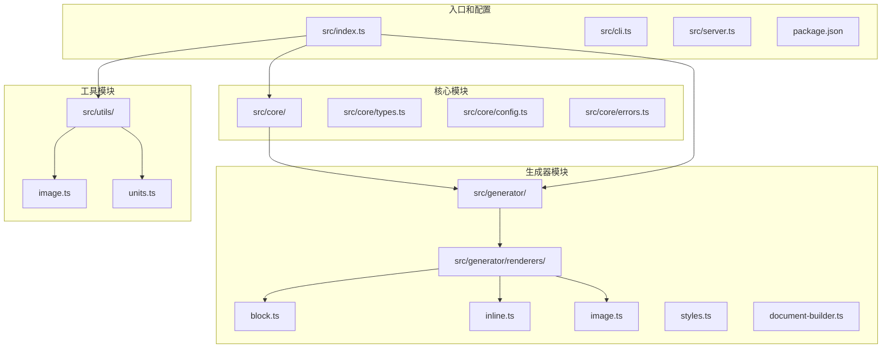

**图表来源**
- [types.ts:1-198](file://src/core/types.ts#L1-L198)
- [config.ts:1-91](file://src/core/config.ts#L1-L91)
- [block.ts:1-266](file://src/generator/renderers/block.ts#L1-L266)

**章节来源**
- [types.ts:1-198](file://src/core/types.ts#L1-L198)
- [config.ts:1-91](file://src/core/config.ts#L1-L91)
- [package.json:1-47](file://package.json#L1-L47)

## 核心组件

### 数据模型和类型系统

项目使用 TypeScript 接口定义了完整的数据模型，确保类型安全和开发体验。

**块级节点类型**：
- `HeadingNode`: 标题节点，支持 1-6 级标题
- `ParagraphNode`: 段落节点，包含内联内容
- `ListNode`: 列表节点，支持有序和无序列表
- `BlockquoteNode`: 引用节点
- `CodeBlockNode`: 代码块节点
- `TableNode`: 表格节点
- `ImageNode`: 图像节点
- `ThematicBreakNode`: 分隔线节点

**内联节点类型**：
- `TextNode`: 文本节点
- `BoldNode`: 粗体节点
- `ItalicNode`: 斜体节点
- `UnderlineNode`: 下划线节点
- `InlineCodeNode`: 行内代码节点
- `LinkNode`: 链接节点
- `LineBreakNode`: 换行节点

**配置系统**：
- 字体配置：主体字体、标题字体、英文字体、代码字体
- 尺寸配置：正文大小、各级标题大小、代码大小
- 间距配置：行间距、段前段后间距、标题间距
- 颜色配置：标题颜色、文本颜色、链接颜色、代码背景色、引用边框色
- 页面配置：页面尺寸、方向、页边距
- 图像配置：最大宽度百分比、默认对齐方式

**章节来源**
- [types.ts:14-98](file://src/core/types.ts#L14-L98)
- [types.ts:91-134](file://src/core/types.ts#L91-L134)
- [types.ts:136-197](file://src/core/types.ts#L136-L197)

### 渲染器架构

渲染器系统采用职责分离的设计模式，将不同类型的节点渲染逻辑分离到独立的模块中：

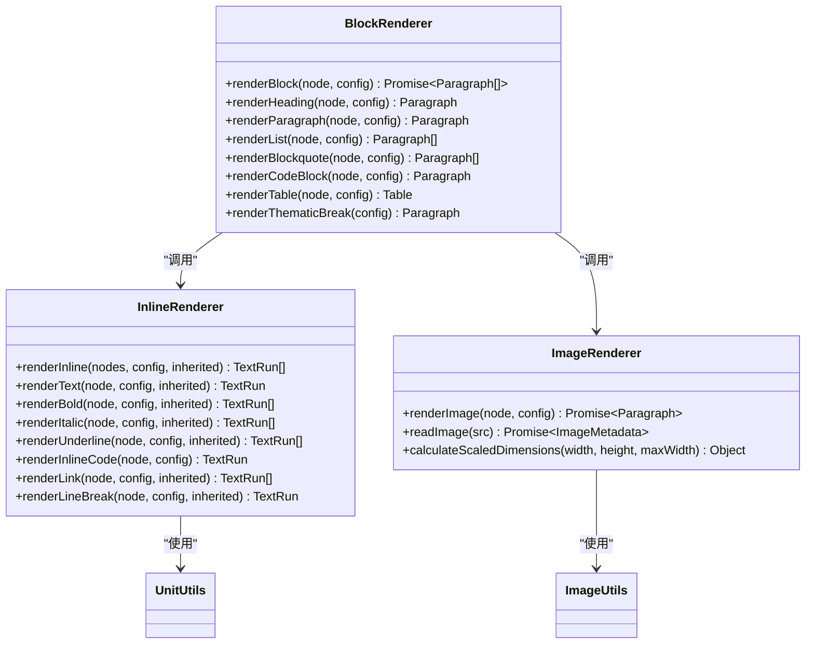

**图表来源**
- [block.ts:28-58](file://src/generator/renderers/block.ts#L28-L58)
- [inline.ts:12-109](file://src/generator/renderers/inline.ts#L12-L109)
- [image.ts:6-60](file://src/generator/renderers/image.ts#L6-L60)

**章节来源**
- [block.ts:1-266](file://src/generator/renderers/block.ts#L1-L266)
- [inline.ts:1-110](file://src/generator/renderers/inline.ts#L1-L110)
- [image.ts:1-61](file://src/generator/renderers/image.ts#L1-L61)

## 架构概览

整个转换流程遵循从解析到渲染再到生成的管道式架构：

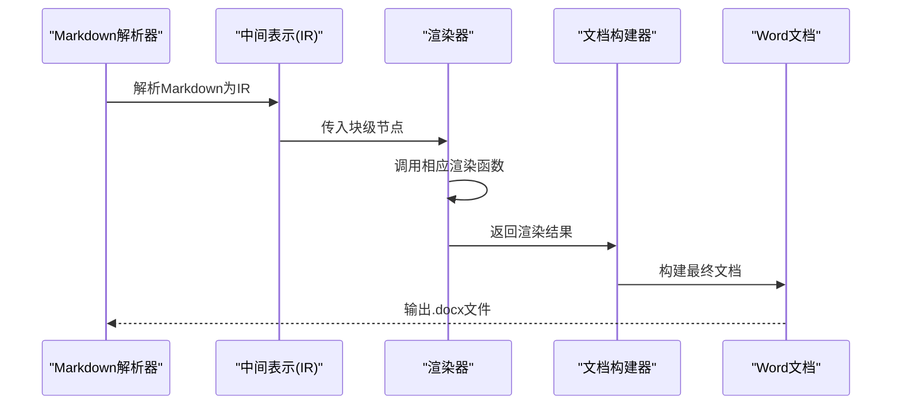

**图表来源**
- [document-builder.ts:17-28](file://src/generator/document-builder.ts#L17-L28)
- [block.ts:28-58](file://src/generator/renderers/block.ts#L28-L58)

**章节来源**
- [document-builder.ts:1-112](file://src/generator/document-builder.ts#L1-L112)

## 详细组件分析

### 块级元素渲染器

块级元素渲染器负责处理 Markdown 中的块级内容，如标题、段落、列表、表格等。

#### 核心渲染流程

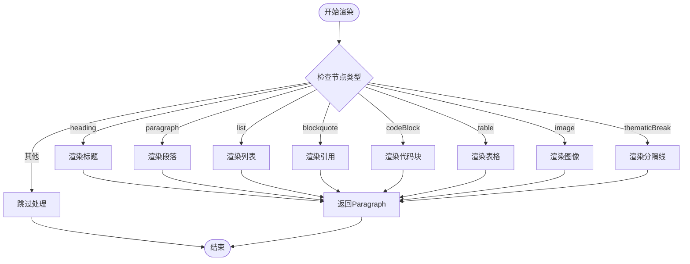

**图表来源**
- [block.ts:28-58](file://src/generator/renderers/block.ts#L28-L58)

#### 标题渲染实现

标题渲染器根据级别映射到相应的 Word 样式，并应用动态间距计算：

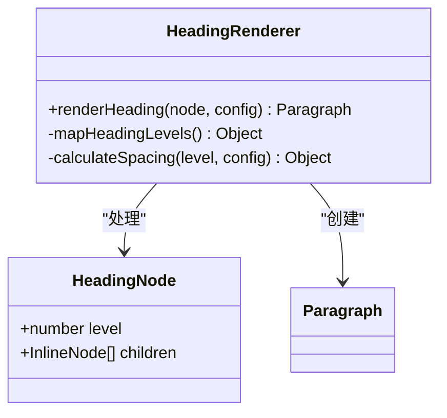

**图表来源**
- [block.ts:60-78](file://src/generator/renderers/block.ts#L60-L78)

#### 列表渲染算法

列表渲染器采用递归处理策略，支持嵌套列表和混合内容：

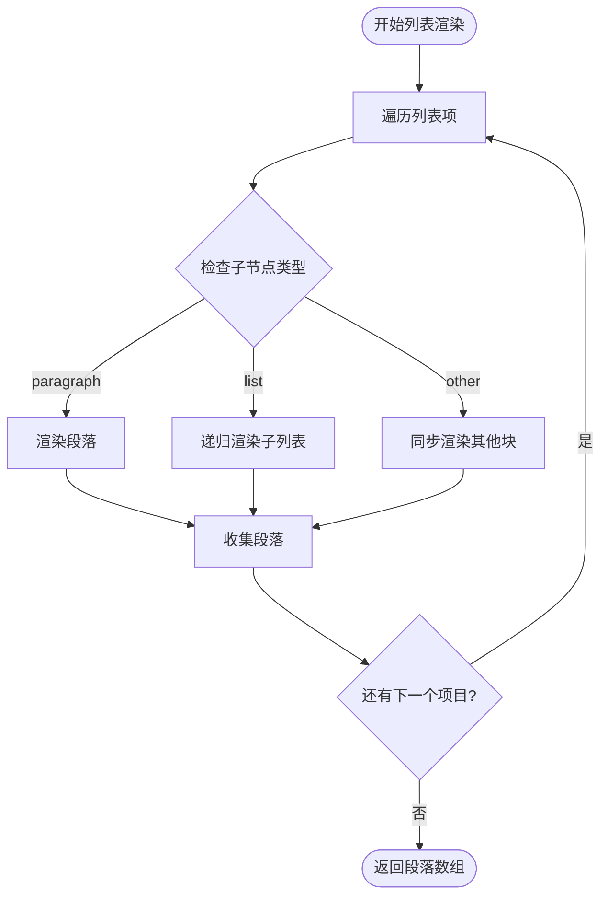

**图表来源**
- [block.ts:92-122](file://src/generator/renderers/block.ts#L92-L122)

**章节来源**
- [block.ts:60-122](file://src/generator/renderers/block.ts#L60-L122)

### 内联元素渲染器

内联元素渲染器专注于处理文本格式化，如粗体、斜体、下划线、链接等。

#### 文本样式继承机制

内联渲染器采用样式继承模式，确保嵌套格式的正确应用：

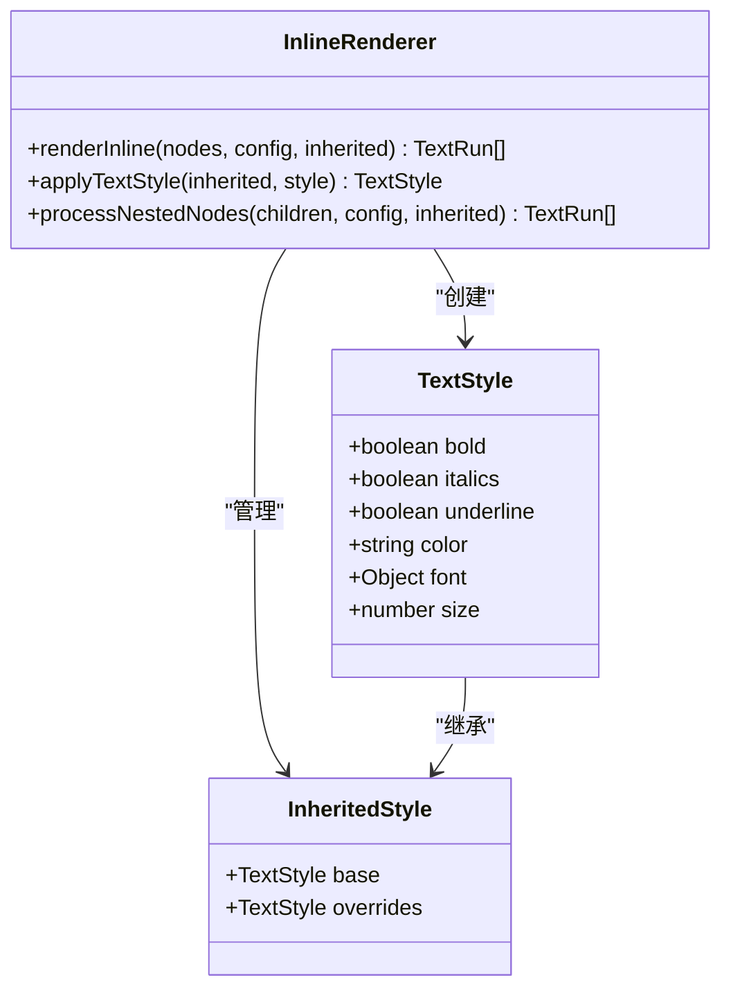

**图表来源**
- [inline.ts:5-10](file://src/generator/renderers/inline.ts#L5-L10)
- [inline.ts:12-109](file://src/generator/renderers/inline.ts#L12-L109)

#### 链接渲染处理

链接渲染器通过组合样式属性实现视觉效果：

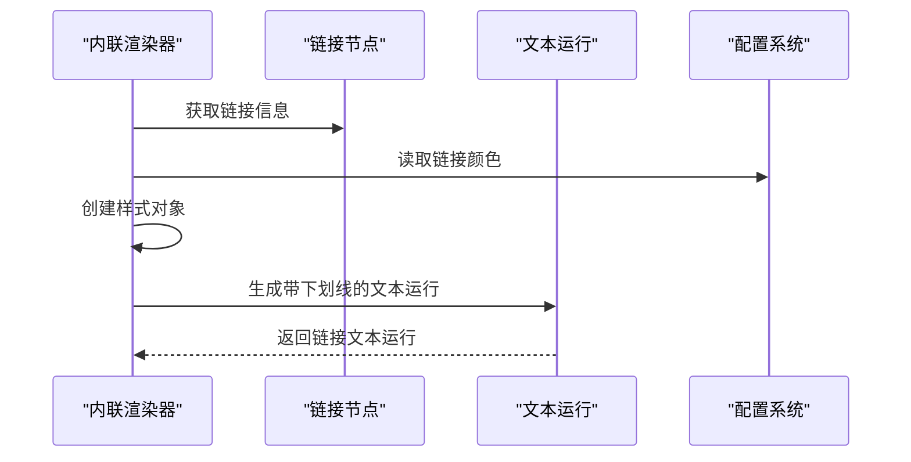

**图表来源**
- [inline.ts:82-93](file://src/generator/renderers/inline.ts#L82-L93)

**章节来源**
- [inline.ts:1-110](file://src/generator/renderers/inline.ts#L1-L110)

### 图像渲染器

图像渲染器提供了完整的图像处理和渲染功能，包括网络图片下载、本地文件读取、尺寸计算和格式转换。

#### 图像处理流程

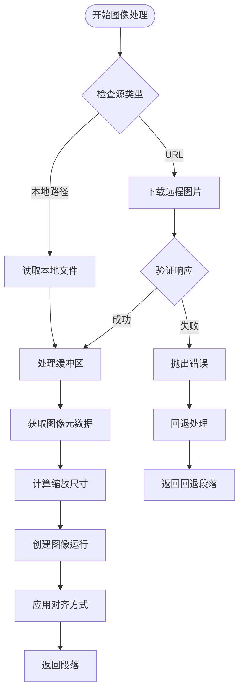

**图表来源**
- [image.ts:6-60](file://src/generator/renderers/image.ts#L6-L60)

#### 图像尺寸计算算法

图像渲染器使用智能的尺寸计算算法，确保图像在页面中的最佳显示效果：

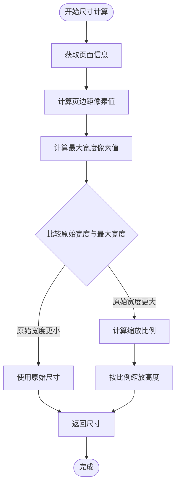

**图表来源**
- [image.ts:17-21](file://src/generator/renderers/image.ts#L17-L21)

**章节来源**
- [image.ts:1-61](file://src/generator/renderers/image.ts#L1-L61)
- [image-utils.ts:12-42](file://src/utils/image.ts#L12-L42)

### 配置系统

配置系统基于 Zod 验证库实现，提供了类型安全的配置管理和验证机制。

#### 配置验证流程

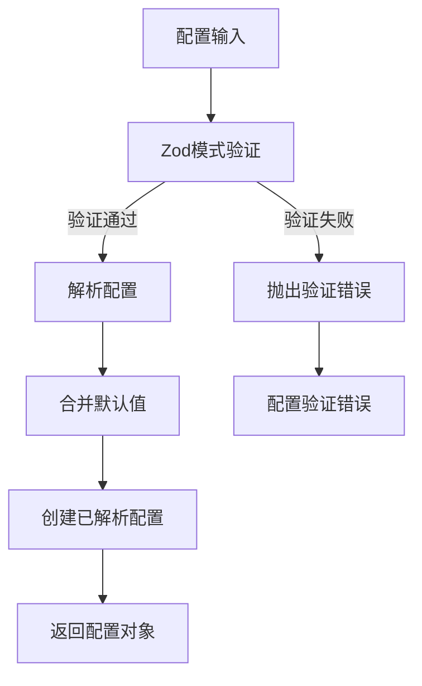

**图表来源**
- [config.ts:68-81](file://src/core/config.ts#L68-L81)

#### 配置扩展指南

要扩展配置系统，需要遵循以下步骤：

1. **定义新配置接口**：
```typescript
// 在 types.ts 中添加新的配置接口
export interface NewFeatureConfig {
  enableNewFeature: boolean;
  featureColor: string;
  featureSize: number;
}
```

2. **添加配置模式**：
```typescript
// 在 config.ts 中添加新的配置模式
const newFeatureConfigSchema = z.object({
  enableNewFeature: z.boolean().default(false),
  featureColor: z.string().default('000000'),
  featureSize: z.number().default(12),
});
```

3. **更新主配置模式**：
```typescript
// 在 config.ts 中更新主配置模式
export const configSchema = z.object({
  // ... 其他配置
  newFeature: newFeatureConfigSchema,
});
```

4. **在渲染器中使用新配置**：
```typescript
// 在渲染器中访问新配置
if (config.newFeature.enableNewFeature) {
  // 应用新功能
}
```

**章节来源**
- [config.ts:1-91](file://src/core/config.ts#L1-L91)
- [types.ts:168-171](file://src/core/types.ts#L168-L171)

## 依赖关系分析

项目采用清晰的依赖层次结构，确保模块间的松耦合和高内聚。

```mermaid
graph TB
subgraph "外部依赖"
DOCX[docx@^9.6.1]
SHARP[sharp@^0.34.5]
ZOD[zod@^4.3.6]
MARKDOWNIT[markdown-it@^14.1.1]
end
subgraph "内部模块"
CORE[core/]
GENERATOR[generator/]
UTILS[utils/]
RENDERERS[renderers/]
end
subgraph "核心模块"
TYPES[types.ts]
CONFIG[config.ts]
ERRORS[errors.ts]
end
subgraph "生成器模块"
BLOCK[block.ts]
INLINE[inline.ts]
IMAGE[image.ts]
STYLES[styles.ts]
DOCBUILDER[document-builder.ts]
end
subgraph "工具模块"
IMGUTILS[image.ts]
UNITUTILS[units.ts]
end
DOCX --> GENERATOR
SHARP --> IMGUTILS
ZOD --> CONFIG
MARKDOWNIT --> CORE
CORE --> GENERATOR
GENERATOR --> RENDERERS
RENDERERS --> BLOCK
RENDERERS --> INLINE
RENDERERS --> IMAGE
UTILS --> IMGUTILS
UTILS --> UNITUTILS
```

**图表来源**
- [package.json:27-36](file://package.json#L27-L36)
- [index.ts:1-25](file://src/index.ts#L1-L25)

**章节来源**
- [package.json:1-47](file://package.json#L1-L47)

## 性能考虑

### 渲染性能优化

1. **异步渲染策略**：图像渲染采用异步处理，避免阻塞主线程
2. **内存管理**：使用流式处理减少内存占用
3. **缓存机制**：合理利用浏览器缓存和文件系统缓存

### 内存使用优化

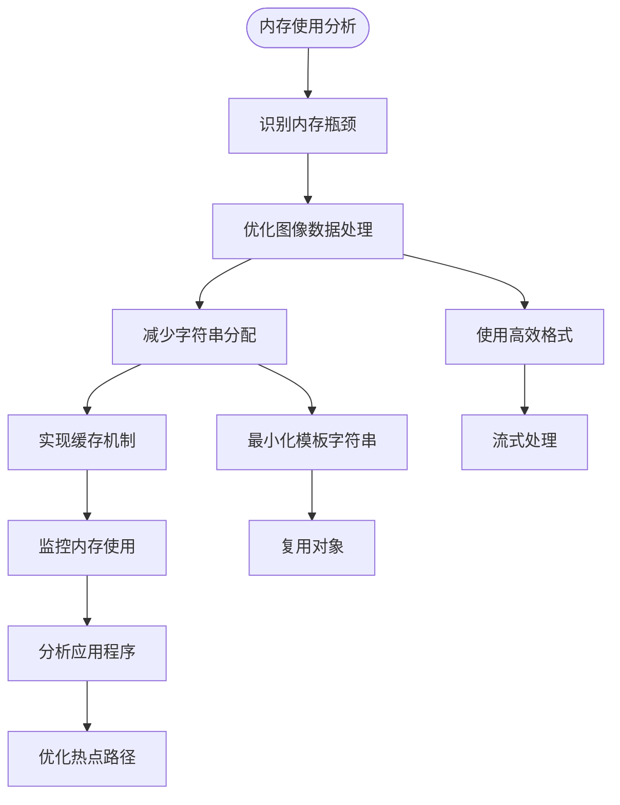

### 并发处理

项目支持并发渲染多个块级元素，提高整体处理效率。

**章节来源**
- [image.ts:10-11](file://src/generator/renderers/image.ts#L10-L11)
- [block.ts:92-122](file://src/generator/renderers/block.ts#L92-L122)

## 故障排除指南

### 错误处理机制

项目实现了多层次的错误处理机制，确保转换过程的稳定性：

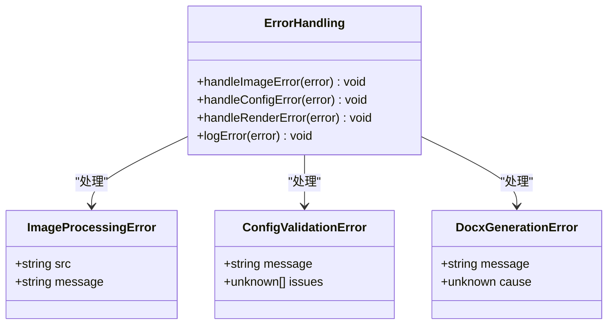

**图表来源**
- [errors.ts:15-27](file://src/core/errors.ts#L15-L27)

### 常见问题解决

1. **图像加载失败**：
   - 检查网络连接和URL有效性
   - 验证文件权限和路径
   - 确认图像格式支持

2. **配置验证错误**：
   - 检查配置值的数据类型
   - 验证数值范围限制
   - 确认枚举值的有效性

3. **渲染异常**：
   - 查看详细的错误堆栈信息
   - 检查节点树的完整性
   - 验证配置参数的有效性

**章节来源**
- [errors.ts:1-28](file://src/core/errors.ts#L1-L28)
- [image-utils.ts:38-41](file://src/utils/image.ts#L38-L41)

## 结论

Markdown to Word 转换器提供了一个强大而灵活的扩展平台，支持开发者创建自定义渲染器、扩展现有功能和集成新的特性。通过清晰的模块化架构、完善的类型系统和健壮的错误处理机制，该项目为文档转换领域提供了一个高质量的解决方案。

主要优势包括：
- **模块化设计**：清晰的职责分离便于维护和扩展
- **类型安全**：完整的 TypeScript 类型定义确保开发体验
- **可扩展性**：灵活的渲染器系统支持自定义开发
- **性能优化**：异步处理和内存管理提升用户体验
- **错误处理**：多层错误处理机制保证系统稳定性

## 附录

### 开发最佳实践

1. **遵循现有模式**：参考现有的渲染器实现模式
2. **类型安全**：始终使用 TypeScript 类型定义
3. **错误处理**：实现适当的错误处理和回退机制
4. **性能考虑**：避免不必要的内存分配和计算
5. **测试覆盖**：为新功能编写单元测试和集成测试

### API 参考

#### 核心导出接口

```typescript
// 主要导出
export { parse } from './parser/index.js';
export { generate, buildDocument } from './generator/index.js';
export { createConfig, mergeConfig, defaultConfig, configSchema } from './core/config.js';

// 类型定义
export type {
  DocumentIR,
  DocumentMeta,
  BlockNode,
  InlineNode,
  ResolvedConfig,
  FontConfig,
  SizeConfig,
  SpacingConfig,
  MarginConfig,
  ImageConfig,
  HeaderFooterConfig,
  ColorConfig,
} from './core/types.js';

// 错误类型
export {
  MarkdownParseError,
  DocxGenerationError,
  ImageProcessingError,
  ConfigValidationError,
} from './core/errors.js';
```

**章节来源**
- [index.ts:1-25](file://src/index.ts#L1-L25)