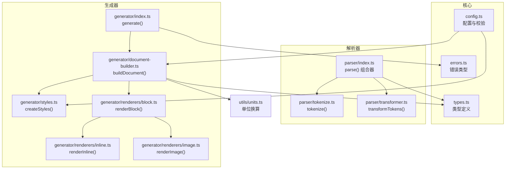
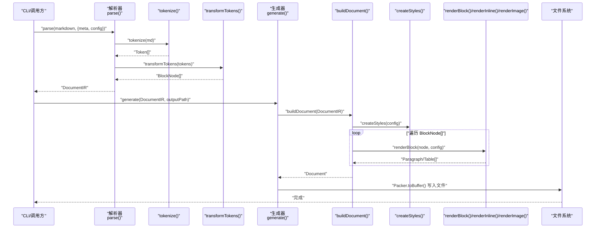
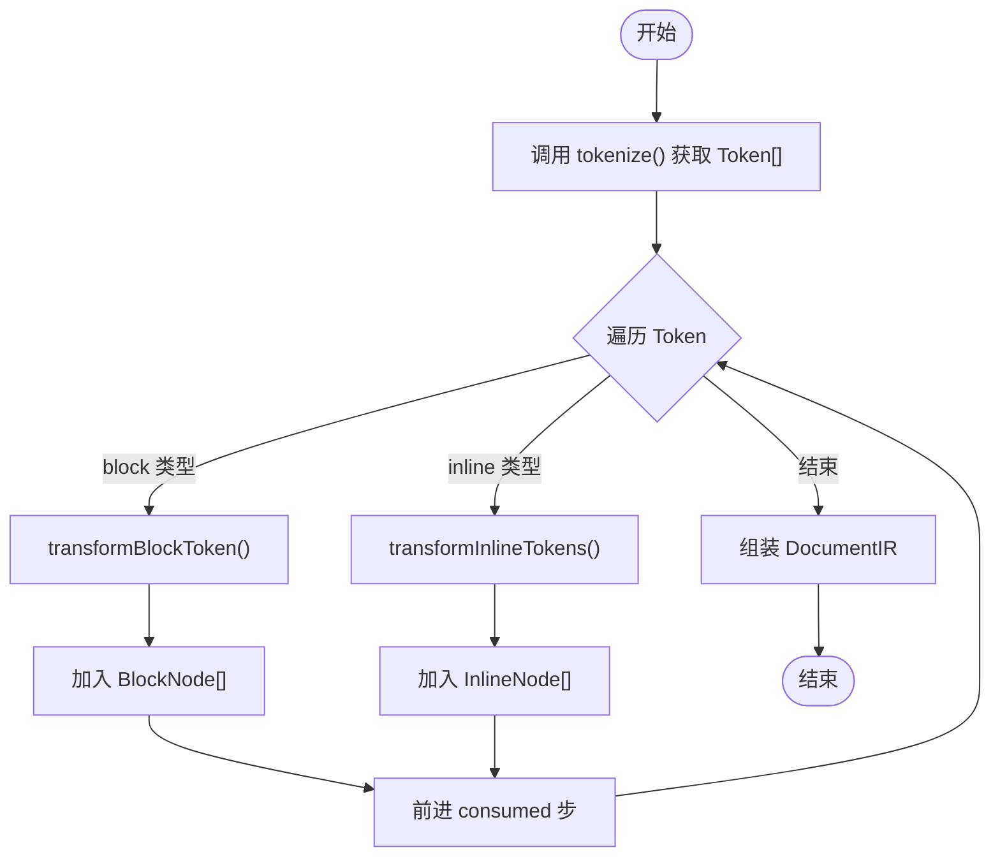
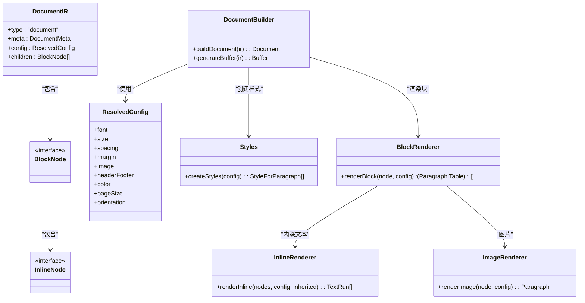
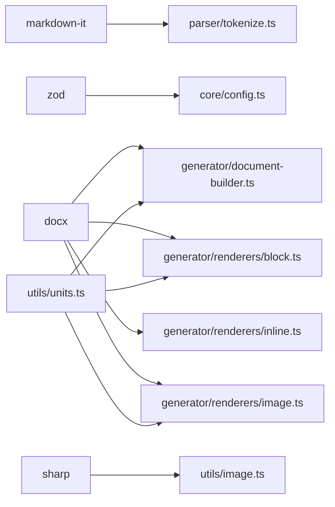

# 核心模块详解

<cite>
**本文引用的文件**
- [src/parser/index.ts](file://src/parser/index.ts)
- [src/parser/tokenize.ts](file://src/parser/tokenize.ts)
- [src/parser/transformer.ts](file://src/parser/transformer.ts)
- [src/generator/index.ts](file://src/generator/index.ts)
- [src/generator/document-builder.ts](file://src/generator/document-builder.ts)
- [src/generator/styles.ts](file://src/generator/styles.ts)
- [src/generator/renderers/block.ts](file://src/generator/renderers/block.ts)
- [src/generator/renderers/inline.ts](file://src/generator/renderers/inline.ts)
- [src/generator/renderers/image.ts](file://src/generator/renderers/image.ts)
- [src/core/types.ts](file://src/core/types.ts)
- [src/core/config.ts](file://src/core/config.ts)
- [src/core/errors.ts](file://src/core/errors.ts)
- [src/utils/units.ts](file://src/utils/units.ts)
- [src/index.ts](file://src/index.ts)
- [src/cli.ts](file://src/cli.ts)
- [tests/unit/parser/transformer.test.ts](file://tests/unit/parser/transformer.test.ts)
- [package.json](file://package.json)
</cite>

## 目录
1. [简介](#简介)
2. [项目结构](#项目结构)
3. [核心组件](#核心组件)
4. [架构总览](#架构总览)
5. [详细组件分析](#详细组件分析)
6. [依赖分析](#依赖分析)
7. [性能考量](#性能考量)
8. [故障排查指南](#故障排查指南)
9. [结论](#结论)
10. [附录](#附录)

## 简介
本技术文档聚焦于 Markdown 到 Word 转换器的核心模块，系统性阐述解析器与生成器两大子系统的实现机制与协作方式。重点包括：
- 解析器模块：tokenize() 如何基于 markdown-it 将 Markdown 文本解析为 Token 流；transformTokens() 如何将 Token 流转换为内部文档节点（DocumentIR）。
- 生成器模块：document-builder 的文档构建流程、样式体系（styles）的应用策略、渲染器（block/inline/image）对节点到 docx 对象的映射。
- 中间表示（DocumentIR）的设计理念与数据结构。
- 配置传递、错误处理与性能优化建议。

## 项目结构
项目采用按职责分层的组织方式：
- 核心类型与配置：定义 DocumentIR、BlockNode/InlineNode、ResolvedConfig 等类型与默认配置。
- 解析器：负责将 Markdown 文本解析为 Token，并转换为 Block/Inline 节点树。
- 生成器：负责将 DocumentIR 渲染为 docx 文档对象，并写入文件或输出缓冲区。
- 工具：单位换算（pt/twip/EMU）、图片尺寸计算等。
- 入口与 CLI：对外暴露 parse/generate/createConfig 等 API，并提供命令行工具。

图表来源
- [src/parser/index.ts:11-21](file://src/parser/index.ts#L11-L21)
- [src/parser/tokenize.ts:12-15](file://src/parser/tokenize.ts#L12-L15)
- [src/parser/transformer.ts:25-39](file://src/parser/transformer.ts#L25-L39)
- [src/generator/index.ts:7-18](file://src/generator/index.ts#L7-L18)
- [src/generator/document-builder.ts:17-106](file://src/generator/document-builder.ts#L17-L106)
- [src/generator/styles.ts:5-109](file://src/generator/styles.ts#L5-L109)
- [src/generator/renderers/block.ts:28-58](file://src/generator/renderers/block.ts#L28-L58)
- [src/generator/renderers/inline.ts:12-109](file://src/generator/renderers/inline.ts#L12-L109)
- [src/generator/renderers/image.ts:6-60](file://src/generator/renderers/image.ts#L6-L60)
- [src/utils/units.ts:1-45](file://src/utils/units.ts#L1-L45)

章节来源
- [src/index.ts:1-25](file://src/index.ts#L1-L25)
- [package.json:1-47](file://package.json#L1-L47)

## 核心组件
- DocumentIR：统一的中间表示，包含文档元信息、配置与块级节点数组。
- BlockNode/InlineNode：语义化的节点模型，覆盖标题、段落、列表、表格、引用、代码块、图片、分割线等。
- ResolvedConfig：通过 zod 校验的完整配置对象，涵盖字体、字号、间距、页边距、颜色、页码、方向等。
- 错误类型：MarkdownParseError、DocxGenerationError、ImageProcessingError、ConfigValidationError，用于明确错误来源与上下文。

章节来源
- [src/core/types.ts:7-12](file://src/core/types.ts#L7-L12)
- [src/core/types.ts:78-135](file://src/core/types.ts#L78-L135)
- [src/core/types.ts:187-198](file://src/core/types.ts#L187-L198)
- [src/core/errors.ts:1-28](file://src/core/errors.ts#L1-L28)

## 架构总览
下图展示了从 Markdown 文本到最终 DOCX 文件的端到端流程，以及各模块之间的调用关系与数据传递。

图表来源
- [src/parser/index.ts:11-21](file://src/parser/index.ts#L11-L21)
- [src/parser/tokenize.ts:12-15](file://src/parser/tokenize.ts#L12-L15)
- [src/parser/transformer.ts:25-39](file://src/parser/transformer.ts#L25-L39)
- [src/generator/index.ts:7-18](file://src/generator/index.ts#L7-L18)
- [src/generator/document-builder.ts:17-106](file://src/generator/document-builder.ts#L17-L106)
- [src/generator/styles.ts:5-109](file://src/generator/styles.ts#L5-L109)
- [src/generator/renderers/block.ts:28-58](file://src/generator/renderers/block.ts#L28-L58)

## 详细组件分析

### 解析器模块：tokenize() 与 transformTokens()
- tokenize() 使用 markdown-it（commonmark 规范）解析 Markdown，启用 table、html、linkify、typographer 等特性，返回 Token 数组。
- transformTokens() 将 Token 序列转换为 BlockNode[]：
  - 支持标题、段落、无序/有序列表、引用块、代码块、表格、水平分割线、内联 HTML 图片等。
  - 内联 Token 通过 transformInlineTokens() 转换为 InlineNode[]，支持粗体、斜体、下划线、行内代码、链接、换行等。
  - 复杂结构（列表项、表格行/单元格）递归解析，确保层级正确。

图表来源
- [src/parser/tokenize.ts:12-15](file://src/parser/tokenize.ts#L12-L15)
- [src/parser/transformer.ts:25-39](file://src/parser/transformer.ts#L25-L39)
- [src/parser/transformer.ts:41-122](file://src/parser/transformer.ts#L41-L122)
- [src/parser/transformer.ts:238-332](file://src/parser/transformer.ts#L238-L332)

章节来源
- [src/parser/tokenize.ts:12-15](file://src/parser/tokenize.ts#L12-L15)
- [src/parser/transformer.ts:25-39](file://src/parser/transformer.ts#L25-L39)
- [src/parser/transformer.ts:41-122](file://src/parser/transformer.ts#L41-L122)
- [src/parser/transformer.ts:124-180](file://src/parser/transformer.ts#L124-L180)
- [src/parser/transformer.ts:182-236](file://src/parser/transformer.ts#L182-L236)
- [src/parser/transformer.ts:238-332](file://src/parser/transformer.ts#L238-L332)

### 生成器模块：document-builder 与样式体系
- buildDocument() 接收 DocumentIR，读取配置并创建样式表，随后逐个渲染块级节点为 Paragraph/Table，最后构建 Document 并注入页眉页脚、页边距、页面方向等属性。
- createStyles() 基于 ResolvedConfig 动态生成 docx 段落样式，包括标题各级、正文、代码块、引用等，使用 pt/半点/20th pt 等单位换算。
- renderBlock() 将 BlockNode 映射为 docx 段落/表格，renderInline() 将 InlineNode 映射为 TextRun，renderImage() 异步读取图片并按页宽与配置缩放对齐。

图表来源
- [src/core/types.ts:7-12](file://src/core/types.ts#L7-L12)
- [src/core/types.ts:78-135](file://src/core/types.ts#L78-L135)
- [src/core/types.ts:187-198](file://src/core/types.ts#L187-L198)
- [src/generator/document-builder.ts:17-106](file://src/generator/document-builder.ts#L17-L106)
- [src/generator/styles.ts:5-109](file://src/generator/styles.ts#L5-L109)
- [src/generator/renderers/block.ts:28-58](file://src/generator/renderers/block.ts#L28-L58)
- [src/generator/renderers/inline.ts:12-109](file://src/generator/renderers/inline.ts#L12-L109)
- [src/generator/renderers/image.ts:6-60](file://src/generator/renderers/image.ts#L6-L60)

章节来源
- [src/generator/document-builder.ts:17-106](file://src/generator/document-builder.ts#L17-L106)
- [src/generator/styles.ts:5-109](file://src/generator/styles.ts#L5-L109)
- [src/generator/renderers/block.ts:28-58](file://src/generator/renderers/block.ts#L28-L58)
- [src/generator/renderers/inline.ts:12-109](file://src/generator/renderers/inline.ts#L12-L109)
- [src/generator/renderers/image.ts:6-60](file://src/generator/renderers/image.ts#L6-L60)

### 中间表示（DocumentIR）设计
- 设计理念：以“可渲染”的中间结构承载文档元信息、配置与节点树，便于在解析与生成之间解耦，同时允许上层灵活传入自定义配置与元数据。
- 数据结构要点：
  - type 固定为 "document"
  - meta：title/author/date 等
  - config：ResolvedConfig，包含字体、字号、间距、页边距、颜色、页眉页脚、页码、纸张与方向
  - children：BlockNode[]，顶层块级节点序列

章节来源
- [src/core/types.ts:7-12](file://src/core/types.ts#L7-L12)
- [src/core/types.ts:187-198](file://src/core/types.ts#L187-L198)

### 配置传递与合并
- 默认配置：defaultConfig 由 createConfig() 基于 zod Schema 生成，包含字体、字号、间距、页边距、颜色、页码、纸张与方向等字段的默认值。
- 合并策略：mergeConfig() 将基础配置与用户覆盖配置合并后重新校验，保证类型安全与默认值回退。
- CLI 传参：CLI 通过 createConfig() 读取 JSON 配置文件并合并默认值，随后将 meta（title/author）与 config 一并传入 parse()。

章节来源
- [src/core/config.ts:68-81](file://src/core/config.ts#L68-L81)
- [src/core/config.ts:83-88](file://src/core/config.ts#L83-L88)
- [src/cli.ts:81-97](file://src/cli.ts#L81-L97)

### 错误处理与健壮性
- 解析阶段：MarkdownParseError 用于标识解析错误来源。
- 生成阶段：DocxGenerationError 包裹底层异常，提供可追踪的错误消息。
- 图片处理：renderImage() 在读取/缩放图片失败时回退为占位段落，避免中断生成流程。
- 配置校验：zod Schema 在 createConfig() 中进行严格校验，ConfigValidationError 提供结构化错误信息。

章节来源
- [src/core/errors.ts:1-28](file://src/core/errors.ts#L1-L28)
- [src/generator/renderers/image.ts:47-60](file://src/generator/renderers/image.ts#L47-L60)
- [src/generator/index.ts:12-17](file://src/generator/index.ts#L12-L17)

### 性能与扩展性
- Token 解析：使用 markdown-it 的高效 Token 流，避免重复扫描。
- 递归转换：transformTokens()/transformInlineTokens() 采用单次线性扫描+递归，复杂度 O(n+m)，其中 n 为 Markdown 字符数，m 为 Token 数。
- 样式复用：createStyles() 一次性生成样式集合，后续渲染直接引用，减少重复构造。
- 异步渲染：图片读取为异步，避免阻塞主线程；失败回退不中断整体流程。
- 可扩展点：新增节点类型只需在 transformTokens() 与对应 renderer 中添加分支，保持接口稳定。

章节来源
- [src/parser/tokenize.ts:12-15](file://src/parser/tokenize.ts#L12-L15)
- [src/parser/transformer.ts:25-39](file://src/parser/transformer.ts#L25-L39)
- [src/generator/styles.ts:5-109](file://src/generator/styles.ts#L5-L109)
- [src/generator/renderers/image.ts:10-15](file://src/generator/renderers/image.ts#L10-L15)

## 依赖分析
- 外部库：
  - markdown-it：Markdown 解析与 Token 生成
  - docx：DOCX 文档对象模型与打包
  - zod：配置校验与类型推断
  - sharp：图片处理（在图片工具中使用）
- 内部模块耦合：
  - 解析器仅依赖 core/types 与 markdown-it，低耦合高内聚
  - 生成器依赖 core/types、docx、utils/units、renderers
  - CLI 依赖解析器与生成器，负责参数解析与文件 IO

图表来源
- [package.json:27-36](file://package.json#L27-L36)
- [src/parser/tokenize.ts:1-1](file://src/parser/tokenize.ts#L1-L1)
- [src/generator/document-builder.ts:1-12](file://src/generator/document-builder.ts#L1-L12)
- [src/generator/renderers/block.ts:1-12](file://src/generator/renderers/block.ts#L1-L12)
- [src/generator/renderers/inline.ts:1-3](file://src/generator/renderers/inline.ts#L1-L3)
- [src/generator/renderers/image.ts:1-4](file://src/generator/renderers/image.ts#L1-L4)
- [src/utils/units.ts:1-45](file://src/utils/units.ts#L1-L45)

章节来源
- [package.json:27-36](file://package.json#L27-L36)

## 性能考量
- Token 流处理：尽量避免在 transformTokens() 中进行二次解析，保持 O(n+m) 线性复杂度。
- 样式缓存：createStyles() 生成一次即可复用，减少重复构造开销。
- 图片异步：renderImage() 异步读取与缩放，失败时快速回退，避免阻塞。
- 单位换算：集中于 utils/units.ts，避免重复计算与精度损失。
- 批量渲染：buildDocument() 顺序渲染 BlockNode，减少不必要的 DOM 结构切换。

## 故障排查指南
- 解析失败：检查输入是否符合 commonmark 规范；确认 markdown-it 版本与启用特性；查看 MarkdownParseError。
- 生成失败：捕获 DocxGenerationError，定位具体渲染节点；检查配置项（如颜色、字号、页边距）是否合法。
- 图片问题：renderImage() 回退逻辑会输出空图片占位；检查图片路径、格式与 sharp 依赖；查看 ImageProcessingError。
- 配置错误：createConfig() 会抛出 ConfigValidationError，核对 JSON 配置键名与类型。

章节来源
- [src/core/errors.ts:1-28](file://src/core/errors.ts#L1-L28)
- [src/generator/renderers/image.ts:47-60](file://src/generator/renderers/image.ts#L47-L60)
- [src/generator/index.ts:12-17](file://src/generator/index.ts#L12-L17)

## 结论
该转换器以清晰的中间表示（DocumentIR）为核心，将解析与生成解耦，既保证了可维护性，也为扩展新节点类型与渲染策略提供了便利。通过严格的配置校验与完善的错误处理，系统在易用性与稳定性之间取得良好平衡。开发者可在不破坏现有接口的前提下，按需增强样式、扩展节点类型或优化性能。

## 附录
- 示例用法（路径参考）：
  - 解析 Markdown：[src/parser/index.ts:11-21](file://src/parser/index.ts#L11-L21)
  - 生成 DOCX：[src/generator/index.ts:7-18](file://src/generator/index.ts#L7-L18)
  - CLI 使用：[src/cli.ts:69-113](file://src/cli.ts#L69-L113)
- 单元测试（路径参考）：
  - 解析器转换测试：[tests/unit/parser/transformer.test.ts:1-90](file://tests/unit/parser/transformer.test.ts#L1-L90)