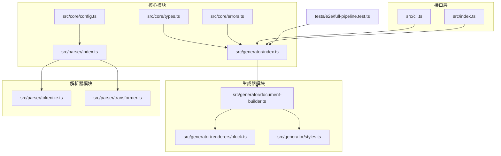
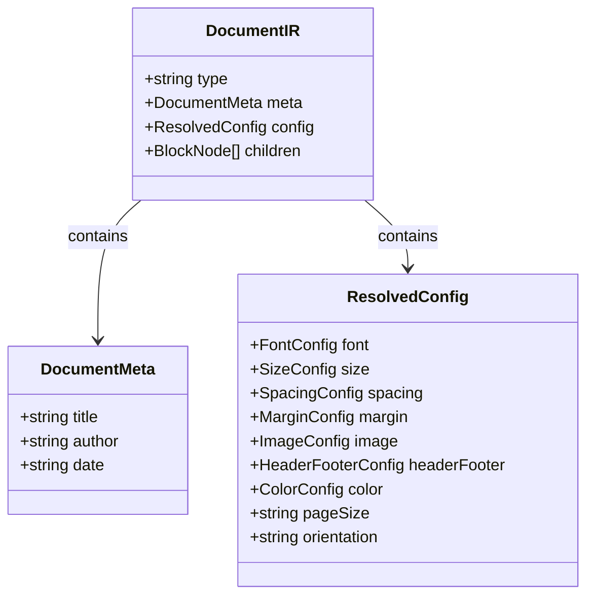
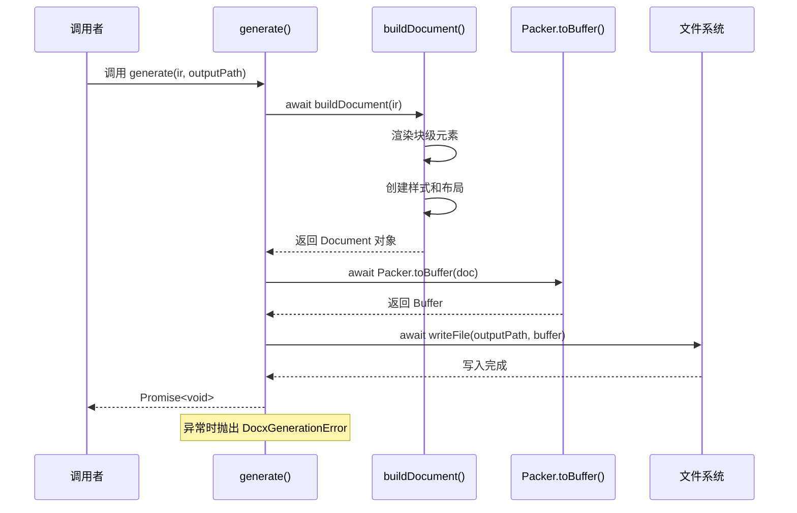
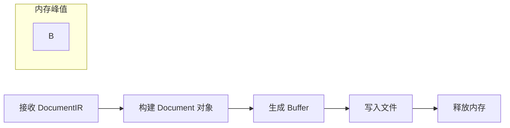
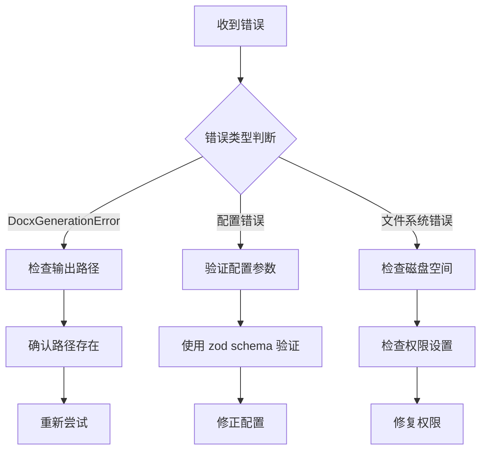

# generate() 主函数

<cite>
**本文档引用的文件**
- [src/generator/index.ts](file://src/generator/index.ts)
- [src/generator/document-builder.ts](file://src/generator/document-builder.ts)
- [src/core/types.ts](file://src/core/types.ts)
- [src/core/errors.ts](file://src/core/errors.ts)
- [src/parser/index.ts](file://src/parser/index.ts)
- [src/cli.ts](file://src/cli.ts)
- [src/index.ts](file://src/index.ts)
- [src/generator/renderers/block.ts](file://src/generator/renderers/block.ts)
- [src/generator/styles.ts](file://src/generator/styles.ts)
- [src/core/config.ts](file://src/core/config.ts)
- [tests/e2e/full-pipeline.test.ts](file://tests/e2e/full-pipeline.test.ts)
</cite>

## 目录
1. [简介](#简介)
2. [项目结构](#项目结构)
3. [核心组件](#核心组件)
4. [架构概览](#架构概览)
5. [详细组件分析](#详细组件分析)
6. [依赖分析](#依赖分析)
7. [性能考虑](#性能考虑)
8. [故障排除指南](#故障排除指南)
9. [结论](#结论)
10. [附录：使用示例](#附录使用示例)

## 简介

generate() 主函数是 Markdown to Word 文档转换系统的核心入口点，负责协调从 Markdown 解析到最终 DOCX 文件生成的完整流程。该函数接收 DocumentIR 对象作为输入，通过异步调用构建文档、转换为二进制缓冲区，并最终写入到指定的输出路径。

本文档将深入分析 generate() 函数的工作原理，包括其参数结构、异步执行流程、错误处理机制以及与其他模块的集成关系。

## 项目结构

该项目采用模块化架构设计，主要包含以下核心模块：



**图表来源**
- [src/generator/index.ts:1-21](file://src/generator/index.ts#L1-L21)
- [src/generator/document-builder.ts:1-112](file://src/generator/document-builder.ts#L1-L112)
- [src/core/types.ts:1-198](file://src/core/types.ts#L1-L198)

**章节来源**
- [src/generator/index.ts:1-21](file://src/generator/index.ts#L1-L21)
- [src/core/types.ts:1-198](file://src/core/types.ts#L1-L198)

## 核心组件

### generate() 函数签名

generate() 函数具有简洁而明确的接口设计：

```typescript
export async function generate(
  ir: DocumentIR, 
  outputPath: string
): Promise<void>
```

**参数说明：**

1. **ir (DocumentIR 对象)**：
   - 类型：DocumentIR
   - 作用：包含完整的文档结构信息，包括元数据、配置和内容节点
   - 结构：包含 type、meta、config、children 字段
   - 验证：由上游解析器确保数据完整性

2. **outputPath (输出路径)**：
   - 类型：string
   - 作用：指定生成的 DOCX 文件保存位置
   - 验证：无显式类型检查，依赖 Node.js 文件系统 API

**章节来源**
- [src/generator/index.ts:7-18](file://src/generator/index.ts#L7-L18)
- [src/core/types.ts:7-12](file://src/core/types.ts#L7-L12)

### DocumentIR 数据结构

DocumentIR 是整个文档生成流程的核心数据载体：



**图表来源**
- [src/core/types.ts:7-12](file://src/core/types.ts#L7-L12)
- [src/core/types.ts:137-198](file://src/core/types.ts#L137-L198)

**章节来源**
- [src/core/types.ts:1-198](file://src/core/types.ts#L1-L198)

## 架构概览

generate() 函数采用分层架构设计，实现了清晰的关注点分离：



**图表来源**
- [src/generator/index.ts:7-18](file://src/generator/index.ts#L7-L18)
- [src/generator/document-builder.ts:17-106](file://src/generator/document-builder.ts#L17-L106)

## 详细组件分析

### generate() 函数实现

generate() 函数实现了三阶段的异步处理流程：

#### 第一阶段：文档构建
- 调用 `buildDocument(ir)` 将 DocumentIR 转换为 docx 库的 Document 对象
- 这一步负责将抽象的文档结构转换为具体的 Word 文档对象

#### 第二阶段：缓冲区转换
- 使用 `Packer.toBuffer(doc)` 将 Document 对象转换为二进制缓冲区
- 这是将内存中的文档对象序列化为标准 DOCX 格式的步骤

#### 第三阶段：文件写入
- 通过 `fs.writeFile(outputPath, buffer)` 将缓冲区写入磁盘
- 实现最终的文件持久化

**章节来源**
- [src/generator/index.ts:7-18](file://src/generator/index.ts#L7-L18)

### 错误处理机制

generate() 函数采用统一的错误处理策略：

```mermaid
flowchart TD
Start([开始 generate()]) --> TryBlock["try 块执行"]
TryBlock --> BuildDoc["buildDocument()"]
BuildDoc --> PackBuffer["Packer.toBuffer()"]
PackBuffer --> WriteFile["fs.writeFile()"]
WriteFile --> Success["返回 Promise<void>"]
TryBlock --> |异常| CatchBlock["catch 块"]
BuildDoc --> |异常| CatchBlock
PackBuffer --> |异常| CatchBlock
WriteFile --> |异常| CatchBlock
CatchBlock --> ThrowError["抛出 DocxGenerationError"]
ThrowError --> End([结束])
Success --> End
```

**图表来源**
- [src/generator/index.ts:7-18](file://src/generator/index.ts#L7-L18)

DocxGenerationError 具有以下特点：
- 继承自 Error 基类
- 包含可选的 cause 属性，用于传递原始错误信息
- 错误消息格式固定为 "Failed to generate document at {outputPath}"

**章节来源**
- [src/core/errors.ts:8-13](file://src/core/errors.ts#L8-L13)
- [src/generator/index.ts:12-17](file://src/generator/index.ts#L12-L17)

### 与 document-builder 模块的协作

generate() 函数与 document-builder 模块建立了紧密的协作关系：

```mermaid
graph LR
A[generate()] --> B[buildDocument()]
B --> C[renderBlock()]
B --> D[createStyles()]
C --> E[renderInline()]
C --> F[renderImage()]
D --> G[StyleForParagraph]
subgraph "渲染器"
E
F
end
subgraph "样式系统"
G
end
```

**图表来源**
- [src/generator/index.ts:2](file://src/generator/index.ts#L2)
- [src/generator/document-builder.ts:17-106](file://src/generator/document-builder.ts#L17-L106)

**章节来源**
- [src/generator/document-builder.ts:17-106](file://src/generator/document-builder.ts#L17-L106)
- [src/generator/renderers/block.ts:28-58](file://src/generator/renderers/block.ts#L28-L58)
- [src/generator/styles.ts:5-109](file://src/generator/styles.ts#L5-L109)

### 与 docx 库的集成

generate() 函数直接依赖 docx 库提供的核心功能：

- **Document 对象**：表示完整的 Word 文档结构
- **Packer 工具**：负责将 Document 对象序列化为 DOCX 文件
- **Header/Footer**：支持页眉页脚的动态生成
- **样式系统**：提供丰富的样式定义和应用能力

**章节来源**
- [src/generator/document-builder.ts:1-112](file://src/generator/document-builder.ts#L1-L112)

## 依赖分析

### 外部依赖关系

```mermaid
graph TB
subgraph "外部库"
A[docx 库]
B[fs/promises]
C[zod]
end
subgraph "内部模块"
D[generate()]
E[buildDocument()]
F[parse()]
G[createConfig()]
end
D --> A
D --> B
E --> A
F --> G
G --> C
```

**图表来源**
- [src/generator/index.ts:1-5](file://src/generator/index.ts#L1-L5)
- [src/core/config.ts:1-91](file://src/core/config.ts#L1-L91)

### 内部模块耦合

generate() 函数与以下模块存在直接依赖关系：

1. **document-builder 模块**：提供文档构建功能
2. **core/types 模块**：提供类型定义和验证
3. **core/errors 模块**：提供错误处理机制
4. **core/config 模块**：提供配置管理

**章节来源**
- [src/generator/index.ts:1-5](file://src/generator/index.ts#L1-L5)
- [src/generator/document-builder.ts:1-16](file://src/generator/document-builder.ts#L1-L16)

## 性能考虑

### 异步处理优势

generate() 函数采用完全异步的设计，具有以下性能优势：

1. **非阻塞 I/O**：文件读写操作不会阻塞事件循环
2. **并发处理**：可以与其他异步操作并行执行
3. **内存效率**：逐阶段处理，避免长时间占用大量内存

### 内存使用模式



**图表来源**
- [src/generator/index.ts:7-18](file://src/generator/index.ts#L7-L18)

### 优化建议

1. **批量处理**：对于大量文档生成场景，考虑实现队列机制
2. **缓存策略**：对重复的样式和配置进行缓存
3. **流式处理**：对于超大文档，考虑实现流式写入

## 故障排除指南

### 常见错误类型

1. **DocxGenerationError**：文档生成过程中的通用错误
2. **配置验证错误**：配置参数不符合预期格式
3. **文件系统错误**：磁盘空间不足或权限问题

### 错误诊断步骤



**图表来源**
- [src/core/errors.ts:8-27](file://src/core/errors.ts#L8-L27)

### 调试技巧

1. **启用详细日志**：在调用 generate() 前后添加日志记录
2. **验证中间结果**：检查 buildDocument() 返回的 Document 对象
3. **测试缓冲区**：使用 generateBuffer() 验证生成逻辑

**章节来源**
- [src/core/errors.ts:8-27](file://src/core/errors.ts#L8-L27)

## 结论

generate() 主函数作为 Markdown to Word 转换系统的核心，展现了优秀的架构设计和错误处理机制。其异步、模块化的特性使其能够高效地处理各种规模的文档生成任务。

通过清晰的职责分离、完善的错误处理和与 docx 库的深度集成，generate() 函数为开发者提供了可靠且易于扩展的文档生成解决方案。

## 附录：使用示例

### 基本使用场景

#### CLI 工具使用
```bash
# 基本转换
md2word document.md

# 指定输出路径
md2word document.md -o report.docx

# 使用配置文件
md2word document.md -c template.json
```

#### 编程接口使用
```typescript
import { parse } from './parser/index.js';
import { generate } from './generator/index.js';
import { createConfig } from './core/config.js';

// 解析 Markdown
const markdown = '# Hello World\n\nThis is a test.';
const ir = parse(markdown, {
  meta: { title: 'Test', author: 'Author' },
  config: createConfig()
});

// 生成 DOCX
await generate(ir, 'output.docx');
```

#### 测试场景
```typescript
import { generateBuffer } from './generator/document-builder.js';

// 直接生成缓冲区进行测试
const buffer = await generateBuffer(ir);
expect(buffer).toBeInstanceOf(Buffer);
expect(buffer.length).toBeGreaterThan(1000);
```

**章节来源**
- [src/cli.ts:69-112](file://src/cli.ts#L69-L112)
- [tests/e2e/full-pipeline.test.ts:8-51](file://tests/e2e/full-pipeline.test.ts#L8-L51)