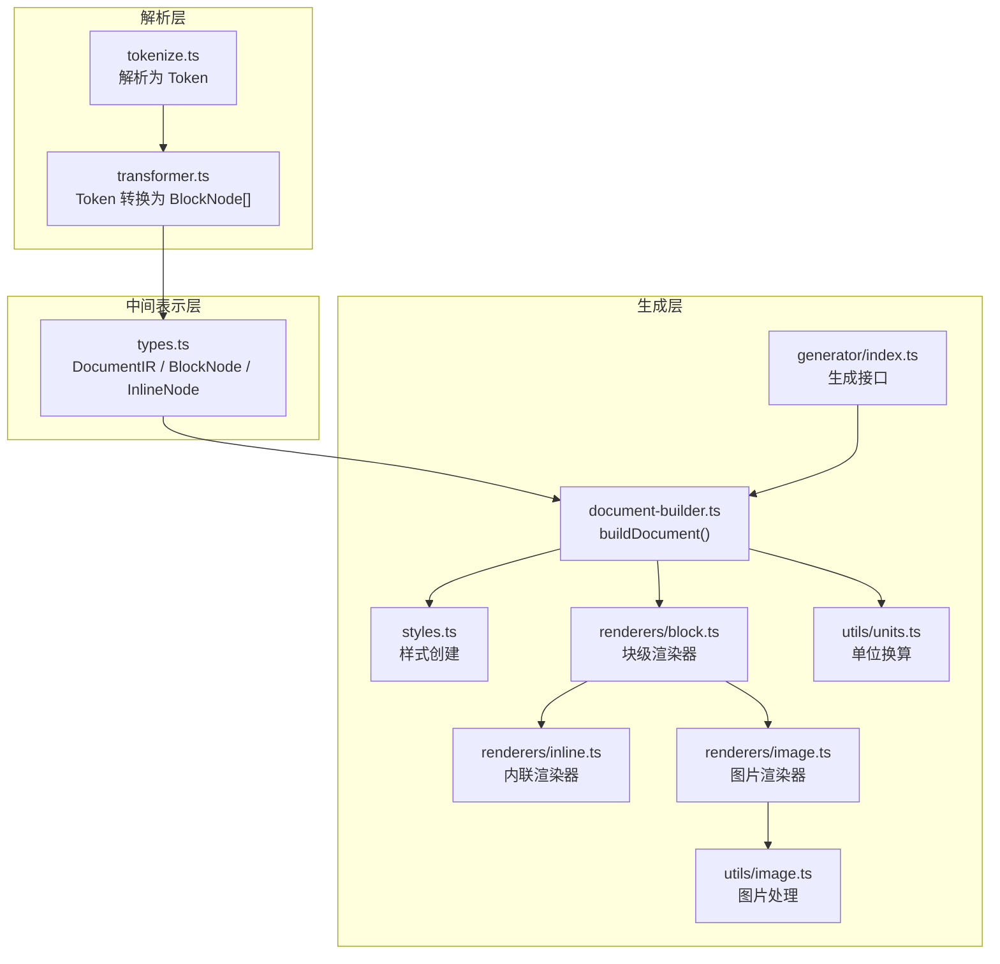
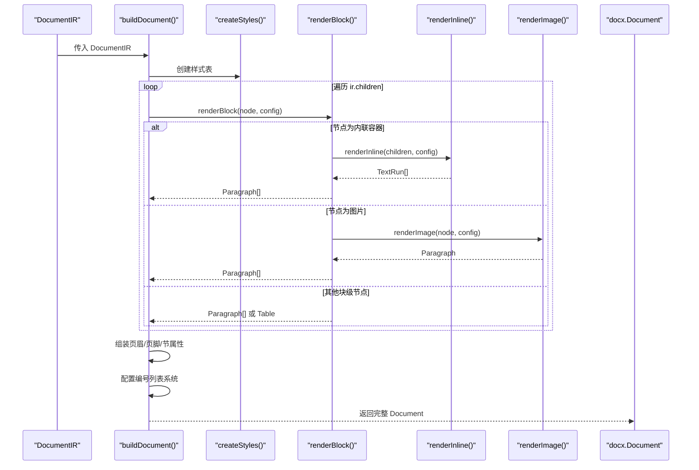
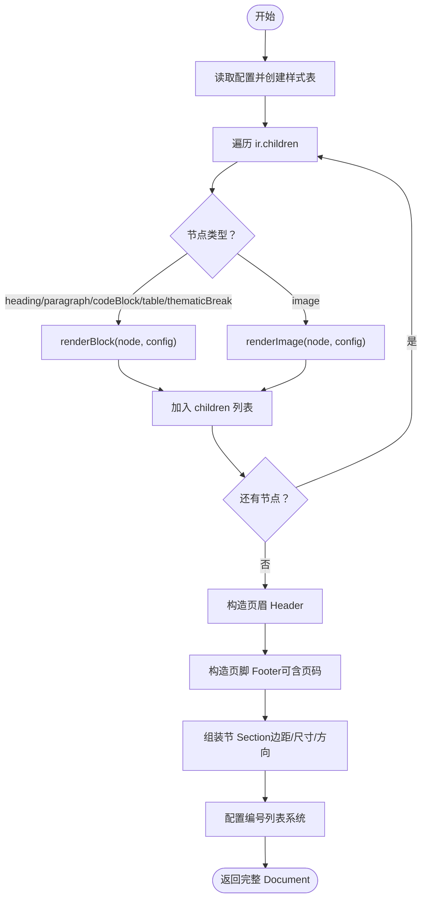
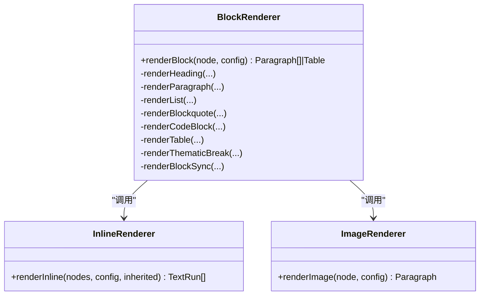
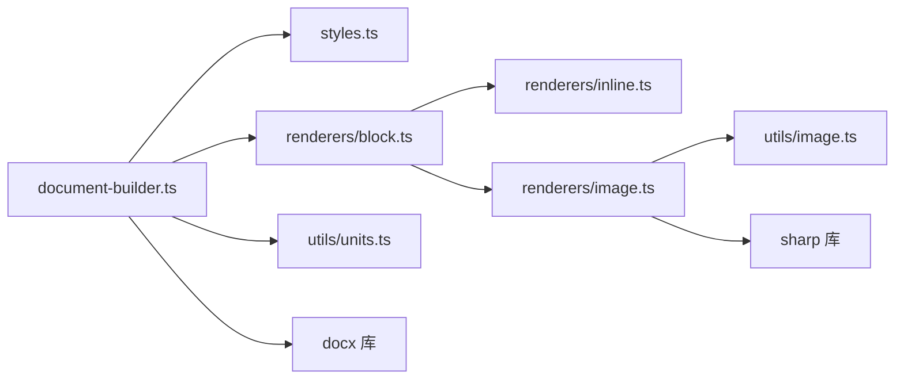
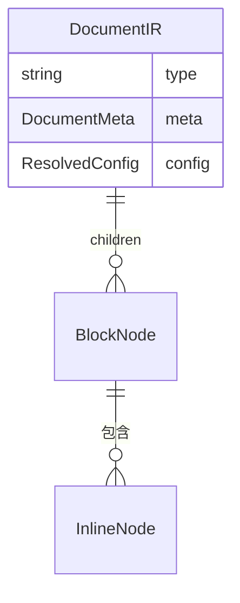

# 文档构建器

<cite>
**本文引用的文件**
- [document-builder.ts](file://src/generator/document-builder.ts)
- [styles.ts](file://src/generator/styles.ts)
- [block.ts](file://src/generator/renderers/block.ts)
- [inline.ts](file://src/generator/renderers/inline.ts)
- [image.ts](file://src/generator/renderers/image.ts)
- [types.ts](file://src/core/types.ts)
- [units.ts](file://src/utils/units.ts)
- [image.ts](file://src/utils/image.ts)
- [index.ts](file://src/generator/index.ts)
- [config.ts](file://src/core/config.ts)
- [errors.ts](file://src/core/errors.ts)
- [tokenize.ts](file://src/parser/tokenize.ts)
- [transformer.ts](file://src/parser/transformer.ts)
- [sample.md](file://tests/fixtures/markdown/sample.md)
</cite>

## 更新摘要
**变更内容**
- 新增基于docx库的完整文档构建器实现
- 添加样式生成系统，支持标题、正文、代码块、引用块样式
- 实现页面设置功能，包括页边距、页面尺寸和方向
- 集成页眉页脚功能，支持页码自动插入
- 实现编号列表系统，支持多级有序和无序列表
- 增强图片处理能力，支持本地和远程图片
- 新增generateBuffer函数用于直接生成Buffer输出

## 目录
1. [简介](#简介)
2. [项目结构](#项目结构)
3. [核心组件](#核心组件)
4. [架构总览](#架构总览)
5. [详细组件分析](#详细组件分析)
6. [依赖关系分析](#依赖关系分析)
7. [性能考量](#性能考量)
8. [故障排查指南](#故障排查指南)
9. [结论](#结论)
10. [附录](#附录)

## 简介
本技术文档围绕"文档构建器（DocumentBuilder）"展开，聚焦于 buildDocument() 如何将 DocumentIR 对象转换为完整的 docx 文档对象。文档深入解释：
- 构建核心算法：遍历 DocumentIR 的 children，按节点类型分派到 block renderers 或 inline renderers。
- 样式生成系统：createStyles() 为标题、正文、代码块、引用块创建样式表。
- 页面设置功能：配置页边距、页面尺寸、方向和编号列表。
- 块级与内联元素处理策略：父子关系建立、层级管理、样式继承与覆盖。
- 渲染器系统协作：block renderers 与 inline renderers 的调用顺序、参数传递与返回值整合。
- 复杂元素构建：标题、段落、列表、表格、图片、引用块、代码块、分隔线等。
- 文档结构组织：段落、节、页眉页脚、样式表的创建与应用。

## 项目结构
该工程采用"解析-中间表示-生成"的三层架构：
- 解析层：将 Markdown 文本解析为 Token，并转换为 DocumentIR（BlockNode[] + InlineNode[]）。
- 中间表示层：DocumentIR 定义了文档元信息、配置与树形结构。
- 生成层：根据 DocumentIR 生成完整的 docx 文档对象，包含样式表、节、页眉页脚和内容。

**图表来源**
- [tokenize.ts:12-15](file://src/parser/tokenize.ts#L12-L15)
- [transformer.ts:25-39](file://src/parser/transformer.ts#L25-L39)
- [types.ts:7-12](file://src/core/types.ts#L7-L12)
- [document-builder.ts:18-187](file://src/generator/document-builder.ts#L18-L187)
- [styles.ts:5-109](file://src/generator/styles.ts#L5-L109)
- [block.ts:35-65](file://src/generator/renderers/block.ts#L35-L65)
- [inline.ts:14-127](file://src/generator/renderers/inline.ts#L14-L127)
- [image.ts:6-60](file://src/generator/renderers/image.ts#L6-L60)
- [units.ts:1-45](file://src/utils/units.ts#L1-L45)
- [image.ts:12-42](file://src/utils/image.ts#L12-L42)
- [index.ts:7-18](file://src/generator/index.ts#L7-L18)

**章节来源**
- [document-builder.ts:18-187](file://src/generator/document-builder.ts#L18-L187)
- [types.ts:7-12](file://src/core/types.ts#L7-L12)
- [tokenize.ts:12-15](file://src/parser/tokenize.ts#L12-L15)
- [transformer.ts:25-39](file://src/parser/transformer.ts#L25-L39)

## 核心组件
- DocumentIR：文档的中间表示，包含元信息、配置与 BlockNode 列表。
- buildDocument()：主入口，负责：
  - 创建样式表（styles.ts）
  - 遍历 ir.children，逐个调用 renderBlock() 产出 Paragraph/Table
  - 组装页眉、页脚、节属性（边距、方向、页面尺寸）
  - 配置编号列表系统
  - 返回完整的 docx.Document 实例
- generateBuffer()：直接生成 Buffer 输出，便于流式传输或内存处理。
- 渲染器系统：
  - block renderers：renderBlock() 按节点类型分发，返回 Paragraph[] 或 Table
  - inline renderers：renderInline() 将 InlineNode[] 转为 TextRun[]
  - image renderer：异步读取图片并生成 ImageRun，封装为 Paragraph

**章节来源**
- [document-builder.ts:18-187](file://src/generator/document-builder.ts#L18-L187)
- [document-builder.ts:189-193](file://src/generator/document-builder.ts#L189-L193)
- [block.ts:35-65](file://src/generator/renderers/block.ts#L35-L65)
- [inline.ts:14-127](file://src/generator/renderers/inline.ts#L14-L127)
- [image.ts:6-60](file://src/generator/renderers/image.ts#L6-L60)
- [styles.ts:5-109](file://src/generator/styles.ts#L5-L109)

## 架构总览
下面的序列图展示了从 DocumentIR 到完整 docx 文档对象的完整流程。

**图表来源**
- [document-builder.ts:18-187](file://src/generator/document-builder.ts#L18-L187)
- [block.ts:35-65](file://src/generator/renderers/block.ts#L35-L65)
- [inline.ts:14-127](file://src/generator/renderers/inline.ts#L14-L127)
- [image.ts:6-60](file://src/generator/renderers/image.ts#L6-L60)
- [styles.ts:5-109](file://src/generator/styles.ts#L5-L109)

## 详细组件分析

### buildDocument() 核心算法与控制流
- 输入：DocumentIR（包含 meta、config、children）
- 输出：完整的 docx.Document 实例
- 关键步骤：
  1) 读取配置并创建样式表（styles.ts）
  2) 遍历 ir.children，对每个 BlockNode 调用 renderBlock()，收集返回的 Paragraph/Table
  3) 构造页眉（Header）与页脚（Footer），支持页码拼接
  4) 组装节（Section）属性：连续节、边距、页面尺寸与方向
  5) 配置编号列表系统：多级有序和无序列表
  6) 返回完整的 Document 实例

**图表来源**
- [document-builder.ts:18-187](file://src/generator/document-builder.ts#L18-L187)

**章节来源**
- [document-builder.ts:18-187](file://src/generator/document-builder.ts#L18-L187)

### 样式生成系统
- createStyles()：为标题（Heading1..6）、正文、代码块、引用块创建样式表
- 样式配置：字体、字号、颜色、行距与段间距的统一设置
- 动态计算：根据配置动态调整标题大小、段前段后间距
- 继承关系：基于 Normal 样式，支持快速格式化

**章节来源**
- [styles.ts:5-109](file://src/generator/styles.ts#L5-L109)
- [styles.ts:111-122](file://src/generator/styles.ts#L111-L122)

### 编号列表系统
- 多级支持：支持最多3级的有序和无序列表
- 自动缩进：根据级别自动计算缩进距离
- 格式化：有序列表支持数字、字母、罗马数字格式
- 实例管理：使用实例计数器确保列表独立性

**章节来源**
- [block.ts:99-142](file://src/generator/renderers/block.ts#L99-L142)
- [document-builder.ts:105-183](file://src/generator/document-builder.ts#L105-L183)

### 页面设置与布局
- 边距配置：支持上、下、左、右边距独立设置
- 页面尺寸：支持 A4 和 Letter 标准尺寸
- 方向设置：支持纵向和横向布局
- 单位换算：pt、twip、EMU 的精确转换

**章节来源**
- [document-builder.ts:72-88](file://src/generator/document-builder.ts#L72-L88)
- [units.ts:1-45](file://src/utils/units.ts#L1-L45)

### 渲染器系统协作机制
- renderBlock(node, config)：根据节点类型分发到具体渲染函数，返回 Paragraph[] 或 Table；部分节点类型（如 listItem/tableRow/tableCell）不直接渲染为段落，而是被上层聚合或忽略。
- renderInline(nodes, config, inherited)：递归处理内联节点，通过 inherited 参数实现样式继承（如粗体、斜体、下划线、链接颜色等），最终输出 TextRun[]。
- renderImage(node, config)：异步读取图片、计算缩放尺寸、确定对齐方式，返回包含 ImageRun 的 Paragraph。

**图表来源**
- [block.ts:35-65](file://src/generator/renderers/block.ts#L35-L65)
- [inline.ts:14-127](file://src/generator/renderers/inline.ts#L14-L127)
- [image.ts:6-60](file://src/generator/renderers/image.ts#L6-L60)

**章节来源**
- [block.ts:35-65](file://src/generator/renderers/block.ts#L35-L65)
- [inline.ts:14-127](file://src/generator/renderers/inline.ts#L14-L127)
- [image.ts:6-60](file://src/generator/renderers/image.ts#L6-L60)

### 块级元素处理策略
- heading：映射 HeadingLevel，设置段前/段后间距，使用样式表中的标题样式。
- paragraph：使用内联渲染器生成 TextRun[]，设置行距与段前/段后间距。
- list：递归处理列表项，将子项中的段落直接渲染为 Paragraph，其他块级元素通过同步渲染器转换为 Paragraph。
- blockquote：对段落启用斜体与浅色文本，添加左侧边框与缩进；对标题保持原样；其他块级元素通过同步渲染器转换。
- codeBlock：按行拆分，使用等宽字体与固定字号，设置背景色与紧凑行距。
- table：将单元格内的段落与标题分别渲染，空单元格插入空段落以保证表格结构。
- thematicBreak：绘制一条细线作为分隔线。
- image：异步读取图片，计算最大宽度与缩放比例，按对齐方式居中/左/右，返回包含 ImageRun 的段落。

**章节来源**
- [block.ts:67-267](file://src/generator/renderers/block.ts#L67-L267)
- [image.ts:6-60](file://src/generator/renderers/image.ts#L6-L60)

### 内联元素处理策略与样式继承
- text：默认使用正文字体与字号，若未显式指定则继承配置。
- bold/italic/underline：通过 inherited 参数叠加样式，支持嵌套。
- inlineCode：使用代码字体与背景色，字号为半点制。
- link：继承父样式并添加下划线与链接颜色。
- lineBreak：在 TextRun 中插入换行标记。

**章节来源**
- [inline.ts:14-127](file://src/generator/renderers/inline.ts#L14-L127)

### 文档结构组织与样式管理
- 样式创建：styles.ts 为标题（Heading1..6）、正文、代码块、引用块创建样式，统一设置字体、字号、颜色、行距与段间距。
- 页面属性：边距、页面尺寸（A4/Letter）、方向（纵向/横向）由配置决定。
- 页眉页脚：支持文本与页码组合，页码通过 PageNumber 枚举插入当前页与总页数。
- 编号系统：配置多级有序和无序列表的格式、缩进和样式。

**章节来源**
- [styles.ts:5-109](file://src/generator/styles.ts#L5-L109)
- [document-builder.ts:31-95](file://src/generator/document-builder.ts#L31-L95)
- [document-builder.ts:105-183](file://src/generator/document-builder.ts#L105-L183)

### 复杂元素构建示例（路径指引）
以下示例展示不同类型节点的处理过程，便于开发者定位源码位置进行扩展或调试：
- 标题：[renderHeading():67-84](file://src/generator/renderers/block.ts#L67-L84)
- 段落：[renderParagraph():87-96](file://src/generator/renderers/block.ts#L87-L96)
- 列表：[renderList():99-142](file://src/generator/renderers/block.ts#L99-L142)
- 引用块：[renderBlockquote():144-184](file://src/generator/renderers/block.ts#L144-L184)
- 代码块：[renderCodeBlock():187-217](file://src/generator/renderers/block.ts#L187-L217)
- 表格：[renderTable():219-249](file://src/generator/renderers/block.ts#L219-L249)
- 图片：[renderImage():6-60](file://src/generator/renderers/image.ts#L6-L60)
- 分隔线：[renderThematicBreak():252-267](file://src/generator/renderers/block.ts#L252-L267)
- 内联样式继承：[renderInline():14-127](file://src/generator/renderers/inline.ts#L14-L127)

**章节来源**
- [block.ts:67-267](file://src/generator/renderers/block.ts#L67-L267)
- [inline.ts:14-127](file://src/generator/renderers/inline.ts#L14-L127)
- [image.ts:6-60](file://src/generator/renderers/image.ts#L6-L60)

## 依赖关系分析
- buildDocument 依赖：
  - styles.ts：创建样式表
  - renderers/block.ts：块级渲染
  - renderers/inline.ts：内联渲染
  - renderers/image.ts：图片渲染
  - utils/units.ts：单位换算（pt/twip/emus）
  - utils/image.ts：图片读取与处理
- 渲染器内部依赖：
  - block.ts 依赖 inline.ts 与 image.ts
  - image.ts 依赖 utils/image.ts（读取图片与计算尺寸）
- 外部库依赖：
  - docx：核心文档生成库
  - sharp：图片处理库

**图表来源**
- [document-builder.ts:18-187](file://src/generator/document-builder.ts#L18-L187)
- [block.ts:24-25](file://src/generator/renderers/block.ts#L24-L25)
- [image.ts:3-4](file://src/generator/renderers/image.ts#L3-L4)

**章节来源**
- [document-builder.ts:18-187](file://src/generator/document-builder.ts#L18-L187)
- [block.ts:24-25](file://src/generator/renderers/block.ts#L24-L25)
- [image.ts:3-4](file://src/generator/renderers/image.ts#L3-L4)

## 性能考量
- 异步渲染：图片渲染为异步操作，避免阻塞主线程；建议批量生成时注意并发控制。
- 单位换算：频繁的 pt/twip/emus 转换集中在 utils/units.ts，减少重复计算。
- 列表与引用块：renderList() 与 renderBlockquote() 会递归调用 renderBlockSync()，注意深层嵌套导致的递归深度。
- 样式复用：styles.ts 一次性创建样式表，避免重复创建开销。
- 缓存优化：图片元数据可通过 utils/image.ts 缓存，减少重复读取。

## 故障排查指南
- 图片渲染失败：renderImage() 在异常时回退为占位段落。检查图片路径、格式与尺寸限制。
- 配置校验失败：config.ts 使用 zod schema 校验，确保字段类型与范围正确。
- 错误类型：
  - MarkdownParseError：解析阶段错误
  - DocxGenerationError：生成阶段错误
  - ImageProcessingError：图片处理错误
  - ConfigValidationError：配置校验错误

**章节来源**
- [image.ts:47-60](file://src/generator/renderers/image.ts#L47-L60)
- [config.ts:68-91](file://src/core/config.ts#L68-L91)
- [errors.ts:1-28](file://src/core/errors.ts#L1-L28)

## 结论
文档构建器通过清晰的三层架构与职责分离，实现了从 Markdown 到完整 docx 文档的高效转换。buildDocument() 作为编排中心，结合增强的样式生成系统、页面设置功能、编号列表系统和图片处理能力，能够稳定地处理标题、段落、列表、表格、图片、引用块、代码块与分隔线等复杂元素。generateBuffer() 提供了灵活的输出选项，支持流式传输和内存处理。开发者可基于现有渲染器扩展新的节点类型，或通过配置微调样式与布局。

## 附录

### 数据模型与类型关系

**图表来源**
- [types.ts:7-12](file://src/core/types.ts#L7-L12)
- [types.ts:78-134](file://src/core/types.ts#L78-L134)

### 示例输入参考
- 测试 Markdown 示例：[sample.md](file://tests/fixtures/markdown/sample.md)

**章节来源**
- [types.ts:7-12](file://src/core/types.ts#L7-L12)
- [sample.md:1-51](file://tests/fixtures/markdown/sample.md#L1-L51)

### 生成接口对比
- generate()：将文档写入文件系统
- generateBuffer()：直接生成 Buffer 输出
- 两者都基于相同的 buildDocument() 核心逻辑

**章节来源**
- [index.ts:7-18](file://src/generator/index.ts#L7-L18)
- [document-builder.ts:189-193](file://src/generator/document-builder.ts#L189-L193)