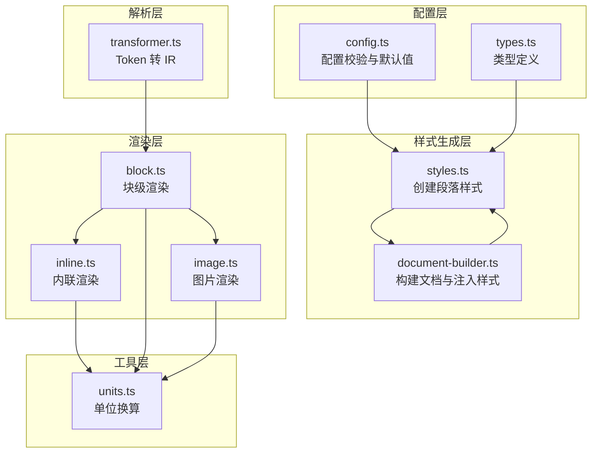
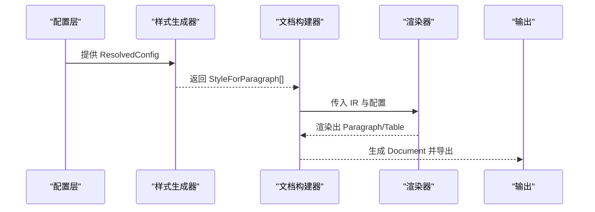
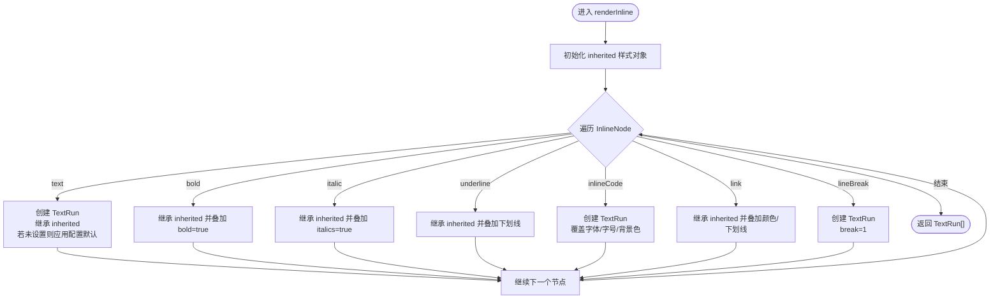
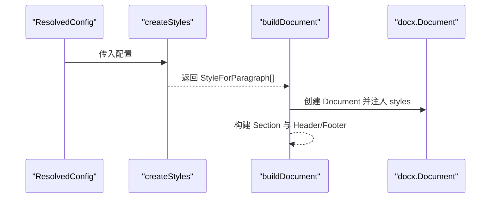
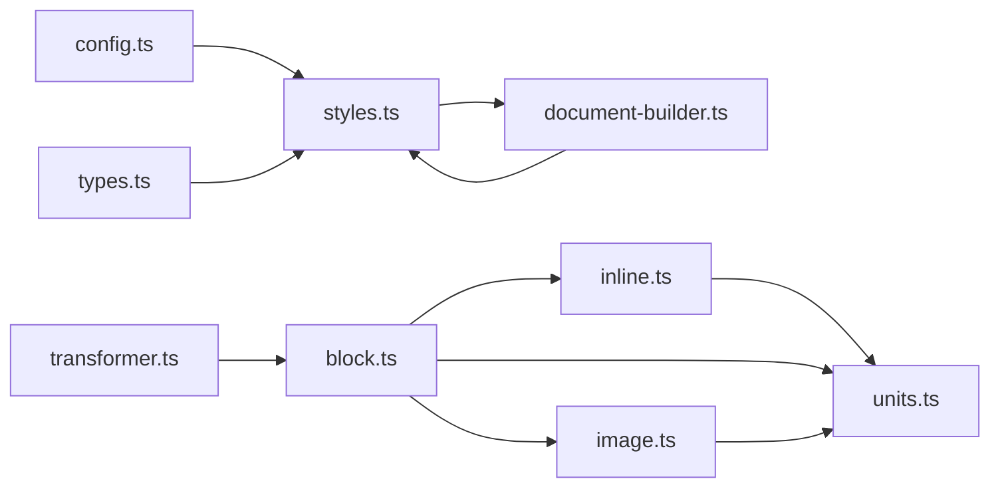

# 样式系统

<cite>
**本文引用的文件列表**
- [styles.ts](file://src/generator/styles.ts)
- [config.ts](file://src/core/config.ts)
- [types.ts](file://src/core/types.ts)
- [document-builder.ts](file://src/generator/document-builder.ts)
- [block.ts](file://src/generator/renderers/block.ts)
- [inline.ts](file://src/generator/renderers/inline.ts)
- [image.ts](file://src/generator/renderers/image.ts)
- [units.ts](file://src/utils/units.ts)
- [transformer.ts](file://src/parser/transformer.ts)
- [config.test.ts](file://tests/unit/core/config.test.ts)
- [index.ts](file://src/index.ts)
</cite>

## 目录
1. [简介](#简介)
2. [项目结构](#项目结构)
3. [核心组件](#核心组件)
4. [架构总览](#架构总览)
5. [详细组件分析](#详细组件分析)
6. [依赖关系分析](#依赖关系分析)
7. [性能与缓存策略](#性能与缓存策略)
8. [故障排查指南](#故障排查指南)
9. [结论](#结论)
10. [附录](#附录)

## 简介
本文件面向开发者，系统性阐述样式系统的实现与工作机制，涵盖默认样式、配置样式与动态样式的优先级处理；样式配置的数据结构（字体、颜色、间距、对齐等）；样式继承与覆盖规则（嵌套元素与局部覆盖）；样式计算流程（从配置对象到 docx 样式）；以及针对标题、段落、表格、代码块等元素的具体应用示例。同时提供性能优化建议与常见问题排查方法，帮助读者快速理解并定制样式系统。

## 项目结构
样式系统主要由以下模块组成：
- 配置层：定义并校验样式配置，提供默认值与合并逻辑
- 类型层：统一描述文档 IR 与样式配置的数据结构
- 样式生成层：将配置转换为 docx 的段落样式集合
- 渲染层：将块级与内联节点渲染为 docx 段落、表格、图片等
- 工具层：单位换算（pt/twip/半点等）
- 解析层：将 Markdown Token 转换为内部 IR

图表来源
- [config.ts:1-91](file://src/core/config.ts#L1-L91)
- [types.ts:1-198](file://src/core/types.ts#L1-L198)
- [styles.ts:1-122](file://src/generator/styles.ts#L1-L122)
- [document-builder.ts:1-112](file://src/generator/document-builder.ts#L1-L112)
- [block.ts:1-266](file://src/generator/renderers/block.ts#L1-L266)
- [inline.ts:1-110](file://src/generator/renderers/inline.ts#L1-L110)
- [image.ts:1-61](file://src/generator/renderers/image.ts#L1-L61)
- [units.ts:1-45](file://src/utils/units.ts#L1-L45)
- [transformer.ts:1-360](file://src/parser/transformer.ts#L1-L360)

章节来源
- [config.ts:1-91](file://src/core/config.ts#L1-L91)
- [types.ts:1-198](file://src/core/types.ts#L1-L198)
- [styles.ts:1-122](file://src/generator/styles.ts#L1-L122)
- [document-builder.ts:1-112](file://src/generator/document-builder.ts#L1-L112)
- [block.ts:1-266](file://src/generator/renderers/block.ts#L1-L266)
- [inline.ts:1-110](file://src/generator/renderers/inline.ts#L1-L110)
- [image.ts:1-61](file://src/generator/renderers/image.ts#L1-L61)
- [units.ts:1-45](file://src/utils/units.ts#L1-L45)
- [transformer.ts:1-360](file://src/parser/transformer.ts#L1-L360)

## 核心组件
- 配置系统：通过 Zod Schema 定义字体、字号、间距、边距、颜色、页面尺寸与方向等配置项，并提供默认值与合并策略
- 样式生成器：基于配置创建 docx 段落样式集合，包含标题样式、正文样式、代码块样式、引用样式等
- 文档构建器：将样式注入到 docx 文档中，并构建节（Section）与页眉页脚
- 块级渲染器：将 IR 中的块级节点渲染为 Paragraph/Table 等，按需应用样式与间距
- 内联渲染器：将 IR 中的内联节点渲染为 TextRun，支持继承与局部样式叠加
- 图片渲染器：根据页面尺寸与边距计算最大宽度，按配置对齐与缩放
- 单位换算工具：提供 pt、half-pt、twip、EMU 等单位之间的换算

章节来源
- [config.ts:68-91](file://src/core/config.ts#L68-L91)
- [styles.ts:5-122](file://src/generator/styles.ts#L5-L122)
- [document-builder.ts:17-106](file://src/generator/document-builder.ts#L17-L106)
- [block.ts:28-266](file://src/generator/renderers/block.ts#L28-L266)
- [inline.ts:12-110](file://src/generator/renderers/inline.ts#L12-L110)
- [image.ts:6-61](file://src/generator/renderers/image.ts#L6-L61)
- [units.ts:10-22](file://src/utils/units.ts#L10-L22)

## 架构总览
样式系统遵循“配置驱动 + 渲染适配”的架构模式：
- 配置层负责提供统一的 ResolvedConfig
- 样式生成层将 ResolvedConfig 转换为 docx 的 StyleForParagraph 列表
- 渲染层在构建段落时读取配置并应用到 TextRun/Paragraph/Table
- 文档构建器将样式注入到最终的 docx 文档中

图表来源
- [config.ts:68-91](file://src/core/config.ts#L68-L91)
- [styles.ts:5-122](file://src/generator/styles.ts#L5-L122)
- [document-builder.ts:17-106](file://src/generator/document-builder.ts#L17-L106)
- [block.ts:28-266](file://src/generator/renderers/block.ts#L28-L266)
- [inline.ts:12-110](file://src/generator/renderers/inline.ts#L12-L110)

## 详细组件分析

### 配置数据结构与默认值
- 字体配置：body、heading、english、code，默认字体族
- 尺寸配置：body、heading1~6、code，默认字号
- 间距配置：lineSpacing、paragraphSpacing、headingSpacing，默认行距与段前段后间距
- 边距配置：top、bottom、left、right，默认页面边距
- 图像配置：maxWidthPercent、defaultAlign，默认图片最大宽度百分比与对齐方式
- 页眉页脚配置：header、footer、pageNumbers
- 颜色配置：heading、text、link、codeBackground、blockquoteBorder
- 页面尺寸与方向：pageSize（A4、Letter）、orientation（portrait、landscape）

章节来源
- [config.ts:4-64](file://src/core/config.ts#L4-L64)
- [types.ts:137-198](file://src/core/types.ts#L137-L198)

### 样式优先级与继承规则
- 默认样式优先级：Normal（正文）为基线样式，其他样式基于 Normal 继承
- 标题样式：Heading1~6 基于 Normal，按层级调整字号、加粗策略与大纲级别
- 内联样式继承：TextRun 支持继承父级样式（如字体、字号），子级可叠加或覆盖
- 局部样式覆盖：内联渲染器在遇到 bold/italic/underline/link 等节点时，会将对应样式叠加到继承样式上；代码块内联渲染器直接覆盖字体、字号与着色
- 段落样式覆盖：块级渲染器在生成 Paragraph 时，按节点类型设置不同的段前段后间距、缩进、边框等

章节来源
- [styles.ts:44-109](file://src/generator/styles.ts#L44-L109)
- [inline.ts:12-110](file://src/generator/renderers/inline.ts#L12-L110)
- [block.ts:60-197](file://src/generator/renderers/block.ts#L60-L197)

### 样式计算与转换机制
- 从配置到 docx 样式：
  - 标题样式：遍历 heading1~6，设置字体、字号、加粗、颜色、段前段后间距、大纲级别
  - 正文样式：设置字体、字号、颜色与行距、段前段后间距
  - 代码块样式：设置等宽字体、固定行距、背景色
  - 引用样式：斜体、浅色文本、左侧缩进与边框
- 从 IR 到 docx 实例：
  - 块级渲染：根据节点类型创建 Paragraph/Table，设置段落属性与运行属性
  - 内联渲染：将内联节点转为 TextRun，按继承规则叠加样式
  - 图片渲染：根据页面宽度与边距计算最大宽度，按配置对齐

章节来源
- [styles.ts:5-122](file://src/generator/styles.ts#L5-L122)
- [block.ts:28-266](file://src/generator/renderers/block.ts#L28-L266)
- [inline.ts:12-110](file://src/generator/renderers/inline.ts#L12-L110)
- [image.ts:6-61](file://src/generator/renderers/image.ts#L6-L61)

### 具体元素样式应用示例（以路径代替代码片段）
- 标题样式（Heading1~6）
  - 样式生成：[styles.ts:15-42](file://src/generator/styles.ts#L15-L42)
  - 渲染应用：[block.ts:60-78](file://src/generator/renderers/block.ts#L60-L78)
- 段落样式（Paragraph）
  - 样式生成：[styles.ts:44-63](file://src/generator/styles.ts#L44-L63)
  - 渲染应用：[block.ts:80-90](file://src/generator/renderers/block.ts#L80-L90)
- 列表样式（List）
  - 渲染应用：[block.ts:92-122](file://src/generator/renderers/block.ts#L92-L122)
- 引用样式（Blockquote）
  - 样式生成：[styles.ts:89-106](file://src/generator/styles.ts#L89-L106)
  - 渲染应用：[block.ts:124-165](file://src/generator/renderers/block.ts#L124-L165)
- 代码块样式（CodeBlock）
  - 样式生成：[styles.ts:65-87](file://src/generator/styles.ts#L65-L87)
  - 渲染应用：[block.ts:167-197](file://src/generator/renderers/block.ts#L167-L197)
  - 内联渲染覆盖：[inline.ts:64-80](file://src/generator/renderers/inline.ts#L64-L80)
- 表格样式（Table）
  - 渲染应用：[block.ts:199-230](file://src/generator/renderers/block.ts#L199-L230)
- 分隔线样式（ThematicBreak）
  - 渲染应用：[block.ts:232-247](file://src/generator/renderers/block.ts#L232-L247)
- 图片样式（Image）
  - 渲染应用：[image.ts:6-61](file://src/generator/renderers/image.ts#L6-L61)

章节来源
- [styles.ts:5-122](file://src/generator/styles.ts#L5-L122)
- [block.ts:28-266](file://src/generator/renderers/block.ts#L28-L266)
- [inline.ts:12-110](file://src/generator/renderers/inline.ts#L12-L110)
- [image.ts:6-61](file://src/generator/renderers/image.ts#L6-L61)

### 样式继承与覆盖流程（内联）

图表来源
- [inline.ts:12-110](file://src/generator/renderers/inline.ts#L12-L110)

章节来源
- [inline.ts:12-110](file://src/generator/renderers/inline.ts#L12-L110)

### 样式生成与注入流程（段落样式）

图表来源
- [styles.ts:5-122](file://src/generator/styles.ts#L5-L122)
- [document-builder.ts:17-106](file://src/generator/document-builder.ts#L17-L106)

章节来源
- [styles.ts:5-122](file://src/generator/styles.ts#L5-L122)
- [document-builder.ts:17-106](file://src/generator/document-builder.ts#L17-L106)

### 单位换算与页面布局
- pt 与 half-pt：用于字体大小
- pt 与 twip：用于段落间距
- EMU：用于图片尺寸与页面尺寸
- 页面宽度/高度：根据 A4/Letter 与方向计算

章节来源
- [units.ts:10-44](file://src/utils/units.ts#L10-L44)
- [image.ts:10-15](file://src/generator/renderers/image.ts#L10-L15)
- [document-builder.ts:71-87](file://src/generator/document-builder.ts#L71-L87)

## 依赖关系分析
- 配置依赖类型定义与 Zod Schema
- 样式生成依赖配置与单位换算
- 文档构建依赖样式生成与块级渲染
- 块级渲染依赖内联渲染与单位换算
- 图片渲染依赖图像工具与单位换算
- 解析层将 Token 转为 IR，供渲染层消费

图表来源
- [config.ts:1-91](file://src/core/config.ts#L1-L91)
- [types.ts:1-198](file://src/core/types.ts#L1-L198)
- [styles.ts:1-122](file://src/generator/styles.ts#L1-L122)
- [document-builder.ts:1-112](file://src/generator/document-builder.ts#L1-L112)
- [block.ts:1-266](file://src/generator/renderers/block.ts#L1-L266)
- [inline.ts:1-110](file://src/generator/renderers/inline.ts#L1-L110)
- [image.ts:1-61](file://src/generator/renderers/image.ts#L1-L61)
- [units.ts:1-45](file://src/utils/units.ts#L1-L45)
- [transformer.ts:1-360](file://src/parser/transformer.ts#L1-L360)

章节来源
- [config.ts:1-91](file://src/core/config.ts#L1-L91)
- [types.ts:1-198](file://src/core/types.ts#L1-L198)
- [styles.ts:1-122](file://src/generator/styles.ts#L1-L122)
- [document-builder.ts:1-112](file://src/generator/document-builder.ts#L1-L112)
- [block.ts:1-266](file://src/generator/renderers/block.ts#L1-L266)
- [inline.ts:1-110](file://src/generator/renderers/inline.ts#L1-L110)
- [image.ts:1-61](file://src/generator/renderers/image.ts#L1-L61)
- [units.ts:1-45](file://src/utils/units.ts#L1-L45)
- [transformer.ts:1-360](file://src/parser/transformer.ts#L1-L360)

## 性能与缓存策略
- 样式对象复用：createStyles 在每次构建文档时都会重新创建 StyleForParagraph 对象。由于 docx 库内部可能对样式进行去重与缓存，建议在高频生成场景中避免重复构建相同配置的文档，或在上层逻辑中对相同配置的结果进行外部缓存（例如基于配置哈希的键值缓存）
- 渲染路径优化：内联渲染器采用递归与继承叠加，复杂文档中可考虑减少不必要的 TextRun 创建；对于长段落，尽量合并连续的纯文本节点
- 图片渲染：图片尺寸计算与缩放在渲染阶段完成，建议在上层对图片源进行预处理（如压缩、尺寸限制），以减少渲染时的计算开销
- 单位换算：单位换算函数为纯函数，调用成本低；在批量渲染时可复用已计算的页面尺寸与边距常量

章节来源
- [styles.ts:5-122](file://src/generator/styles.ts#L5-L122)
- [inline.ts:12-110](file://src/generator/renderers/inline.ts#L12-L110)
- [image.ts:6-61](file://src/generator/renderers/image.ts#L6-L61)
- [units.ts:10-44](file://src/utils/units.ts#L10-L44)

## 故障排查指南
- 配置校验失败：检查配置项是否符合 Zod Schema，如 pageSize 必须为 'A4' 或 'Letter'
- 样式不生效：确认样式 ID 是否正确（Normal、Heading1~6、CodeBlock、Quote），以及是否被注入到 Document.styles 中
- 图片显示异常：检查图片路径、格式与尺寸；若读取失败，将回退为占位段落
- 行距/间距异常：确认 pt-to-twip/pt-to-half-pt 的换算是否正确，以及段前段后间距单位是否为 twip
- 标题层级错误：检查 HeadingLevel 映射与 outlineLevel 设置

章节来源
- [config.test.ts:22-31](file://tests/unit/core/config.test.ts#L22-L31)
- [document-builder.ts:96-106](file://src/generator/document-builder.ts#L96-L106)
- [image.ts:47-60](file://src/generator/renderers/image.ts#L47-L60)
- [block.ts:60-78](file://src/generator/renderers/block.ts#L60-L78)

## 结论
该样式系统通过清晰的配置层、样式生成层与渲染层分工，实现了从 Markdown 到 docx 的高质量样式映射。系统支持默认样式、配置驱动与局部覆盖，具备良好的扩展性与可维护性。建议在生产环境中结合外部缓存与输入预处理，进一步提升性能与稳定性。

## 附录
- 导出入口：对外暴露解析、生成、配置与类型定义，便于上层集成
- 测试参考：单元测试验证默认配置、合并配置与非法参数的处理

章节来源
- [index.ts:1-25](file://src/index.ts#L1-L25)
- [config.test.ts:1-32](file://tests/unit/core/config.test.ts#L1-L32)