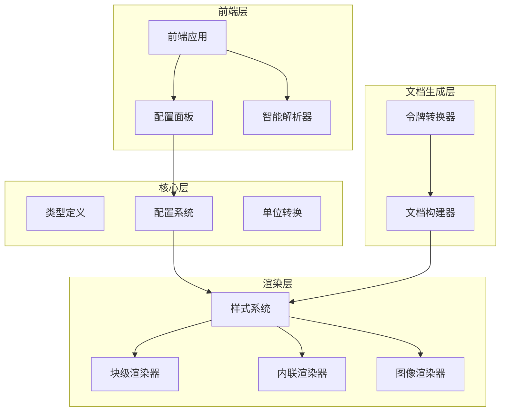
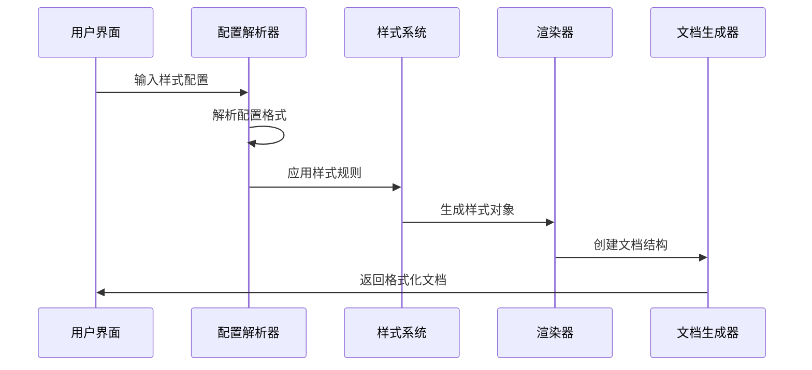
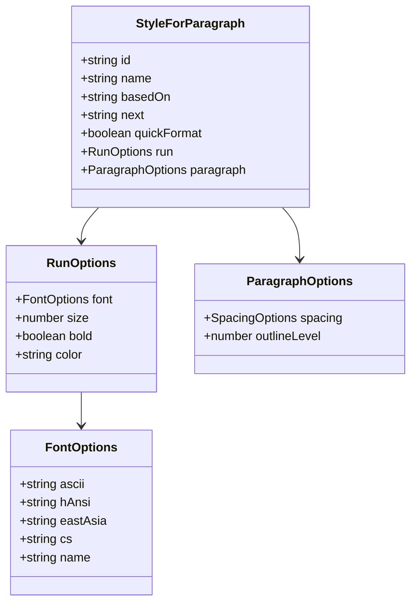
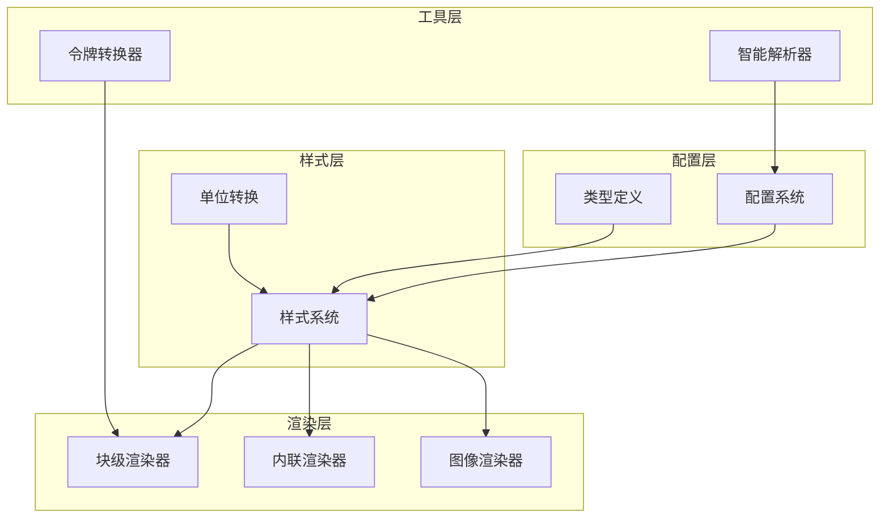

# 增强的样式实用工具

<cite>
**本文档引用的文件**
- [styles.ts](file://src/generator/styles.ts)
- [units.ts](file://src/utils/units.ts)
- [smartParser.ts](file://frontend/src/utils/smartParser.ts)
- [transformer.ts](file://src/parser/transformer.ts)
- [document-builder.ts](file://src/generator/document-builder.ts)
- [types.ts](file://src/core/types.ts)
- [block.ts](file://src/generator/renderers/block.ts)
- [inline.ts](file://src/generator/renderers/inline.ts)
- [image.ts](file://src/generator/renderers/image.ts)
- [ConfigPanel.tsx](file://frontend/src/components/config/ConfigPanel.tsx)
- [config.ts](file://src/core/config.ts)
- [App.css](file://frontend/src/App.css)
- [index.css](file://frontend/src/index.css)
- [CONFIG_SPEC.md](file://CONFIG_SPEC.md)
</cite>

## 目录
1. [简介](#简介)
2. [项目结构](#项目结构)
3. [核心组件](#核心组件)
4. [架构概览](#架构概览)
5. [详细组件分析](#详细组件分析)
6. [依赖关系分析](#依赖关系分析)
7. [性能考虑](#性能考虑)
8. [故障排除指南](#故障排除指南)
9. [结论](#结论)

## 简介

增强的样式实用工具是 Markdown 转 Word 文档生成器的核心组成部分，负责处理文档的样式系统、字体管理、间距控制和页面布局。该系统提供了完整的样式配置机制，支持中英文混合排版、多级标题样式、代码块格式化、引用块美化等功能。

系统采用模块化设计，通过统一的样式配置接口管理所有文档元素的视觉表现，确保生成的 Word 文档具有专业且一致的外观。

## 项目结构

该项目采用前后端分离的架构设计，主要分为以下几个核心模块：

**图表来源**
- [ConfigPanel.tsx:1-151](file://frontend/src/components/config/ConfigPanel.tsx#L1-151)
- [styles.ts:1-131](file://src/generator/styles.ts#L1-131)
- [document-builder.ts:1-193](file://src/generator/document-builder.ts#L1-193)

**章节来源**
- [ConfigPanel.tsx:1-151](file://frontend/src/components/config/ConfigPanel.tsx#L1-151)
- [styles.ts:1-131](file://src/generator/styles.ts#L1-131)
- [document-builder.ts:1-193](file://src/generator/document-builder.ts#L1-193)

## 核心组件

### 样式配置系统

样式配置系统是整个文档生成的核心，负责定义和管理所有文档元素的样式属性。系统支持以下主要配置类别：

- **字体配置**：正文、标题、英文、代码字体的独立配置
- **尺寸配置**：正文、各级标题、代码块的字体大小
- **间距配置**：行间距、段落间距、标题间距的精确控制
- **颜色配置**：标题、正文、链接、代码背景、引用边框的颜色设置
- **页面布局**：纸张大小、页面方向、页边距的综合管理

### 单位转换系统

为了确保跨平台的一致性，系统实现了完整的单位转换机制：

- **像素到 EMU 转换**：用于精确的页面尺寸控制
- **点到半点转换**：Word 文档字体大小的标准表示
- **点到 Twip 转换**：Word 文档间距的标准单位
- **页面尺寸计算**：支持 A4 和 Letter 纸张的标准尺寸

### 智能样式解析

前端提供了强大的智能样式解析功能，支持多种输入格式：

- **自然语言解析**：支持中文自然语言描述的样式配置
- **键值对格式**：人类可读的配置格式
- **JSON 格式**：结构化的配置数据
- **预设模板**：针对不同文档类型的预配置方案

**章节来源**
- [config.ts:1-91](file://src/core/config.ts#L1-91)
- [units.ts:1-45](file://src/utils/units.ts#L1-45)
- [smartParser.ts:1-87](file://frontend/src/utils/smartParser.ts#L1-87)

## 架构概览

样式系统采用分层架构设计，确保各组件之间的职责清晰分离：

**图表来源**
- [smartParser.ts:21-86](file://frontend/src/utils/smartParser.ts#L21-86)
- [styles.ts:5-118](file://src/generator/styles.ts#L5-118)
- [document-builder.ts:18-186](file://src/generator/document-builder.ts#L18-186)

系统的核心流程包括配置解析、样式应用、文档渲染三个主要阶段，每个阶段都有明确的输入输出规范。

## 详细组件分析

### 样式创建器 (Style Creator)

样式创建器负责生成 Word 文档所需的完整样式表，包含以下核心样式：

#### 标题样式系统

系统为六级标题提供独立的样式配置，每级标题都有特定的字体、字号、粗细度和间距设置：

**图表来源**
- [styles.ts:15-45](file://src/generator/styles.ts#L15-45)

#### 正文样式配置

正文样式作为基础样式，为所有其他样式提供继承基础，包含字体、字号、颜色和段落间距的完整配置。

#### 代码块样式

代码块样式专门针对代码内容的显示优化，包括等宽字体、背景色、行间距等特性。

#### 引用块样式

引用块样式提供专业的引用格式，包括斜体显示、灰色文本、左侧边框等视觉特征。

**章节来源**
- [styles.ts:5-131](file://src/generator/styles.ts#L5-131)

### 单位转换器 (Unit Converter)

单位转换器提供了跨单位的精确转换功能，确保样式配置在不同环境下的准确性：

#### 像素到 EMU 转换

用于页面尺寸和图像定位的精确控制，1 英寸等于 914400 EMU，1 像素约等于 9525 EMU。

#### 点到半点转换

Word 文档使用半点作为字体大小的最小单位，1 点等于 2 个半点。

#### 点到 Twip 转换

Twip（1/20 点）是 Word 文档间距的标准单位，1 英寸等于 1440 Twips。

**章节来源**
- [units.ts:1-45](file://src/utils/units.ts#L1-45)

### 智能解析器 (Smart Parser)

智能解析器支持多种配置输入格式，提供灵活的样式配置方式：

#### 自然语言解析

支持中文自然语言描述的样式配置，如"宋体 12 号字"、"黑体 14 号字"等。

#### 键值对格式解析

支持传统的键值对格式，每行一个配置项，格式为 `key: value`。

#### JSON 格式解析

支持结构化的 JSON 配置，便于程序化生成和处理。

#### 预设模板系统

提供针对不同文档类型的预配置模板，包括学术论文、商务报告、简历等。

**章节来源**
- [smartParser.ts:1-87](file://frontend/src/utils/smartParser.ts#L1-87)

### 渲染器系统

渲染器系统负责将样式应用到具体的文档元素上，包括块级元素和内联元素的处理。

#### 块级渲染器

处理段落、列表、表格、代码块等块级元素的样式渲染。

#### 内联渲染器

处理文本、粗体、斜体、链接等内联元素的样式渲染。

#### 图像渲染器

处理图像的缩放、对齐、边距等样式属性。

**章节来源**
- [block.ts:35-286](file://src/generator/renderers/block.ts#L35-286)
- [inline.ts:14-128](file://src/generator/renderers/inline.ts#L14-128)
- [image.ts:6-61](file://src/generator/renderers/image.ts#L6-61)

## 依赖关系分析

样式系统各组件之间的依赖关系体现了清晰的分层架构：

**图表来源**
- [config.ts:1-91](file://src/core/config.ts#L1-91)
- [types.ts:142-204](file://src/core/types.ts#L142-204)
- [styles.ts:1-3](file://src/generator/styles.ts#L1-3)

系统采用松耦合的设计原则，各组件通过明确定义的接口进行交互，降低了组件间的依赖复杂度。

**章节来源**
- [types.ts:142-204](file://src/core/types.ts#L142-204)
- [document-builder.ts:1-193](file://src/generator/document-builder.ts#L1-193)

## 性能考虑

样式系统在设计时充分考虑了性能优化：

### 缓存策略

- 样式对象的复用和缓存，避免重复创建相同的样式配置
- 单位转换结果的缓存，减少重复计算
- 配置解析结果的缓存，提升重复操作的响应速度

### 内存优化

- 使用高效的数组和对象结构存储样式配置
- 及时释放不再使用的样式对象
- 控制样式配置的深度和广度，避免过度复杂的样式层次

### 渲染优化

- 批量处理相似的样式应用操作
- 使用增量更新机制，只更新发生变化的样式
- 优化图像处理流程，减少内存占用

## 故障排除指南

### 常见问题及解决方案

#### 样式不生效

**问题描述**：配置的样式没有正确应用到文档中

**可能原因**：
- 样式 ID 与实际使用的样式不匹配
- 字体名称不存在或不可用
- 颜色值格式不正确

**解决方法**：
1. 检查样式 ID 的正确性
2. 验证字体名称的有效性
3. 确认颜色值符合十六进制格式

#### 单位转换错误

**问题描述**：页面尺寸或间距显示异常

**可能原因**：
- 单位转换比例计算错误
- 页面尺寸设置不正确
- 页边距计算逻辑问题

**解决方法**：
1. 验证单位转换函数的正确性
2. 检查页面尺寸常量的准确性
3. 确认页边距计算公式的合理性

#### 字体显示问题

**问题描述**：中文字符显示异常或乱码

**可能原因**：
- 中文字体未正确安装
- 字体回退机制失效
- 字体编码问题

**解决方法**：
1. 确保中文字体已正确安装
2. 验证字体回退配置
3. 检查字体编码设置

**章节来源**
- [units.ts:1-45](file://src/utils/units.ts#L1-45)
- [styles.ts:1-131](file://src/generator/styles.ts#L1-131)

## 结论

增强的样式实用工具为 Markdown 转 Word 文档生成提供了强大而灵活的样式管理能力。通过模块化的架构设计、完善的配置系统和高效的渲染机制，该工具能够满足各种文档格式化需求。

系统的主要优势包括：

1. **全面的样式控制**：支持字体、颜色、间距、布局等全方位的样式配置
2. **多格式支持**：兼容自然语言、键值对、JSON 多种配置格式
3. **高性能实现**：通过缓存和优化策略确保良好的性能表现
4. **易用性强**：提供直观的配置界面和丰富的预设模板
5. **扩展性好**：模块化设计便于功能扩展和维护

该样式系统为文档生成器奠定了坚实的基础，能够生成高质量、专业化的 Word 文档，满足用户的各种格式化需求。