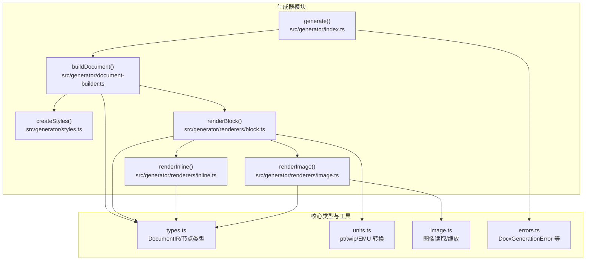
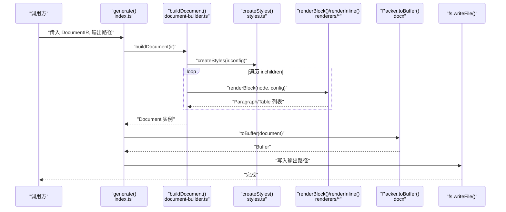
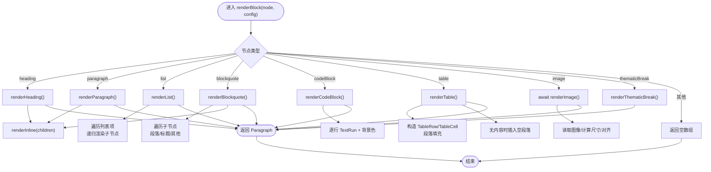
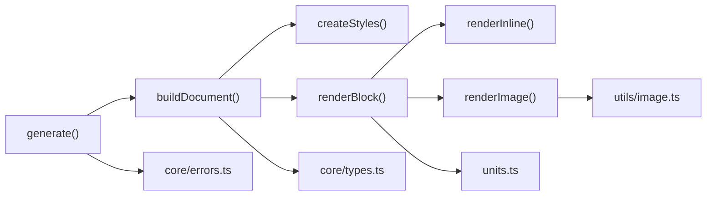

# 生成器模块

<cite>
**本文引用的文件**
- [src/generator/index.ts](file://src/generator/index.ts)
- [src/generator/document-builder.ts](file://src/generator/document-builder.ts)
- [src/generator/styles.ts](file://src/generator/styles.ts)
- [src/generator/renderers/block.ts](file://src/generator/renderers/block.ts)
- [src/generator/renderers/inline.ts](file://src/generator/renderers/inline.ts)
- [src/generator/renderers/image.ts](file://src/generator/renderers/image.ts)
- [src/core/types.ts](file://src/core/types.ts)
- [src/core/errors.ts](file://src/core/errors.ts)
- [src/utils/units.ts](file://src/utils/units.ts)
- [src/utils/image.ts](file://src/utils/image.ts)
- [tests/fixtures/markdown/sample.md](file://tests/fixtures/markdown/sample.md)
</cite>

## 目录
1. [引言](#引言)
2. [项目结构](#项目结构)
3. [核心组件](#核心组件)
4. [架构总览](#架构总览)
5. [详细组件分析](#详细组件分析)
6. [依赖分析](#依赖分析)
7. [性能考虑](#性能考虑)
8. [故障排查指南](#故障排查指南)
9. [结论](#结论)
10. [附录](#附录)

## 引言
本文件面向开发者，系统性阐述 Markdown 到 Word（docx）转换器的“生成器模块”。重点围绕 generate() 函数的工作流程、DocumentIR 的消费方式、document-builder 的文档构建过程、样式体系（默认/配置/动态）的优先级与应用、渲染器系统（块级/内联/图片）的设计模式，以及生成器与解析器的协作关系与错误传播机制。目标是帮助读者快速理解生成原理并安全地扩展功能。

## 项目结构
生成器模块位于 src/generator，包含入口导出、文档构建器、样式工厂与渲染器子系统（块级、内联、图片）。核心数据模型来自 src/core/types，单位转换与图片处理分别在 src/utils/units 与 src/utils/image 中实现；错误类型集中在 src/core/errors。

图表来源
- [src/generator/index.ts:7-18](file://src/generator/index.ts#L7-L18)
- [src/generator/document-builder.ts:17-106](file://src/generator/document-builder.ts#L17-L106)
- [src/generator/styles.ts:5-109](file://src/generator/styles.ts#L5-L109)
- [src/generator/renderers/block.ts:28-58](file://src/generator/renderers/block.ts#L28-L58)
- [src/generator/renderers/inline.ts:12-109](file://src/generator/renderers/inline.ts#L12-L109)
- [src/generator/renderers/image.ts:6-60](file://src/generator/renderers/image.ts#L6-L60)
- [src/core/types.ts:7-198](file://src/core/types.ts#L7-L198)
- [src/utils/units.ts:1-45](file://src/utils/units.ts#L1-L45)
- [src/utils/image.ts:12-57](file://src/utils/image.ts#L12-L57)
- [src/core/errors.ts:8-12](file://src/core/errors.ts#L8-L12)

章节来源
- [src/generator/index.ts:1-21](file://src/generator/index.ts#L1-L21)
- [src/generator/document-builder.ts:1-112](file://src/generator/document-builder.ts#L1-L112)
- [src/generator/styles.ts:1-122](file://src/generator/styles.ts#L1-L122)
- [src/generator/renderers/block.ts:1-266](file://src/generator/renderers/block.ts#L1-L266)
- [src/generator/renderers/inline.ts:1-110](file://src/generator/renderers/inline.ts#L1-L110)
- [src/generator/renderers/image.ts:1-61](file://src/generator/renderers/image.ts#L1-L61)
- [src/core/types.ts:1-198](file://src/core/types.ts#L1-L198)
- [src/core/errors.ts:1-28](file://src/core/errors.ts#L1-L28)
- [src/utils/units.ts:1-45](file://src/utils/units.ts#L1-L45)
- [src/utils/image.ts:1-58](file://src/utils/image.ts#L1-L58)

## 核心组件
- generate(ir, outputPath)：对外入口，负责接收 DocumentIR，调用 buildDocument 构建文档，序列化为 Buffer 并写入文件，异常统一包装为 DocxGenerationError。
- buildDocument(ir)：文档构建主流程，基于 IR 的 children 渲染块级元素，创建页眉/页脚，设置页面属性与样式集合，返回 docx.Document 实例。
- createStyles(config)：根据配置生成默认段落样式（Heading1..6、Normal、CodeBlock、Quote），作为文档样式表注入。
- renderBlock(node, config)：块级元素分发器，按节点类型映射到具体渲染函数，返回一个或多个 Paragraph/Table。
- renderInline(nodes, config, inherited)：内联元素递归渲染，支持继承样式（如粗体/斜体/链接等），输出 TextRun 序列。
- renderImage(node, config)：异步读取图像、计算缩放尺寸、对齐与间距，回退时输出占位空图以保证文档可生成。

章节来源
- [src/generator/index.ts:7-18](file://src/generator/index.ts#L7-L18)
- [src/generator/document-builder.ts:17-106](file://src/generator/document-builder.ts#L17-L106)
- [src/generator/styles.ts:5-109](file://src/generator/styles.ts#L5-L109)
- [src/generator/renderers/block.ts:28-58](file://src/generator/renderers/block.ts#L28-L58)
- [src/generator/renderers/inline.ts:12-109](file://src/generator/renderers/inline.ts#L12-L109)
- [src/generator/renderers/image.ts:6-60](file://src/generator/renderers/image.ts#L6-L60)

## 架构总览
生成器采用“自顶向下”的流水线设计：generate 接收 IR，buildDocument 组装文档对象，renderBlock 将 IR 子树映射为 docx 元素，renderInline 处理富文本样式，createStyles 注入样式表，最终由 docx.Packer 序列化为 Buffer 写入文件。

图表来源
- [src/generator/index.ts:7-18](file://src/generator/index.ts#L7-L18)
- [src/generator/document-builder.ts:17-106](file://src/generator/document-builder.ts#L17-L106)
- [src/generator/styles.ts:5-109](file://src/generator/styles.ts#L5-L109)
- [src/generator/renderers/block.ts:28-58](file://src/generator/renderers/block.ts#L28-L58)
- [src/generator/renderers/inline.ts:12-109](file://src/generator/renderers/inline.ts#L12-L109)

## 详细组件分析

### generate() 工作流与错误传播
- 输入：DocumentIR、输出路径字符串。
- 步骤：
  1) 调用 buildDocument(ir) 构建 docx.Document；
  2) 使用 Packer.toBuffer 序列化为 Buffer；
  3) 写入指定文件路径；
  4) 捕获任何异常并抛出 DocxGenerationError，保留原始错误原因以便上层定位。
- 错误传播：通过包装器类确保调用方能捕获并区分生成阶段的异常。

章节来源
- [src/generator/index.ts:7-18](file://src/generator/index.ts#L7-L18)
- [src/core/errors.ts:8-12](file://src/core/errors.ts#L8-L12)

### document-builder 文档构建过程
- 样式初始化：createStyles(config) 生成 Heading1..6、Normal、CodeBlock、Quote 等段落样式。
- 子节点渲染：遍历 ir.children，逐个调用 renderBlock(node, config)，将返回的 Paragraph/Table 收集为文档子元素。
- 页眉/页脚：
  - 页眉：居中显示配置文本；
  - 页脚：可选显示 footer 文本与页码（当前页/总页数），自动插入分隔符。
- 页面属性：连续分节、页边距、纸张方向、页码等。
- 文档对象：设置作者、标题、描述、默认样式与段落样式表、sections 数组，返回 Document 实例。

章节来源
- [src/generator/document-builder.ts:17-106](file://src/generator/document-builder.ts#L17-L106)
- [src/generator/styles.ts:5-109](file://src/generator/styles.ts#L5-L109)

### 样式系统：默认/配置/动态优先级
- 默认样式：Heading1..6、Normal、CodeBlock、Quote，基于 docx.StyleForParagraph 定义，继承 Normal，设置字体、字号、颜色、行距、段前段后距、缩进等。
- 配置样式：从 ResolvedConfig 读取字体族、字号、行距、段间距、颜色、页边距、页眉页脚、页面大小与方向等，作为样式与布局的基础来源。
- 动态样式：内联渲染时通过 inherited 参数传递父级样式（如粗体/斜体/下划线/链接颜色/下划线），覆盖默认样式但不改变全局样式表。
- 优先级原则：
  - 全局样式表（createStyles）决定段落样式基线；
  - 内联样式（renderInline）仅影响当前 TextRun 的直接表现；
  - Heading 级别通过 HeadingLevel 映射，受 HeadingX 样式控制；
  - Quote/CodeBlock 等块级样式独立于正文 Normal，但共享配置参数。

章节来源
- [src/generator/styles.ts:5-109](file://src/generator/styles.ts#L5-L109)
- [src/generator/renderers/inline.ts:12-109](file://src/generator/renderers/inline.ts#L12-L109)
- [src/generator/renderers/block.ts:60-78](file://src/generator/renderers/block.ts#L60-L78)

### 渲染器系统：块级/内联/图片
- 块级渲染（renderBlock）：
  - 分发逻辑：按节点类型映射到 heading/paragraph/list/blockquote/codeBlock/table/image/thematicBreak；
  - 列表与引用：支持嵌套，内部递归调用 renderBlockSync 或 renderBlock；
  - 返回值：Paragraph 或 Table，部分节点类型返回空数组（如 listItem/tableRow/tableCell）。
- 内联渲染（renderInline）：
  - 文本：继承父级样式，未设置则使用正文字体与字号；
  - 粗体/斜体/下划线：通过 inherited 合并，形成样式链；
  - 行内代码：独立字体与背景色；
  - 链接：带下划线与颜色；
  - 换行：生成断行 TextRun。
- 图片渲染（renderImage）：
  - 读取：支持本地文件与 HTTP(S) 链接，使用 sharp 解析元数据；
  - 计算：依据页面宽度、页边距与最大宽度百分比计算缩放尺寸；
  - 对齐：根据节点 align 或配置默认对齐；
  - 回退：失败时输出占位空图，避免中断生成。

图表来源
- [src/generator/renderers/block.ts:28-122](file://src/generator/renderers/block.ts#L28-L122)
- [src/generator/renderers/block.ts:124-165](file://src/generator/renderers/block.ts#L124-L165)
- [src/generator/renderers/block.ts:167-197](file://src/generator/renderers/block.ts#L167-L197)
- [src/generator/renderers/block.ts:199-230](file://src/generator/renderers/block.ts#L199-L230)
- [src/generator/renderers/block.ts:250-265](file://src/generator/renderers/block.ts#L250-L265)
- [src/generator/renderers/inline.ts:12-109](file://src/generator/renderers/inline.ts#L12-L109)
- [src/generator/renderers/image.ts:6-60](file://src/generator/renderers/image.ts#L6-L60)

章节来源
- [src/generator/renderers/block.ts:28-265](file://src/generator/renderers/block.ts#L28-L265)
- [src/generator/renderers/inline.ts:12-109](file://src/generator/renderers/inline.ts#L12-L109)
- [src/generator/renderers/image.ts:6-60](file://src/generator/renderers/image.ts#L6-L60)

### 生成器与解析器的协作与中间表示消费
- 输入来源：解析器将 Markdown 文本转换为 DocumentIR（包含 meta、config、children），其中 children 为 BlockNode[]。
- 消费方式：生成器直接遍历 ir.children，逐个节点调用 renderBlock，内部再根据需要调用 renderInline 或 renderImage。
- 协作要点：
  - 解析器负责结构化与语义化（BlockNode/InlineNode），生成器负责渲染为 docx 元素；
  - 生成器不关心 Markdown 语法细节，只消费已结构化的 IR；
  - 样式与布局完全由配置驱动，便于在不同解析器版本间保持一致性。

章节来源
- [src/core/types.ts:7-135](file://src/core/types.ts#L7-L135)
- [src/generator/document-builder.ts:21-28](file://src/generator/document-builder.ts#L21-L28)
- [src/generator/renderers/block.ts:28-58](file://src/generator/renderers/block.ts#L28-L58)

### 数据模型与类型约束
- DocumentIR：根节点，包含元信息、已解析配置与块级节点数组。
- BlockNode/InlineNode：严格的联合类型，确保渲染器分发逻辑完备覆盖所有类型。
- ResolvedConfig：字体、字号、间距、颜色、页边距、页眉页脚、页面大小与方向等配置项。

章节来源
- [src/core/types.ts:7-198](file://src/core/types.ts#L7-L198)

## 依赖分析
- 组件耦合：
  - generate 依赖 buildDocument；
  - buildDocument 依赖 createStyles 与 renderBlock；
  - renderBlock 依赖 renderInline 与 renderImage；
  - renderBlock/inline/image 依赖 ResolvedConfig 与单位转换工具；
  - renderImage 依赖图像处理工具。
- 外部依赖：
  - docx：用于构建文档对象、样式与打包；
  - sharp：用于图像元数据读取与尺寸计算；
  - fs/fetch：用于读取本地文件或网络资源。

图表来源
- [src/generator/index.ts:7-18](file://src/generator/index.ts#L7-L18)
- [src/generator/document-builder.ts:17-106](file://src/generator/document-builder.ts#L17-L106)
- [src/generator/styles.ts:5-109](file://src/generator/styles.ts#L5-L109)
- [src/generator/renderers/block.ts:28-58](file://src/generator/renderers/block.ts#L28-L58)
- [src/generator/renderers/inline.ts:12-109](file://src/generator/renderers/inline.ts#L12-L109)
- [src/generator/renderers/image.ts:6-60](file://src/generator/renderers/image.ts#L6-L60)
- [src/core/types.ts:7-198](file://src/core/types.ts#L7-L198)
- [src/core/errors.ts:8-12](file://src/core/errors.ts#L8-L12)
- [src/utils/units.ts:1-45](file://src/utils/units.ts#L1-L45)
- [src/utils/image.ts:12-57](file://src/utils/image.ts#L12-L57)

## 性能考虑
- 图像处理：
  - 读取与解码可能成为瓶颈，建议限制并发或缓存常见资源；
  - 缩放计算在内存中进行，注意大图时的内存占用。
- 样式注入：
  - createStyles 一次性生成样式表，避免重复创建；
  - 段落样式复用 HeadingX/Normal/CodeBlock/Quote，减少样式数量。
- 文档构建：
  - renderBlock 与 renderInline 为纯函数式映射，时间复杂度与节点数线性相关；
  - 大表格/长列表会增加 Paragraph/Table 数量，注意内存与序列化时间。

## 故障排查指南
- 生成阶段错误：
  - 现象：生成失败并抛出 DocxGenerationError；
  - 排查：检查 IR 是否完整、配置是否有效、输出路径权限；
  - 参考：包装位置与错误类型定义。
- 图像处理错误：
  - 现象：renderImage 回退为占位空图；
  - 排查：确认 URL/路径可访问、文件格式受支持、sharp 可用；
  - 参考：图像读取与缩放逻辑、错误包装。
- 样式异常：
  - 现象：字号/行距/颜色不符合预期；
  - 排查：核对 ResolvedConfig 的 size/font/color/spacings 字段；
  - 参考：createStyles 与 renderInline 的样式合并策略。

章节来源
- [src/core/errors.ts:8-12](file://src/core/errors.ts#L8-L12)
- [src/generator/renderers/image.ts:47-60](file://src/generator/renderers/image.ts#L47-L60)
- [src/utils/image.ts:38-42](file://src/utils/image.ts#L38-L42)
- [src/generator/styles.ts:5-109](file://src/generator/styles.ts#L5-L109)
- [src/generator/renderers/inline.ts:12-109](file://src/generator/renderers/inline.ts#L12-L109)

## 结论
生成器模块以清晰的职责划分与严格的类型约束实现了从 DocumentIR 到 docx 的高保真转换。通过集中式样式工厂与分层渲染器，系统具备良好的可维护性与扩展性。开发者可在不破坏现有结构的前提下，新增块级/内联节点类型或调整样式策略，同时保持与解析器的松耦合协作。

## 附录
- 示例 Markdown（用于端到端验证）：tests/fixtures/markdown/sample.md
- 关键实现路径参考：
  - 生成入口：[src/generator/index.ts:7-18](file://src/generator/index.ts#L7-L18)
  - 文档构建：[src/generator/document-builder.ts:17-106](file://src/generator/document-builder.ts#L17-L106)
  - 样式工厂：[src/generator/styles.ts:5-109](file://src/generator/styles.ts#L5-L109)
  - 块级渲染：[src/generator/renderers/block.ts:28-265](file://src/generator/renderers/block.ts#L28-L265)
  - 内联渲染：[src/generator/renderers/inline.ts:12-109](file://src/generator/renderers/inline.ts#L12-L109)
  - 图片渲染：[src/generator/renderers/image.ts:6-60](file://src/generator/renderers/image.ts#L6-L60)
  - 类型定义：[src/core/types.ts:7-198](file://src/core/types.ts#L7-L198)
  - 错误类型：[src/core/errors.ts:8-12](file://src/core/errors.ts#L8-L12)
  - 单位转换：[src/utils/units.ts:1-45](file://src/utils/units.ts#L1-L45)
  - 图像处理：[src/utils/image.ts:12-57](file://src/utils/image.ts#L12-L57)