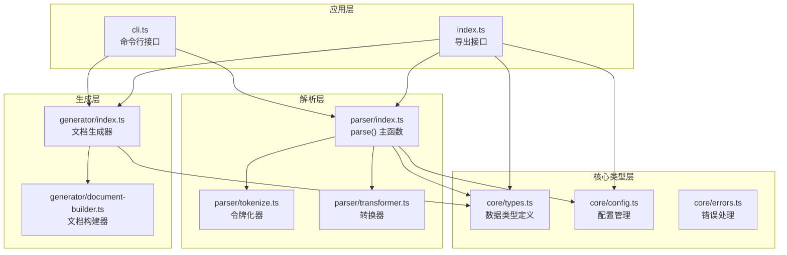
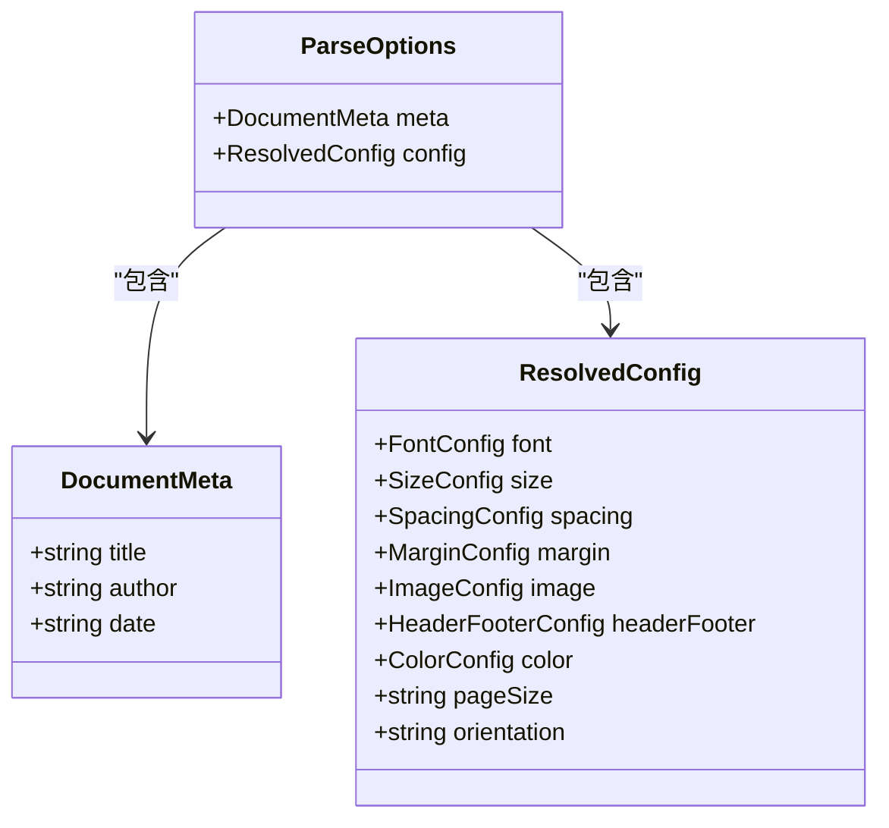
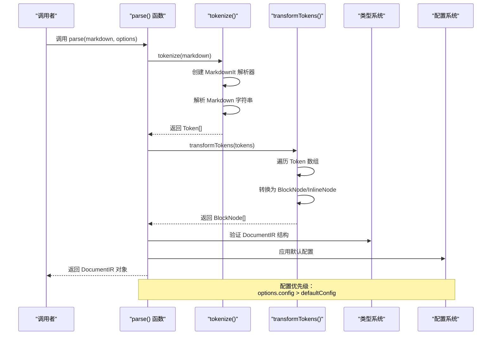
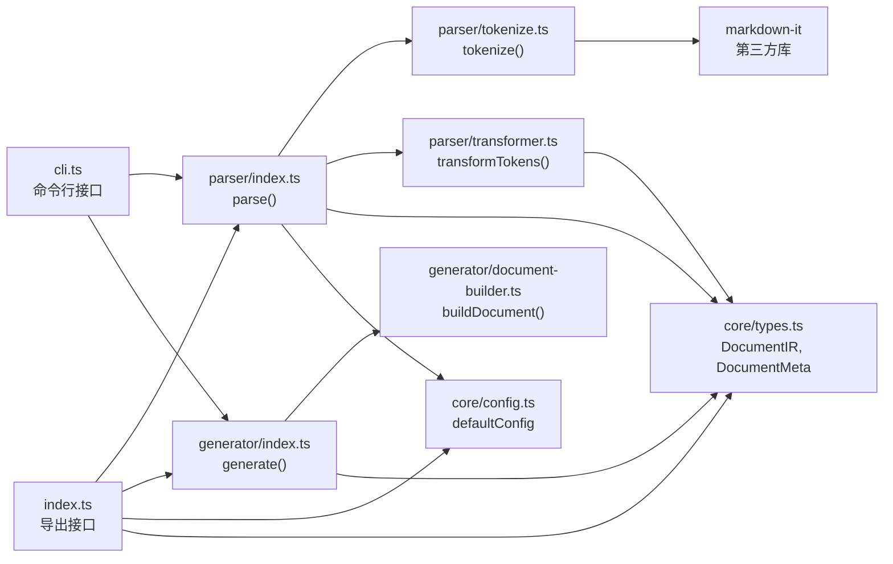
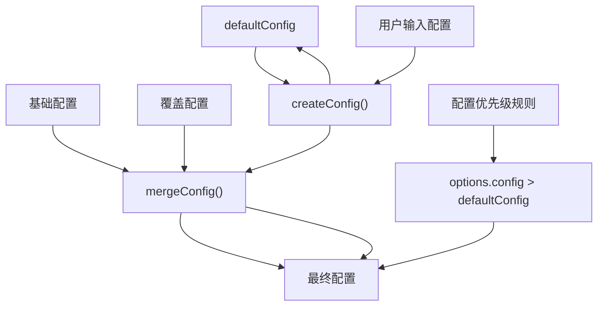
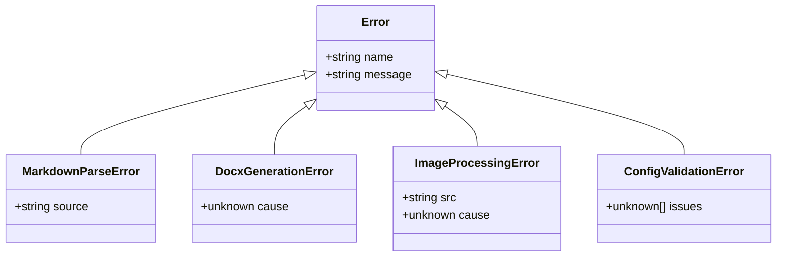

# parse() 主函数

<cite>
**本文档引用的文件**
- [src/index.ts](file://src/index.ts)
- [src/parser/index.ts](file://src/parser/index.ts)
- [src/parser/tokenize.ts](file://src/parser/tokenize.ts)
- [src/parser/transformer.ts](file://src/parser/transformer.ts)
- [src/core/types.ts](file://src/core/types.ts)
- [src/core/config.ts](file://src/core/config.ts)
- [src/generator/index.ts](file://src/generator/index.ts)
- [src/generator/document-builder.ts](file://src/generator/document-builder.ts)
- [src/cli.ts](file://src/cli.ts)
- [tests/unit/parser/transformer.test.ts](file://tests/unit/parser/transformer.test.ts)
- [tests/fixtures/markdown/sample.md](file://tests/fixtures/markdown/sample.md)
- [src/core/errors.ts](file://src/core/errors.ts)
</cite>

## 目录
1. [简介](#简介)
2. [项目结构](#项目结构)
3. [核心组件](#核心组件)
4. [架构概览](#架构概览)
5. [详细组件分析](#详细组件分析)
6. [依赖关系分析](#依赖关系分析)
7. [性能考虑](#性能考虑)
8. [故障排除指南](#故障排除指南)
9. [结论](#结论)
10. [附录](#附录)

## 简介

本文档深入分析 `parse()` 主函数的实现细节和技术架构。该函数是整个 Markdown 到 Word 转换系统的核心入口点，负责协调完整的解析流程，从接收 Markdown 字符串输入到生成最终的 DocumentIR 对象。

`parse()` 函数通过三个主要步骤完成解析工作：
1. **令牌化阶段**：使用 `tokenize()` 将 Markdown 字符串转换为 MarkdownIt Token 数组
2. **转换阶段**：使用 `transformTokens()` 将 Token 转换为结构化的 BlockNode 和 InlineNode
3. **构建阶段**：将解析结果封装为 DocumentIR 对象，包含文档元数据和配置信息

## 项目结构

该项目采用模块化架构设计，主要分为以下几个核心模块：



**图表来源**
- [src/parser/index.ts:1-24](file://src/parser/index.ts#L1-L24)
- [src/parser/tokenize.ts:1-16](file://src/parser/tokenize.ts#L1-L16)
- [src/parser/transformer.ts:1-360](file://src/parser/transformer.ts#L1-L360)
- [src/core/types.ts:1-198](file://src/core/types.ts#L1-L198)
- [src/core/config.ts:1-91](file://src/core/config.ts#L1-L91)
- [src/generator/index.ts:1-21](file://src/generator/index.ts#L1-L21)
- [src/generator/document-builder.ts:1-112](file://src/generator/document-builder.ts#L1-L112)
- [src/cli.ts:1-113](file://src/cli.ts#L1-L113)
- [src/index.ts:1-25](file://src/index.ts#L1-L25)

**章节来源**
- [src/index.ts:1-25](file://src/index.ts#L1-L25)
- [src/parser/index.ts:1-24](file://src/parser/index.ts#L1-L24)

## 核心组件

### ParseOptions 接口详解

`ParseOptions` 是 `parse()` 函数的关键配置接口，包含两个重要的配置项：



**图表来源**
- [src/parser/index.ts:6-9](file://src/parser/index.ts#L6-L9)
- [src/core/types.ts:1-198](file://src/core/types.ts#L1-L198)

#### meta 文档元数据配置

`meta` 属性用于存储文档的基本信息，包括：
- **title**：文档标题（可选）
- **author**：文档作者（可选）  
- **date**：文档日期（可选）

这些元数据在最终的 DOCX 文档中会被正确设置，作为文档属性显示。

#### config 配置参数

`config` 属性控制解析和渲染行为，包含以下子配置：

**字体配置 (FontConfig)**
- `body`: 正文字体
- `heading`: 标题字体  
- `english`: 英文字体
- `code`: 代码字体

**尺寸配置 (SizeConfig)**
- `body`: 正文字号
- `heading1-6`: 各级标题字号
- `code`: 代码字号

**间距配置 (SpacingConfig)**
- `lineSpacing`: 行间距
- `paragraphSpacing`: 段落间距
- `headingSpacing`: 标题间距

**章节来源**
- [src/parser/index.ts:6-9](file://src/parser/index.ts#L6-L9)
- [src/core/types.ts:137-198](file://src/core/types.ts#L137-L198)

## 架构概览

`parse()` 函数的完整执行流程如下：



**图表来源**
- [src/parser/index.ts:11-21](file://src/parser/index.ts#L11-L21)
- [src/parser/tokenize.ts:12-15](file://src/parser/tokenize.ts#L12-L15)
- [src/parser/transformer.ts:25-39](file://src/parser/transformer.ts#L25-L39)
- [src/core/config.ts:90](file://src/core/config.ts#L90)

**章节来源**
- [src/parser/index.ts:11-21](file://src/parser/index.ts#L11-L21)

## 详细组件分析

### parse() 函数实现

`parse()` 函数是整个解析流程的核心协调者，其职责包括：

#### 输入验证与处理
- 接收原始 Markdown 字符串
- 处理可选的 ParseOptions 参数
- 验证输入参数的有效性

#### 解析流程协调
- 调用 `tokenize()` 进行令牌化
- 调用 `transformTokens()` 进行结构化转换
- 组装最终的 DocumentIR 对象

#### 配置管理
- 应用默认配置继承机制
- 处理配置优先级逻辑
- 确保配置的完整性

```mermaid
flowchart TD
Start([开始 parse()]) --> ValidateInput["验证输入参数"]
ValidateInput --> CallTokenize["调用 tokenize()"]
CallTokenize --> TokenizeSuccess{"令牌化成功?"}
TokenizeSuccess --> |否| ThrowError["抛出 MarkdownParseError"]
TokenizeSuccess --> |是| CallTransform["调用 transformTokens()"]
CallTransform --> TransformSuccess{"转换成功?"}
TransformSuccess --> |否| ThrowError
TransformSuccess --> |是| BuildIR["构建 DocumentIR"]
BuildIR --> ApplyMeta["应用 meta 配置"]
ApplyMeta --> ApplyConfig["应用 config 配置"]
ApplyConfig --> CheckConfig{"config 是否提供?"}
CheckConfig --> |否| UseDefault["使用 defaultConfig"]
CheckConfig --> |是| UseProvided["使用提供的配置"]
UseDefault --> ReturnIR["返回 DocumentIR"]
UseProvided --> ReturnIR
ThrowError --> End([结束])
ReturnIR --> End
```

**图表来源**
- [src/parser/index.ts:11-21](file://src/parser/index.ts#L11-L21)
- [src/core/errors.ts:1-28](file://src/core/errors.ts#L1-L28)

**章节来源**
- [src/parser/index.ts:11-21](file://src/parser/index.ts#L11-L21)

### tokenize() 令牌化器

`tokenize()` 函数负责将 Markdown 字符串转换为 MarkdownIt Token 数组：

#### 解析器配置
- 使用 `commonmark` 规范
- 启用 HTML 支持
- 启用链接自动识别
- 启用排版优化
- 启用表格支持

#### 令牌化流程
1. 创建 MarkdownIt 实例
2. 解析输入的 Markdown 字符串
3. 返回 Token 数组

**章节来源**
- [src/parser/tokenize.ts:4-15](file://src/parser/tokenize.ts#L4-L15)

### transformTokens() 转换器

`transformTokens()` 函数将 Token 数组转换为结构化的节点树：

#### 块级元素转换
- **标题**：支持 1-6 级标题
- **段落**：普通文本段落
- **列表**：有序和无序列表
- **引用块**：块引用内容
- **代码块**：支持语言高亮
- **表格**：完整的表格结构
- **分隔线**：水平分隔线

#### 内联元素转换
- **粗体**：`**text**` 或 `__text__`
- **斜体**：`*text*` 或 `_text_`
- **下划线**：`<u>text</u>`
- **行内代码**：`code`
- **链接**：`[text](url)`
- **换行**：支持软换行和硬换行

**章节来源**
- [src/parser/transformer.ts:25-360](file://src/parser/transformer.ts#L25-L360)

## 依赖关系分析

### 核心依赖链



**图表来源**
- [src/parser/index.ts:1-24](file://src/parser/index.ts#L1-L24)
- [src/parser/tokenize.ts:1](file://src/parser/tokenize.ts#L1)
- [src/parser/transformer.ts:1](file://src/parser/transformer.ts#L1)
- [src/core/types.ts:1-198](file://src/core/types.ts#L1-L198)
- [src/core/config.ts:1-91](file://src/core/config.ts#L1-L91)
- [src/generator/index.ts:1-21](file://src/generator/index.ts#L1-L21)
- [src/generator/document-builder.ts:1-112](file://src/generator/document-builder.ts#L1-L112)
- [src/cli.ts:1-113](file://src/cli.ts#L1-L113)
- [src/index.ts:1-25](file://src/index.ts#L1-L25)

### 配置继承机制

配置系统采用深度合并的继承机制：



**图表来源**
- [src/core/config.ts:68-91](file://src/core/config.ts#L68-L91)

**章节来源**
- [src/core/config.ts:68-91](file://src/core/config.ts#L68-L91)

## 性能考虑

### 时间复杂度分析

- **令牌化阶段**：O(n)，其中 n 是 Markdown 字符串长度
- **转换阶段**：O(m)，其中 m 是 Token 数量
- **整体复杂度**：O(n + m)

### 空间复杂度分析

- **Token 存储**：O(m)
- **节点树存储**：O(k)，其中 k 是节点总数
- **内存使用**：主要受文档大小和复杂度影响

### 优化建议

1. **流式处理**：对于超大文档，考虑分块处理
2. **缓存机制**：缓存常用的配置和解析结果
3. **并发处理**：利用多核处理器进行并行转换
4. **内存管理**：及时释放不再使用的中间结果

## 故障排除指南

### 常见错误类型



**图表来源**
- [src/core/errors.ts:1-28](file://src/core/errors.ts#L1-L28)

### 错误处理策略

#### 解析阶段错误
- **MarkdownParseError**：令牌化失败时抛出
- **处理策略**：检查输入格式，验证 Markdown 语法

#### 生成阶段错误  
- **DocxGenerationError**：DOCX 文件生成失败时抛出
- **处理策略**：检查输出路径权限，验证配置有效性

#### 图像处理错误
- **ImageProcessingError**：图像处理失败时抛出
- **处理策略**：验证图像 URL，检查网络连接

#### 配置验证错误
- **ConfigValidationError**：配置参数无效时抛出
- **处理策略**：使用配置模式验证，提供默认值

**章节来源**
- [src/core/errors.ts:1-28](file://src/core/errors.ts#L1-L28)

## 结论

`parse()` 主函数作为整个 Markdown 转换系统的核心，展现了清晰的职责分离和良好的架构设计。通过三个阶段的流水线式处理，实现了从原始 Markdown 到结构化 DocumentIR 的高效转换。

该函数的主要优势包括：
- **模块化设计**：每个阶段都有独立的功能模块
- **配置灵活**：支持丰富的配置选项和继承机制
- **错误处理**：完善的错误类型和处理策略
- **扩展性强**：易于添加新的解析规则和渲染器

对于开发者而言，理解 `parse()` 函数的工作原理有助于更好地扩展和定制解析功能。

## 附录

### 使用示例

#### 基本用法
```typescript
import { parse } from 'markdowntoword';

const markdown = '# Hello World\n\nThis is a paragraph.';
const ir = parse(markdown);
```

#### 自定义配置
```typescript
import { parse, createConfig } from 'markdowntoword';

const config = createConfig({
  font: { body: 'Arial', heading: 'Times New Roman' },
  size: { body: 12, heading1: 18 }
});

const ir = parse(markdown, { config });
```

#### 设置文档元数据
```typescript
const ir = parse(markdown, {
  meta: {
    title: 'My Document',
    author: 'John Doe'
  }
});
```

### 扩展开发指南

#### 添加新的解析规则
1. 在 `transformer.ts` 中添加新的 Token 类型处理逻辑
2. 更新 `types.ts` 中的类型定义
3. 在 `transformer.test.ts` 中添加单元测试

#### 自定义渲染器
1. 在 `generator/renderers/` 目录下创建新的渲染器
2. 更新 `document-builder.ts` 中的渲染器注册
3. 添加相应的样式配置

#### 配置扩展
1. 在 `core/config.ts` 中添加新的配置项
2. 更新 `configSchema` 模式定义
3. 在 `types.ts` 中更新 `ResolvedConfig` 接口

**章节来源**
- [src/parser/index.ts:11-21](file://src/parser/index.ts#L11-L21)
- [src/cli.ts:69-113](file://src/cli.ts#L69-L113)
- [tests/unit/parser/transformer.test.ts:1-90](file://tests/unit/parser/transformer.test.ts#L1-L90)