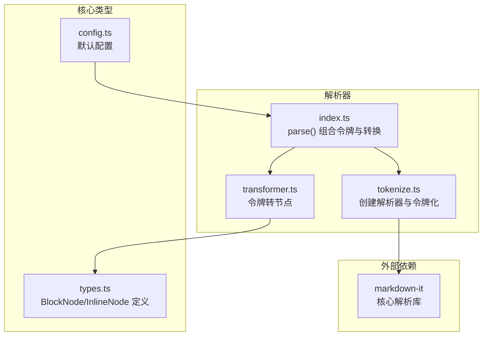
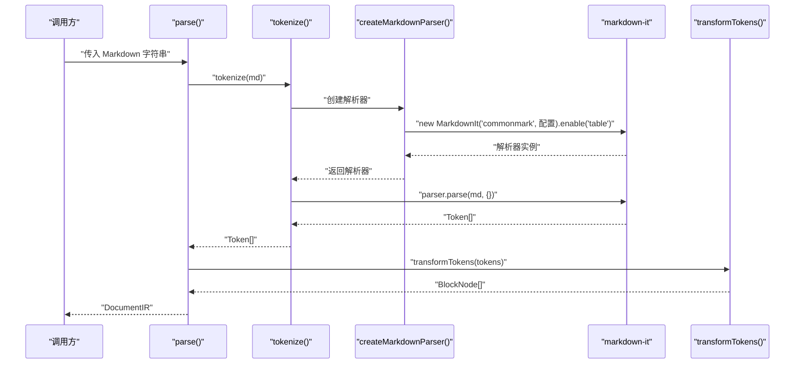
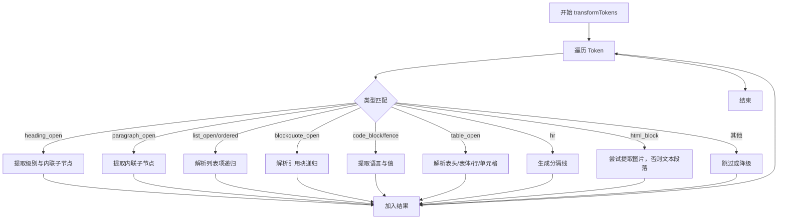
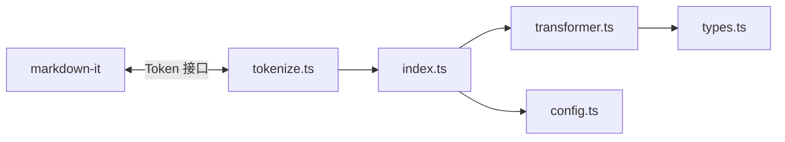

# tokenize() 令牌化函数

<cite>
**本文档引用的文件**
- [src/parser/tokenize.ts](file://src/parser/tokenize.ts)
- [src/parser/index.ts](file://src/parser/index.ts)
- [src/parser/transformer.ts](file://src/parser/transformer.ts)
- [src/core/types.ts](file://src/core/types.ts)
- [src/core/config.ts](file://src/core/config.ts)
- [tests/unit/parser/transformer.test.ts](file://tests/unit/parser/transformer.test.ts)
- [tests/e2e/full-pipeline.test.ts](file://tests/e2e/full-pipeline.test.ts)
- [tests/fixtures/markdown/sample.md](file://tests/fixtures/markdown/sample.md)
- [package.json](file://package.json)
</cite>

## 目录
1. [简介](#简介)
2. [项目结构](#项目结构)
3. [核心组件](#核心组件)
4. [架构总览](#架构总览)
5. [详细组件分析](#详细组件分析)
6. [依赖关系分析](#依赖关系分析)
7. [性能考虑](#性能考虑)
8. [故障排除指南](#故障排除指南)
9. [结论](#结论)
10. [附录](#附录)

## 简介
本文件聚焦于 `tokenize()` 令牌化函数，系统性阐述其如何基于 markdown-it 将 Markdown 文本解析为标记数组，并进一步在项目中被用于构建文档中间表示（IR）。我们将从初始化配置、插件启用策略、令牌类型到最终的节点转换进行逐层剖析，帮助开发者理解令牌结构与扩展点。

## 项目结构
与令牌化直接相关的模块主要位于 parser 目录，配合 core/types 定义的节点类型，以及 transformer 将令牌转为内部 IR 节点树。

**图表来源**
- [src/parser/tokenize.ts:1-16](file://src/parser/tokenize.ts#L1-L16)
- [src/parser/index.ts:1-24](file://src/parser/index.ts#L1-L24)
- [src/parser/transformer.ts:1-360](file://src/parser/transformer.ts#L1-L360)
- [src/core/types.ts:1-198](file://src/core/types.ts#L1-L198)
- [src/core/config.ts:1-91](file://src/core/config.ts#L1-L91)

**章节来源**
- [src/parser/tokenize.ts:1-16](file://src/parser/tokenize.ts#L1-L16)
- [src/parser/index.ts:1-24](file://src/parser/index.ts#L1-L24)
- [src/parser/transformer.ts:1-360](file://src/parser/transformer.ts#L1-L360)
- [src/core/types.ts:1-198](file://src/core/types.ts#L1-L198)
- [src/core/config.ts:1-91](file://src/core/config.ts#L1-L91)

## 核心组件
- tokenize(md: string): Token[]
  - 创建并返回 markdown-it 解析器实例，调用其 parse 方法，输出 Token 数组
- createMarkdownParser(): MarkdownIt
  - 使用 commonmark 规范，开启 html、linkify、typographer，并显式启用 table 插件
- parse(markdown: string, options?: ParseOptions): DocumentIR
  - 调用 tokenize 后，再通过 transformTokens 将 Token 转换为 BlockNode[]，并封装为 DocumentIR

**章节来源**
- [src/parser/tokenize.ts:4-15](file://src/parser/tokenize.ts#L4-L15)
- [src/parser/index.ts:11-21](file://src/parser/index.ts#L11-L21)

## 架构总览
下面的序列图展示了从 Markdown 文本到令牌数组再到内部节点树的关键流程：

**图表来源**
- [src/parser/index.ts:11-21](file://src/parser/index.ts#L11-L21)
- [src/parser/tokenize.ts:4-15](file://src/parser/tokenize.ts#L4-L15)
- [src/parser/transformer.ts:25-39](file://src/parser/transformer.ts#L25-L39)

## 详细组件分析

### 初始化与配置：createMarkdownParser()
- 规范选择：commonmark
- 关键选项：
  - html: true → 允许原生 HTML 块/内联
  - linkify: true → 自动识别 URL 并生成链接
  - typographer: true → 智能引号、破折号等排版优化
- 插件启用：显式启用 table，使表格语法生效

这些配置直接影响令牌生成的内容与数量，例如启用了 linkify 时，URL 会被拆分为 link_open/link_close 及其内联子令牌；启用 table 会生成 table_open/table_close、thead_open/tbody_open 等成对令牌。

**章节来源**
- [src/parser/tokenize.ts:4-10](file://src/parser/tokenize.ts#L4-L10)

### 令牌化流程：tokenize()
- 输入：Markdown 字符串
- 输出：Token[]（由 markdown-it 生成）
- 控制流：
  - 创建解析器
  - 调用 parser.parse(md, {}) 产出令牌数组
- 复杂度：通常与输入长度线性相关，受嵌套结构与插件规则影响

**章节来源**
- [src/parser/tokenize.ts:12-15](file://src/parser/tokenize.ts#L12-L15)

### 令牌到节点的转换：transformTokens()
transformTokens 遍历 Token 数组，按类型分派到不同的解析器：
- 标题：heading_open → 提取 tag 中的级别，读取 inline 子令牌作为标题内联内容
- 段落：paragraph_open → 同上
- 列表：bullet_list_open/ordered_list_open → 递归解析列表项，支持嵌套
- 引用块：blockquote_open → 递归解析块级内容
- 代码块：code_block/fence → 提取语言与内容
- 表格：table_open → 解析 thead/tbody、tr、th/td，生成行列节点
- 分隔线：hr → 转为 thematicBreak
- 内联 HTML：html_block → 尝试提取图片，否则作为纯文本段落
- 其他：默认跳过或降级为段落

**图表来源**
- [src/parser/transformer.ts:25-122](file://src/parser/transformer.ts#L25-L122)
- [src/parser/transformer.ts:124-180](file://src/parser/transformer.ts#L124-L180)
- [src/parser/transformer.ts:182-236](file://src/parser/transformer.ts#L182-L236)
- [src/parser/transformer.ts:238-332](file://src/parser/transformer.ts#L238-L332)

**章节来源**
- [src/parser/transformer.ts:25-332](file://src/parser/transformer.ts#L25-L332)

### 令牌类型与节点映射
以下为常见令牌类型与其对应节点类型的映射关系（基于实现）：
- heading_open → heading（含 level 与 children）
- paragraph_open → paragraph（含 children）
- bullet_list_open/ordered_list_open → list（ordered/start/children）
- list_item_open → listItem（含 children）
- blockquote_open → blockquote（含 children）
- code_block/fence → codeBlock（含 language/value）
- table_open → table（含 children: TableRowNode[]）
- tr_open → tableRow（含 children: TableCellNode[]）
- th_open/td_open → tableCell（header 与 paragraph 子节点）
- hr → thematicBreak
- inline/html_block → paragraph 或 image（当 html_block 包含图片）

注意：具体属性与类型定义见核心类型文件。

**章节来源**
- [src/parser/transformer.ts:41-122](file://src/parser/transformer.ts#L41-L122)
- [src/parser/transformer.ts:124-236](file://src/parser/transformer.ts#L124-L236)
- [src/core/types.ts:14-89](file://src/core/types.ts#L14-L89)

### 令牌结构字段与数据类型
- Token 接口关键字段（来自 @types/markdown-it）：
  - type: 令牌类型字符串（如 "heading_open"、"text" 等）
  - tag: 标签名（如 "h1"、"h2" 等）
  - attrs: 属性数组（如链接的 href、图片的 src/alt 等）
  - content: 文本内容（如 code_block 的代码）
  - info: 语言信息（如 fence 的语言标签）
  - children: 子令牌数组（如 inline 令牌包含内联子令牌）
- 在转换阶段，常用属性通过 attrGet('key') 访问，如链接 href、图片 src/alt 等。

**章节来源**
- [src/parser/transformer.ts:272-282](file://src/parser/transformer.ts#L272-L282)
- [src/parser/transformer.ts:284-293](file://src/parser/transformer.ts#L284-L293)

### 具体示例：令牌化前后对比
以下示例展示典型 Markdown 片段经 tokenize() 与 transformTokens() 后的结构变化（以路径代替代码内容）：
- 示例 1：标题与内联样式
  - 输入片段：`# Hello` 与 `**粗体**`、`*斜体*`
  - 令牌化：产生 heading_open/heading_close、strong_open/em_open 等
  - 转换后：生成 heading 与 paragraph（children 包含 bold/italic/text）
  - 参考测试：[tests/unit/parser/transformer.test.ts:6-33](file://tests/unit/parser/transformer.test.ts#L6-L33)
- 示例 2：列表与嵌套
  - 输入片段：无序/有序列表及嵌套项
  - 令牌化：list_open/list_close、list_item_open/list_item_close
  - 转换后：list/listItem 嵌套结构
  - 参考测试：[tests/unit/parser/transformer.test.ts:35-56](file://tests/unit/parser/transformer.test.ts#L35-L56)
- 示例 3：代码块
  - 输入片段：带语言的围栏代码块
  - 令牌化：fence
  - 转换后：codeBlock（language/value）
  - 参考测试：[tests/unit/parser/transformer.test.ts:58-67](file://tests/unit/parser/transformer.test.ts#L58-L67)
- 示例 4：表格
  - 输入片段：带表头与数据行的表格
  - 令牌化：table_open/thead_open/tbody_open/tr_open/th_open/td_open 等
  - 转换后：table/tableRow/tableCell
  - 参考测试：[tests/unit/parser/transformer.test.ts:79-88](file://tests/unit/parser/transformer.test.ts#L79-L88)
- 示例 5：复杂文档
  - 完整样例文档：[tests/fixtures/markdown/sample.md:1-51](file://tests/fixtures/markdown/sample.md#L1-L51)
  - 端到端测试：[tests/e2e/full-pipeline.test.ts:36-50](file://tests/e2e/full-pipeline.test.ts#L36-L50)

**章节来源**
- [tests/unit/parser/transformer.test.ts:6-88](file://tests/unit/parser/transformer.test.ts#L6-L88)
- [tests/e2e/full-pipeline.test.ts:36-50](file://tests/e2e/full-pipeline.test.ts#L36-L50)
- [tests/fixtures/markdown/sample.md:1-51](file://tests/fixtures/markdown/sample.md#L1-L51)

### 扩展令牌化功能的建议
- 新增插件：可在 createMarkdownParser() 中启用更多 markdown-it 插件（如 footnote、task_lists 等），并在 transformer.ts 中添加对应的令牌类型分支
- 自定义规则：通过 markdown-it 的规则系统扩展语法，但需同步更新令牌类型与节点映射
- 性能优化：对于超长文档，可考虑分段解析与缓存中间结果

**章节来源**
- [src/parser/tokenize.ts:4-10](file://src/parser/tokenize.ts#L4-L10)
- [src/parser/transformer.ts:25-122](file://src/parser/transformer.ts#L25-L122)

## 依赖关系分析
- 外部依赖：markdown-it（版本要求见 package.json）
- 内部依赖：core/types（定义 BlockNode/InlineNode）、core/config（默认配置）
- 模块耦合：tokenize.ts 与 transformer.ts 通过 Token 接口耦合；parse() 串联 tokenize 与 transformTokens

**图表来源**
- [package.json:27-37](file://package.json#L27-L37)
- [src/parser/tokenize.ts:1-2](file://src/parser/tokenize.ts#L1-L2)
- [src/parser/index.ts:1-4](file://src/parser/index.ts#L1-L4)
- [src/parser/transformer.ts:1](file://src/parser/transformer.ts#L1)
- [src/core/types.ts:1-23](file://src/core/types.ts#L1-L23)
- [src/core/config.ts:1-2](file://src/core/config.ts#L1-L2)

**章节来源**
- [package.json:27-37](file://package.json#L27-L37)
- [src/parser/tokenize.ts:1-2](file://src/parser/tokenize.ts#L1-L2)
- [src/parser/index.ts:1-4](file://src/parser/index.ts#L1-L4)
- [src/parser/transformer.ts:1](file://src/parser/transformer.ts#L1)
- [src/core/types.ts:1-23](file://src/core/types.ts#L1-L23)
- [src/core/config.ts:1-2](file://src/core/config.ts#L1-L2)

## 性能考虑
- 令牌生成复杂度：与输入长度近似线性，但受嵌套层级与插件规则影响
- 内存占用：Token[] 与中间节点树在大文档场景下可能较大，建议分段处理或延迟渲染
- 链接识别：linkify 会增加额外的令牌与处理开销，可根据需求调整

[本节为通用性能讨论，不涉及特定文件分析]

## 故障排除指南
- 未识别表格：确认已启用 table 插件（已在 createMarkdownParser 中启用）
- 链接未自动识别：检查 linkify 是否为 true
- 引号/破折号异常：typographer 开启时会替换为智能字符，如需关闭可设为 false
- HTML 块中的图片未识别：transformer 对 html_block 有专门处理，确保图片标签格式正确

**章节来源**
- [src/parser/tokenize.ts:4-10](file://src/parser/tokenize.ts#L4-L10)
- [src/parser/transformer.ts:102-117](file://src/parser/transformer.ts#L102-L117)

## 结论
tokenize() 通过标准化的 markdown-it 初始化配置，稳定地将 Markdown 文本转换为结构化 Token 数组。结合 transformTokens() 的类型分派逻辑，项目实现了从令牌到内部节点树的完整映射，覆盖标题、段落、列表、表格、代码块、引用块等多种元素。开发者可在此基础上扩展新语法与插件，同时关注性能与可维护性。

[本节为总结性内容，不涉及特定文件分析]

## 附录

### API 定义概览
- tokenize(md: string): Token[]
  - 输入：Markdown 字符串
  - 输出：Token 数组
  - 参考：[src/parser/tokenize.ts:12-15](file://src/parser/tokenize.ts#L12-L15)
- parse(markdown: string, options?: ParseOptions): DocumentIR
  - 输入：Markdown 字符串与可选元数据/配置
  - 输出：DocumentIR（包含 type、meta、config、children）
  - 参考：[src/parser/index.ts:11-21](file://src/parser/index.ts#L11-L21)

**章节来源**
- [src/parser/tokenize.ts:12-15](file://src/parser/tokenize.ts#L12-L15)
- [src/parser/index.ts:11-21](file://src/parser/index.ts#L11-L21)