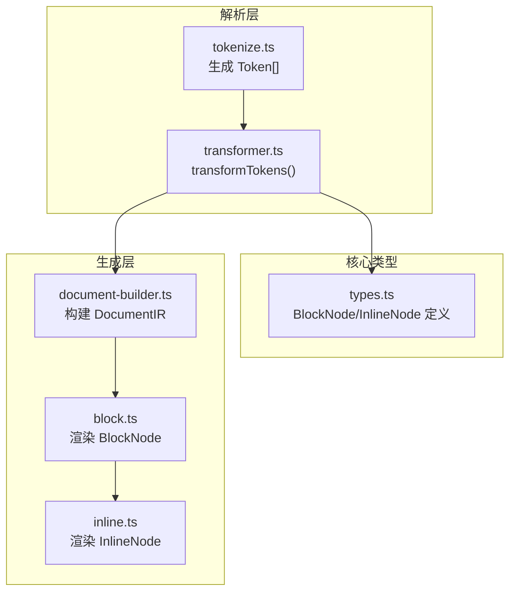
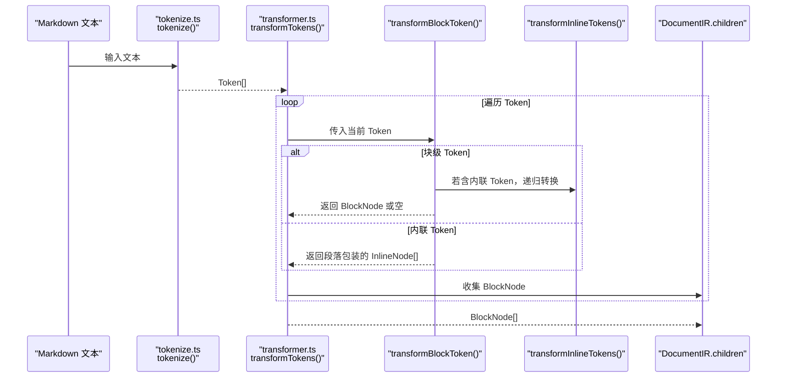
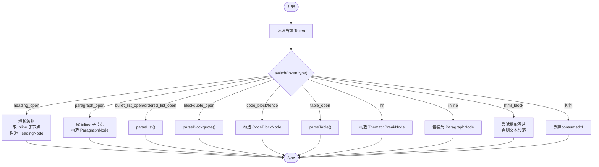
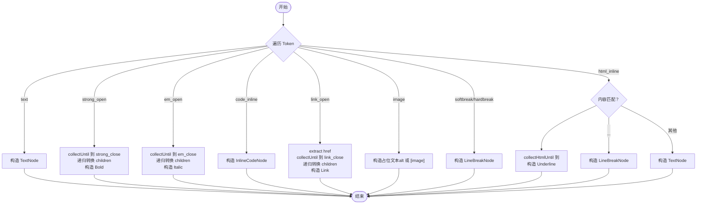
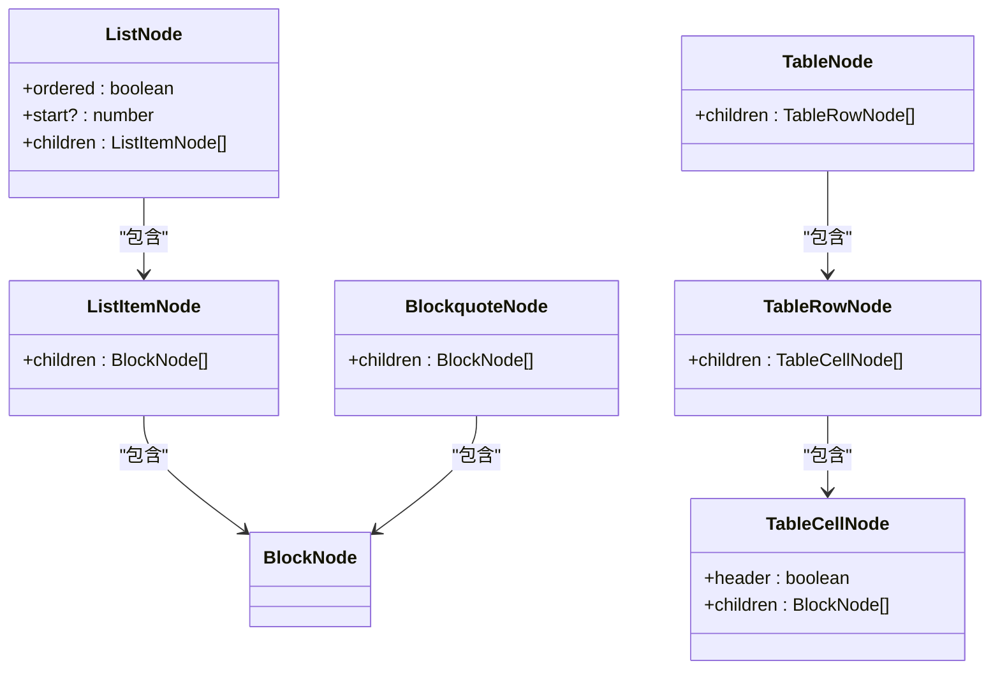

# transformTokens() 转换器

<cite>
**本文引用的文件**
- [transformer.ts](file://src/parser/transformer.ts)
- [types.ts](file://src/core/types.ts)
- [tokenize.ts](file://src/parser/tokenize.ts)
- [block.ts](file://src/generator/renderers/block.ts)
- [inline.ts](file://src/generator/renderers/inline.ts)
- [document-builder.ts](file://src/generator/document-builder.ts)
- [config.ts](file://src/core/config.ts)
- [errors.ts](file://src/core/errors.ts)
- [transformer.test.ts](file://tests/unit/parser/transformer.test.ts)
</cite>

## 目录
1. [简介](#简介)
2. [项目结构](#项目结构)
3. [核心组件](#核心组件)
4. [架构总览](#架构总览)
5. [详细组件分析](#详细组件分析)
6. [依赖关系分析](#依赖关系分析)
7. [性能考量](#性能考量)
8. [故障排查指南](#故障排查指南)
9. [结论](#结论)
10. [附录](#附录)

## 简介
本文件围绕 `transformTokens()` 转换器函数展开，系统性阐述其如何将 markdown-it 生成的标记数组（Token[]）转换为内部节点结构 DocumentIR 的过程。文档重点覆盖：
- BlockToken 与 InlineToken 的区别及处理策略
- 节点类型系统：HeadingNode、ParagraphNode、ListNode、TableNode、CodeBlockNode 等的结构与属性
- 令牌到节点的转换规则与嵌套结构处理
- 数据验证与类型检查机制
- 错误恢复与扩展建议（新增节点类型与自定义转换逻辑）

## 项目结构
该功能位于解析层与生成层之间，负责将解析阶段产出的 Token 流转换为中间表示（DocumentIR），供渲染器使用。

图表来源
- [tokenize.ts:12-15](file://src/parser/tokenize.ts#L12-L15)
- [transformer.ts:25-39](file://src/parser/transformer.ts#L25-L39)
- [types.ts:7-13](file://src/core/types.ts#L7-L13)
- [document-builder.ts:17-106](file://src/generator/document-builder.ts#L17-L106)
- [block.ts:28-58](file://src/generator/renderers/block.ts#L28-L58)
- [inline.ts:12-109](file://src/generator/renderers/inline.ts#L12-L109)

章节来源
- [tokenize.ts:1-16](file://src/parser/tokenize.ts#L1-L16)
- [transformer.ts:1-360](file://src/parser/transformer.ts#L1-L360)
- [types.ts:1-198](file://src/core/types.ts#L1-L198)
- [document-builder.ts:1-112](file://src/generator/document-builder.ts#L1-L112)
- [block.ts:1-266](file://src/generator/renderers/block.ts#L1-L266)
- [inline.ts:1-110](file://src/generator/renderers/inline.ts#L1-L110)

## 核心组件
- transformTokens(tokens: Token[]): 将 Token[] 转换为 BlockNode[]
- transformBlockToken(token, tokens, index): 处理单个 BlockToken 并返回消费数量
- transformInlineTokens(tokens: Token[]): 将 Token[] 转换为 InlineNode[]
- parseList、parseListItem、parseBlockquote、parseTable、parseTableRow：处理复合块级结构
- collectUntil、collectHtmlUntil：辅助收集闭合前的子 Token

章节来源
- [transformer.ts:25-39](file://src/parser/transformer.ts#L25-L39)
- [transformer.ts:41-122](file://src/parser/transformer.ts#L41-L122)
- [transformer.ts:238-332](file://src/parser/transformer.ts#L238-L332)
- [transformer.ts:124-144](file://src/parser/transformer.ts#L124-L144)
- [transformer.ts:146-162](file://src/parser/transformer.ts#L146-L162)
- [transformer.ts:164-180](file://src/parser/transformer.ts#L164-L180)
- [transformer.ts:182-236](file://src/parser/transformer.ts#L182-L236)
- [transformer.ts:210-235](file://src/parser/transformer.ts#L210-L235)
- [transformer.ts:334-359](file://src/parser/transformer.ts#L334-L359)

## 架构总览
转换流程从 markdown-it 解析得到的 Token[] 开始，通过 transformTokens 驱动 transformBlockToken 对每个 Token 进行识别与转换；对于包含内联内容的块级元素，再调用 transformInlineTokens 递归转换内联 Token。最终形成 BlockNode[]，作为 DocumentIR 的 children。

图表来源
- [tokenize.ts:12-15](file://src/parser/tokenize.ts#L12-L15)
- [transformer.ts:25-39](file://src/parser/transformer.ts#L25-L39)
- [transformer.ts:41-122](file://src/parser/transformer.ts#L41-L122)
- [transformer.ts:238-332](file://src/parser/transformer.ts#L238-L332)

## 详细组件分析

### transformTokens() 与 transformBlockToken()
- transformTokens 主循环遍历 Token，调用 transformBlockToken 识别并转换当前 Token，累计 consumed 数量以避免重复处理。
- transformBlockToken 使用 switch(token.type) 分派到具体处理函数或直接构造节点：
  - 标题：解析 tag 中的级别，取 inline 子节点进行内联转换
  - 段落：同上，但不带级别
  - 列表：区分有序/无序，调用 parseList
  - 引用块：调用 parseBlockquote
  - 代码块/围栏：直接构造 CodeBlockNode
  - 表格：调用 parseTable
  - 水平线：构造 ThematicBreakNode
  - 纯内联：包装为段落
  - HTML 块：尝试提取图片，否则作为纯文本段落
  - 其他：默认丢弃（返回 consumed: 1）

图表来源
- [transformer.ts:25-39](file://src/parser/transformer.ts#L25-L39)
- [transformer.ts:41-122](file://src/parser/transformer.ts#L41-L122)

章节来源
- [transformer.ts:25-39](file://src/parser/transformer.ts#L25-L39)
- [transformer.ts:41-122](file://src/parser/transformer.ts#L41-L122)

### 内联转换 transformInlineTokens()
- 针对 Token[].type 进行分支：
  - text：构造 TextNode
  - strong_open/em_open：收集至对应闭合 Token，递归转换后构造 Bold/Italic
  - code_inline：构造 InlineCodeNode
  - link_open：提取 href，收集至 link_close，递归转换后构造 Link
  - image：作为占位文本（alt 或默认提示），跳过实际图片渲染（由后续渲染器处理）
  - softbreak/hardbreak：构造 LineBreakNode
  - html_inline：
    - <u>：构造 Underline
    -  / / ：构造 LineBreakNode
    - 其他：作为文本
  - s_open：按普通文本处理（未实现删除线样式）
- 使用 collectUntil/collectHtmlUntil 辅助定位闭合 Token，确保正确嵌套。

图表来源
- [transformer.ts:238-332](file://src/parser/transformer.ts#L238-L332)
- [transformer.ts:334-359](file://src/parser/transformer.ts#L334-L359)

章节来源
- [transformer.ts:238-332](file://src/parser/transformer.ts#L238-L332)
- [transformer.ts:334-359](file://src/parser/transformer.ts#L334-L359)

### 复合结构解析
- parseList：识别有序/无序列表，支持 start 属性；逐项调用 parseListItem 收集 ListItemNode。
- parseListItem：在列表项内再次调用 transformBlockToken，允许嵌套块级内容（如段落、子列表等）。
- parseBlockquote：在引用块内逐个转换子块级节点。
- parseTable/parseTableRow：跳过 thead/tbody 标记，仅处理 tr_open/close；单元格内将内联 Token 包装为段落。

图表来源
- [transformer.ts:124-144](file://src/parser/transformer.ts#L124-L144)
- [transformer.ts:146-162](file://src/parser/transformer.ts#L146-L162)
- [transformer.ts:164-180](file://src/parser/transformer.ts#L164-L180)
- [transformer.ts:182-236](file://src/parser/transformer.ts#L182-L236)
- [transformer.ts:210-235](file://src/parser/transformer.ts#L210-L235)

章节来源
- [transformer.ts:124-144](file://src/parser/transformer.ts#L124-L144)
- [transformer.ts:146-162](file://src/parser/transformer.ts#L146-L162)
- [transformer.ts:164-180](file://src/parser/transformer.ts#L164-L180)
- [transformer.ts:182-236](file://src/parser/transformer.ts#L182-L236)
- [transformer.ts:210-235](file://src/parser/transformer.ts#L210-L235)

### 节点类型系统与属性
- BlockNode 类型族：HeadingNode、ParagraphNode、ListNode、ListItemNode、BlockquoteNode、CodeBlockNode、TableNode、TableRowNode、TableCellNode、ImageNode、ThematicBreakNode
- InlineNode 类型族：TextNode、BoldNode、ItalicNode、UnderlineNode、InlineCodeNode、LinkNode、LineBreakNode
- DocumentIR：包含元信息、配置与 BlockNode[]

```mermaid
classDiagram
class DocumentIR {
+type : "document"
+meta : DocumentMeta
+config : ResolvedConfig
+children : BlockNode[]
}
class BlockNode
class InlineNode
class HeadingNode {
+type : "heading"
+level : 1|2|3|4|5|6
+children : InlineNode[]
}
class ParagraphNode {
+type : "paragraph"
+children : InlineNode[]
}
class ListNode {
+type : "list"
+ordered : boolean
+start? : number
+children : ListItemNode[]
}
class BlockquoteNode {
+type : "blockquote"
+children : BlockNode[]
}
class CodeBlockNode {
+type : "codeBlock"
+language? : string
+value : string
}
class TableNode {
+type : "table"
+children : TableRowNode[]
}
class TableRowNode {
+type : "tableRow"
+children : TableCellNode[]
}
class TableCellNode {
+type : "tableCell"
+header : boolean
+children : BlockNode[]
}
class ImageNode {
+type : "image"
+src : string
+alt? : string
+width? : number
+height? : number
+align? : "left"|"center"|"right"
}
class ThematicBreakNode {
+type : "thematicBreak"
}
class TextNode {
+type : "text"
+value : string
}
class BoldNode {
+type : "bold"
+children : InlineNode[]
}
class ItalicNode {
+type : "italic"
+children : InlineNode[]
}
class UnderlineNode {
+type : "underline"
+children : InlineNode[]
}
class InlineCodeNode {
+type : "inlineCode"
+value : string
}
class LinkNode {
+type : "link"
+href : string
+children : InlineNode[]
}
class LineBreakNode {
+type : "lineBreak"
}
BlockNode <|.. HeadingNode
BlockNode <|.. ParagraphNode
BlockNode <|.. ListNode
BlockNode <|.. BlockquoteNode
BlockNode <|.. CodeBlockNode
BlockNode <|.. TableNode
BlockNode <|.. ImageNode
BlockNode <|.. ThematicBreakNode
InlineNode <|.. TextNode
InlineNode <|.. BoldNode
InlineNode <|.. ItalicNode
InlineNode <|.. UnderlineNode
InlineNode <|.. InlineCodeNode
InlineNode <|.. LinkNode
InlineNode <|.. LineBreakNode
```

图表来源
- [types.ts:7-13](file://src/core/types.ts#L7-L13)
- [types.ts:14-89](file://src/core/types.ts#L14-L89)
- [types.ts:91-134](file://src/core/types.ts#L91-L134)

章节来源
- [types.ts:7-13](file://src/core/types.ts#L7-L13)
- [types.ts:14-89](file://src/core/types.ts#L14-L89)
- [types.ts:91-134](file://src/core/types.ts#L91-L134)

### 令牌到节点的转换示例（路径）
以下示例展示典型转换场景的代码位置（请参考相应文件行号）：
- 标题转换：[transformer.ts:47-51](file://src/parser/transformer.ts#L47-L51)
- 段落转换：[transformer.ts:54-57](file://src/parser/transformer.ts#L54-L57)
- 无序列表转换：[transformer.ts:60-63](file://src/parser/transformer.ts#L60-L63)、[transformer.ts:124-144](file://src/parser/transformer.ts#L124-L144)
- 有序列表转换：[transformer.ts:65-67](file://src/parser/transformer.ts#L65-L67)、[transformer.ts:126](file://src/parser/transformer.ts#L126)
- 引用块转换：[transformer.ts:70-72](file://src/parser/transformer.ts#L70-L72)、[transformer.ts:164-180](file://src/parser/transformer.ts#L164-L180)
- 代码块转换：[transformer.ts:75-84](file://src/parser/transformer.ts#L75-L84)
- 表格转换：[transformer.ts:87-89](file://src/parser/transformer.ts#L87-L89)、[transformer.ts:182-236](file://src/parser/transformer.ts#L182-L236)
- 水平线转换：[transformer.ts:92-93](file://src/parser/transformer.ts#L92-L93)
- 纯内联包装：[transformer.ts:96-99](file://src/parser/transformer.ts#L96-L99)
- HTML 块图片提取：[transformer.ts:102-116](file://src/parser/transformer.ts#L102-L116)
- 内联文本：[transformer.ts:246-248](file://src/parser/transformer.ts#L246-L248)
- 内联粗体：[transformer.ts:252-256](file://src/parser/transformer.ts#L252-L256)
- 内联斜体：[transformer.ts:259-263](file://src/parser/transformer.ts#L259-L263)
- 内联代码：[transformer.ts:266-268](file://src/parser/transformer.ts#L266-L268)
- 内联链接：[transformer.ts:272-281](file://src/parser/transformer.ts#L272-L281)
- 内联图片占位：[transformer.ts:284-292](file://src/parser/transformer.ts#L284-L292)
- 内联换行：[transformer.ts:295-299](file://src/parser/transformer.ts#L295-L299)
- 内联下划线：[transformer.ts:302-314](file://src/parser/transformer.ts#L302-L314)
- 内联删除线：[transformer.ts:317-323](file://src/parser/transformer.ts#L317-L323)

章节来源
- [transformer.ts:47-51](file://src/parser/transformer.ts#L47-L51)
- [transformer.ts:54-57](file://src/parser/transformer.ts#L54-L57)
- [transformer.ts:60-63](file://src/parser/transformer.ts#L60-L63)
- [transformer.ts:65-67](file://src/parser/transformer.ts#L65-L67)
- [transformer.ts:70-72](file://src/parser/transformer.ts#L70-L72)
- [transformer.ts:75-84](file://src/parser/transformer.ts#L75-L84)
- [transformer.ts:87-89](file://src/parser/transformer.ts#L87-L89)
- [transformer.ts:92-93](file://src/parser/transformer.ts#L92-L93)
- [transformer.ts:96-99](file://src/parser/transformer.ts#L96-L99)
- [transformer.ts:102-116](file://src/parser/transformer.ts#L102-L116)
- [transformer.ts:124-144](file://src/parser/transformer.ts#L124-L144)
- [transformer.ts:164-180](file://src/parser/transformer.ts#L164-L180)
- [transformer.ts:182-236](file://src/parser/transformer.ts#L182-L236)
- [transformer.ts:238-332](file://src/parser/transformer.ts#L238-L332)
- [transformer.ts:317-323](file://src/parser/transformer.ts#L317-L323)

### 数据验证与类型检查
- 配置验证：使用 zod Schema 对配置进行编译期与运行时校验，确保字段类型与取值范围合法。
- 节点类型：通过 TypeScript 接口约束节点结构，保证转换后节点符合 DocumentIR 规范。
- 错误类型：提供 MarkdownParseError、DocxGenerationError、ImageProcessingError、ConfigValidationError，便于定位问题来源。

章节来源
- [config.ts:54-64](file://src/core/config.ts#L54-L64)
- [config.ts:68-81](file://src/core/config.ts#L68-L81)
- [errors.ts:1-28](file://src/core/errors.ts#L1-L28)
- [types.ts:7-13](file://src/core/types.ts#L7-L13)

### 错误恢复机制
- 默认丢弃无法识别的 BlockToken：返回 consumed: 1，继续处理下一个 Token，避免中断转换流程。
- HTML 块降级：无法提取图片时，将内容作为纯文本段落处理。
- 内联删除线：当前按普通文本处理，保留内容但不应用删除线样式。

章节来源
- [transformer.ts:119-121](file://src/parser/transformer.ts#L119-L121)
- [transformer.ts:114-116](file://src/parser/transformer.ts#L114-L116)
- [transformer.ts:317-323](file://src/parser/transformer.ts#L317-L323)

### 扩展节点类型与自定义转换逻辑
- 新增块级节点：在 BlockNode 类型族中添加新接口，并在 transformBlockToken 的 switch 中增加对应分支；如需内联内容，调用 transformInlineTokens。
- 新增内联节点：在 InlineNode 类型族中添加新接口，在 transformInlineTokens 中增加分支；注意使用 collectUntil/collectHtmlUntil 正确收集子 Token。
- 自定义渲染：在渲染器中为新节点类型实现 renderBlock/renderInline 分支，确保输出符合目标格式（如 docx）。
- 配置扩展：在 ResolvedConfig 中添加相关字段，并在 createConfig/mergeConfig 中提供默认值与校验。

章节来源
- [types.ts:14-89](file://src/core/types.ts#L14-L89)
- [types.ts:91-134](file://src/core/types.ts#L91-L134)
- [transformer.ts:46-122](file://src/parser/transformer.ts#L46-L122)
- [transformer.ts:238-332](file://src/parser/transformer.ts#L238-L332)
- [block.ts:28-58](file://src/generator/renderers/block.ts#L28-L58)
- [inline.ts:12-109](file://src/generator/renderers/inline.ts#L12-L109)
- [config.ts:68-81](file://src/core/config.ts#L68-L81)

## 依赖关系分析
- 输入：markdown-it Token[]（由 tokenize.ts 生成）
- 处理：transformer.ts 的 transformTokens/transformBlockToken/transformInlineTokens
- 输出：BlockNode[]（用于构建 DocumentIR）
- 渲染：block.ts/inline.ts 将节点渲染为 docx 结构

图表来源
- [tokenize.ts:12-15](file://src/parser/tokenize.ts#L12-L15)
- [transformer.ts:25-39](file://src/parser/transformer.ts#L25-L39)
- [block.ts:28-58](file://src/generator/renderers/block.ts#L28-L58)
- [inline.ts:12-109](file://src/generator/renderers/inline.ts#L12-L109)

章节来源
- [tokenize.ts:12-15](file://src/parser/tokenize.ts#L12-L15)
- [transformer.ts:25-39](file://src/parser/transformer.ts#L25-L39)
- [block.ts:28-58](file://src/generator/renderers/block.ts#L28-L58)
- [inline.ts:12-109](file://src/generator/renderers/inline.ts#L12-L109)

## 性能考量
- 时间复杂度：整体 O(N)，其中 N 为 Token 数量；嵌套结构通过递归处理，但每个 Token 最多被访问一次。
- 空间复杂度：O(N) 用于存储节点树；内联 Token 收集使用临时数组，长度不超过当前 Token 片段。
- 优化建议：
  - 避免不必要的字符串操作（如 HTML 块正则匹配可考虑缓存常用模式）
  - 在 parseList/parseTable 中尽早短路（遇到闭合 Token 即停止）
  - 合理复用对象（如 InlineNode[] 的构建）

## 故障排查指南
- 标题未生效：检查 Token 是否为 heading_open/heading_close 组合，确认级别解析是否正确。
- 列表嵌套异常：确认 parseList/parseListItem 的 consumed 计数与索引推进逻辑。
- 表格渲染为空：检查 thead/tbody 标记是否被正确跳过，tr_open/close 是否成对出现。
- 图片未显示：HTML 块图片提取失败时会回退为文本段落；确认 HTML 是否包含有效 src/alt。
- 删除线不显示：当前实现按普通文本处理，不会应用删除线样式。

章节来源
- [transformer.ts:47-51](file://src/parser/transformer.ts#L47-L51)
- [transformer.ts:124-144](file://src/parser/transformer.ts#L124-L144)
- [transformer.ts:146-162](file://src/parser/transformer.ts#L146-L162)
- [transformer.ts:182-236](file://src/parser/transformer.ts#L182-L236)
- [transformer.ts:102-116](file://src/parser/transformer.ts#L102-L116)
- [transformer.ts:317-323](file://src/parser/transformer.ts#L317-L323)

## 结论
transformTokens() 通过明确的分发与递归策略，将 markdown-it 的 Token 流稳定地转换为结构化的 BlockNode[]，并为后续渲染提供清晰的数据模型。其设计兼顾了可读性与扩展性，便于开发者按需新增节点类型与渲染逻辑。

## 附录
- 单元测试覆盖示例：标题、段落（含粗体/斜体）、无序/有序列表、代码块、引用块、表格等场景均在测试中验证。
- 导出入口：index.ts 提供 parse/generate/buildDocument 与类型导出，便于外部集成。

章节来源
- [transformer.test.ts:6-89](file://tests/unit/parser/transformer.test.ts#L6-L89)
- [index.ts:1-25](file://src/index.ts#L1-L25)