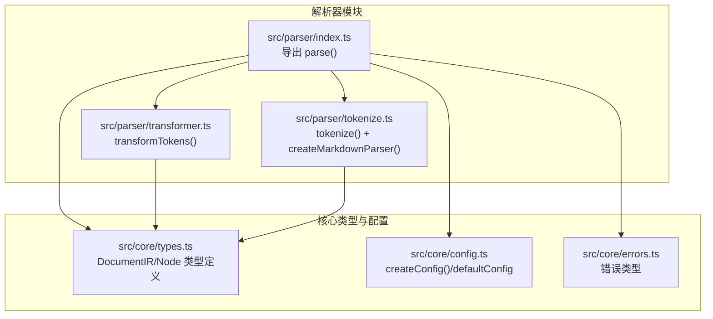
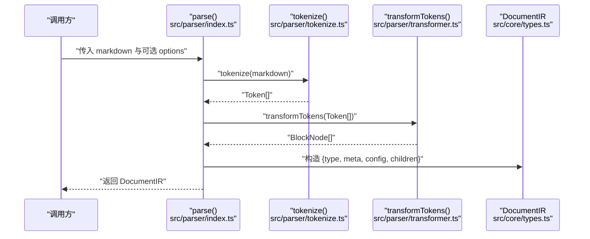
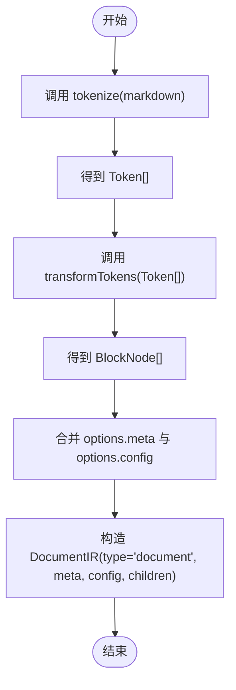
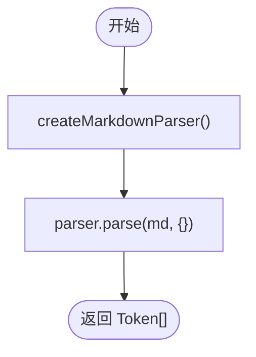
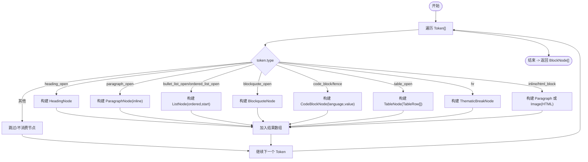
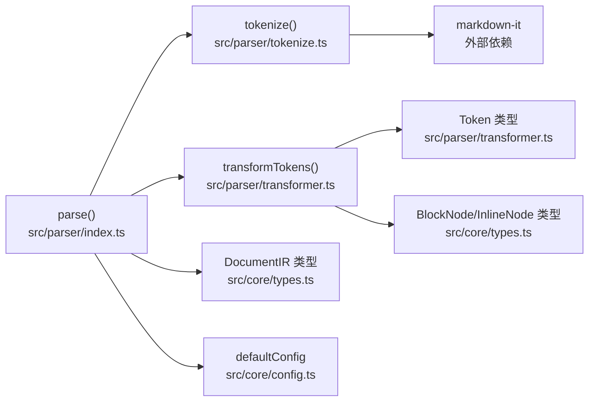

# 解析器模块

<cite>
**本文引用的文件**
- [src/parser/index.ts](file://src/parser/index.ts)
- [src/parser/tokenize.ts](file://src/parser/tokenize.ts)
- [src/parser/transformer.ts](file://src/parser/transformer.ts)
- [src/core/types.ts](file://src/core/types.ts)
- [src/core/config.ts](file://src/core/config.ts)
- [src/core/errors.ts](file://src/core/errors.ts)
- [tests/unit/parser/transformer.test.ts](file://tests/unit/parser/transformer.test.ts)
- [tests/e2e/full-pipeline.test.ts](file://tests/e2e/full-pipeline.test.ts)
- [tests/fixtures/markdown/sample.md](file://tests/fixtures/markdown/sample.md)
- [src/index.ts](file://src/index.ts)
</cite>

## 目录
1. [简介](#简介)
2. [项目结构](#项目结构)
3. [核心组件](#核心组件)
4. [架构总览](#架构总览)
5. [详细组件分析](#详细组件分析)
6. [依赖分析](#依赖分析)
7. [性能考虑](#性能考虑)
8. [故障排查指南](#故障排查指南)
9. [结论](#结论)
10. [附录](#附录)

## 简介
本文件面向 Markdown to Word 转换器的解析器模块，系统性阐述 parse() 函数的端到端工作流程：从输入 Markdown 文本，经由 tokenize() 使用 markdown-it 生成标记数组，再到 transformTokens() 将标记转换为内部节点结构 DocumentIR，最终形成可被后续生成器使用的中间表示。文档还详解了 ParseOptions 的配置项（meta 文档元数据与 config 配置参数）、DocumentIR 的结构与字段语义，并给出数据流图、序列图与流程图，帮助开发者快速理解解析原理并安全地扩展解析能力。

## 项目结构
解析器模块位于 src/parser 目录，核心文件包括：
- index.ts：导出 parse() 入口函数与工具函数
- tokenize.ts：封装 markdown-it，负责将 Markdown 文本解析为 Token 数组
- transformer.ts：将 Token 数组转换为 BlockNode/InlineNode 树，输出 DocumentIR.children

核心类型与默认配置位于 core 子目录：
- types.ts：定义 DocumentIR、BlockNode、InlineNode、DocumentMeta、ResolvedConfig 等类型
- config.ts：定义配置模式与默认值，提供 createConfig()/mergeConfig()/defaultConfig
- errors.ts：统一的错误类型，便于上层捕获与处理

图表来源
- [src/parser/index.ts:1-24](file://src/parser/index.ts#L1-L24)
- [src/parser/tokenize.ts:1-16](file://src/parser/tokenize.ts#L1-L16)
- [src/parser/transformer.ts:1-360](file://src/parser/transformer.ts#L1-L360)
- [src/core/types.ts:1-198](file://src/core/types.ts#L1-L198)
- [src/core/config.ts:1-91](file://src/core/config.ts#L1-L91)
- [src/core/errors.ts:1-28](file://src/core/errors.ts#L1-L28)

章节来源
- [src/parser/index.ts:1-24](file://src/parser/index.ts#L1-L24)
- [src/parser/tokenize.ts:1-16](file://src/parser/tokenize.ts#L1-L16)
- [src/parser/transformer.ts:1-360](file://src/parser/transformer.ts#L1-L360)
- [src/core/types.ts:1-198](file://src/core/types.ts#L1-L198)
- [src/core/config.ts:1-91](file://src/core/config.ts#L1-L91)
- [src/core/errors.ts:1-28](file://src/core/errors.ts#L1-L28)

## 核心组件
- parse(markdown, options?): 主入口函数，串联 tokenize 与 transformTokens，组装 DocumentIR
- tokenize(md): 使用 markdown-it 创建解析器，返回 Token[]
- transformTokens(tokens): 将 Token[] 转换为 BlockNode[]，作为 DocumentIR.children
- ParseOptions: 可选 meta 与 config，分别用于文档元信息与渲染配置
- DocumentIR: 中间表示根对象，包含 type、meta、config、children 四个字段

章节来源
- [src/parser/index.ts:6-21](file://src/parser/index.ts#L6-L21)
- [src/parser/tokenize.ts:12-15](file://src/parser/tokenize.ts#L12-L15)
- [src/parser/transformer.ts:25-39](file://src/parser/transformer.ts#L25-L39)
- [src/core/types.ts:1-12](file://src/core/types.ts#L1-L12)

## 架构总览
下面以序列图展示 parse() 的调用链路与数据流向：

图表来源
- [src/parser/index.ts:11-21](file://src/parser/index.ts#L11-L21)
- [src/parser/tokenize.ts:12-15](file://src/parser/tokenize.ts#L12-L15)
- [src/parser/transformer.ts:25-39](file://src/parser/transformer.ts#L25-L39)
- [src/core/types.ts:7-12](file://src/core/types.ts#L7-L12)

## 详细组件分析

### parse() 工作流程与数据流
- 输入：Markdown 字符串与可选 ParseOptions
- 处理：
  - 调用 tokenize() 生成 Token[]
  - 调用 transformTokens() 生成 BlockNode[]
  - 组装 DocumentIR：type 固定为 'document'；meta 默认空对象或使用 options.meta；config 默认 defaultConfig 或使用 options.config
- 输出：DocumentIR

图表来源
- [src/parser/index.ts:11-21](file://src/parser/index.ts#L11-L21)
- [src/parser/tokenize.ts:12-15](file://src/parser/tokenize.ts#L12-L15)
- [src/parser/transformer.ts:25-39](file://src/parser/transformer.ts#L25-L39)
- [src/core/types.ts:7-12](file://src/core/types.ts#L7-L12)
- [src/core/config.ts:90](file://src/core/config.ts#L90)

章节来源
- [src/parser/index.ts:11-21](file://src/parser/index.ts#L11-L21)

### tokenize() 令牌化实现
- 使用 markdown-it('commonmark', ...) 创建解析器，启用 html、linkify、typographer，并显式开启 table 扩展
- 调用 parser.parse(md, {}) 返回 Token[]，供 transformTokens 消费
- 该实现确保解析行为遵循 commonmark 规范，同时保留表格等扩展特性

图表来源
- [src/parser/tokenize.ts:4-15](file://src/parser/tokenize.ts#L4-L15)

章节来源
- [src/parser/tokenize.ts:4-15](file://src/parser/tokenize.ts#L4-L15)

### transformTokens() 转换逻辑
- 主循环遍历 Token[]，对每个 token 调用 transformBlockToken()，累积 BlockNode[]
- transformBlockToken() 根据 token.type 分派到具体块级节点构建器：
  - 标题：提取 tag 中的级别，结合 inline 子节点
  - 段落：直接消费 inline 子节点
  - 列表：区分有序/无序，递归解析列表项
  - 引用块：递归解析子块
  - 代码块：支持 fence 与 code_block，记录语言与内容
  - 表格：解析 thead/tbody 与 tr/td/th，转为表格树
  - 分隔线：thematicBreak
  - HTML 块：尝试抽取图片，否则作为纯文本段落
- 内联节点转换：transformInlineTokens() 将 Token[] 转为 InlineNode[]，支持 text、bold、italic、inlineCode、link、lineBreak、html_inline 等

图表来源
- [src/parser/transformer.ts:25-122](file://src/parser/transformer.ts#L25-L122)
- [src/parser/transformer.ts:124-180](file://src/parser/transformer.ts#L124-L180)
- [src/parser/transformer.ts:182-236](file://src/parser/transformer.ts#L182-L236)
- [src/parser/transformer.ts:238-332](file://src/parser/transformer.ts#L238-L332)

章节来源
- [src/parser/transformer.ts:25-332](file://src/parser/transformer.ts#L25-L332)

### ParseOptions 接口与配置项
- meta: DocumentMeta，包含 title、author、date 等文档元数据，默认空对象
- config: ResolvedConfig，渲染相关配置，默认使用 defaultConfig
- 作用：
  - meta 用于在生成阶段设置 Word 文档属性
  - config 控制字体、字号、间距、页边距、图片宽度、页尺寸与方向等

章节来源
- [src/parser/index.ts:6-9](file://src/parser/index.ts#L6-L9)
- [src/core/types.ts:1-5](file://src/core/types.ts#L1-L5)
- [src/core/types.ts:187-197](file://src/core/types.ts#L187-L197)
- [src/core/config.ts:90](file://src/core/config.ts#L90)

### DocumentIR 结构与字段语义
- type: 固定为 'document'
- meta: 文档元数据，来自 ParseOptions.meta 或默认空对象
- config: 渲染配置，来自 ParseOptions.config 或默认 defaultConfig
- children: BlockNode[]，由 transformTokens() 生成的块级节点树

章节来源
- [src/core/types.ts:7-12](file://src/core/types.ts#L7-L12)
- [src/parser/index.ts:15-20](file://src/parser/index.ts#L15-L20)

### 错误处理机制
- MarkdownParseError：解析阶段错误，携带可选 source
- DocxGenerationError：DOCX 生成阶段错误，携带可选 cause
- ImageProcessingError：图片处理错误，携带 src 与 cause
- ConfigValidationError：配置校验失败，携带 issues
- 建议：在 parse() 与 generate() 之间捕获上述异常，进行降级或提示

章节来源
- [src/core/errors.ts:1-27](file://src/core/errors.ts#L1-L27)

### 性能优化策略
- 单次解析：tokenize() 与 transformTokens() 均为 O(n) 线性扫描，整体复杂度 O(n)
- 无额外分配：在 transformTokens() 中复用索引推进，避免多余拷贝
- 配置缓存：defaultConfig 与 createConfig() 提前准备，减少重复校验开销
- 建议：对超长文档可考虑分段解析与增量生成，避免一次性占用过多内存

章节来源
- [src/parser/tokenize.ts:12-15](file://src/parser/tokenize.ts#L12-L15)
- [src/parser/transformer.ts:25-39](file://src/parser/transformer.ts#L25-L39)
- [src/core/config.ts:68-90](file://src/core/config.ts#L68-L90)

### 示例：解析流程与数据流转
- 单元测试示例：验证标题、段落（含粗体/斜体）、无序/有序列表、代码块、引用块、表格等节点的转换
- 端到端示例：从 Markdown 文本到 DocumentIR，再生成 DOCX Buffer，断言 Buffer 类型与 ZIP 文件头

章节来源
- [tests/unit/parser/transformer.test.ts:6-89](file://tests/unit/parser/transformer.test.ts#L6-L89)
- [tests/e2e/full-pipeline.test.ts:9-51](file://tests/e2e/full-pipeline.test.ts#L9-L51)
- [tests/fixtures/markdown/sample.md:1-51](file://tests/fixtures/markdown/sample.md#L1-L51)

## 依赖分析
- parse() 依赖 tokenize() 与 transformTokens()，并使用 DocumentIR/ResolvedConfig 类型
- tokenize() 依赖 markdown-it，启用 table 扩展
- transformTokens() 依赖 Token 类型与 BlockNode/InlineNode 类型
- config.ts 提供 defaultConfig，供 parse() 未传 config 时使用

图表来源
- [src/parser/index.ts:11-21](file://src/parser/index.ts#L11-L21)
- [src/parser/tokenize.ts:12-15](file://src/parser/tokenize.ts#L12-L15)
- [src/parser/transformer.ts:1-23](file://src/parser/transformer.ts#L1-L23)
- [src/core/types.ts:1-198](file://src/core/types.ts#L1-L198)
- [src/core/config.ts:90](file://src/core/config.ts#L90)

章节来源
- [src/parser/index.ts:1-24](file://src/parser/index.ts#L1-L24)
- [src/parser/tokenize.ts:1-16](file://src/parser/tokenize.ts#L1-L16)
- [src/parser/transformer.ts:1-360](file://src/parser/transformer.ts#L1-L360)
- [src/core/types.ts:1-198](file://src/core/types.ts#L1-L198)
- [src/core/config.ts:1-91](file://src/core/config.ts#L1-L91)

## 性能考虑
- 时间复杂度：tokenize 与 transformTokens 均为 O(n)，适合大文档
- 空间复杂度：生成的 Token[] 与节点树与输入规模线性相关
- 优化建议：
  - 对超长文档采用分块解析与流式生成
  - 缓存默认配置与常用解析器实例
  - 在 transformTokens 中避免不必要的字符串拼接与正则重复编译

## 故障排查指南
- 解析失败：检查 Markdown 语法是否符合 commonmark，确认是否启用了 table 扩展
- 转换异常：定位 transformTokens 中对应 token.type 的分支，确认 Token 结构与消费计数
- 配置错误：使用 createConfig()/mergeConfig() 校验 ResolvedConfig，捕获 ConfigValidationError
- 生成失败：捕获 DocxGenerationError，检查 DocumentIR 结构完整性
- 图片问题：捕获 ImageProcessingError，核对 src 与资源可达性

章节来源
- [src/core/errors.ts:1-27](file://src/core/errors.ts#L1-L27)
- [src/core/config.ts:68-90](file://src/core/config.ts#L68-L90)

## 结论
解析器模块通过 tokenize() 与 transformTokens() 将 Markdown 文本稳定地转换为结构化的 DocumentIR，为后续生成器提供清晰的中间表示。ParseOptions 的 meta 与 config 为文档元信息与渲染控制提供了灵活扩展点。借助明确的类型体系与错误模型，开发者可以安全地扩展解析能力（如新增节点类型）并保持系统的可维护性与可测试性。

## 附录
- 导出入口：src/index.ts 暴露 parse()、generate()、createConfig()、类型与错误类
- 示例文档：tests/fixtures/markdown/sample.md 提供丰富样例，便于验证解析效果

章节来源
- [src/index.ts:1-25](file://src/index.ts#L1-L25)
- [tests/fixtures/markdown/sample.md:1-51](file://tests/fixtures/markdown/sample.md#L1-L51)