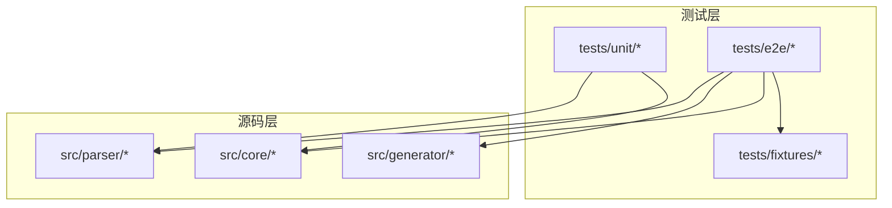
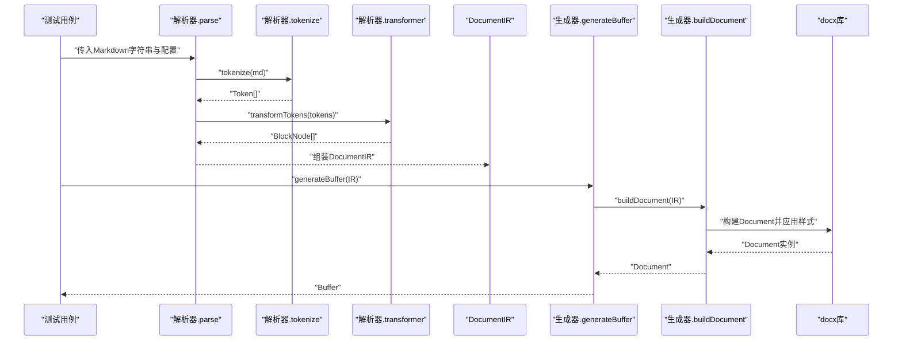
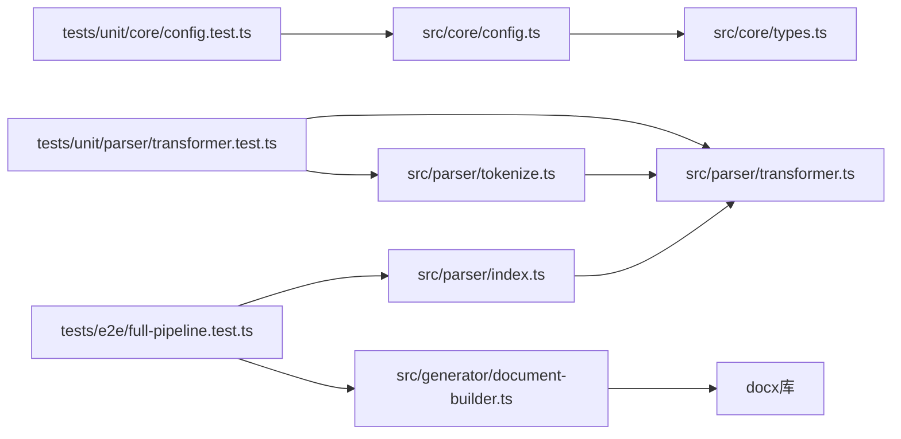

# 测试指南

<cite>
**本文引用的文件**
- [vitest.config.ts](file://vitest.config.ts)
- [package.json](file://package.json)
- [tests/unit/core/config.test.ts](file://tests/unit/core/config.test.ts)
- [tests/unit/parser/transformer.test.ts](file://tests/unit/parser/transformer.test.ts)
- [tests/e2e/full-pipeline.test.ts](file://tests/e2e/full-pipeline.test.ts)
- [tests/fixtures/markdown/sample.md](file://tests/fixtures/markdown/sample.md)
- [src/core/config.ts](file://src/core/config.ts)
- [src/core/types.ts](file://src/core/types.ts)
- [src/parser/index.ts](file://src/parser/index.ts)
- [src/parser/tokenize.ts](file://src/parser/tokenize.ts)
- [src/parser/transformer.ts](file://src/parser/transformer.ts)
- [src/generator/document-builder.ts](file://src/generator/document-builder.ts)
</cite>

## 目录
1. [简介](#简介)
2. [项目结构](#项目结构)
3. [核心组件](#核心组件)
4. [架构总览](#架构总览)
5. [详细组件分析](#详细组件分析)
6. [依赖关系分析](#依赖关系分析)
7. [性能考量](#性能考量)
8. [故障排查指南](#故障排查指南)
9. [结论](#结论)
10. [附录](#附录)

## 简介
本测试指南面向 Markdown to Word 转换器项目，系统化阐述测试策略与架构，覆盖单元测试、集成测试与端到端测试的组织方式；详解测试文件结构、命名约定、断言模式与最佳实践；并结合实际测试用例，演示如何测试解析器功能、配置验证与完整转换管道。同时说明测试环境配置（vitest.config.ts）、覆盖率设置建议与模拟对象使用方法，以及在持续集成中运行测试的策略。

## 项目结构
项目采用按“测试类型”分层的目录组织：tests/unit、tests/e2e，分别对应单元测试与端到端测试。核心源码位于 src 下，包含解析器、生成器与核心配置等模块。测试夹具（fixtures）位于 tests/fixtures，用于提供真实 Markdown 示例以驱动端到端测试。

图表来源
- [tests/unit/core/config.test.ts:1-32](file://tests/unit/core/config.test.ts#L1-L32)
- [tests/unit/parser/transformer.test.ts:1-90](file://tests/unit/parser/transformer.test.ts#L1-L90)
- [tests/e2e/full-pipeline.test.ts:1-52](file://tests/e2e/full-pipeline.test.ts#L1-L52)
- [src/parser/index.ts:1-24](file://src/parser/index.ts#L1-L24)
- [src/generator/document-builder.ts:1-112](file://src/generator/document-builder.ts#L1-L112)
- [src/core/config.ts:1-91](file://src/core/config.ts#L1-L91)

章节来源
- [package.json:11-17](file://package.json#L11-L17)
- [vitest.config.ts:1-9](file://vitest.config.ts#L1-L9)

## 核心组件
- 解析器（parser）
  - tokenize：基于 markdown-it 的词法分析，输出 Token 序列。
  - transformer：将 Token 序列转换为内部 IR（DocumentIR）的块级与行内节点树。
  - index：对外暴露 parse 接口，组合 tokenize 与 transform。
- 生成器（generator）
  - document-builder：根据 DocumentIR 构建 docx 文档并导出 Buffer。
- 核心配置（core/config）
  - 使用 Zod 定义配置 Schema，提供 createConfig、mergeConfig 与 defaultConfig。
  - 类型定义集中在 types.ts，确保 IR 结构与配置类型一致。

章节来源
- [src/parser/tokenize.ts:1-16](file://src/parser/tokenize.ts#L1-L16)
- [src/parser/transformer.ts:1-360](file://src/parser/transformer.ts#L1-L360)
- [src/parser/index.ts:1-24](file://src/parser/index.ts#L1-L24)
- [src/generator/document-builder.ts:1-112](file://src/generator/document-builder.ts#L1-L112)
- [src/core/config.ts:1-91](file://src/core/config.ts#L1-L91)
- [src/core/types.ts:1-198](file://src/core/types.ts#L1-L198)

## 架构总览
下图展示了从 Markdown 到最终 DOCX Buffer 的完整流程，以及测试覆盖点：

图表来源
- [src/parser/index.ts:11-21](file://src/parser/index.ts#L11-L21)
- [src/parser/tokenize.ts:12-15](file://src/parser/tokenize.ts#L12-L15)
- [src/parser/transformer.ts:25-39](file://src/parser/transformer.ts#L25-L39)
- [src/generator/document-builder.ts:17-111](file://src/generator/document-builder.ts#L17-L111)

## 详细组件分析

### 单元测试：配置模块
- 测试目标
  - 默认配置值校验
  - 自定义字体合并行为
  - 无效参数（如错误的页面尺寸）应抛错
  - 合并配置时仅覆盖指定字段
- 断言模式
  - 使用 toBe 比较基本类型
  - 使用 toThrow 验证错误路径
  - 使用 toMatchObject 验证对象结构
- 关键实现参考
  - Zod Schema 校验与默认值
  - createConfig/mergeConfig 的行为
  - ResolvedConfig 类型约束

章节来源
- [tests/unit/core/config.test.ts:1-32](file://tests/unit/core/config.test.ts#L1-L32)
- [src/core/config.ts:68-91](file://src/core/config.ts#L68-L91)
- [src/core/types.ts:187-198](file://src/core/types.ts#L187-L198)

### 单元测试：解析器转换器
- 测试目标
  - 标题、段落、粗体/斜体、无序/有序列表、代码块、引用块、表格等节点的正确转换
  - 行内元素（粗体、斜体、行内代码、链接、换行等）的处理
- 断言模式
  - toHaveLength 验证节点数量
  - toMatchObject 验证节点类型与属性
  - toBe 验证具体值
- 关键实现参考
  - tokenize 输出 Token 序列
  - transformer 将 Token 转换为 BlockNode/InlineNode 树
  - 支持嵌套列表项与表格行列结构

章节来源
- [tests/unit/parser/transformer.test.ts:1-90](file://tests/unit/parser/transformer.test.ts#L1-L90)
- [src/parser/tokenize.ts:12-15](file://src/parser/tokenize.ts#L12-L15)
- [src/parser/transformer.ts:25-360](file://src/parser/transformer.ts#L25-L360)
- [src/core/types.ts:78-134](file://src/core/types.ts#L78-L134)

### 端到端测试：完整转换管道
- 测试目标
  - 从 Markdown 输入到生成有效 DOCX Buffer 的完整链路
  - 对复杂 Markdown 文件的处理能力
  - 通过 ZIP 文件头校验 DOCX 格式有效性
- 断言模式
  - toBeInstanceOf(Buffer) 验证输出类型
  - toBeGreaterThan 验证输出大小
  - 通过 Buffer 前 4 字节判断是否为 ZIP（DOCX 是 ZIP 容器）
- 关键实现参考
  - parse 组合 tokenize 与 transform
  - generateBuffer 调用 buildDocument 并打包为 Buffer
  - 使用 tests/fixtures/markdown/sample.md 提供真实样例

章节来源
- [tests/e2e/full-pipeline.test.ts:1-52](file://tests/e2e/full-pipeline.test.ts#L1-L52)
- [tests/fixtures/markdown/sample.md:1-51](file://tests/fixtures/markdown/sample.md#L1-L51)
- [src/parser/index.ts:11-21](file://src/parser/index.ts#L11-L21)
- [src/generator/document-builder.ts:108-112](file://src/generator/document-builder.ts#L108-L112)

### 测试文件结构与命名约定
- 目录组织
  - tests/unit：按功能模块划分子目录（如 core、parser、generator）
  - tests/e2e：端到端测试，通常命名为 *.test.ts
- 命名约定
  - 测试文件以 .test.ts 结尾
  - describe 块描述被测模块或功能
  - it 块描述单个场景或断言点
- 断言模式
  - 使用 Vitest 的 expect API
  - 针对对象结构使用 toMatchObject
  - 针对异常使用 toThrow
  - 针对集合使用 toHaveLength、toBeGreaterThan 等

章节来源
- [tests/unit/core/config.test.ts:1-32](file://tests/unit/core/config.test.ts#L1-L32)
- [tests/unit/parser/transformer.test.ts:1-90](file://tests/unit/parser/transformer.test.ts#L1-L90)
- [tests/e2e/full-pipeline.test.ts:1-52](file://tests/e2e/full-pipeline.test.ts#L1-L52)

### 测试环境配置（vitest.config.ts）
- 全局启用
  - globals: true：允许直接使用 describe、it、expect 等顶层 API
- 运行环境
  - environment: 'node'：在 Node 环境下执行测试
- 覆盖率设置建议
  - 在现有配置基础上新增 coverage 配置段，可参考以下要点：
    - provider: 'v8' 或 '@vitest/coverage-istanbul'
    - reporter: ['text', 'html', 'lcov']
    - include/exclude 指定需要统计覆盖率的源码目录与排除的测试目录
    - reportsDir: 'coverage'
  - 注意：当前仓库未内置覆盖率配置，建议在本地开发时临时添加，CI 中再统一管理

章节来源
- [vitest.config.ts:1-9](file://vitest.config.ts#L1-L9)
- [package.json:44-44](file://package.json#L44-L44)

### 模拟对象与外部依赖
- 外部依赖
  - docx：用于构建与打包 DOCX 文档
  - markdown-it：用于词法与语法分析
  - libreoffice、sharp：用于转换与图像处理（非测试必需）
- 模拟建议
  - 对于生成器的 Packer.toBuffer 可进行行为模拟，验证调用次数与参数
  - 对于解析器的 MarkdownIt 实例，可通过注入自定义解析器或替换 tokenize 的实现进行隔离测试
  - 对于文件系统读取（端到端测试），可使用内存文件系统或固定 fixtures

章节来源
- [src/generator/document-builder.ts:1-112](file://src/generator/document-builder.ts#L1-L112)
- [src/parser/tokenize.ts:1-16](file://src/parser/tokenize.ts#L1-L16)
- [package.json:27-35](file://package.json#L27-L35)

### 测试驱动开发（TDD）最佳实践
- 先写失败的测试
  - 明确期望行为后再实现功能
- 最小可行实现
  - 仅实现满足当前测试所需的最简逻辑
- 重构与增量扩展
  - 逐步增加测试覆盖，保持测试通过
- 避免过度测试
  - 不测试实现细节，只测试接口与行为
- 端到端与单元测试平衡
  - 单元测试聚焦核心算法与边界条件
  - 端到端测试验证真实数据流与集成稳定性

### 持续集成中的测试策略
- 触发方式
  - 推送分支与 Pull Request 自动触发测试
- 测试命令
  - 使用 npm 脚本：npm run test（生产模式）与 npm run test:watch（开发模式）
- 覆盖率与报告
  - 建议在 CI 中启用覆盖率收集与报告上传（如 HTML/LCOV）
- 缓存与并发
  - 缓存 node_modules 与构建产物，提升流水线速度
  - 并行运行不同模块的测试套件（注意资源竞争）

章节来源
- [package.json:11-17](file://package.json#L11-L17)

## 依赖关系分析
- 单元测试依赖
  - 解析器：依赖 tokenize 与 transformer
  - 配置：依赖 Zod Schema 与类型定义
- 端到端测试依赖
  - 解析器与生成器：依赖真实 Markdown 输入与 docx 输出
  - 夹具：tests/fixtures/markdown/sample.md
- 外部依赖
  - docx：生成器的核心依赖
  - markdown-it：解析器的核心依赖

图表来源
- [tests/unit/core/config.test.ts:1-32](file://tests/unit/core/config.test.ts#L1-L32)
- [tests/unit/parser/transformer.test.ts:1-90](file://tests/unit/parser/transformer.test.ts#L1-L90)
- [tests/e2e/full-pipeline.test.ts:1-52](file://tests/e2e/full-pipeline.test.ts#L1-L52)
- [src/core/config.ts:1-91](file://src/core/config.ts#L1-L91)
- [src/core/types.ts:1-198](file://src/core/types.ts#L1-L198)
- [src/parser/tokenize.ts:1-16](file://src/parser/tokenize.ts#L1-L16)
- [src/parser/transformer.ts:1-360](file://src/parser/transformer.ts#L1-L360)
- [src/parser/index.ts:1-24](file://src/parser/index.ts#L1-L24)
- [src/generator/document-builder.ts:1-112](file://src/generator/document-builder.ts#L1-L112)

## 性能考量
- 测试执行时间
  - 单元测试应快速，避免外部 I/O
  - 端到端测试包含 I/O 与外部库调用，建议拆分为独立任务
- 内存占用
  - 生成 DOCX Buffer 会占用较多内存，建议在测试中控制输入规模或分批测试
- 并发与隔离
  - 避免多个测试并发写入同一文件或共享状态
  - 使用独立的临时目录存放中间产物

## 故障排查指南
- 配置校验失败
  - 现象：createConfig 抛错
  - 排查：确认传入的配置字段类型与枚举值符合 Zod Schema
  - 参考：[src/core/config.ts:68-81](file://src/core/config.ts#L68-L81)
- 解析结果为空或节点缺失
  - 现象：transformTokens 返回空数组或节点数量不足
  - 排查：检查 tokenize 是否成功，Token 序列是否包含预期类型
  - 参考：[src/parser/tokenize.ts:12-15](file://src/parser/tokenize.ts#L12-L15)、[src/parser/transformer.ts:25-39](file://src/parser/transformer.ts#L25-L39)
- DOCX 无法生成或格式不正确
  - 现象：Buffer 非 ZIP 或样式异常
  - 排查：确认 DocumentIR 结构完整，样式与页边距配置正确
  - 参考：[src/generator/document-builder.ts:17-111](file://src/generator/document-builder.ts#L17-L111)
- 端到端测试失败
  - 现象：复杂 Markdown 文件生成失败或体积过小
  - 排查：核对 fixtures 内容与解析器对表格、列表、代码块的支持
  - 参考：[tests/fixtures/markdown/sample.md:1-51](file://tests/fixtures/markdown/sample.md#L1-L51)、[tests/e2e/full-pipeline.test.ts:36-50](file://tests/e2e/full-pipeline.test.ts#L36-L50)

章节来源
- [src/core/config.ts:68-81](file://src/core/config.ts#L68-L81)
- [src/parser/tokenize.ts:12-15](file://src/parser/tokenize.ts#L12-L15)
- [src/parser/transformer.ts:25-39](file://src/parser/transformer.ts#L25-L39)
- [src/generator/document-builder.ts:17-111](file://src/generator/document-builder.ts#L17-L111)
- [tests/fixtures/markdown/sample.md:1-51](file://tests/fixtures/markdown/sample.md#L1-L51)
- [tests/e2e/full-pipeline.test.ts:36-50](file://tests/e2e/full-pipeline.test.ts#L36-L50)

## 结论
本项目测试体系清晰地覆盖了配置、解析与生成三个核心环节，并通过端到端测试保障整体转换管道的稳定性。建议在现有基础上补充覆盖率配置与 CI 策略，持续优化测试执行效率与可维护性。遵循本文的断言模式与最佳实践，可帮助开发者编写更可靠、可读性强的测试代码。

## 附录
- 快速运行测试
  - 开发模式：npm run test:watch
  - 生产模式：npm run test
- 常见断言模式清单
  - toBe、toEqual、toMatchObject、toHaveLength、toBeGreaterThan、toThrow、toBeInstanceOf