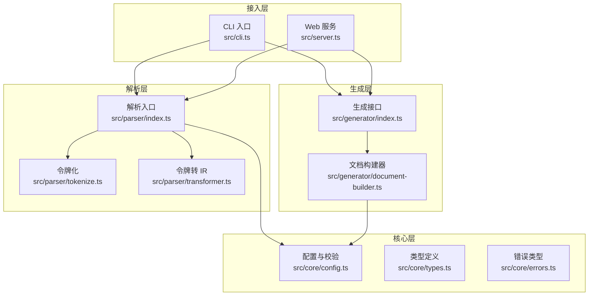
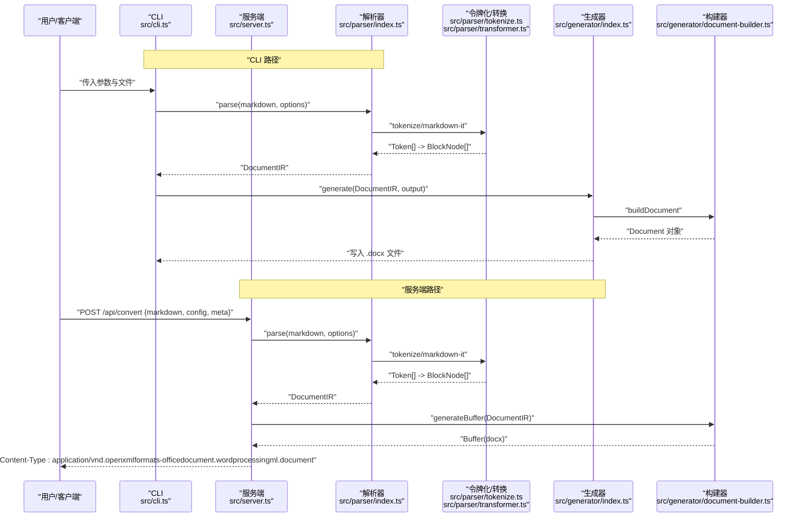
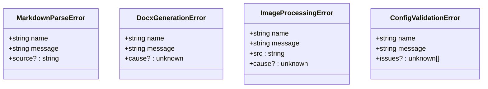
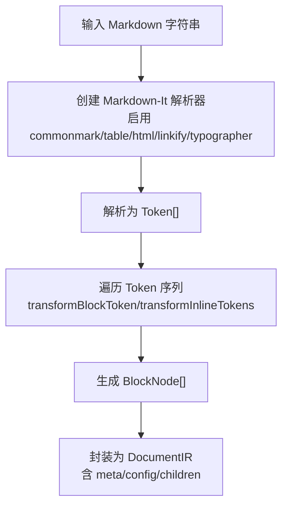
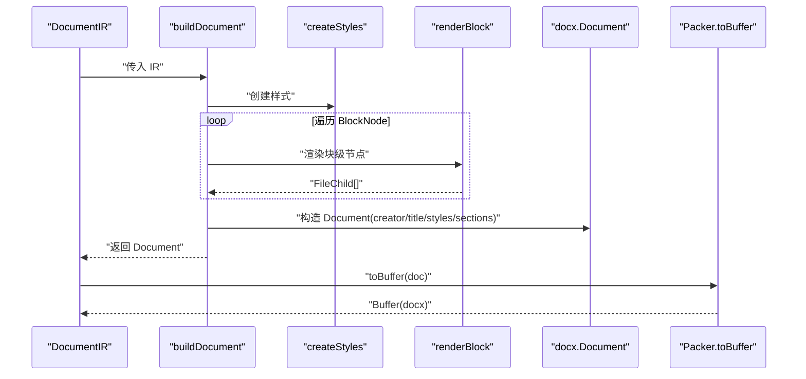
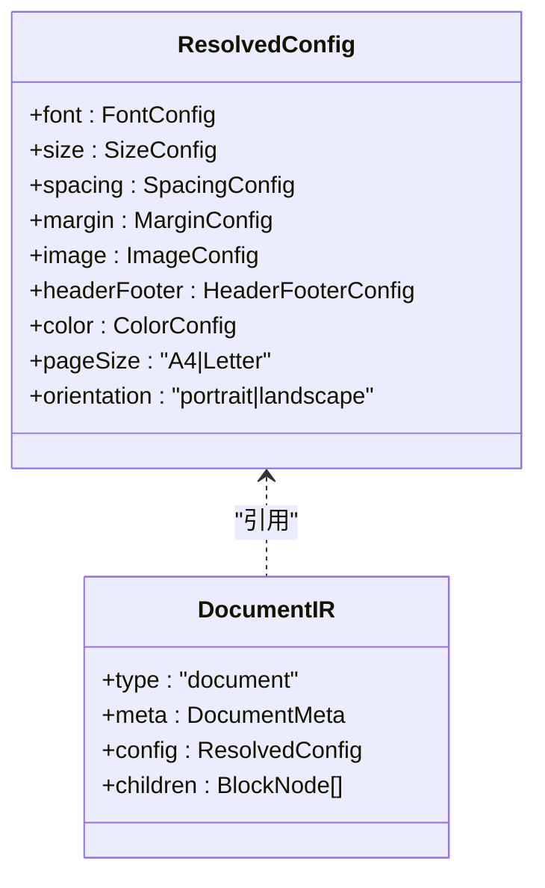
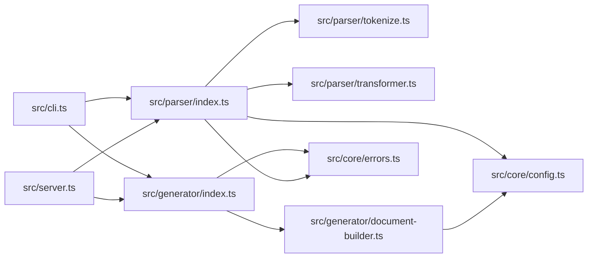

# 调试与性能优化

<cite>
**本文引用的文件**
- [src/index.ts](file://src/index.ts)
- [src/cli.ts](file://src/cli.ts)
- [src/server.ts](file://src/server.ts)
- [src/parser/index.ts](file://src/parser/index.ts)
- [src/parser/tokenize.ts](file://src/parser/tokenize.ts)
- [src/parser/transformer.ts](file://src/parser/transformer.ts)
- [src/generator/index.ts](file://src/generator/index.ts)
- [src/generator/document-builder.ts](file://src/generator/document-builder.ts)
- [src/core/config.ts](file://src/core/config.ts)
- [src/core/errors.ts](file://src/core/errors.ts)
- [src/core/types.ts](file://src/core/types.ts)
</cite>

## 目录
1. [简介](#简介)
2. [项目结构](#项目结构)
3. [核心组件](#核心组件)
4. [架构总览](#架构总览)
5. [详细组件分析](#详细组件分析)
6. [依赖关系分析](#依赖关系分析)
7. [性能考量](#性能考量)
8. [故障排除指南](#故障排除指南)
9. [结论](#结论)
10. [附录](#附录)

## 简介
本指南面向开发者，系统性地阐述 Markdown 到 Word 转换器在调试与性能优化方面的最佳实践。内容覆盖错误类型与分类、错误信息解读、调试工具与流程、性能瓶颈识别与优化策略（内存、并发、I/O）、大文件处理建议、基准测试方法以及可复用的代码级优化技巧。文档以仓库现有源码为依据，结合可视化图示帮助快速定位问题并提升稳定性与吞吐。

## 项目结构
该项目采用分层模块化设计：
- 核心层：配置、类型与错误定义
- 解析层：Markdown 解析与令牌转 IR
- 生成层：IR 构建 Word 文档与缓冲区输出
- 接入层：CLI 与 Web 服务端
- 渲染器：块级与内联节点渲染（通过构建器间接使用）

图表来源
- [src/cli.ts:69-113](file://src/cli.ts#L69-L113)
- [src/server.ts:23-89](file://src/server.ts#L23-L89)
- [src/parser/index.ts:11-21](file://src/parser/index.ts#L11-L21)
- [src/parser/tokenize.ts:12-15](file://src/parser/tokenize.ts#L12-L15)
- [src/parser/transformer.ts:25-39](file://src/parser/transformer.ts#L25-L39)
- [src/generator/index.ts:7-18](file://src/generator/index.ts#L7-L18)
- [src/generator/document-builder.ts:17-106](file://src/generator/document-builder.ts#L17-L106)
- [src/core/config.ts:68-91](file://src/core/config.ts#L68-L91)

章节来源
- [src/index.ts:1-25](file://src/index.ts#L1-L25)
- [src/cli.ts:1-113](file://src/cli.ts#L1-L113)
- [src/server.ts:1-94](file://src/server.ts#L1-L94)
- [src/parser/index.ts:1-24](file://src/parser/index.ts#L1-L24)
- [src/generator/index.ts:1-21](file://src/generator/index.ts#L1-L21)
- [src/core/config.ts:1-91](file://src/core/config.ts#L1-L91)

## 核心组件
- 配置与校验：使用模式校验确保配置输入合法，并提供默认值与合并策略，降低运行期异常概率。
- 解析器：基于 Markdown-It 进行令牌化，再将令牌序列转换为内部 IR（DocumentIR），支持标题、段落、列表、引用、代码块、表格、图片等。
- 生成器：将 IR 渲染为 docx 文档对象，支持页眉页脚、分页、样式注入；提供文件写入与 Buffer 输出两种方式。
- 接入层：CLI 读取本地文件与参数，Web 服务接收 JSON 请求并返回二进制流或 PDF 预览（依赖 LibreOffice）。

章节来源
- [src/core/config.ts:68-91](file://src/core/config.ts#L68-L91)
- [src/parser/tokenize.ts:12-15](file://src/parser/tokenize.ts#L12-L15)
- [src/parser/transformer.ts:25-39](file://src/parser/transformer.ts#L25-L39)
- [src/generator/document-builder.ts:17-106](file://src/generator/document-builder.ts#L17-L106)
- [src/generator/index.ts:7-18](file://src/generator/index.ts#L7-L18)
- [src/server.ts:23-89](file://src/server.ts#L23-L89)
- [src/cli.ts:69-113](file://src/cli.ts#L69-L113)

## 架构总览
下图展示从输入到输出的关键调用链路，包括 CLI 与服务端两条主路径。

图表来源
- [src/cli.ts:69-113](file://src/cli.ts#L69-L113)
- [src/server.ts:23-89](file://src/server.ts#L23-L89)
- [src/parser/index.ts:11-21](file://src/parser/index.ts#L11-L21)
- [src/parser/tokenize.ts:12-15](file://src/parser/tokenize.ts#L12-L15)
- [src/parser/transformer.ts:25-39](file://src/parser/transformer.ts#L25-L39)
- [src/generator/index.ts:7-18](file://src/generator/index.ts#L7-L18)
- [src/generator/document-builder.ts:108-112](file://src/generator/document-builder.ts#L108-L112)

## 详细组件分析

### 错误类型与分类
项目定义了四类专用错误，便于区分来源与恢复策略：
- MarkdownParseError：解析阶段失败（如语法不被支持）
- DocxGenerationError：生成阶段失败（如 docx 序列化/写盘异常）
- ImageProcessingError：图片处理相关（如加载/尺寸计算）
- ConfigValidationError：配置校验失败（如字段越界、类型不符）

图表来源
- [src/core/errors.ts:1-28](file://src/core/errors.ts#L1-L28)

章节来源
- [src/core/errors.ts:1-28](file://src/core/errors.ts#L1-L28)

### 解析流程与数据模型
解析器将 Markdown 文本转换为 DocumentIR，包含元信息、配置与块级节点数组。令牌转换器负责将 Markdown-It 的 Token 流映射为块级与内联节点树。

图表来源
- [src/parser/tokenize.ts:4-15](file://src/parser/tokenize.ts#L4-L15)
- [src/parser/transformer.ts:25-39](file://src/parser/transformer.ts#L25-L39)
- [src/parser/transformer.ts:41-122](file://src/parser/transformer.ts#L41-L122)
- [src/parser/transformer.ts:238-332](file://src/parser/transformer.ts#L238-L332)

章节来源
- [src/parser/index.ts:11-21](file://src/parser/index.ts#L11-L21)
- [src/parser/tokenize.ts:12-15](file://src/parser/tokenize.ts#L12-L15)
- [src/parser/transformer.ts:25-39](file://src/parser/transformer.ts#L25-L39)

### 生成流程与文档构建
生成器将 IR 渲染为 docx 文档对象，支持页眉页脚、页边距、页面方向、样式表注入，并可直接写出文件或导出 Buffer。

图表来源
- [src/generator/document-builder.ts:17-106](file://src/generator/document-builder.ts#L17-L106)
- [src/generator/index.ts:7-18](file://src/generator/index.ts#L7-L18)

章节来源
- [src/generator/document-builder.ts:17-106](file://src/generator/document-builder.ts#L17-L106)
- [src/generator/index.ts:7-18](file://src/generator/index.ts#L7-L18)

### 配置与类型系统
配置采用强类型与模式校验结合的方式，提供默认值与合并策略；类型系统定义了完整的 IR 结构，便于静态检查与 IDE 支持。

图表来源
- [src/core/types.ts:7-12](file://src/core/types.ts#L7-L12)
- [src/core/types.ts:187-198](file://src/core/types.ts#L187-L198)
- [src/core/config.ts:68-91](file://src/core/config.ts#L68-L91)

章节来源
- [src/core/config.ts:68-91](file://src/core/config.ts#L68-L91)
- [src/core/types.ts:1-198](file://src/core/types.ts#L1-L198)

## 依赖关系分析
- CLI 与服务端均依赖解析器与生成器；解析器依赖 Markdown-It 与内部类型/配置；生成器依赖 docx 库与样式模块。
- 错误类型贯穿解析与生成阶段，用于统一错误传播与上层处理。

图表来源
- [src/cli.ts:4-6](file://src/cli.ts#L4-L6)
- [src/server.ts:6-8](file://src/server.ts#L6-L8)
- [src/parser/index.ts:1-4](file://src/parser/index.ts#L1-L4)
- [src/generator/index.ts:3-5](file://src/generator/index.ts#L3-L5)
- [src/generator/document-builder.ts:13-14](file://src/generator/document-builder.ts#L13-L14)
- [src/core/errors.ts:1-28](file://src/core/errors.ts#L1-L28)

章节来源
- [src/index.ts:1-25](file://src/index.ts#L1-L25)
- [src/cli.ts:1-113](file://src/cli.ts#L1-L113)
- [src/server.ts:1-94](file://src/server.ts#L1-L94)
- [src/parser/index.ts:1-24](file://src/parser/index.ts#L1-L24)
- [src/generator/index.ts:1-21](file://src/generator/index.ts#L1-L21)
- [src/generator/document-builder.ts:1-112](file://src/generator/document-builder.ts#L1-L112)
- [src/core/errors.ts:1-28](file://src/core/errors.ts#L1-L28)

## 性能考量
- 内存使用监控
  - 使用 Node.js 原生命令行参数进行内存采样与堆快照，关注解析与生成阶段的对象分配峰值。
  - 关注大型表格、长代码块与多图场景下的内存占用，避免一次性构建超大 IR。
- 处理速度优化
  - 解析阶段：减少不必要的 Token 转换与重复遍历；对常见结构做短路判断。
  - 生成阶段：批量渲染块级节点，避免频繁创建 docx 子对象；合理设置样式复用。
- 大文件处理策略
  - 分块解析：将超大 Markdown 拆分为若干片段，分别解析后合并 IR。
  - 异步写盘：先生成 Buffer，再异步写入磁盘，避免阻塞主线程。
  - 流式输出：在服务端可考虑将 Buffer 作为流式响应发送，降低峰值内存。
- 并发与缓存
  - 缓存解析结果（基于内容哈希）与样式表，避免重复计算。
  - 对图片资源进行缓存与去重，减少 I/O 与网络请求。
- 基准测试方法
  - 准备不同规模的 Markdown 基准集（小/中/大/超大），记录解析时延、生成时延、内存峰值与输出文件大小。
  - 在相同硬件与 Node 版本下对比不同配置项（字体、字号、间距、页边距）对性能的影响。
  - 记录 CPU/内存曲线，定位瓶颈点（解析 vs 生成）。

[本节为通用性能指导，无需特定文件引用]

## 故障排除指南
- 常见错误类型与定位
  - 配置校验失败：检查配置字段是否越界或类型不符，优先使用模式校验后的 ResolvedConfig。
  - 解析失败：确认 Markdown-It 支持的语法范围，排查表格、HTML 块等特殊结构。
  - 生成失败：检查 docx 库版本兼容性与 Buffer 写入权限。
  - 预览失败（PDF）：服务端需安装 LibreOffice，否则会返回 503 并提示安装地址。
- 调试工具与技巧
  - CLI 调试：使用最小化 Markdown 示例验证解析与生成链路，逐步加入复杂结构定位问题。
  - 服务端调试：开启 CORS 与日志，观察请求体大小限制与错误响应体。
  - 错误捕获：在 CLI 与服务端的顶层 try/catch 中打印堆栈，区分业务错误与系统错误。
- 典型案例
  - 案例一：输入为空或仅空白字符
    - 现象：解析返回空 BlockNode[]，生成空文档。
    - 处理：在上层增加非空校验与提示。
  - 案例二：配置中字号为负数
    - 现象：配置校验抛出异常。
    - 处理：修正配置或在应用层进行预校验与兜底。
  - 案例三：服务端无法生成 PDF 预览
    - 现象：返回 503 并提示缺少 soffice。
    - 处理：安装 LibreOffice 并确保 PATH 可找到 soffice。
- 修复建议清单
  - 在解析前对输入进行长度与编码校验。
  - 对生成阶段的 I/O 操作增加重试与降级策略。
  - 对图片资源增加缓存与超时控制。
  - 在服务端设置合理的请求体大小上限与超时时间。

章节来源
- [src/core/errors.ts:1-28](file://src/core/errors.ts#L1-L28)
- [src/core/config.ts:68-91](file://src/core/config.ts#L68-L91)
- [src/server.ts:71-84](file://src/server.ts#L71-L84)
- [src/generator/index.ts:12-17](file://src/generator/index.ts#L12-L17)
- [src/cli.ts:106-109](file://src/cli.ts#L106-L109)

## 结论
通过明确的错误分类、清晰的解析与生成流程、完善的配置与类型体系，该转换器具备良好的可维护性与扩展性。配合系统化的调试方法与性能优化策略，可在生产环境中稳定处理各类 Markdown 文档，并针对大文件与高并发场景持续改进。

[本节为总结，无需特定文件引用]

## 附录
- 快速定位参考
  - CLI 入口与错误输出：[src/cli.ts:69-113](file://src/cli.ts#L69-L113)
  - 服务端路由与错误输出：[src/server.ts:23-89](file://src/server.ts#L23-L89)
  - 解析入口与 IR 结构：[src/parser/index.ts:11-21](file://src/parser/index.ts#L11-L21)
  - 令牌化与转换：[src/parser/tokenize.ts:12-15](file://src/parser/tokenize.ts#L12-L15)、[src/parser/transformer.ts:25-39](file://src/parser/transformer.ts#L25-L39)
  - 生成与 Buffer 输出：[src/generator/index.ts:7-18](file://src/generator/index.ts#L7-L18)、[src/generator/document-builder.ts:108-112](file://src/generator/document-builder.ts#L108-L112)
  - 配置与默认值：[src/core/config.ts:68-91](file://src/core/config.ts#L68-L91)
  - 错误类型定义：[src/core/errors.ts:1-28](file://src/core/errors.ts#L1-L28)