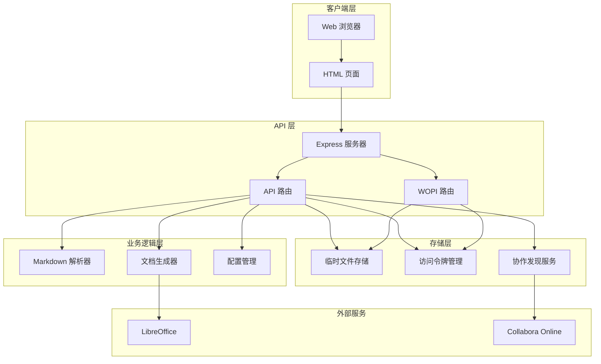

# 部署指南

<cite>
**本文档中引用的文件**
- [package.json](file://package.json)
- [Dockerfile](file://Dockerfile)
- [docker-compose.yml](file://docker-compose.yml)
- [src/server.ts](file://src/server.ts)
- [src/cli.ts](file://src/cli.ts)
- [src/routes/api.ts](file://src/routes/api.ts)
- [src/wopi/index.ts](file://src/wopi/index.ts)
- [src/wopi/discovery.ts](file://src/wopi/discovery.ts)
- [src/wopi/storage.ts](file://src/wopi/storage.ts)
- [src/wopi/token.ts](file://src/wopi/token.ts)
- [src/core/config.ts](file://src/core/config.ts)
- [tsconfig.json](file://tsconfig.json)
- [vitest.config.ts](file://vitest.config.ts)
- [public/index.html](file://public/index.html)
</cite>

## 目录
1. [简介](#简介)
2. [系统架构](#系统架构)
3. [环境要求](#环境要求)
4. [本地开发部署](#本地开发部署)
5. [Docker 容器化部署](#docker-容器化部署)
6. [生产环境部署](#生产环境部署)
7. [配置管理](#配置管理)
8. [性能优化](#性能优化)
9. [故障排除](#故障排除)
10. [监控与维护](#监控与维护)

## 简介

Markdown to Word 转换器是一个基于 Node.js 的现代化文档转换工具，支持将 Markdown 格式转换为 Word (.docx) 文档，并提供实时预览功能。该工具集成了 Collabora Online 文档编辑器，允许用户在浏览器中直接编辑转换后的文档。

主要特性：
- 实时 Markdown 编辑和预览
- Collabora Online 集成编辑
- PDF 导出功能
- 自定义样式配置
- CLI 命令行工具
- Docker 容器化部署

## 系统架构

该应用采用前后端分离的架构设计，包含以下核心组件：



**图表来源**
- [src/server.ts:1-40](file://src/server.ts#L1-L40)
- [src/routes/api.ts:1-103](file://src/routes/api.ts#L1-L103)
- [src/wopi/index.ts:1-112](file://src/wopi/index.ts#L1-L112)

## 环境要求

### 硬件要求
- **CPU**: 至少 2 核心处理器
- **内存**: 至少 2GB RAM（推荐 4GB+）
- **存储**: 至少 500MB 可用空间
- **网络**: 稳定的互联网连接

### 软件依赖

#### 必需组件
- **Node.js**: v18 或更高版本
- **npm**: 最新稳定版本
- **Docker**: 可选（用于容器化部署）

#### 外部服务依赖
- **LibreOffice**: 用于 PDF 导出功能
- **Collabora Online**: 用于在线文档编辑
- **WOPI 协议**: 用于与 Collabora 通信

**章节来源**
- [package.json:29-40](file://package.json#L29-L40)
- [docker-compose.yml:15-26](file://docker-compose.yml#L15-L26)

## 本地开发部署

### 前置条件检查

1. **安装 Node.js 和 npm**
   ```bash
   # 检查 Node.js 版本
   node --version
   
   # 检查 npm 版本
   npm --version
   ```

2. **验证 Git 仓库完整性**
   ```bash
   git status
   ls -la
   ```

### 项目安装步骤

1. **克隆项目仓库**
   ```bash
   git clone <repository-url>
   cd markdowntoword
   ```

2. **安装依赖包**
   ```bash
   npm install
   ```

3. **构建项目**
   ```bash
   npm run build
   ```

4. **启动开发服务器**
   ```bash
   npm run dev
   ```

### 开发环境配置

1. **创建环境变量文件**
   ```bash
   # 创建 .env 文件
   touch .env
   ```

2. **配置基本环境变量**
   ```env
   PORT=3000
   CODE_URL=http://localhost:9980
   PUBLIC_APP_URL=http://localhost:3000
   WOPI_SECRET=your-super-secret-key
   TEMP_DIR=./tmp
   ```

3. **启动依赖服务**
   ```bash
   # 启动 Collabora Online
   docker run -d \
     --name collabora \
     -p 9980:9980 \
     -e username=admin \
     -e password=secret \
     -e domain=localhost:3000 \
     collabora/code:latest
   ```

4. **启动主应用**
   ```bash
   npm run dev
   ```

**章节来源**
- [package.json:11-19](file://package.json#L11-L19)
- [tsconfig.json:1-22](file://tsconfig.json#L1-L22)

## Docker 容器化部署

### Docker 镜像构建

1. **构建基础镜像**
   ```bash
   docker build -t markdowntoword:latest .
   ```

2. **查看构建结果**
   ```bash
   docker images | grep markdowntoword
   ```

### Docker Compose 部署

1. **配置环境变量**
   ```bash
   # 设置 WOPI 秘钥
   export WOPI_SECRET=your-secure-secret-key
   
   # 设置管理员凭据
   export CODE_ADMIN_USER=admin
   export CODE_ADMIN_PASS=your-password
   ```

2. **启动完整服务栈**
   ```bash
   docker-compose up --build
   ```

3. **后台运行模式**
   ```bash
   docker-compose up -d
   ```

### Docker 配置详解

#### 应用服务配置
```yaml
app:
  build: .
  ports:
    - "3000:3000"
  environment:
    - PORT=3000
    - CODE_URL=http://host.docker.internal:9980
    - PUBLIC_APP_URL=http://host.docker.internal:3000
    - WOPI_SECRET=${WOPI_SECRET}
    - TEMP_DIR=/app/tmp
  volumes:
    - app_tmp:/app/tmp
  depends_on:
    - collabora
```

#### Collabora 服务配置
```yaml
collabora:
  image: collabora/code:latest
  ports:
    - "9980:9980"
  environment:
    - domain=host\.docker\.internal\:3000
    - username=${CODE_ADMIN_USER:-admin}
    - password=${CODE_ADMIN_PASS:-secret}
    - extra_params=--o:ssl.enable=false
  cap_add:
    - MKNOD
```

### 容器管理命令

1. **查看运行状态**
   ```bash
   docker-compose ps
   ```

2. **查看日志**
   ```bash
   docker-compose logs -f app
   docker-compose logs -f collabora
   ```

3. **停止服务**
   ```bash
   docker-compose down -v
   ```

4. **重建服务**
   ```bash
   docker-compose up --build
   ```

**章节来源**
- [Dockerfile:1-9](file://Dockerfile#L1-L9)
- [docker-compose.yml:1-29](file://docker-compose.yml#L1-L29)

## 生产环境部署

### 生产环境准备

1. **系统更新**
   ```bash
   sudo apt update && sudo apt upgrade -y
   ```

2. **安装必要软件**
   ```bash
   # 安装 Docker
   sudo apt install docker.io -y
   
   # 安装 Docker Compose
   sudo apt install docker-compose -y
   
   # 安装 LibreOffice（用于 PDF 导出）
   sudo apt install libreoffice -y
   ```

3. **防火墙配置**
   ```bash
   # 允许必要的端口
   sudo ufw allow 3000/tcp
   sudo ufw allow 9980/tcp
   sudo ufw enable
   ```

### 生产环境部署步骤

1. **创建部署目录**
   ```bash
   sudo mkdir -p /opt/markdowntoword
   cd /opt/markdowntoword
   ```

2. **下载并配置项目**
   ```bash
   # 克隆项目
   sudo git clone <repository-url> .
   
   # 设置权限
   sudo chown -R $(whoami) /opt/markdowntoword
   ```

3. **配置生产环境变量**
   ```bash
   # 创建生产环境配置
   cat > .env.production << EOF
   PORT=3000
   CODE_URL=http://localhost:9980
   PUBLIC_APP_URL=https://your-domain.com
   WOPI_SECRET=your-production-secret-key
   TEMP_DIR=/opt/markdowntoword/tmp
   EOF
   ```

4. **启动生产服务**
   ```bash
   docker-compose -f docker-compose.yml -f docker-compose.prod.yml up -d
   ```

### Nginx 反向代理配置

```nginx
server {
    listen 80;
    server_name your-domain.com;
    
    location / {
        proxy_pass http://localhost:3000;
        proxy_set_header Host $host;
        proxy_set_header X-Real-IP $remote_addr;
        proxy_set_header X-Forwarded-For $proxy_add_x_forwarded_for;
        proxy_set_header X-Forwarded-Proto $scheme;
    }
    
    # WebSocket 支持
    location /wopi {
        proxy_pass http://localhost:3000;
        proxy_http_version 1.1;
        proxy_set_header Upgrade $http_upgrade;
        proxy_set_header Connection "upgrade";
    }
}
```

### SSL 证书配置

使用 Let's Encrypt 获取免费 SSL 证书：

```bash
# 安装 Certbot
sudo apt install certbot python3-certbot-nginx -y

# 获取证书
sudo certbot --nginx -d your-domain.com

# 自动续期
sudo crontab -l | grep certbot || echo "0 12 * * * /usr/bin/certbot renew --quiet" | crontab -
```

**章节来源**
- [docker-compose.yml:6-13](file://docker-compose.yml#L6-L13)
- [src/server.ts:14](file://src/server.ts#L14)

## 配置管理

### 环境变量配置

| 变量名 | 默认值 | 描述 | 必需 |
|--------|--------|------|------|
| PORT | 3000 | 应用监听端口 | 否 |
| CODE_URL | http://localhost:9980 | Collabora 服务地址 | 是 |
| PUBLIC_APP_URL | http://localhost:3000 | 应用公共 URL | 是 |
| WOPI_SECRET | dev-secret-not-for-production | WOPI 访问秘钥 | 是 |
| TEMP_DIR | ./tmp | 临时文件存储目录 | 否 |
| TEMP_FILE_TTL_MS | 1800000 | 临时文件过期时间(ms) | 否 |
| WOPI_TOKEN_TTL_MS | 86400000 | 访问令牌过期时间(ms) | 否 |

### 配置文件结构

应用支持通过 CLI 参数或配置文件进行自定义配置：

```json
{
  "font": {
    "body": "Microsoft YaHei",
    "heading": "SimHei",
    "english": "Times New Roman",
    "code": "Consolas"
  },
  "size": {
    "body": 11,
    "heading1": 22,
    "heading2": 18,
    "heading3": 16,
    "heading4": 14,
    "heading5": 12,
    "heading6": 11,
    "code": 10
  },
  "spacing": {
    "lineSpacing": 1.5,
    "paragraphSpacing": 6,
    "headingSpacing": 12
  },
  "margin": {
    "top": 1440,
    "bottom": 1440,
    "left": 1440,
    "right": 1440
  },
  "image": {
    "maxWidthPercent": 80,
    "defaultAlign": "center"
  },
  "headerFooter": {
    "header": "",
    "footer": "",
    "pageNumbers": false
  },
  "color": {
    "heading": "000000",
    "text": "000000",
    "link": "0563C1",
    "codeBackground": "F5F5F5",
    "blockquoteBorder": "CCCCCC"
  },
  "pageSize": "A4",
  "orientation": "portrait"
}
```

### CLI 使用示例

```bash
# 基本转换
md2word document.md

# 指定输出文件
md2word document.md -o report.docx

# 使用配置文件
md2word document.md -c template.json --title "My Report"

# 查看帮助
md2word --help
```

**章节来源**
- [src/core/config.ts:54-91](file://src/core/config.ts#L54-L91)
- [src/cli.ts:9-25](file://src/cli.ts#L9-L25)

## 性能优化

### 内存管理

1. **临时文件清理**
   ```javascript
   // 定期清理过期文件
   setInterval(() => {
     const cutoff = Date.now() - TTL_MS;
     for (const [fileId, meta] of fileMeta.entries()) {
       if (meta.createdAt < cutoff) {
         remove(fileId).catch(() => {});
       }
     }
   }, 5 * 60 * 1000);
   ```

2. **文件锁管理**
   ```javascript
   // 自动清理过期锁
   export function getLock(fileId: string) {
     const lock = locks.get(fileId);
     if (lock && lock.expiresAt < Date.now()) {
       locks.delete(fileId);
       return undefined;
     }
     return lock?.lockId;
   }
   ```

### 并发处理

1. **请求限制**
   ```javascript
   // 限制并发请求数量
   const MAX_CONCURRENT = 10;
   const queue = [];
   let active = 0;
   
   function processRequest(req, res) {
     if (active >= MAX_CONCURRENT) {
       queue.push(() => processRequest(req, res));
       return;
     }
     
     active++;
     // 处理请求
     processRequestHandler(req, res)
       .finally(() => {
         active--;
         if (queue.length > 0) {
           queue.shift()();
         }
       });
   }
   ```

### 缓存策略

1. **协作发现缓存**
   ```javascript
   let cachedUrlSrc: string | null = null;
   
   export async function getEditUrlSrc(): Promise<string> {
     if (!cachedUrlSrc) {
       throw new Error('Discovery not initialized');
     }
     return cachedUrlSrc;
   }
   ```

## 故障排除

### 常见问题诊断

#### 1. Collabora 连接失败

**症状**: 预览功能无法加载，显示协作服务不可用

**解决方案**:
```bash
# 检查 Collabora 服务状态
docker ps | grep collabora

# 查看 Collabora 日志
docker logs collabora

# 测试连接
curl -I http://localhost:9980/hosting/discovery
```

#### 2. LibreOffice 未找到

**症状**: PDF 导出时报错 "Could not find soffice binary"

**解决方案**:
```bash
# 安装 LibreOffice
sudo apt install libreoffice -y

# 验证安装
which soffice
soffice --version
```

#### 3. 文件权限问题

**症状**: 临时文件无法保存，出现权限错误

**解决方案**:
```bash
# 检查临时目录权限
ls -la tmp/

# 设置正确权限
sudo chown -R $(whoami) tmp/
sudo chmod -R 755 tmp/
```

### 日志分析

#### 应用日志
```bash
# 查看应用日志
docker-compose logs -f app

# 查看特定时间段的日志
docker-compose logs --since="2024-01-01" app
```

#### Collabora 日志
```bash
# 查看 Collabora 日志
docker-compose logs -f collabora

# 检查 Collabora 发现服务
curl http://localhost:9980/hosting/discovery
```

### 性能监控

#### 内存使用监控
```bash
# 监控应用内存使用
docker stats app

# 检查文件描述符数量
lsof | grep app | wc -l
```

#### 端口占用检查
```bash
# 检查端口占用
netstat -tulpn | grep :3000
netstat -tulpn | grep :9980

# 杀死占用进程
sudo kill -9 $(lsof -t -i :3000)
```

**章节来源**
- [src/wopi/storage.ts:73-81](file://src/wopi/storage.ts#L73-L81)
- [src/wopi/discovery.ts:38-50](file://src/wopi/discovery.ts#L38-L50)

## 监控与维护

### 健康检查

应用提供了健康检查端点：

```bash
# 健康检查
curl http://localhost:3000/health
```

响应格式：
```json
{
  "status": "ok"
}
```

### 自动重启配置

使用 systemd 创建服务文件：

```ini
[Unit]
Description=Markdown to Word Converter
After=network.target

[Service]
Type=simple
User=www-data
WorkingDirectory=/opt/markdowntoword
ExecStart=/usr/bin/docker-compose up -d
Restart=always
RestartSec=10

[Install]
WantedBy=multi-user.target
```

### 备份策略

1. **配置备份**
   ```bash
   # 备份环境变量
   docker exec app env > .env.backup
   
   # 备份临时文件
   docker cp app:/app/tmp ./backup/tmp/
   ```

2. **数据库备份**（如有使用）
   ```bash
   # 备份数据库文件
   docker volume ls | grep markdowntoword
   docker volume inspect markdowntoword_app_tmp
   ```

### 更新流程

1. **停止服务**
   ```bash
   docker-compose down
   ```

2. **拉取最新代码**
   ```bash
   git pull origin main
   ```

3. **重新构建镜像**
   ```bash
   docker-compose build --no-cache
   ```

4. **启动服务**
   ```bash
   docker-compose up -d
   ```

### 安全最佳实践

1. **环境变量安全**
   ```bash
   # 使用强密码
   openssl rand -base64 32
   
   # 存储在安全位置
   chmod 600 .env.production
   chown root:root .env.production
   ```

2. **网络隔离**
   ```bash
   # 使用 Docker 网络
   docker network create markdowntoword-net
   
   # 将服务加入网络
   docker network connect markdowntoword-net app
   docker network connect markdowntoword-net collabora
   ```

3. **资源限制**
   ```yaml
   # 限制内存使用
   mem_limit: 1g
   mem_reservation: 512m
   
   # 限制 CPU 使用
   cpus: 1.5
   ```

**章节来源**
- [src/server.ts:23-25](file://src/server.ts#L23-L25)
- [docker-compose.yml:27-29](file://docker-compose.yml#L27-L29)