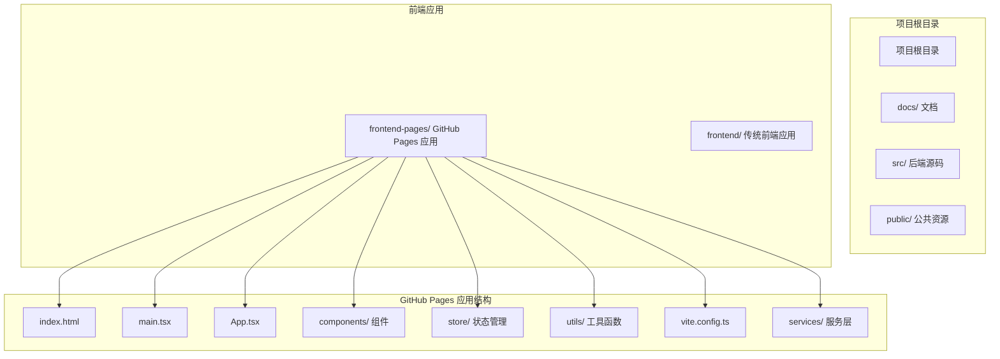
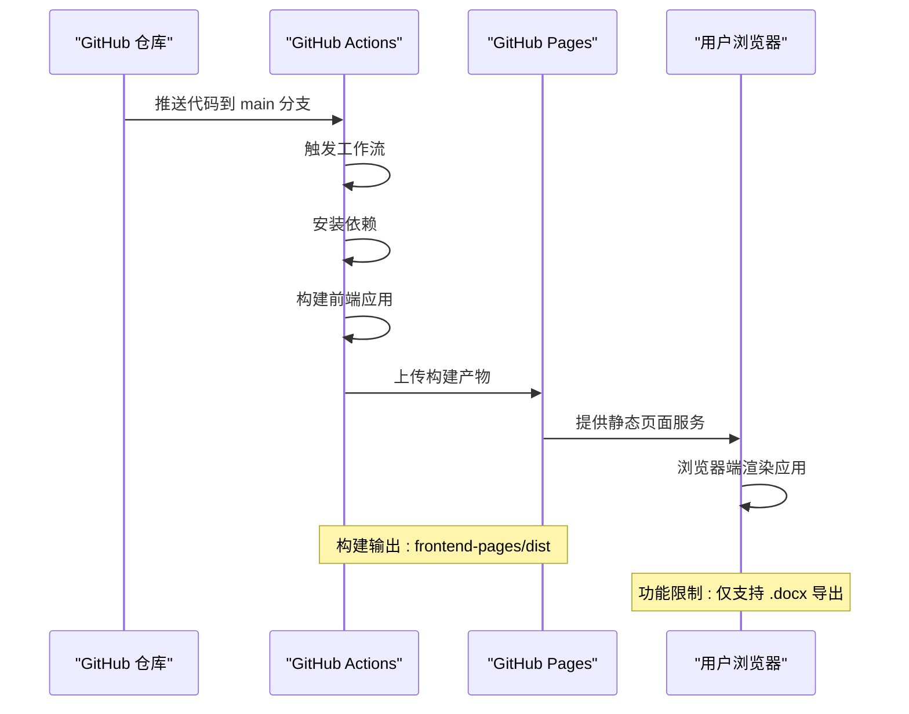
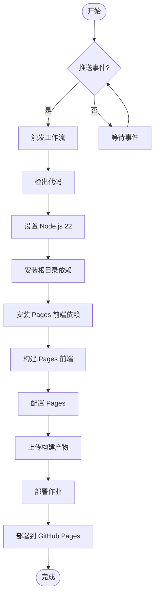
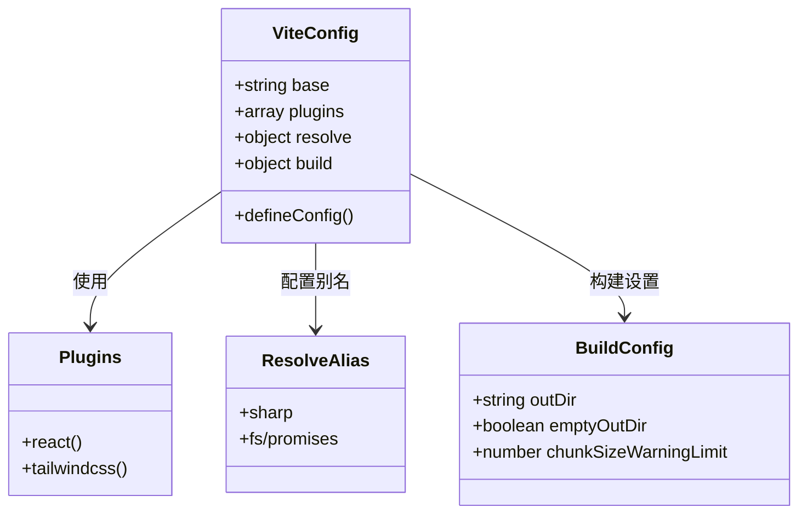
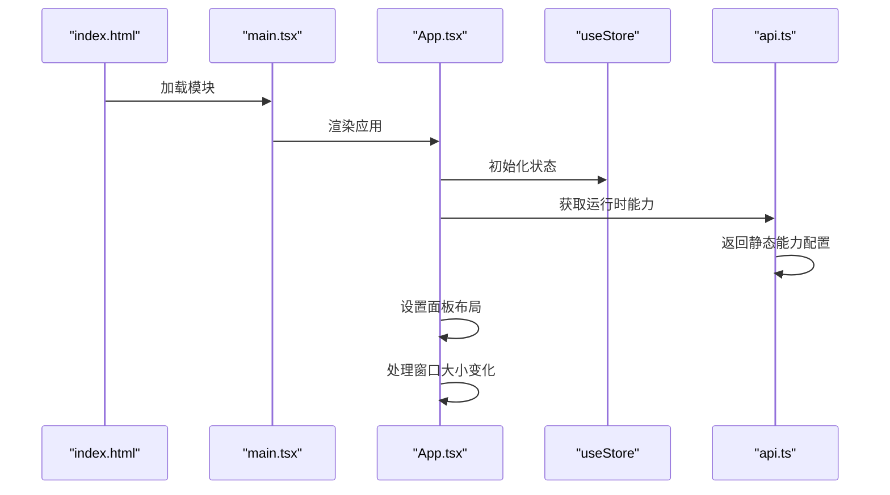
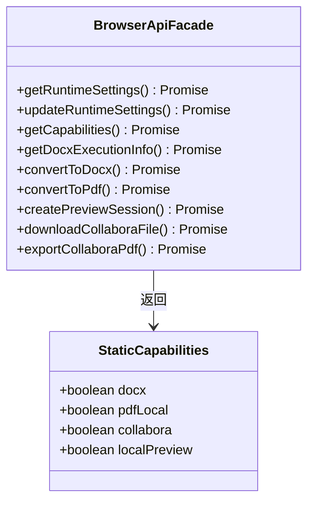
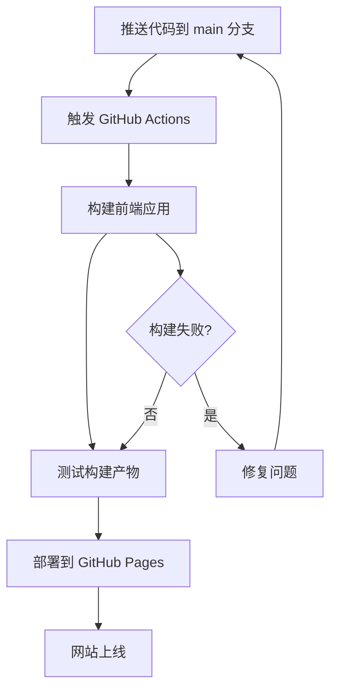

# GitHub Pages 部署指南

<cite>
**本文档中引用的文件**
- [pages.yml](file://.github/workflows/pages.yml)
- [README.md](file://README.md)
- [GITHUB_PAGES_FRONTEND.md](file://docs/GITHUB_PAGES_FRONTEND.md)
- [package.json](file://frontend-pages/package.json)
- [vite.config.ts](file://frontend-pages/vite.config.ts)
- [index.html](file://frontend-pages/index.html)
- [main.tsx](file://frontend-pages/src/main.tsx)
- [App.tsx](file://frontend-pages/src/App.tsx)
- [api.ts](file://frontend-pages/src/services/api.ts)
- [useStore.ts](file://frontend-pages/src/store/useStore.ts)
- [smartParser.ts](file://frontend-pages/src/utils/smartParser.ts)
- [templates.ts](file://frontend-pages/src/utils/templates.ts)
- [markdown-guide.html](file://frontend-pages/public/markdown-guide.html)
</cite>

## 目录
1. [简介](#简介)
2. [项目结构概览](#项目结构概览)
3. [部署架构](#部署架构)
4. [GitHub Actions 工作流](#github-actions-工作流)
5. [前端应用配置](#前端应用配置)
6. [构建流程详解](#构建流程详解)
7. [功能特性对比](#功能特性对比)
8. [部署步骤指南](#部署步骤指南)
9. [故障排除](#故障排除)
10. [总结](#总结)

## 简介

本指南详细介绍了如何将 Markdown to Word 转换器项目部署到 GitHub Pages。该项目包含一个纯浏览器端的前端应用（frontend-pages），该应用可以在 GitHub Pages 上独立运行，无需服务器支持。

GitHub Pages 版本具有以下特点：
- 完全基于浏览器的 Markdown 解析和 Word 文档生成
- 不依赖 Express 服务器、LibreOffice、Collabora 或 WOPI 后端 API
- 支持 `.docx` 导出功能
- PDF 导出和 Collabora 预览为服务器专用功能

## 项目结构概览

项目采用多包架构，其中 GitHub Pages 部署主要涉及 `frontend-pages` 目录：



**图表来源**
- [README.md:139-146](file://README.md#L139-L146)
- [GITHUB_PAGES_FRONTEND.md:1-46](file://docs/GITHUB_PAGES_FRONTEND.md#L1-L46)

## 部署架构

GitHub Pages 部署采用完全静态化的架构，所有功能都在浏览器端实现：



**图表来源**
- [pages.yml:17-58](file://.github/workflows/pages.yml#L17-L58)
- [GITHUB_PAGES_FRONTEND.md:33-46](file://docs/GITHUB_PAGES_FRONTEND.md#L33-L46)

## GitHub Actions 工作流

工作流配置确保了自动化部署流程的可靠性：



**图表来源**
- [pages.yml:1-58](file://.github/workflows/pages.yml#L1-L58)

### 工作流配置详解

工作流包含两个主要阶段：

1. **构建阶段 (Build Job)**：
   - 使用 Ubuntu 最新环境
   - Node.js 版本固定为 22
   - 安装根目录和 Pages 前端依赖
   - 在 `frontend-pages` 目录中执行构建

2. **部署阶段 (Deploy Job)**：
   - 依赖构建作业完成
   - 使用 `actions/deploy-pages@v4`
   - 输出页面 URL 到环境变量

**章节来源**
- [pages.yml:17-58](file://.github/workflows/pages.yml#L17-L58)

## 前端应用配置

### Vite 构建配置

前端应用使用 Vite 进行构建，配置针对 GitHub Pages 进行了优化：



**图表来源**
- [vite.config.ts:1-20](file://frontend-pages/vite.config.ts#L1-L20)

### 关键配置说明

1. **基础路径设置** (`base: './'`)：确保资源路径在 GitHub Pages 环境中的正确解析
2. **插件配置**：React 和 TailwindCSS 插件支持现代化前端开发
3. **别名映射**：将 Node.js 模块映射到浏览器兼容的实现
4. **输出目录**：构建产物输出到 `dist` 目录

**章节来源**
- [vite.config.ts:5-19](file://frontend-pages/vite.config.ts#L5-L19)

### 应用入口配置

应用入口文件负责初始化 React 应用：



**图表来源**
- [index.html:1-15](file://frontend-pages/index.html#L1-L15)
- [main.tsx:1-11](file://frontend-pages/src/main.tsx#L1-L11)
- [App.tsx:12-76](file://frontend-pages/src/App.tsx#L12-L76)

**章节来源**
- [index.html:1-15](file://frontend-pages/index.html#L1-L15)
- [main.tsx:1-11](file://frontend-pages/src/main.tsx#L1-L11)
- [App.tsx:12-76](file://frontend-pages/src/App.tsx#L12-L76)

## 构建流程详解

### 依赖管理

前端应用使用 npm 管理依赖，包含必要的运行时和开发依赖：

```mermaid
graph LR
subgraph "运行时依赖"
React[react@^19.2.5]
ReactDOM[react-dom@^19.2.5]
Docx[docx@^9.6.1]
MarkdownIt[markdown-it@^14.1.1]
Zustand[zustand@^5.0.12]
end
subgraph "开发依赖"
Vite[vite@^8.0.10]
TypeScript[typescript~6.0.2]
ReactPlugin[@vitejs/plugin-react^6.0.1]
Tailwind[tailwindcss^4.2.4]
end
React --> ReactDOM
React --> Zustand
Docx --> MarkdownIt
```

**图表来源**
- [package.json:11-33](file://frontend-pages/package.json#L11-L33)

### 构建产物结构

构建完成后，应用会生成以下结构的静态文件：

```mermaid
graph TB
subgraph "dist/ 构建输出"
Dist[dist/]
subgraph "静态资源"
Assets[assets/]
Favicon[favicon.svg]
MarkdownGuide[markdown-guide.html]
end
subgraph "JavaScript 文件"
MainJS[main.[hash].js]
VendorJS[vendor.[hash].js]
Manifest[manifest.[hash].js]
end
subgraph "CSS 文件"
MainCSS[main.[hash].css]
VendorCSS[vendor.[hash].css]
end
subgraph "HTML 文件"
Index[index.html]
end
end
```

**图表来源**
- [GITHUB_PAGES_FRONTEND.md:27-31](file://docs/GITHUB_PAGES_FRONTEND.md#L27-L31)

**章节来源**
- [package.json:1-35](file://frontend-pages/package.json#L1-L35)
- [GITHUB_PAGES_FRONTEND.md:20-31](file://docs/GITHUB_PAGES_FRONTEND.md#L20-L31)

## 功能特性对比

### 能力矩阵对比

| 功能特性 | 服务器版本 | GitHub Pages 版本 | 说明 |
|---------|------------|-------------------|------|
| Markdown 解析 | ✅ 内置 | ✅ 浏览器端 | 使用 markdown-it |
| Word 文档生成 | ✅ 核心功能 | ✅ 支持 | 使用 docx 库 |
| 本地预览 | ✅ 可选 | ✅ 支持 | 使用 docx-preview |
| PDF 导出 | ✅ 可选 | ❌ 不支持 | 需要 LibreOffice |
| Collabora 预览 | ✅ 可选 | ❌ 不支持 | 需要 WOPI 服务器 |
| 运行时设置 | ✅ 支持 | ❌ 不支持 | 仅服务器可用 |

### API 能力差异



**图表来源**
- [api.ts:11-49](file://frontend-pages/src/services/api.ts#L11-L49)

**章节来源**
- [api.ts:9-22](file://frontend-pages/src/services/api.ts#L9-L22)
- [GITHUB_PAGES_FRONTEND.md:43-46](file://docs/GITHUB_PAGES_FRONTEND.md#L43-L46)

## 部署步骤指南

### 1. 准备 GitHub 仓库

1. **启用 GitHub Pages**：
   - 进入仓库设置 → Pages
   - 选择 `GitHub Actions` 作为构建和部署来源
   - 保持默认的分支设置（main/master）

2. **验证工作流文件**：
   - 确认 `.github/workflows/pages.yml` 存在
   - 检查工作流权限配置

### 2. 代码推送触发



**图表来源**
- [pages.yml:3-6](file://.github/workflows/pages.yml#L3-L6)

### 3. 访问部署的应用

部署完成后，可以通过以下 URL 访问：
- `https://用户名.github.io/仓库名/`
- 或者配置自定义域名

**章节来源**
- [pages.yml:48-58](file://.github/workflows/pages.yml#L48-L58)

## 故障排除

### 常见问题及解决方案

#### 1. 构建失败

**问题症状**：
- GitHub Actions 构建过程中断
- 报错显示依赖安装失败

**解决步骤**：
1. 检查 Node.js 版本是否为 22
2. 验证 `frontend-pages/package.json` 依赖配置
3. 确认 `npm ci` 和 `npm install` 命令执行成功

#### 2. 资源路径错误

**问题症状**：
- 页面加载正常但静态资源 404
- 图片或样式文件无法显示

**解决步骤**：
1. 检查 `vite.config.ts` 中的 `base: './'` 配置
2. 确认构建输出目录为 `frontend-pages/dist`
3. 验证 GitHub Pages 设置中的源目录

#### 3. 功能不可用

**问题症状**：
- PDF 导出按钮不可点击
- Collabora 预览功能无效

**解决步骤**：
1. 理解 GitHub Pages 版本的功能限制
2. 使用 `.docx` 导出功能替代 PDF 导出
3. 在服务器版本中启用相关功能

**章节来源**
- [pages.yml:13-16](file://.github/workflows/pages.yml#L13-L16)
- [vite.config.ts:6](file://frontend-pages/vite.config.ts#L6)

### 调试技巧

1. **查看构建日志**：
   - 在 GitHub Actions 中查看详细的构建输出
   - 关注依赖安装和构建过程的错误信息

2. **本地验证**：
   ```bash
   cd frontend-pages
   npm install
   npm run build
   ```

3. **检查文件结构**：
   - 确认 `dist` 目录包含完整的静态文件
   - 验证 `index.html` 和其他静态资源的存在性

## 总结

GitHub Pages 部署为 Markdown to Word 转换器提供了简单、可靠的静态托管方案。通过自动化的工作流配置，实现了从代码提交到网站上线的完整 CI/CD 流程。

### 主要优势

1. **零服务器维护**：完全静态托管，无需服务器配置
2. **自动化部署**：代码推送即自动构建和部署
3. **成本效益**：GitHub Pages 免费提供托管服务
4. **全球加速**：GitHub 的 CDN 网络提供快速访问

### 适用场景

- 开发演示和原型展示
- 文档发布和说明页面
- 简单的在线工具界面
- 静态内容的快速发布

### 限制说明

由于浏览器端的限制，GitHub Pages 版本不支持：
- PDF 导出功能
- Collabora 在线预览
- 运行时设置管理
- 服务器端的高级功能

对于需要这些功能的用户，建议部署完整的服务器版本。