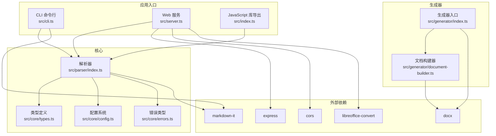
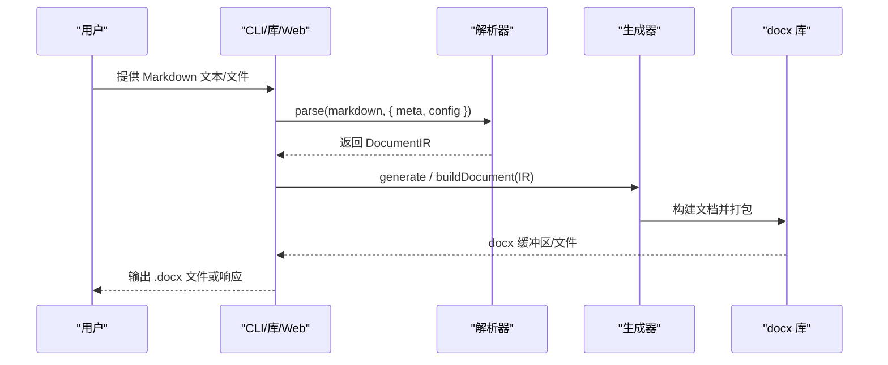
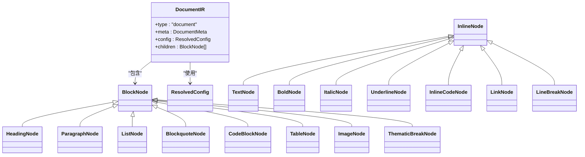
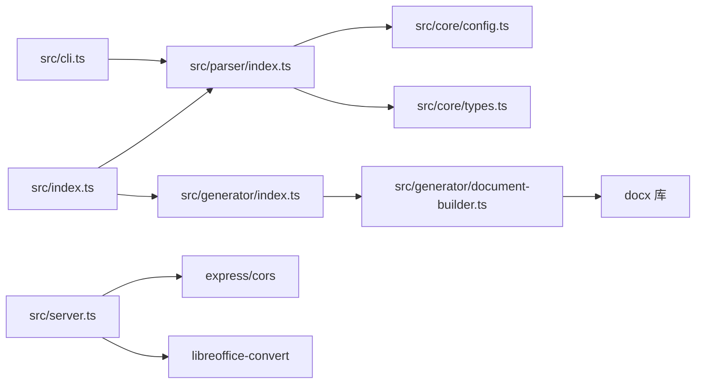

# 快速开始

<cite>
**本文引用的文件**
- [package.json](file://package.json)
- [tsconfig.json](file://tsconfig.json)
- [src/index.ts](file://src/index.ts)
- [src/cli.ts](file://src/cli.ts)
- [src/server.ts](file://src/server.ts)
- [src/core/config.ts](file://src/core/config.ts)
- [src/core/types.ts](file://src/core/types.ts)
- [src/core/errors.ts](file://src/core/errors.ts)
- [src/parser/index.ts](file://src/parser/index.ts)
- [src/parser/tokenize.ts](file://src/parser/tokenize.ts)
- [src/generator/index.ts](file://src/generator/index.ts)
- [src/generator/document-builder.ts](file://src/generator/document-builder.ts)
- [public/index.html](file://public/index.html)
- [tests/fixtures/markdown/sample.md](file://tests/fixtures/markdown/sample.md)
</cite>

## 目录
1. [简介](#简介)
2. [项目结构](#项目结构)
3. [核心组件](#核心组件)
4. [架构总览](#架构总览)
5. [详细组件分析](#详细组件分析)
6. [依赖关系分析](#依赖关系分析)
7. [性能与使用建议](#性能与使用建议)
8. [故障排除指南](#故障排除指南)
9. [结论](#结论)
10. [附录](#附录)

## 简介
本指南面向初学者与进阶用户，帮助你快速上手 Markdown 到 Word 的转换器。你将学会：
- 安装与环境要求（Node.js 版本）
- 全局安装与本地安装两种方式
- 三种主要使用方式：命令行工具（CLI）、Web 服务、JavaScript 库
- 基本配置项说明与常见使用场景
- 常见问题排查与解决方案

## 项目结构
该仓库采用模块化设计，核心能力由“解析器 + 生成器 + 核心配置”组成，并提供 CLI、Web 服务与库导出三种入口。

图表来源
- [src/cli.ts:1-113](file://src/cli.ts#L1-L113)
- [src/server.ts:1-94](file://src/server.ts#L1-L94)
- [src/index.ts:1-25](file://src/index.ts#L1-L25)
- [src/parser/index.ts:1-24](file://src/parser/index.ts#L1-L24)
- [src/generator/index.ts:1-21](file://src/generator/index.ts#L1-L21)
- [src/generator/document-builder.ts:1-112](file://src/generator/document-builder.ts#L1-L112)

章节来源
- [package.json:1-47](file://package.json#L1-L47)
- [tsconfig.json:1-22](file://tsconfig.json#L1-L22)

## 核心组件
- 解析器：将 Markdown 文本解析为内部 IR（中间表示），并支持元信息与配置注入。
- 生成器：将 IR 渲染为 docx 文档，支持样式、页眉页脚、分页等。
- 配置系统：通过 Zod Schema 校验与合并配置，提供默认值与可选覆盖。
- 错误体系：统一的错误类型，便于定位与处理。
- 类型系统：清晰的 Block/Inline 节点与配置接口，保证类型安全。

章节来源
- [src/parser/index.ts:11-21](file://src/parser/index.ts#L11-L21)
- [src/generator/index.ts:7-18](file://src/generator/index.ts#L7-L18)
- [src/generator/document-builder.ts:17-106](file://src/generator/document-builder.ts#L17-L106)
- [src/core/config.ts:68-91](file://src/core/config.ts#L68-L91)
- [src/core/errors.ts:1-28](file://src/core/errors.ts#L1-L28)
- [src/core/types.ts:1-198](file://src/core/types.ts#L1-L198)

## 架构总览
从输入到输出的关键流程如下：

图表来源
- [src/parser/index.ts:11-21](file://src/parser/index.ts#L11-L21)
- [src/generator/index.ts:7-18](file://src/generator/index.ts#L7-L18)
- [src/generator/document-builder.ts:17-106](file://src/generator/document-builder.ts#L17-L106)

## 详细组件分析

### 安装与环境要求
- Node.js 版本：项目使用 ES 模块与较新的语言特性，建议使用 Node.js 18+；编译目标为 ES2022。
- 依赖管理：使用 npm/yarn/pnpm 等包管理器安装依赖。
- 可选依赖：Web 服务在预览 PDF 时需要 LibreOffice（用于转换 docx→pdf）。

章节来源
- [package.json:27-36](file://package.json#L27-L36)
- [tsconfig.json:4-7](file://tsconfig.json#L4-L7)
- [src/server.ts:9-17](file://src/server.ts#L9-L17)

### 全局安装与本地安装
- 全局安装：通过 npm 全局安装后，可直接使用命令行工具。
- 本地安装：在项目中安装依赖，使用 npm scripts 或直接调用生成的 dist 文件。

章节来源
- [package.json:8-17](file://package.json#L8-L17)

### 命令行工具（CLI）
- 功能：读取 Markdown 文件，按配置生成 .docx 文件。
- 主要参数：
  - 输入文件：必需
  - 输出路径：可选，默认与输入同名但扩展名为 .docx
  - 配置文件：可选，JSON 文件路径
  - 标题/作者：可选，写入文档元信息
  - 帮助：显示帮助信息
- 使用示例（参考路径而非代码片段）：
  - [src/cli.ts:20-24](file://src/cli.ts#L20-L24)

章节来源
- [src/cli.ts:9-25](file://src/cli.ts#L9-L25)
- [src/cli.ts:69-110](file://src/cli.ts#L69-L110)

### Web 服务
- 提供两个 API：
  - POST /api/convert：返回 .docx 文件（下载）
  - POST /api/preview：返回 PDF 预览（需安装 LibreOffice）
  - GET /health：健康检查
- 请求体字段：
  - markdown：必填
  - config：可选，JSON 配置
  - meta：可选，文档元信息（title/author）
- 响应头：
  - /api/convert 设置 Content-Type 为 application/vnd.openxmlformats-officedocument.wordprocessingml.document
  - /api/preview 设置 Content-Type 为 application/pdf
- 前端示例页面：提供在线编辑、实时预览、配置面板与下载按钮。

章节来源
- [src/server.ts:23-49](file://src/server.ts#L23-L49)
- [src/server.ts:51-84](file://src/server.ts#L51-L84)
- [src/server.ts:87-93](file://src/server.ts#L87-L93)
- [public/index.html:340-447](file://public/index.html#L340-L447)

### JavaScript 库（作为模块导入）
- 导出 API：
  - parse(markdown, options)：解析为 IR
  - generate(ir, outputPath)：生成 .docx 文件
  - buildDocument(ir)：构建 docx 文档对象
  - createConfig/mergeConfig/defaultConfig/configSchema：配置相关
  - 各类错误类型与类型定义
- 使用示例（参考路径而非代码片段）：
  - [src/index.ts:1-25](file://src/index.ts#L1-L25)
  - [src/generator/index.ts:7-18](file://src/generator/index.ts#L7-L18)

章节来源
- [src/index.ts:1-25](file://src/index.ts#L1-L25)
- [src/generator/index.ts:1-21](file://src/generator/index.ts#L1-L21)

### 配置系统与常用选项
- 支持的配置键（节选）：
  - 字体：body、heading、english、code
  - 尺寸：body、heading1..6、code
  - 间距：lineSpacing、paragraphSpacing、headingSpacing
  - 边距：top、bottom、left、right（twips）
  - 图片：maxWidthPercent、defaultAlign
  - 页眉页脚：header、footer、pageNumbers
  - 颜色：heading、text、link、codeBackground、blockquoteBorder
  - 页面：pageSize（A4/Letter）、orientation（portrait/landscape）
- 默认值与校验：通过 Zod Schema 自动校验与合并，未提供的键使用默认值。
- 示例（参考路径而非代码片段）：
  - [src/core/config.ts:54-64](file://src/core/config.ts#L54-L64)
  - [src/core/config.ts:68-91](file://src/core/config.ts#L68-L91)

章节来源
- [src/core/config.ts:1-91](file://src/core/config.ts#L1-L91)
- [src/core/types.ts:136-198](file://src/core/types.ts#L136-L198)

### 数据模型与渲染流程
- 解析阶段：将 Markdown 转为 Token，再转为 Block/Inline 节点树。
- 生成阶段：根据配置创建样式与段落，渲染块级节点，最终打包为 docx。
- 关键类型：DocumentIR、BlockNode、InlineNode、ResolvedConfig 等。

图表来源
- [src/core/types.ts:7-135](file://src/core/types.ts#L7-L135)

章节来源
- [src/parser/index.ts:11-21](file://src/parser/index.ts#L11-L21)
- [src/parser/tokenize.ts:12-15](file://src/parser/tokenize.ts#L12-L15)
- [src/generator/document-builder.ts:17-106](file://src/generator/document-builder.ts#L17-L106)

## 依赖关系分析
- 内部模块耦合：解析器与生成器通过 DocumentIR 解耦；配置系统独立于解析与生成。
- 外部依赖：docx 用于生成 .docx；markdown-it 用于解析；express/cors 提供 Web 服务；libreoffice-convert 用于 PDF 预览。
- 构建与运行：ES 模块、TypeScript 编译、ES2022 目标。

图表来源
- [src/index.ts:1-25](file://src/index.ts#L1-L25)
- [src/parser/index.ts:1-24](file://src/parser/index.ts#L1-L24)
- [src/generator/index.ts:1-21](file://src/generator/index.ts#L1-L21)
- [src/generator/document-builder.ts:1-15](file://src/generator/document-builder.ts#L1-L15)
- [src/server.ts:1-10](file://src/server.ts#L1-L10)
- [src/cli.ts:4-6](file://src/cli.ts#L4-L6)

章节来源
- [package.json:27-36](file://package.json#L27-L36)

## 性能与使用建议
- 大文档建议：
  - 控制图片尺寸与数量，避免过大的图片导致内存占用上升。
  - 合理设置边距与行距，减少渲染复杂度。
- Web 服务：
  - 限制请求体大小（已设置为 10MB）。
  - 预览 PDF 需要 LibreOffice，建议在生产环境提前安装并验证。
- CLI：
  - 批量转换时注意磁盘 IO，建议先生成到内存再写入文件（如自行扩展）。

[本节为通用建议，不直接分析具体文件]

## 故障排除指南
- 安装失败（缺少依赖）
  - 症状：安装时报错或运行时报错
  - 排查：确认 Node.js 版本满足要求；重新安装依赖；检查网络代理
  - 参考：[package.json:27-36](file://package.json#L27-L36)
- LibreOffice 未安装导致 PDF 预览失败
  - 症状：/api/preview 返回 503，提示找不到 soffice 二进制
  - 排查：安装 LibreOffice 并确保系统 PATH 可找到 soffice
  - 参考：[src/server.ts:74-79](file://src/server.ts#L74-L79)
- CLI 参数错误
  - 症状：提示帮助或退出码非 0
  - 排查：检查输入文件是否存在；确认输出路径可写；核对配置 JSON
  - 参考：[src/cli.ts:72-75](file://src/cli.ts#L72-L75)，[src/cli.ts:83-86](file://src/cli.ts#L83-L86)
- 配置无效或类型错误
  - 症状：抛出配置校验错误
  - 排查：对照配置 Schema，修正键名与类型；使用默认配置作为起点
  - 参考：[src/core/config.ts:54-64](file://src/core/config.ts#L54-L64)，[src/core/errors.ts:22-27](file://src/core/errors.ts#L22-L27)
- 生成 .docx 失败
  - 症状：抛出生成错误
  - 排查：检查 IR 是否完整；确认输出路径权限；查看底层异常
  - 参考：[src/generator/index.ts:13-16](file://src/generator/index.ts#L13-L16)，[src/core/errors.ts:8-13](file://src/core/errors.ts#L8-L13)

章节来源
- [src/server.ts:74-79](file://src/server.ts#L74-L79)
- [src/cli.ts:72-75](file://src/cli.ts#L72-L75)
- [src/core/config.ts:54-64](file://src/core/config.ts#L54-L64)
- [src/generator/index.ts:13-16](file://src/generator/index.ts#L13-L16)
- [src/core/errors.ts:8-13](file://src/core/errors.ts#L8-L13)

## 结论
本项目提供了从 Markdown 到 Word 的完整链路：解析、配置、渲染与输出。你可以通过 CLI 快速批量转换，通过 Web 服务进行在线预览与下载，也可以作为库在应用中集成。建议从默认配置入手，逐步调整字体、字号、间距与页面布局，以获得符合需求的排版效果。

[本节为总结性内容，不直接分析具体文件]

## 附录

### 常见使用场景示例（参考路径）
- CLI：将 Markdown 文件转换为 .docx
  - [src/cli.ts:69-110](file://src/cli.ts#L69-L110)
- Web 服务：前端页面提交 Markdown，后端返回 .docx 或 PDF 预览
  - [public/index.html:403-447](file://public/index.html#L403-L447)
  - [src/server.ts:23-49](file://src/server.ts#L23-L49)
  - [src/server.ts:51-84](file://src/server.ts#L51-L84)
- 库：在应用中解析与生成
  - [src/index.ts:1-25](file://src/index.ts#L1-L25)
  - [src/generator/index.ts:7-18](file://src/generator/index.ts#L7-L18)

### 示例 Markdown（参考路径）
- [tests/fixtures/markdown/sample.md:1-51](file://tests/fixtures/markdown/sample.md#L1-L51)