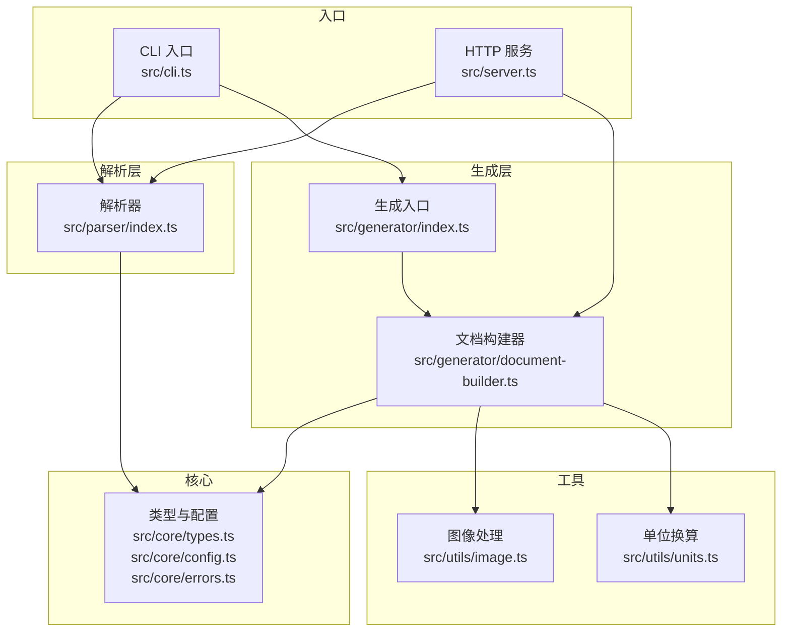
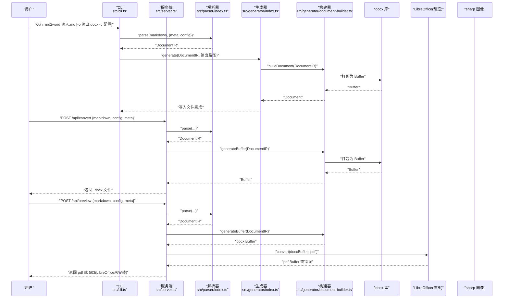
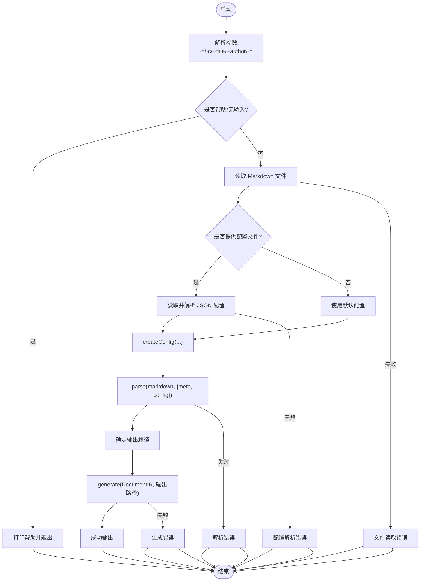
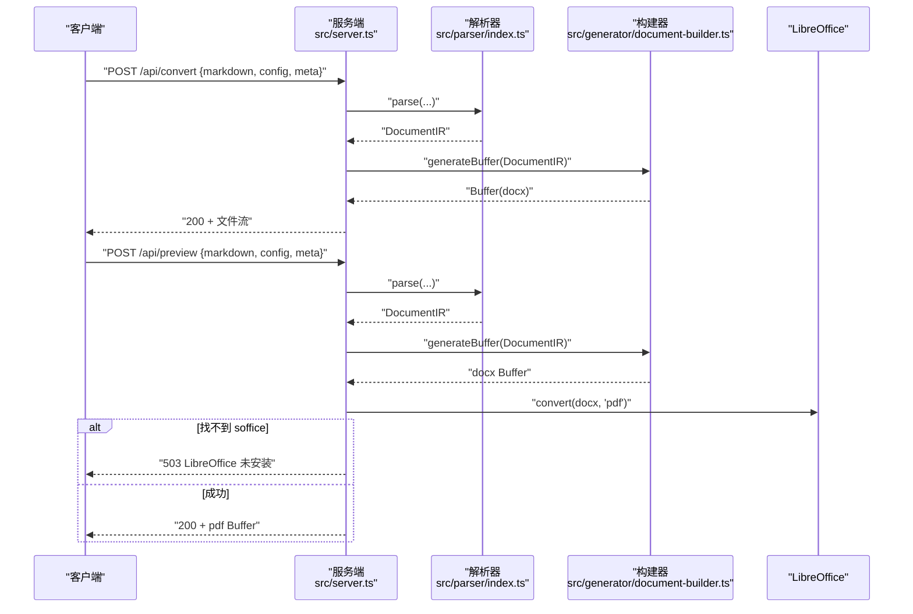
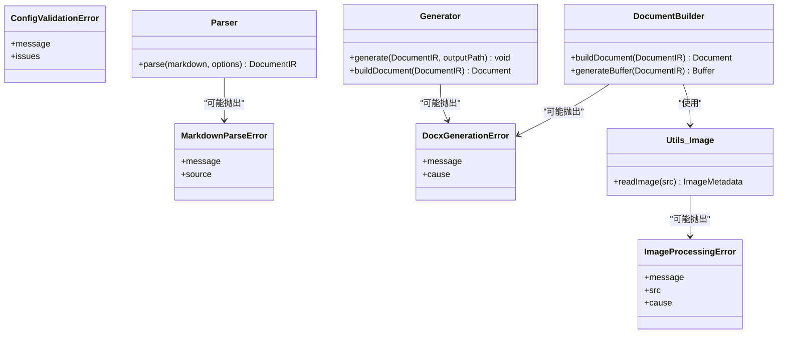
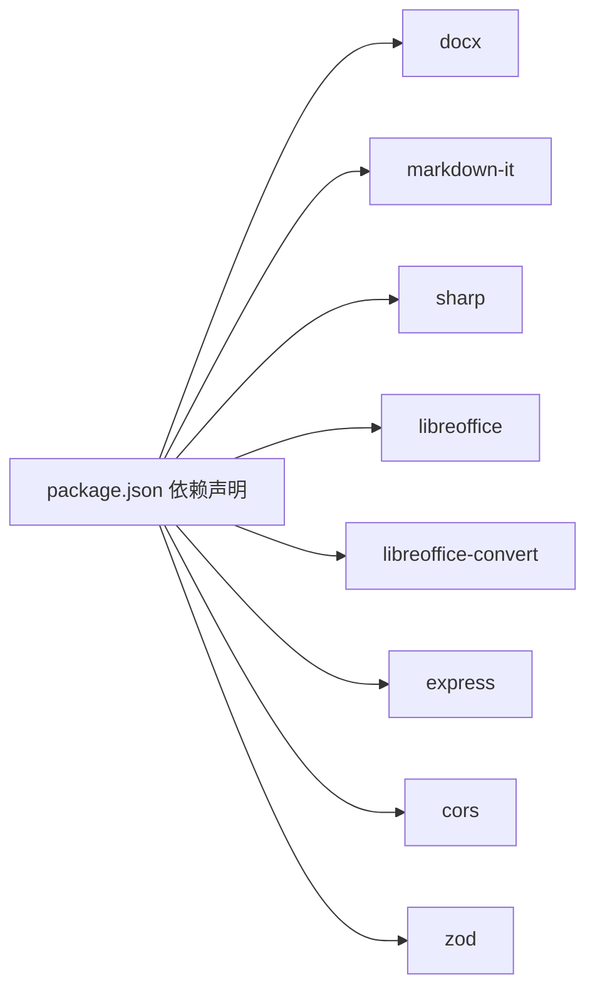

# 故障排除

<cite>
**本文引用的文件**
- [package.json](file://package.json)
- [src/index.ts](file://src/index.ts)
- [src/cli.ts](file://src/cli.ts)
- [src/server.ts](file://src/server.ts)
- [src/core/errors.ts](file://src/core/errors.ts)
- [src/core/config.ts](file://src/core/config.ts)
- [src/core/types.ts](file://src/core/types.ts)
- [src/parser/index.ts](file://src/parser/index.ts)
- [src/generator/index.ts](file://src/generator/index.ts)
- [src/generator/document-builder.ts](file://src/generator/document-builder.ts)
- [src/utils/image.ts](file://src/utils/image.ts)
- [src/utils/units.ts](file://src/utils/units.ts)
- [tests/e2e/full-pipeline.test.ts](file://tests/e2e/full-pipeline.test.ts)
- [tests/unit/core/config.test.ts](file://tests/unit/core/config.test.ts)
- [tests/unit/parser/transformer.test.ts](file://tests/unit/parser/transformer.test.ts)
</cite>

## 目录
1. [简介](#简介)
2. [项目结构](#项目结构)
3. [核心组件](#核心组件)
4. [架构总览](#架构总览)
5. [详细组件分析](#详细组件分析)
6. [依赖分析](#依赖分析)
7. [性能考虑](#性能考虑)
8. [故障排除指南](#故障排除指南)
9. [结论](#结论)
10. [附录](#附录)

## 简介
本指南面向使用 Markdown 到 Word 转换器（CLI 与服务端）的用户与维护者，系统化梳理常见问题与解决路径，覆盖安装、配置、运行时异常、性能与兼容性等方面。文档以“可操作”为核心目标，提供分步排查流程、错误类型分类、日志分析技巧与优化建议。

## 项目结构
该仓库采用按功能域划分的模块化组织方式：核心类型与错误定义在 core；解析器负责将 Markdown 转为内部 IR；生成器将 IR 渲染为 docx；CLI 与服务端分别提供命令行与 HTTP 接口；工具模块处理图像与单位转换；测试覆盖端到端与单元层面。

图表来源
- [src/cli.ts:1-113](file://src/cli.ts#L1-L113)
- [src/server.ts:1-94](file://src/server.ts#L1-L94)
- [src/parser/index.ts:1-24](file://src/parser/index.ts#L1-L24)
- [src/generator/index.ts:1-21](file://src/generator/index.ts#L1-L21)
- [src/generator/document-builder.ts:1-112](file://src/generator/document-builder.ts#L1-L112)
- [src/utils/image.ts:1-58](file://src/utils/image.ts#L1-L58)
- [src/utils/units.ts:1-45](file://src/utils/units.ts#L1-L45)
- [src/core/types.ts:1-198](file://src/core/types.ts#L1-L198)
- [src/core/config.ts:1-91](file://src/core/config.ts#L1-L91)
- [src/core/errors.ts:1-28](file://src/core/errors.ts#L1-L28)

章节来源
- [package.json:1-47](file://package.json#L1-L47)
- [src/index.ts:1-25](file://src/index.ts#L1-L25)

## 核心组件
- 错误体系：定义了 Markdown 解析错误、DOCX 生成错误、图片处理错误、配置校验错误，便于统一捕获与区分。
- 配置系统：基于 Zod 的强类型配置，支持字体、字号、间距、页边距、图片、页眉页脚、颜色、纸张尺寸与方向。
- 解析器：将 Markdown 文本转为内部 IR（文档元信息、配置、块级节点列表）。
- 生成器：将 IR 渲染为 docx 文档，支持页眉页脚、页面布局与样式注入。
- 工具模块：图像读取与缩放、像素/点/EMU 单位换算。
- CLI 与服务端：前者从文件读取输入并写入输出；后者提供转换与预览接口，预览需要 LibreOffice 支持。

章节来源
- [src/core/errors.ts:1-28](file://src/core/errors.ts#L1-L28)
- [src/core/config.ts:1-91](file://src/core/config.ts#L1-L91)
- [src/core/types.ts:1-198](file://src/core/types.ts#L1-L198)
- [src/parser/index.ts:1-24](file://src/parser/index.ts#L1-L24)
- [src/generator/index.ts:1-21](file://src/generator/index.ts#L1-L21)
- [src/generator/document-builder.ts:1-112](file://src/generator/document-builder.ts#L1-L112)
- [src/utils/image.ts:1-58](file://src/utils/image.ts#L1-L58)
- [src/utils/units.ts:1-45](file://src/utils/units.ts#L1-L45)
- [src/cli.ts:1-113](file://src/cli.ts#L1-L113)
- [src/server.ts:1-94](file://src/server.ts#L1-L94)

## 架构总览
下图展示从输入到输出的关键调用链路，以及错误抛出位置与外部依赖。

图表来源
- [src/cli.ts:69-113](file://src/cli.ts#L69-L113)
- [src/server.ts:23-85](file://src/server.ts#L23-L85)
- [src/parser/index.ts:11-21](file://src/parser/index.ts#L11-L21)
- [src/generator/index.ts:7-18](file://src/generator/index.ts#L7-L18)
- [src/generator/document-builder.ts:17-111](file://src/generator/document-builder.ts#L17-L111)

## 详细组件分析

### CLI 组件分析
- 功能：解析命令行参数、读取 Markdown 与可选配置、调用解析与生成、输出到文件。
- 关键错误：文件读取失败、JSON 配置解析失败、解析或生成异常、输出写入失败。
- 建议：优先检查输入路径、配置 JSON 合法性与权限；生成失败时查看对应错误类型定位来源。

图表来源
- [src/cli.ts:27-113](file://src/cli.ts#L27-L113)
- [src/core/config.ts:68-91](file://src/core/config.ts#L68-L91)
- [src/parser/index.ts:11-21](file://src/parser/index.ts#L11-L21)
- [src/generator/index.ts:7-18](file://src/generator/index.ts#L7-L18)

章节来源
- [src/cli.ts:1-113](file://src/cli.ts#L1-L113)

### 服务端组件分析
- 功能：提供转换与预览接口；预览需 LibreOffice，否则返回 503 并提示安装。
- 关键错误：缺少 markdown、解析失败、生成失败、LibreOffice 未找到。
- 建议：先确认请求体字段完整；预览失败时检查 LibreOffice 安装与 soffice 可执行文件路径。

图表来源
- [src/server.ts:23-85](file://src/server.ts#L23-L85)
- [src/parser/index.ts:11-21](file://src/parser/index.ts#L11-L21)
- [src/generator/document-builder.ts:108-111](file://src/generator/document-builder.ts#L108-L111)

章节来源
- [src/server.ts:1-94](file://src/server.ts#L1-L94)

### 解析器与生成器组件分析
- 解析器：将 Markdown 转为 Token 再转为 IR，支持传入元数据与配置。
- 生成器：构建 Document 对象，设置页眉页脚、页面属性与样式，最终打包为 Buffer 或写入文件。
- 关键错误：解析阶段抛出 MarkdownParseError；生成阶段抛出 DocxGenerationError；图片处理抛出 ImageProcessingError。

图表来源
- [src/core/errors.ts:1-28](file://src/core/errors.ts#L1-L28)
- [src/parser/index.ts:11-21](file://src/parser/index.ts#L11-L21)
- [src/generator/index.ts:7-18](file://src/generator/index.ts#L7-L18)
- [src/generator/document-builder.ts:17-111](file://src/generator/document-builder.ts#L17-L111)
- [src/utils/image.ts:12-42](file://src/utils/image.ts#L12-L42)

章节来源
- [src/parser/index.ts:1-24](file://src/parser/index.ts#L1-L24)
- [src/generator/index.ts:1-21](file://src/generator/index.ts#L1-L21)
- [src/generator/document-builder.ts:1-112](file://src/generator/document-builder.ts#L1-L112)
- [src/utils/image.ts:1-58](file://src/utils/image.ts#L1-L58)

## 依赖分析
- 运行时依赖：docx、markdown-it、sharp、libreoffice、libreoffice-convert、express、cors、zod。
- 开发依赖：TypeScript、tsup、Vitest 等。
- 外部集成点：docx 库用于生成文档；sharp 用于图像元数据与格式推断；libreoffice-convert 用于 PDF 预览；Express 提供 HTTP 服务。

图表来源
- [package.json:27-45](file://package.json#L27-L45)

章节来源
- [package.json:1-47](file://package.json#L1-L47)

## 性能考虑
- 图像处理：大图会显著增加内存与 CPU 消耗；建议控制图片最大宽度与使用本地缓存策略。
- 解析与生成：长文档的 Token 化与渲染链路存在线性复杂度；可通过分段处理或并发优化（注意内存峰值）。
- 服务器端：限制请求体大小、启用超时与资源回收；对预览接口进行限流与缓存。
- 单位换算：频繁的像素/点/EMU 转换应避免重复计算，可在配置阶段缓存结果。

章节来源
- [src/utils/units.ts:1-45](file://src/utils/units.ts#L1-L45)
- [src/utils/image.ts:12-42](file://src/utils/image.ts#L12-L42)
- [src/server.ts:20-21](file://src/server.ts#L20-L21)

## 故障排除指南

### 一、安装与环境问题
- 现象
  - 安装后无法执行命令：md2word 命令不存在或报错。
  - 服务端启动时报错：找不到 soffice 可执行文件，预览接口返回 503。
- 诊断步骤
  - 确认通过包管理器正确安装依赖与构建产物可用。
  - 在服务端环境中验证 LibreOffice 是否安装且 soffice 可执行文件在 PATH 中。
- 解决方案
  - 重新安装依赖并执行构建脚本；在 Linux/macOS 上将 LibreOffice 添加到 PATH；Windows 用户可将安装目录加入 PATH。
- 相关实现参考
  - [package.json:11-17](file://package.json#L11-L17)
  - [src/server.ts:74-79](file://src/server.ts#L74-L79)

章节来源
- [package.json:1-47](file://package.json#L1-L47)
- [src/server.ts:1-94](file://src/server.ts#L1-L94)

### 二、配置错误
- 现象
  - 运行时报配置校验错误；配置项无效或类型不匹配。
- 诊断步骤
  - 使用 createConfig 合并基础配置与用户输入；检查配置键名与枚举值是否合法。
- 解决方案
  - 严格遵循配置 Schema；使用默认配置作为基线，仅覆盖必要字段。
- 相关实现参考
  - [src/core/config.ts:54-81](file://src/core/config.ts#L54-L81)
  - [src/core/errors.ts:22-27](file://src/core/errors.ts#L22-L27)

章节来源
- [src/core/config.ts:1-91](file://src/core/config.ts#L1-L91)
- [src/core/errors.ts:1-28](file://src/core/errors.ts#L1-L28)

### 三、运行时异常
- 分类与来源
  - Markdown 解析错误：解析阶段抛出 MarkdownParseError。
  - DOCX 生成错误：生成阶段抛出 DocxGenerationError。
  - 图片处理错误：读取/解码/元数据获取失败抛出 ImageProcessingError。
  - 配置校验错误：Zod 校验失败抛出 ConfigValidationError。
- 诊断方法
  - CLI：捕获顶层错误并打印消息；检查输入文件与配置路径。
  - 服务端：捕获转换与预览异常；预览失败时判断是否为 LibreOffice 未安装。
- 解决方案
  - 针对解析错误：检查 Markdown 语法与特殊字符；逐步简化内容定位问题段落。
  - 针对生成错误：缩小 IR 结构范围；检查页眉页脚与样式配置。
  - 针对图片错误：确认图片 URL 可访问或本地路径存在；检查图片格式与尺寸。
- 相关实现参考
  - [src/cli.ts:106-109](file://src/cli.ts#L106-L109)
  - [src/server.ts:42-48](file://src/server.ts#L42-L48)
  - [src/server.ts:71-84](file://src/server.ts#L71-L84)
  - [src/generator/index.ts:12-17](file://src/generator/index.ts#L12-L17)
  - [src/utils/image.ts:38-41](file://src/utils/image.ts#L38-L41)

章节来源
- [src/cli.ts:1-113](file://src/cli.ts#L1-L113)
- [src/server.ts:1-94](file://src/server.ts#L1-L94)
- [src/generator/index.ts:1-21](file://src/generator/index.ts#L1-L21)
- [src/utils/image.ts:1-58](file://src/utils/image.ts#L1-L58)
- [src/core/errors.ts:1-28](file://src/core/errors.ts#L1-L28)

### 四、调试工具与日志分析
- CLI 日志：直接输出错误消息；建议在 CI/CD 中重定向标准错误以便收集。
- 服务端日志：控制台打印错误堆栈；预览失败时区分 LibreOffice 未安装与其他错误。
- 建议实践
  - 为每个请求生成唯一 ID 并贯穿日志链路。
  - 将关键错误类型与上下文（如图片源地址、配置片段）记录到日志中。
  - 使用最小化样例复现问题，逐步回退定位引入问题的变更。
- 相关实现参考
  - [src/cli.ts:106-109](file://src/cli.ts#L106-L109)
  - [src/server.ts:43-47](file://src/server.ts#L43-L47)
  - [src/server.ts:72-83](file://src/server.ts#L72-L83)

章节来源
- [src/cli.ts:1-113](file://src/cli.ts#L1-L113)
- [src/server.ts:1-94](file://src/server.ts#L1-L94)

### 五、性能问题识别与优化
- 识别信号
  - 处理大文档耗时过长；内存占用持续攀升；服务端超时或 OOM。
- 优化建议
  - 控制图片最大宽度与数量；对远程图片添加缓存与超时。
  - 分段处理长文档；减少一次性渲染的块数量。
  - 服务端限制请求体大小与并发；启用压缩与连接复用。
  - 避免重复单位换算，缓存常用计算结果。
- 相关实现参考
  - [src/utils/units.ts:1-45](file://src/utils/units.ts#L1-L45)
  - [src/utils/image.ts:44-58](file://src/utils/image.ts#L44-L58)
  - [src/server.ts:20-21](file://src/server.ts#L20-L21)

章节来源
- [src/utils/units.ts:1-45](file://src/utils/units.ts#L1-L45)
- [src/utils/image.ts:1-58](file://src/utils/image.ts#L1-L58)
- [src/server.ts:1-94](file://src/server.ts#L1-L94)

### 六、已知限制与兼容性
- LibreOffice 依赖：预览 PDF 需要安装 LibreOffice，且 soffice 必须在 PATH 中；否则返回 503。
- 图像格式：依赖 sharp 进行元数据读取与格式推断；不支持的格式可能导致错误。
- 页面尺寸与方向：默认 A4 纵向；横向与不同纸张尺寸需显式配置。
- 服务端请求体限制：默认最大 10MB；过大内容需调整配置或拆分。
- 相关实现参考
  - [src/server.ts:74-79](file://src/server.ts#L74-L79)
  - [src/utils/image.ts:27-31](file://src/utils/image.ts#L27-L31)
  - [src/core/config.ts:62-64](file://src/core/config.ts#L62-L64)
  - [src/server.ts:20-21](file://src/server.ts#L20-L21)

章节来源
- [src/server.ts:1-94](file://src/server.ts#L1-L94)
- [src/utils/image.ts:1-58](file://src/utils/image.ts#L1-L58)
- [src/core/config.ts:1-91](file://src/core/config.ts#L1-L91)

### 七、自助排查流程（分步指南）
- 步骤 1：确认安装与构建
  - 执行构建脚本并验证可执行文件存在。
  - 参考：[package.json:11-17](file://package.json#L11-L17)
- 步骤 2：验证 CLI 基本功能
  - 使用简单 Markdown 文件与默认配置生成 docx，观察输出与错误信息。
  - 参考：[src/cli.ts:69-113](file://src/cli.ts#L69-L113)
- 步骤 3：检查配置
  - 使用最小化配置文件，逐步添加字段，定位导致校验失败的项。
  - 参考：[src/core/config.ts:54-81](file://src/core/config.ts#L54-L81)
- 步骤 4：排查解析问题
  - 将 Markdown 内容逐步缩减，定位引发解析错误的段落或语法。
  - 参考：[src/parser/index.ts:11-21](file://src/parser/index.ts#L11-L21)
- 步骤 5：排查生成问题
  - 使用最小 IR 结构（少量块节点），逐步增加复杂度，定位生成异常点。
  - 参考：[src/generator/document-builder.ts:17-111](file://src/generator/document-builder.ts#L17-L111)
- 步骤 6：排查图片问题
  - 替换为本地小图片或内联 Base64，确认是否为网络/格式问题。
  - 参考：[src/utils/image.ts:12-42](file://src/utils/image.ts#L12-L42)
- 步骤 7：服务端预览问题
  - 确认 LibreOffice 安装与 soffice 可执行文件路径；查看 503 错误提示。
  - 参考：[src/server.ts:74-79](file://src/server.ts#L74-L79)
- 步骤 8：性能优化
  - 控制图片尺寸与数量；限制请求体大小；分段处理长文档。
  - 参考：[src/utils/image.ts:44-58](file://src/utils/image.ts#L44-L58), [src/server.ts:20-21](file://src/server.ts#L20-L21)

章节来源
- [package.json:1-47](file://package.json#L1-L47)
- [src/cli.ts:1-113](file://src/cli.ts#L1-L113)
- [src/core/config.ts:1-91](file://src/core/config.ts#L1-L91)
- [src/parser/index.ts:1-24](file://src/parser/index.ts#L1-L24)
- [src/generator/document-builder.ts:1-112](file://src/generator/document-builder.ts#L1-L112)
- [src/utils/image.ts:1-58](file://src/utils/image.ts#L1-L58)
- [src/server.ts:1-94](file://src/server.ts#L1-L94)

## 结论
本指南提供了从安装、配置到运行时与性能问题的系统化排查路径。建议在日常使用中结合最小化样例与分步回退策略，配合日志与错误类型定位问题根因；对于服务端场景，重点保障 LibreOffice 环境与资源限制配置。通过上述方法，可显著提升问题定位效率与系统稳定性。

## 附录
- 测试参考
  - 端到端：全链路转换流程验证。
  - 单元：配置校验、解析器转换逻辑。
- 参考路径
  - [tests/e2e/full-pipeline.test.ts](file://tests/e2e/full-pipeline.test.ts)
  - [tests/unit/core/config.test.ts](file://tests/unit/core/config.test.ts)
  - [tests/unit/parser/transformer.test.ts](file://tests/unit/parser/transformer.test.ts)