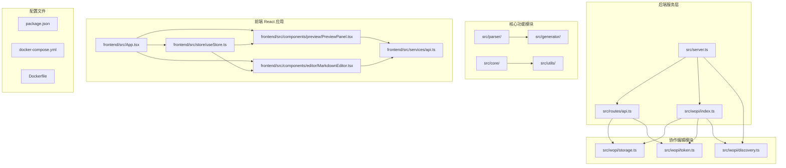
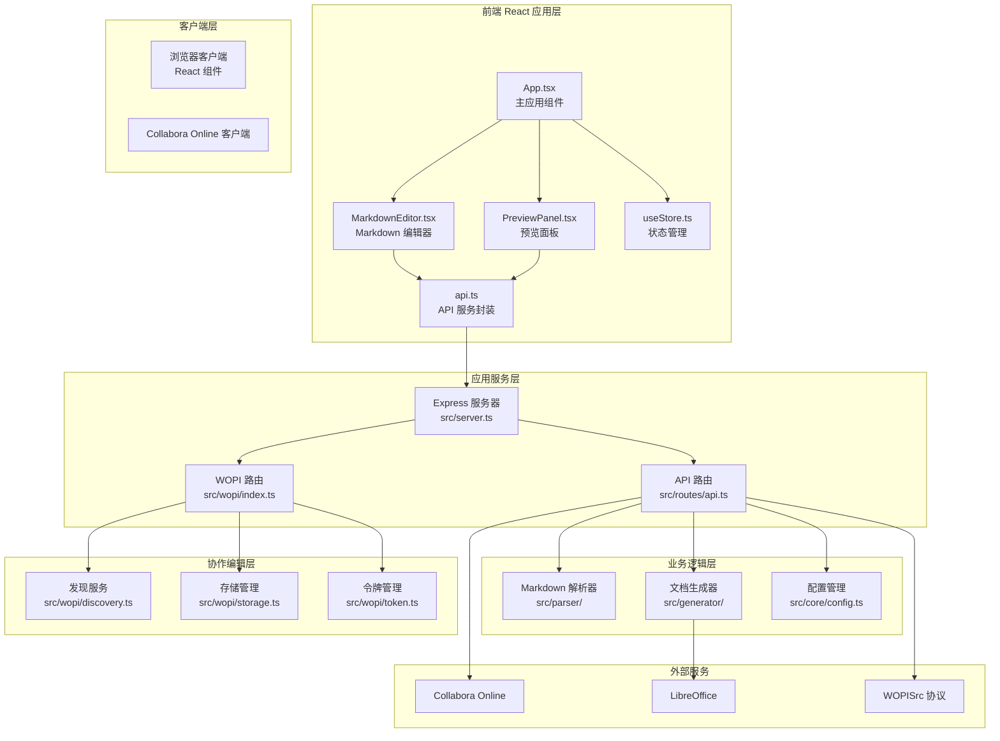
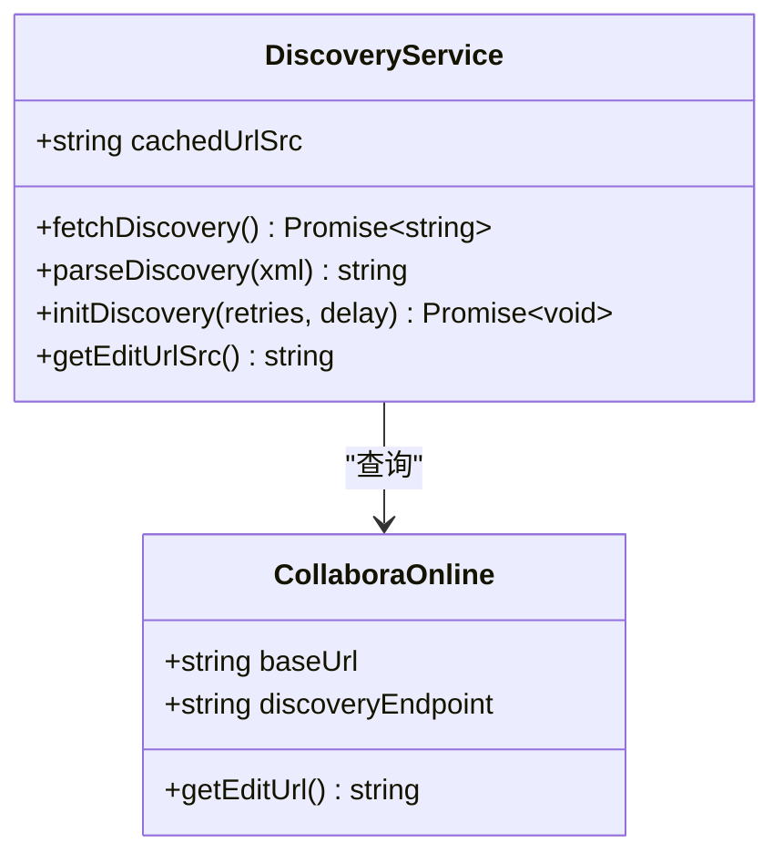
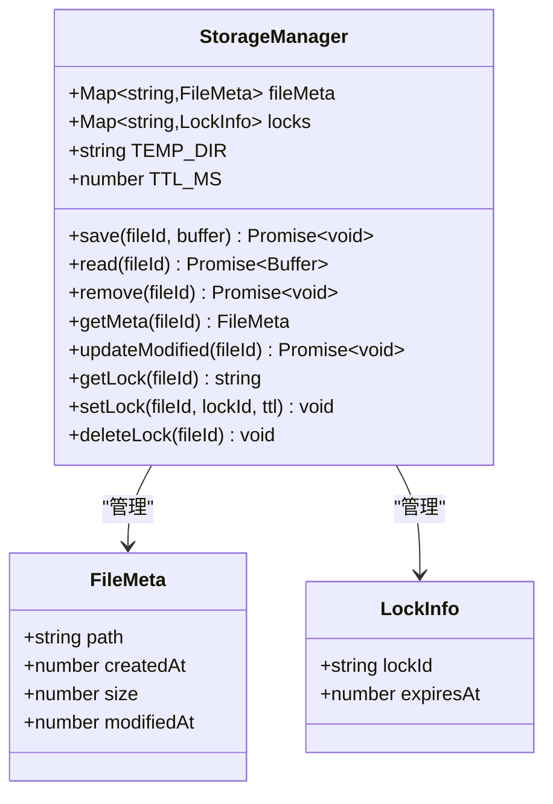
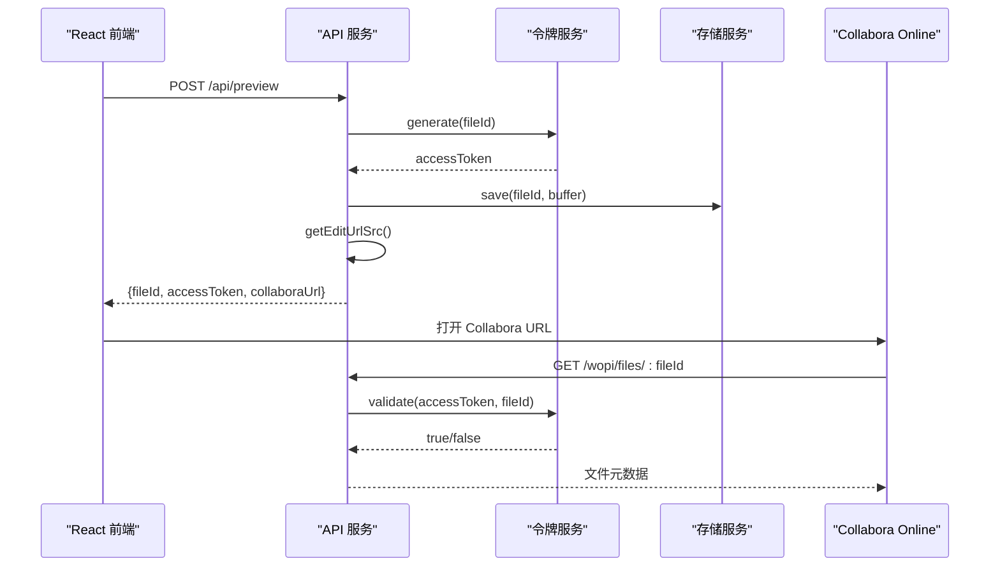
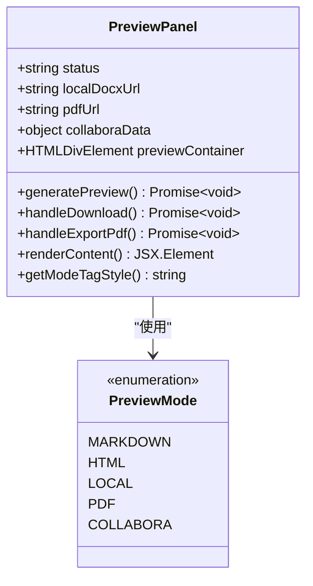
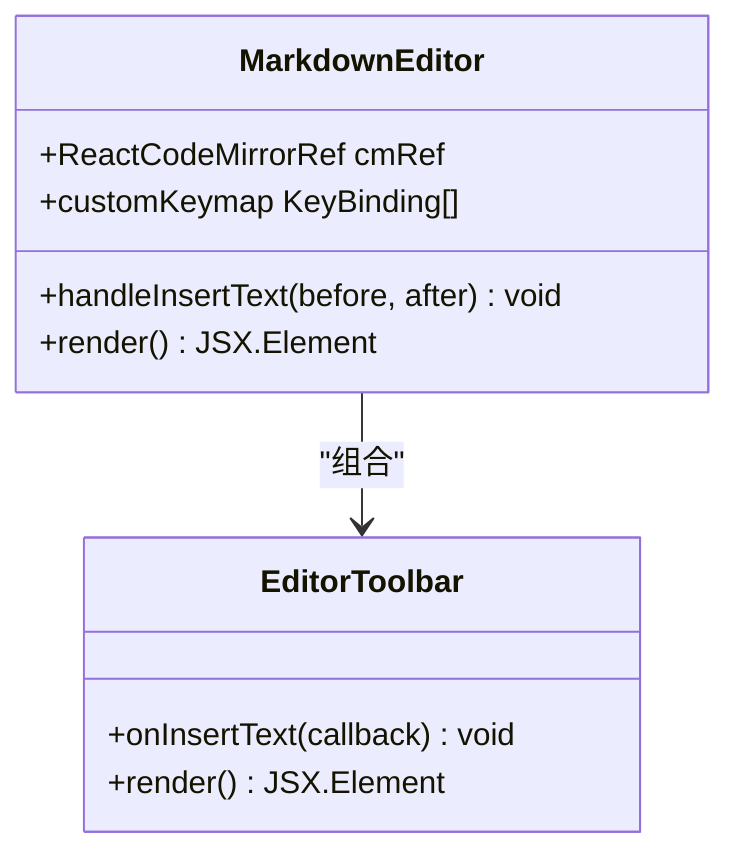
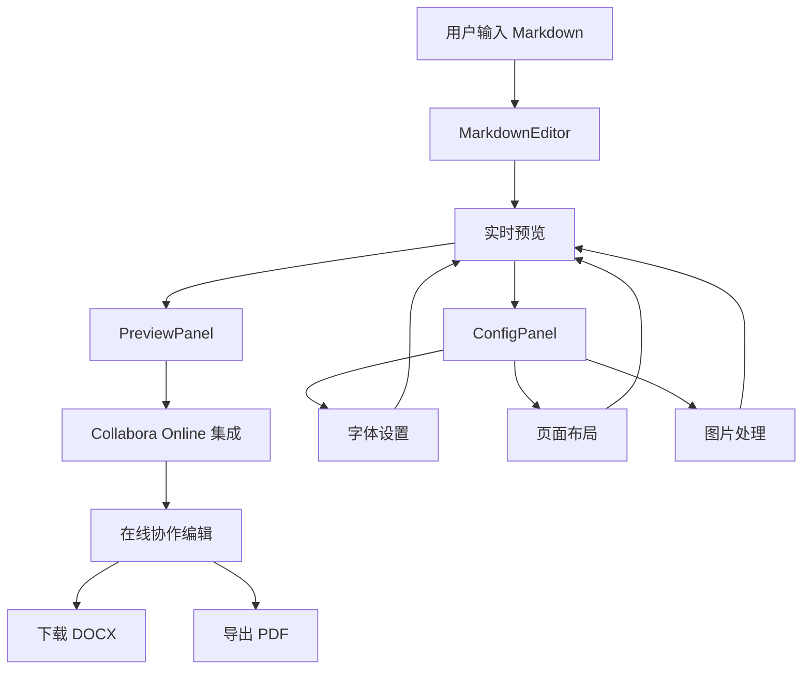

# Collabora Online 集成

<cite>
**本文档引用的文件**
- [package.json](file://package.json)
- [server.ts](file://src/server.ts)
- [api.ts](file://src/routes/api.ts)
- [discovery.ts](file://src/wopi/discovery.ts)
- [index.ts](file://src/wopi/index.ts)
- [storage.ts](file://src/wopi/storage.ts)
- [token.ts](file://src/wopi/token.ts)
- [index.html](file://public/index.html)
- [Dockerfile](file://Dockerfile)
- [docker-compose.yml](file://docker-compose.yml)
- [config.ts](file://src/core/config.ts)
- [document-builder.ts](file://src/generator/document-builder.ts)
- [PreviewPanel.tsx](file://frontend/src/components/preview/PreviewPanel.tsx)
- [App.tsx](file://frontend/src/App.tsx)
- [api.ts](file://frontend/src/services/api.ts)
- [useStore.ts](file://frontend/src/store/useStore.ts)
- [MarkdownEditor.tsx](file://frontend/src/components/editor/MarkdownEditor.tsx)
- [AppLayout.tsx](file://frontend/src/components/layout/AppLayout.tsx)
- [templates.ts](file://frontend/src/utils/templates.ts)
</cite>

## 更新摘要
**变更内容**
- 新增完整的 WOPI 协议实现，包括发现服务、令牌管理和存储系统
- 增强 Collabora Online 集成，支持实时协作编辑功能
- 添加 WOPISrc 协议支持，实现标准的在线文档编辑流程
- 优化前端集成，提供流畅的在线编辑体验
- 完善环境配置和容器化部署支持
- **新增 React 前端应用与 Collabora 集成的完整实现**

## 目录
1. [简介](#简介)
2. [项目结构](#项目结构)
3. [核心组件](#核心组件)
4. [架构概览](#架构概览)
5. [详细组件分析](#详细组件分析)
6. [前端 React 集成](#前端-react-集成)
7. [依赖关系分析](#依赖关系分析)
8. [性能考虑](#性能考虑)
9. [故障排除指南](#故障排除指南)
10. [结论](#结论)

## 简介

这是一个基于 TypeScript 的 Markdown 到 Word 文档转换器，集成了 Collabora Online 在线编辑功能。该系统允许用户通过 Web 界面实时编辑 Markdown 内容，并在 Collabora Online 中进行协作编辑。

**更新** 新增了完整的 WOPI（Web Application Open XML Interface）协议实现，支持标准的在线文档编辑流程，包括文件发现、令牌验证和协作编辑功能。**新增 React 前端应用与 Collabora 集成的完整实现**，提供现代化的三栏布局编辑界面，支持实时预览和协作编辑。

主要特性包括：
- 实时 Markdown 编辑和预览
- **完整的 WOPI 协议实现**
- **WOPISrc 协议支持**
- **React 前端应用集成**
- **Collabora Online 协作编辑**
- PDF 导出功能
- 可定制的文档样式配置
- Docker 容器化部署支持

## 项目结构

项目采用模块化架构设计，主要包含以下核心目录：



**图表来源**
- [server.ts:1-44](file://src/server.ts#L1-L44)
- [api.ts:1-127](file://src/routes/api.ts#L1-L127)
- [discovery.ts:1-58](file://src/wopi/discovery.ts#L1-L58)
- [App.tsx:1-68](file://frontend/src/App.tsx#L1-L68)
- [PreviewPanel.tsx:1-237](file://frontend/src/components/preview/PreviewPanel.tsx#L1-L237)

**章节来源**
- [package.json:1-51](file://package.json#L1-L51)
- [server.ts:1-44](file://src/server.ts#L1-L44)

## 核心组件

### 服务器架构

应用使用 Express.js 构建 RESTful API 服务，提供以下核心路由：

- `/api/convert` - 将 Markdown 转换为 DOCX 文件
- `/api/preview` - 创建 Collabora Online 预览会话
- `/api/files/:fileId/download` - 下载 DOCX 文件
- `/api/files/:fileId/export/pdf` - 导出 PDF 文件
- `/wopi/files/:fileId` - WOPI 协议端点

**更新** 新增了完整的 WOPI 协议端点，支持文件元数据管理、锁定机制和内容读写操作。

### WOPI 协议实现

系统实现了完整的 WOPI（Web Application Open XML Interface）协议，支持：

- **文件元数据管理** - 提供文件基本信息和权限控制
- **锁定机制** - 支持 LOCK/UNLOCK/REFRESH_LOCK 操作
- **文件内容读写** - 通过 WOPISrc 协议进行内容同步
- **访问令牌验证** - 基于 HMAC-SHA256 的安全令牌机制

### Collabora Online 集成

通过动态发现机制自动连接到 Collabora Online 服务，支持多种文档格式编辑。**更新** 新增了 WOPISrc 协议支持，实现标准的在线文档编辑流程。

**章节来源**
- [api.ts:15-127](file://src/routes/api.ts#L15-L127)
- [index.ts:1-112](file://src/wopi/index.ts#L1-L112)

## 架构概览

系统采用分层架构设计，各组件职责明确：



**图表来源**
- [server.ts:13-44](file://src/server.ts#L13-L44)
- [api.ts:1-127](file://src/routes/api.ts#L1-L127)
- [discovery.ts:38-58](file://src/wopi/discovery.ts#L38-L58)
- [App.tsx:43-63](file://frontend/src/App.tsx#L43-L63)

## 详细组件分析

### 发现服务组件

发现服务负责与 Collabora Online 进行通信，动态获取编辑 URL：



**更新** 发现服务现在支持重试机制和缓存策略，确保在 Collabora Online 服务启动延迟时仍能正常工作。

**图表来源**
- [discovery.ts:38-58](file://src/wopi/discovery.ts#L38-L58)

### 存储管理系统

存储系统管理临时文件和锁定状态：



**更新** 存储系统现在包含自动清理机制，定期删除过期文件，防止磁盘空间占用。

**图表来源**
- [storage.ts:9-81](file://src/wopi/storage.ts#L9-L81)

### 令牌验证系统

实现基于 HMAC-SHA256 的安全令牌机制：



**更新** 令牌系统现在支持自定义过期时间和安全密钥配置，提供更灵活的安全控制。

**图表来源**
- [api.ts:36-59](file://src/routes/api.ts#L36-L59)
- [token.ts:6-27](file://src/wopi/token.ts#L6-L27)

## 前端 React 集成

### 预览面板组件

预览面板是前端 React 应用的核心组件，提供多种预览模式：



**更新** 预览面板现在支持五种不同的预览模式：Markdown、HTML、本地 DOCX 预览、PDF 预览和 Collabora 在线编辑。

**图表来源**
- [PreviewPanel.tsx:11-237](file://frontend/src/components/preview/PreviewPanel.tsx#L11-L237)

### Markdown 编辑器组件

Markdown 编辑器提供丰富的编辑功能：



**更新** 编辑器集成了 CodeMirror 和自定义快捷键，支持粗体、斜体等格式化操作。

**图表来源**
- [MarkdownEditor.tsx:12-125](file://frontend/src/components/editor/MarkdownEditor.tsx#L12-L125)

### 应用布局组件

应用采用三栏布局设计，支持响应式调整：



**更新** 前端现在集成了 Collabora Online 的完整编辑功能，提供与桌面版 Word 相似的编辑体验。

**图表来源**
- [AppLayout.tsx:10-22](file://frontend/src/components/layout/AppLayout.tsx#L10-L22)
- [App.tsx:43-63](file://frontend/src/App.tsx#L43-L63)

**章节来源**
- [discovery.ts:1-58](file://src/wopi/discovery.ts#L1-L58)
- [storage.ts:1-81](file://src/wopi/storage.ts#L1-L81)
- [token.ts:1-27](file://src/wopi/token.ts#L1-L27)
- [PreviewPanel.tsx:1-237](file://frontend/src/components/preview/PreviewPanel.tsx#L1-L237)
- [MarkdownEditor.tsx:1-125](file://frontend/src/components/editor/MarkdownEditor.tsx#L1-L125)
- [App.tsx:1-68](file://frontend/src/App.tsx#L1-L68)

## 依赖关系分析

系统依赖关系图显示了核心模块间的交互：

```mermaid
graph LR
subgraph "后端运行时依赖"
A[express] --> B[服务器框架]
C[cors] --> D[跨域支持]
E[docx] --> F[DOCX 生成]
G[libreoffice-convert] --> H[PDF 转换]
I[markdown-it] --> J[Markdown 解析]
K[zod] --> L[配置验证]
M[fast-xml-parser] --> N[XML 解析]
O[libreoffice] --> P[LibreOffice 支持]
end
subgraph "前端运行时依赖"
Q[@uiw/react-codemirror] --> R[Markdown 编辑器]
S[docx-preview] --> T[DOCX 预览]
U[zustand] --> V[状态管理]
W[markdown-it] --> X[Markdown 渲染]
end
subgraph "开发依赖"
Y[tsup] --> Z[构建工具]
AA[vitest] --> AB[测试框架]
AC[typescript] --> AD[类型定义]
AE[vite] --> AF[前端构建]
end
subgraph "应用模块"
AG[server.ts] --> AH[api.ts]
AG --> AI[wopi/index.ts]
AJ[api.ts] --> AK[parser/]
AJ --> AL[generator/]
AJ --> AM[core/]
AI --> AN[discovery.ts]
AI --> AO[storage.ts]
AI --> AP[token.ts]
AQ[PreviewPanel.tsx] --> AR[api.ts]
AS[MarkdownEditor.tsx] --> AT[api.ts]
AU[App.tsx] --> AV[AppLayout.tsx]
AU --> AW[PreviewPanel.tsx]
AU --> AX[MarkdownEditor.tsx]
```

**更新** 新增了 fast-xml-parser 依赖用于解析 Collabora Online 的 discovery.xml 文件，以及前端依赖如 @uiw/react-codemirror、docx-preview 等。

**图表来源**
- [package.json:29-49](file://package.json#L29-L49)
- [server.ts:1-44](file://src/server.ts#L1-L44)
- [PreviewPanel.tsx:1-237](file://frontend/src/components/preview/PreviewPanel.tsx#L1-L237)

**章节来源**
- [package.json:1-51](file://package.json#L1-L51)

## 性能考虑

### 缓存策略
- **发现服务结果缓存** - 避免频繁网络请求，提高启动速度
- **文件 TTL 自动清理机制** - 防止磁盘空间占用，定期清理过期文件
- **锁定状态内存缓存** - 提高并发性能，减少数据库访问
- **前端状态缓存** - 使用 Zustand 进行高效的状态管理

**更新** 新增了前端状态缓存机制，使用 Zustand 提供高性能的状态管理。

### 并发处理
- 异步文件操作避免阻塞主线程
- Promise 包装 LibreOffice 转换操作
- 流式文件传输减少内存占用
- **React 异步渲染优化** - 使用 useCallback 和 useMemo 优化组件性能

### 资源优化
- Docker 容器化部署，资源隔离
- **前端响应式布局** - 适配不同设备，支持移动端
- **图片最大宽度限制** - 控制文件大小，优化加载性能
- **懒加载组件** - 减少初始包体积

## 故障排除指南

### 常见问题及解决方案

**Collabora Online 连接失败**
- 检查 `CODE_URL` 环境变量配置
- 确认 Docker Compose 服务正常运行
- 验证网络连通性和防火墙设置
- **检查发现服务初始化是否成功**

**文件上传失败**
- 检查 `TEMP_DIR` 权限设置
- 确认磁盘空间充足
- 验证文件大小限制（默认 10MB）
- **确认临时文件目录存在且可写**

**令牌验证错误**
- 检查 `WOPI_SECRET` 环境变量
- 验证令牌过期时间设置
- 确认客户端和服务端时间同步
- **检查令牌生成和验证逻辑**

**PDF 导出失败**
- 安装 LibreOffice 二进制文件
- 检查 `soffice` 可执行文件路径
- 验证 DOCX 文件格式正确性

**WOPISrc 协议错误**
- 确认 Collabora Online 版本兼容性
- 检查 WOPISrc 参数编码
- 验证访问令牌格式正确性

**前端 React 应用问题**
- **检查 Node.js 版本兼容性**
- **验证 Vite 构建配置**
- **确认 API 端点可达性**
- **检查 CORS 配置**

**章节来源**
- [server.ts:27-44](file://src/server.ts#L27-L44)
- [api.ts:90-127](file://src/routes/api.ts#L90-L127)

## 结论

该系统成功实现了 Markdown 到 Word 文档的转换，并集成了 Collabora Online 提供的在线协作编辑功能。通过模块化设计和清晰的架构分离，系统具备良好的可维护性和扩展性。

**更新** 新增的 WOPI 协议实现使系统完全符合标准的在线文档编辑规范，提供了企业级的协作编辑能力。**新增的 React 前端应用提供了现代化的用户界面和流畅的用户体验**。

主要优势包括：
- **完整的 WOPI 协议实现**
- **标准的 WOPISrc 协议支持**
- **现代化的 React 前端应用**
- **灵活的配置系统**
- **Docker 容器化部署支持**
- **用户友好的 Web 界面**
- **多格式导出能力**

未来可以考虑的功能增强：
- 支持更多文档格式
- 添加用户认证系统
- 实现更丰富的编辑功能
- 增加版本控制功能
- **支持多用户协作编辑**
- **增强实时同步机制**
- **添加离线编辑支持**
- **集成云存储服务**