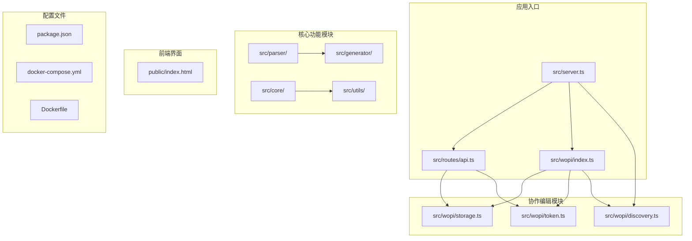
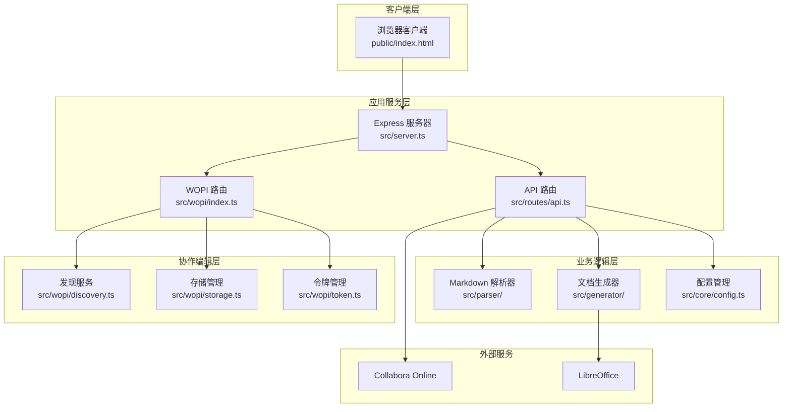
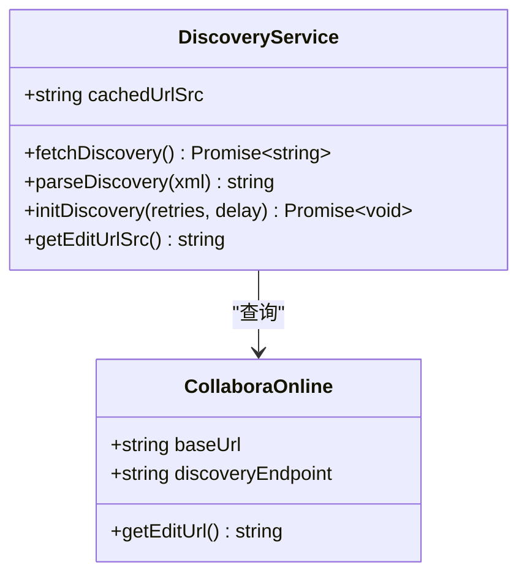
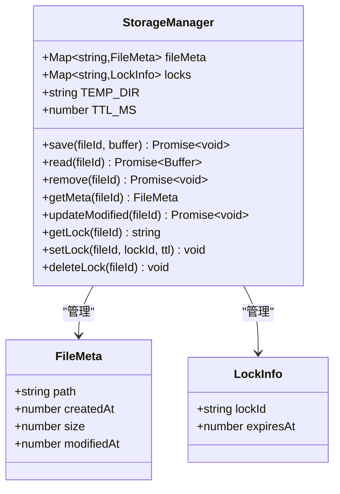
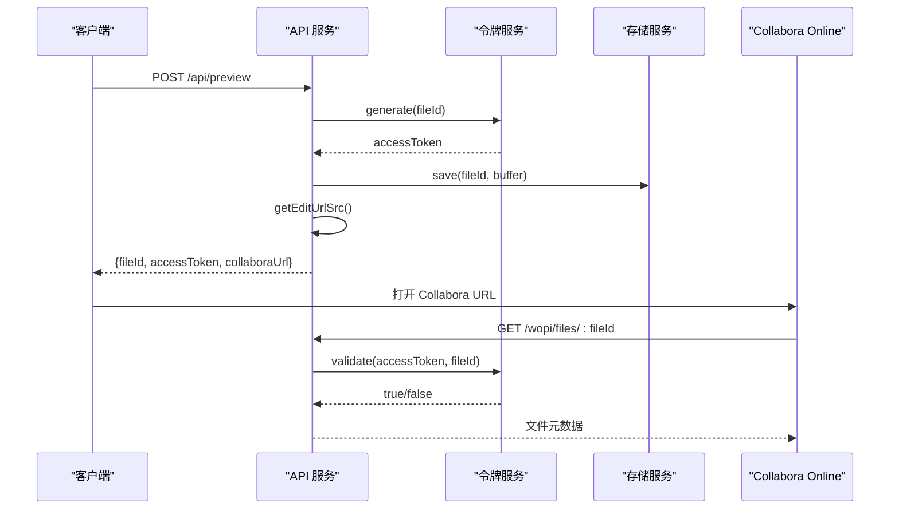
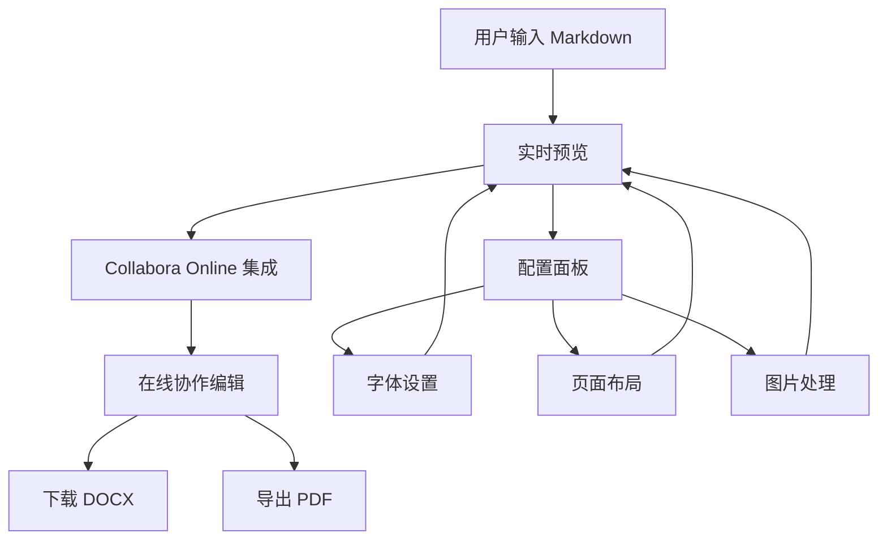
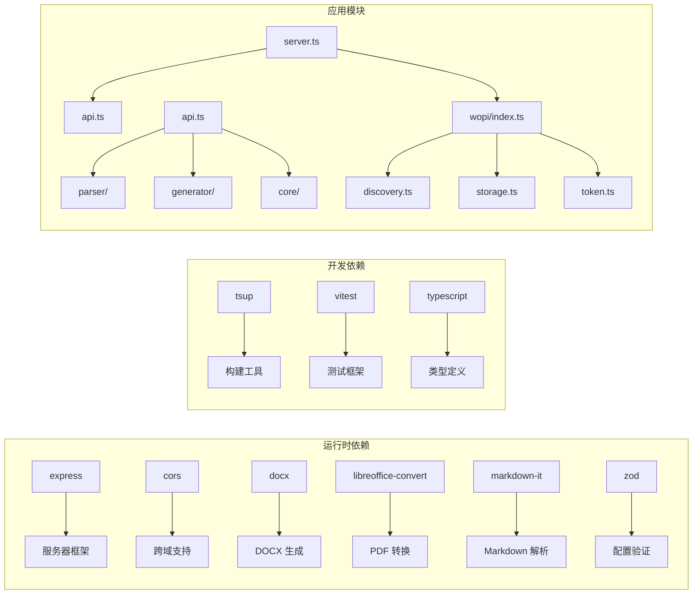

# Collabora Online 集成

<cite>
**本文档引用的文件**
- [package.json](file://package.json)
- [server.ts](file://src/server.ts)
- [api.ts](file://src/routes/api.ts)
- [discovery.ts](file://src/wopi/discovery.ts)
- [index.ts](file://src/wopi/index.ts)
- [storage.ts](file://src/wopi/storage.ts)
- [token.ts](file://src/wopi/token.ts)
- [index.html](file://public/index.html)
- [Dockerfile](file://Dockerfile)
- [docker-compose.yml](file://docker-compose.yml)
</cite>

## 目录
1. [简介](#简介)
2. [项目结构](#项目结构)
3. [核心组件](#核心组件)
4. [架构概览](#架构概览)
5. [详细组件分析](#详细组件分析)
6. [依赖关系分析](#依赖关系分析)
7. [性能考虑](#性能考虑)
8. [故障排除指南](#故障排除指南)
9. [结论](#结论)

## 简介

这是一个基于 TypeScript 的 Markdown 到 Word 文档转换器，集成了 Collabora Online 在线编辑功能。该系统允许用户通过 Web 界面实时编辑 Markdown 内容，并在 Collabora Online 中进行协作编辑。

主要特性包括：
- 实时 Markdown 编辑和预览
- Collabora Online 集成实现在线协作编辑
- PDF 导出功能
- 可定制的文档样式配置
- Docker 容器化部署支持

## 项目结构

项目采用模块化架构设计，主要包含以下核心目录：

**图表来源**
- [server.ts:1-40](file://src/server.ts#L1-L40)
- [api.ts:1-103](file://src/routes/api.ts#L1-L103)
- [discovery.ts:1-58](file://src/wopi/discovery.ts#L1-L58)

**章节来源**
- [package.json:1-51](file://package.json#L1-L51)
- [server.ts:1-40](file://src/server.ts#L1-L40)

## 核心组件

### 服务器架构

应用使用 Express.js 构建 RESTful API 服务，提供以下核心路由：

- `/api/convert` - 将 Markdown 转换为 DOCX 文件
- `/api/preview` - 创建 Collabora Online 预览会话
- `/api/files/:fileId/download` - 下载 DOCX 文件
- `/api/files/:fileId/export/pdf` - 导出 PDF 文件
- `/wopi/files/:fileId` - WOPI 协议端点

### WOPI 协议实现

系统实现了完整的 WOPI（Web Application Open XML Interface）协议，支持：

- 文件元数据管理
- 锁定机制（Lock/Unlock/Refresh Lock）
- 文件内容读写操作
- 访问令牌验证

### Collabora Online 集成

通过动态发现机制自动连接到 Collabora Online 服务，支持多种文档格式编辑。

**章节来源**
- [api.ts:15-103](file://src/routes/api.ts#L15-L103)
- [index.ts:1-112](file://src/wopi/index.ts#L1-L112)

## 架构概览

系统采用分层架构设计，各组件职责明确：

**图表来源**
- [server.ts:13-39](file://src/server.ts#L13-L39)
- [api.ts:1-103](file://src/routes/api.ts#L1-L103)
- [discovery.ts:38-57](file://src/wopi/discovery.ts#L38-L57)

## 详细组件分析

### 发现服务组件

发现服务负责与 Collabora Online 进行通信，动态获取编辑 URL：

**图表来源**
- [discovery.ts:38-57](file://src/wopi/discovery.ts#L38-L57)

### 存储管理系统

存储系统管理临时文件和锁定状态：

**图表来源**
- [storage.ts:9-80](file://src/wopi/storage.ts#L9-L80)

### 令牌验证系统

实现基于 HMAC-SHA256 的安全令牌机制：

**图表来源**
- [api.ts:36-59](file://src/routes/api.ts#L36-L59)
- [token.ts:6-26](file://src/wopi/token.ts#L6-L26)

### 前端集成组件

前端使用现代化的三栏布局设计，支持响应式调整：

**图表来源**
- [index.html:450-633](file://public/index.html#L450-L633)

**章节来源**
- [discovery.ts:1-58](file://src/wopi/discovery.ts#L1-L58)
- [storage.ts:1-81](file://src/wopi/storage.ts#L1-L81)
- [token.ts:1-27](file://src/wopi/token.ts#L1-L27)
- [index.html:1-633](file://public/index.html#L1-L633)

## 依赖关系分析

系统依赖关系图显示了核心模块间的交互：

**图表来源**
- [package.json:29-49](file://package.json#L29-L49)
- [server.ts:1-40](file://src/server.ts#L1-L40)

**章节来源**
- [package.json:1-51](file://package.json#L1-L51)

## 性能考虑

### 缓存策略
- 发现服务结果缓存，避免频繁网络请求
- 文件 TTL 自动清理机制，防止磁盘空间占用
- 锁定状态内存缓存，提高并发性能

### 并发处理
- 异步文件操作避免阻塞主线程
- Promise 包装 LibreOffice 转换操作
- 流式文件传输减少内存占用

### 资源优化
- Docker 容器化部署，资源隔离
- 前端响应式布局，适配不同设备
- 图片最大宽度限制，控制文件大小

## 故障排除指南

### 常见问题及解决方案

**Collabora Online 连接失败**
- 检查 `CODE_URL` 环境变量配置
- 确认 Docker Compose 服务正常运行
- 验证网络连通性和防火墙设置

**文件上传失败**
- 检查 `TEMP_DIR` 权限设置
- 确认磁盘空间充足
- 验证文件大小限制（默认 10MB）

**令牌验证错误**
- 检查 `WOPI_SECRET` 环境变量
- 验证令牌过期时间设置
- 确认客户端和服务端时间同步

**PDF 导出失败**
- 安装 LibreOffice 二进制文件
- 检查 `soffice` 可执行文件路径
- 验证 DOCX 文件格式正确性

**章节来源**
- [server.ts:27-39](file://src/server.ts#L27-L39)
- [api.ts:90-99](file://src/routes/api.ts#L90-L99)

## 结论

该系统成功实现了 Markdown 到 Word 文档的转换，并集成了 Collabora Online 提供的在线协作编辑功能。通过模块化设计和清晰的架构分离，系统具备良好的可维护性和扩展性。

主要优势包括：
- 完整的 WOPI 协议实现
- 灵活的配置系统
- Docker 容器化部署支持
- 用户友好的 Web 界面
- 多格式导出能力

未来可以考虑的功能增强：
- 支持更多文档格式
- 添加用户认证系统
- 实现更丰富的编辑功能
- 增加版本控制功能