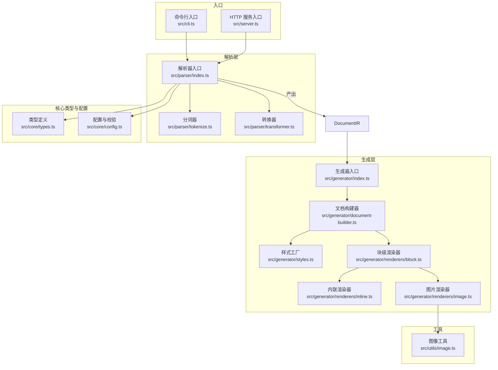
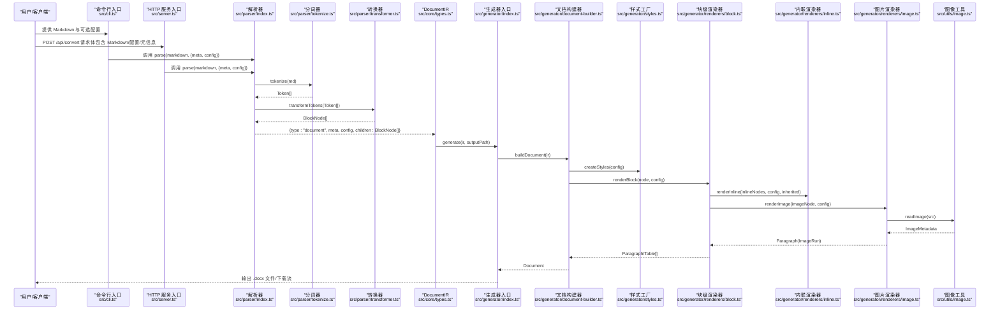
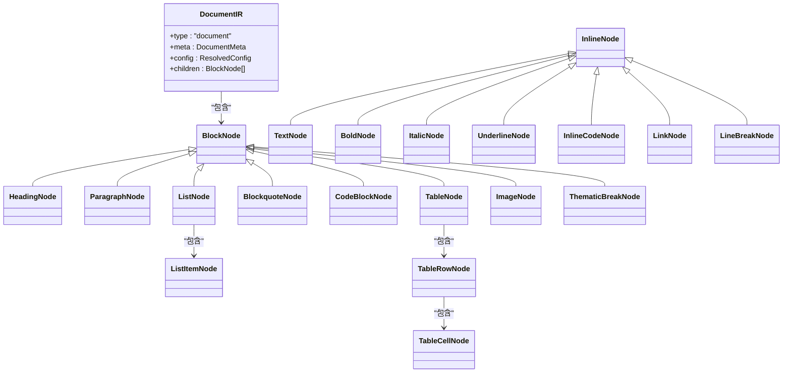
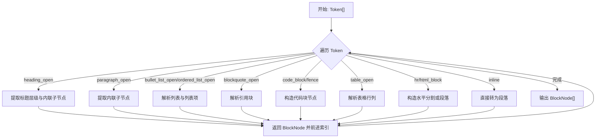
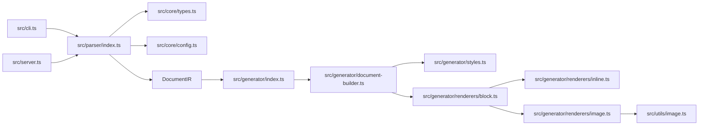

# 数据流分析

<cite>
**本文引用的文件**
- [src/index.ts](file://src/index.ts)
- [src/cli.ts](file://src/cli.ts)
- [src/server.ts](file://src/server.ts)
- [src/core/types.ts](file://src/core/types.ts)
- [src/core/config.ts](file://src/core/config.ts)
- [src/parser/index.ts](file://src/parser/index.ts)
- [src/parser/tokenize.ts](file://src/parser/tokenize.ts)
- [src/parser/transformer.ts](file://src/parser/transformer.ts)
- [src/generator/index.ts](file://src/generator/index.ts)
- [src/generator/document-builder.ts](file://src/generator/document-builder.ts)
- [src/generator/styles.ts](file://src/generator/styles.ts)
- [src/generator/renderers/block.ts](file://src/generator/renderers/block.ts)
- [src/generator/renderers/inline.ts](file://src/generator/renderers/inline.ts)
- [src/generator/renderers/image.ts](file://src/generator/renderers/image.ts)
- [src/utils/image.ts](file://src/utils/image.ts)
</cite>

## 目录
1. [简介](#简介)
2. [项目结构](#项目结构)
3. [核心组件](#核心组件)
4. [架构总览](#架构总览)
5. [详细组件分析](#详细组件分析)
6. [依赖分析](#依赖分析)
7. [性能考量](#性能考量)
8. [故障排查指南](#故障排查指南)
9. [结论](#结论)
10. [附录](#附录)

## 简介
本文件面向“从 Markdown 输入到 Word 输出”的端到端数据流，系统性追踪数据在各层之间的传递格式、转换规则与状态变化，重点分析中间表示 DocumentIR 的结构设计与节点关系，阐述样式信息的传递机制与应用时机，解释配置参数在整个数据流中的作用与影响，并给出关键转换点的实现细节与性能考量，为系统优化与调试提供数据流视角的技术支持。

## 项目结构
系统采用分层架构：CLI 与服务端作为入口，解析层负责将 Markdown 文本转为内部 IR，生成层将 IR 渲染为 docx 文档。工具模块提供图像处理与单位换算等通用能力。

图表来源
- [src/cli.ts:69-113](file://src/cli.ts#L69-L113)
- [src/server.ts:23-85](file://src/server.ts#L23-L85)
- [src/parser/index.ts:11-21](file://src/parser/index.ts#L11-L21)
- [src/parser/tokenize.ts:12-15](file://src/parser/tokenize.ts#L12-L15)
- [src/parser/transformer.ts:25-39](file://src/parser/transformer.ts#L25-L39)
- [src/core/types.ts:7-198](file://src/core/types.ts#L7-L198)
- [src/core/config.ts:68-91](file://src/core/config.ts#L68-L91)
- [src/generator/index.ts:7-18](file://src/generator/index.ts#L7-L18)
- [src/generator/document-builder.ts:17-106](file://src/generator/document-builder.ts#L17-L106)
- [src/generator/styles.ts:5-109](file://src/generator/styles.ts#L5-L109)
- [src/generator/renderers/block.ts:28-58](file://src/generator/renderers/block.ts#L28-L58)
- [src/generator/renderers/inline.ts:12-109](file://src/generator/renderers/inline.ts#L12-L109)
- [src/generator/renderers/image.ts:6-61](file://src/generator/renderers/image.ts#L6-L61)
- [src/utils/image.ts:12-42](file://src/utils/image.ts#L12-L42)

章节来源
- [src/index.ts:1-25](file://src/index.ts#L1-L25)
- [src/cli.ts:69-113](file://src/cli.ts#L69-L113)
- [src/server.ts:23-85](file://src/server.ts#L23-L85)
- [src/parser/index.ts:11-21](file://src/parser/index.ts#L11-L21)
- [src/core/types.ts:7-198](file://src/core/types.ts#L7-L198)
- [src/core/config.ts:68-91](file://src/core/config.ts#L68-L91)
- [src/generator/index.ts:7-18](file://src/generator/index.ts#L7-L18)
- [src/generator/document-builder.ts:17-106](file://src/generator/document-builder.ts#L17-L106)
- [src/generator/styles.ts:5-109](file://src/generator/styles.ts#L5-L109)
- [src/generator/renderers/block.ts:28-58](file://src/generator/renderers/block.ts#L28-L58)
- [src/generator/renderers/inline.ts:12-109](file://src/generator/renderers/inline.ts#L12-L109)
- [src/generator/renderers/image.ts:6-61](file://src/generator/renderers/image.ts#L6-L61)
- [src/utils/image.ts:12-42](file://src/utils/image.ts#L12-L42)

## 核心组件
- 入口与控制流
  - 命令行入口负责读取输入 Markdown、加载配置、调用解析与生成流程，并输出 .docx 文件。
  - HTTP 服务入口接收请求体中的 Markdown、配置与元信息，解析后生成 docx 或 PDF 预览。
- 解析层
  - 将 Markdown 文本解析为 MarkdownIt Token 序列，再转换为内部 BlockNode/InlineNode 树，最终封装为 DocumentIR。
- 生成层
  - 使用 docx 库将 DocumentIR 渲染为 Word 文档对象，写入缓冲区或文件；同时根据配置生成样式与页眉页脚。
- 工具层
  - 图像处理：支持本地与网络图片，使用 sharp 获取尺寸与元数据，计算缩放尺寸。
  - 单位换算：提供点数与 Word 内部单位的换算工具，确保排版精度。

章节来源
- [src/cli.ts:69-113](file://src/cli.ts#L69-L113)
- [src/server.ts:23-85](file://src/server.ts#L23-L85)
- [src/parser/index.ts:11-21](file://src/parser/index.ts#L11-L21)
- [src/generator/index.ts:7-18](file://src/generator/index.ts#L7-L18)
- [src/utils/image.ts:12-42](file://src/utils/image.ts#L12-L42)

## 架构总览
下图展示从 Markdown 到 Word 的完整数据流路径，包括数据格式、转换规则与状态变化。

图表来源
- [src/cli.ts:77-103](file://src/cli.ts#L77-L103)
- [src/server.ts:23-41](file://src/server.ts#L23-L41)
- [src/parser/index.ts:11-21](file://src/parser/index.ts#L11-L21)
- [src/parser/tokenize.ts:12-15](file://src/parser/tokenize.ts#L12-L15)
- [src/parser/transformer.ts:25-39](file://src/parser/transformer.ts#L25-L39)
- [src/core/types.ts:7-198](file://src/core/types.ts#L7-L198)
- [src/generator/index.ts:7-18](file://src/generator/index.ts#L7-L18)
- [src/generator/document-builder.ts:17-106](file://src/generator/document-builder.ts#L17-L106)
- [src/generator/styles.ts:5-109](file://src/generator/styles.ts#L5-L109)
- [src/generator/renderers/block.ts:28-58](file://src/generator/renderers/block.ts#L28-L58)
- [src/generator/renderers/inline.ts:12-109](file://src/generator/renderers/inline.ts#L12-L109)
- [src/generator/renderers/image.ts:6-61](file://src/generator/renderers/image.ts#L6-L61)
- [src/utils/image.ts:12-42](file://src/utils/image.ts#L12-L42)

## 详细组件分析

### DocumentIR 数据结构与节点关系
- 结构设计
  - 文档根节点包含类型标识、元信息、已解析配置与块级节点数组。
  - 块级节点涵盖标题、段落、列表、引用块、代码块、表格、图片与水平分割线等。
  - 内联节点涵盖文本、粗体、斜体、下划线、行内代码、链接与换行等。
- 节点关系
  - 标题节点包含内联子节点；列表项包含多个块级子节点；表格单元格包含一个默认段落以容纳内联内容。
- 复杂度
  - 解析阶段对 Token 序列进行一次线性扫描，时间复杂度 O(n)，空间复杂度 O(n)。
- 关键实现参考
  - [DocumentIR 定义:7-12](file://src/core/types.ts#L7-L12)
  - [块级节点联合类型:78-89](file://src/core/types.ts#L78-L89)
  - [内联节点联合类型:127-134](file://src/core/types.ts#L127-L134)

图表来源
- [src/core/types.ts:7-198](file://src/core/types.ts#L7-L198)

章节来源
- [src/core/types.ts:7-198](file://src/core/types.ts#L7-L198)

### 解析流程与转换规则
- 分词阶段
  - 使用 MarkdownIt 解析 Markdown，启用 commonmark 规范与表格扩展，生成 Token 序列。
- 转换阶段
  - 将 Token 序列映射为 BlockNode/InlineNode 树，处理嵌套结构（如列表、引用块、表格）与特殊 HTML 片段（提取图片与换行）。
- 关键实现参考
  - [解析入口与默认配置:11-21](file://src/parser/index.ts#L11-L21)
  - [分词器:12-15](file://src/parser/tokenize.ts#L12-L15)
  - [块级转换主循环与分支:25-122](file://src/parser/transformer.ts#L25-L122)
  - [内联转换与标签收集:238-332](file://src/parser/transformer.ts#L238-L332)

图表来源
- [src/parser/transformer.ts:25-39](file://src/parser/transformer.ts#L25-L39)
- [src/parser/transformer.ts:41-122](file://src/parser/transformer.ts#L41-L122)
- [src/parser/transformer.ts:124-236](file://src/parser/transformer.ts#L124-L236)
- [src/parser/transformer.ts:238-332](file://src/parser/transformer.ts#L238-L332)

章节来源
- [src/parser/index.ts:11-21](file://src/parser/index.ts#L11-L21)
- [src/parser/tokenize.ts:12-15](file://src/parser/tokenize.ts#L12-L15)
- [src/parser/transformer.ts:25-39](file://src/parser/transformer.ts#L25-L39)
- [src/parser/transformer.ts:41-122](file://src/parser/transformer.ts#L41-L122)
- [src/parser/transformer.ts:124-236](file://src/parser/transformer.ts#L124-L236)
- [src/parser/transformer.ts:238-332](file://src/parser/transformer.ts#L238-L332)

### 样式信息传递与应用时机
- 样式来源
  - 字体、字号、行距、段前段后间距、页边距、页面尺寸与方向、颜色、页眉页脚等均来自 ResolvedConfig。
- 应用时机
  - 样式工厂在构建文档时一次性创建段落样式集合，随后渲染器按需应用。
  - 块级渲染器在生成段落与表格时设置样式属性；内联渲染器在 TextRun 上叠加继承样式。
- 关键实现参考
  - [样式工厂与段落样式:5-109](file://src/generator/styles.ts#L5-L109)
  - [块级渲染器样式应用:60-197](file://src/generator/renderers/block.ts#L60-L197)
  - [内联渲染器样式叠加:12-109](file://src/generator/renderers/inline.ts#L12-L109)
  - [文档构建与样式注入:17-106](file://src/generator/document-builder.ts#L17-L106)

章节来源
- [src/generator/styles.ts:5-109](file://src/generator/styles.ts#L5-L109)
- [src/generator/renderers/block.ts:60-197](file://src/generator/renderers/block.ts#L60-L197)
- [src/generator/renderers/inline.ts:12-109](file://src/generator/renderers/inline.ts#L12-L109)
- [src/generator/document-builder.ts:17-106](file://src/generator/document-builder.ts#L17-L106)

### 配置参数的作用与影响
- 配置来源与合并
  - 支持通过 CLI/HTTP 接口传入配置，或使用默认配置；提供配置合并函数以覆盖基础配置。
- 影响范围
  - 字体与字号决定文本渲染；行距与段间距决定排版密度；页边距与页面尺寸决定页面布局；颜色与背景色决定视觉风格；页眉页脚决定文档元信息呈现。
- 关键实现参考
  - [配置 Schema 与默认值:54-81](file://src/core/config.ts#L54-81)
  - [配置合并:83-88](file://src/core/config.ts#L83-88)
  - [默认配置导出:90-91](file://src/core/config.ts#L90-91)
  - [CLI/服务端加载配置:82-88](file://src/cli.ts#L82-L88)
  - [服务端加载配置](file://src/server.ts:31-L35)

章节来源
- [src/core/config.ts:54-81](file://src/core/config.ts#L54-L81)
- [src/core/config.ts:83-88](file://src/core/config.ts#L83-L88)
- [src/core/config.ts:90-91](file://src/core/config.ts#L90-L91)
- [src/cli.ts:82-88](file://src/cli.ts#L82-L88)
- [src/server.ts:31-35](file://src/server.ts#L31-L35)

### 关键数据转换点与实现细节
- 解析到 IR
  - Token 到 BlockNode 的映射遵循 MarkdownIt 语义，HTML 片段被识别并转换为图片或段落。
  - 参考：[块级转换:41-122](file://src/parser/transformer.ts#L41-122)、[表格转换:182-236](file://src/parser/transformer.ts#L182-236)、[HTML 块处理:102-117](file://src/parser/transformer.ts#L102-L117)。
- IR 到文档对象
  - 文档构建器将 BlockNode 渲染为 Paragraph/Table，注入样式与页眉页脚；生成器将文档对象打包为 Buffer 并写出文件。
  - 参考：[文档构建:17-106](file://src/generator/document-builder.ts#L17-L106)、[生成器写入:7-18](file://src/generator/index.ts#L7-L18)。
- 图片渲染
  - 读取图片元数据，计算最大宽度与缩放比例，生成 ImageRun 并设置对齐与间距。
  - 参考：[图片渲染:6-61](file://src/generator/renderers/image.ts#L6-L61)、[图像工具:12-42](file://src/utils/image.ts#L12-L42)。

章节来源
- [src/parser/transformer.ts:41-122](file://src/parser/transformer.ts#L41-L122)
- [src/parser/transformer.ts:182-236](file://src/parser/transformer.ts#L182-L236)
- [src/parser/transformer.ts:102-117](file://src/parser/transformer.ts#L102-L117)
- [src/generator/document-builder.ts:17-106](file://src/generator/document-builder.ts#L17-L106)
- [src/generator/index.ts:7-18](file://src/generator/index.ts#L7-L18)
- [src/generator/renderers/image.ts:6-61](file://src/generator/renderers/image.ts#L6-L61)
- [src/utils/image.ts:12-42](file://src/utils/image.ts#L12-L42)

## 依赖分析
- 模块耦合
  - 解析层仅依赖 MarkdownIt Token 类型与核心类型定义，保持与渲染层解耦。
  - 生成层通过渲染器模块化组织，块级/内联/图片渲染器职责清晰，便于扩展。
- 外部依赖
  - docx：用于构建 Word 文档对象与打包。
  - sharp：用于图像元数据读取与尺寸计算。
  - LibreOffice（服务端预览）：用于将 docx 转 PDF。
- 关键依赖关系
  - CLI/服务端 → 解析器 → IR → 生成器 → docx。
  - 渲染器 → 样式工厂 → 配置。
  - 图片渲染器 → 图像工具 → sharp。

图表来源
- [src/cli.ts:69-113](file://src/cli.ts#L69-L113)
- [src/server.ts:23-85](file://src/server.ts#L23-L85)
- [src/parser/index.ts:11-21](file://src/parser/index.ts#L11-L21)
- [src/core/types.ts:7-198](file://src/core/types.ts#L7-L198)
- [src/core/config.ts:68-91](file://src/core/config.ts#L68-L91)
- [src/generator/index.ts:7-18](file://src/generator/index.ts#L7-L18)
- [src/generator/document-builder.ts:17-106](file://src/generator/document-builder.ts#L17-L106)
- [src/generator/styles.ts:5-109](file://src/generator/styles.ts#L5-L109)
- [src/generator/renderers/block.ts:28-58](file://src/generator/renderers/block.ts#L28-L58)
- [src/generator/renderers/inline.ts:12-109](file://src/generator/renderers/inline.ts#L12-L109)
- [src/generator/renderers/image.ts:6-61](file://src/generator/renderers/image.ts#L6-L61)
- [src/utils/image.ts:12-42](file://src/utils/image.ts#L12-L42)

章节来源
- [src/index.ts:1-25](file://src/index.ts#L1-L25)
- [src/cli.ts:69-113](file://src/cli.ts#L69-L113)
- [src/server.ts:23-85](file://src/server.ts#L23-L85)
- [src/parser/index.ts:11-21](file://src/parser/index.ts#L11-L21)
- [src/core/types.ts:7-198](file://src/core/types.ts#L7-L198)
- [src/core/config.ts:68-91](file://src/core/config.ts#L68-L91)
- [src/generator/index.ts:7-18](file://src/generator/index.ts#L7-L18)
- [src/generator/document-builder.ts:17-106](file://src/generator/document-builder.ts#L17-L106)
- [src/generator/styles.ts:5-109](file://src/generator/styles.ts#L5-L109)
- [src/generator/renderers/block.ts:28-58](file://src/generator/renderers/block.ts#L28-L58)
- [src/generator/renderers/inline.ts:12-109](file://src/generator/renderers/inline.ts#L12-L109)
- [src/generator/renderers/image.ts:6-61](file://src/generator/renderers/image.ts#L6-L61)
- [src/utils/image.ts:12-42](file://src/utils/image.ts#L12-L42)

## 性能考量
- 解析阶段
  - 单次 Token 线性扫描，时间复杂度 O(n)；建议对超长文档进行分块处理或流式解析以降低内存峰值。
- 渲染阶段
  - 样式工厂一次性创建，避免重复创建样式对象；块级/内联渲染器递归深度受文档结构限制，注意深层嵌套的栈开销。
- 图像处理
  - 图像读取与 sharp 元数据查询为 I/O 与 CPU 密集操作，建议缓存常见图片或限制并发数量；缩放计算为 O(1)。
- 打包与写出
  - docx 打包为同步/异步过程，大文档可能占用较多内存；建议使用流式写出或分段生成以降低内存压力。
- 配置与样式
  - 配置校验与默认填充在入口处完成，减少运行期分支判断成本；样式复用与继承可显著降低样式对象数量。

## 故障排查指南
- 解析错误
  - 现象：解析失败或部分结构丢失。
  - 排查：检查 MarkdownIt Token 是否正确生成，确认表格/HTML 片段是否被正确识别。
  - 参考：[分词器:12-15](file://src/parser/tokenize.ts#L12-L15)、[块级转换:41-122](file://src/parser/transformer.ts#L41-L122)。
- 生成错误
  - 现象：生成 docx 失败或样式异常。
  - 排查：确认 DocumentIR 结构完整，样式工厂与渲染器调用顺序正确；检查配置项是否越界。
  - 参考：[生成器:7-18](file://src/generator/index.ts#L7-L18)、[文档构建:17-106](file://src/generator/document-builder.ts#L17-L106)。
- 图像错误
  - 现象：图片无法显示或渲染异常。
  - 排查：检查图片 URL/路径是否可达，sharp 元数据读取是否成功；确认缩放比例与对齐设置。
  - 参考：[图像工具:12-42](file://src/utils/image.ts#L12-L42)、[图片渲染:6-61](file://src/generator/renderers/image.ts#L6-L61)。
- 配置错误
  - 现象：配置不生效或报错。
  - 排查：确认配置 Schema 校验通过，合并逻辑未被意外覆盖。
  - 参考：[配置校验与合并:54-88](file://src/core/config.ts#L54-L88)。

章节来源
- [src/parser/tokenize.ts:12-15](file://src/parser/tokenize.ts#L12-L15)
- [src/parser/transformer.ts:41-122](file://src/parser/transformer.ts#L41-L122)
- [src/generator/index.ts:7-18](file://src/generator/index.ts#L7-L18)
- [src/generator/document-builder.ts:17-106](file://src/generator/document-builder.ts#L17-L106)
- [src/utils/image.ts:12-42](file://src/utils/image.ts#L12-L42)
- [src/generator/renderers/image.ts:6-61](file://src/generator/renderers/image.ts#L6-L61)
- [src/core/config.ts:54-88](file://src/core/config.ts#L54-L88)

## 结论
该系统以清晰的分层架构实现了从 Markdown 到 Word 的端到端数据流：解析层将 Markdown 转为强类型的 DocumentIR，生成层基于配置与样式将 IR 渲染为 docx 文档。DocumentIR 的节点设计与转换规则保证了结构完整性，样式传递机制与应用时机确保了排版一致性。配置参数贯穿全链路，既提供灵活性又保障稳定性。通过模块化与工具化设计，系统具备良好的可扩展性与可维护性，适合进一步引入更多块级/内联元素与高级样式能力。

## 附录
- 入口导出与类型
  - [入口导出:1-25](file://src/index.ts#L1-L25)
- CLI 参数与帮助
  - [CLI 主流程:69-113](file://src/cli.ts#L69-L113)
- HTTP 接口说明
  - [转换接口:23-41](file://src/server.ts#L23-L41)
  - [预览接口:51-85](file://src/server.ts#L51-L85)