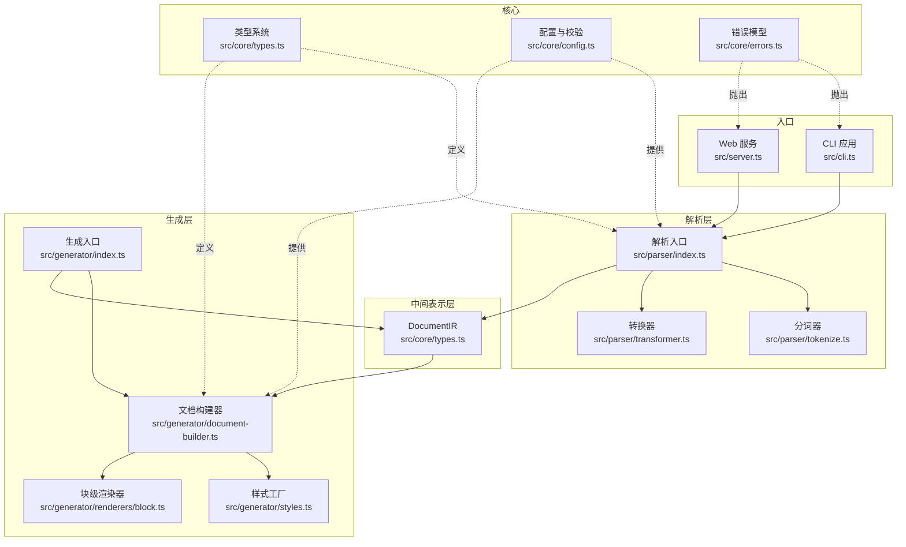
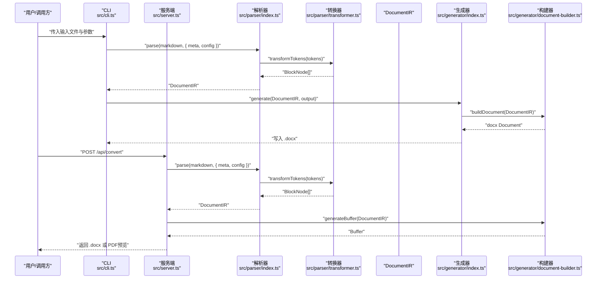
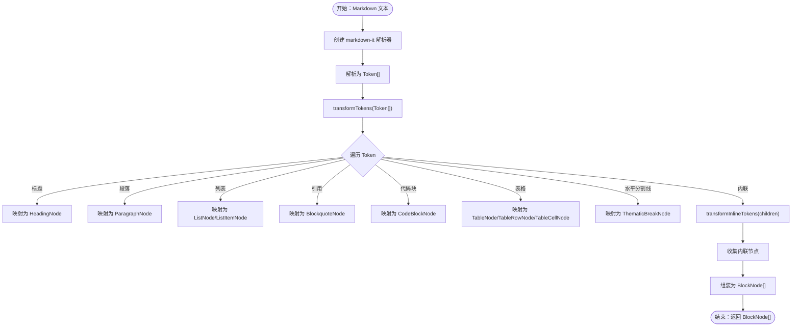
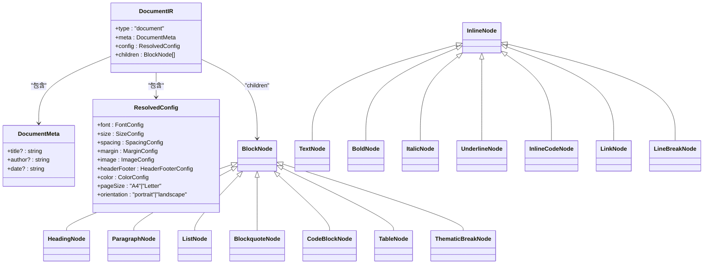
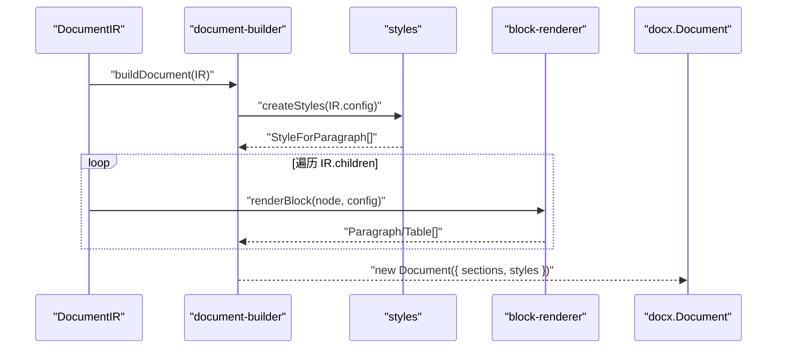
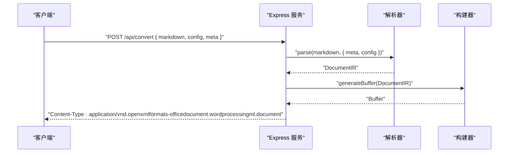
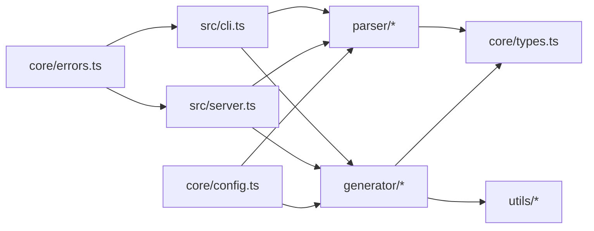

# 整体架构

<cite>
**本文引用的文件**
- [src/index.ts](file://src/index.ts)
- [src/cli.ts](file://src/cli.ts)
- [src/server.ts](file://src/server.ts)
- [src/parser/index.ts](file://src/parser/index.ts)
- [src/parser/tokenize.ts](file://src/parser/tokenize.ts)
- [src/parser/transformer.ts](file://src/parser/transformer.ts)
- [src/generator/index.ts](file://src/generator/index.ts)
- [src/generator/document-builder.ts](file://src/generator/document-builder.ts)
- [src/generator/styles.ts](file://src/generator/styles.ts)
- [src/generator/renderers/block.ts](file://src/generator/renderers/block.ts)
- [src/core/types.ts](file://src/core/types.ts)
- [src/core/config.ts](file://src/core/config.ts)
- [src/core/errors.ts](file://src/core/errors.ts)
- [package.json](file://package.json)
</cite>

## 目录
1. [引言](#引言)
2. [项目结构](#项目结构)
3. [核心组件](#核心组件)
4. [架构总览](#架构总览)
5. [详细组件分析](#详细组件分析)
6. [依赖关系分析](#依赖关系分析)
7. [性能考量](#性能考量)
8. [故障排查指南](#故障排查指南)
9. [结论](#结论)
10. [附录](#附录)

## 引言
本项目是一个“Markdown 到 Word（.docx）”转换器，采用三层架构设计：解析层（Parser Layer）、中间表示层（Intermediate Representation Layer）与生成层（Generator Layer）。其目标是通过清晰的职责分离与稳定的中间表示（DocumentIR），在不牺牲可扩展性与可维护性的前提下，实现从 Markdown 文本到结构化 Word 文档的高效转换。

## 项目结构
项目采用按功能域划分的模块化组织方式，核心模块、解析模块、生成模块与工具模块边界清晰，便于独立演进与测试。

- 核心模块（core）：定义类型系统、配置与错误模型，为上层提供统一契约。
- 解析模块（parser）：负责将 Markdown 文本解析为 Token 并转换为 DocumentIR。
- 生成模块（generator）：基于 DocumentIR 渲染为 docx 文档或 Buffer。
- 工具模块（utils）：提供单位换算等通用能力。
- 入口与集成：CLI 与 Web 服务分别调用解析与生成流程。

图表来源
- [src/cli.ts:69-112](file://src/cli.ts#L69-L112)
- [src/server.ts:23-84](file://src/server.ts#L23-L84)
- [src/parser/index.ts:11-21](file://src/parser/index.ts#L11-L21)
- [src/parser/tokenize.ts:12-15](file://src/parser/tokenize.ts#L12-L15)
- [src/parser/transformer.ts:25-38](file://src/parser/transformer.ts#L25-L38)
- [src/generator/index.ts:7-18](file://src/generator/index.ts#L7-L18)
- [src/generator/document-builder.ts:17-106](file://src/generator/document-builder.ts#L17-L106)
- [src/generator/styles.ts:5-109](file://src/generator/styles.ts#L5-L109)
- [src/generator/renderers/block.ts:28-58](file://src/generator/renderers/block.ts#L28-L58)
- [src/core/types.ts:7-12](file://src/core/types.ts#L7-L12)
- [src/core/config.ts:68-90](file://src/core/config.ts#L68-L90)
- [src/core/errors.ts:1-27](file://src/core/errors.ts#L1-L27)

章节来源
- [src/index.ts:1-25](file://src/index.ts#L1-L25)
- [package.json:11-18](file://package.json#L11-L18)

## 核心组件
- 类型系统与中间表示（DocumentIR）
  - DocumentIR 是整个系统的“事实唯一来源”，承载文档元信息、全局配置与块级节点树。
  - 块级节点与内联节点采用联合类型与明确的类型标记，确保模式匹配与可扩展性。
- 配置系统
  - 使用 Zod Schema 对配置进行强类型校验与默认值合并，支持运行时配置注入与覆盖。
- 错误模型
  - 针对解析、生成、图片处理与配置校验分别定义专用异常，便于定位问题与统一处理。

章节来源
- [src/core/types.ts:1-198](file://src/core/types.ts#L1-L198)
- [src/core/config.ts:68-90](file://src/core/config.ts#L68-L90)
- [src/core/errors.ts:1-27](file://src/core/errors.ts#L1-L27)

## 架构总览
三层架构自顶向下职责如下：
- 解析层（Parser Layer）
  - 输入：Markdown 字符串
  - 输出：DocumentIR
  - 关键点：使用 markdown-it 进行 Token 化，再由转换器映射为块/内联节点树。
- 中间表示层（Intermediate Representation Layer）
  - 输入：Token[]
  - 输出：BlockNode[]（最终汇聚到 DocumentIR）
  - 关键点：以 DocumentIR 为中心的数据结构，承载配置与元信息，屏蔽上层与下层差异。
- 生成层（Generator Layer）
  - 输入：DocumentIR
  - 输出：.docx 文件或 Buffer
  - 关键点：根据配置创建样式与页面布局，块级节点交由渲染器生成 docx 结构。

图表来源
- [src/cli.ts:69-112](file://src/cli.ts#L69-L112)
- [src/server.ts:23-84](file://src/server.ts#L23-L84)
- [src/parser/index.ts:11-21](file://src/parser/index.ts#L11-L21)
- [src/parser/transformer.ts:25-38](file://src/parser/transformer.ts#L25-L38)
- [src/generator/index.ts:7-18](file://src/generator/index.ts#L7-L18)
- [src/generator/document-builder.ts:17-111](file://src/generator/document-builder.ts#L17-L111)

## 详细组件分析

### 解析层（Parser Layer）
- 组件职责
  - 将 Markdown 文本解析为 Token 流，再转换为块级节点序列，最终封装为 DocumentIR。
- 关键流程
  - 分词：使用 markdown-it 创建解析器并启用表格等扩展。
  - 转换：遍历 Token，识别标题、段落、列表、引用、代码块、表格、水平分割线等，同时递归处理嵌套结构。
  - 内联：将 Token 子树映射为内联节点（文本、加粗、斜体、下划线、行内代码、链接、换行等）。
- 可扩展性
  - 新增语法可通过扩展 Token 类型与转换分支实现；保持现有转换器接口稳定。

图表来源
- [src/parser/tokenize.ts:12-15](file://src/parser/tokenize.ts#L12-L15)
- [src/parser/transformer.ts:25-360](file://src/parser/transformer.ts#L25-L360)

章节来源
- [src/parser/index.ts:11-21](file://src/parser/index.ts#L11-L21)
- [src/parser/tokenize.ts:12-15](file://src/parser/tokenize.ts#L12-L15)
- [src/parser/transformer.ts:25-360](file://src/parser/transformer.ts#L25-L360)

### 中间表示层（Intermediate Representation Layer）
- 设计理念
  - 以 DocumentIR 为核心载体，统一承载文档元信息、全局配置与块级节点树，屏蔽底层解析与生成细节。
  - 通过明确的类型约束（块/内联节点、配置对象）提升可读性与可维护性。
- 数据结构优势
  - 类型安全：利用 TypeScript 联合类型与字面量类型，减少运行期错误。
  - 可扩展：新增节点类型只需在联合类型中声明，不影响既有逻辑。
  - 易测试：IR 独立于具体实现，便于单元测试与快照验证。
- 层间接口
  - 解析层输出 BlockNode[]，封装为 DocumentIR。
  - 生成层消费 DocumentIR，按需访问 meta/config/children。

图表来源
- [src/core/types.ts:7-198](file://src/core/types.ts#L7-L198)

章节来源
- [src/core/types.ts:1-198](file://src/core/types.ts#L1-L198)

### 生成层（Generator Layer）
- 组件职责
  - 将 DocumentIR 渲染为 docx 文档：构建样式、页眉页脚、页面布局与块级内容。
- 关键流程
  - 样式：根据配置创建段落样式（标题、正文、代码块、引用）。
  - 块渲染：将 BlockNode 转换为 Paragraph/Table，内联节点转为 TextRun。
  - 文档装配：设置页边距、方向、页眉页脚与页面属性，输出 Document。
- 可扩展性
  - 新增块类型：在渲染器中添加对应分支；更新样式工厂以适配新样式需求。
  - 多输出：除 .docx 外，可复用 IR 生成 PDF（服务端已演示）。

图表来源
- [src/generator/document-builder.ts:17-106](file://src/generator/document-builder.ts#L17-L106)
- [src/generator/styles.ts:5-109](file://src/generator/styles.ts#L5-L109)
- [src/generator/renderers/block.ts:28-58](file://src/generator/renderers/block.ts#L28-L58)

章节来源
- [src/generator/index.ts:7-18](file://src/generator/index.ts#L7-L18)
- [src/generator/document-builder.ts:17-111](file://src/generator/document-builder.ts#L17-L111)
- [src/generator/styles.ts:1-122](file://src/generator/styles.ts#L1-L122)
- [src/generator/renderers/block.ts:1-266](file://src/generator/renderers/block.ts#L1-L266)

### 入口与集成
- CLI
  - 读取文件、加载配置、调用解析与生成，输出 .docx。
- Web 服务
  - 提供转换与预览接口：转换返回 .docx，预览通过 LibreOffice 转 PDF。
  - 健康检查接口用于服务状态监控。

图表来源
- [src/server.ts:23-49](file://src/server.ts#L23-L49)

章节来源
- [src/cli.ts:69-112](file://src/cli.ts#L69-L112)
- [src/server.ts:1-94](file://src/server.ts#L1-L94)

## 依赖关系分析
- 模块耦合
  - 解析层与生成层均依赖核心类型系统，降低耦合度。
  - 生成层内部通过样式工厂与块渲染器解耦，利于扩展。
- 外部依赖
  - markdown-it：强大的 Markdown 解析与 Token 化。
  - docx：生成 .docx 的核心库。
  - zod：配置校验与默认值合并。
  - express/cors/libreoffice：服务端能力（HTTP 与 PDF 预览）。

图表来源
- [src/parser/index.ts:1-24](file://src/parser/index.ts#L1-L24)
- [src/generator/index.ts:1-21](file://src/generator/index.ts#L1-L21)
- [src/core/types.ts:1-198](file://src/core/types.ts#L1-L198)
- [src/core/config.ts:68-90](file://src/core/config.ts#L68-L90)
- [src/core/errors.ts:1-27](file://src/core/errors.ts#L1-L27)
- [src/cli.ts:1-113](file://src/cli.ts#L1-L113)
- [src/server.ts:1-94](file://src/server.ts#L1-L94)

章节来源
- [package.json:27-45](file://package.json#L27-L45)

## 性能考量
- 解析阶段
  - markdown-it 的 Token 化与转换器的线性扫描均为 O(n)；复杂表格与深层嵌套会增加常数因子。
  - 建议：对超大文档进行分块处理或流式渲染（当前实现未采用）。
- 生成阶段
  - 样式一次性创建，块渲染逐节点生成；整体 O(n)。
  - 图片处理：当前内联渲染为替代文本，避免阻塞；如需内嵌图片，建议异步与缓存策略。
- I/O 与内存
  - CLI 直接写文件，服务端生成 Buffer 后直接返回，避免多余拷贝。
  - 建议：对超大文档限制并发与内存峰值，必要时采用流式写入。

## 故障排查指南
- 常见错误与定位
  - 解析错误：MarkdownParseError，通常由不兼容语法或解析器配置引起。
  - 生成错误：DocxGenerationError，多为 docx 库内部异常或配置不当。
  - 图片处理：ImageProcessingError，关注资源路径与格式。
  - 配置校验：ConfigValidationError，检查字段类型与范围。
- 服务端提示
  - 预览 PDF 依赖 LibreOffice，若缺失会返回 503 并给出安装指引。
- 建议排查步骤
  - 逐步缩小范围：先确认 CLI 正常，再验证服务端。
  - 打印 IR 快照：在转换前后输出 DocumentIR，核对结构与配置。
  - 降级配置：临时移除复杂样式或表格，确认是否为特定元素导致。

章节来源
- [src/core/errors.ts:1-27](file://src/core/errors.ts#L1-L27)
- [src/server.ts:71-84](file://src/server.ts#L71-L84)

## 结论
该架构以 DocumentIR 为核心，实现了解析、中间表示与生成的清晰分层，具备良好的可扩展性与可维护性。通过强类型与配置校验保障质量，结合 CLI 与服务端入口满足多样化使用场景。未来可在超大文档处理、图片内嵌与样式模板化等方面进一步增强。

## 附录
- 入口导出
  - 解析：parse
  - 生成：generate、buildDocument
  - 配置：createConfig、mergeConfig、defaultConfig、configSchema
  - 类型：DocumentIR、DocumentMeta、BlockNode、InlineNode 等
  - 错误：MarkdownParseError、DocxGenerationError、ImageProcessingError、ConfigValidationError

章节来源
- [src/index.ts:1-25](file://src/index.ts#L1-L25)