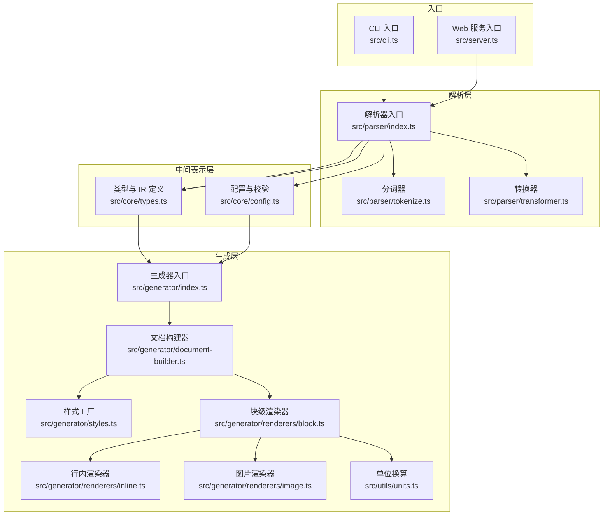
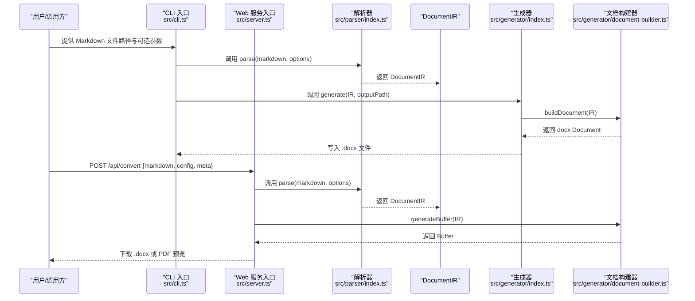
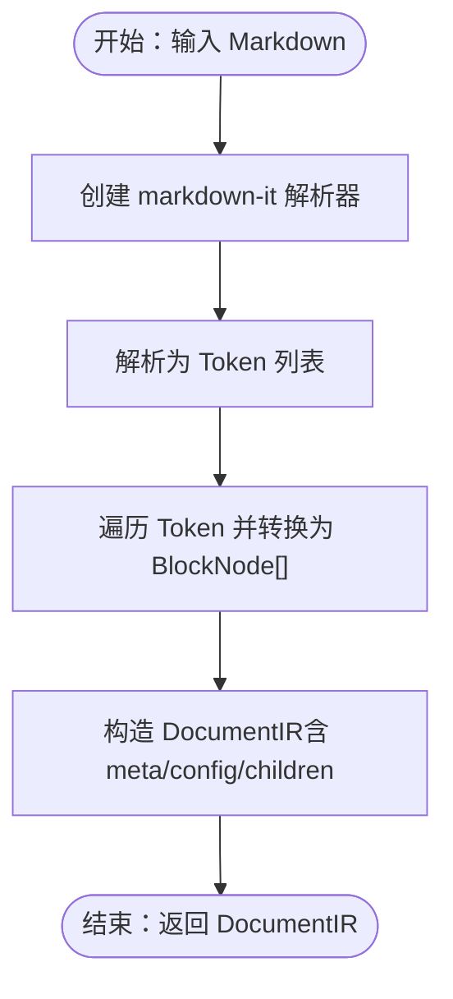
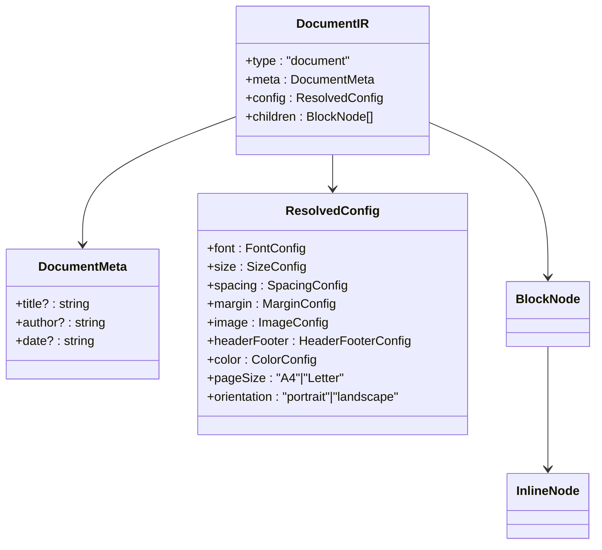
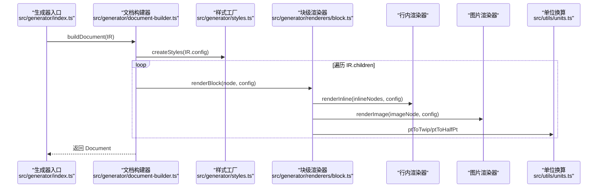
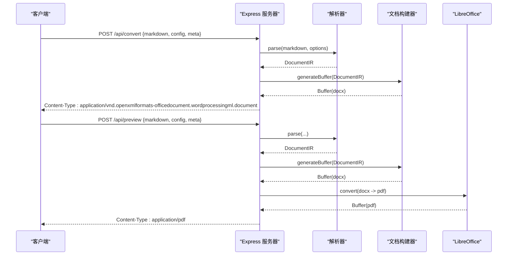
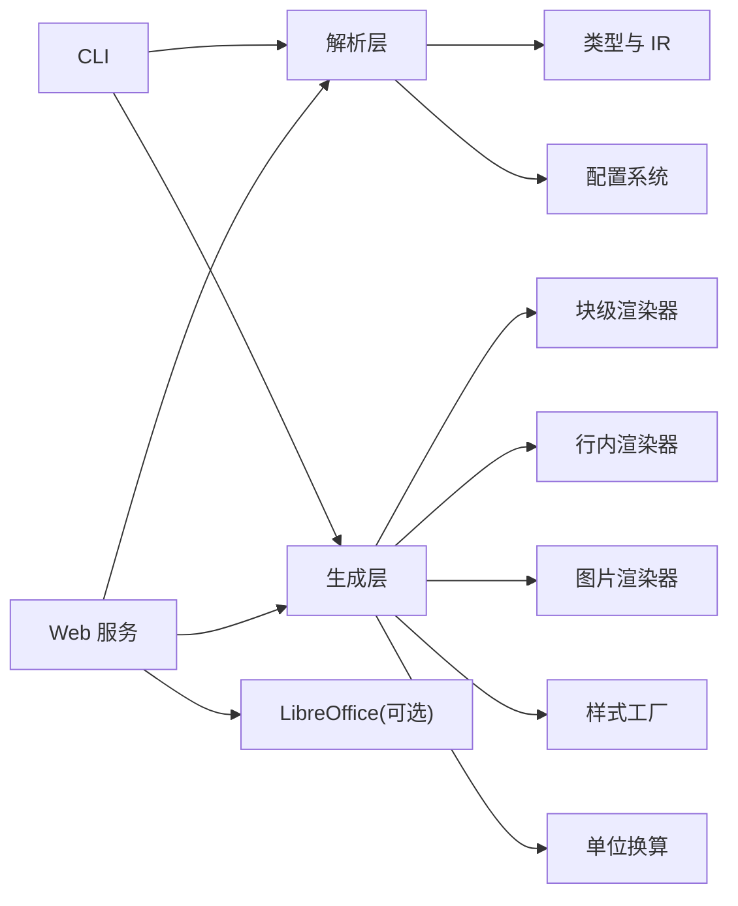

# 架构设计

<cite>
**本文引用的文件**
- [src/index.ts](file://src/index.ts)
- [src/cli.ts](file://src/cli.ts)
- [src/server.ts](file://src/server.ts)
- [src/parser/index.ts](file://src/parser/index.ts)
- [src/parser/tokenize.ts](file://src/parser/tokenize.ts)
- [src/parser/transformer.ts](file://src/parser/transformer.ts)
- [src/generator/index.ts](file://src/generator/index.ts)
- [src/generator/document-builder.ts](file://src/generator/document-builder.ts)
- [src/generator/styles.ts](file://src/generator/styles.ts)
- [src/generator/renderers/block.ts](file://src/generator/renderers/block.ts)
- [src/generator/renderers/image.ts](file://src/generator/renderers/image.ts)
- [src/generator/renderers/inline.ts](file://src/generator/renderers/inline.ts)
- [src/core/types.ts](file://src/core/types.ts)
- [src/core/config.ts](file://src/core/config.ts)
- [src/core/errors.ts](file://src/core/errors.ts)
- [src/utils/units.ts](file://src/utils/units.ts)
- [package.json](file://package.json)
</cite>

## 目录
1. [引言](#引言)
2. [项目结构](#项目结构)
3. [核心组件](#核心组件)
4. [架构总览](#架构总览)
5. [详细组件分析](#详细组件分析)
6. [依赖分析](#依赖分析)
7. [性能考量](#性能考量)
8. [故障排查指南](#故障排查指南)
9. [结论](#结论)
10. [附录](#附录)

## 引言
本项目是一个“Markdown 到 Word（.docx）”转换器，采用三层架构：解析层（Parser）、中间表示层（DocumentIR）、生成层（Generator）。其核心设计理念是通过统一的中间表示（DocumentIR）隔离输入与输出格式差异，使解析与渲染解耦；同时以模块化渲染器与配置体系支持可定制样式与布局。系统同时提供 CLI 与 Web 服务两种入口，并通过可选的 LibreOffice 预览能力增强用户体验。

## 项目结构
项目采用按功能域划分的目录组织方式，核心模块如下：
- 核心类型与配置：定义 DocumentIR 结构、块级与行内节点类型、样式配置等
- 解析器：负责将 Markdown 文本解析为 Token，再转换为 DocumentIR
- 生成器：将 DocumentIR 渲染为 docx 文档，支持样式注入与页眉页脚
- 渲染器：按块级与行内节点类型分别渲染为 docx 对象
- 工具与适配：单位换算、图片处理等
- 入口：CLI 与 Web 服务

图表来源
- [src/cli.ts:1-113](file://src/cli.ts#L1-L113)
- [src/server.ts:1-94](file://src/server.ts#L1-L94)
- [src/parser/index.ts:1-24](file://src/parser/index.ts#L1-L24)
- [src/parser/tokenize.ts:1-16](file://src/parser/tokenize.ts#L1-L16)
- [src/parser/transformer.ts:1-360](file://src/parser/transformer.ts#L1-L360)
- [src/core/types.ts:1-198](file://src/core/types.ts#L1-L198)
- [src/core/config.ts:1-91](file://src/core/config.ts#L1-L91)
- [src/generator/index.ts:1-21](file://src/generator/index.ts#L1-L21)
- [src/generator/document-builder.ts:1-112](file://src/generator/document-builder.ts#L1-L112)
- [src/generator/styles.ts:1-122](file://src/generator/styles.ts#L1-L122)
- [src/generator/renderers/block.ts:1-266](file://src/generator/renderers/block.ts#L1-L266)
- [src/generator/renderers/inline.ts](file://src/generator/renderers/inline.ts)
- [src/generator/renderers/image.ts](file://src/generator/renderers/image.ts)
- [src/utils/units.ts](file://src/utils/units.ts)

章节来源
- [src/index.ts:1-25](file://src/index.ts#L1-L25)
- [package.json:1-47](file://package.json#L1-L47)

## 核心组件
- 中间表示（DocumentIR）：统一承载文档元信息、配置与块级节点序列，作为解析与生成之间的契约
- 解析器（Parser）：基于 markdown-it 的 Token 化与自定义转换逻辑，产出 DocumentIR
- 生成器（Generator）：将 DocumentIR 渲染为 docx，注入样式、页眉页脚与页面属性
- 渲染器（Renderers）：按节点类型将 IR 映射到 docx 对象（段落、表格、文本运行等）
- 配置系统（Config）：使用 Zod 进行强类型校验与默认值合并，支持字体、字号、间距、边距、颜色、页型等

章节来源
- [src/core/types.ts:1-198](file://src/core/types.ts#L1-L198)
- [src/core/config.ts:1-91](file://src/core/config.ts#L1-L91)
- [src/parser/index.ts:1-24](file://src/parser/index.ts#L1-L24)
- [src/generator/index.ts:1-21](file://src/generator/index.ts#L1-L21)

## 架构总览
系统采用“解析 → IR → 渲染”的流水线式架构，强调：
- 解析与渲染分离：解析层仅负责结构化，生成层仅负责输出
- IR 稳定性：IR 不随底层渲染库变化而变化
- 可插拔渲染器：块级/行内/图片渲染器职责单一，便于替换与扩展
- 配置驱动：所有样式与布局由配置驱动，便于主题化与模板化

图表来源
- [src/cli.ts:69-113](file://src/cli.ts#L69-L113)
- [src/server.ts:23-85](file://src/server.ts#L23-L85)
- [src/parser/index.ts:11-21](file://src/parser/index.ts#L11-L21)
- [src/generator/index.ts:7-18](file://src/generator/index.ts#L7-L18)
- [src/generator/document-builder.ts:17-106](file://src/generator/document-builder.ts#L17-L106)

## 详细组件分析

### 解析层（Parser）
- 分词器：基于 markdown-it 创建解析器，启用 commonmark 规范与表格扩展，输出 Token 序列
- 转换器：遍历 Token，按类型映射为块级/行内节点，递归处理列表、引用、表格等复合结构
- 解析入口：接收 Markdown 字符串与可选元信息/配置，返回 DocumentIR

图表来源
- [src/parser/tokenize.ts:4-15](file://src/parser/tokenize.ts#L4-L15)
- [src/parser/transformer.ts:25-39](file://src/parser/transformer.ts#L25-L39)
- [src/parser/index.ts:11-21](file://src/parser/index.ts#L11-L21)

章节来源
- [src/parser/tokenize.ts:1-16](file://src/parser/tokenize.ts#L1-L16)
- [src/parser/transformer.ts:1-360](file://src/parser/transformer.ts#L1-L360)
- [src/parser/index.ts:1-24](file://src/parser/index.ts#L1-L24)

### 中间表示层（DocumentIR）
- 文档根节点包含类型标识、元信息（标题/作者/日期）、已解析的块级节点数组
- 块级节点涵盖标题、段落、列表（有序/无序）、列表项、引用块、代码块、表格、单元格、图片、分隔线
- 行内节点涵盖文本、粗体、斜体、下划线、行内代码、链接、换行
- 配置对象集中管理字体、字号、间距、边距、图片、页眉页脚、颜色、纸张尺寸与方向

图表来源
- [src/core/types.ts:1-198](file://src/core/types.ts#L1-L198)

章节来源
- [src/core/types.ts:1-198](file://src/core/types.ts#L1-L198)

### 生成层（Generator）
- 生成器入口：接收 DocumentIR 与输出路径，构建 docx 并写入文件
- 文档构建器：根据配置创建样式、页眉页脚、页面属性，遍历 IR 的块级节点进行渲染
- 样式工厂：基于配置生成段落样式（标题、正文、代码块、引用），注入到文档
- 块级渲染器：将 IR 节点映射为 Paragraph/Table 等 docx 对象，处理缩进、边框、着色等
- 行内渲染器：将行内节点映射为 TextRun，处理字体、大小、颜色、斜体/粗体等
- 图片渲染器：处理图片对齐、尺寸与占位符回退

图表来源
- [src/generator/index.ts:7-18](file://src/generator/index.ts#L7-L18)
- [src/generator/document-builder.ts:17-106](file://src/generator/document-builder.ts#L17-L106)
- [src/generator/styles.ts:5-109](file://src/generator/styles.ts#L5-L109)
- [src/generator/renderers/block.ts:28-58](file://src/generator/renderers/block.ts#L28-L58)
- [src/utils/units.ts](file://src/utils/units.ts)

章节来源
- [src/generator/index.ts:1-21](file://src/generator/index.ts#L1-L21)
- [src/generator/document-builder.ts:1-112](file://src/generator/document-builder.ts#L1-L112)
- [src/generator/styles.ts:1-122](file://src/generator/styles.ts#L1-L122)
- [src/generator/renderers/block.ts:1-266](file://src/generator/renderers/block.ts#L1-L266)

### 模块化设计与模式应用
- 渲染器模式：块级/行内/图片渲染器职责清晰，遵循“多态接口 + 统一调用”的模式，便于替换与扩展
- 工厂模式：样式工厂根据配置动态生成段落样式；配置工厂使用 Zod schema 进行校验与默认值合并
- 中间表示模式：DocumentIR 作为跨层契约，屏蔽底层渲染细节，提升可测试性与可维护性

章节来源
- [src/generator/styles.ts:5-109](file://src/generator/styles.ts#L5-L109)
- [src/core/config.ts:68-91](file://src/core/config.ts#L68-L91)
- [src/core/types.ts:7-12](file://src/core/types.ts#L7-L12)

### 入口与集成
- CLI：读取文件、加载配置、调用解析与生成，输出 .docx
- Web 服务：提供 /api/convert 与 /api/preview 接口，支持 PDF 预览（依赖 LibreOffice）
- 导出入口：统一从 src/index.ts 导出 parse/generate/buildDocument 与类型/错误

图表来源
- [src/server.ts:23-85](file://src/server.ts#L23-L85)
- [src/generator/document-builder.ts:108-112](file://src/generator/document-builder.ts#L108-L112)

章节来源
- [src/cli.ts:1-113](file://src/cli.ts#L1-L113)
- [src/server.ts:1-94](file://src/server.ts#L1-L94)
- [src/index.ts:1-25](file://src/index.ts#L1-L25)

## 依赖分析
- 外部依赖：docx（生成 docx）、markdown-it（解析 Markdown）、zod（配置校验）、express/cors（Web 服务）、libreoffice-convert（PDF 预览）
- 内部依赖：解析层依赖类型与配置；生成层依赖渲染器与样式工厂；CLI/Web 依赖解析与生成入口

图表来源
- [package.json:27-36](file://package.json#L27-L36)
- [src/parser/index.ts:1-24](file://src/parser/index.ts#L1-L24)
- [src/generator/index.ts:1-21](file://src/generator/index.ts#L1-L21)
- [src/server.ts:1-94](file://src/server.ts#L1-L94)

章节来源
- [package.json:1-47](file://package.json#L1-L47)

## 性能考量
- 解析阶段：markdown-it 的 Token 化与自定义转换在复杂文档上可能带来 O(n) 遍历开销，建议对超大文档分段处理或缓存中间结果
- 渲染阶段：docx 的构建与打包为同步/异步操作，建议批量生成时控制并发与内存峰值；图片处理可引入缓存与尺寸预设
- 网络阶段：Web 服务需限制请求体大小与并发连接数，避免内存溢出；PDF 预览依赖外部 LibreOffice，需处理缺失场景

## 故障排查指南
- 解析错误：检查 Markdown 语法与表格/列表嵌套是否规范
- 配置错误：确认配置字段符合 Zod schema，缺失字段将使用默认值
- 生成错误：捕获 DocxGenerationError 并查看底层异常上下文
- 预览错误：若提示找不到 soffice，请安装 LibreOffice 并确保环境变量可用

章节来源
- [src/generator/index.ts:12-17](file://src/generator/index.ts#L12-L17)
- [src/server.ts:74-84](file://src/server.ts#L74-L84)
- [src/core/errors.ts](file://src/core/errors.ts)

## 结论
该系统通过“解析 → IR → 渲染”的分层架构实现了 Markdown 到 Word 的高可扩展转换能力。DocumentIR 作为核心契约，配合模块化的渲染器与强类型的配置体系，既保证了输出质量，也为后续扩展（如多格式导出、主题引擎）提供了清晰的扩展点与集成路径。

## 附录
- 系统边界
  - 输入：Markdown 文本、可选元信息与配置
  - 输出：.docx 文件或 Buffer；可选 PDF 预览
  - 外部依赖：docx、markdown-it、zod、express、libreoffice-convert
- 扩展点
  - 新增块级/行内节点类型：扩展 IR 类型与对应渲染器
  - 新增输出格式：新增生成器与打包策略
  - 主题与模板：通过配置与样式工厂实现
- 集成模式
  - CLI 与 Web 服务共享解析与生成逻辑，便于统一维护
  - 渲染器与样式工厂解耦，便于替换第三方渲染库