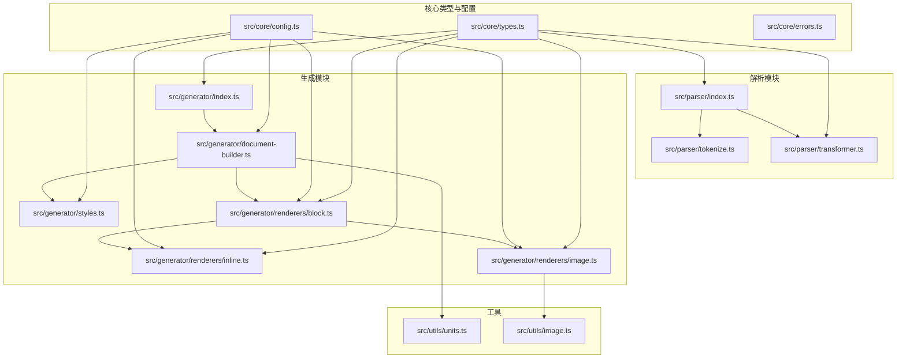
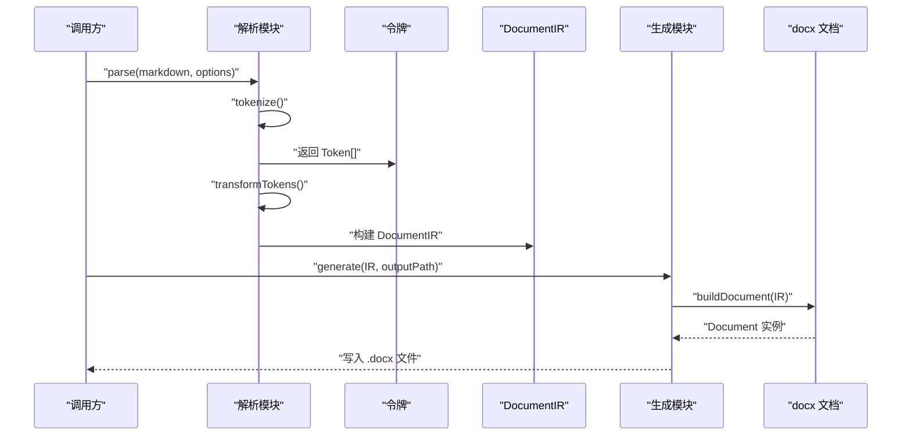
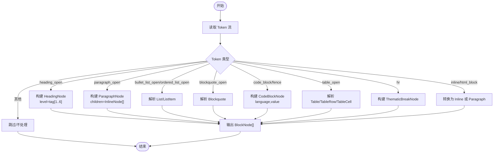
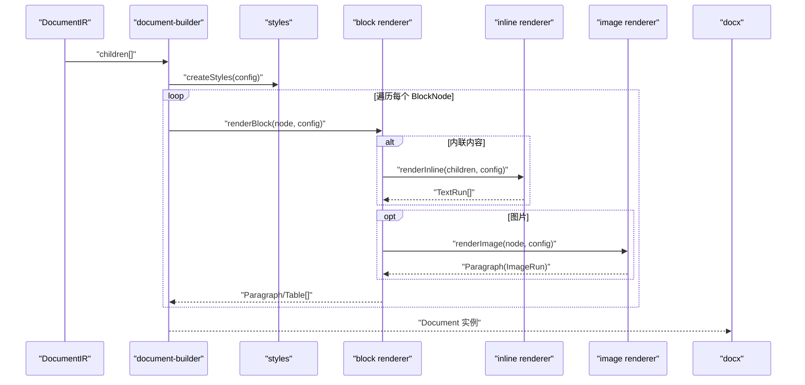
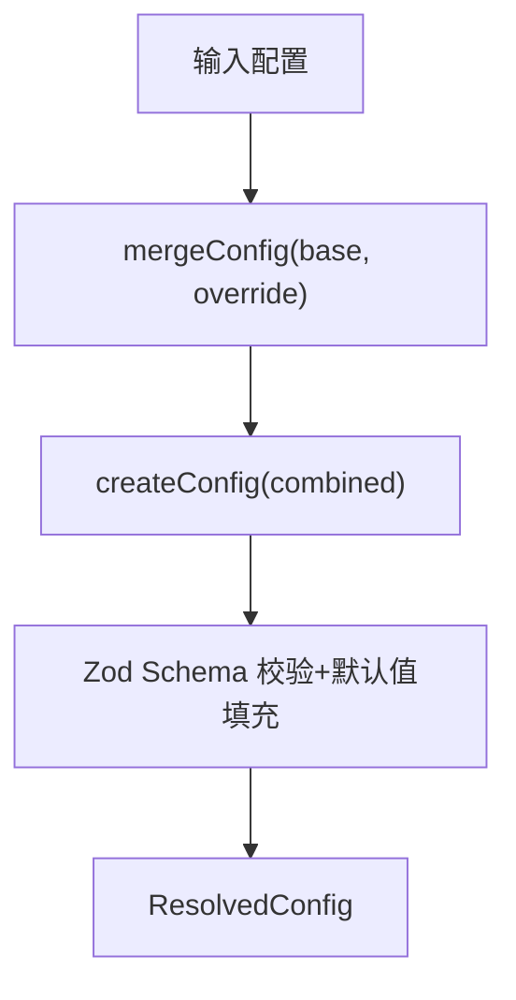
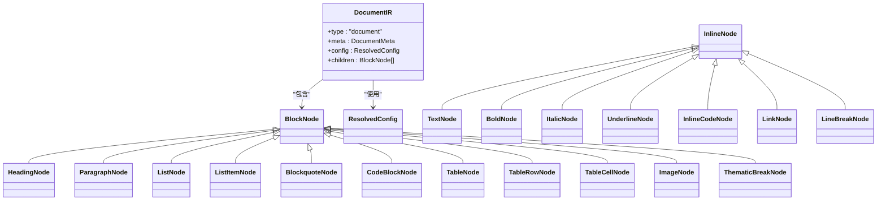
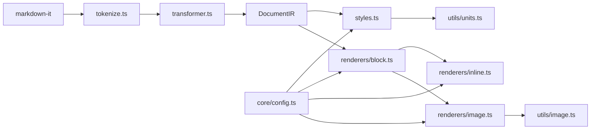

# 核心模块设计

<cite>
**本文档引用的文件**
- [src/core/types.ts](file://src/core/types.ts)
- [src/core/config.ts](file://src/core/config.ts)
- [src/core/errors.ts](file://src/core/errors.ts)
- [src/parser/index.ts](file://src/parser/index.ts)
- [src/parser/tokenize.ts](file://src/parser/tokenize.ts)
- [src/parser/transformer.ts](file://src/parser/transformer.ts)
- [src/generator/index.ts](file://src/generator/index.ts)
- [src/generator/document-builder.ts](file://src/generator/document-builder.ts)
- [src/generator/styles.ts](file://src/generator/styles.ts)
- [src/generator/renderers/block.ts](file://src/generator/renderers/block.ts)
- [src/generator/renderers/inline.ts](file://src/generator/renderers/inline.ts)
- [src/generator/renderers/image.ts](file://src/generator/renderers/image.ts)
- [src/utils/image.ts](file://src/utils/image.ts)
- [src/utils/units.ts](file://src/utils/units.ts)
- [src/index.ts](file://src/index.ts)
- [tests/unit/core/config.test.ts](file://tests/unit/core/config.test.ts)
- [tests/unit/parser/transformer.test.ts](file://tests/unit/parser/transformer.test.ts)
- [package.json](file://package.json)
</cite>

## 目录
1. [简介](#简介)
2. [项目结构](#项目结构)
3. [核心组件](#核心组件)
4. [架构总览](#架构总览)
5. [详细组件分析](#详细组件分析)
6. [依赖分析](#依赖分析)
7. [性能考虑](#性能考虑)
8. [故障排除指南](#故障排除指南)
9. [结论](#结论)
10. [附录](#附录)

## 简介
本项目是一个 Markdown 到 Word（.docx）的转换器，提供可定制样式的文档生成能力。核心模块围绕以下方面展开：
- 解析模块（Parser）：使用 MarkdownIt 进行令牌化，再将令牌转换为中间表示（DocumentIR）。
- 生成模块（Generator）：基于 DocumentIR 构建 docx 文档，包含样式系统与渲染器体系。
- 配置管理模块（Config）：通过 Zod 进行类型验证、默认值填充与配置合并。
- 类型系统：统一定义 DocumentIR、BlockNode、InlineNode 及配置类型。
- 错误处理：针对解析、生成、图像处理等场景定义专用错误类型。

## 项目结构
项目采用按功能分层的组织方式，核心代码位于 src 目录下，测试位于 tests 目录，工具函数位于 utils 目录。

图表来源
- [src/core/types.ts:1-198](file://src/core/types.ts#L1-L198)
- [src/core/config.ts:1-91](file://src/core/config.ts#L1-L91)
- [src/core/errors.ts:1-28](file://src/core/errors.ts#L1-L28)
- [src/parser/index.ts:1-24](file://src/parser/index.ts#L1-L24)
- [src/parser/tokenize.ts:1-16](file://src/parser/tokenize.ts#L1-L16)
- [src/parser/transformer.ts:1-360](file://src/parser/transformer.ts#L1-L360)
- [src/generator/index.ts:1-21](file://src/generator/index.ts#L1-L21)
- [src/generator/document-builder.ts:1-112](file://src/generator/document-builder.ts#L1-L112)
- [src/generator/styles.ts:1-122](file://src/generator/styles.ts#L1-L122)
- [src/generator/renderers/block.ts:1-266](file://src/generator/renderers/block.ts#L1-L266)
- [src/generator/renderers/inline.ts:1-110](file://src/generator/renderers/inline.ts#L1-L110)
- [src/generator/renderers/image.ts:1-61](file://src/generator/renderers/image.ts#L1-L61)
- [src/utils/units.ts:1-45](file://src/utils/units.ts#L1-L45)
- [src/utils/image.ts:1-58](file://src/utils/image.ts#L1-L58)

章节来源
- [src/index.ts:1-25](file://src/index.ts#L1-L25)
- [package.json:1-47](file://package.json#L1-L47)

## 核心组件
本节概述三个核心模块及其职责：
- 解析模块（Parser）：负责将 Markdown 文本解析为令牌，再转换为 BlockNode/InlineNode 的树形结构（DocumentIR）。
- 生成模块（Generator）：将 DocumentIR 渲染为 docx 文档，包含样式创建、段落/表格/图片等块级元素渲染。
- 配置管理模块（Config）：提供配置类型定义、默认值、校验与合并策略。

章节来源
- [src/parser/index.ts:1-24](file://src/parser/index.ts#L1-L24)
- [src/generator/index.ts:1-21](file://src/generator/index.ts#L1-L21)
- [src/core/config.ts:1-91](file://src/core/config.ts#L1-L91)

## 架构总览
整体流程从解析到生成的端到端序列如下：

图表来源
- [src/parser/index.ts:11-21](file://src/parser/index.ts#L11-L21)
- [src/parser/tokenize.ts:12-15](file://src/parser/tokenize.ts#L12-L15)
- [src/parser/transformer.ts:25-39](file://src/parser/transformer.ts#L25-L39)
- [src/generator/index.ts:7-18](file://src/generator/index.ts#L7-L18)
- [src/generator/document-builder.ts:17-106](file://src/generator/document-builder.ts#L17-L106)

## 详细组件分析

### 解析模块（Parser）
解析模块由三部分组成：入口函数、令牌化与令牌转换。

- 入口函数
  - 接收 Markdown 字符串与可选选项（元数据、配置），内部调用 tokenize 与 transformTokens，最终产出 DocumentIR。
  - 默认配置来自 core/config.ts 的 defaultConfig。
  
  章节来源
  - [src/parser/index.ts:11-21](file://src/parser/index.ts#L11-L21)

- 令牌化（tokenize）
  - 使用 MarkdownIt（commonmark 规范）解析 Markdown，启用 table、html、linkify、typographer 等特性。
  - 返回 MarkdownIt 的 Token 数组，供后续转换使用。
  
  章节来源
  - [src/parser/tokenize.ts:4-15](file://src/parser/tokenize.ts#L4-L15)

- 令牌转换（transformer）
  - 将 Token 流转换为 BlockNode[]，再由 parse 函数包装为 DocumentIR。
  - 支持的块级节点包括：标题、段落、列表（有序/无序）、列表项、引用块、代码块、表格、表格行、表格单元、图片、水平分割线。
  - 内联节点支持：文本、粗体、斜体、下划线、行内代码、链接、换行。
  - 特殊处理：
    - 表格解析时跳过 thead/tbody 标签，直接解析 tr。
    - HTML 块中提取图片标签并生成 ImageNode。
    - HTML 内联标签如 <u>、  等被识别为对应节点或换行。
  
  章节来源
  - [src/parser/transformer.ts:25-360](file://src/parser/transformer.ts#L25-L360)

图表来源
- [src/parser/transformer.ts:41-122](file://src/parser/transformer.ts#L41-L122)
- [src/parser/transformer.ts:124-162](file://src/parser/transformer.ts#L124-L162)
- [src/parser/transformer.ts:164-180](file://src/parser/transformer.ts#L164-L180)
- [src/parser/transformer.ts:182-236](file://src/parser/transformer.ts#L182-L236)
- [src/parser/transformer.ts:238-332](file://src/parser/transformer.ts#L238-L332)

### 生成模块（Generator）
生成模块负责将 DocumentIR 渲染为 docx 文档，包含样式系统与渲染器。

- 入口函数
  - generate 接收 DocumentIR 与输出路径，内部构建文档并写入文件；捕获异常并包装为 DocxGenerationError。
  
  章节来源
  - [src/generator/index.ts:7-18](file://src/generator/index.ts#L7-L18)

- 文档构建（document-builder）
  - 创建样式集合（createStyles），遍历 IR.children 调用 renderBlock 渲染块级元素。
  - 处理页眉/页脚：根据配置生成 Header/Footer，支持页码显示。
  - 设置页面属性：边距、方向、尺寸等。
  - 返回 Document 实例，随后通过 Packer 序列化为 Buffer 并写入文件。
  
  章节来源
  - [src/generator/document-builder.ts:17-106](file://src/generator/document-builder.ts#L17-L106)

- 样式系统（styles）
  - 基于 ResolvedConfig 动态生成段落样式：标题各级、正文、代码块、引用。
  - 统一字体名称与字号单位（pt->half-pt），行距与段前段后间距转换（pt->twip）。
  
  章节来源
  - [src/generator/styles.ts:5-109](file://src/generator/styles.ts#L5-L109)

- 块级渲染器（block）
  - 根据节点类型渲染为 Paragraph/Table，支持嵌套列表、引用块、表格、代码块、图片、水平分割线。
  - 同步/异步混合：列表与引用块内部递归调用同步渲染器以兼容非异步场景。
  
  章节来源
  - [src/generator/renderers/block.ts:28-58](file://src/generator/renderers/block.ts#L28-L58)
  - [src/generator/renderers/block.ts:92-122](file://src/generator/renderers/block.ts#L92-L122)
  - [src/generator/renderers/block.ts:124-165](file://src/generator/renderers/block.ts#L124-L165)
  - [src/generator/renderers/block.ts:167-197](file://src/generator/renderers/block.ts#L167-L197)
  - [src/generator/renderers/block.ts:199-230](file://src/generator/renderers/block.ts#L199-L230)
  - [src/generator/renderers/block.ts:249-265](file://src/generator/renderers/block.ts#L249-L265)

- 内联渲染器（inline）
  - 将 InlineNode[] 渲染为 TextRun[]，支持继承样式（粗体、斜体、下划线、颜色、字体、字号）。
  - 行内代码使用等宽字体与背景色。
  
  章节来源
  - [src/generator/renderers/inline.ts:12-109](file://src/generator/renderers/inline.ts#L12-L109)

- 图片渲染器（image）
  - 异步读取图片元数据，计算最大宽度与缩放比例，生成 ImageRun 并设置对齐与间距。
  - 失败回退：无法读取图片时仍输出占位段落以保证文档完整性。
  
  章节来源
  - [src/generator/renderers/image.ts:6-60](file://src/generator/renderers/image.ts#L6-L60)
  - [src/utils/image.ts:12-42](file://src/utils/image.ts#L12-L42)

图表来源
- [src/generator/document-builder.ts:17-28](file://src/generator/document-builder.ts#L17-L28)
- [src/generator/styles.ts:5-109](file://src/generator/styles.ts#L5-L109)
- [src/generator/renderers/block.ts:28-58](file://src/generator/renderers/block.ts#L28-L58)
- [src/generator/renderers/inline.ts:12-109](file://src/generator/renderers/inline.ts#L12-L109)
- [src/generator/renderers/image.ts:6-60](file://src/generator/renderers/image.ts#L6-L60)

### 配置管理模块（Config）
- 类型定义
  - ResolvedConfig 包含字体、字号、间距、边距、图片、页眉页脚、颜色、纸张大小与方向等。
  
  章节来源
  - [src/core/types.ts:187-198](file://src/core/types.ts#L187-L198)

- 类型验证与默认值
  - 使用 Zod Schema 对各配置子对象进行字段约束与默认值填充。
  - 提供 createConfig 输入校验与默认配置生成。
  
  章节来源
  - [src/core/config.ts:4-64](file://src/core/config.ts#L4-L64)
  - [src/core/config.ts:68-81](file://src/core/config.ts#L68-L81)
  - [src/core/config.ts](file://src/core/config.ts#L90)

- 配置合并
  - mergeConfig 基于 createConfig 合并基础配置与覆盖配置，实现细粒度覆盖。
  
  章节来源
  - [src/core/config.ts:83-88](file://src/core/config.ts#L83-L88)

- 单元测试验证
  - 测试覆盖默认配置、合并行为与非法值拒绝。
  
  章节来源
  - [tests/unit/core/config.test.ts:4-31](file://tests/unit/core/config.test.ts#L4-L31)

图表来源
- [src/core/config.ts:68-88](file://src/core/config.ts#L68-L88)

### 类型系统设计
- DocumentIR
  - 根节点，包含元信息、已解析配置与 BlockNode 子节点数组。
  
  章节来源
  - [src/core/types.ts:7-12](file://src/core/types.ts#L7-L12)

- 块级节点（BlockNode）
  - 标题、段落、列表（含列表项）、引用块、代码块、表格（含行/单元）、图片、水平分割线。
  
  章节来源
  - [src/core/types.ts:78-89](file://src/core/types.ts#L78-L89)

- 内联节点（InlineNode）
  - 文本、粗体、斜体、下划线、行内代码、链接、换行。
  
  章节来源
  - [src/core/types.ts:127-134](file://src/core/types.ts#L127-L134)

- 配置类型（ResolvedConfig）
  - 字体、字号、间距、边距、图片、页眉页脚、颜色、纸张大小、方向。
  
  章节来源
  - [src/core/types.ts:187-198](file://src/core/types.ts#L187-L198)

图表来源
- [src/core/types.ts:7-134](file://src/core/types.ts#L7-L134)
- [src/core/types.ts:187-198](file://src/core/types.ts#L187-L198)

### 错误处理机制
- 错误类型
  - MarkdownParseError：解析阶段错误。
  - DocxGenerationError：生成阶段错误，携带底层原因。
  - ImageProcessingError：图像处理失败，携带源地址与原因。
  - ConfigValidationError：配置校验失败，携带问题列表。
  
  章节来源
  - [src/core/errors.ts:1-27](file://src/core/errors.ts#L1-L27)

- 传播策略
  - 解析阶段：由 parse 调用 tokenize/transformTokens，若出现未捕获异常，应确保上层能感知。
  - 生成阶段：generate 捕获异常并包装为 DocxGenerationError，保留原始错误上下文。
  - 图像处理：renderImage 在读取/解码失败时回退为占位段落，并抛出 ImageProcessingError。
  
  章节来源
  - [src/generator/index.ts:12-17](file://src/generator/index.ts#L12-L17)
  - [src/generator/renderers/image.ts:47-59](file://src/generator/renderers/image.ts#L47-L59)
  - [src/utils/image.ts:38-41](file://src/utils/image.ts#L38-L41)

## 依赖分析
- 外部依赖
  - markdown-it：Markdown 解析与令牌生成。
  - docx：docx 文档构建与样式应用。
  - sharp：图像读取与元数据解析。
  - zod：配置类型验证与默认值填充。
  
  章节来源
  - [package.json:27-35](file://package.json#L27-L35)

- 内部耦合
  - 解析模块依赖 MarkdownIt Token 结构，转换器严格匹配其类型。
  - 生成模块依赖样式系统与渲染器，渲染器依赖工具函数进行单位换算。
  - 配置模块贯穿解析与生成两端，作为类型与默认值来源。
  
  章节来源
  - [src/parser/tokenize.ts:1-10](file://src/parser/tokenize.ts#L1-L10)
  - [src/generator/styles.ts:1-3](file://src/generator/styles.ts#L1-L3)
  - [src/utils/units.ts:1-45](file://src/utils/units.ts#L1-L45)

图表来源
- [src/parser/tokenize.ts:1-10](file://src/parser/tokenize.ts#L1-L10)
- [src/parser/transformer.ts:1-23](file://src/parser/transformer.ts#L1-L23)
- [src/generator/styles.ts:1-3](file://src/generator/styles.ts#L1-L3)
- [src/generator/renderers/block.ts:1-26](file://src/generator/renderers/block.ts#L1-L26)
- [src/generator/renderers/inline.ts:1-3](file://src/generator/renderers/inline.ts#L1-L3)
- [src/generator/renderers/image.ts:1-4](file://src/generator/renderers/image.ts#L1-L4)
- [src/utils/image.ts:1-3](file://src/utils/image.ts#L1-L3)
- [src/utils/units.ts:1-45](file://src/utils/units.ts#L1-L45)
- [src/core/config.ts:1-2](file://src/core/config.ts#L1-L2)

## 性能考虑
- 令牌化与转换
  - 使用 MarkdownIt 的高效令牌化，避免重复解析。
  - 转换器采用单次扫描与线性时间复杂度，列表/表格嵌套通过索引推进控制。
- 渲染与样式
  - 样式一次性创建，避免重复实例化。
  - 文本渲染复用 TextRun，减少对象开销。
- 图像处理
  - 优先使用本地文件路径，网络图片需额外网络延迟；建议缓存常用资源。
  - 缩放计算在内存中完成，注意大图内存占用。
- 单位换算
  - 所有单位换算集中在工具函数，避免重复计算。

## 故障排除指南
- 解析失败
  - 现象：parse 抛出 MarkdownParseError。
  - 排查：确认 MarkdownIt 版本与 commonmark 规范是否一致；检查自定义插件是否影响令牌结构。
  - 参考
    - [src/parser/index.ts:11-21](file://src/parser/index.ts#L11-L21)
    - [src/parser/tokenize.ts:12-15](file://src/parser/tokenize.ts#L12-L15)
    - [src/parser/transformer.ts:25-39](file://src/parser/transformer.ts#L25-L39)

- 生成失败
  - 现象：generate 抛出 DocxGenerationError。
  - 排查：查看底层错误堆栈，确认 DocumentIR 结构完整、样式创建成功、Packer 正常工作。
  - 参考
    - [src/generator/index.ts:7-18](file://src/generator/index.ts#L7-L18)
    - [src/generator/document-builder.ts:17-106](file://src/generator/document-builder.ts#L17-L106)

- 图像处理失败
  - 现象：renderImage 回退或抛出 ImageProcessingError。
  - 排查：检查图片 URL/路径、网络连通性、sharp 支持格式；确认磁盘权限。
  - 参考
    - [src/generator/renderers/image.ts:6-60](file://src/generator/renderers/image.ts#L6-L60)
    - [src/utils/image.ts:12-42](file://src/utils/image.ts#L12-L42)

- 配置校验失败
  - 现象：createConfig 抛出 ConfigValidationError。
  - 排查：核对枚举值（如 pageSize、orientation）、数值范围（如图片百分比）、必填字段。
  - 参考
    - [src/core/config.ts:54-64](file://src/core/config.ts#L54-L64)
    - [tests/unit/core/config.test.ts:22-24](file://tests/unit/core/config.test.ts#L22-L24)

## 结论
本项目通过清晰的模块划分与强类型设计，实现了从 Markdown 到 Word 的高保真转换。解析模块基于 MarkdownIt 的令牌流，生成模块以样式驱动渲染，配置模块提供可靠的类型验证与默认值。错误处理覆盖关键路径，便于定位与修复问题。建议在扩展新功能时遵循现有模式：先定义类型，再实现解析/渲染，最后补充测试与配置项。

## 附录
- 关键流程测试参考
  - 解析器转换测试：涵盖标题、粗体/斜体、无序/有序列表、代码块、引用块、表格等。
  - 参考
    - [tests/unit/parser/transformer.test.ts:6-89](file://tests/unit/parser/transformer.test.ts#L6-L89)

- 导出入口
  - 统一导出 parse、generate、配置与类型，便于外部使用。
  - 参考
    - [src/index.ts:1-25](file://src/index.ts#L1-L25)