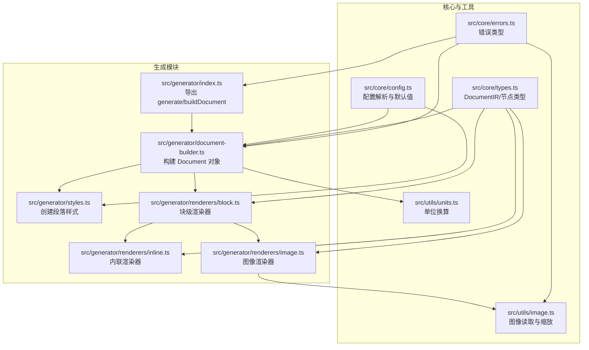
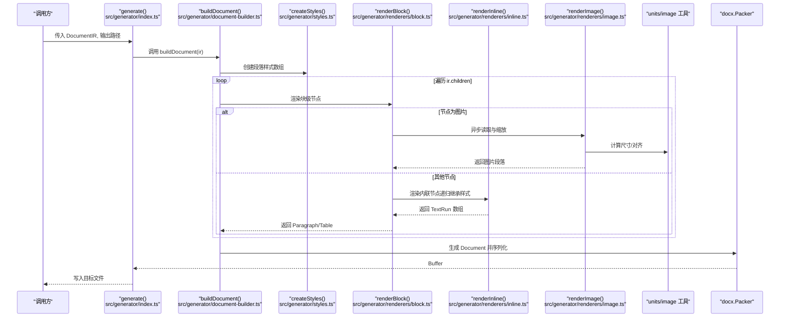
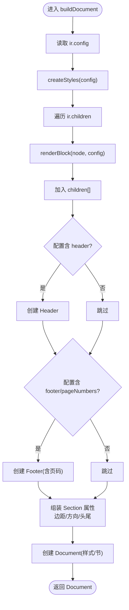
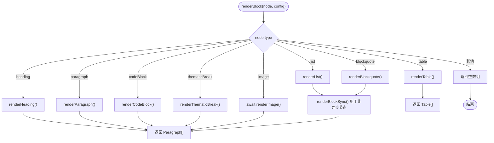
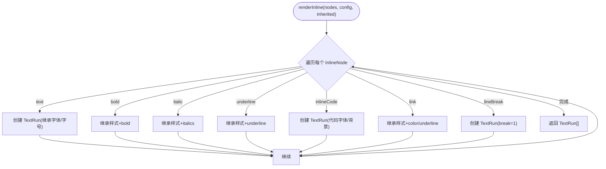
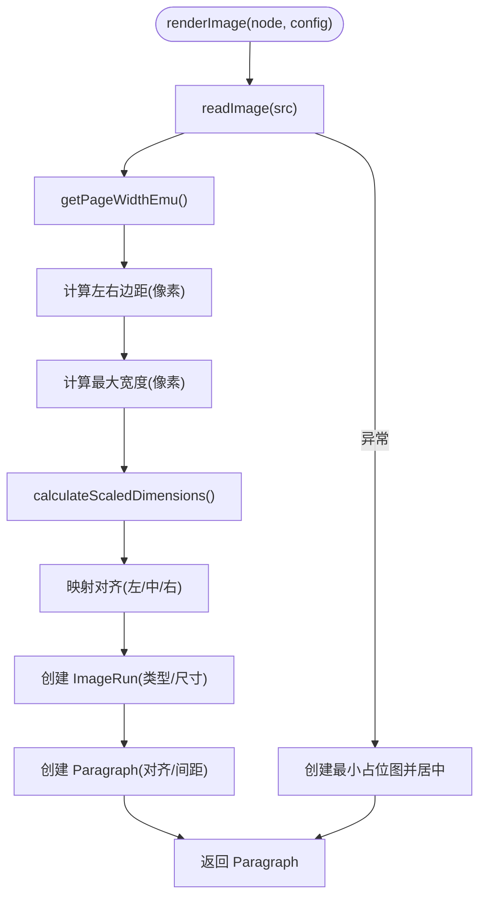
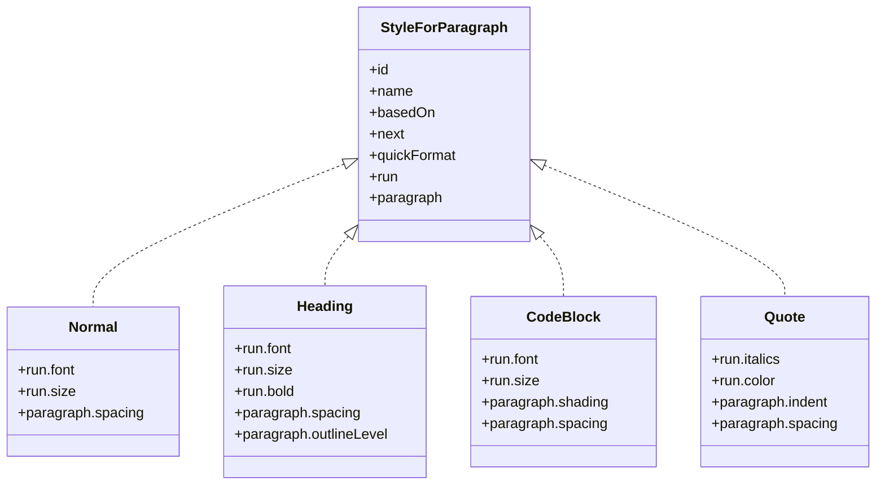
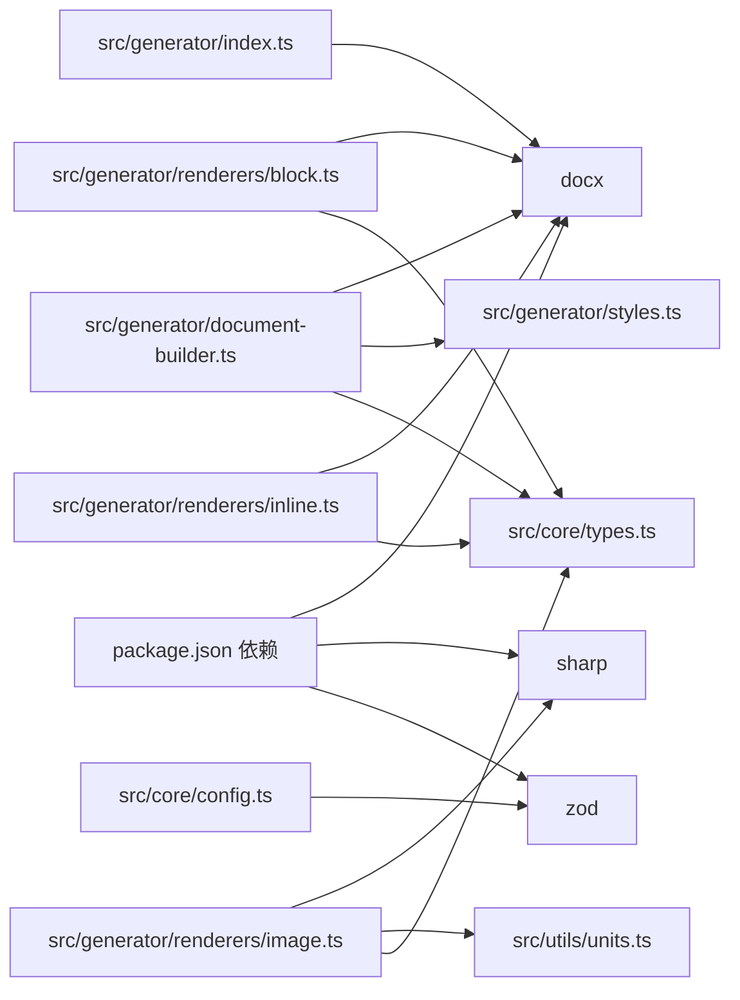
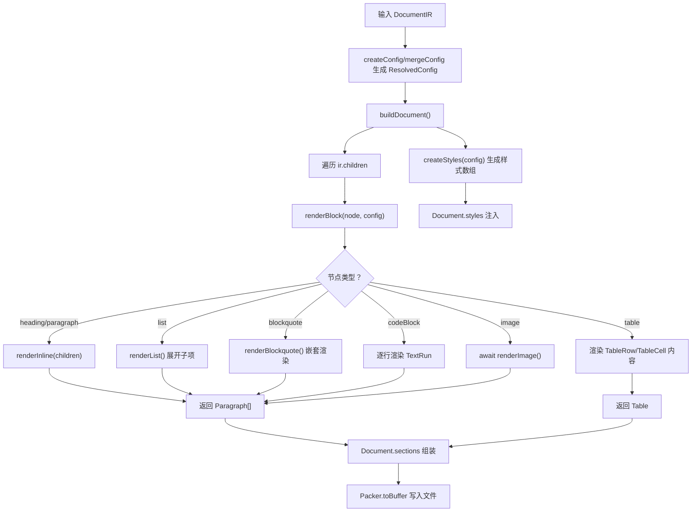

# 生成模块

<cite>
**本文引用的文件**
- [src/generator/index.ts](file://src/generator/index.ts)
- [src/generator/document-builder.ts](file://src/generator/document-builder.ts)
- [src/generator/styles.ts](file://src/generator/styles.ts)
- [src/generator/renderers/block.ts](file://src/generator/renderers/block.ts)
- [src/generator/renderers/inline.ts](file://src/generator/renderers/inline.ts)
- [src/generator/renderers/image.ts](file://src/generator/renderers/image.ts)
- [src/core/types.ts](file://src/core/types.ts)
- [src/core/config.ts](file://src/core/config.ts)
- [src/utils/units.ts](file://src/utils/units.ts)
- [src/utils/image.ts](file://src/utils/image.ts)
- [src/core/errors.ts](file://src/core/errors.ts)
- [src/index.ts](file://src/index.ts)
- [package.json](file://package.json)
</cite>

## 目录
1. [简介](#简介)
2. [项目结构](#项目结构)
3. [核心组件](#核心组件)
4. [架构总览](#架构总览)
5. [详细组件分析](#详细组件分析)
6. [依赖分析](#依赖分析)
7. [性能考虑](#性能考虑)
8. [故障排查指南](#故障排查指南)
9. [结论](#结论)
10. [附录](#附录)

## 简介
本文件面向“生成模块”的技术文档，系统性阐述从内部文档表示（DocumentIR）到 Word 文档（.docx）的完整转换流程。重点包括：
- buildDocument() 的实现原理与 DocumentBuilder 设计模式
- 渲染器体系：块级渲染器、内联渲染器、图像渲染器的职责与协作
- 样式应用机制：样式配置解析、样式继承规则、docx 样式映射
- 生成器与解析器的接口契约：输入 DocumentIR 结构要求与输出格式规范
- 完整的文档构建流程图、渲染器扩展指南与样式定制示例

## 项目结构
生成模块位于 src/generator 目录，包含文档构建入口、样式生成、渲染器子系统以及工具函数。核心文件如下：
- 入口与打包：src/generator/index.ts
- 文档构建器：src/generator/document-builder.ts
- 样式生成：src/generator/styles.ts
- 渲染器：
  - 块级渲染器：src/generator/renderers/block.ts
  - 内联渲染器：src/generator/renderers/inline.ts
  - 图像渲染器：src/generator/renderers/image.ts
- 类型与配置：src/core/types.ts、src/core/config.ts
- 工具函数：src/utils/units.ts、src/utils/image.ts
- 错误类型：src/core/errors.ts
- 导出入口：src/index.ts

图表来源
- [src/generator/index.ts:1-21](file://src/generator/index.ts#L1-L21)
- [src/generator/document-builder.ts:1-112](file://src/generator/document-builder.ts#L1-L112)
- [src/generator/styles.ts:1-122](file://src/generator/styles.ts#L1-L122)
- [src/generator/renderers/block.ts:1-266](file://src/generator/renderers/block.ts#L1-L266)
- [src/generator/renderers/inline.ts:1-110](file://src/generator/renderers/inline.ts#L1-L110)
- [src/generator/renderers/image.ts:1-61](file://src/generator/renderers/image.ts#L1-L61)
- [src/core/types.ts:1-198](file://src/core/types.ts#L1-L198)
- [src/core/config.ts:1-91](file://src/core/config.ts#L1-L91)
- [src/utils/units.ts:1-45](file://src/utils/units.ts#L1-L45)
- [src/utils/image.ts:1-58](file://src/utils/image.ts#L1-L58)
- [src/core/errors.ts:1-28](file://src/core/errors.ts#L1-L28)

章节来源
- [src/generator/index.ts:1-21](file://src/generator/index.ts#L1-L21)
- [src/generator/document-builder.ts:1-112](file://src/generator/document-builder.ts#L1-L112)
- [src/generator/styles.ts:1-122](file://src/generator/styles.ts#L1-L122)
- [src/generator/renderers/block.ts:1-266](file://src/generator/renderers/block.ts#L1-L266)
- [src/generator/renderers/inline.ts:1-110](file://src/generator/renderers/inline.ts#L1-L110)
- [src/generator/renderers/image.ts:1-61](file://src/generator/renderers/image.ts#L1-L61)
- [src/core/types.ts:1-198](file://src/core/types.ts#L1-L198)
- [src/core/config.ts:1-91](file://src/core/config.ts#L1-L91)
- [src/utils/units.ts:1-45](file://src/utils/units.ts#L1-L45)
- [src/utils/image.ts:1-58](file://src/utils/image.ts#L1-L58)
- [src/core/errors.ts:1-28](file://src/core/errors.ts#L1-L28)

## 核心组件
- 生成入口 generate()：接收 DocumentIR 与输出路径，调用 buildDocument 构建 docx，再写入文件。
- 文档构建器 buildDocument()：解析配置、渲染块级节点、构建页眉/页脚、设置页面属性与样式，返回 docx.Document。
- 样式系统 createStyles()：基于 ResolvedConfig 生成 docx 段落样式集合（标题、正文、代码块、引用）。
- 渲染器体系：
  - 块级渲染器 renderBlock()：根据节点类型分派至具体渲染函数，支持标题、段落、列表、引用、代码块、表格、图片、分隔线等。
  - 内联渲染器 renderInline()：递归处理文本、加粗、斜体、下划线、行内代码、链接、换行，并支持样式继承。
  - 图像渲染器 renderImage()：读取图像、计算缩放尺寸、对齐与间距，回退时输出占位符。
- 单位与图像工具：px/pt/EMU 转换、页面宽高获取、图像读取与缩放。
- 配置系统：Zod Schema 校验与默认值合并，生成 ResolvedConfig。

章节来源
- [src/generator/index.ts:7-18](file://src/generator/index.ts#L7-L18)
- [src/generator/document-builder.ts:17-106](file://src/generator/document-builder.ts#L17-L106)
- [src/generator/styles.ts:5-109](file://src/generator/styles.ts#L5-L109)
- [src/generator/renderers/block.ts:28-58](file://src/generator/renderers/block.ts#L28-L58)
- [src/generator/renderers/inline.ts:12-109](file://src/generator/renderers/inline.ts#L12-L109)
- [src/generator/renderers/image.ts:6-60](file://src/generator/renderers/image.ts#L6-L60)
- [src/utils/units.ts:6-33](file://src/utils/units.ts#L6-L33)
- [src/utils/image.ts:12-42](file://src/utils/image.ts#L12-L42)
- [src/core/config.ts:68-91](file://src/core/config.ts#L68-L91)

## 架构总览
生成模块采用“配置驱动 + 渲染器分层”的架构：
- 输入：DocumentIR（包含元数据、已解析配置、块级节点树）
- 中间层：buildDocument() 组织文档结构，调用渲染器生成 docx 子元素
- 输出：docx.Document，经 Packer 序列化为 Buffer 并写出文件

图表来源
- [src/generator/index.ts:7-18](file://src/generator/index.ts#L7-L18)
- [src/generator/document-builder.ts:17-106](file://src/generator/document-builder.ts#L17-L106)
- [src/generator/styles.ts:5-109](file://src/generator/styles.ts#L5-L109)
- [src/generator/renderers/block.ts:28-58](file://src/generator/renderers/block.ts#L28-L58)
- [src/generator/renderers/inline.ts:12-109](file://src/generator/renderers/inline.ts#L12-L109)
- [src/generator/renderers/image.ts:6-60](file://src/generator/renderers/image.ts#L6-L60)
- [src/utils/units.ts:6-33](file://src/utils/units.ts#L6-L33)
- [src/utils/image.ts:12-42](file://src/utils/image.ts#L12-L42)

## 详细组件分析

### DocumentBuilder 与 buildDocument()
- 职责
  - 解析配置（ResolvedConfig），生成样式集合
  - 遍历 ir.children，逐个调用 renderBlock() 渲染块级节点
  - 构建页眉/页脚（可选），设置页面方向与边距
  - 组装 docx.Document，注入样式与节属性
- 关键流程
  - 样式创建：createStyles(config) 生成标题、正文、代码块、引用等样式
  - 头尾部：根据配置决定是否创建 Header/Footer，页码通过 PageNumber 枚举插入
  - 页面属性：SectionType.CONTINUOUS、边距（twip）、方向（portrait/landscape）
  - 文档对象：设置作者、标题、描述、样式表、节数组
- 错误处理：捕获异常并包装为 DocxGenerationError

图表来源
- [src/generator/document-builder.ts:17-106](file://src/generator/document-builder.ts#L17-L106)
- [src/generator/styles.ts:5-109](file://src/generator/styles.ts#L5-L109)

章节来源
- [src/generator/document-builder.ts:17-106](file://src/generator/document-builder.ts#L17-L106)
- [src/generator/index.ts:7-18](file://src/generator/index.ts#L7-L18)
- [src/core/errors.ts:8-13](file://src/core/errors.ts#L8-L13)

### 块级渲染器（block.ts）
- 职责
  - 将 BlockNode 映射为 Paragraph 或 Table
  - 递归渲染子节点，处理列表、引用、表格、图片等
- 主要分支
  - 标题：按 level 映射 HeadingLevel，设置段前段后间距
  - 段落：渲染内联节点，设置行距与段前段后
  - 列表：展开多级列表，将子项中的段落转为独立 Paragraph
  - 引用：将段落转为带左侧边框的斜体段落，支持嵌套标题/块
  - 代码块：按行拆分，逐行渲染，设置固定字体与背景色
  - 表格：将单元格内的段落/标题渲染为单元格内容，表头单元格着浅色底纹
  - 图片：委托 renderImage() 生成段落
  - 分隔线：绘制水平线段落
- 同步/异步策略
  - renderBlock() 为异步，图片需要异步读取
  - renderBlockSync() 提供同步版本用于列表/引用中非异步节点

图表来源
- [src/generator/renderers/block.ts:28-58](file://src/generator/renderers/block.ts#L28-L58)
- [src/generator/renderers/block.ts:92-122](file://src/generator/renderers/block.ts#L92-L122)
- [src/generator/renderers/block.ts:124-165](file://src/generator/renderers/block.ts#L124-L165)
- [src/generator/renderers/block.ts:167-197](file://src/generator/renderers/block.ts#L167-L197)
- [src/generator/renderers/block.ts:199-230](file://src/generator/renderers/block.ts#L199-L230)
- [src/generator/renderers/block.ts:250-265](file://src/generator/renderers/block.ts#L250-L265)

章节来源
- [src/generator/renderers/block.ts:28-58](file://src/generator/renderers/block.ts#L28-L58)
- [src/generator/renderers/block.ts:60-78](file://src/generator/renderers/block.ts#L60-L78)
- [src/generator/renderers/block.ts:80-90](file://src/generator/renderers/block.ts#L80-L90)
- [src/generator/renderers/block.ts:92-122](file://src/generator/renderers/block.ts#L92-L122)
- [src/generator/renderers/block.ts:124-165](file://src/generator/renderers/block.ts#L124-L165)
- [src/generator/renderers/block.ts:167-197](file://src/generator/renderers/block.ts#L167-L197)
- [src/generator/renderers/block.ts:199-230](file://src/generator/renderers/block.ts#L199-L230)
- [src/generator/renderers/block.ts:232-247](file://src/generator/renderers/block.ts#L232-L247)
- [src/generator/renderers/block.ts:250-265](file://src/generator/renderers/block.ts#L250-L265)

### 内联渲染器（inline.ts）
- 职责
  - 将 InlineNode 序列渲染为 TextRun 数组
  - 支持样式继承：父级样式通过 inherited 参数传递
- 样式继承规则
  - 默认字体/字号来自配置；若未显式指定，则使用继承值
  - 加粗/斜体/下划线叠加在继承样式上
  - 行内代码使用代码字体与背景色
  - 链接使用配置颜色并启用下划线
- 特殊节点
  - 换行：插入 break=1 的 TextRun

图表来源
- [src/generator/renderers/inline.ts:12-109](file://src/generator/renderers/inline.ts#L12-L109)

章节来源
- [src/generator/renderers/inline.ts:12-109](file://src/generator/renderers/inline.ts#L12-L109)

### 图像渲染器（image.ts）
- 职责
  - 读取图像（本地或远程），计算缩放尺寸，生成 ImageRun 并包裹在 Paragraph 中
  - 支持对齐（左/中/右）与段前后间距
  - 回退：读取失败时输出最小尺寸占位图并居中
- 尺寸计算
  - 获取页面宽度（EMU），扣除左右边距（twip->pt->px），按最大百分比计算可用宽度
  - 使用 sharp 获取原图尺寸与格式，按比例缩放
- 对齐映射
  - left/center/right 映射为 docx 对齐枚举

图表来源
- [src/generator/renderers/image.ts:6-60](file://src/generator/renderers/image.ts#L6-L60)
- [src/utils/image.ts:12-42](file://src/utils/image.ts#L12-L42)
- [src/utils/units.ts:6-33](file://src/utils/units.ts#L6-L33)

章节来源
- [src/generator/renderers/image.ts:6-60](file://src/generator/renderers/image.ts#L6-L60)
- [src/utils/image.ts:12-42](file://src/utils/image.ts#L12-L42)
- [src/utils/units.ts:6-33](file://src/utils/units.ts#L6-L33)

### 样式系统（styles.ts）
- 职责
  - 基于 ResolvedConfig 生成 docx.StyleForParagraph 数组
  - 包含 Normal、Heading1..6、CodeBlock、Quote 等样式
- 样式继承与映射
  - HeadingX 基于 Normal，outlineLevel 与级别对应，字号随级别递减，前间距与级别相关
  - Normal 设置正文字体、字号与行距、段前段后
  - CodeBlock 设置代码字体、固定行距与背景色
  - Quote 设置斜体、浅色文字与缩进
- 单位转换
  - 字号：pt -> half-pt（docx 要求）
  - 间距：pt -> twip

图表来源
- [src/generator/styles.ts:44-109](file://src/generator/styles.ts#L44-L109)

章节来源
- [src/generator/styles.ts:5-109](file://src/generator/styles.ts#L5-L109)

### 接口契约与数据模型
- 输入 DocumentIR
  - type: 'document'
  - meta: 标题、作者、日期
  - config: ResolvedConfig（字体、字号、间距、边距、图片、页眉页脚、颜色、纸张、方向）
  - children: BlockNode[]（标题、段落、列表、引用、代码块、表格、图片、分隔线）
- 内联节点 InlineNode
  - text、bold、italic、underline、inlineCode、link、lineBreak
- 输出格式
  - .docx 文件（由 docx.Document 序列化得到）

章节来源
- [src/core/types.ts:7-13](file://src/core/types.ts#L7-L13)
- [src/core/types.ts:14-89](file://src/core/types.ts#L14-L89)
- [src/core/types.ts:91-135](file://src/core/types.ts#L91-L135)
- [src/core/types.ts:187-198](file://src/core/types.ts#L187-L198)

## 依赖分析
- 外部依赖
  - docx：生成与序列化 .docx
  - sharp：图像读取与元数据提取
  - zod：配置校验与默认值
- 内部耦合
  - document-builder 依赖 styles、block 渲染器
  - block 渲染器依赖 inline 与 image 渲染器
  - image 渲染器依赖 utils/image 与 utils/units
  - 所有模块依赖 core/types 与 core/config

图表来源
- [package.json:27-35](file://package.json#L27-L35)
- [src/generator/index.ts:1-5](file://src/generator/index.ts#L1-L5)
- [src/generator/document-builder.ts:1-12](file://src/generator/document-builder.ts#L1-L12)
- [src/generator/renderers/block.ts:1-12](file://src/generator/renderers/block.ts#L1-L12)
- [src/generator/renderers/inline.ts:1](file://src/generator/renderers/inline.ts#L1)
- [src/generator/renderers/image.ts:1-4](file://src/generator/renderers/image.ts#L1-L4)
- [src/core/config.ts:1-2](file://src/core/config.ts#L1-L2)

章节来源
- [package.json:27-35](file://package.json#L27-L35)
- [src/generator/index.ts:1-5](file://src/generator/index.ts#L1-L5)
- [src/generator/document-builder.ts:1-12](file://src/generator/document-builder.ts#L1-L12)
- [src/generator/renderers/block.ts:1-12](file://src/generator/renderers/block.ts#L1-L12)
- [src/generator/renderers/inline.ts:1](file://src/generator/renderers/inline.ts#L1)
- [src/generator/renderers/image.ts:1-4](file://src/generator/renderers/image.ts#L1-L4)
- [src/core/config.ts:1-2](file://src/core/config.ts#L1-L2)

## 性能考虑
- 图像处理
  - 使用 sharp 进行元数据读取与尺寸计算，避免重复解码
  - 缩放计算仅在必要时进行，避免超大图片导致内存峰值
- 渲染开销
  - renderInline 采用递归与继承样式，建议控制内联层级深度
  - renderList 与 renderBlockquote 会递归渲染子节点，注意列表嵌套层数
- 序列化
  - Packer.toBuffer 为同步阻塞操作，建议批量生成时串行或限流

## 故障排查指南
- 常见错误类型
  - DocxGenerationError：生成阶段异常（如文件写入失败）
  - ImageProcessingError：图像读取/网络请求失败或格式不支持
  - ConfigValidationError：配置校验失败（由 Zod 抛出）
- 排查步骤
  - 确认 DocumentIR 结构正确（type='document'、children 为 BlockNode[]）
  - 检查 ResolvedConfig 是否通过 createConfig/mergeConfig 正确生成
  - 图像问题：检查 src 是否可访问、格式是否受支持、磁盘空间与权限
  - 输出路径：确保目录存在且具备写权限

章节来源
- [src/core/errors.ts:8-27](file://src/core/errors.ts#L8-L27)
- [src/generator/index.ts:12-17](file://src/generator/index.ts#L12-L17)
- [src/utils/image.ts:38-42](file://src/utils/image.ts#L38-L42)

## 结论
生成模块以清晰的分层架构实现了从 Markdown IR 到 .docx 的高质量转换。通过配置驱动的样式系统与可扩展的渲染器体系，开发者可以灵活定制文档外观与行为。建议在实际项目中：
- 明确 DocumentIR 的构建来源（解析器）与质量
- 通过 ResolvedConfig 控制全局样式与布局
- 在渲染器扩展时遵循现有模式，保持一致性
- 对图像资源与输出路径进行健壮性保障

## 附录

### 文档构建完整流程图（代码级）

图表来源
- [src/generator/document-builder.ts:17-106](file://src/generator/document-builder.ts#L17-L106)
- [src/generator/styles.ts:5-109](file://src/generator/styles.ts#L5-L109)
- [src/generator/renderers/block.ts:28-58](file://src/generator/renderers/block.ts#L28-L58)
- [src/generator/renderers/inline.ts:12-109](file://src/generator/renderers/inline.ts#L12-L109)
- [src/generator/renderers/image.ts:6-60](file://src/generator/renderers/image.ts#L6-L60)
- [src/generator/index.ts:7-18](file://src/generator/index.ts#L7-L18)

### 渲染器扩展指南
- 新增块级节点
  - 在 renderBlock() 中添加分支，返回 Paragraph 或 Table
  - 如需异步处理（如网络请求），在 renderBlock() 中 await；否则使用 renderBlockSync()
- 新增内联节点
  - 在 renderInline() 中添加分支，返回 TextRun[]
  - 注意样式继承，优先使用 inherited 参数
- 新增样式
  - 在 createStyles() 中新增 StyleForParagraph 实例
  - 在渲染器中通过样式 ID 应用（如 Paragraph.style='CodeBlock'）

章节来源
- [src/generator/renderers/block.ts:28-58](file://src/generator/renderers/block.ts#L28-L58)
- [src/generator/renderers/inline.ts:12-109](file://src/generator/renderers/inline.ts#L12-L109)
- [src/generator/styles.ts:5-109](file://src/generator/styles.ts#L5-L109)

### 样式定制示例（步骤说明）
- 修改字号/行距
  - 在 ResolvedConfig.size 与 spacing 中调整数值
  - 重新调用 createConfig/mergeConfig 生成新配置
- 自定义颜色
  - 在 ResolvedConfig.color 中设置主题色、链接色、引用边框色
- 代码块背景
  - 调整 codeBackground，影响 CodeBlock 样式与代码段落着色
- 页面与边距
  - 调整 pageSize 与 margin，影响页面尺寸与图像最大宽度计算

章节来源
- [src/core/config.ts:68-91](file://src/core/config.ts#L68-L91)
- [src/generator/styles.ts:44-109](file://src/generator/styles.ts#L44-L109)
- [src/generator/renderers/block.ts:167-197](file://src/generator/renderers/block.ts#L167-L197)
- [src/utils/units.ts:27-33](file://src/utils/units.ts#L27-L33)