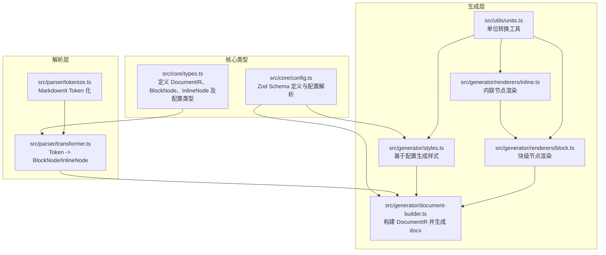
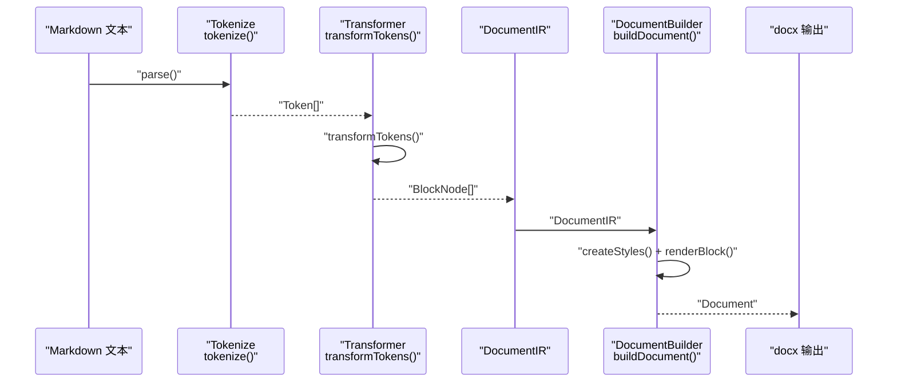
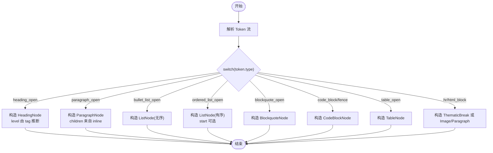
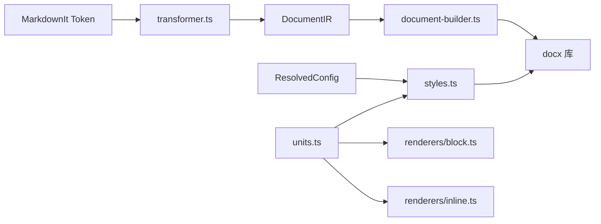

# 类型系统

<cite>
**本文档引用的文件**
- [src/core/types.ts](file://src/core/types.ts)
- [src/core/config.ts](file://src/core/config.ts)
- [src/parser/transformer.ts](file://src/parser/transformer.ts)
- [src/parser/tokenize.ts](file://src/parser/tokenize.ts)
- [src/generator/styles.ts](file://src/generator/styles.ts)
- [src/generator/document-builder.ts](file://src/generator/document-builder.ts)
- [src/generator/renderers/block.ts](file://src/generator/renderers/block.ts)
- [src/generator/renderers/inline.ts](file://src/generator/renderers/inline.ts)
- [src/utils/units.ts](file://src/utils/units.ts)
- [src/index.ts](file://src/index.ts)
- [tests/unit/core/config.test.ts](file://tests/unit/core/config.test.ts)
- [tests/e2e/full-pipeline.test.ts](file://tests/e2e/full-pipeline.test.ts)
- [package.json](file://package.json)
</cite>

## 目录
1. [简介](#简介)
2. [项目结构](#项目结构)
3. [核心组件](#核心组件)
4. [架构总览](#架构总览)
5. [详细组件分析](#详细组件分析)
6. [依赖分析](#依赖分析)
7. [性能考虑](#性能考虑)
8. [故障排除指南](#故障排除指南)
9. [结论](#结论)
10. [附录](#附录)

## 简介
本文件系统性梳理该 Markdown 到 Word 转换器的类型系统设计与实现，重点覆盖：
- 核心类型定义：DocumentIR 接口、BlockNode 与 InlineNode 的继承与多态设计
- 类型层次结构：基础类型、复合类型与联合类型的使用场景
- 类型推导机制：TypeScript 如何从运行时数据（Token）推导出精确的类型信息
- 类型安全策略：编译时检查、运行时验证与错误边界处理
- 关键类型别名：TextStyle、Spacing、Color 等样式相关类型的规范
- 扩展指南：新增节点类型、扩展配置选项与维护向后兼容性的方法
- 完整类型参考与实际使用示例

## 项目结构
类型系统贯穿解析、转换、渲染与生成四个阶段，核心类型定义集中在核心模块，配置类型通过 Zod Schema 进行运行时校验，并在构建阶段输出到公共 API 中。

图表来源
- [src/core/types.ts:1-198](file://src/core/types.ts#L1-L198)
- [src/core/config.ts:1-91](file://src/core/config.ts#L1-L91)
- [src/parser/tokenize.ts:1-16](file://src/parser/tokenize.ts#L1-L16)
- [src/parser/transformer.ts:1-360](file://src/parser/transformer.ts#L1-L360)
- [src/generator/styles.ts:1-122](file://src/generator/styles.ts#L1-L122)
- [src/generator/document-builder.ts:1-112](file://src/generator/document-builder.ts#L1-L112)
- [src/generator/renderers/block.ts:1-266](file://src/generator/renderers/block.ts#L1-L266)
- [src/generator/renderers/inline.ts:1-110](file://src/generator/renderers/inline.ts#L1-L110)
- [src/utils/units.ts:1-45](file://src/utils/units.ts#L1-L45)

章节来源
- [src/core/types.ts:1-198](file://src/core/types.ts#L1-L198)
- [src/core/config.ts:1-91](file://src/core/config.ts#L1-L91)
- [src/parser/tokenize.ts:1-16](file://src/parser/tokenize.ts#L1-L16)
- [src/parser/transformer.ts:1-360](file://src/parser/transformer.ts#L1-L360)
- [src/generator/styles.ts:1-122](file://src/generator/styles.ts#L1-L122)
- [src/generator/document-builder.ts:1-112](file://src/generator/document-builder.ts#L1-L112)
- [src/generator/renderers/block.ts:1-266](file://src/generator/renderers/block.ts#L1-L266)
- [src/generator/renderers/inline.ts:1-110](file://src/generator/renderers/inline.ts#L1-L110)
- [src/utils/units.ts:1-45](file://src/utils/units.ts#L1-L45)

## 核心组件
本节聚焦于类型系统的四大基石：DocumentIR、BlockNode、InlineNode 以及配置类型族。

- DocumentIR：文档中间表示的核心容器，包含元数据、已解析配置与块级节点数组。
- BlockNode：块级节点联合类型，涵盖标题、段落、列表、引用、代码块、表格、图片与分隔线等。
- InlineNode：内联节点联合类型，涵盖文本、粗体、斜体、下划线、行内代码、链接与换行符等。
- 配置类型族：FontConfig、SizeConfig、SpacingConfig、MarginConfig、ImageConfig、HeaderFooterConfig、ColorConfig 与 ResolvedConfig，统一承载样式与布局参数。

章节来源
- [src/core/types.ts:7-198](file://src/core/types.ts#L7-L198)

## 架构总览
类型系统在各层的职责分工如下：
- 解析层：将 Markdown Token 转换为 BlockNode/InlineNode，利用 TypeScript 的字面量类型与联合类型确保分支覆盖与类型安全。
- 渲染层：根据 ResolvedConfig 将节点渲染为 docx 对象，类型驱动样式与布局计算。
- 生成层：构建 DocumentIR 并生成最终的 docx Buffer，配置类型在编译期与运行期共同保障正确性。

图表来源
- [src/parser/tokenize.ts:12-16](file://src/parser/tokenize.ts#L12-L16)
- [src/parser/transformer.ts:25-39](file://src/parser/transformer.ts#L25-L39)
- [src/generator/document-builder.ts:17-106](file://src/generator/document-builder.ts#L17-L106)

## 详细组件分析

### DocumentIR 设计理念
- 结构化容器：包含文档元数据、已解析配置与块级节点数组，作为跨层传递的统一数据载体。
- 类型守卫：通过 type 字段与联合类型确保后续渲染逻辑的分支覆盖与类型安全。
- 元数据与配置：meta 与 config 分离，便于独立扩展与缓存。

章节来源
- [src/core/types.ts:1-12](file://src/core/types.ts#L1-L12)

### BlockNode 与 InlineNode 的继承与多态设计
- 继承关系：两者均采用“带标签字段”的联合类型模式，type 字段充当运行时的“标签”，用于区分不同节点类型。
- 多态设计：渲染器通过 switch 语句按 type 分发，实现对不同节点类型的统一处理与差异化渲染。
- 层次清晰：BlockNode 与 InlineNode 各自形成独立的类型层次，避免相互污染，提升可维护性。

```mermaid
classDiagram
class DocumentIR {
+type : "document"
+meta : DocumentMeta
+config : ResolvedConfig
+children : BlockNode[]
}
class BlockNode {
}
class InlineNode {
}
class HeadingNode {
+type : "heading"
+level : 1|2|3|4|5|6
+children : InlineNode[]
}
class ParagraphNode {
+type : "paragraph"
+children : InlineNode[]
}
class ListNode {
+type : "list"
+ordered : boolean
+start? : number
+children : ListItemNode[]
}
class ListItemNode {
+type : "listItem"
+children : BlockNode[]
}
class BlockquoteNode {
+type : "blockquote"
+children : BlockNode[]
}
class CodeBlockNode {
+type : "codeBlock"
+language? : string
+value : string
}
class TableNode {
+type : "table"
+children : TableRowNode[]
}
class TableRowNode {
+type : "tableRow"
+children : TableCellNode[]
}
class TableCellNode {
+type : "tableCell"
+header : boolean
+children : BlockNode[]
}
class ImageNode {
+type : "image"
+src : string
+alt? : string
+width? : number
+height? : number
+align? : "left"|"center"|"right"
}
class ThematicBreakNode {
+type : "thematicBreak"
}
class TextNode {
+type : "text"
+value : string
}
class BoldNode {
+type : "bold"
+children : InlineNode[]
}
class ItalicNode {
+type : "italic"
+children : InlineNode[]
}
class UnderlineNode {
+type : "underline"
+children : InlineNode[]
}
class InlineCodeNode {
+type : "inlineCode"
+value : string
}
class LinkNode {
+type : "link"
+href : string
+children : InlineNode[]
}
class LineBreakNode {
+type : "lineBreak"
}
BlockNode <|.. HeadingNode
BlockNode <|.. ParagraphNode
BlockNode <|.. ListNode
BlockNode <|.. ListItemNode
BlockNode <|.. BlockquoteNode
BlockNode <|.. CodeBlockNode
BlockNode <|.. TableNode
BlockNode <|.. TableRowNode
BlockNode <|.. TableCellNode
BlockNode <|.. ImageNode
BlockNode <|.. ThematicBreakNode
InlineNode <|.. TextNode
InlineNode <|.. BoldNode
InlineNode <|.. ItalicNode
InlineNode <|.. UnderlineNode
InlineNode <|.. InlineCodeNode
InlineNode <|.. LinkNode
InlineNode <|.. LineBreakNode
```

图表来源
- [src/core/types.ts:7-134](file://src/core/types.ts#L7-L134)

章节来源
- [src/core/types.ts:7-134](file://src/core/types.ts#L7-L134)

### 类型层次结构详解
- 基础类型：字符串、数字、布尔值与枚举（如 level、align、ordered、header），用于描述节点属性。
- 复合类型：节点内部嵌套的 children 字段，体现树形结构；配置对象（如 FontConfig、SizeConfig、ColorConfig）组合多个基础属性。
- 联合类型：BlockNode 与 InlineNode 通过联合类型聚合多种具体节点类型，实现多态分发。

章节来源
- [src/core/types.ts:137-198](file://src/core/types.ts#L137-L198)

### 类型推导机制
- 编译期推导：TypeScript 基于字面量类型（如 level 的 1|2|3|4|5|6）与联合类型自动推导分支覆盖，减少运行时错误。
- 运行期推导：解析器根据 Token 的 type 字段与上下文，构造对应节点对象，配合类型守卫确保分支正确性。
- 模式匹配：渲染器通过 switch(node.type) 实现强类型分支，每个分支返回明确的 docx 对象类型。

图表来源
- [src/parser/transformer.ts:41-122](file://src/parser/transformer.ts#L41-L122)
- [src/parser/transformer.ts:124-236](file://src/parser/transformer.ts#L124-L236)

章节来源
- [src/parser/transformer.ts:25-360](file://src/parser/transformer.ts#L25-L360)

### 类型安全的实现策略
- 编译时检查：通过字面量类型与联合类型约束，确保渲染器 switch 分支完整覆盖所有节点类型。
- 运行时验证：配置使用 Zod Schema 在运行时进行校验与默认值填充，保证 ResolvedConfig 的一致性。
- 错误边界处理：解析与生成过程中的异常通过错误类型暴露，便于上层捕获与处理。

章节来源
- [src/core/config.ts:54-81](file://src/core/config.ts#L54-L81)
- [src/index.ts:20-24](file://src/index.ts#L20-L24)

### 关键类型别名与规范
- TextStyle：内联渲染的样式接口，扩展 IRunOptions，支持字体名称与东亚字体设置。
- Spacing：段落间距配置，包含行间距、段前段后间距等。
- Color：颜色配置，涵盖标题、正文、链接、代码背景与引用边框色等。

章节来源
- [src/generator/renderers/inline.ts:5-11](file://src/generator/renderers/inline.ts#L5-L11)
- [src/core/types.ts:155-185](file://src/core/types.ts#L155-L185)

### 类型扩展指南
- 新增节点类型
  - 在核心类型中定义新接口并加入相应联合类型。
  - 在解析器中添加对应的 Token 处理分支，构造新节点对象。
  - 在渲染器中添加渲染函数或在现有函数中增加分支处理。
  - 更新公共 API 导出，保持对外接口一致。
- 扩展配置选项
  - 在配置 Schema 中新增字段并设置默认值。
  - 在 ResolvedConfig 中添加对应属性。
  - 在样式与渲染逻辑中使用新配置项。
- 维护向后兼容性
  - 使用可选字段与默认值，避免破坏既有行为。
  - 通过测试用例覆盖新增路径，确保类型与行为稳定。

章节来源
- [src/core/types.ts:78-134](file://src/core/types.ts#L78-L134)
- [src/parser/transformer.ts:46-122](file://src/parser/transformer.ts#L46-L122)
- [src/generator/renderers/block.ts:28-58](file://src/generator/renderers/block.ts#L28-L58)
- [src/core/config.ts:54-81](file://src/core/config.ts#L54-L81)

## 依赖分析
类型系统与外部库的耦合点主要体现在 docx 库与 MarkdownIt 库：
- docx：用于构建段落、表格、文本运行等对象，类型系统通过 ResolvedConfig 驱动其样式与布局。
- MarkdownIt：负责 Token 化，类型系统通过 Token 的 type 字段与内容推导节点类型。

图表来源
- [src/parser/tokenize.ts:12-16](file://src/parser/tokenize.ts#L12-L16)
- [src/parser/transformer.ts:25-39](file://src/parser/transformer.ts#L25-L39)
- [src/generator/document-builder.ts:17-106](file://src/generator/document-builder.ts#L17-L106)
- [src/generator/styles.ts:5-109](file://src/generator/styles.ts#L5-L109)
- [src/generator/renderers/block.ts:28-266](file://src/generator/renderers/block.ts#L28-L266)
- [src/generator/renderers/inline.ts:12-109](file://src/generator/renderers/inline.ts#L12-L109)
- [src/utils/units.ts:13-22](file://src/utils/units.ts#L13-L22)

章节来源
- [package.json:27-35](file://package.json#L27-L35)

## 性能考虑
- 类型推导的开销：字面量类型与联合类型在编译期完成，运行期几乎无额外成本。
- 渲染性能：通过批量构建段落与表格，减少对象创建次数；合理使用缓存（如样式）降低重复计算。
- 单位转换：将频繁使用的单位转换函数（ptToHalfPt、ptToTwip）集中管理，避免重复计算。

## 故障排除指南
- 配置校验失败
  - 现象：创建配置时报错或默认值未生效。
  - 处理：检查输入类型是否符合 Zod Schema，确认枚举值与数值范围。
- 渲染异常
  - 现象：某些节点渲染为空或样式不正确。
  - 处理：确认节点类型分支是否完整，检查 children 是否为空或类型不匹配。
- 单元转换错误
  - 现象：页面尺寸或字体大小显示异常。
  - 处理：核对单位转换函数的调用与参数，确保传入正确的数值。

章节来源
- [tests/unit/core/config.test.ts:22-30](file://tests/unit/core/config.test.ts#L22-L30)
- [src/core/config.ts:68-81](file://src/core/config.ts#L68-L81)

## 结论
该类型系统以“带标签字段”的联合类型为核心，结合字面量类型与 Zod Schema，在编译期与运行期共同保障类型安全与行为正确性。通过清晰的层次结构与严格的多态分发，实现了从 Markdown Token 到 docx 对象的高保真转换。建议在扩展新功能时遵循既定的类型设计原则与测试覆盖策略，确保系统的稳定性与可维护性。

## 附录

### 类型定义参考（摘要）
- DocumentIR：文档中间表示容器，包含元数据、配置与块级节点数组。
- BlockNode：块级节点联合类型，覆盖标题、段落、列表、引用、代码块、表格、图片与分隔线。
- InlineNode：内联节点联合类型，覆盖文本、粗体、斜体、下划线、行内代码、链接与换行符。
- ResolvedConfig：已解析配置，包含字体、字号、间距、边距、图片、页眉页脚、颜色、纸张尺寸与方向等。

章节来源
- [src/core/types.ts:7-198](file://src/core/types.ts#L7-L198)

### 实际使用示例（路径）
- 配置创建与合并
  - [tests/unit/core/config.test.ts:5-30](file://tests/unit/core/config.test.ts#L5-L30)
- 端到端生成流程
  - [tests/e2e/full-pipeline.test.ts:9-34](file://tests/e2e/full-pipeline.test.ts#L9-L34)
- 解析与转换
  - [src/parser/tokenize.ts:12-16](file://src/parser/tokenize.ts#L12-L16)
  - [src/parser/transformer.ts:25-360](file://src/parser/transformer.ts#L25-L360)
- 样式与渲染
  - [src/generator/styles.ts:5-122](file://src/generator/styles.ts#L5-L122)
  - [src/generator/renderers/block.ts:28-266](file://src/generator/renderers/block.ts#L28-L266)
  - [src/generator/renderers/inline.ts:12-109](file://src/generator/renderers/inline.ts#L12-L109)
- 公共 API 导出
  - [src/index.ts:5-18](file://src/index.ts#L5-L18)