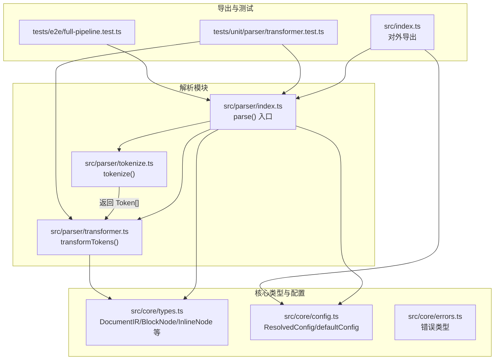
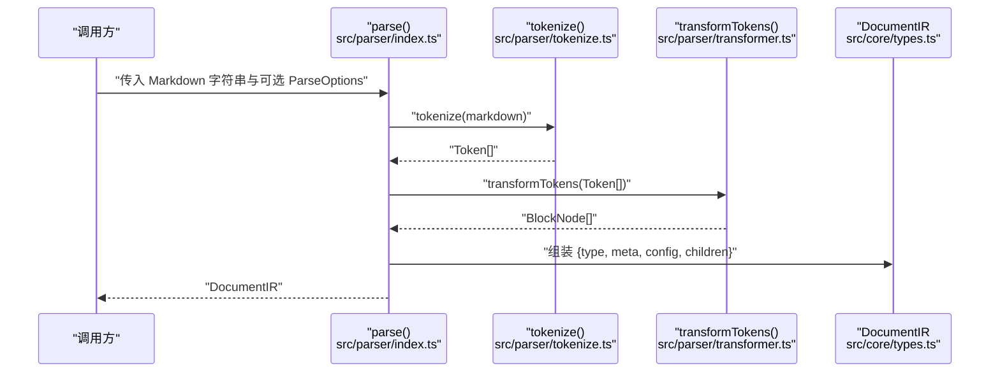
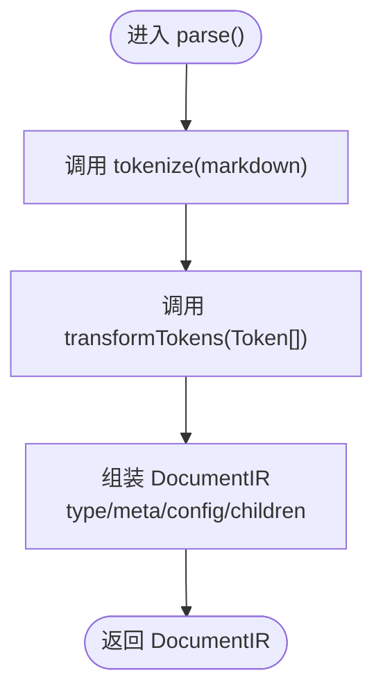
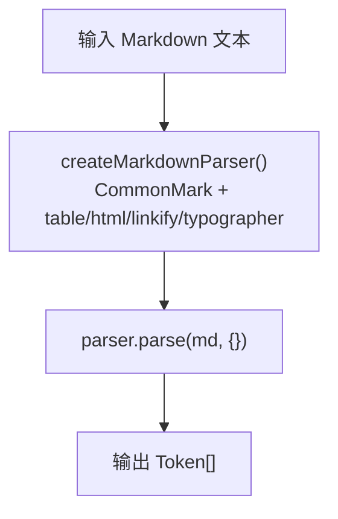
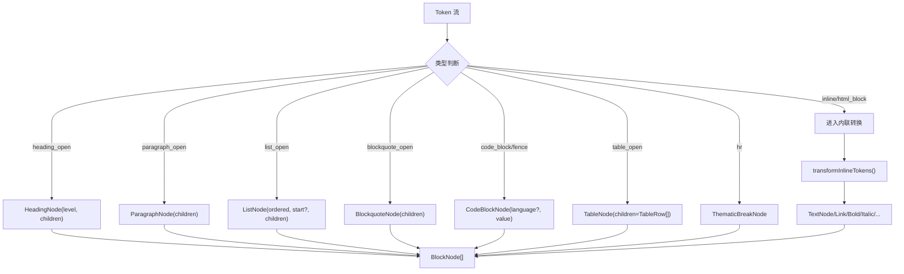
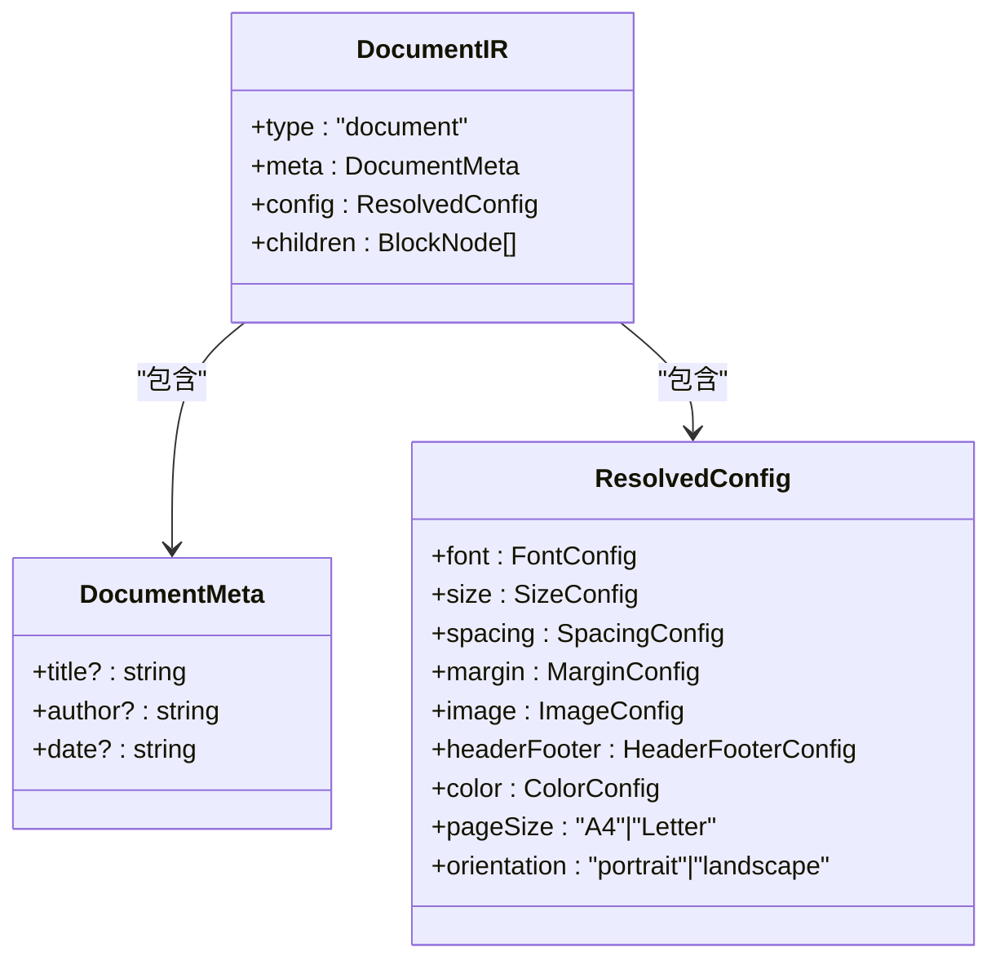
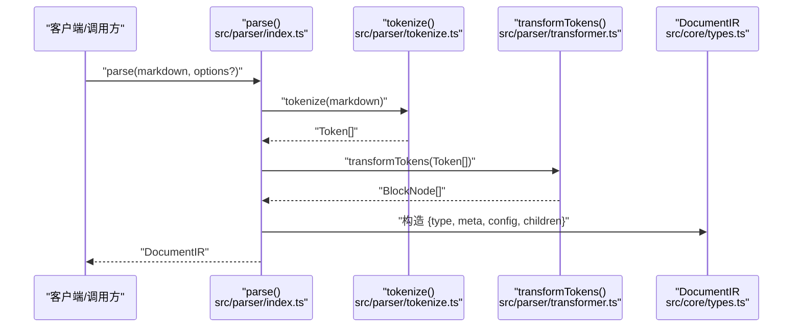
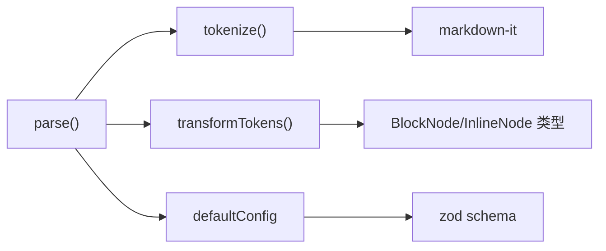

# 解析模块

<cite>
**本文引用的文件**
- [src/parser/index.ts](file://src/parser/index.ts)
- [src/parser/tokenize.ts](file://src/parser/tokenize.ts)
- [src/parser/transformer.ts](file://src/parser/transformer.ts)
- [src/core/types.ts](file://src/core/types.ts)
- [src/core/config.ts](file://src/core/config.ts)
- [src/core/errors.ts](file://src/core/errors.ts)
- [src/index.ts](file://src/index.ts)
- [tests/unit/parser/transformer.test.ts](file://tests/unit/parser/transformer.test.ts)
- [tests/e2e/full-pipeline.test.ts](file://tests/e2e/full-pipeline.test.ts)
- [package.json](file://package.json)
</cite>

## 目录
1. [简介](#简介)
2. [项目结构](#项目结构)
3. [核心组件](#核心组件)
4. [架构总览](#架构总览)
5. [详细组件分析](#详细组件分析)
6. [依赖关系分析](#依赖关系分析)
7. [性能考量](#性能考量)
8. [故障排查指南](#故障排查指南)
9. [结论](#结论)
10. [附录](#附录)

## 简介
本文件聚焦于解析模块，系统性阐述从 Markdown 文本到内部表示（DocumentIR）的完整转换流程。内容涵盖：
- parse() 函数的工作流程与控制流
- ParseOptions 接口的设计与用途
- DocumentIR 的数据结构与字段语义
- 令牌化（tokenize）机制：如何基于 markdown-it 将 Markdown 文本转为 Token 序列
- 令牌转换（transformer）机制：如何将 Token 转换为 BlockNode/InlineNode 树
- 中间表示（DocumentIR）的构建过程与配置注入
- 提供解析流程的时序图与代码路径指引，便于开发者快速定位实现细节

## 项目结构
解析模块位于 src/parser 目录，配合核心类型定义与默认配置，形成清晰的分层：
- 解析入口与选项：src/parser/index.ts
- 令牌化：src/parser/tokenize.ts
- 令牌转换：src/parser/transformer.ts
- 类型与配置：src/core/types.ts、src/core/config.ts
- 错误类型：src/core/errors.ts
- 导出入口：src/index.ts

图表来源
- [src/parser/index.ts:1-24](file://src/parser/index.ts#L1-L24)
- [src/parser/tokenize.ts:1-16](file://src/parser/tokenize.ts#L1-L16)
- [src/parser/transformer.ts:1-360](file://src/parser/transformer.ts#L1-L360)
- [src/core/types.ts:1-198](file://src/core/types.ts#L1-L198)
- [src/core/config.ts:1-91](file://src/core/config.ts#L1-L91)
- [src/index.ts:1-25](file://src/index.ts#L1-L25)
- [tests/unit/parser/transformer.test.ts:1-90](file://tests/unit/parser/transformer.test.ts#L1-L90)
- [tests/e2e/full-pipeline.test.ts:1-52](file://tests/e2e/full-pipeline.test.ts#L1-L52)

章节来源
- [src/parser/index.ts:1-24](file://src/parser/index.ts#L1-L24)
- [src/parser/tokenize.ts:1-16](file://src/parser/tokenize.ts#L1-L16)
- [src/parser/transformer.ts:1-360](file://src/parser/transformer.ts#L1-L360)
- [src/core/types.ts:1-198](file://src/core/types.ts#L1-L198)
- [src/core/config.ts:1-91](file://src/core/config.ts#L1-L91)
- [src/index.ts:1-25](file://src/index.ts#L1-L25)

## 核心组件
- 解析入口函数 parse(markdown, options?): DocumentIR
  - 输入：Markdown 字符串与可选的 ParseOptions
  - 输出：DocumentIR，包含 type、meta、config、children
  - 关键步骤：先 tokenize 再 transformTokens，最后组装 DocumentIR
- ParseOptions 接口
  - meta?: DocumentMeta（标题、作者、日期等）
  - config?: ResolvedConfig（样式与布局配置）
- DocumentIR 数据结构
  - type 固定为 'document'
  - meta 默认为空对象
  - config 默认使用 defaultConfig
  - children 为 BlockNode[]，由 transformTokens 生成

章节来源
- [src/parser/index.ts:6-21](file://src/parser/index.ts#L6-L21)
- [src/core/types.ts:1-12](file://src/core/types.ts#L1-L12)
- [src/core/config.ts:83-91](file://src/core/config.ts#L83-L91)

## 架构总览
解析模块采用“令牌化 + 令牌转换”的两阶段设计：
- 第一阶段：使用 markdown-it 创建 CommonMark 风格解析器，启用 table、html、linkify、typographer 等特性，输出 Token 序列
- 第二阶段：遍历 Token 序列，按块级与内联语法分别转换为 BlockNode/InlineNode 树，最终形成 DocumentIR

图表来源
- [src/parser/index.ts:11-21](file://src/parser/index.ts#L11-L21)
- [src/parser/tokenize.ts:12-15](file://src/parser/tokenize.ts#L12-L15)
- [src/parser/transformer.ts:25-39](file://src/parser/transformer.ts#L25-L39)
- [src/core/types.ts:7-12](file://src/core/types.ts#L7-L12)

## 详细组件分析

### 组件一：parse() 函数与 ParseOptions
- 控制流
  - 调用 tokenize(markdown) 获取 Token[]
  - 调用 transformTokens(Token[]) 获取 BlockNode[]
  - 使用 options.meta 与 options.config 或默认值组装 DocumentIR
- 设计要点
  - ParseOptions.meta 支持注入文档元数据（title、author、date）
  - ParseOptions.config 支持注入自定义样式配置；未提供时回退至 defaultConfig
  - 返回的 DocumentIR.children 为 BlockNode[]，用于后续渲染器生成 DOCX

图表来源
- [src/parser/index.ts:11-21](file://src/parser/index.ts#L11-L21)

章节来源
- [src/parser/index.ts:6-21](file://src/parser/index.ts#L6-L21)

### 组件二：令牌化（tokenize）机制
- 实现细节
  - createMarkdownParser() 基于 markdown-it('commonmark')，开启 html、linkify、typographer，并显式启用 table
  - tokenize(md) 返回 parser.parse(md, {}) 产生的 Token[]，每个 Token 描述一个语法片段
- 语法覆盖
  - 块级：heading、paragraph、list、blockquote、code_block/fence、table、thematic_break、html_block
  - 内联：text、strong/em、code_inline、link、image、softbreak/hardbreak、html_inline、strikethrough
- 外部依赖
  - 依赖 markdown-it 14.x 与 @types/markdown-it

图表来源
- [src/parser/tokenize.ts:4-15](file://src/parser/tokenize.ts#L4-L15)

章节来源
- [src/parser/tokenize.ts:1-16](file://src/parser/tokenize.ts#L1-L16)
- [package.json:33-40](file://package.json#L33-L40)

### 组件三：令牌转换（transformer）机制
- 总体流程
  - transformTokens(Token[]): 遍历 Token，根据类型调用 transformBlockToken，累积 BlockNode[]
  - transformBlockToken(Token, Token[], index): 分派到具体块级节点构造器
  - transformInlineTokens(Token[]): 遍历内联 Token，构造 InlineNode[]
- 块级节点映射
  - heading_open → HeadingNode(level, children)
  - paragraph_open → ParagraphNode(children)
  - bullet_list_open/ordered_list_open → ListNode(ordered, start?, children)
  - list_item_open → ListItemNode(children)
  - blockquote_open → BlockquoteNode(children)
  - code_block/fence → CodeBlockNode(language?, value)
  - table_open → TableNode(children=TableRow[])
  - tr_open → TableRowNode(children=TableCell[])
  - th_open/td_open → TableCellNode(header, children=ParagraphNode(children))
  - hr → ThematicBreakNode
  - inline → ParagraphNode(children)
  - html_block：尝试提取图片，否则作为纯文本段落
- 内联节点映射
  - text → TextNode(value)
  - strong_open/close → BoldNode(children)
  - em_open/close → ItalicNode(children)
  - code_inline → InlineCodeNode(value)
  - link_open/close → LinkNode(href, children)
  - image → 以替代文本形式插入 TextNode（或占位）
  - softbreak/hardbreak → LineBreakNode
  - html_inline：支持 <u> 下划线、  换行、其他 HTML 作为文本
  - s_open/close → Strikethrough（当前作为普通文本）

图表来源
- [src/parser/transformer.ts:25-122](file://src/parser/transformer.ts#L25-L122)
- [src/parser/transformer.ts:124-236](file://src/parser/transformer.ts#L124-L236)
- [src/parser/transformer.ts:238-332](file://src/parser/transformer.ts#L238-L332)

章节来源
- [src/parser/transformer.ts:1-360](file://src/parser/transformer.ts#L1-L360)

### 组件四：DocumentIR 的数据结构设计
- 结构定义
  - type: 'document'
  - meta: DocumentMeta（title、author、date）
  - config: ResolvedConfig（字体、字号、间距、边距、图片、页眉页脚、颜色、纸张尺寸与方向）
  - children: BlockNode[]（由 transformTokens 生成）
- 配置注入
  - 若未提供 options.config，则使用 defaultConfig
  - ResolvedConfig 通过 zod schema 校验与默认值填充，确保类型安全与健壮性

图表来源
- [src/core/types.ts:1-12](file://src/core/types.ts#L1-L12)
- [src/core/types.ts:137-198](file://src/core/types.ts#L137-L198)
- [src/core/config.ts:68-91](file://src/core/config.ts#L68-L91)

章节来源
- [src/core/types.ts:1-198](file://src/core/types.ts#L1-L198)
- [src/core/config.ts:1-91](file://src/core/config.ts#L1-L91)

### 组件五：解析流程时序图（端到端）
该时序图展示从 Markdown 文本到 DocumentIR 的完整链路，包括令牌化与令牌转换两个阶段。

图表来源
- [src/parser/index.ts:11-21](file://src/parser/index.ts#L11-L21)
- [src/parser/tokenize.ts:12-15](file://src/parser/tokenize.ts#L12-L15)
- [src/parser/transformer.ts:25-39](file://src/parser/transformer.ts#L25-L39)
- [src/core/types.ts:7-12](file://src/core/types.ts#L7-L12)

## 依赖关系分析
- 内部依赖
  - parse() 依赖 tokenize() 与 transformTokens()
  - transformTokens() 依赖多种块级/内联转换器
  - DocumentIR 依赖 BlockNode/InlineNode 类型
  - 默认配置 defaultConfig 来源于 core/config.ts
- 外部依赖
  - markdown-it 14.x：提供 CommonMark 令牌化能力与 table 支持
  - zod：用于 ResolvedConfig 的校验与默认值合并

图表来源
- [src/parser/index.ts:1-4](file://src/parser/index.ts#L1-L4)
- [src/parser/tokenize.ts:1-2](file://src/parser/tokenize.ts#L1-L2)
- [src/core/config.ts:1-2](file://src/core/config.ts#L1-L2)
- [package.json:33-35](file://package.json#L33-L35)

章节来源
- [src/parser/index.ts:1-4](file://src/parser/index.ts#L1-L4)
- [src/parser/tokenize.ts:1-2](file://src/parser/tokenize.ts#L1-L2)
- [src/core/config.ts:1-2](file://src/core/config.ts#L1-L2)
- [package.json:33-35](file://package.json#L33-L35)

## 性能考量
- 令牌化阶段
  - 使用 markdown-it 的 CommonMark 规范，解析效率高且兼容性强
  - 启用 table、html、linkify、typographer 可能增加解析开销，建议在不需要时关闭
- 令牌转换阶段
  - transformTokens 采用单次线性扫描，时间复杂度 O(n)，其中 n 为 Token 数量
  - 内联转换中存在嵌套收集（如 strong/em、link、html_inline），但总体仍保持线性复杂度
- 内存占用
  - Token[] 与中间节点树在大文档上可能占用较多内存，建议在生成 DOCX 前进行必要的优化或分块处理

## 故障排查指南
- 常见错误类型
  - MarkdownParseError：解析阶段异常（如不合法的 Markdown 片段）
  - DocxGenerationError：DOCX 生成阶段异常（如模板或渲染问题）
  - ImageProcessingError：图片处理异常（如网络图片不可达）
  - ConfigValidationError：配置校验失败（字段类型或取值范围不正确）
- 定位方法
  - 在 parse() 调用前后检查输入 Markdown 与 ParseOptions
  - 使用单元测试与端到端测试验证令牌化与转换结果
  - 对照测试用例中的期望结构（如标题、列表、表格、代码块、强调与链接）

章节来源
- [src/core/errors.ts:1-28](file://src/core/errors.ts#L1-L28)
- [tests/unit/parser/transformer.test.ts:1-90](file://tests/unit/parser/transformer.test.ts#L1-L90)
- [tests/e2e/full-pipeline.test.ts:1-52](file://tests/e2e/full-pipeline.test.ts#L1-L52)

## 结论
解析模块通过“令牌化 + 令牌转换”的清晰分层，将 Markdown 文本稳健地转换为结构化的 DocumentIR。其设计具备以下特点：
- 明确的接口与类型约束（ParseOptions、DocumentIR、BlockNode/InlineNode）
- 基于 markdown-it 的强大令牌化能力与 CommonMark 兼容性
- 可配置的样式与布局（ResolvedConfig），便于定制化输出
- 清晰的错误模型与测试覆盖，便于维护与扩展

## 附录
- 代码示例路径（仅提供路径，不展示具体代码）
  - 解析入口与选项：[src/parser/index.ts:6-21](file://src/parser/index.ts#L6-L21)
  - 令牌化实现：[src/parser/tokenize.ts:4-15](file://src/parser/tokenize.ts#L4-L15)
  - 令牌转换实现：[src/parser/transformer.ts:25-332](file://src/parser/transformer.ts#L25-L332)
  - 类型定义（DocumentIR/BlockNode/InlineNode）：[src/core/types.ts:1-198](file://src/core/types.ts#L1-L198)
  - 配置与默认值：[src/core/config.ts:68-91](file://src/core/config.ts#L68-L91)
  - 对外导出入口：[src/index.ts:1-25](file://src/index.ts#L1-L25)
  - 单元测试参考：[tests/unit/parser/transformer.test.ts:1-90](file://tests/unit/parser/transformer.test.ts#L1-L90)
  - 端到端测试参考：[tests/e2e/full-pipeline.test.ts:1-52](file://tests/e2e/full-pipeline.test.ts#L1-L52)