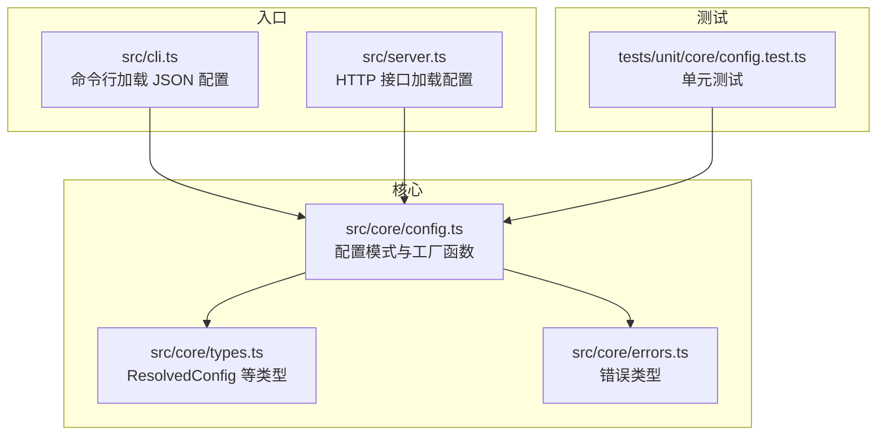
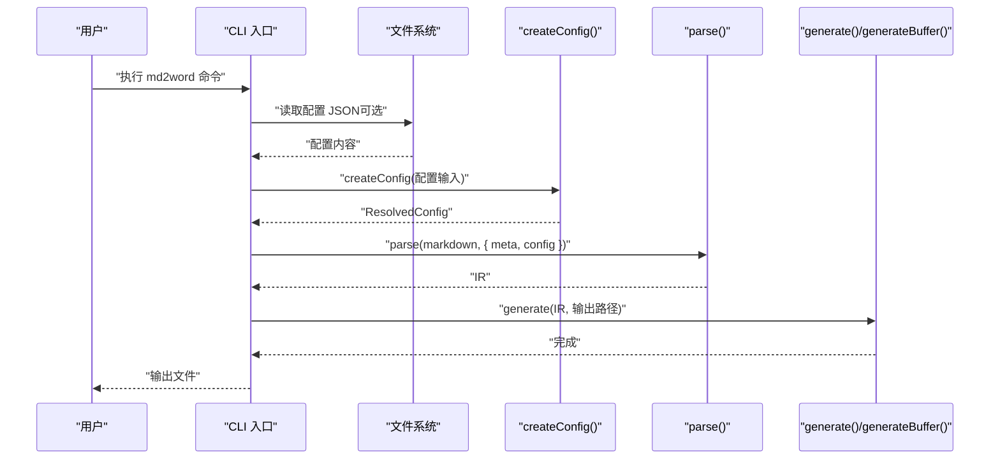
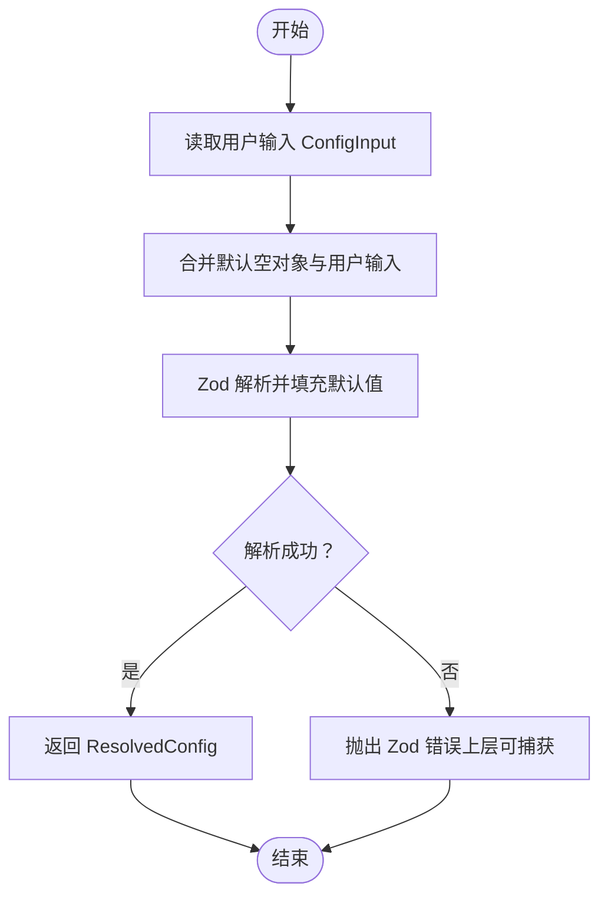
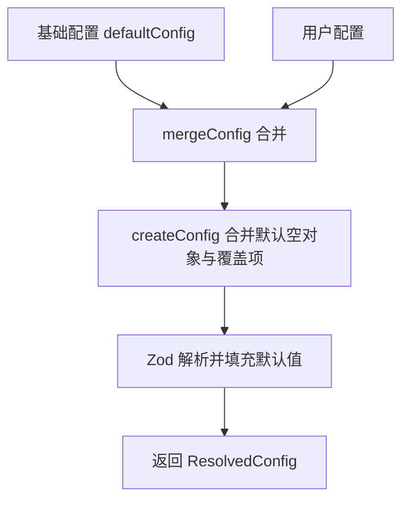
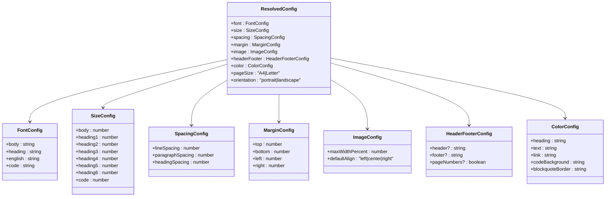
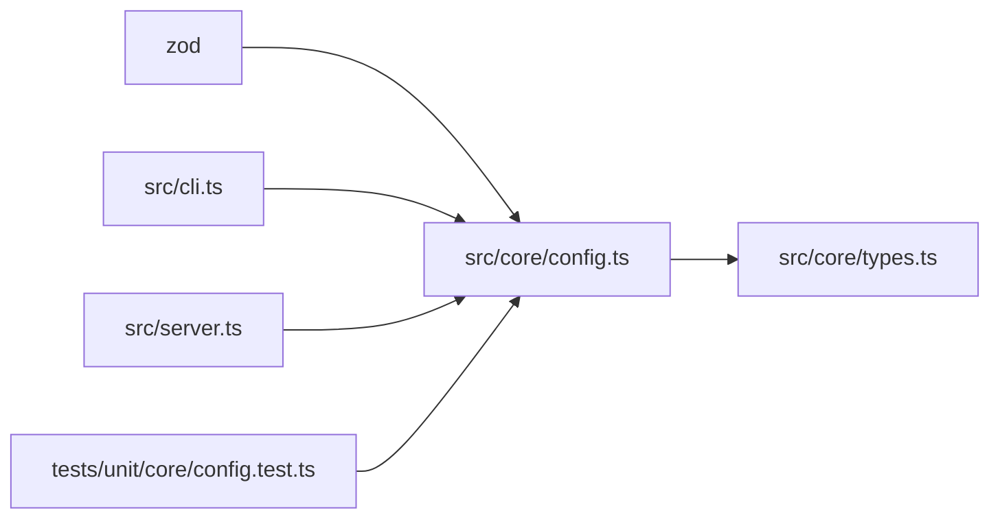

# 配置管理

<cite>
**本文引用的文件**
- [src/core/config.ts](file://src/core/config.ts)
- [src/core/types.ts](file://src/core/types.ts)
- [src/core/errors.ts](file://src/core/errors.ts)
- [src/cli.ts](file://src/cli.ts)
- [src/server.ts](file://src/server.ts)
- [tests/unit/core/config.test.ts](file://tests/unit/core/config.test.ts)
- [package.json](file://package.json)
</cite>

## 目录
1. [简介](#简介)
2. [项目结构](#项目结构)
3. [核心组件](#核心组件)
4. [架构总览](#架构总览)
5. [详细组件分析](#详细组件分析)
6. [依赖关系分析](#依赖关系分析)
7. [性能考量](#性能考量)
8. [故障排查指南](#故障排查指南)
9. [结论](#结论)
10. [附录](#附录)

## 简介
本文件面向“配置管理”模块，系统性梳理配置系统的整体架构与实现细节，重点覆盖以下方面：
- createConfig() 函数的实现与调用路径
- 配置验证机制与类型安全保证（Zod 模式）
- 配置合并算法与优先级策略
- ResolvedConfig 类型设计与默认值约束
- 错误分类与处理机制（含 ConfigValidationError）
- 配置扩展指南、最佳实践与常见场景示例

该系统通过 Zod 定义严格的配置模式，结合 CLI 与服务端入口进行加载与应用，确保从输入到渲染的全链路类型安全与行为可预期。

## 项目结构
配置管理位于核心层，主要文件如下：
- 核心配置与类型：src/core/config.ts、src/core/types.ts
- 错误类型：src/core/errors.ts
- CLI 入口：src/cli.ts（支持从 JSON 文件加载配置）
- 服务端入口：src/server.ts（支持从请求体加载配置）
- 单元测试：tests/unit/core/config.test.ts

图表来源
- [src/core/config.ts:1-91](file://src/core/config.ts#L1-L91)
- [src/core/types.ts:136-198](file://src/core/types.ts#L136-L198)
- [src/core/errors.ts:1-28](file://src/core/errors.ts#L1-L28)
- [src/cli.ts:69-113](file://src/cli.ts#L69-L113)
- [src/server.ts:23-49](file://src/server.ts#L23-L49)
- [tests/unit/core/config.test.ts:1-32](file://tests/unit/core/config.test.ts#L1-L32)

章节来源
- [src/core/config.ts:1-91](file://src/core/config.ts#L1-L91)
- [src/core/types.ts:136-198](file://src/core/types.ts#L136-L198)
- [src/core/errors.ts:1-28](file://src/core/errors.ts#L1-L28)
- [src/cli.ts:69-113](file://src/cli.ts#L69-L113)
- [src/server.ts:23-49](file://src/server.ts#L23-L49)
- [tests/unit/core/config.test.ts:1-32](file://tests/unit/core/config.test.ts#L1-L32)

## 核心组件
- 配置模式与工厂函数
  - 使用 Zod 定义多组子模式（字体、字号、间距、页边距、图片、页眉页脚、颜色、页面尺寸与方向），最终组合为顶层 configSchema。
  - 提供 createConfig() 工厂函数，负责将默认值与用户输入合并后进行严格解析，返回 ResolvedConfig。
  - 提供 mergeConfig() 合并函数，用于在已有配置基础上叠加用户输入。
  - 提供 defaultConfig 常量，作为默认配置快照。
- 类型系统
  - ResolvedConfig 明确所有可配置项、默认值与枚举取值范围，确保编译期与运行期一致。
  - ConfigInput 由 Zod 推导，用于 createConfig 的输入类型约束。
- 错误体系
  - 当前未直接抛出 ConfigValidationError；Zod 解析失败会抛出 ZodError。可在上层捕获并转换为业务错误或统一处理。

章节来源
- [src/core/config.ts:4-64](file://src/core/config.ts#L4-L64)
- [src/core/config.ts:68-91](file://src/core/config.ts#L68-L91)
- [src/core/types.ts:136-198](file://src/core/types.ts#L136-L198)
- [src/core/errors.ts:22-27](file://src/core/errors.ts#L22-L27)

## 架构总览
下图展示 CLI 与服务端如何加载配置并进入解析与生成流程。

图表来源
- [src/cli.ts:69-113](file://src/cli.ts#L69-L113)
- [src/core/config.ts:68-81](file://src/core/config.ts#L68-L81)
- [src/parser/index.ts](file://src/parser/index.ts)
- [src/generator/index.ts](file://src/generator/index.ts)

章节来源
- [src/cli.ts:69-113](file://src/cli.ts#L69-L113)
- [src/core/config.ts:68-81](file://src/core/config.ts#L68-L81)

## 详细组件分析

### createConfig() 实现与调用路径
- 调用路径
  - CLI：从 JSON 文件读取配置后传入 createConfig()。
  - 服务端：从请求体读取配置对象后传入 createConfig()。
- 合并与解析
  - 将各子配置对象初始化为空对象，再与用户输入进行浅合并，最后通过 Zod 模式解析，自动填充默认值并校验类型与范围。
- 返回类型
  - 返回 ResolvedConfig，确保后续渲染与生成阶段无需再次校验。

图表来源
- [src/core/config.ts:68-81](file://src/core/config.ts#L68-L81)
- [src/cli.ts:82-88](file://src/cli.ts#L82-L88)
- [src/server.ts:31](file://src/server.ts#L31)

章节来源
- [src/core/config.ts:68-81](file://src/core/config.ts#L68-L81)
- [src/cli.ts:82-88](file://src/cli.ts#L82-L88)
- [src/server.ts:31](file://src/server.ts#L31)

### Zod 类型验证与模式定义
- 字段分组与默认值
  - 字体：中文字体、英文字体、代码字体等均有默认值。
  - 字号：正文与各级标题字号均有默认值。
  - 间距：行距、段前段后、标题间距均有默认值。
  - 页边距：四边默认值已设定。
  - 图片：最大宽度百分比范围限制与对齐枚举默认值。
  - 页眉页脚：页眉页脚文本可选，页码布尔默认值。
  - 颜色：标题、正文、链接、代码背景、引用边框颜色默认值。
  - 页面：A4/Letter 枚举默认值。
  - 方向：纵向/横向枚举默认值。
- 验证规则
  - 数值范围限制（如图片最大宽度百分比 min/max）。
  - 枚举取值限制（如页面与方向）。
  - 可选字段（如页眉页脚文本）。
- 错误处理策略
  - 当前未显式抛出 ConfigValidationError；Zod 解析失败时会抛出 ZodError。建议在 CLI 与服务端捕获并转换为业务错误，便于统一提示与日志记录。

章节来源
- [src/core/config.ts:4-64](file://src/core/config.ts#L4-L64)
- [src/core/errors.ts:22-27](file://src/core/errors.ts#L22-L27)

### 配置合并算法与优先级
- 合并策略
  - mergeConfig(base, override) 通过 createConfig({ ...base, ...override }) 实现浅合并。
  - 用户输入覆盖基础配置，未提供的键保持不变。
- 优先级说明
  - 默认配置（defaultConfig）作为基线。
  - 用户配置（JSON 或请求体）覆盖默认配置。
  - 同一层级内，后出现的键覆盖先出现的键（由对象展开顺序决定）。
- 测试验证
  - 单元测试覆盖默认值、部分字段覆盖与无效枚举值拒绝。

图表来源
- [src/core/config.ts:83-88](file://src/core/config.ts#L83-L88)
- [src/core/config.ts:68-81](file://src/core/config.ts#L68-L81)
- [tests/unit/core/config.test.ts:26-30](file://tests/unit/core/config.test.ts#L26-L30)

章节来源
- [src/core/config.ts:83-88](file://src/core/config.ts#L83-L88)
- [tests/unit/core/config.test.ts:26-30](file://tests/unit/core/config.test.ts#L26-L30)

### ResolvedConfig 类型设计
- 结构组成
  - 字体、字号、间距、页边距、图片、页眉页脚、颜色、页面尺寸、方向。
- 默认值与约束
  - 所有默认值在 Zod 模式中定义，确保 ResolvedConfig 与模式一致。
  - 枚举与数值范围在模式中受控，避免运行期异常。
- 类型安全
  - ConfigInput 由 Zod 推导，createConfig 的输入类型与 ResolvedConfig 的输出类型完全对应，消除类型不匹配风险。

图表来源
- [src/core/types.ts:136-198](file://src/core/types.ts#L136-L198)

章节来源
- [src/core/types.ts:136-198](file://src/core/types.ts#L136-L198)

### 错误分类与处理机制
- 当前错误类型
  - MarkdownParseError、DocxGenerationError、ImageProcessingError、ConfigValidationError。
- 配置验证错误
  - createConfig() 使用 Zod 进行验证；当输入不符合模式时，Zod 抛出 ZodError。
  - 建议在 CLI 与服务端捕获 ZodError，并转换为 ConfigValidationError 或统一的业务错误，以便输出清晰的错误信息与日志。
- 调试方法
  - 在捕获异常后打印 Zod 错误的路径与期望值，辅助定位问题字段。
  - 对于 CLI，可增加 --debug 参数输出解析后的 ResolvedConfig 以核对默认值填充是否符合预期。

章节来源
- [src/core/errors.ts:1-28](file://src/core/errors.ts#L1-L28)
- [src/core/config.ts:68-81](file://src/core/config.ts#L68-L81)

### 配置扩展指南与最佳实践
- 扩展新配置项
  - 在 configSchema 中新增子模式字段，并在 ResolvedConfig 中声明对应接口。
  - 为新字段提供合理的默认值与范围约束，确保 Zod 模式完整覆盖。
- 优先级与合并
  - 保持 mergeConfig 的浅合并策略，避免深层嵌套导致的复杂覆盖逻辑。
  - 对于可选字段，明确其可选性并在模式中使用 optional()。
- 类型安全
  - 仅通过 createConfig() 与 mergeConfig() 生成 ResolvedConfig，避免绕过 Zod 校验。
  - 使用 ConfigInput 作为输入类型，确保输入与输出类型一致。
- 最佳实践
  - CLI 与服务端均应捕获并转换 Zod 错误，提供用户友好的错误消息。
  - 对于 JSON 配置文件，建议提供示例模板与字段说明，减少歧义。
  - 在开发阶段开启严格类型检查，确保新增字段不会破坏现有类型约束。

章节来源
- [src/core/config.ts:4-64](file://src/core/config.ts#L4-L64)
- [src/core/types.ts:136-198](file://src/core/types.ts#L136-L198)

### 常见配置场景示例
- CLI 加载 JSON 配置
  - 通过 -c/--config 指定配置文件路径，文件内容被解析为 ConfigInput 并传入 createConfig()。
- 服务端接收请求体配置
  - 请求体包含 markdown、config（ConfigInput）、meta，服务端解析后传入 createConfig()。
- 部分字段覆盖
  - 仅提供需要变更的字段，未提供的字段保持默认值。

章节来源
- [src/cli.ts:82-88](file://src/cli.ts#L82-L88)
- [src/server.ts:31](file://src/server.ts#L31)
- [tests/unit/core/config.test.ts:14-20](file://tests/unit/core/config.test.ts#L14-L20)

## 依赖关系分析
- 外部依赖
  - zod：用于配置模式定义与运行时验证。
  - docx、libreoffice 等：用于文档生成与预览（与配置解耦，但配置影响渲染结果）。
- 内部依赖
  - CLI 与服务端均依赖 createConfig() 与 ResolvedConfig 类型。
  - 单元测试依赖 createConfig() 与 mergeConfig() 的行为。

图表来源
- [package.json:27-35](file://package.json#L27-L35)
- [src/core/config.ts:1](file://src/core/config.ts#L1)
- [src/cli.ts:6](file://src/cli.ts#L6)
- [src/server.ts:8](file://src/server.ts#L8)
- [tests/unit/core/config.test.ts:2](file://tests/unit/core/config.test.ts#L2)

章节来源
- [package.json:27-35](file://package.json#L27-L35)
- [src/core/config.ts:1](file://src/core/config.ts#L1)
- [src/cli.ts:6](file://src/cli.ts#L6)
- [src/server.ts:8](file://src/server.ts#L8)
- [tests/unit/core/config.test.ts:2](file://tests/unit/core/config.test.ts#L2)

## 性能考量
- Zod 解析成本
  - createConfig() 在每次调用时进行一次 Zod 解析与默认值填充，通常开销较小。
  - 若频繁调用，可考虑缓存 ResolvedConfig（需确保输入不变）。
- 合并策略
  - mergeConfig() 采用浅合并，时间复杂度低，适合大多数场景。
- I/O 与外部工具
  - CLI 与服务端涉及文件读取与 LibreOffice 转换，这些操作的性能瓶颈通常不在配置层。

## 故障排查指南
- 输入类型不符
  - 症状：createConfig() 抛出 Zod 错误。
  - 排查：检查 JSON 配置文件或请求体字段类型与枚举取值，确认数值范围是否满足 min/max。
- 无效枚举值
  - 症状：pageSize、orientation 等字段报错。
  - 排查：确认取值是否为允许的枚举集合。
- 合并覆盖不生效
  - 症状：期望覆盖的字段未改变。
  - 排查：确认覆盖字段层级是否正确，以及是否存在同名键被后出现的键覆盖的情况。
- 统一错误处理
  - 建议在 CLI 与服务端捕获 ZodError，并转换为业务错误，输出清晰的错误信息与建议。

章节来源
- [src/core/config.ts:68-81](file://src/core/config.ts#L68-L81)
- [tests/unit/core/config.test.ts:22-24](file://tests/unit/core/config.test.ts#L22-L24)

## 结论
本配置管理模块通过 Zod 模式定义严格的配置结构，结合 createConfig() 与 mergeConfig() 提供了可靠的类型安全与默认值填充能力。CLI 与服务端入口均以统一方式加载与应用配置，配合单元测试验证关键行为。建议在上层捕获并转换 Zod 错误，提升用户体验与可维护性；同时遵循浅合并与类型推导的最佳实践，确保配置扩展的稳定性与一致性。

## 附录
- 关键 API 速览
  - createConfig(input?): ResolvedConfig
  - mergeConfig(base, override): ResolvedConfig
  - defaultConfig: ResolvedConfig
- 相关类型
  - ResolvedConfig、ConfigInput、各子配置接口（FontConfig、SizeConfig、SpacingConfig、MarginConfig、ImageConfig、HeaderFooterConfig、ColorConfig）

章节来源
- [src/core/config.ts:66-91](file://src/core/config.ts#L66-L91)
- [src/core/types.ts:136-198](file://src/core/types.ts#L136-L198)