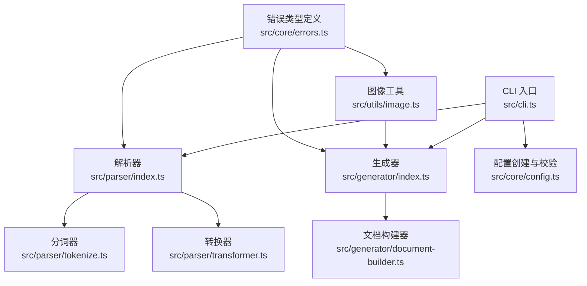
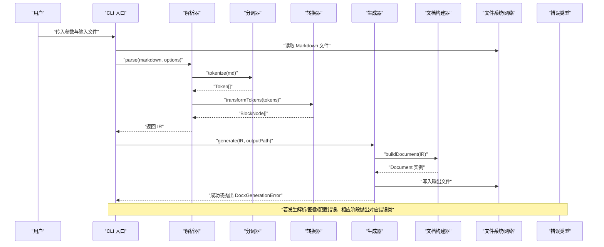
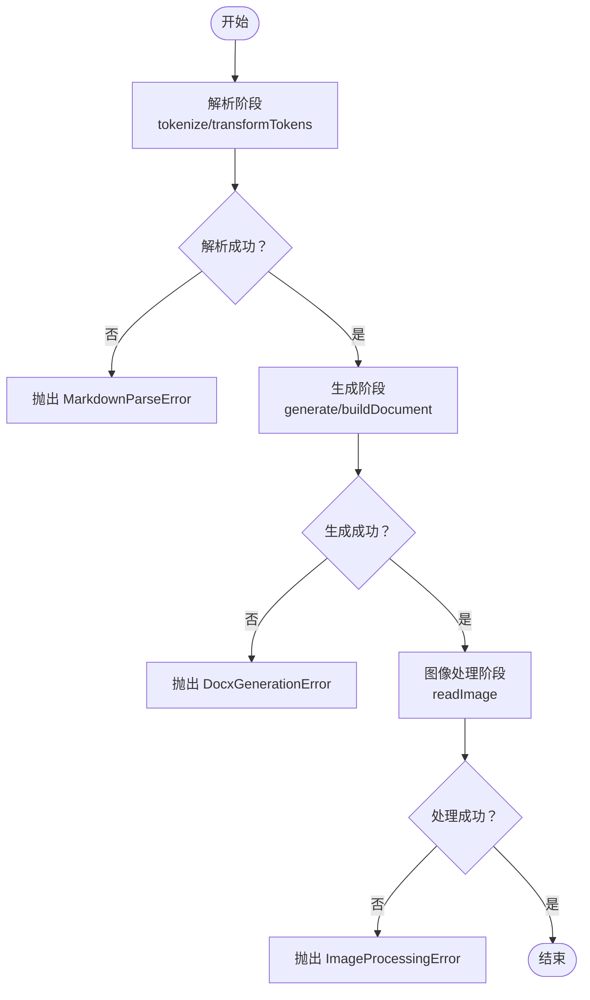
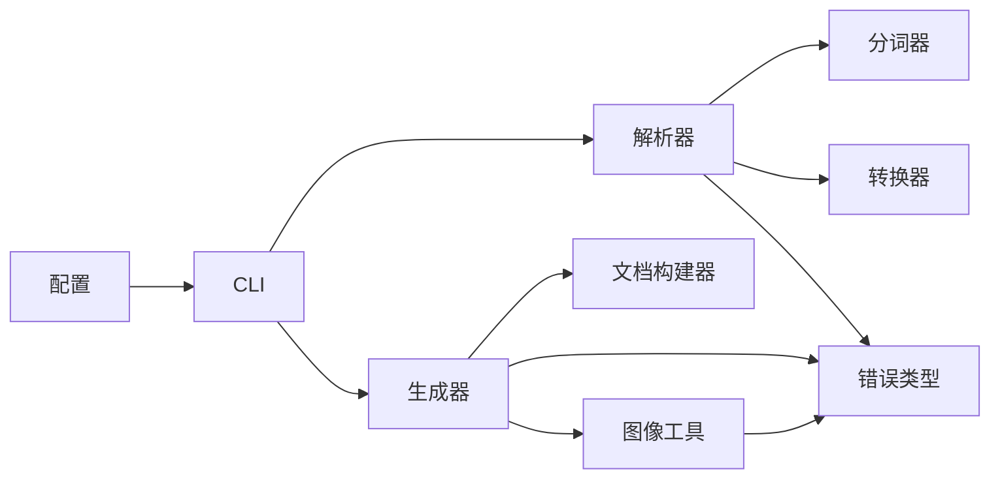

# 错误处理

<cite>
**本文引用的文件**
- [src/core/errors.ts](file://src/core/errors.ts)
- [src/core/types.ts](file://src/core/types.ts)
- [src/core/config.ts](file://src/core/config.ts)
- [src/parser/index.ts](file://src/parser/index.ts)
- [src/parser/tokenize.ts](file://src/parser/tokenize.ts)
- [src/parser/transformer.ts](file://src/parser/transformer.ts)
- [src/generator/index.ts](file://src/generator/index.ts)
- [src/generator/document-builder.ts](file://src/generator/document-builder.ts)
- [src/utils/image.ts](file://src/utils/image.ts)
- [src/cli.ts](file://src/cli.ts)
- [tests/unit/core/config.test.ts](file://tests/unit/core/config.test.ts)
- [tests/e2e/full-pipeline.test.ts](file://tests/e2e/full-pipeline.test.ts)
</cite>

## 目录
1. [简介](#简介)
2. [项目结构](#项目结构)
3. [核心组件](#核心组件)
4. [架构总览](#架构总览)
5. [详细组件分析](#详细组件分析)
6. [依赖分析](#依赖分析)
7. [性能考量](#性能考量)
8. [故障排查指南](#故障排查指南)
9. [结论](#结论)
10. [附录](#附录)

## 简介
本文件聚焦于本项目的错误处理机制，系统性梳理错误类型体系（基础错误类、业务逻辑错误与系统错误）、错误传播策略、恢复与降级策略、监控与调试最佳实践，并提供常见问题的诊断指南与测试策略建议。通过对解析、转换与生成三个阶段的代码级分析，明确错误的来源、传递路径与上下文保留方式，帮助开发者在出现异常时快速定位与修复。

## 项目结构
围绕错误处理的关键模块与文件如下：
- 核心错误类型定义：src/core/errors.ts
- 类型与配置：src/core/types.ts、src/core/config.ts
- 解析层：src/parser/index.ts、src/parser/tokenize.ts、src/parser/transformer.ts
- 生成层：src/generator/index.ts、src/generator/document-builder.ts
- 工具与图像处理：src/utils/image.ts
- 命令行入口：src/cli.ts
- 单元与端到端测试：tests/unit/core/config.test.ts、tests/e2e/full-pipeline.test.ts

图表来源
- [src/cli.ts:69-113](file://src/cli.ts#L69-L113)
- [src/parser/index.ts:11-21](file://src/parser/index.ts#L11-L21)
- [src/parser/tokenize.ts:12-15](file://src/parser/tokenize.ts#L12-L15)
- [src/parser/transformer.ts:25-39](file://src/parser/transformer.ts#L25-L39)
- [src/generator/index.ts:7-18](file://src/generator/index.ts#L7-L18)
- [src/generator/document-builder.ts:17-106](file://src/generator/document-builder.ts#L17-L106)
- [src/core/config.ts:68-81](file://src/core/config.ts#L68-L81)
- [src/utils/image.ts:12-42](file://src/utils/image.ts#L12-L42)
- [src/core/errors.ts:1-27](file://src/core/errors.ts#L1-L27)

章节来源
- [src/cli.ts:69-113](file://src/cli.ts#L69-L113)
- [src/parser/index.ts:11-21](file://src/parser/index.ts#L11-L21)
- [src/generator/index.ts:7-18](file://src/generator/index.ts#L7-L18)
- [src/core/config.ts:68-81](file://src/core/config.ts#L68-L81)
- [src/utils/image.ts:12-42](file://src/utils/image.ts#L12-L42)

## 核心组件
本项目通过一组专用错误类实现清晰的错误分类与上下文保留：
- MarkdownParseError：用于标记解析阶段的错误，携带可选的源位置信息。
- DocxGenerationError：用于标记生成阶段的错误，携带底层原因以便追踪。
- ImageProcessingError：用于标记图像处理阶段的错误，携带源地址与底层原因。
- ConfigValidationError：用于标记配置校验阶段的错误，携带问题列表以便诊断。

这些错误类均继承自原生 Error，便于与 Node.js 运行时和上层调用方兼容。

章节来源
- [src/core/errors.ts:1-27](file://src/core/errors.ts#L1-L27)

## 架构总览
下图展示从命令行到解析与生成的整体流程，以及错误在各阶段的传播路径与上下文保留点。

图表来源
- [src/cli.ts:77-109](file://src/cli.ts#L77-L109)
- [src/parser/index.ts:11-21](file://src/parser/index.ts#L11-L21)
- [src/parser/tokenize.ts:12-15](file://src/parser/tokenize.ts#L12-L15)
- [src/parser/transformer.ts:25-39](file://src/parser/transformer.ts#L25-L39)
- [src/generator/index.ts:7-18](file://src/generator/index.ts#L7-L18)
- [src/generator/document-builder.ts:17-106](file://src/generator/document-builder.ts#L17-L106)
- [src/core/errors.ts:1-27](file://src/core/errors.ts#L1-L27)

## 详细组件分析

### 错误类型体系与分类
- 基础错误类
  - MarkdownParseError：用于解析阶段的错误，适合在解析器内部捕获并向上抛出，保留源信息。
  - DocxGenerationError：用于生成阶段的错误，适合在生成器中捕获底层异常并包装为统一错误类型。
  - ImageProcessingError：用于图像处理阶段的错误，适合在网络请求或文件读取失败时抛出，保留源地址与底层原因。
  - ConfigValidationError：用于配置校验阶段的错误，适合在配置创建与合并时抛出，保留问题列表以便诊断。
- 触发条件
  - 解析阶段：分词或转换过程中遇到不支持的语法或状态不一致。
  - 生成阶段：构建文档或序列化为缓冲区时发生底层库异常。
  - 图像处理阶段：网络请求失败、文件读取失败或图像元数据解析失败。
  - 配置阶段：输入配置不符合 Zod 模式约束。
- 错误消息格式
  - 统一采用“描述性文本 + 可选上下文”的形式，便于日志与用户提示。
  - 对底层异常进行包装时，保留原始错误作为 cause，避免丢失堆栈。

章节来源
- [src/core/errors.ts:1-27](file://src/core/errors.ts#L1-L27)

### 错误传播策略
- 解析阶段
  - tokenize 与 transformTokens 未显式 try/catch，错误会向上传播至 parse；parse 返回 IR，不直接处理错误。
  - 建议：在 parse 外层或 CLI 中捕获并统一处理，保留元数据与配置上下文。
- 生成阶段
  - generate 包裹 buildDocument 的调用，捕获任何异常并以 DocxGenerationError 重新抛出，携带输出路径等上下文。
- 图像处理阶段
  - readImage 在 try/catch 内部，若非已知 ImageProcessingError 则包装为该类型，保留源地址与底层原因。
- 配置阶段
  - createConfig 使用 Zod 校验，校验失败会抛出 Zod 异常；建议在 CLI 层捕获并转换为 ConfigValidationError，保留问题列表。

图表来源
- [src/parser/tokenize.ts:12-15](file://src/parser/tokenize.ts#L12-L15)
- [src/parser/transformer.ts:25-39](file://src/parser/transformer.ts#L25-L39)
- [src/generator/index.ts:7-18](file://src/generator/index.ts#L7-L18)
- [src/utils/image.ts:12-42](file://src/utils/image.ts#L12-L42)
- [src/core/errors.ts:1-27](file://src/core/errors.ts#L1-L27)

章节来源
- [src/generator/index.ts:7-18](file://src/generator/index.ts#L7-L18)
- [src/utils/image.ts:12-42](file://src/utils/image.ts#L12-L42)

### 错误恢复与降级策略
- 部分失败容错
  - 图像处理：当单个图片处理失败时，可选择跳过该图片并记录警告，同时保留文档其余内容的生成。
  - 表格/列表/块级元素：在转换器中对单个节点的转换失败进行局部跳过，记录节点类型与索引，保证整体文档生成。
- 回退方案
  - 默认样式与配置：当配置无效时，使用默认配置回退，确保生成可用文档。
  - 降级渲染：对于不支持的内联/块级语法，降级为纯文本或段落，避免中断整个流程。
- 上下文保留
  - 所有错误均携带上下文信息（如源地址、cause、issues），便于后续重试或人工干预。

章节来源
- [src/utils/image.ts:12-42](file://src/utils/image.ts#L12-L42)
- [src/parser/transformer.ts:25-39](file://src/parser/transformer.ts#L25-L39)
- [src/core/config.ts:68-81](file://src/core/config.ts#L68-L81)

### 错误监控与调试最佳实践
- 日志记录
  - 在 CLI 层统一捕获错误，输出结构化日志（含时间戳、错误类型、消息与 cause）。
  - 对于 DocxGenerationError，记录输出路径；对于 ImageProcessingError，记录源地址。
- 堆栈跟踪
  - 保持 cause 链，使用 Node.js 原生堆栈或第三方库增强堆栈信息。
  - 在开发环境开启 source map 与严格模式，提升定位效率。
- 性能影响最小化
  - 避免在热路径重复计算错误对象；优先复用错误实例或延迟构造。
  - 对网络请求与 I/O 操作设置超时与重试，减少阻塞。

章节来源
- [src/cli.ts:106-109](file://src/cli.ts#L106-L109)
- [src/generator/index.ts:12-17](file://src/generator/index.ts#L12-L17)
- [src/utils/image.ts:38-41](file://src/utils/image.ts#L38-L41)

### 常见错误场景与诊断指南
- 配置错误
  - 现象：createConfig 抛出校验异常。
  - 诊断：检查配置键值是否符合 Zod 模式，如枚举值、数值范围等。
  - 解决：修正配置文件或默认值，必要时使用 mergeConfig 合并覆盖。
- 输入格式错误
  - 现象：解析阶段抛出 MarkdownParseError 或底层解析异常。
  - 诊断：确认 Markdown 文本是否符合 commonmark 规范，是否存在未闭合的语法块。
  - 解决：规范化输入或在 CLI 层提示具体错误位置。
- 系统资源限制
  - 现象：生成阶段抛出 DocxGenerationError，可能由内存不足或磁盘空间不足导致。
  - 诊断：监控进程内存与磁盘使用情况，检查输出路径权限。
  - 解决：优化文档规模、清理临时文件或调整系统资源。
- 图像处理失败
  - 现象：readImage 抛出 ImageProcessingError，可能由网络不可达或图像损坏导致。
  - 诊断：检查 URL 可访问性与响应状态，验证本地文件存在与可读。
  - 解决：替换为可用资源或启用降级渲染。

章节来源
- [src/core/config.ts:68-81](file://src/core/config.ts#L68-L81)
- [src/generator/index.ts:12-17](file://src/generator/index.ts#L12-L17)
- [src/utils/image.ts:12-42](file://src/utils/image.ts#L12-L42)

### 测试策略
- 单元测试
  - 配置校验：验证非法配置触发校验异常，确保 createConfig 正确抛出错误。
  - 参考：tests/unit/core/config.test.ts 中对非法 pageSize 的断言。
- 端到端测试
  - 管道完整性：从解析到生成的完整流程应产出有效的 DOCX 缓冲区。
  - 参考：tests/e2e/full-pipeline.test.ts 中对缓冲区类型与 ZIP 标识的断言。
- 错误注入测试
  - 在生成器与图像工具中模拟异常，验证 DocxGenerationError 与 ImageProcessingError 的包装与传播。
  - 在解析器中模拟不合法输入，验证 MarkdownParseError 的触发与上下文保留。

章节来源
- [tests/unit/core/config.test.ts:22-24](file://tests/unit/core/config.test.ts#L22-L24)
- [tests/e2e/full-pipeline.test.ts:8-34](file://tests/e2e/full-pipeline.test.ts#L8-L34)

## 依赖分析
- 组件耦合
  - CLI 依赖解析器与生成器；解析器依赖分词器与转换器；生成器依赖文档构建器与图像工具。
  - 错误类型被多处使用，形成跨模块的统一错误语义。
- 外部依赖
  - markdown-it：负责 Markdown 分词，错误通常在转换器中暴露。
  - docx：负责文档构建与序列化，生成阶段异常通过 DocxGenerationError 包装。
  - sharp：负责图像元数据读取，图像处理异常通过 ImageProcessingError 包装。
  - zod：负责配置校验，异常在 CLI 层转换为 ConfigValidationError。

图表来源
- [src/cli.ts:69-113](file://src/cli.ts#L69-L113)
- [src/parser/index.ts:11-21](file://src/parser/index.ts#L11-L21)
- [src/generator/index.ts:7-18](file://src/generator/index.ts#L7-L18)
- [src/utils/image.ts:12-42](file://src/utils/image.ts#L12-L42)
- [src/core/errors.ts:1-27](file://src/core/errors.ts#L1-L27)
- [src/core/config.ts:68-81](file://src/core/config.ts#L68-L81)

章节来源
- [src/cli.ts:69-113](file://src/cli.ts#L69-L113)
- [src/parser/index.ts:11-21](file://src/parser/index.ts#L11-L21)
- [src/generator/index.ts:7-18](file://src/generator/index.ts#L7-L18)
- [src/utils/image.ts:12-42](file://src/utils/image.ts#L12-L42)
- [src/core/errors.ts:1-27](file://src/core/errors.ts#L1-L27)
- [src/core/config.ts:68-81](file://src/core/config.ts#L68-L81)

## 性能考量
- 错误包装成本
  - 尽量避免在高频路径中频繁构造错误对象；可复用错误实例或延迟初始化。
- I/O 与网络
  - 对网络请求设置合理超时与重试策略，防止长时间阻塞。
- 内存管理
  - 生成大文档时注意内存峰值，必要时分批处理或降低图像质量。
- 日志开销
  - 在生产环境控制错误日志级别，避免过多 I/O 影响吞吐。

## 故障排查指南
- 快速定位
  - 查看 CLI 输出的错误消息与退出码；结合 cause 获取底层异常。
  - 对照错误类型判断发生在解析、生成还是图像处理阶段。
- 常见症状与处理
  - 配置错误：修正配置后重试；必要时使用默认配置回退。
  - 解析失败：检查 Markdown 语法，逐步缩小问题范围。
  - 生成失败：检查输出路径权限与磁盘空间，降低文档复杂度。
  - 图像失败：更换可用资源或禁用图像渲染。

章节来源
- [src/cli.ts:106-109](file://src/cli.ts#L106-L109)
- [src/generator/index.ts:12-17](file://src/generator/index.ts#L12-L17)
- [src/utils/image.ts:38-41](file://src/utils/image.ts#L38-L41)

## 结论
本项目通过明确的错误类型体系与严格的传播策略，实现了从解析到生成的全链路错误管理。配合 CLI 层的统一捕获与上下文保留，能够有效支撑调试与监控。建议在现有基础上进一步完善错误注入测试与降级策略，以提升系统的鲁棒性与可维护性。

## 附录
- 错误类型一览
  - MarkdownParseError：解析阶段错误，携带源信息。
  - DocxGenerationError：生成阶段错误，携带底层原因。
  - ImageProcessingError：图像处理阶段错误，携带源地址与底层原因。
  - ConfigValidationError：配置校验阶段错误，携带问题列表。
- 关键实现参考
  - 错误类型定义：[src/core/errors.ts:1-27](file://src/core/errors.ts#L1-L27)
  - 解析流程：[src/parser/index.ts:11-21](file://src/parser/index.ts#L11-L21)、[src/parser/tokenize.ts:12-15](file://src/parser/tokenize.ts#L12-L15)、[src/parser/transformer.ts:25-39](file://src/parser/transformer.ts#L25-L39)
  - 生成流程：[src/generator/index.ts:7-18](file://src/generator/index.ts#L7-L18)、[src/generator/document-builder.ts:17-106](file://src/generator/document-builder.ts#L17-L106)
  - 图像处理：[src/utils/image.ts:12-42](file://src/utils/image.ts#L12-L42)
  - 配置校验：[src/core/config.ts:68-81](file://src/core/config.ts#L68-81)
  - CLI 入口：[src/cli.ts:69-113](file://src/cli.ts#L69-113)
  - 测试参考：[tests/unit/core/config.test.ts:22-24](file://tests/unit/core/config.test.ts#L22-L24)、[tests/e2e/full-pipeline.test.ts:8-34](file://tests/e2e/full-pipeline.test.ts#L8-L34)