# 类型定义

<cite>
**本文档引用的文件**
- [src/core/types.ts](file://src/core/types.ts)
- [src/core/config.ts](file://src/core/config.ts)
- [src/core/errors.ts](file://src/core/errors.ts)
- [src/generator/styles.ts](file://src/generator/styles.ts)
- [src/generator/renderers/block.ts](file://src/generator/renderers/block.ts)
- [src/generator/renderers/inline.ts](file://src/generator/renderers/inline.ts)
- [src/generator/document-builder.ts](file://src/generator/document-builder.ts)
- [src/parser/tokenize.ts](file://src/parser/tokenize.ts)
- [src/parser/transformer.ts](file://src/parser/transformer.ts)
- [src/utils/units.ts](file://src/utils/units.ts)
- [src/utils/image.ts](file://src/utils/image.ts)
- [src/wopi/storage.ts](file://src/wopi/storage.ts)
- [src/index.ts](file://src/index.ts)
</cite>

## 目录
1. [简介](#简介)
2. [项目结构](#项目结构)
3. [核心类型系统](#核心类型系统)
4. [文档中间表示类型](#文档中间表示类型)
5. [配置类型系统](#配置类型系统)
6. [渲染器类型定义](#渲染器类型定义)
7. [工具函数类型](#工具函数类型)
8. [错误类型系统](#错误类型系统)
9. [WOPi存储类型](#wopi存储类型)
10. [导出接口](#导出接口)
11. [类型关系图](#类型关系图)

## 简介

本文件详细分析了 Markdown 转 Word 文档转换系统的类型定义体系。该系统采用 TypeScript 构建，具有完整的类型安全性和严格的接口约束。本文档将深入解析核心类型、配置系统、渲染器架构以及相关的工具函数类型定义。

## 项目结构

该代码库采用模块化架构，主要包含以下核心模块：

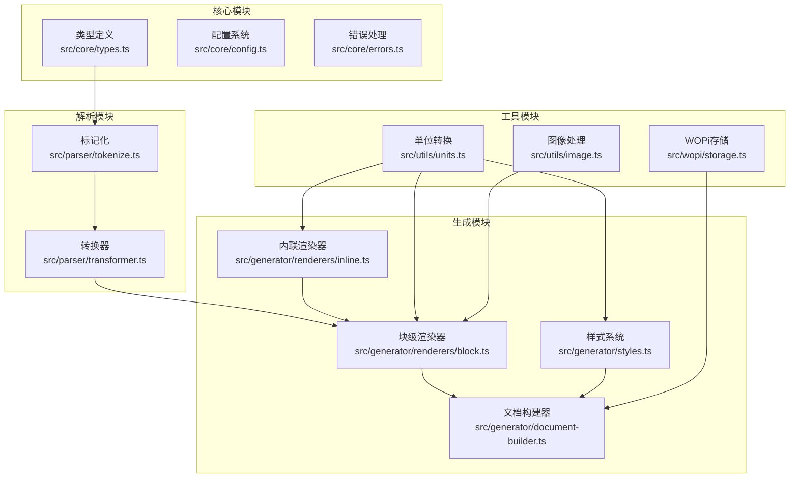

**图表来源**
- [src/core/types.ts:1-204](file://src/core/types.ts#L1-L204)
- [src/core/config.ts:1-91](file://src/core/config.ts#L1-L91)
- [src/parser/tokenize.ts:1-16](file://src/parser/tokenize.ts#L1-L16)
- [src/parser/transformer.ts:1-359](file://src/parser/transformer.ts#L1-L359)

## 核心类型系统

### 文档元数据类型

系统使用 `DocumentMeta` 接口定义文档的基本元信息：

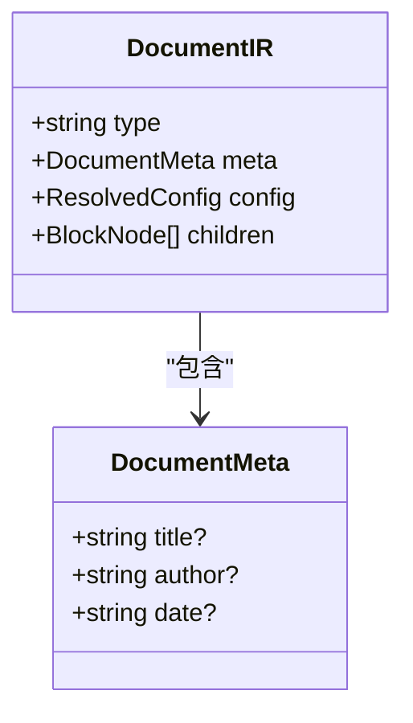

**图表来源**
- [src/core/types.ts:1-12](file://src/core/types.ts#L1-L12)

### 块级节点类型

系统定义了完整的块级节点类型层次结构，支持 Markdown 的所有块级元素：

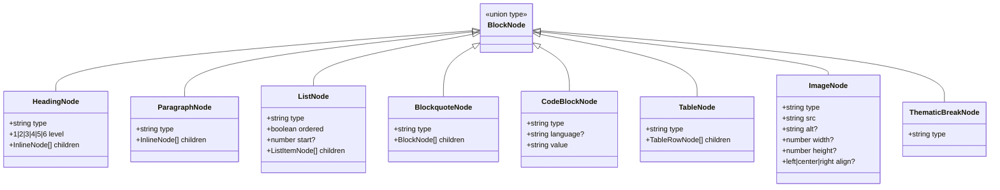

**图表来源**
- [src/core/types.ts:14-89](file://src/core/types.ts#L14-L89)

### 内联节点类型

内联节点类型定义了文本格式化的基础元素：

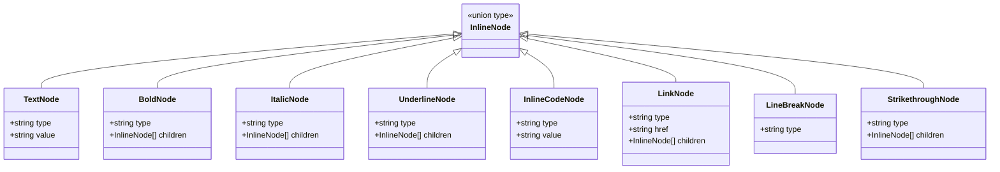

**图表来源**
- [src/core/types.ts:91-140](file://src/core/types.ts#L91-L140)

**章节来源**
- [src/core/types.ts:1-204](file://src/core/types.ts#L1-L204)

## 文档中间表示类型

### 解析流程类型

系统通过中间表示（IR）在解析和生成之间传递数据：

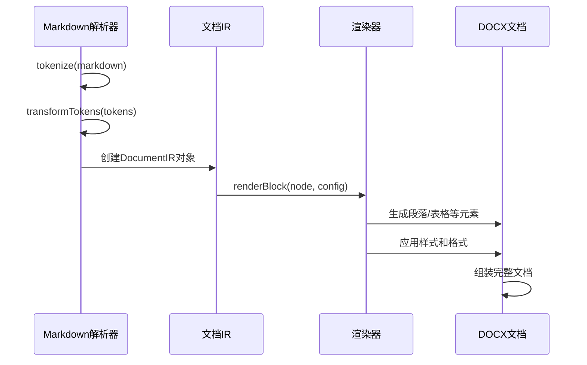

**图表来源**
- [src/parser/tokenize.ts:12-15](file://src/parser/tokenize.ts#L12-L15)
- [src/parser/transformer.ts:25-39](file://src/parser/transformer.ts#L25-L39)
- [src/generator/document-builder.ts:18-29](file://src/generator/document-builder.ts#L18-L29)

**章节来源**
- [src/parser/tokenize.ts:1-16](file://src/parser/tokenize.ts#L1-L16)
- [src/parser/transformer.ts:1-359](file://src/parser/transformer.ts#L1-L359)
- [src/generator/document-builder.ts:1-193](file://src/generator/document-builder.ts#L1-L193)

## 配置类型系统

### 配置架构

系统使用 Zod 进行配置验证，确保运行时配置的完整性：

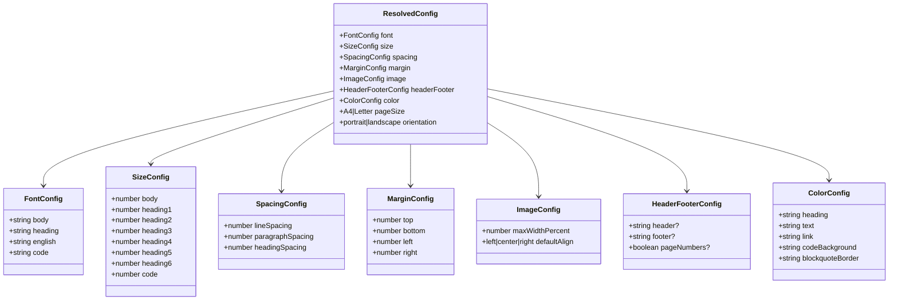

**图表来源**
- [src/core/types.ts:143-203](file://src/core/types.ts#L143-L203)
- [src/core/config.ts:4-64](file://src/core/config.ts#L4-L64)

### 配置验证流程

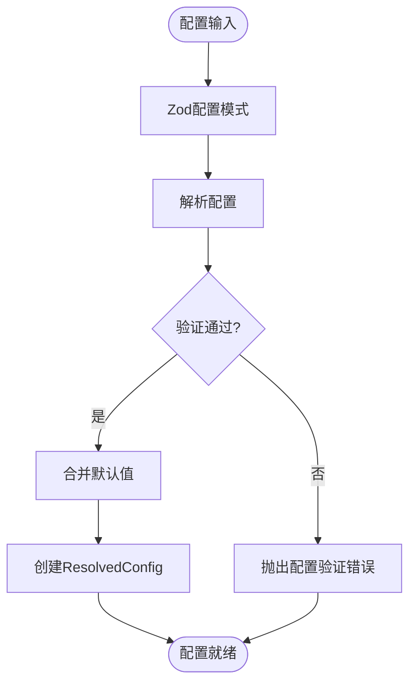

**图表来源**
- [src/core/config.ts:68-81](file://src/core/config.ts#L68-L81)
- [src/core/errors.ts:22-27](file://src/core/errors.ts#L22-L27)

**章节来源**
- [src/core/config.ts:1-91](file://src/core/config.ts#L1-L91)
- [src/core/types.ts:142-203](file://src/core/types.ts#L142-L203)

## 渲染器类型定义

### 块级渲染器类型

块级渲染器负责将块级节点转换为 DOCX 元素：

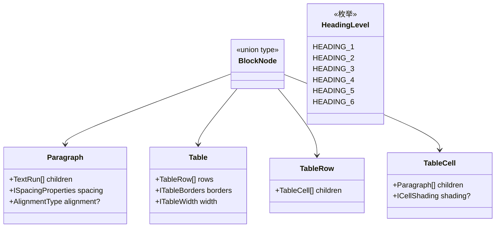

**图表来源**
- [src/generator/renderers/block.ts:13-26](file://src/generator/renderers/block.ts#L13-L26)

### 内联渲染器类型

内联渲染器处理文本格式化：

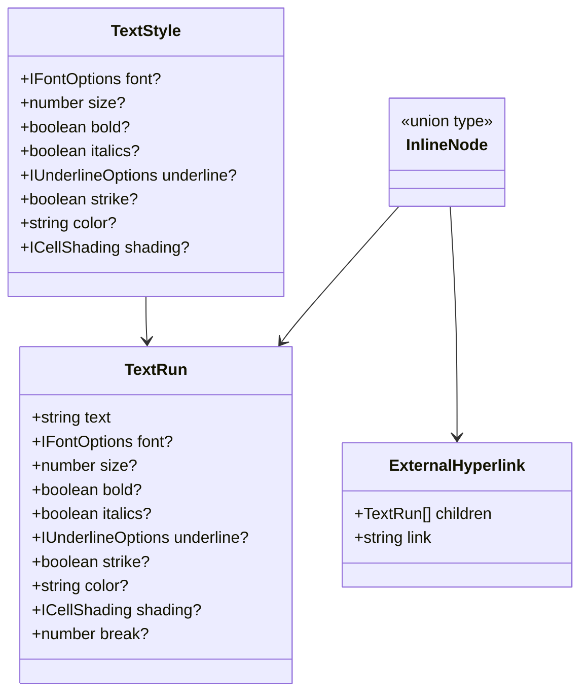

**图表来源**
- [src/generator/renderers/inline.ts:5-12](file://src/generator/renderers/inline.ts#L5-L12)

**章节来源**
- [src/generator/renderers/block.ts:1-286](file://src/generator/renderers/block.ts#L1-L286)
- [src/generator/renderers/inline.ts:1-128](file://src/generator/renderers/inline.ts#L1-L128)

## 工具函数类型

### 单位转换类型

系统提供精确的单位转换函数：

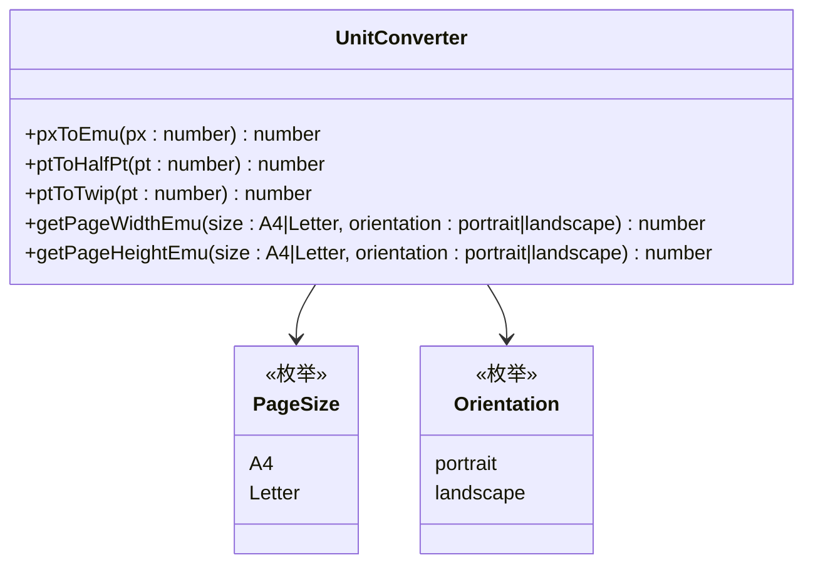

**图表来源**
- [src/utils/units.ts:6-44](file://src/utils/units.ts#L6-L44)

### 图像处理类型

图像处理功能包含完整的元数据类型：

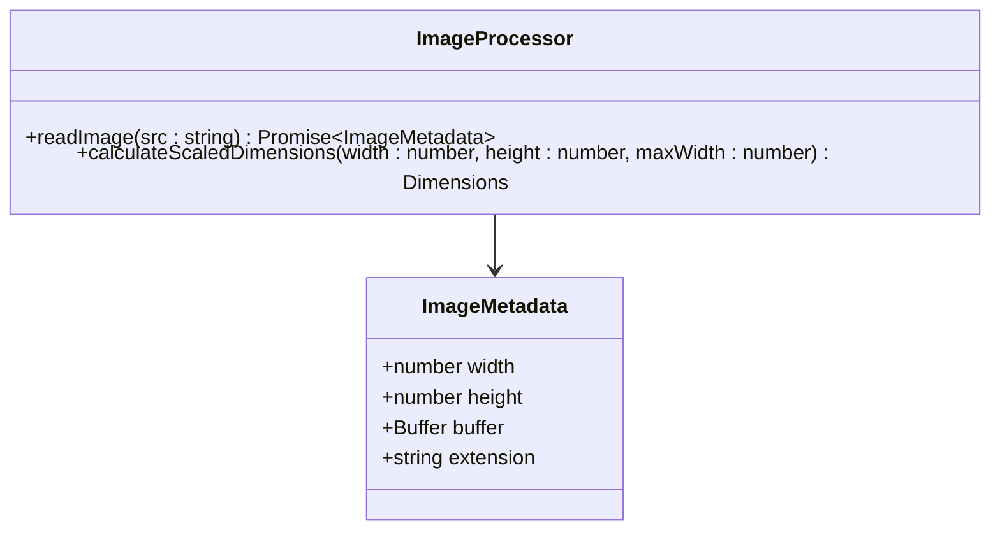

**图表来源**
- [src/utils/image.ts:5-10](file://src/utils/image.ts#L5-L10)

**章节来源**
- [src/utils/units.ts:1-45](file://src/utils/units.ts#L1-L45)
- [src/utils/image.ts:1-58](file://src/utils/image.ts#L1-L58)

## 错误类型系统

系统定义了完整的错误类型层次结构：

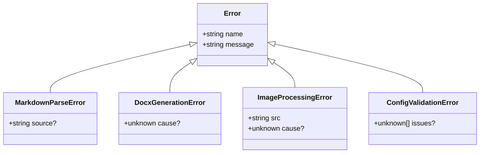

**图表来源**
- [src/core/errors.ts:1-27](file://src/core/errors.ts#L1-L27)

**章节来源**
- [src/core/errors.ts:1-28](file://src/core/errors.ts#L1-L28)

## WOPi存储类型

WOPi 存储系统提供了临时文件管理功能：

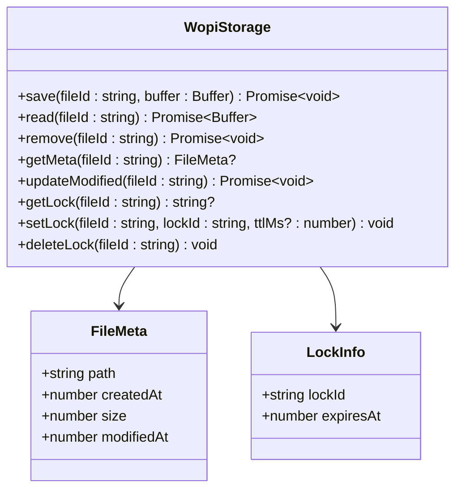

**图表来源**
- [src/wopi/storage.ts:9-10](file://src/wopi/storage.ts#L9-L10)

**章节来源**
- [src/wopi/storage.ts:1-81](file://src/wopi/storage.ts#L1-L81)

## 导出接口

主入口文件统一导出了所有公共类型：

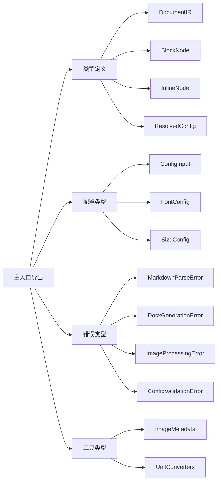

**图表来源**
- [src/index.ts:5-24](file://src/index.ts#L5-L24)

**章节来源**
- [src/index.ts:1-25](file://src/index.ts#L1-L25)

## 类型关系图

系统整体类型关系如下：

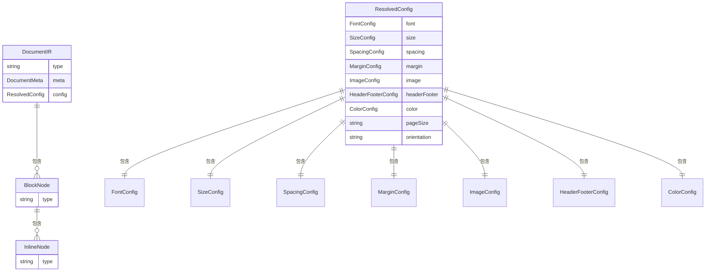

**图表来源**
- [src/core/types.ts:7-203](file://src/core/types.ts#L7-L203)

该类型定义系统展现了现代 TypeScript 应用的典型特征：严格的类型约束、清晰的接口分离、完善的错误处理机制，以及模块化的架构设计。通过这些类型定义，开发者可以确保代码的类型安全性，同时获得良好的开发体验和维护性。