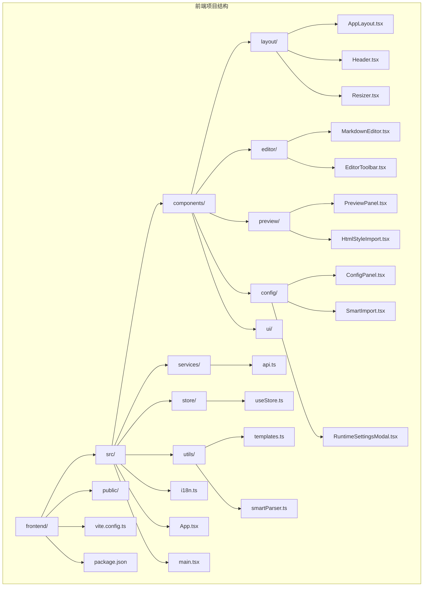
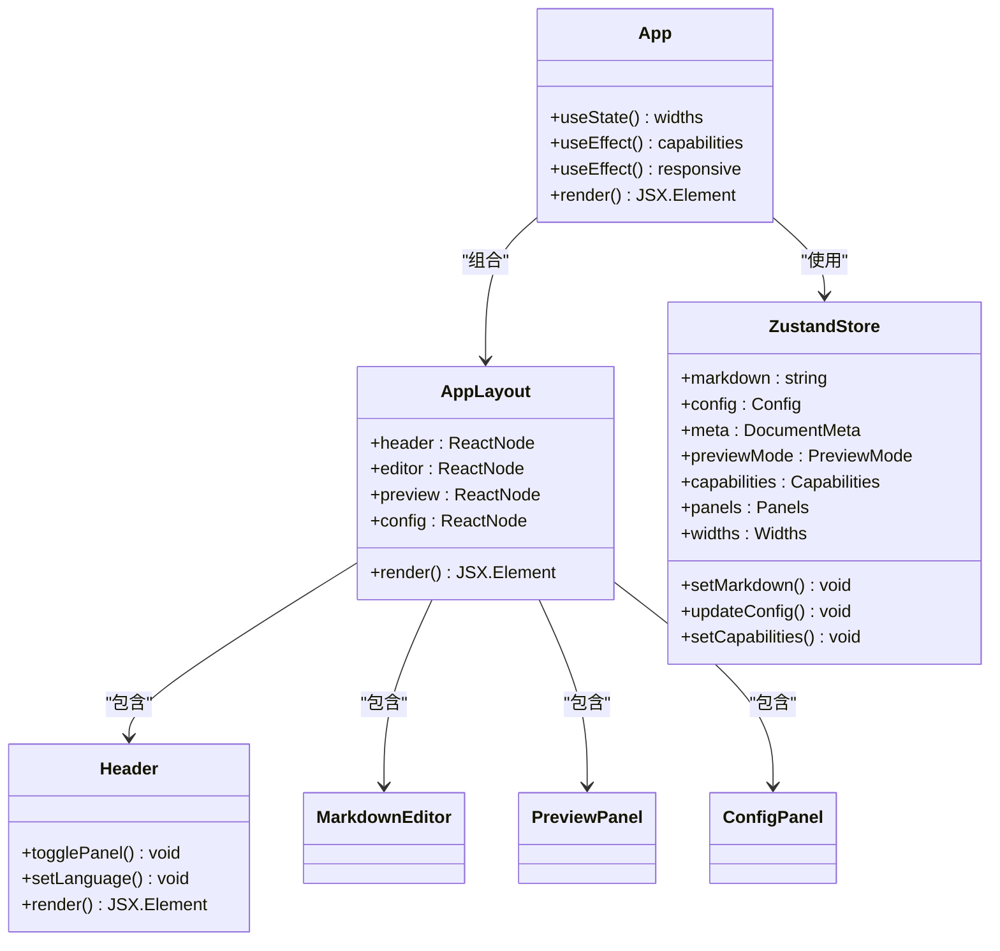
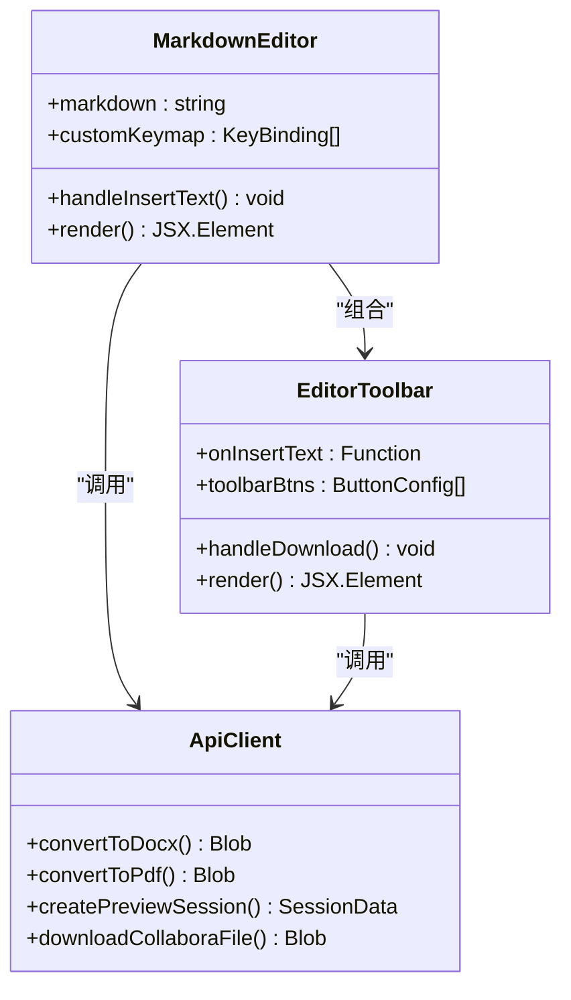
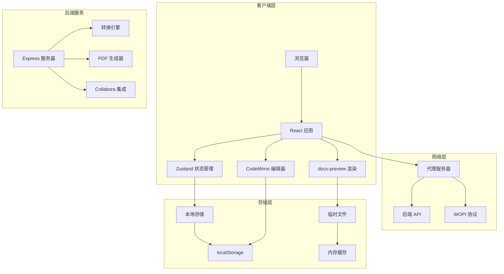
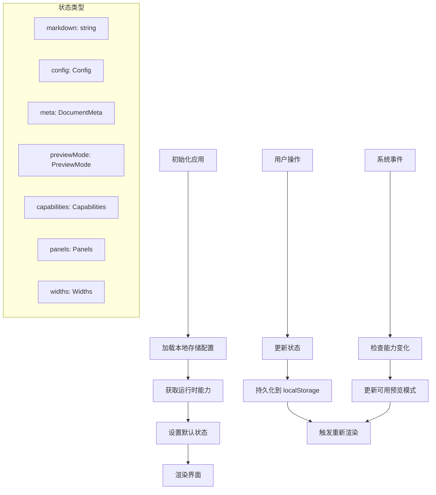
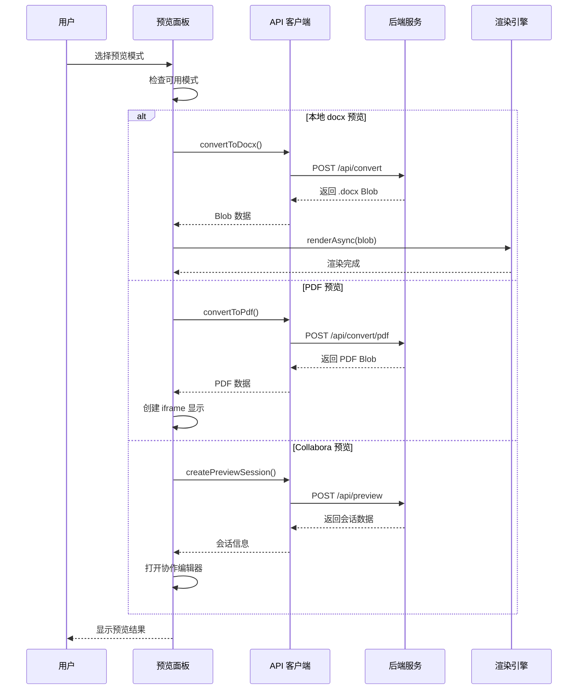
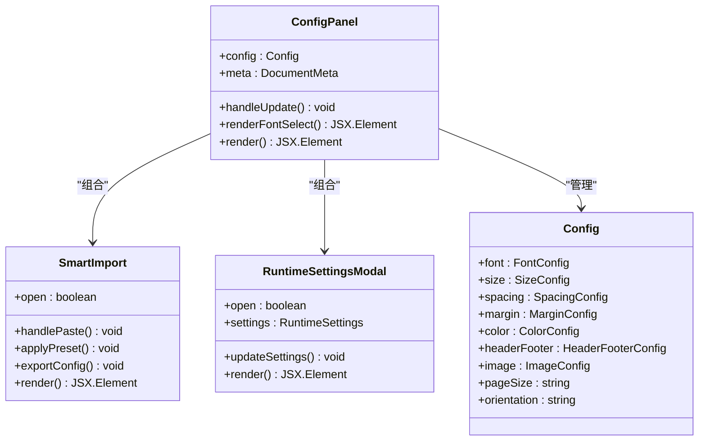
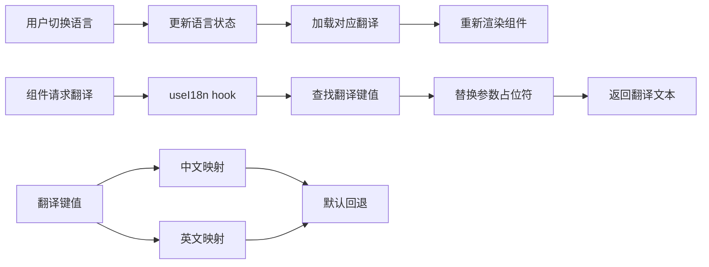
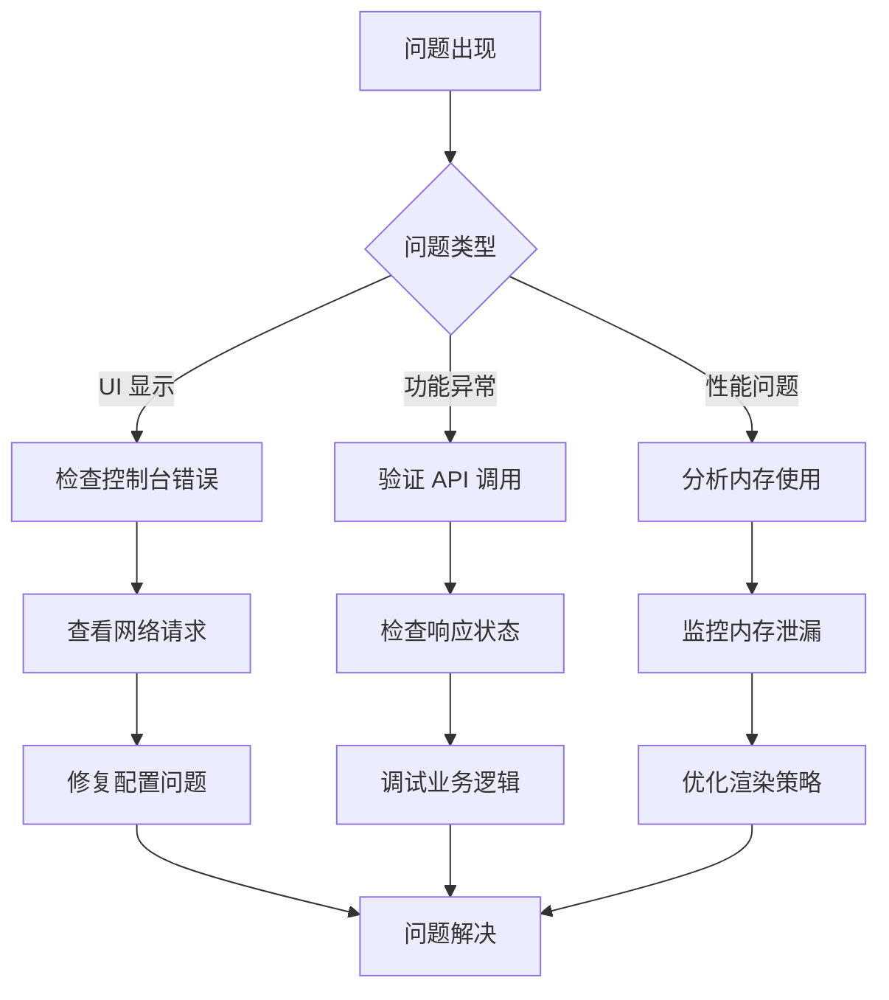

# 统一前端架构指南

<cite>
**本文档引用的文件**
- [README.md](file://README.md)
- [App.tsx](file://frontend/src/App.tsx)
- [main.tsx](file://frontend/src/main.tsx)
- [useStore.ts](file://frontend/src/store/useStore.ts)
- [api.ts](file://frontend/src/services/api.ts)
- [AppLayout.tsx](file://frontend/src/components/layout/AppLayout.tsx)
- [Header.tsx](file://frontend/src/components/layout/Header.tsx)
- [MarkdownEditor.tsx](file://frontend/src/components/editor/MarkdownEditor.tsx)
- [EditorToolbar.tsx](file://frontend/src/components/editor/EditorToolbar.tsx)
- [PreviewPanel.tsx](file://frontend/src/components/preview/PreviewPanel.tsx)
- [ConfigPanel.tsx](file://frontend/src/components/config/ConfigPanel.tsx)
- [templates.ts](file://frontend/src/utils/templates.ts)
- [i18n.ts](file://frontend/src/i18n.ts)
- [vite.config.ts](file://frontend/vite.config.ts)
- [package.json](file://frontend/package.json)
</cite>

## 目录
1. [简介](#简介)
2. [项目结构](#项目结构)
3. [核心组件](#核心组件)
4. [架构概览](#架构概览)
5. [详细组件分析](#详细组件分析)
6. [依赖关系分析](#依赖关系分析)
7. [性能考虑](#性能考虑)
8. [故障排除指南](#故障排除指南)
9. [结论](#结论)

## 简介

这是一个基于 React + Vite 的 Markdown 转 Word 转换服务的统一前端架构指南。该系统提供了完整的 Markdown 编辑、实时预览、配置管理和文档导出功能，支持多种输出格式（.docx、PDF）和预览模式（本地预览、在线协作编辑）。

系统采用模块化设计，具有以下核心特性：
- 实时 Markdown 编辑与语法高亮
- 多种预览模式（Markdown、HTML、本地 docx 预览、PDF 预览、Collabora 在线编辑）
- 可定制的排版配置（字体、字号、间距、颜色等）
- 国际化支持（中英文）
- 响应式布局设计
- 模块化的状态管理

## 项目结构

前端项目采用清晰的分层架构，主要目录结构如下：



**图表来源**
- [package.json:1-44](file://frontend/package.json#L1-L44)
- [vite.config.ts:1-22](file://frontend/vite.config.ts#L1-L22)

**章节来源**
- [README.md:139-146](file://README.md#L139-L146)
- [package.json:1-44](file://frontend/package.json#L1-L44)

## 核心组件

### 应用入口与布局

应用采用中心辐射式布局设计，主要由以下几个核心组件构成：



**图表来源**
- [App.tsx:12-76](file://frontend/src/App.tsx#L12-L76)
- [AppLayout.tsx:10-22](file://frontend/src/components/layout/AppLayout.tsx#L10-L22)
- [Header.tsx:7-73](file://frontend/src/components/layout/Header.tsx#L7-L73)
- [useStore.ts:208-291](file://frontend/src/store/useStore.ts#L208-L291)

### 编辑器系统

Markdown 编辑器采用 CodeMirror 6 构建，提供丰富的编辑功能：



**图表来源**
- [MarkdownEditor.tsx:11-124](file://frontend/src/components/editor/MarkdownEditor.tsx#L11-L124)
- [EditorToolbar.tsx:11-110](file://frontend/src/components/editor/EditorToolbar.tsx#L11-L110)
- [api.ts:52-129](file://frontend/src/services/api.ts#L52-L129)

**章节来源**
- [MarkdownEditor.tsx:11-124](file://frontend/src/components/editor/MarkdownEditor.tsx#L11-L124)
- [EditorToolbar.tsx:11-110](file://frontend/src/components/editor/EditorToolbar.tsx#L11-L110)

## 架构概览

系统采用前后端分离架构，前端负责用户界面和交互逻辑，后端提供 API 服务。



**图表来源**
- [vite.config.ts:15-20](file://frontend/vite.config.ts#L15-L20)
- [api.ts:3-129](file://frontend/src/services/api.ts#L3-L129)

## 详细组件分析

### 状态管理系统

应用使用 Zustand 进行状态管理，提供全局状态共享和响应式更新。



**图表来源**
- [useStore.ts:208-291](file://frontend/src/store/useStore.ts#L208-L291)
- [App.tsx:15-50](file://frontend/src/App.tsx#L15-L50)

### 预览系统

预览系统支持多种模式，根据运行时能力动态启用相应功能：



**图表来源**
- [PreviewPanel.tsx:33-69](file://frontend/src/components/preview/PreviewPanel.tsx#L33-L69)
- [api.ts:78-127](file://frontend/src/services/api.ts#L78-L127)

### 配置管理系统

配置系统提供丰富的排版选项和智能导入功能：



**图表来源**
- [ConfigPanel.tsx:66-201](file://frontend/src/components/config/ConfigPanel.tsx#L66-L201)
- [useStore.ts:4-112](file://frontend/src/store/useStore.ts#L4-L112)

**章节来源**
- [ConfigPanel.tsx:66-201](file://frontend/src/components/config/ConfigPanel.tsx#L66-L201)
- [templates.ts:1-181](file://frontend/src/utils/templates.ts#L1-L181)

### 国际化系统

应用支持中英文双语界面，通过 i18n hook 提供翻译功能：



**图表来源**
- [i18n.ts:237-251](file://frontend/src/i18n.ts#L237-L251)
- [useStore.ts:154-158](file://frontend/src/store/useStore.ts#L154-L158)

**章节来源**
- [i18n.ts:4-251](file://frontend/src/i18n.ts#L4-L251)

## 依赖关系分析

前端项目的主要依赖关系如下：

```mermaid
graph TB
subgraph "UI 框架"
A[React 19.2.5] --> B[React DOM 19.2.5]
C[Lucide React 1.11.0] --> A
end
subgraph "编辑器"
D[CodeMirror 6.5.0] --> A
E[@uiw/react-codemirror 4.25.9] --> D
end
subgraph "文档处理"
F[docx-preview 0.3.7] --> A
G[jszip 3.10.1] --> F
end
subgraph "状态管理"
H[Zustand 5.0.12] --> A
end
subgraph "工具库"
I[clsx 2.1.1] --> A
J[markdown-it 14.1.1] --> A
end
subgraph "构建工具"
K[Vite 8.0.10] --> L[TailwindCSS 4.2.4]
M[TypeScript 6.0.2] --> A
end
```

**图表来源**
- [package.json:12-42](file://frontend/package.json#L12-L42)

**章节来源**
- [package.json:12-42](file://frontend/package.json#L12-L42)
- [vite.config.ts:1-22](file://frontend/vite.config.ts#L1-L22)

## 性能考虑

### 渲染优化

1. **虚拟滚动**: 对于大型文档，可考虑实现虚拟滚动以减少 DOM 元素数量
2. **防抖机制**: 预览生成使用 800ms 防抖，平衡响应性和性能
3. **懒加载**: 预览内容按需加载，避免不必要的计算

### 内存管理

1. **对象 URL 清理**: 及时清理创建的 Blob URL，防止内存泄漏
2. **组件卸载**: 在组件卸载时清理定时器和事件监听器
3. **状态压缩**: 将不常用的配置项存储在 localStorage 中

### 网络优化

1. **代理配置**: 开发环境使用代理避免 CORS 问题
2. **缓存策略**: 对于静态资源使用浏览器缓存
3. **增量更新**: 只在必要时重新生成预览内容

## 故障排除指南

### 常见问题诊断

1. **预览功能不可用**
   - 检查后端服务是否正常运行
   - 验证运行时能力检测结果
   - 确认网络连接和代理配置

2. **编辑器功能异常**
   - 检查 CodeMirror 版本兼容性
   - 验证主题和扩展配置
   - 确认键盘快捷键绑定

3. **国际化显示问题**
   - 检查语言状态存储
   - 验证翻译键值是否存在
   - 确认本地存储权限

### 调试技巧



**章节来源**
- [App.tsx:33-39](file://frontend/src/App.tsx#L33-L39)
- [PreviewPanel.tsx:65-68](file://frontend/src/components/preview/PreviewPanel.tsx#L65-L68)

## 结论

该统一前端架构指南展示了现代 Web 应用的最佳实践，包括：

1. **模块化设计**: 清晰的组件分层和职责分离
2. **状态管理**: 基于 Zustand 的轻量级状态管理方案
3. **响应式架构**: 支持多种预览模式和输出格式
4. **国际化支持**: 完整的多语言解决方案
5. **性能优化**: 合理的渲染策略和资源管理

该架构为后续的功能扩展和维护提供了良好的基础，建议在开发过程中遵循模块化原则，保持组件的单一职责，并持续优化用户体验。