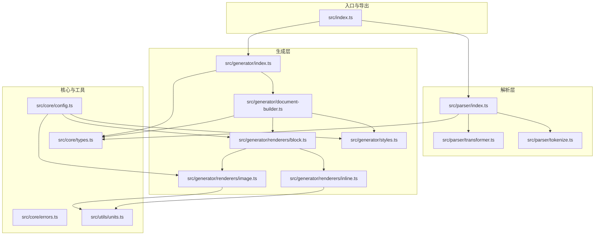
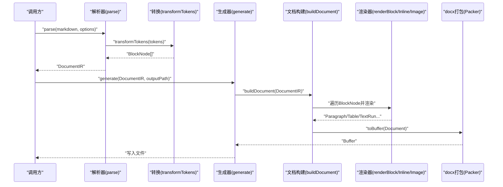
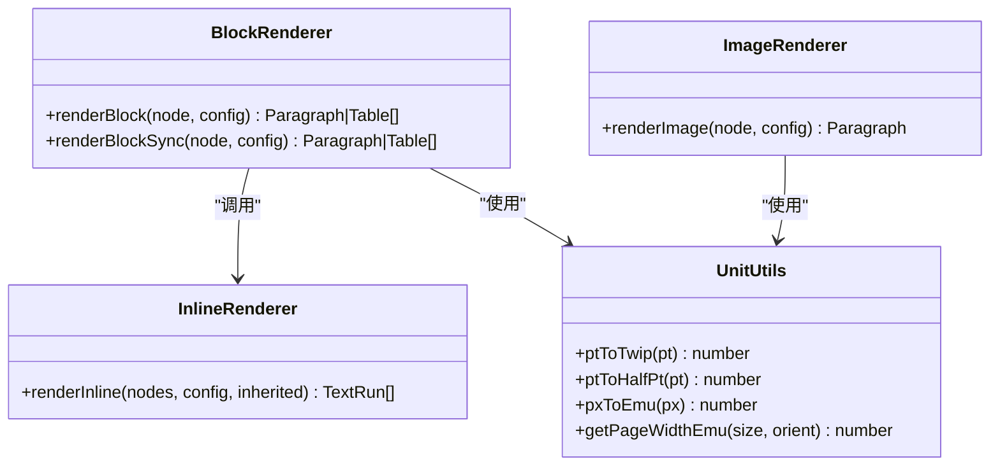
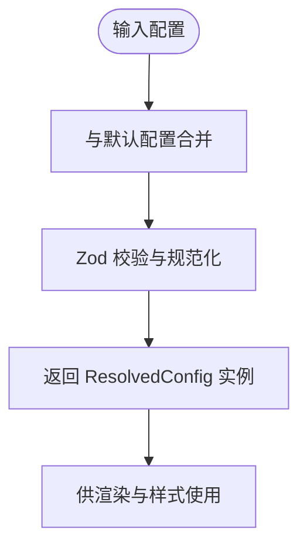
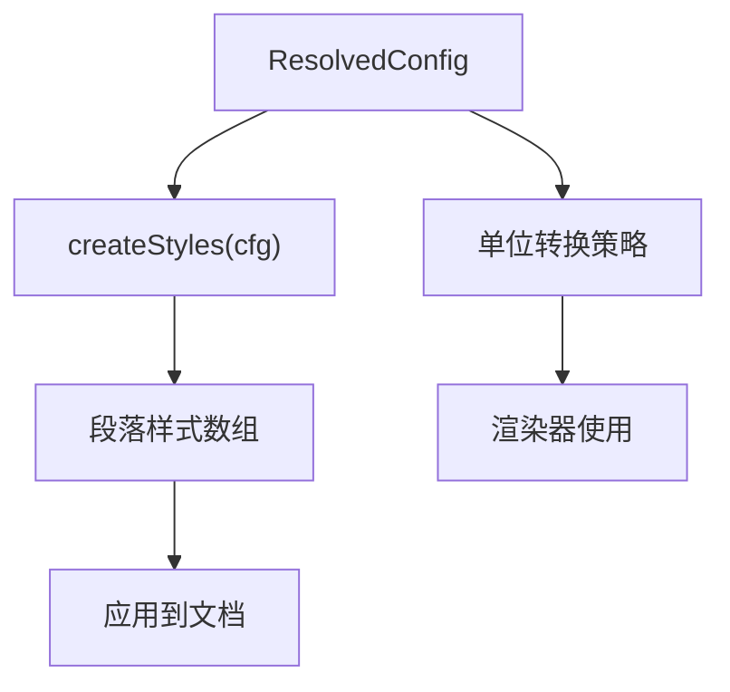
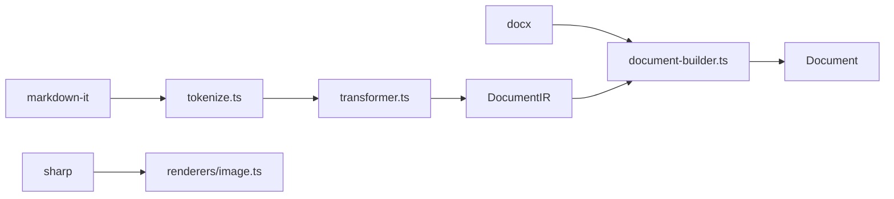
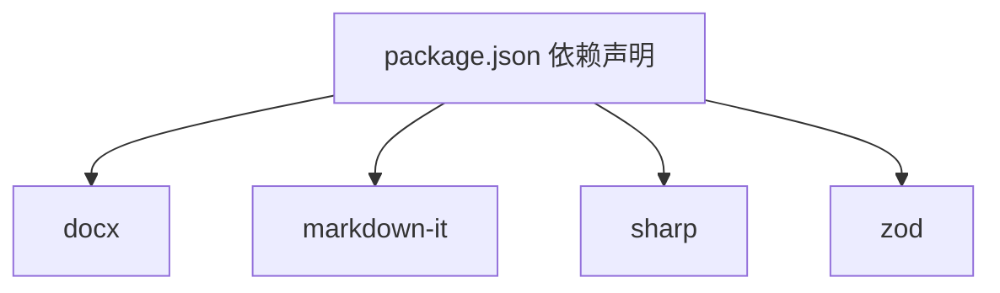

# 设计模式应用

<cite>
**本文引用的文件**
- [src/index.ts](file://src/index.ts)
- [src/parser/index.ts](file://src/parser/index.ts)
- [src/parser/tokenize.ts](file://src/parser/tokenize.ts)
- [src/parser/transformer.ts](file://src/parser/transformer.ts)
- [src/generator/index.ts](file://src/generator/index.ts)
- [src/generator/document-builder.ts](file://src/generator/document-builder.ts)
- [src/generator/styles.ts](file://src/generator/styles.ts)
- [src/generator/renderers/block.ts](file://src/generator/renderers/block.ts)
- [src/generator/renderers/inline.ts](file://src/generator/renderers/inline.ts)
- [src/generator/renderers/image.ts](file://src/generator/renderers/image.ts)
- [src/utils/units.ts](file://src/utils/units.ts)
- [src/core/config.ts](file://src/core/config.ts)
- [src/core/types.ts](file://src/core/types.ts)
- [src/core/errors.ts](file://src/core/errors.ts)
- [package.json](file://package.json)
</cite>

## 目录
1. [引言](#引言)
2. [项目结构](#项目结构)
3. [核心组件](#核心组件)
4. [架构总览](#架构总览)
5. [详细组件分析](#详细组件分析)
6. [依赖分析](#依赖分析)
7. [性能考虑](#性能考虑)
8. [故障排查指南](#故障排查指南)
9. [结论](#结论)
10. [附录](#附录)

## 引言
本文件系统性梳理该 Markdown 到 Word 转换器中所采用的设计模式与架构实践，重点覆盖以下方面：
- 渲染器模式：块级渲染器与内联渲染器的扩展机制
- 工厂模式：配置创建与工具函数的工厂化封装
- 策略模式：样式处理与单位转换的可替换策略
- 适配器模式：第三方库（markdown-it、docx、sharp）的适配集成
- 观察者模式：事件处理在项目中的体现与建议

目标是帮助开发者在保持现有架构稳定的同时，进行模式化的扩展与维护。

## 项目结构
项目采用按职责分层的模块化组织方式：
- 核心层：类型定义、配置与错误类型
- 解析层：词法与语法解析，生成中间表示 IR
- 生成层：构建 docx 文档，包含样式与渲染器
- 工具层：单位转换、图片处理等通用工具
- 入口与导出：统一对外 API

图表来源
- [src/index.ts:1-25](file://src/index.ts#L1-L25)
- [src/parser/index.ts:1-24](file://src/parser/index.ts#L1-L24)
- [src/parser/tokenize.ts:1-16](file://src/parser/tokenize.ts#L1-L16)
- [src/parser/transformer.ts:1-360](file://src/parser/transformer.ts#L1-L360)
- [src/generator/index.ts:1-21](file://src/generator/index.ts#L1-L21)
- [src/generator/document-builder.ts:1-112](file://src/generator/document-builder.ts#L1-L112)
- [src/generator/styles.ts:1-122](file://src/generator/styles.ts#L1-L122)
- [src/generator/renderers/block.ts:1-266](file://src/generator/renderers/block.ts#L1-L266)
- [src/generator/renderers/inline.ts:1-110](file://src/generator/renderers/inline.ts#L1-L110)
- [src/generator/renderers/image.ts:1-61](file://src/generator/renderers/image.ts#L1-L61)
- [src/utils/units.ts:1-45](file://src/utils/units.ts#L1-L45)
- [src/core/types.ts:1-198](file://src/core/types.ts#L1-L198)
- [src/core/config.ts:1-91](file://src/core/config.ts#L1-L91)
- [src/core/errors.ts:1-28](file://src/core/errors.ts#L1-L28)

章节来源
- [src/index.ts:1-25](file://src/index.ts#L1-L25)
- [src/parser/index.ts:1-24](file://src/parser/index.ts#L1-L24)
- [src/generator/index.ts:1-21](file://src/generator/index.ts#L1-L21)
- [src/core/types.ts:1-198](file://src/core/types.ts#L1-L198)

## 核心组件
- 中间表示 IR：由解析层生成，承载文档元数据、配置与块级节点列表
- 渲染器：负责将 IR 节点映射为 docx 对象（段落、表格、文本运行等）
- 样式系统：基于配置动态生成段落样式
- 配置系统：使用 Zod 进行输入校验与默认值合并
- 单位转换工具：提供像素、点数、Twip、EMU 的互转
- 错误体系：针对解析、生成、图像处理、配置校验的专用错误类型

章节来源
- [src/parser/index.ts:11-21](file://src/parser/index.ts#L11-L21)
- [src/generator/document-builder.ts:17-106](file://src/generator/document-builder.ts#L17-L106)
- [src/generator/styles.ts:5-109](file://src/generator/styles.ts#L5-L109)
- [src/core/config.ts:68-91](file://src/core/config.ts#L68-L91)
- [src/utils/units.ts:6-44](file://src/utils/units.ts#L6-L44)
- [src/core/errors.ts:1-28](file://src/core/errors.ts#L1-L28)

## 架构总览
整体流程从解析到生成，遵循“解析 → 构建 → 打包”的线性流水线，并通过渲染器与样式系统将抽象节点映射到具体文档对象。

图表来源
- [src/parser/index.ts:11-21](file://src/parser/index.ts#L11-L21)
- [src/parser/transformer.ts:25-39](file://src/parser/transformer.ts#L25-L39)
- [src/generator/index.ts:7-18](file://src/generator/index.ts#L7-L18)
- [src/generator/document-builder.ts:17-106](file://src/generator/document-builder.ts#L17-L106)
- [src/generator/renderers/block.ts:28-58](file://src/generator/renderers/block.ts#L28-L58)
- [src/generator/renderers/inline.ts:12-109](file://src/generator/renderers/inline.ts#L12-L109)
- [src/generator/renderers/image.ts:6-60](file://src/generator/renderers/image.ts#L6-L60)

## 详细组件分析

### 渲染器模式：块级与内联渲染器的扩展机制
- 块级渲染器：根据节点类型分派到具体渲染函数，支持标题、段落、列表、引用块、代码块、表格、图片、分隔线等；对复杂节点（如列表、引用块）内部递归调用内联渲染器或同步渲染器
- 内联渲染器：以继承样式的方式递归渲染文本、加粗、斜体、下划线、行内代码、链接、换行等
- 图片渲染器：异步读取图片、计算缩放尺寸、适配页面宽度与对齐方式，失败时回退为占位段落

图表来源
- [src/generator/renderers/block.ts:28-266](file://src/generator/renderers/block.ts#L28-L266)
- [src/generator/renderers/inline.ts:12-109](file://src/generator/renderers/inline.ts#L12-L109)
- [src/generator/renderers/image.ts:6-60](file://src/generator/renderers/image.ts#L6-L60)
- [src/utils/units.ts:6-44](file://src/utils/units.ts#L6-L44)

扩展建议
- 新增块级节点：在渲染分发处添加新类型分支，并提供对应渲染函数
- 新增内联节点：在内联渲染器中新增分支，注意继承样式的传递
- 渲染性能：对大量列表/表格节点可引入缓存或批量处理策略

章节来源
- [src/generator/renderers/block.ts:28-122](file://src/generator/renderers/block.ts#L28-L122)
- [src/generator/renderers/block.ts:124-197](file://src/generator/renderers/block.ts#L124-L197)
- [src/generator/renderers/block.ts:199-247](file://src/generator/renderers/block.ts#L199-L247)
- [src/generator/renderers/inline.ts:12-109](file://src/generator/renderers/inline.ts#L12-L109)
- [src/generator/renderers/image.ts:6-60](file://src/generator/renderers/image.ts#L6-L60)

### 工厂模式：配置创建与工具函数
- 配置工厂：通过输入与默认值合并，生成标准化的 ResolvedConfig；提供合并函数用于增量覆盖
- 类型安全：借助 Zod Schema 在编译期与运行期双重约束配置结构
- 工具工厂：单位转换工具作为纯函数集合，便于测试与复用

图表来源
- [src/core/config.ts:68-91](file://src/core/config.ts#L68-L91)
- [src/core/config.ts:83-88](file://src/core/config.ts#L83-L88)

章节来源
- [src/core/config.ts:68-91](file://src/core/config.ts#L68-L91)
- [src/core/config.ts:83-88](file://src/core/config.ts#L83-L88)

### 策略模式：样式处理与单位转换
- 样式策略：根据配置动态生成段落样式（标题、正文、代码块、引用），通过“基于默认样式”和“快速格式”实现可插拔的样式策略
- 单位转换策略：提供多种单位换算策略（pt↔half-pt、pt↔twip、px↔EMU），并在渲染器中集中使用，便于切换或扩展

图表来源
- [src/generator/styles.ts:5-109](file://src/generator/styles.ts#L5-L109)
- [src/utils/units.ts:6-44](file://src/utils/units.ts#L6-L44)
- [src/generator/renderers/block.ts:26](file://src/generator/renderers/block.ts#L26)
- [src/generator/renderers/inline.ts:3](file://src/generator/renderers/inline.ts#L3)

章节来源
- [src/generator/styles.ts:5-109](file://src/generator/styles.ts#L5-L109)
- [src/utils/units.ts:6-44](file://src/utils/units.ts#L6-L44)

### 适配器模式：第三方库集成
- markdown-it 适配器：统一封装解析器创建与启用特性（表格、HTML、链接识别、排版），对外暴露 tokenize 接口
- docx 适配器：统一封装段落、表格、文本运行、页眉页脚、打包等操作，屏蔽底层细节
- sharp 适配器：统一封装图片读取与尺寸计算，异常时提供回退策略

图表来源
- [src/parser/tokenize.ts:4-15](file://src/parser/tokenize.ts#L4-L15)
- [src/generator/document-builder.ts:17-106](file://src/generator/document-builder.ts#L17-L106)
- [src/generator/renderers/image.ts:6-60](file://src/generator/renderers/image.ts#L6-L60)
- [package.json:27-36](file://package.json#L27-L36)

章节来源
- [src/parser/tokenize.ts:4-15](file://src/parser/tokenize.ts#L4-L15)
- [src/generator/document-builder.ts:17-106](file://src/generator/document-builder.ts#L17-L106)
- [src/generator/renderers/image.ts:6-60](file://src/generator/renderers/image.ts#L6-L60)
- [package.json:27-36](file://package.json#L27-L36)

### 观察者模式：事件处理的体现与建议
- 现状：项目未显式实现事件发布/订阅机制
- 建议：可在解析阶段引入“节点转换完成”事件，在生成阶段引入“渲染进度”事件，便于扩展日志、统计与可视化

[本节为概念性建议，不直接分析具体文件，故无章节来源]

## 依赖分析
- 外部依赖：docx、markdown-it、sharp、zod 等
- 内部耦合：解析层与生成层通过 IR 解耦；渲染器与样式系统通过配置解耦；工具层为纯函数，低耦合高内聚

图表来源
- [package.json:27-36](file://package.json#L27-L36)

章节来源
- [package.json:27-36](file://package.json#L27-L36)

## 性能考虑
- 渲染性能：列表与表格节点较多时，优先使用同步渲染器减少异步开销；对重复样式进行缓存
- I/O 性能：图片读取与转换应尽量并发但受控；避免在热路径上进行大文件 IO
- 内存占用：批量生成时及时释放中间对象；控制段落与表格的嵌套深度
- 单位换算：在渲染前预计算常用值，减少重复计算

[本节提供一般性指导，不直接分析具体文件，故无章节来源]

## 故障排查指南
- 解析错误：检查 Markdown 输入是否符合 commonmark 规范，确认表格与 HTML 片段正确闭合
- 生成错误：确认输出路径可写，捕获并记录打包过程中的异常
- 图像错误：检查图片源地址、格式与大小；确保 sharp 可用且权限正确
- 配置错误：使用配置工厂与合并函数，避免直接修改默认配置

章节来源
- [src/parser/index.ts:11-21](file://src/parser/index.ts#L11-L21)
- [src/generator/index.ts:7-18](file://src/generator/index.ts#L7-L18)
- [src/generator/renderers/image.ts:47-60](file://src/generator/renderers/image.ts#L47-L60)
- [src/core/config.ts:68-91](file://src/core/config.ts#L68-L91)
- [src/core/errors.ts:1-28](file://src/core/errors.ts#L1-L28)

## 结论
该项目在架构层面清晰地体现了“解析 → 构建 → 打包”的流水线思想，并通过渲染器模式、工厂模式、策略模式与适配器模式实现了高内聚、低耦合与良好的可扩展性。建议在后续迭代中引入事件机制以增强可观测性与扩展能力，并持续优化渲染与 I/O 性能。

[本节为总结性内容，不直接分析具体文件，故无章节来源]

## 附录
- 模式最佳实践清单
  - 渲染器：新增节点类型时，先完善类型定义，再补充渲染分支，最后补充样式策略
  - 工厂：始终通过工厂函数创建与合并配置，保证类型安全与默认值一致性
  - 策略：将可变因素（样式、单位、图片处理）抽象为策略，便于替换与测试
  - 适配器：对外暴露统一接口，内部封装第三方差异，便于升级与迁移
  - 观察者：在关键阶段引入事件钩子，避免侵入式修改现有逻辑

[本节为概念性内容，不直接分析具体文件，故无章节来源]