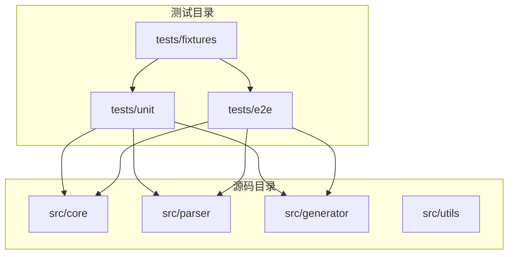
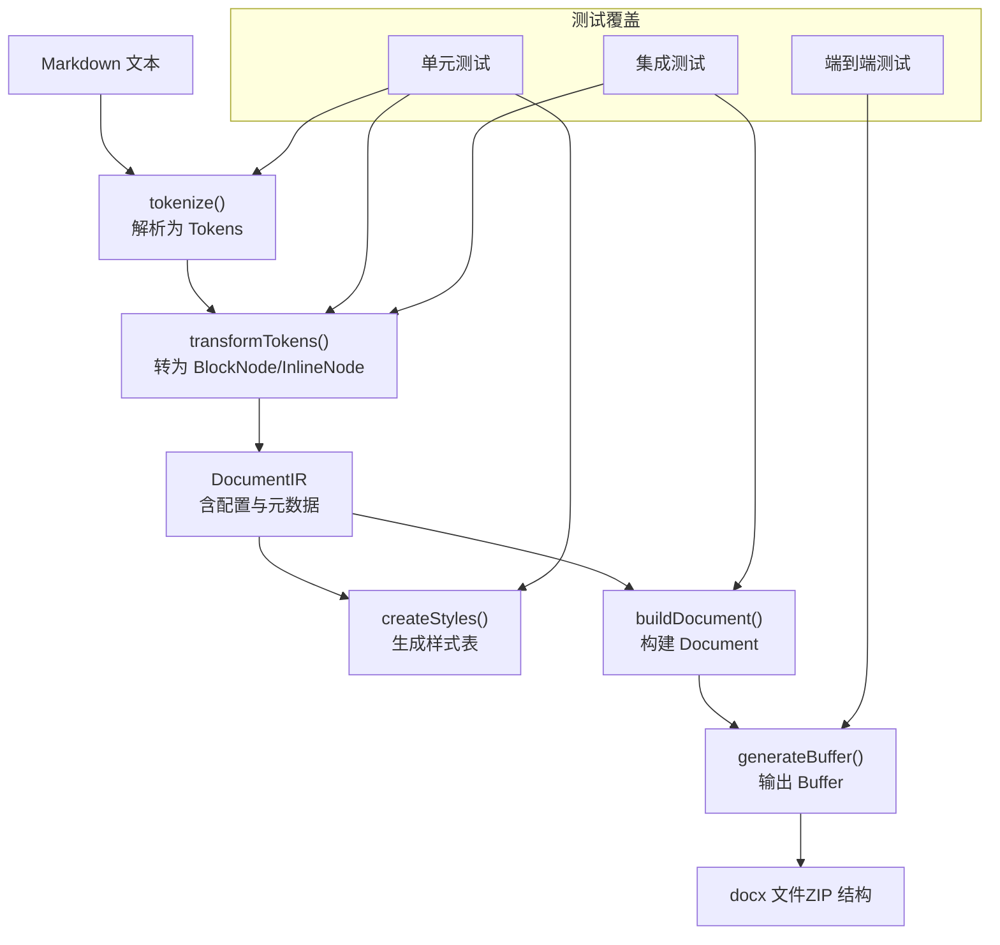
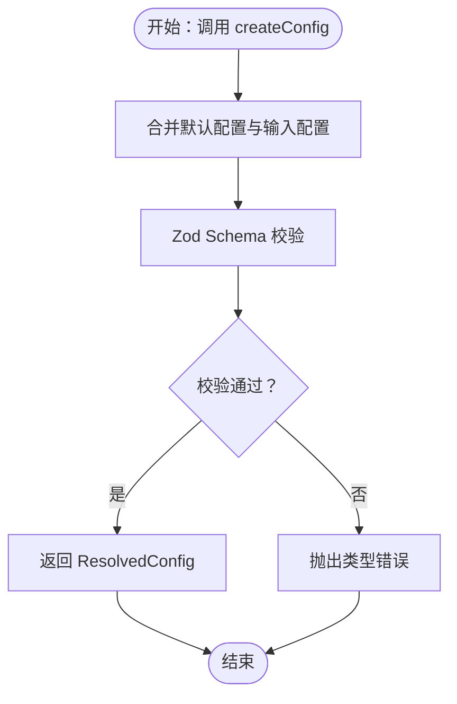
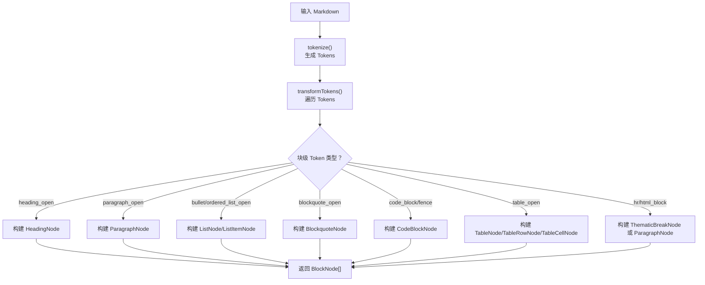
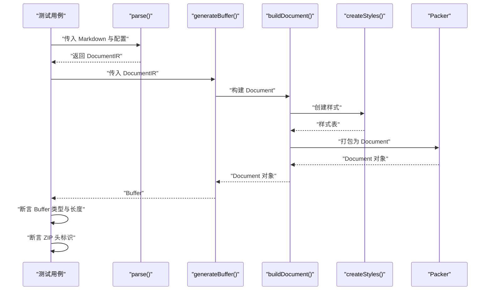
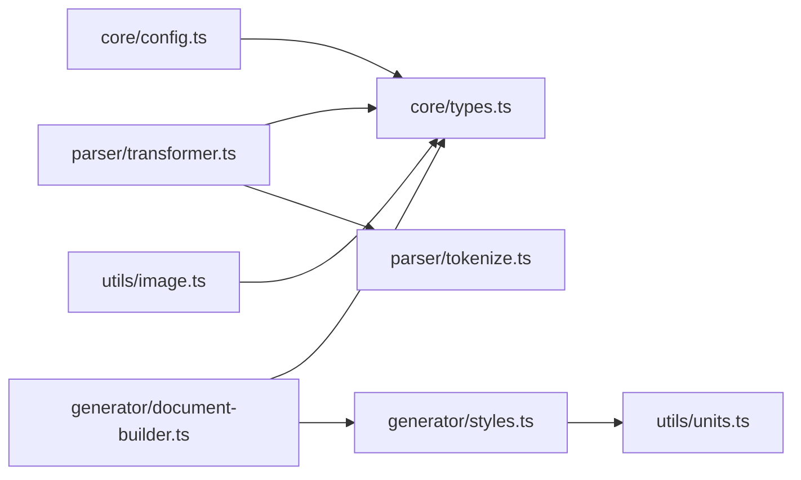

# 测试指南

<cite>
**本文档引用的文件**
- [vitest.config.ts](file://vitest.config.ts)
- [package.json](file://package.json)
- [tests/unit/core/config.test.ts](file://tests/unit/core/config.test.ts)
- [tests/e2e/full-pipeline.test.ts](file://tests/e2e/full-pipeline.test.ts)
- [tests/unit/parser/transformer.test.ts](file://tests/unit/parser/transformer.test.ts)
- [tests/fixtures/markdown/sample.md](file://tests/fixtures/markdown/sample.md)
- [src/core/config.ts](file://src/core/config.ts)
- [src/parser/tokenize.ts](file://src/parser/tokenize.ts)
- [src/parser/transformer.ts](file://src/parser/transformer.ts)
- [src/generator/document-builder.ts](file://src/generator/document-builder.ts)
- [src/generator/styles.ts](file://src/generator/styles.ts)
- [src/utils/units.ts](file://src/utils/units.ts)
- [src/utils/image.ts](file://src/utils/image.ts)
- [src/core/types.ts](file://src/core/types.ts)
</cite>

## 目录
1. [简介](#简介)
2. [项目结构](#项目结构)
3. [核心组件](#核心组件)
4. [架构总览](#架构总览)
5. [详细组件分析](#详细组件分析)
6. [依赖分析](#依赖分析)
7. [性能考虑](#性能考虑)
8. [故障排查指南](#故障排查指南)
9. [结论](#结论)
10. [附录](#附录)

## 简介
本测试指南面向开发者与测试工程师，系统性阐述 Markdown 到 Word 转换器的测试策略与实施细节。项目采用 Vitest 作为测试框架，覆盖单元测试、集成测试与端到端测试三层体系。测试组织遵循按功能域分层：核心配置、解析器、生成器与工具模块。测试夹具通过 fixtures 管理测试数据，确保可重复性与一致性。本文提供测试编写规范、覆盖率目标、运行命令、持续集成建议与报告生成路径，帮助团队高效开展测试开发与维护。

## 项目结构
测试相关目录与文件分布如下：
- 单元测试：tests/unit 下按模块划分，如 core、parser、generator
- 集成测试：tests/e2e 下进行跨模块组合验证
- 测试夹具：tests/fixtures 下存放配置与 Markdown 样例
- 测试框架配置：vitest.config.ts
- 构建与脚本：package.json 中定义测试命令与构建流程

图表来源
- [vitest.config.ts:1-9](file://vitest.config.ts#L1-L9)
- [package.json:11-17](file://package.json#L11-L17)

章节来源
- [vitest.config.ts:1-9](file://vitest.config.ts#L1-L9)
- [package.json:11-17](file://package.json#L11-L17)

## 核心组件
本节聚焦测试中涉及的核心模块及其职责：
- 配置模块：负责默认配置、合并配置与参数校验
- 解析模块：将 Markdown 文本转换为内部 IR（文档中间表示）
- 生成模块：基于 IR 与样式生成 docx 缓冲区
- 工具模块：单位换算、图片处理等辅助能力

章节来源
- [src/core/config.ts:68-91](file://src/core/config.ts#L68-L91)
- [src/parser/tokenize.ts:12-16](file://src/parser/tokenize.ts#L12-L16)
- [src/parser/transformer.ts:25-39](file://src/parser/transformer.ts#L25-L39)
- [src/generator/document-builder.ts:17-112](file://src/generator/document-builder.ts#L17-L112)
- [src/generator/styles.ts:5-122](file://src/generator/styles.ts#L5-L122)
- [src/utils/units.ts:1-45](file://src/utils/units.ts#L1-L45)
- [src/utils/image.ts:12-42](file://src/utils/image.ts#L12-L42)
- [src/core/types.ts:1-198](file://src/core/types.ts#L1-L198)

## 架构总览
测试架构围绕“输入（Markdown/配置）→ 解析 → 生成 → 输出（docx Buffer）”的流水线展开，单元测试覆盖各模块内部逻辑，集成测试验证模块间协作，端到端测试从真实 Markdown 输入到最终 Buffer 的完整链路。

图表来源
- [src/parser/tokenize.ts:12-16](file://src/parser/tokenize.ts#L12-L16)
- [src/parser/transformer.ts:25-39](file://src/parser/transformer.ts#L25-L39)
- [src/generator/styles.ts:5-122](file://src/generator/styles.ts#L5-L122)
- [src/generator/document-builder.ts:17-112](file://src/generator/document-builder.ts#L17-L112)
- [tests/e2e/full-pipeline.test.ts:8-52](file://tests/e2e/full-pipeline.test.ts#L8-L52)

## 详细组件分析

### 配置模块测试（单元）
- 测试目标
  - 默认配置值是否符合预期
  - 自定义配置合并行为
  - 参数校验失败场景
- 关键断言
  - 字段默认值与合并覆盖
  - 非法枚举值抛错
- 测试夹具
  - 使用默认导出函数创建配置对象
- 复杂度与性能
  - 配置创建与合并为 O(n)（n 为配置字段数），测试成本低

图表来源
- [src/core/config.ts:68-91](file://src/core/config.ts#L68-L91)
- [tests/unit/core/config.test.ts:4-31](file://tests/unit/core/config.test.ts#L4-L31)

章节来源
- [tests/unit/core/config.test.ts:1-32](file://tests/unit/core/config.test.ts#L1-L32)
- [src/core/config.ts:68-91](file://src/core/config.ts#L68-L91)

### 解析器测试（单元）
- 测试目标
  - 将 Markdown 转换为 BlockNode/InlineNode 树
  - 支持标题、段落、粗体/斜体、无序/有序列表、代码块、引用块、表格等
- 关键断言
  - 节点类型与层级正确
  - 子节点数量与内容匹配
- 测试夹具
  - 使用 tokenize 生成 Tokens，再由 transformTokens 转换
- 边界与异常
  - HTML 块中的图片提取与回退处理
  - 不识别的块类型跳过

图表来源
- [src/parser/tokenize.ts:12-16](file://src/parser/tokenize.ts#L12-L16)
- [src/parser/transformer.ts:25-39](file://src/parser/transformer.ts#L25-L39)
- [src/parser/transformer.ts:41-122](file://src/parser/transformer.ts#L41-L122)
- [src/parser/transformer.ts:124-180](file://src/parser/transformer.ts#L124-L180)
- [src/parser/transformer.ts:182-236](file://src/parser/transformer.ts#L182-L236)
- [src/parser/transformer.ts:238-360](file://src/parser/transformer.ts#L238-L360)

章节来源
- [tests/unit/parser/transformer.test.ts:1-90](file://tests/unit/parser/transformer.test.ts#L1-L90)
- [src/parser/tokenize.ts:12-16](file://src/parser/tokenize.ts#L12-L16)
- [src/parser/transformer.ts:25-39](file://src/parser/transformer.ts#L25-L39)

### 生成器测试（集成/端到端）
- 测试目标
  - 从 IR 生成 Document 并打包为 Buffer
  - 校验 Buffer 的类型与基本结构（ZIP 标识）
- 关键断言
  - Buffer 实例与长度阈值
  - docx 文件头标识（ZIP Magic Number）
- 测试夹具
  - 使用真实 Markdown 样例文件
  - 通过 createConfig 生成配置

图表来源
- [tests/e2e/full-pipeline.test.ts:8-52](file://tests/e2e/full-pipeline.test.ts#L8-L52)
- [src/generator/document-builder.ts:17-112](file://src/generator/document-builder.ts#L17-L112)
- [src/generator/styles.ts:5-122](file://src/generator/styles.ts#L5-L122)

章节来源
- [tests/e2e/full-pipeline.test.ts:1-52](file://tests/e2e/full-pipeline.test.ts#L1-L52)
- [src/generator/document-builder.ts:17-112](file://src/generator/document-builder.ts#L17-L112)

### 工具模块测试（单元）
- 单位换算
  - 测试像素到 EMU、点到半点、点到 Twips 的换算
  - 测试页面宽高在不同纸张与方向下的计算
- 图片处理
  - 测试本地与远程图片读取、尺寸缩放
  - 错误路径：网络失败、处理失败时抛出特定错误

章节来源
- [src/utils/units.ts:1-45](file://src/utils/units.ts#L1-L45)
- [src/utils/image.ts:12-42](file://src/utils/image.ts#L12-L42)

## 依赖分析
- 模块耦合
  - 解析器依赖 MarkdownIt；生成器依赖 docx；工具模块被多处复用
- 外部依赖
  - Vitest（测试）、Zod（配置校验）、docx（生成）、markdown-it（解析）、sharp（图片）
- 可能的循环依赖
  - 当前结构清晰，未见直接循环导入

图表来源
- [src/core/config.ts:1-91](file://src/core/config.ts#L1-L91)
- [src/parser/transformer.ts:1-360](file://src/parser/transformer.ts#L1-L360)
- [src/parser/tokenize.ts:1-16](file://src/parser/tokenize.ts#L1-L16)
- [src/generator/document-builder.ts:1-112](file://src/generator/document-builder.ts#L1-L112)
- [src/generator/styles.ts:1-122](file://src/generator/styles.ts#L1-L122)
- [src/utils/units.ts:1-45](file://src/utils/units.ts#L1-L45)
- [src/utils/image.ts:1-58](file://src/utils/image.ts#L1-L58)
- [src/core/types.ts:1-198](file://src/core/types.ts#L1-L198)

## 性能考虑
- 测试执行效率
  - 单元测试应避免外部 I/O；对图片与文档生成类测试使用最小化输入与断言
- 内存占用
  - 端到端测试生成 Buffer 体积较大，建议控制样本大小与数量
- 并行与隔离
  - Vitest 支持并发，但需确保测试之间无共享状态或正确清理

## 故障排查指南
- 配置校验失败
  - 现象：创建配置时报类型错误
  - 排查：检查枚举值与数值范围，参考配置 Schema 定义
- 解析结果异常
  - 现象：某些 Markdown 片段未被识别为期望节点
  - 排查：确认 MarkdownIt 启用的特性与 Token 结构
- 生成 Buffer 非法
  - 现象：Buffer 长度过小或非 ZIP 头
  - 排查：确认 IR 构建与样式创建是否成功，检查段落数量与样式应用
- 图片处理错误
  - 现象：网络图片下载失败或 sharp 处理异常
  - 排查：检查 URL 可达性与响应状态，捕获 ImageProcessingError

章节来源
- [src/core/config.ts:54-64](file://src/core/config.ts#L54-L64)
- [src/parser/tokenize.ts:4-10](file://src/parser/tokenize.ts#L4-L10)
- [tests/e2e/full-pipeline.test.ts:29-34](file://tests/e2e/full-pipeline.test.ts#L29-L34)
- [src/utils/image.ts:38-42](file://src/utils/image.ts#L38-L42)

## 结论
本项目以 Vitest 为核心，建立了从单元到端到端的完整测试体系。通过明确的模块边界与测试夹具管理，测试具备高可维护性与可扩展性。建议持续完善覆盖率与回归用例，结合 CI 自动化保障质量。

## 附录

### 测试策略与组织
- 单元测试
  - 覆盖核心算法与边界条件，优先断言输入输出关系
- 集成测试
  - 聚焦模块协作与数据流，如解析到生成的链路
- 端到端测试
  - 覆盖真实 Markdown 输入与 Buffer 输出，验证整体可用性

### 测试框架选择与配置
- 框架：Vitest
- 配置要点：全局环境、Node 环境、测试文件命名与路径
- 运行命令
  - 运行测试：参见脚本定义
  - 监听模式：参见脚本定义

章节来源
- [vitest.config.ts:3-8](file://vitest.config.ts#L3-L8)
- [package.json:14-15](file://package.json#L14-L15)

### 测试用例编写指南
- 断言风格
  - 使用明确的 expect 语句，针对具体字段与结构
- 数据驱动
  - 使用 fixtures 提供多样化输入，减少重复
- 异常路径
  - 显式断言错误抛出与错误信息
- 可读性
  - 使用 describe/it 组织层级，注释说明输入与期望

### 测试覆盖率要求
- 建议目标
  - 语句覆盖率：≥80%
  - 分支覆盖率：≥70%
  - 函数覆盖率：≥85%
  - 行覆盖率：≥80%
- 工具
  - Vitest 内置覆盖率支持，可在配置中启用

### 测试夹具与数据管理
- 位置
  - tests/fixtures 下存放配置与 Markdown 示例
- 使用
  - 在测试中通过相对路径读取，保证跨平台兼容
- 维护
  - 保持样例简洁、可读性强，避免冗余数据

章节来源
- [tests/fixtures/markdown/sample.md:1-51](file://tests/fixtures/markdown/sample.md#L1-L51)

### 测试运行命令与持续集成
- 运行命令
  - 运行测试：参见脚本定义
  - 监听模式：参见脚本定义
- 持续集成
  - 建议在 CI 中执行测试与覆盖率统计，失败即中断
- 报告生成
  - 可通过 Vitest 的报告选项生成 JUnit 或 HTML 报告，便于集成到 CI 平台

章节来源
- [package.json:14-15](file://package.json#L14-L15)