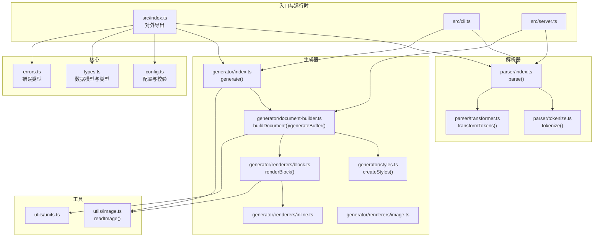
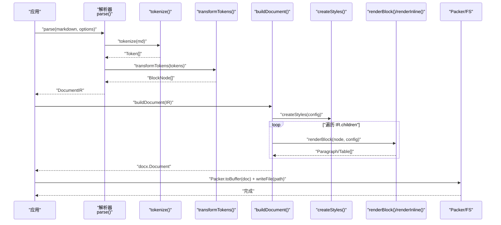
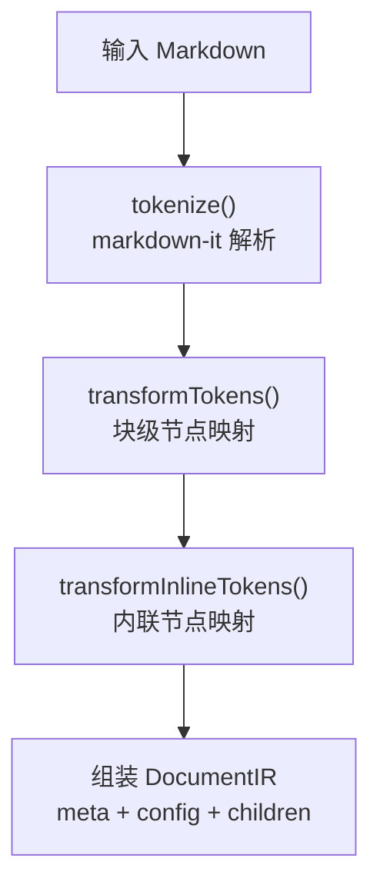
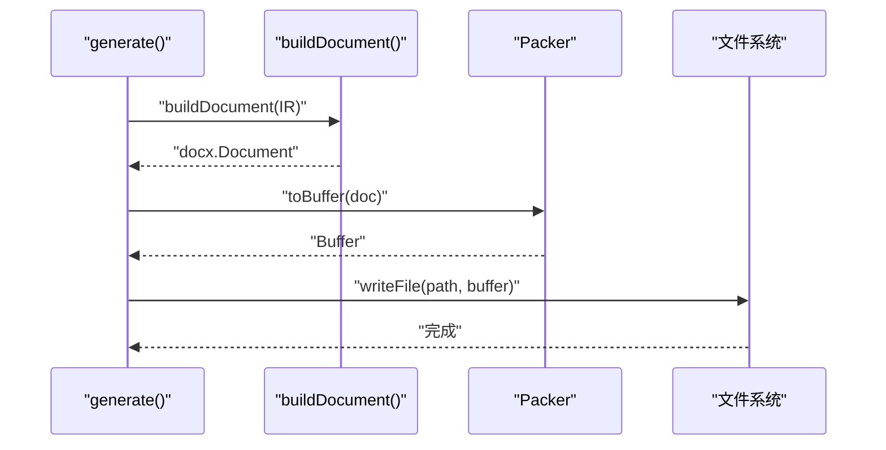
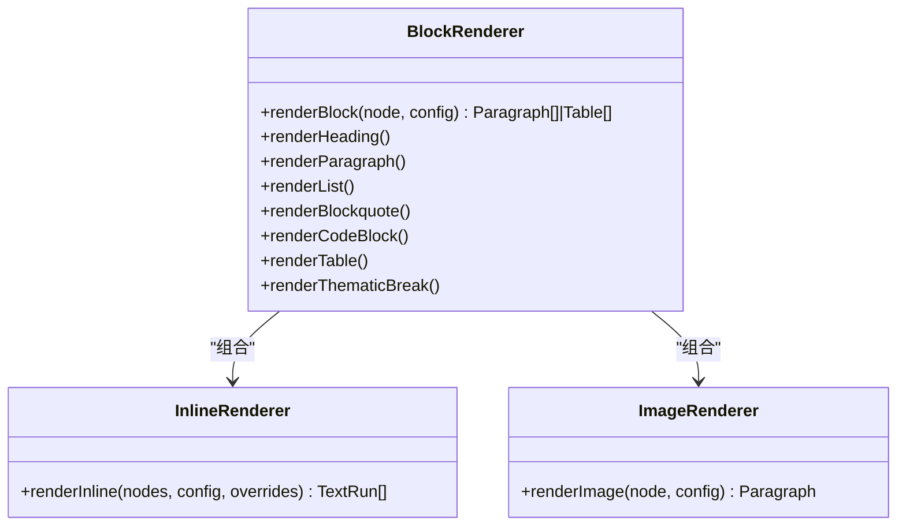
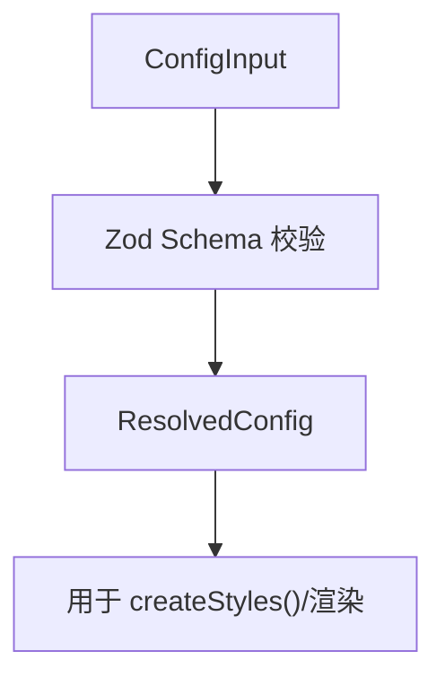
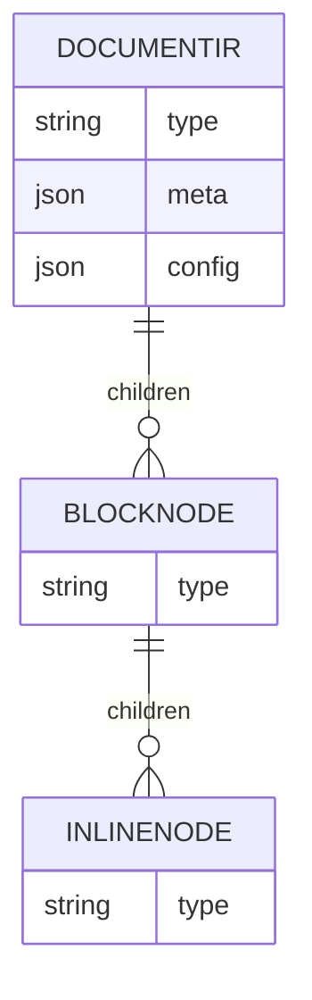
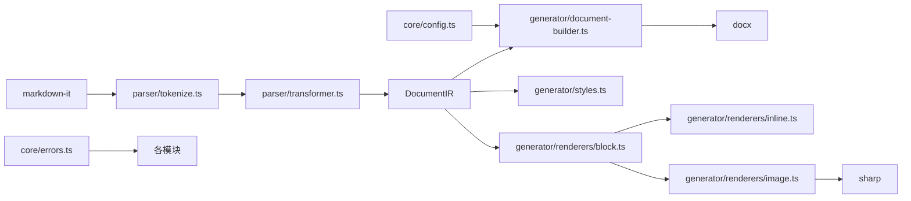
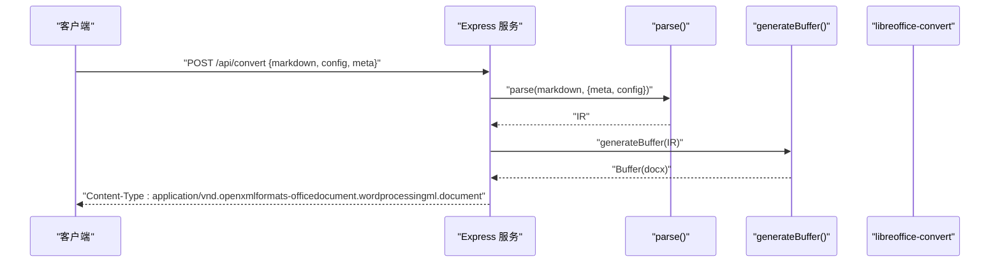

# JavaScript 库使用

<cite>
**本文引用的文件**
- [src/index.ts](file://src/index.ts)
- [src/parser/index.ts](file://src/parser/index.ts)
- [src/parser/tokenize.ts](file://src/parser/tokenize.ts)
- [src/parser/transformer.ts](file://src/parser/transformer.ts)
- [src/generator/index.ts](file://src/generator/index.ts)
- [src/generator/document-builder.ts](file://src/generator/document-builder.ts)
- [src/generator/styles.ts](file://src/generator/styles.ts)
- [src/generator/renderers/block.ts](file://src/generator/renderers/block.ts)
- [src/generator/renderers/inline.ts](file://src/generator/renderers/inline.ts)
- [src/generator/renderers/image.ts](file://src/generator/renderers/image.ts)
- [src/utils/image.ts](file://src/utils/image.ts)
- [src/utils/units.ts](file://src/utils/units.ts)
- [src/core/config.ts](file://src/core/config.ts)
- [src/core/types.ts](file://src/core/types.ts)
- [src/core/errors.ts](file://src/core/errors.ts)
- [src/cli.ts](file://src/cli.ts)
- [src/server.ts](file://src/server.ts)
- [package.json](file://package.json)
</cite>

## 目录
1. [简介](#简介)
2. [项目结构](#项目结构)
3. [核心组件](#核心组件)
4. [架构总览](#架构总览)
5. [详细组件分析](#详细组件分析)
6. [依赖关系分析](#依赖关系分析)
7. [性能与内存优化](#性能与内存优化)
8. [错误处理与调试](#错误处理与调试)
9. [集成指南](#集成指南)
10. [结论](#结论)
11. [附录](#附录)

## 简介
本库提供从 Markdown 到 Word（.docx）的转换能力，支持自定义样式、页眉页脚、图片处理、表格与列表等丰富内容类型。核心 API 包括：
- 解析阶段：parse(markdown, options?) → 返回文档中间表示 IR（DocumentIR）
- 生成阶段：generate(IR, outputPath) → 将 IR 写入本地 .docx 文件
- 文档构建：buildDocument(IR) → 构建 docx.Document 对象
- 配置系统：createConfig()/mergeConfig()/defaultConfig 提供强类型配置校验与默认值
- 错误体系：MarkdownParseError、DocxGenerationError、ImageProcessingError、ConfigValidationError

本指南面向需要在 Node.js 应用中集成该库的开发者，覆盖服务器端转换、浏览器端使用（通过后端服务）、CLI 使用、与其他库的集成、异步与并发处理、性能优化、缓存策略与常见问题排查。

## 项目结构
项目采用按职责分层的模块化组织：
- 核心类型与配置：core/types.ts、core/config.ts、core/errors.ts
- 解析器：parser/index.ts、parser/tokenize.ts、parser/transformer.ts
- 生成器：generator/index.ts、generator/document-builder.ts、generator/styles.ts、generator/renderers/*
- 工具：utils/image.ts、utils/units.ts
- 入口与对外导出：src/index.ts
- 命令行与服务端：src/cli.ts、src/server.ts
- 依赖声明：package.json

图表来源
- [src/index.ts:1-25](file://src/index.ts#L1-L25)
- [src/parser/index.ts:1-24](file://src/parser/index.ts#L1-L24)
- [src/parser/tokenize.ts:1-16](file://src/parser/tokenize.ts#L1-L16)
- [src/parser/transformer.ts:1-360](file://src/parser/transformer.ts#L1-L360)
- [src/generator/index.ts:1-21](file://src/generator/index.ts#L1-L21)
- [src/generator/document-builder.ts:1-112](file://src/generator/document-builder.ts#L1-L112)
- [src/generator/styles.ts:1-122](file://src/generator/styles.ts#L1-L122)
- [src/generator/renderers/block.ts:1-266](file://src/generator/renderers/block.ts#L1-L266)
- [src/generator/renderers/inline.ts](file://src/generator/renderers/inline.ts)
- [src/generator/renderers/image.ts](file://src/generator/renderers/image.ts)
- [src/utils/image.ts:1-58](file://src/utils/image.ts#L1-L58)
- [src/utils/units.ts](file://src/utils/units.ts)
- [src/cli.ts:1-113](file://src/cli.ts#L1-L113)
- [src/server.ts:1-94](file://src/server.ts#L1-L94)

章节来源
- [src/index.ts:1-25](file://src/index.ts#L1-L25)
- [package.json:1-47](file://package.json#L1-L47)

## 核心组件
- parse(markdown, options?)
  - 输入：Markdown 字符串，可选元信息 DocumentMeta 与 ResolvedConfig
  - 输出：DocumentIR（type='document'，包含 meta、config、children）
  - 关键流程：tokenize() → transformTokens() → 组装 IR
- generate(IR, outputPath)
  - 输入：DocumentIR、输出路径
  - 行为：buildDocument(IR) → Packer.toBuffer() → 写入文件
- buildDocument(IR)
  - 输入：DocumentIR
  - 行为：创建样式、渲染块级节点、构建页眉页脚、返回 docx.Document
- createConfig()/mergeConfig()/defaultConfig
  - 输入：ConfigInput（JSON/对象）
  - 行为：Zod 校验与默认值合并，输出 ResolvedConfig
- 错误类型
  - MarkdownParseError、DocxGenerationError、ImageProcessingError、ConfigValidationError

章节来源
- [src/parser/index.ts:11-21](file://src/parser/index.ts#L11-L21)
- [src/generator/index.ts:7-18](file://src/generator/index.ts#L7-L18)
- [src/generator/document-builder.ts:17-106](file://src/generator/document-builder.ts#L17-L106)
- [src/core/config.ts:68-91](file://src/core/config.ts#L68-L91)
- [src/core/errors.ts:1-28](file://src/core/errors.ts#L1-L28)

## 架构总览
下图展示了从输入 Markdown 到输出 .docx 的完整调用链路与模块交互。

图表来源
- [src/parser/index.ts:11-21](file://src/parser/index.ts#L11-L21)
- [src/parser/tokenize.ts:12-15](file://src/parser/tokenize.ts#L12-L15)
- [src/parser/transformer.ts:25-38](file://src/parser/transformer.ts#L25-L38)
- [src/generator/document-builder.ts:17-106](file://src/generator/document-builder.ts#L17-L106)
- [src/generator/styles.ts:5-109](file://src/generator/styles.ts#L5-L109)
- [src/generator/renderers/block.ts:28-58](file://src/generator/renderers/block.ts#L28-L58)
- [src/generator/index.ts:7-18](file://src/generator/index.ts#L7-L18)

## 详细组件分析

### 解析器（Parser）
- tokenize(md)
  - 使用 markdown-it 创建解析器，启用 commonmark 规范与 table 扩展
  - 返回 Token 数组
- transformTokens(tokens)
  - 将 Token 流转换为 BlockNode[]，支持标题、段落、列表、引用、代码块、表格、水平线、HTML 块（含图片提取）
  - inline 节点由 transformInlineTokens 收集，支持加粗、斜体、下划线、行内代码、链接、换行、HTML 片段
- parse(markdown, options?)
  - 组合 tokenize + transformTokens，产出 DocumentIR，默认使用 defaultConfig

图表来源
- [src/parser/tokenize.ts:12-15](file://src/parser/tokenize.ts#L12-L15)
- [src/parser/transformer.ts:25-332](file://src/parser/transformer.ts#L25-L332)
- [src/parser/index.ts:11-21](file://src/parser/index.ts#L11-L21)

章节来源
- [src/parser/tokenize.ts:1-16](file://src/parser/tokenize.ts#L1-L16)
- [src/parser/transformer.ts:1-360](file://src/parser/transformer.ts#L1-L360)
- [src/parser/index.ts:1-24](file://src/parser/index.ts#L1-L24)

### 生成器（Generator）
- generate(IR, outputPath)
  - 异步：构建文档 → 二进制缓冲 → 写文件；失败抛出 DocxGenerationError
- buildDocument(IR)
  - 创建样式表（createStyles），渲染所有块级节点，构建页眉页脚（可选页码）
  - 设置页面尺寸、方向、页边距
  - 返回 docx.Document
- generateBuffer(IR)
  - 直接返回 Buffer，便于服务端下载或进一步转换（如 PDF）

图表来源
- [src/generator/index.ts:7-18](file://src/generator/index.ts#L7-L18)
- [src/generator/document-builder.ts:17-112](file://src/generator/document-builder.ts#L17-L112)

章节来源
- [src/generator/index.ts:1-21](file://src/generator/index.ts#L1-L21)
- [src/generator/document-builder.ts:1-112](file://src/generator/document-builder.ts#L1-L112)

### 渲染器（Renderers）
- block.ts
  - 根据 BlockNode 类型渲染为 Paragraph/Table，支持标题层级、段间距、缩进、边框、阴影等
  - 处理列表、引用、代码块、表格、水平线、图片
- inline.ts
  - 将 InlineNode 渲染为 TextRun，支持字体、字号、颜色、加粗、斜体、下划线、行内代码、链接
- image.ts
  - 读取图片（HTTP/本地），计算缩放尺寸，插入到文档

图表来源
- [src/generator/renderers/block.ts:28-266](file://src/generator/renderers/block.ts#L28-L266)
- [src/generator/renderers/inline.ts](file://src/generator/renderers/inline.ts)
- [src/generator/renderers/image.ts](file://src/generator/renderers/image.ts)

章节来源
- [src/generator/renderers/block.ts:1-266](file://src/generator/renderers/block.ts#L1-L266)
- [src/generator/renderers/inline.ts](file://src/generator/renderers/inline.ts)
- [src/generator/renderers/image.ts](file://src/generator/renderers/image.ts)

### 配置系统（Config）
- ConfigInput 通过 Zod schema 校验，支持字体、字号、行距、页边距、图片、页眉页脚、颜色、纸张与方向
- createConfig()/mergeConfig() 提供默认值与覆盖合并
- defaultConfig 暴露全局默认配置

图表来源
- [src/core/config.ts:54-91](file://src/core/config.ts#L54-L91)

章节来源
- [src/core/config.ts:1-91](file://src/core/config.ts#L1-L91)
- [src/core/types.ts:136-198](file://src/core/types.ts#L136-L198)

### 数据模型（Types）
- DocumentIR、DocumentMeta、BlockNode、InlineNode、ResolvedConfig、Font/Size/Spacing/Margin/Image/HeaderFooter/Color 等
- 支持标题、段落、列表、引用、代码块、表格、图片、水平线等

图表来源
- [src/core/types.ts:7-135](file://src/core/types.ts#L7-L135)

章节来源
- [src/core/types.ts:1-198](file://src/core/types.ts#L1-L198)

### 错误体系（Errors）
- MarkdownParseError：解析阶段异常
- DocxGenerationError：生成阶段异常
- ImageProcessingError：图片处理异常（网络/文件/解码）
- ConfigValidationError：配置校验异常

章节来源
- [src/core/errors.ts:1-28](file://src/core/errors.ts#L1-L28)

## 依赖关系分析
- 外部依赖
  - docx：生成 .docx 文档
  - markdown-it：解析 Markdown
  - sharp：图片读取与元数据获取
  - zod：配置校验
  - express/cors：服务端接口
  - libreoffice-convert：PDF 预览（可选）
- 内部模块耦合
  - parser 仅依赖 markdown-it，输出 Token 流
  - transformer 将 Token 映射为 AST 节点
  - generator 依赖 docx、renderer、styles、utils
  - utils.image 依赖 sharp，负责图片读取与缩放

图表来源
- [src/parser/tokenize.ts:1-16](file://src/parser/tokenize.ts#L1-L16)
- [src/parser/transformer.ts:1-360](file://src/parser/transformer.ts#L1-L360)
- [src/generator/document-builder.ts:1-112](file://src/generator/document-builder.ts#L1-L112)
- [src/generator/styles.ts:1-122](file://src/generator/styles.ts#L1-L122)
- [src/generator/renderers/block.ts:1-266](file://src/generator/renderers/block.ts#L1-L266)
- [src/generator/renderers/inline.ts](file://src/generator/renderers/inline.ts)
- [src/generator/renderers/image.ts](file://src/generator/renderers/image.ts)
- [src/utils/image.ts:1-58](file://src/utils/image.ts#L1-L58)
- [src/core/config.ts:1-91](file://src/core/config.ts#L1-L91)
- [src/core/errors.ts:1-28](file://src/core/errors.ts#L1-L28)

章节来源
- [package.json:27-45](file://package.json#L27-L45)

## 性能与内存优化
- 图片处理
  - 使用 sharp 进行元数据读取与尺寸计算，避免重复解码
  - 在渲染前统一计算缩放尺寸，减少 docx 渲染时的二次处理
- 并发与批量
  - 单次转换为顺序流程，不建议在同一事件循环内并发大量转换
  - 若需并发，建议使用进程池或队列（如 PM2/Worker Threads），限制同时进行的转换任务数量
- 缓存策略
  - 对相同 Markdown 的 IR 可以缓存（注意 meta/config 变更）
  - 对相同配置的样式可复用 createStyles 结果（当前实现每次构建都会创建样式）
- 内存管理
  - 大文档生成时注意及时释放中间变量，避免长时间持有大 Buffer
  - 使用流式写入（如已有需求）替代一次性生成 Buffer
- I/O 优化
  - 本地图片优先于网络图片，减少网络抖动带来的超时风险
  - 服务端生成 PDF 预览需确保 LibreOffice 可用，否则回退为错误提示

[本节为通用建议，无需特定文件引用]

## 错误处理与调试
- 常见错误与定位
  - MarkdownParseError：检查输入是否为有效 Markdown，确认解析器启用的扩展（如表格）
  - DocxGenerationError：检查 IR 是否完整、样式是否正确、输出路径权限
  - ImageProcessingError：检查图片 URL/路径是否可达、格式是否受支持、sharp 是否正常安装
  - ConfigValidationError：检查配置字段类型与范围（如字号、页边距百分比）
- 调试建议
  - 在开发环境打印 IR 结构（children 层级）以验证解析结果
  - 分阶段测试：先 parse()，再 buildDocument()，最后 generate()，逐步定位问题
  - 使用最小样例 Markdown 快速复现问题

章节来源
- [src/core/errors.ts:1-28](file://src/core/errors.ts#L1-L28)
- [src/generator/index.ts:12-17](file://src/generator/index.ts#L12-L17)
- [src/utils/image.ts:38-42](file://src/utils/image.ts#L38-L42)

## 集成指南

### 在 Node.js 应用中集成
- 基本流程
  - 读取 Markdown 文本
  - 可选：加载 JSON 配置，createConfig()/mergeConfig() 合并
  - 调用 parse() 获取 DocumentIR
  - 调用 generate(IR, outputPath) 生成 .docx 文件
- 示例（步骤化）
  - 步骤 1：读取 Markdown
  - 步骤 2：创建配置（可选）
  - 步骤 3：parse(markdown, { meta, config })
  - 步骤 4：generate(IR, output.docx)
- 注意事项
  - 确保输出目录存在且有写权限
  - 大量转换时控制并发，避免内存峰值过高

章节来源
- [src/parser/index.ts:11-21](file://src/parser/index.ts#L11-L21)
- [src/generator/index.ts:7-18](file://src/generator/index.ts#L7-L18)
- [src/core/config.ts:68-91](file://src/core/config.ts#L68-L91)

### 服务器端转换（Express）
- 接口
  - POST /api/convert：接收 { markdown, config?, meta? }，返回 .docx 文件流
  - POST /api/preview：生成 .docx 并转换为 PDF（需安装 LibreOffice），返回 PDF 流
  - GET /health：健康检查
- 配置
  - 服务端默认 JSON 限制为 10MB，可根据需要调整
- 安全与健壮性
  - 对空 markdown 做 400 响应
  - 捕获并返回友好的错误信息
  - PDF 预览依赖 LibreOffice，未安装时返回 503 并提示安装地址

图表来源
- [src/server.ts:23-49](file://src/server.ts#L23-L49)
- [src/parser/index.ts:11-21](file://src/parser/index.ts#L11-L21)
- [src/generator/document-builder.ts:108-112](file://src/generator/document-builder.ts#L108-L112)

章节来源
- [src/server.ts:1-94](file://src/server.ts#L1-L94)

### 浏览器环境使用
- 方案一：通过后端服务
  - 浏览器向 /api/convert 发送请求，后端返回 .docx 下载
  - 优点：无浏览器端依赖，安全可控
- 方案二：前端直连（不推荐）
  - docx 依赖 Node.js 生态，浏览器无法直接使用
  - 如需纯前端方案，可考虑将服务端逻辑迁移到 Web Worker 或边缘函数

[本小节为概念性说明，无需特定文件引用]

### CLI 使用
- 命令
  - md2word document.md [-o output.docx] [-c config.json] [--title "报告"] [--author "作者"]
- 行为
  - 读取 Markdown → 解析 → 生成 .docx → 输出到指定路径

章节来源
- [src/cli.ts:9-25](file://src/cli.ts#L9-L25)
- [src/cli.ts:69-113](file://src/cli.ts#L69-L113)

### 与其他库的集成
- 与模板引擎/静态站点生成器
  - 在构建流程中调用 parse() + generate()，将 Markdown 转为 .docx 作为产物之一
- 与 PDF 服务
  - 通过 generateBuffer() 获取 .docx，再调用 libreoffice-convert 生成 PDF
- 与云存储
  - 生成 Buffer 后上传至对象存储，返回下载链接

章节来源
- [src/generator/document-builder.ts:108-112](file://src/generator/document-builder.ts#L108-L112)
- [src/server.ts:65-84](file://src/server.ts#L65-L84)

## 结论
本库提供了从 Markdown 到 .docx 的完整链路，具备完善的类型系统、配置校验与错误处理。在生产环境中，建议：
- 使用服务器端接口统一转换，保障稳定性与安全性
- 控制并发与内存占用，合理设置超时与重试
- 对图片与配置做缓存，提升重复转换效率
- 针对 PDF 预览准备 LibreOffice 环境

[本节为总结性内容，无需特定文件引用]

## 附录

### API 一览与最佳实践
- parse(markdown, options?)
  - 适用：本地/服务端解析 Markdown
  - 最佳实践：传入 meta（title/author）与 config，便于后续样式与元信息一致
- generate(IR, outputPath)
  - 适用：生成本地 .docx 文件
  - 最佳实践：确保输出目录存在；捕获 DocxGenerationError
- buildDocument(IR)
  - 适用：需要获取 docx.Document 或 Buffer 的场景
  - 最佳实践：结合 generateBuffer() 实现预览或二次转换
- createConfig()/mergeConfig()/defaultConfig
  - 适用：统一配置来源与覆盖
  - 最佳实践：将配置持久化为 JSON 文件，通过 -c 参数或服务端 body 注入

章节来源
- [src/parser/index.ts:11-21](file://src/parser/index.ts#L11-L21)
- [src/generator/index.ts:7-18](file://src/generator/index.ts#L7-L18)
- [src/generator/document-builder.ts:17-112](file://src/generator/document-builder.ts#L17-L112)
- [src/core/config.ts:68-91](file://src/core/config.ts#L68-L91)