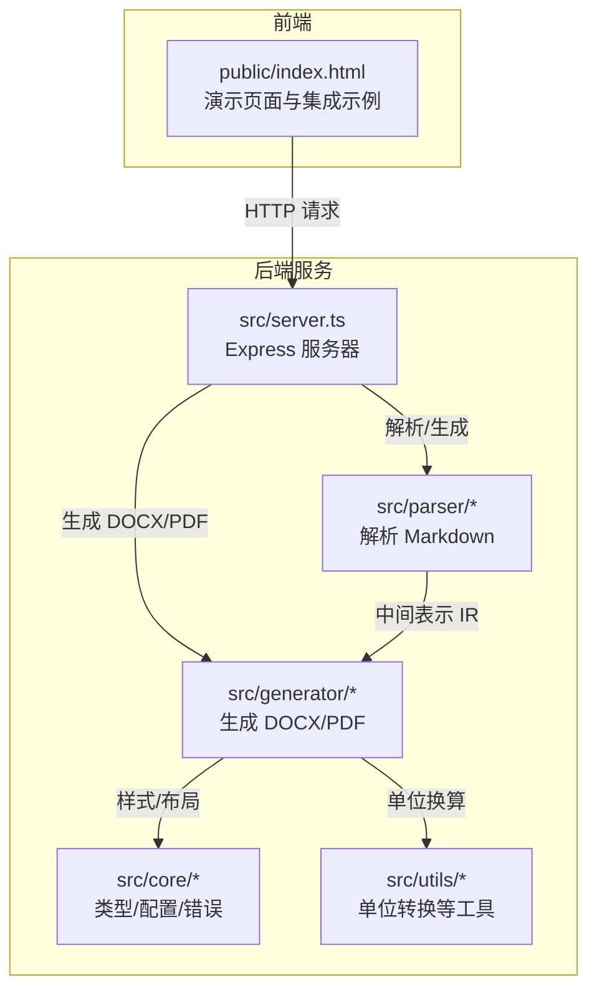
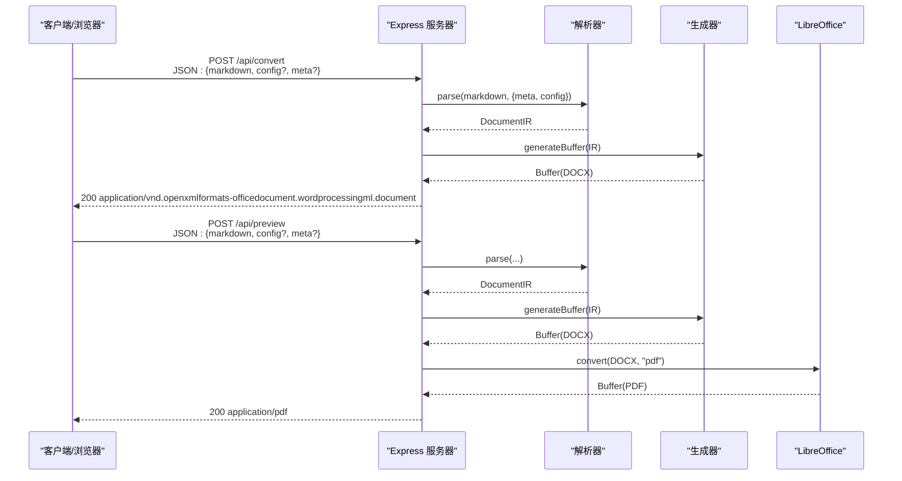
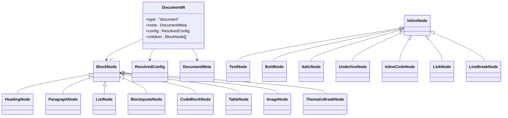
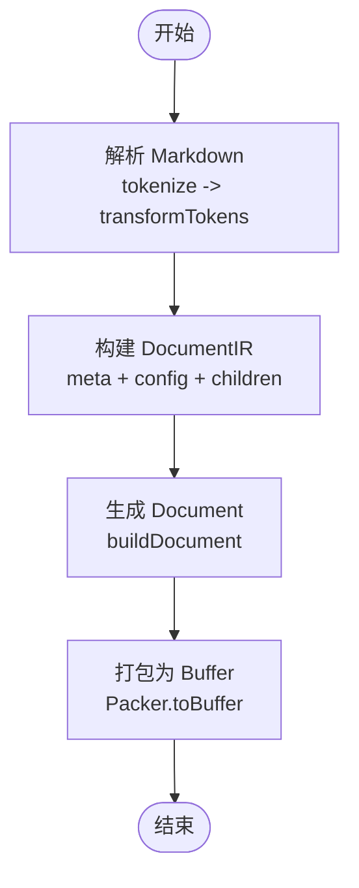
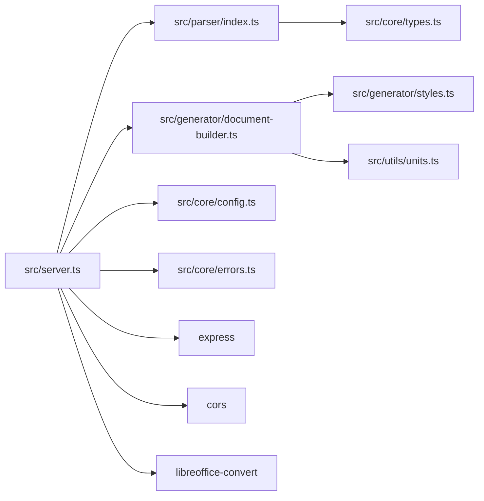

# Web 服务使用

<cite>
**本文档引用的文件**
- [package.json](file://package.json)
- [src/server.ts](file://src/server.ts)
- [src/index.ts](file://src/index.ts)
- [src/core/config.ts](file://src/core/config.ts)
- [src/core/types.ts](file://src/core/types.ts)
- [src/core/errors.ts](file://src/core/errors.ts)
- [src/parser/index.ts](file://src/parser/index.ts)
- [src/parser/tokenize.ts](file://src/parser/tokenize.ts)
- [src/parser/transformer.ts](file://src/parser/transformer.ts)
- [src/generator/document-builder.ts](file://src/generator/document-builder.ts)
- [src/generator/styles.ts](file://src/generator/styles.ts)
- [src/utils/units.ts](file://src/utils/units.ts)
- [public/index.html](file://public/index.html)
- [tests/e2e/full-pipeline.test.ts](file://tests/e2e/full-pipeline.test.ts)
- [tests/fixtures/markdown/sample.md](file://tests/fixtures/markdown/sample.md)
</cite>

## 目录
1. [简介](#简介)
2. [项目结构](#项目结构)
3. [核心组件](#核心组件)
4. [架构总览](#架构总览)
5. [详细组件分析](#详细组件分析)
6. [依赖关系分析](#依赖关系分析)
7. [性能考量](#性能考量)
8. [故障排查指南](#故障排查指南)
9. [结论](#结论)
10. [附录](#附录)

## 简介
本指南面向希望使用 Markdown to Word 转换器 Web 服务的开发者与运维人员。内容涵盖：
- RESTful API 端点规范、请求/响应格式与认证机制
- 单文档转换、批量转换与实时预览的完整使用示例
- 部署方式、配置选项与性能调优建议
- 前端集成示例（含浏览器端实时预览）
- 错误处理、状态码含义与调试技巧
- 生产环境部署最佳实践与安全注意事项

## 项目结构
该项目采用模块化组织，核心能力由解析器、生成器与 Web 服务器组成；同时提供静态前端页面用于演示与集成。

图表来源
- [src/server.ts:1-94](file://src/server.ts#L1-L94)
- [src/parser/index.ts:1-24](file://src/parser/index.ts#L1-L24)
- [src/generator/document-builder.ts:1-112](file://src/generator/document-builder.ts#L1-L112)
- [src/core/config.ts:1-91](file://src/core/config.ts#L1-L91)
- [src/utils/units.ts](file://src/utils/units.ts)
- [public/index.html:1-451](file://public/index.html#L1-L451)

章节来源
- [package.json:1-47](file://package.json#L1-L47)
- [src/server.ts:1-94](file://src/server.ts#L1-L94)
- [public/index.html:1-451](file://public/index.html#L1-L451)

## 核心组件
- 解析器：将 Markdown 文本解析为内部 IR（文档中间表示），支持标题、段落、列表、表格、引用块、代码块、分隔线与图片等。
- 生成器：基于 IR 与配置生成 DOCX 文档缓冲区，并可选导出 PDF（通过 LibreOffice）。
- Web 服务器：提供 /api/convert 与 /api/preview 两个端点，以及 /health 健康检查。
- 配置系统：使用 Zod Schema 校验与默认化配置，覆盖字体、字号、间距、页边距、页面尺寸/方向、图片、页眉页脚与颜色等。
- 类型系统：定义 DocumentIR、BlockNode、InlineNode 及配置接口，确保数据结构一致性。
- 错误体系：自定义异常类，便于区分解析错误、生成错误、图片处理错误与配置校验错误。

章节来源
- [src/parser/index.ts:1-24](file://src/parser/index.ts#L1-L24)
- [src/parser/tokenize.ts:1-16](file://src/parser/tokenize.ts#L1-L16)
- [src/parser/transformer.ts:1-360](file://src/parser/transformer.ts#L1-L360)
- [src/generator/document-builder.ts:1-112](file://src/generator/document-builder.ts#L1-L112)
- [src/generator/styles.ts:1-122](file://src/generator/styles.ts#L1-L122)
- [src/core/config.ts:1-91](file://src/core/config.ts#L1-L91)
- [src/core/types.ts:1-198](file://src/core/types.ts#L1-L198)
- [src/core/errors.ts:1-28](file://src/core/errors.ts#L1-L28)

## 架构总览
Web 服务以 Express 托管，接收前端或客户端的 JSON 请求，内部完成解析与生成，返回二进制响应（DOCX 或 PDF）。静态资源托管于 public 目录，内置演示页面可直接运行。

图表来源
- [src/server.ts:23-85](file://src/server.ts#L23-L85)
- [src/parser/index.ts:11-21](file://src/parser/index.ts#L11-L21)
- [src/generator/document-builder.ts:108-112](file://src/generator/document-builder.ts#L108-L112)

## 详细组件分析

### Web 服务器与 API 规范
- 端点
  - POST /api/convert：将 Markdown 转换为 DOCX 文件并下载
  - POST /api/preview：将 Markdown 实时预览为 PDF（需安装 LibreOffice）
  - GET /health：健康检查
- 认证机制：未实现任何认证/鉴权逻辑，默认开放
- 请求体字段
  - markdown: 字符串，必填
  - config: 对象，可选，详见“配置选项”
  - meta: 对象，可选，包含 title、author 等元信息
- 响应
  - /api/convert：200 + application/vnd.openxmlformats-officedocument.wordprocessingml.document，Content-Disposition 下载文件名来自 meta.title 或默认值
  - /api/preview：200 + application/pdf；若缺少 LibreOffice，返回 503 并提示安装
  - /health：200 + { status: "ok" }

章节来源
- [src/server.ts:23-89](file://src/server.ts#L23-L89)

### 配置选项与默认值
- 支持的配置键
  - font.body/heading/english/code：字体名称
  - size.body/heading1..6/code：字号（pt）
  - spacing.lineSpacing/paragraphSpacing/headingSpacing：行距/段前段后间距
  - margin.top/bottom/left/right：页边距（twips）
  - image.maxWidthPercent/defaultAlign：图片最大宽度百分比与默认对齐
  - headerFooter.header/footer/pageNumbers：页眉/页脚与页码
  - color.heading/text/link/codeBackground/blockquoteBorder：颜色
  - pageSize: "A4" | "Letter"
  - orientation: "portrait" | "landscape"
- 默认行为：使用 Zod Schema 校验并填充默认值；未提供的键将采用默认值
- 合并策略：可通过合并函数在基础配置上覆盖指定键

章节来源
- [src/core/config.ts:54-91](file://src/core/config.ts#L54-L91)
- [src/core/types.ts:137-198](file://src/core/types.ts#L137-L198)

### 数据模型与中间表示
- DocumentIR：根节点，包含 meta、config 与 block 子节点数组
- BlockNode：标题、段落、列表、引用块、代码块、表格、图片、分隔线等
- InlineNode：文本、加粗、斜体、下划线、行内代码、链接、换行等
- 生成器样式：根据配置生成段落样式（标题、正文、代码块、引用）

图表来源
- [src/core/types.ts:7-135](file://src/core/types.ts#L7-L135)
- [src/core/types.ts:187-198](file://src/core/types.ts#L187-L198)

章节来源
- [src/core/types.ts:1-198](file://src/core/types.ts#L1-L198)
- [src/generator/styles.ts:5-109](file://src/generator/styles.ts#L5-L109)

### 解析流程与渲染
- 解析阶段：使用 markdown-it 解析为 Token 列表，再转换为 BlockNode/InlineNode 结构
- 渲染阶段：按 BlockNode 顺序渲染为 docx 段落与元素，应用样式与页眉页脚
- 图片处理：HTML 图片会被识别并作为占位文本处理；实际图片渲染依赖 docx 库能力

图表来源
- [src/parser/tokenize.ts:12-15](file://src/parser/tokenize.ts#L12-L15)
- [src/parser/transformer.ts:25-39](file://src/parser/transformer.ts#L25-L39)
- [src/generator/document-builder.ts:17-106](file://src/generator/document-builder.ts#L17-L106)

章节来源
- [src/parser/index.ts:11-21](file://src/parser/index.ts#L11-L21)
- [src/parser/tokenize.ts:1-16](file://src/parser/tokenize.ts#L1-L16)
- [src/parser/transformer.ts:1-360](file://src/parser/transformer.ts#L1-L360)
- [src/generator/document-builder.ts:17-112](file://src/generator/document-builder.ts#L17-L112)

### API 使用示例

- 单个文档转换（下载 DOCX）
  - 请求：POST /api/convert
  - 请求体：包含 markdown、可选 config、可选 meta
  - 响应：application/vnd.openxmlformats-officedocument.wordprocessingml.document，自动下载
  - 示例路径：[示例请求体参考:23-49](file://src/server.ts#L23-L49)

- 实时预览（PDF）
  - 请求：POST /api/preview
  - 请求体：包含 markdown、可选 config、可选 meta
  - 响应：application/pdf；如未安装 LibreOffice 返回 503
  - 示例路径：[示例请求体参考:51-85](file://src/server.ts#L51-L85)

- 健康检查
  - 请求：GET /health
  - 响应：{ status: "ok" }

- 批量转换（客户端侧循环）
  - 说明：服务端未提供批量端点，可在客户端循环调用 /api/convert 并并发控制，或自行扩展服务端路由

章节来源
- [src/server.ts:23-89](file://src/server.ts#L23-L89)

### 前端集成示例
- 内置演示页面：public/index.html 提供编辑器、预览与配置面板，直接运行即可体验
- 关键交互：
  - 预览刷新：调用 /api/preview，将返回的 PDF Blob 设置到 iframe
  - 下载 DOCX：调用 /api/convert，将返回的 Buffer 下载为 .docx
  - 配置联动：变更配置后触发防抖刷新
- 示例路径：
  - 预览刷新逻辑：[刷新预览:329-371](file://public/index.html#L329-L371)
  - 下载 DOCX 逻辑：[下载文档:403-447](file://public/index.html#L403-L447)
  - 配置读取与变更监听：[配置读取:294-320](file://public/index.html#L294-L320)，[事件绑定:378-380](file://public/index.html#L378-L380)

章节来源
- [public/index.html:1-451](file://public/index.html#L1-L451)

## 依赖关系分析

图表来源
- [src/server.ts:1-94](file://src/server.ts#L1-L94)
- [src/parser/index.ts:1-24](file://src/parser/index.ts#L1-L24)
- [src/generator/document-builder.ts:1-112](file://src/generator/document-builder.ts#L1-L112)
- [src/generator/styles.ts:1-122](file://src/generator/styles.ts#L1-L122)
- [src/core/config.ts:1-91](file://src/core/config.ts#L1-L91)
- [src/core/errors.ts:1-28](file://src/core/errors.ts#L1-L28)
- [package.json:27-36](file://package.json#L27-L36)

章节来源
- [package.json:1-47](file://package.json#L1-L47)
- [src/server.ts:1-94](file://src/server.ts#L1-L94)

## 性能考量
- 输入大小限制：服务器已设置 JSON 最大 10MB，避免过大请求导致内存压力
- 解析与生成复杂度：解析复杂度近似 O(n_tokens)，生成复杂度取决于块/内联节点数量与样式计算
- PDF 预览：依赖 LibreOffice，CPU/内存占用较高，建议在专用进程或容器中运行
- 并发与限流：当前未内置限流；生产环境建议在网关层或反向代理层增加限速与超时
- 缓存策略：预览 PDF 未做缓存；可在网关或应用层引入短期缓存减少重复转换
- 静态资源：静态页面与样式已内嵌，减少额外请求

章节来源
- [src/server.ts:19-21](file://src/server.ts#L19-L21)

## 故障排查指南
- 常见错误与状态码
  - 400：缺少 markdown 参数
  - 500：转换过程中的通用错误，包含错误消息
  - 503：预览 PDF 失败且提示 LibreOffice 未找到
- 错误分类
  - MarkdownParseError：解析阶段异常
  - DocxGenerationError：DOCX 生成阶段异常
  - ImageProcessingError：图片处理异常
  - ConfigValidationError：配置校验失败
- 调试技巧
  - 查看服务端日志输出（控制台）
  - 在浏览器网络面板检查请求体与响应头
  - 使用 /health 确认服务可用性
  - 将 markdown 简化为最小可复现样例定位问题
- 端到端验证
  - 参考测试用例验证生成的 Buffer 是否为有效 ZIP（DOCX 容器）

章节来源
- [src/server.ts:23-85](file://src/server.ts#L23-L85)
- [src/core/errors.ts:1-28](file://src/core/errors.ts#L1-L28)
- [tests/e2e/full-pipeline.test.ts:8-51](file://tests/e2e/full-pipeline.test.ts#L8-L51)

## 结论
该 Web 服务提供了简洁高效的 Markdown 到 Word 转换能力，并支持实时 PDF 预览（需安装 LibreOffice）。通过清晰的配置体系与类型系统，用户可以灵活定制文档样式与布局。生产部署时建议关注依赖安装、资源限制、并发控制与安全加固。

## 附录

### 部署与运行
- 安装依赖：使用包管理器安装项目依赖
- 构建产物：使用构建脚本生成 ESM 输出
- 启动服务：运行服务脚本启动 Express 服务器
- 环境变量：默认监听端口可通过环境变量覆盖

章节来源
- [package.json:11-18](file://package.json#L11-L18)

### 安全与合规建议
- 认证与授权：当前未内置认证；建议在反向代理或网关层添加鉴权
- CORS：已启用 CORS 中间件；生产环境建议限定来源
- 资源限制：限制请求体大小与并发连接数，防止资源耗尽
- 依赖更新：定期更新第三方依赖，修复已知漏洞
- 日志与监控：记录关键错误与耗时指标，便于审计与排障

章节来源
- [src/server.ts:19-21](file://src/server.ts#L19-L21)
- [package.json:27-36](file://package.json#L27-L36)