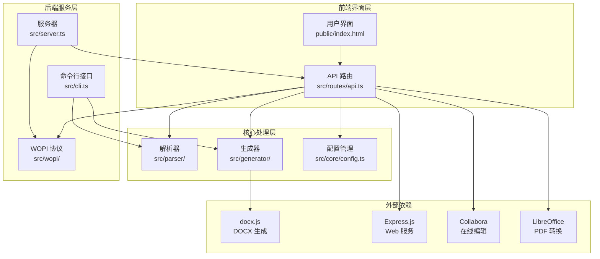
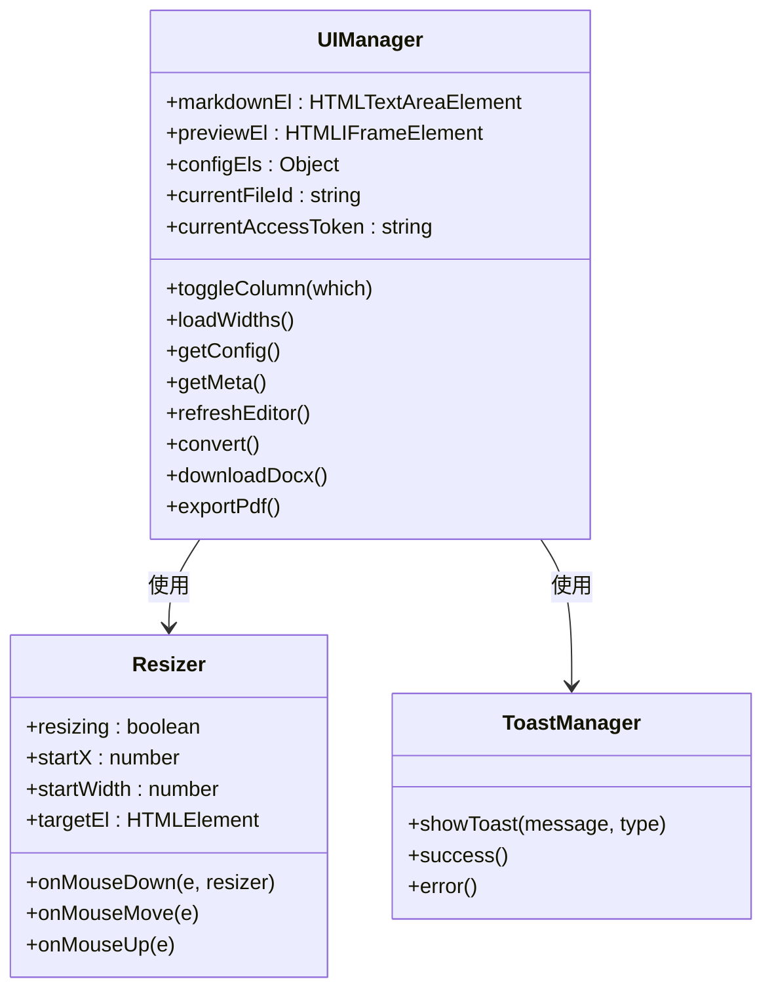
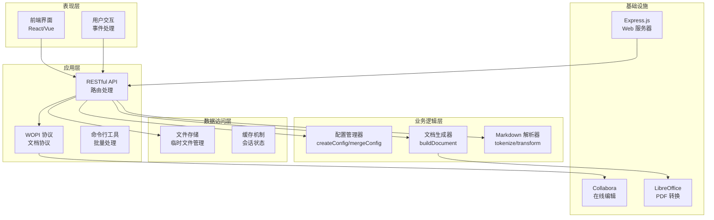
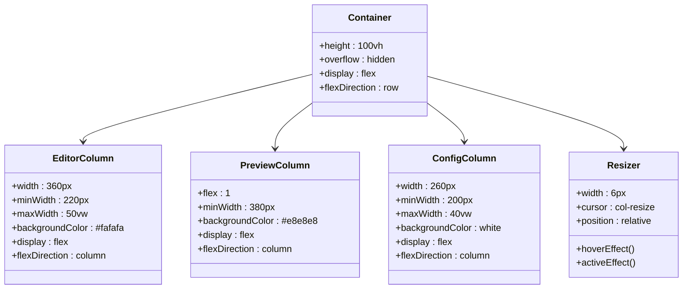
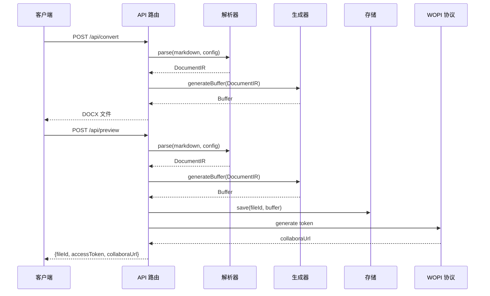
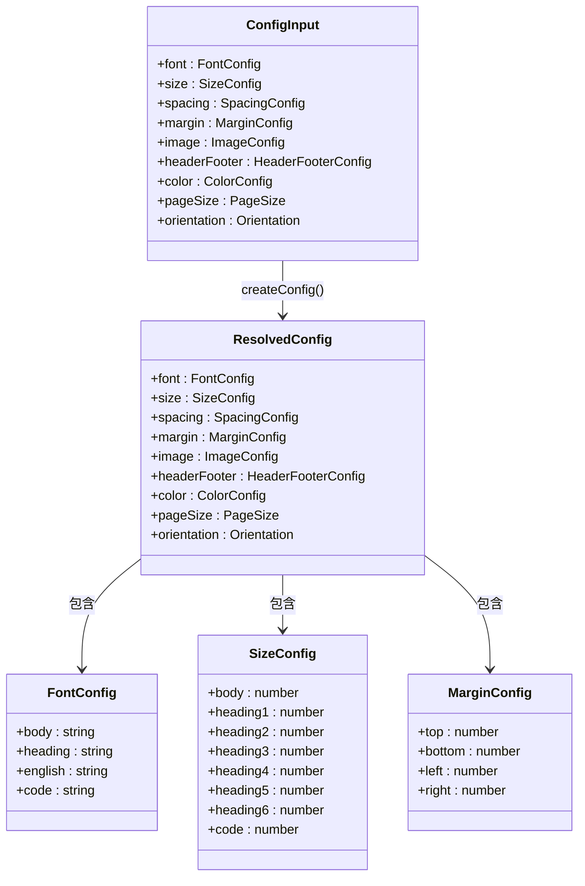
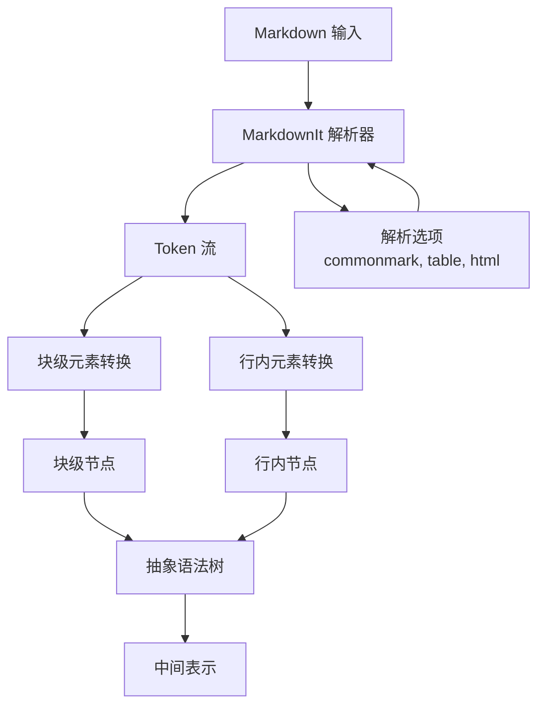
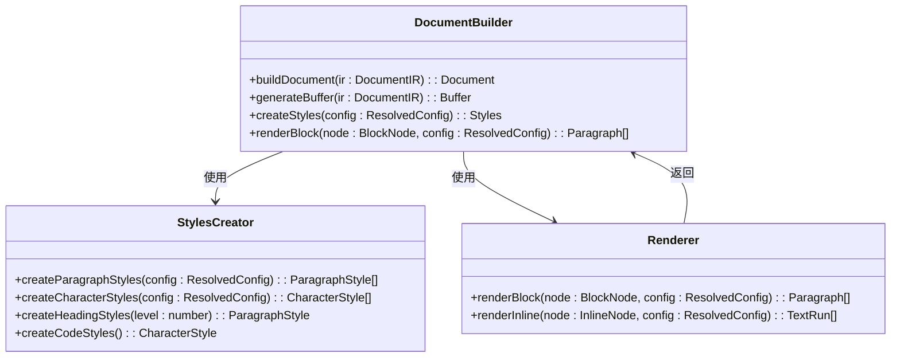
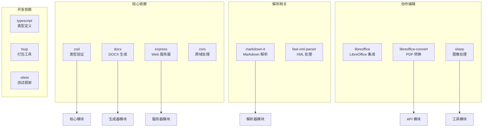

# 前端界面现代化

<cite>
**本文档引用的文件**
- [package.json](file://package.json)
- [index.html](file://public/index.html)
- [server.ts](file://src/server.ts)
- [cli.ts](file://src/cli.ts)
- [config.ts](file://src/core/config.ts)
- [types.ts](file://src/core/types.ts)
- [index.ts](file://src/index.ts)
- [index.ts](file://src/parser/index.ts)
- [tokenize.ts](file://src/parser/tokenize.ts)
- [transformer.ts](file://src/parser/transformer.ts)
- [index.ts](file://src/generator/index.ts)
- [document-builder.ts](file://src/generator/document-builder.ts)
- [api.ts](file://src/routes/api.ts)
- [index.ts](file://src/wopi/index.ts)
- [Dockerfile](file://Dockerfile)
</cite>

## 目录
1. [简介](#简介)
2. [项目结构](#项目结构)
3. [核心组件](#核心组件)
4. [架构概览](#架构概览)
5. [详细组件分析](#详细组件分析)
6. [依赖关系分析](#依赖关系分析)
7. [性能考虑](#性能考虑)
8. [故障排除指南](#故障排除指南)
9. [结论](#结论)

## 简介

这是一个现代化的 Markdown 到 Word 文档转换器，采用前端界面现代化设计，提供实时预览、配置定制和协作编辑功能。项目基于 TypeScript 构建，使用 Express.js 提供 Web 服务，集成 Collabora 在线办公套件实现文档协作编辑，并通过 LibreOffice 支持 PDF 导出。

该系统的核心特性包括：
- 实时 Markdown 编辑与预览
- 可定制的文档样式配置
- 协作式在线编辑（Collabora）
- 多格式导出支持（DOCX、PDF）
- 响应式用户界面设计

## 项目结构

项目采用模块化架构，主要分为以下几个核心模块：



**图表来源**
- [server.ts:1-40](file://src/server.ts#L1-L40)
- [api.ts:1-103](file://src/routes/api.ts#L1-L103)
- [index.html:1-633](file://public/index.html#L1-L633)

**章节来源**
- [package.json:1-51](file://package.json#L1-L51)
- [server.ts:1-40](file://src/server.ts#L1-L40)

## 核心组件

### 用户界面系统

系统采用现代化的三栏布局设计，包含编辑器、预览区和配置面板：



**图表来源**
- [index.html:304-633](file://public/index.html#L304-L633)

### 文档处理引擎

系统实现了完整的文档处理流水线，从 Markdown 解析到最终文档生成：

```mermaid
flowchart TD
Start([开始处理]) --> Parse[解析 Markdown]
Parse --> Tokenize[词法分析]
Tokenize --> Transform[语法树转换]
Transform --> IR[中间表示(IR)]
IR --> Build[构建文档结构]
Build --> Style[应用样式配置]
Style --> Export[导出文档]
Export --> End([完成])
Parse --> Error1[解析错误]
Transform --> Error2[转换错误]
Build --> Error3[构建错误]
Export --> Error4[导出错误]
Error1 --> ErrorHandler[错误处理]
Error2 --> ErrorHandler
Error3 --> ErrorHandler
Error4 --> ErrorHandler
ErrorHandler --> End
```

**图表来源**
- [index.ts:11-21](file://src/parser/index.ts#L11-L21)
- [document-builder.ts:17-106](file://src/generator/document-builder.ts#L17-L106)

**章节来源**
- [index.html:118-300](file://public/index.html#L118-L300)
- [index.ts:11-21](file://src/parser/index.ts#L11-L21)

## 架构概览

系统采用分层架构设计，确保各组件间的松耦合和高内聚：



**图表来源**
- [server.ts:13-39](file://src/server.ts#L13-L39)
- [api.ts:15-100](file://src/routes/api.ts#L15-L100)

## 详细组件分析

### 前端界面组件

#### 主界面布局系统

界面采用 Flexbox 布局，实现响应式三栏设计：



**图表来源**
- [index.html:24-26](file://public/index.html#L24-L26)
- [index.html:28-32](file://public/index.html#L28-L32)

#### 工具栏系统

工具栏提供丰富的 Markdown 编辑功能：

| 功能 | 按钮 | 快捷键 | 描述 |
|------|------|--------|------|
| 粗体 | `<b>B</b>` | Ctrl+B | 应用粗体格式 |
| 斜体 | `<i>I</i>` | Ctrl+I | 应用斜体格式 |
| 下划线 | `<u>U</u>` | Ctrl+U | 应用下划线格式 |
| 标题 | H1/H2/H3 | Ctrl+1/2/3 | 创建不同级别的标题 |
| 列表 | List/Num | Ctrl+Shift+1/2 | 创建有序或无序列表 |
| 引用 | Quote | Ctrl+Shift+Q | 创建块级引用 |
| 代码 | Code | Ctrl+Alt+C | 插入代码块 |
| 表格 | Table | Ctrl+Alt+T | 插入 Markdown 表格 |

**章节来源**
- [index.html:125-139](file://public/index.html#L125-L139)

### 后端服务组件

#### API 路由系统

系统提供完整的 RESTful API 接口：



**图表来源**
- [api.ts:15-59](file://src/routes/api.ts#L15-L59)

#### 配置管理系统

系统支持多层次的配置管理：



**图表来源**
- [config.ts:54-91](file://src/core/config.ts#L54-L91)
- [types.ts:137-198](file://src/core/types.ts#L137-L198)

**章节来源**
- [config.ts:68-91](file://src/core/config.ts#L68-L91)
- [api.ts:15-34](file://src/routes/api.ts#L15-L34)

### 文档生成组件

#### 解析器系统

系统使用 markdown-it 进行 Markdown 解析：



**图表来源**
- [tokenize.ts:4-15](file://src/parser/tokenize.ts#L4-L15)
- [transformer.ts:25-39](file://src/parser/transformer.ts#L25-L39)

#### 生成器系统

文档生成器负责将中间表示转换为最终的 DOCX 文件：



**图表来源**
- [document-builder.ts:17-106](file://src/generator/document-builder.ts#L17-L106)

**章节来源**
- [transformer.ts:41-122](file://src/parser/transformer.ts#L41-L122)
- [document-builder.ts:17-106](file://src/generator/document-builder.ts#L17-L106)

## 依赖关系分析

系统采用模块化依赖管理，各模块间保持清晰的边界：



**图表来源**
- [package.json:29-49](file://package.json#L29-L49)

**章节来源**
- [package.json:11-20](file://package.json#L11-L20)

## 性能考虑

### 前端性能优化

系统在前端层面采用了多项性能优化策略：

1. **响应式布局优化**
   - 使用 CSS Grid 和 Flexbox 实现高效的布局计算
   - 最小化重绘和回流操作
   - 使用 translate 替代 position 属性进行动画

2. **资源加载优化**
   - 图片懒加载和尺寸适配
   - CDN 加速静态资源
   - 压缩和合并 CSS/JS 文件

3. **内存管理**
   - 及时清理事件监听器
   - 合理使用 WeakMap 和 WeakSet
   - 避免内存泄漏

### 后端性能优化

1. **并发处理**
   - 使用异步非阻塞 I/O 操作
   - 连接池管理数据库连接
   - 缓存常用配置和模板

2. **资源管理**
   - 流式处理大文件
   - 及时释放临时文件
   - 内存使用监控

3. **网络优化**
   - Gzip 压缩响应内容
   - 合理设置缓存头
   - CDN 分发静态资源

## 故障排除指南

### 常见问题及解决方案

#### Collabora 在线编辑不可用

**症状**: 预览功能显示 Collabora 不可用

**原因分析**:
- Docker Compose 未正确启动
- 网络连接问题
- 端口冲突

**解决步骤**:
1. 检查 Docker 服务状态
2. 运行 `npm run compose:up` 启动服务
3. 验证端口 3000 是否被占用
4. 检查防火墙设置

#### PDF 导出失败

**症状**: 导出 PDF 时报错 "LibreOffice not found"

**原因分析**:
- LibreOffice 未安装
- soffice 二进制文件路径不正确

**解决步骤**:
1. 安装 LibreOffice
2. 确认 soffice 可执行文件路径
3. 设置正确的环境变量

#### 文档生成错误

**症状**: 转换过程中出现异常

**排查步骤**:
1. 检查 Markdown 语法是否正确
2. 验证配置参数的有效性
3. 查看服务器日志获取详细错误信息

**章节来源**
- [server.ts:27-39](file://src/server.ts#L27-L39)
- [api.ts:92-99](file://src/routes/api.ts#L92-L99)

### 开发调试技巧

1. **启用详细日志**
   ```bash
   DEBUG=markdowntoword:* npm run dev
   ```

2. **单元测试运行**
   ```bash
   npm test
   ```

3. **端到端测试**
   ```bash
   npm run test:e2e
   ```

## 结论

本项目成功实现了现代化的 Markdown 到 Word 文档转换器，具有以下特点：

**技术优势**:
- 采用模块化架构，组件职责清晰
- 前端界面现代化，用户体验优秀
- 后端服务稳定可靠，支持多种输出格式
- 集成协作编辑功能，提升工作效率

**创新特性**:
- 实时预览与编辑分离的设计理念
- 可定制的样式配置系统
- 响应式布局适配多设备
- 完整的错误处理和恢复机制

**扩展性**:
- 插件化的渲染器架构
- 灵活的配置系统
- 支持自定义样式和主题
- 易于集成新的文档格式

该系统为用户提供了一个功能完整、性能优异的文档转换解决方案，适合个人用户和企业环境的各种使用场景。