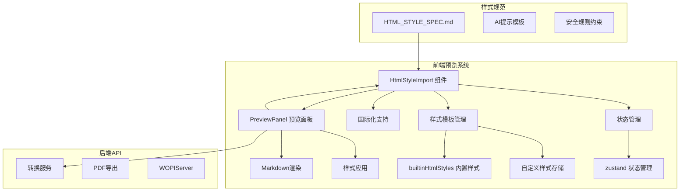
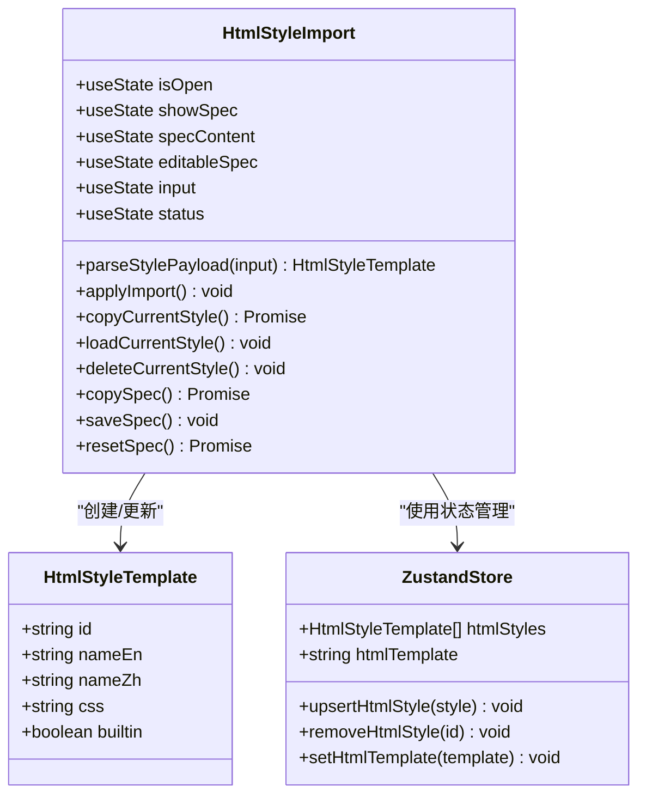
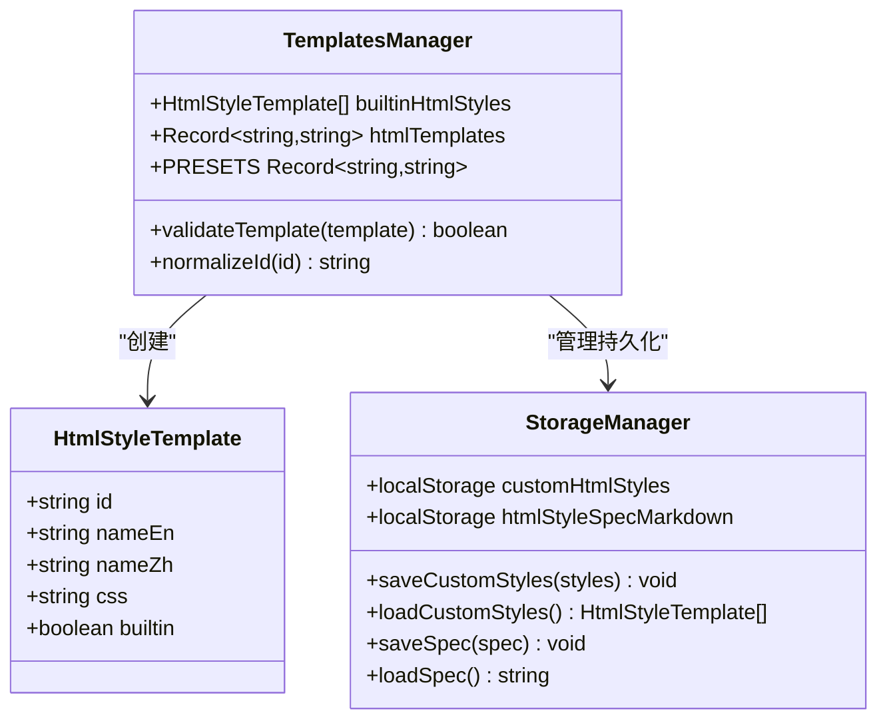
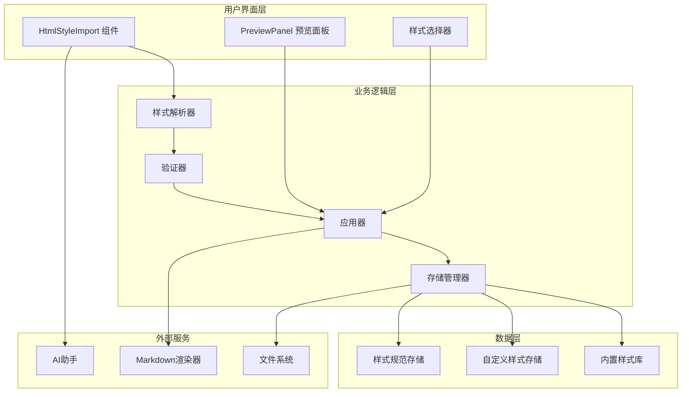
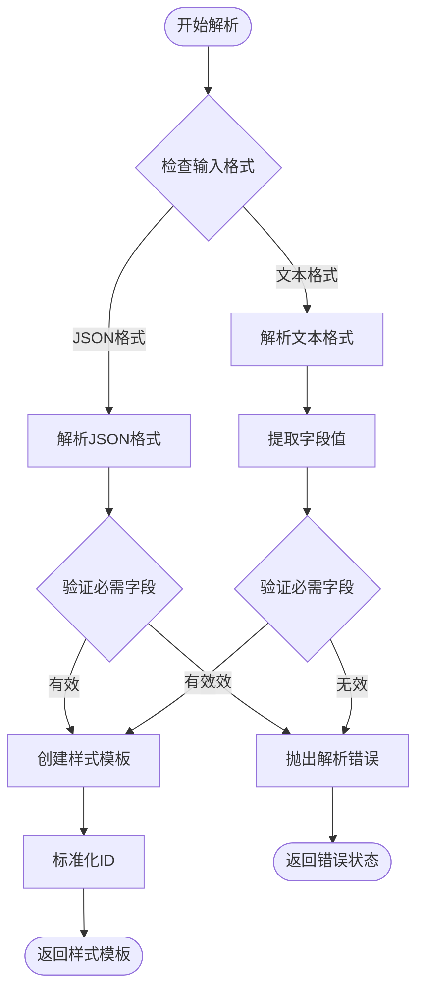
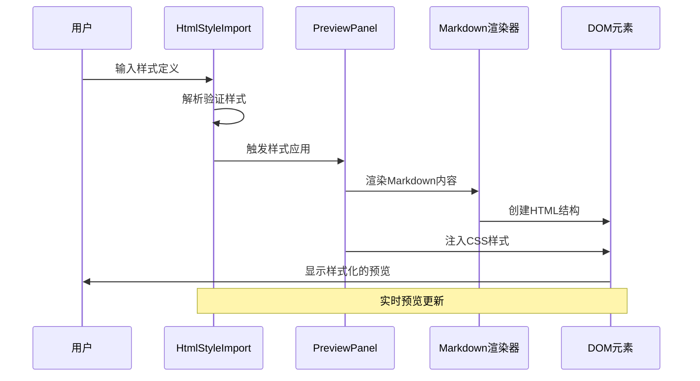
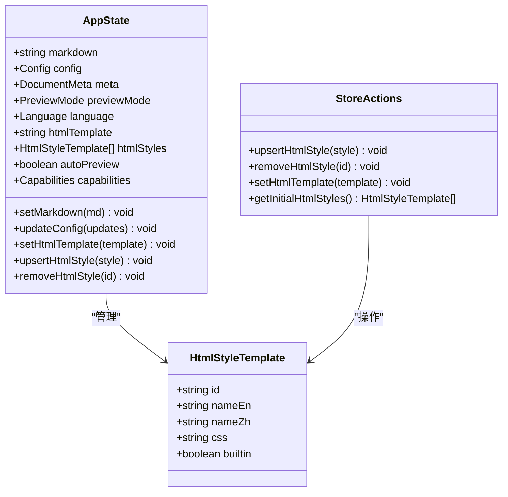
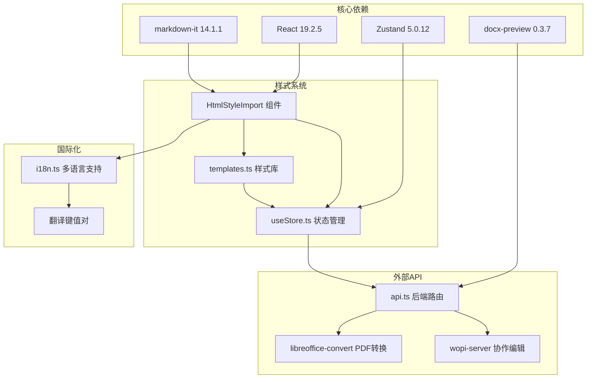

# HTML样式导入系统

<cite>
**本文档中引用的文件**
- [HtmlStyleImport.tsx](file://frontend/src/components/preview/HtmlStyleImport.tsx)
- [templates.ts](file://frontend/src/utils/templates.ts)
- [useStore.ts](file://frontend/src/store/useStore.ts)
- [PreviewPanel.tsx](file://frontend/src/components/preview/PreviewPanel.tsx)
- [HTML_STYLE_SPEC.md](file://frontend/public/HTML_STYLE_SPEC.md)
- [HTML_STYLE_SPEC.md](file://public/HTML_STYLE_SPEC.md)
- [i18n.ts](file://frontend/src/i18n.ts)
- [api.ts](file://src/routes/api.ts)
- [styles.ts](file://src/generator/styles.ts)
- [types.ts](file://src/core/types.ts)
</cite>

## 目录
1. [简介](#简介)
2. [项目结构](#项目结构)
3. [核心组件](#核心组件)
4. [架构概览](#架构概览)
5. [详细组件分析](#详细组件分析)
6. [依赖关系分析](#依赖关系分析)
7. [性能考虑](#性能考虑)
8. [故障排除指南](#故障排除指南)
9. [结论](#结论)

## 简介

HTML样式导入系统是Markdown转Word工具中的一个关键功能模块，允许用户导入自定义的HTML预览样式。该系统提供了两种样式的导入格式（文本格式和JSON格式），支持实时预览和样式管理功能。系统设计的核心目标是为用户提供灵活的样式定制能力，同时保持与Markdown内容渲染的无缝集成。

该系统主要服务于以下场景：
- 自定义HTML预览样式导入
- 内置样式的管理和切换
- 样式规范的AI辅助生成
- 实时样式预览和应用
- 样式数据的持久化存储

## 项目结构

HTML样式导入系统位于前端项目的预览组件中，采用模块化设计，主要包含以下核心文件：

**图表来源**
- [HtmlStyleImport.tsx:1-229](file://frontend/src/components/preview/HtmlStyleImport.tsx#L1-L229)
- [PreviewPanel.tsx:1-271](file://frontend/src/components/preview/PreviewPanel.tsx#L1-L271)
- [templates.ts:1-181](file://frontend/src/utils/templates.ts#L1-L181)

**章节来源**
- [HtmlStyleImport.tsx:1-229](file://frontend/src/components/preview/HtmlStyleImport.tsx#L1-L229)
- [PreviewPanel.tsx:1-271](file://frontend/src/components/preview/PreviewPanel.tsx#L1-L271)
- [templates.ts:1-181](file://frontend/src/utils/templates.ts#L1-L181)

## 核心组件

### HtmlStyleImport 组件

HtmlStyleImport是整个样式导入系统的核心组件，负责处理用户输入的样式定义并将其应用到预览界面中。

**主要功能特性：**
- 支持两种样式格式导入（文本格式和JSON格式）
- 实时样式预览和应用
- 样式规范的查看和编辑
- 本地存储和持久化管理
- 错误处理和状态反馈

**组件架构：**

**图表来源**
- [HtmlStyleImport.tsx:10-41](file://frontend/src/components/preview/HtmlStyleImport.tsx#L10-L41)
- [useStore.ts:175-291](file://frontend/src/store/useStore.ts#L175-L291)

### 样式模板管理系统

系统提供了一个完整的样式模板管理机制，包括内置样式和自定义样式的统一管理。

**内置样式集合：**
- modernDark：现代深色主题
- glassmorphism：玻璃拟态效果
- magazine：杂志排版风格
- neonCyber：霓虹赛博朋克风格

**模板接口定义：**

**图表来源**
- [templates.ts:1-181](file://frontend/src/utils/templates.ts#L1-L181)
- [useStore.ts:160-173](file://frontend/src/store/useStore.ts#L160-L173)

**章节来源**
- [HtmlStyleImport.tsx:43-229](file://frontend/src/components/preview/HtmlStyleImport.tsx#L43-L229)
- [templates.ts:1-181](file://frontend/src/utils/templates.ts#L1-L181)
- [useStore.ts:160-291](file://frontend/src/store/useStore.ts#L160-L291)

## 架构概览

HTML样式导入系统采用分层架构设计，确保了功能的模块化和可维护性。

**图表来源**
- [HtmlStyleImport.tsx:1-229](file://frontend/src/components/preview/HtmlStyleImport.tsx#L1-L229)
- [PreviewPanel.tsx:1-271](file://frontend/src/components/preview/PreviewPanel.tsx#L1-L271)
- [useStore.ts:1-291](file://frontend/src/store/useStore.ts#L1-L291)

系统的核心流程包括：

1. **样式导入流程**：用户输入样式定义 → 解析验证 → 应用到预览 → 持久化存储
2. **样式应用流程**：选择样式 → 获取CSS → 注入到预览容器 → 实时预览
3. **样式管理流程**：增删改查 → 本地存储 → 状态同步

## 详细组件分析

### 样式解析器实现

样式解析器是系统的核心组件，负责处理用户输入的不同格式样式定义。

**图表来源**
- [HtmlStyleImport.tsx:10-41](file://frontend/src/components/preview/HtmlStyleImport.tsx#L10-L41)

**解析器特性：**
- **双格式支持**：同时支持JSON和文本两种格式
- **严格验证**：确保必需字段的完整性和正确性
- **格式标准化**：自动清理和标准化输入数据
- **错误处理**：提供详细的错误信息和状态反馈

### 样式应用机制

样式应用机制负责将解析后的样式应用到预览界面中。

**图表来源**
- [PreviewPanel.tsx:155-180](file://frontend/src/components/preview/PreviewPanel.tsx#L155-L180)
- [HtmlStyleImport.tsx:86-95](file://frontend/src/components/preview/HtmlStyleImport.tsx#L86-L95)

### 状态管理集成

系统通过Zustand状态管理库实现了全局状态的统一管理。

**图表来源**
- [useStore.ts:175-291](file://frontend/src/store/useStore.ts#L175-L291)

**状态管理特性：**
- **响应式更新**：状态变化自动触发UI更新
- **持久化存储**：自定义样式和配置自动保存到localStorage
- **初始化逻辑**：从localStorage恢复用户偏好设置
- **类型安全**：完整的TypeScript类型定义

**章节来源**
- [HtmlStyleImport.tsx:10-95](file://frontend/src/components/preview/HtmlStyleImport.tsx#L10-L95)
- [PreviewPanel.tsx:155-180](file://frontend/src/components/preview/PreviewPanel.tsx#L155-L180)
- [useStore.ts:175-291](file://frontend/src/store/useStore.ts#L175-L291)

## 依赖关系分析

HTML样式导入系统涉及多个层面的依赖关系，形成了一个完整的生态系统。

**图表来源**
- [HtmlStyleImport.tsx:1-5](file://frontend/src/components/preview/HtmlStyleImport.tsx#L1-L5)
- [useStore.ts:1-2](file://frontend/src/store/useStore.ts#L1-L2)
- [i18n.ts:12-23](file://frontend/src/i18n.ts#L12-L23)
- [api.ts:1-12](file://src/routes/api.ts#L1-L12)

**依赖关系特点：**
- **轻量级依赖**：核心依赖数量适中，避免过度耦合
- **模块化设计**：各组件职责明确，便于独立测试和维护
- **类型安全**：完整的TypeScript类型定义确保开发体验
- **异步处理**：合理使用Promise和async/await处理异步操作

**章节来源**
- [HtmlStyleImport.tsx:1-229](file://frontend/src/components/preview/HtmlStyleImport.tsx#L1-L229)
- [useStore.ts:1-291](file://frontend/src/store/useStore.ts#L1-L291)
- [i18n.ts:1-251](file://frontend/src/i18n.ts#L1-L251)
- [api.ts:1-196](file://src/routes/api.ts#L1-L196)

## 性能考虑

HTML样式导入系统在设计时充分考虑了性能优化，确保在各种使用场景下的流畅体验。

### 渲染性能优化

**虚拟DOM优化：**
- 使用React.memo减少不必要的重渲染
- useMemo缓存计算结果，避免重复计算
- useCallback优化函数引用，防止子组件重新渲染

**样式应用优化：**
- CSS注入采用动态style标签，避免全局样式污染
- 样式变更触发局部更新，而非整页重绘
- 预览容器复用，减少DOM节点创建销毁

### 存储性能优化

**本地存储策略：**
- 自定义样式按需加载，避免一次性加载所有样式
- localStorage使用批量操作，减少存储调用次数
- 数据序列化采用JSON格式，保证兼容性和性能

**内存管理：**
- 及时清理URL对象引用，防止内存泄漏
- 文件下载完成后及时释放blob对象
- 组件卸载时清理事件监听器和定时器

### 网络性能优化

**资源加载优化：**
- 样式规范文件支持本地缓存
- Markdown渲染器预实例化，避免重复创建
- API请求采用防抖机制，减少不必要的网络请求

## 故障排除指南

### 常见问题及解决方案

**样式导入失败**
- **症状**：样式解析错误，无法应用到预览
- **原因**：输入格式不正确或缺少必需字段
- **解决**：检查样式定义是否符合规范，确保包含id、name-en、name-zh、css字段

**预览显示异常**
- **症状**：样式应用后预览效果不符合预期
- **原因**：CSS选择器冲突或样式作用域问题
- **解决**：确认CSS完全作用于.html-creative-preview类，避免全局样式污染

**本地存储问题**
- **症状**：自定义样式丢失或无法保存
- **原因**：浏览器存储限制或权限问题
- **解决**：检查浏览器存储空间，清除过期数据，确保网站有存储权限

**国际化显示问题**
- **症状**：界面语言切换不生效
- **原因**：状态管理或缓存问题
- **解决**：刷新页面，检查localStorage中的语言设置

### 调试技巧

**开发者工具使用：**
- 使用React DevTools检查组件状态和props
- 在浏览器控制台查看网络请求和错误信息
- 检查localStorage中的数据完整性

**日志记录：**
- 在关键操作点添加console.log输出
- 监控状态变化和组件生命周期
- 记录用户交互行为以便问题定位

**章节来源**
- [HtmlStyleImport.tsx:86-95](file://frontend/src/components/preview/HtmlStyleImport.tsx#L86-L95)
- [useStore.ts:267-279](file://frontend/src/store/useStore.ts#L267-L279)
- [i18n.ts:237-250](file://frontend/src/i18n.ts#L237-L250)

## 结论

HTML样式导入系统是一个设计精良、功能完善的样式管理解决方案。系统通过模块化的设计、严格的类型定义和完善的错误处理机制，为用户提供了灵活而可靠的样式定制能力。

**系统优势：**
- **易用性强**：支持多种格式的样式导入，界面友好
- **扩展性好**：模块化设计便于功能扩展和维护
- **性能优秀**：合理的优化策略确保流畅的用户体验
- **可靠性高**：完善的错误处理和状态管理机制

**技术亮点：**
- 双格式支持的解析器设计
- 响应式的状态管理模式
- 完整的国际化支持
- 严格的类型安全保证

该系统不仅满足了当前的功能需求，还为未来的功能扩展奠定了坚实的基础。通过持续的优化和完善，HTML样式导入系统将成为Markdown转Word工具的重要特色功能。