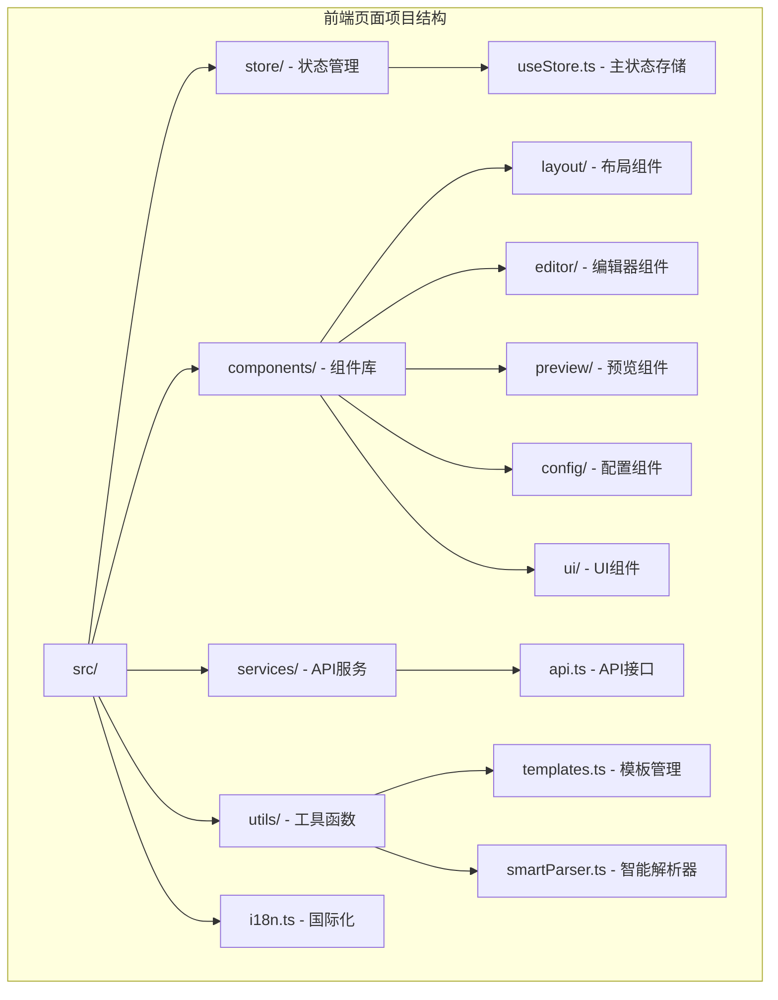
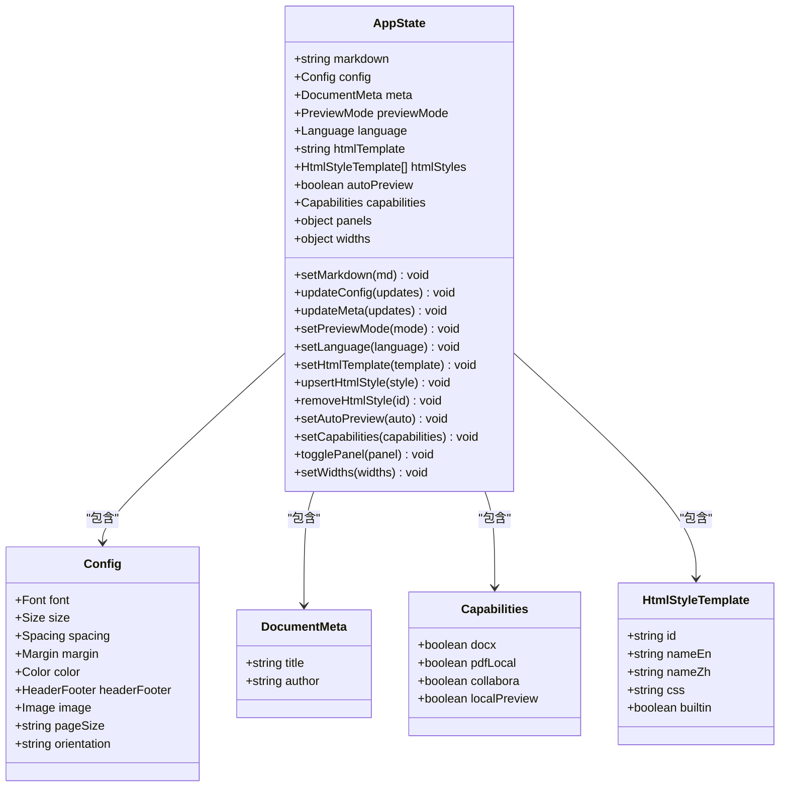
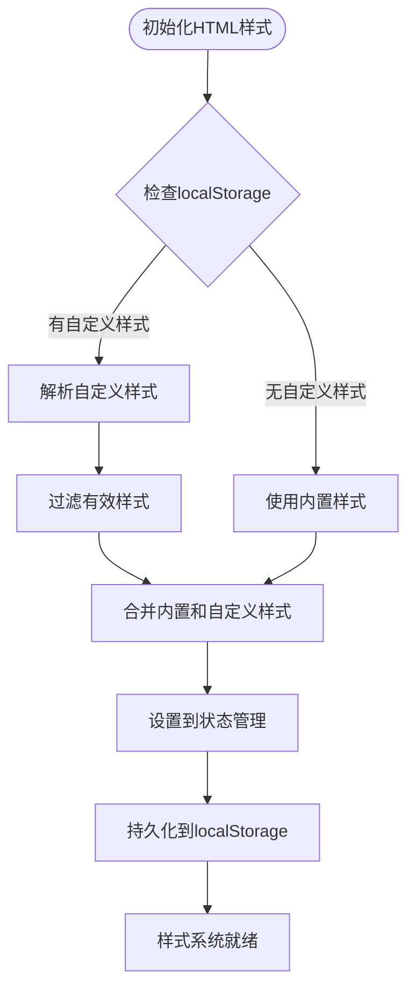
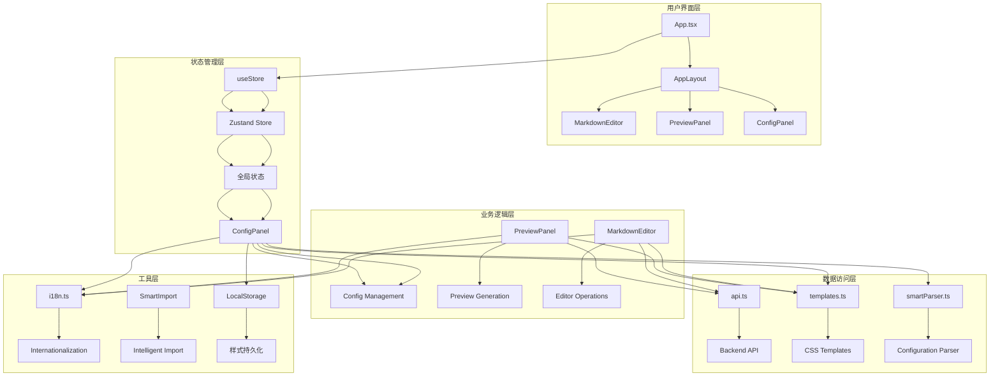
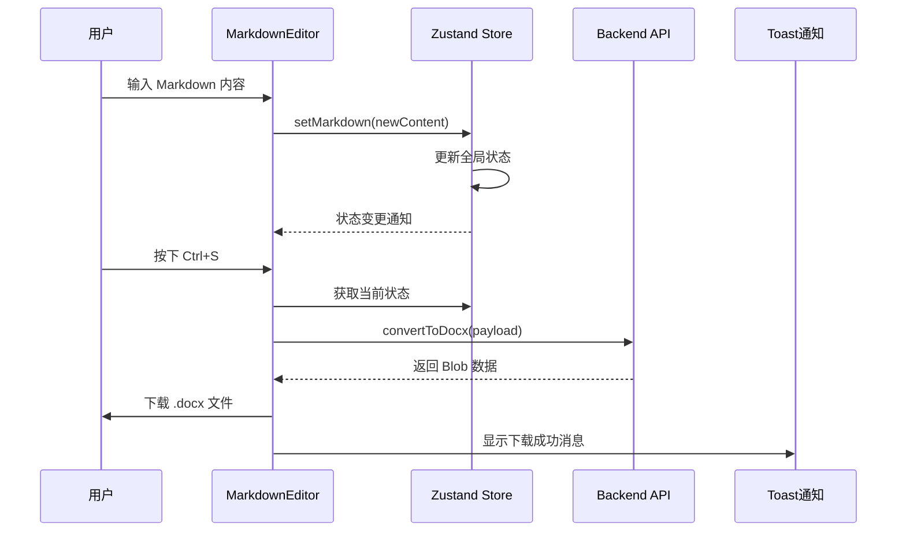
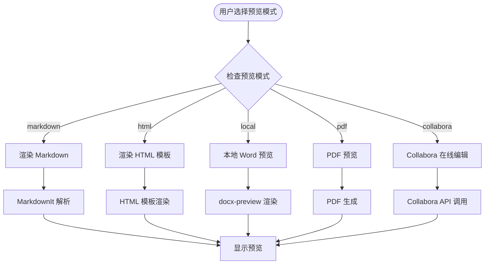
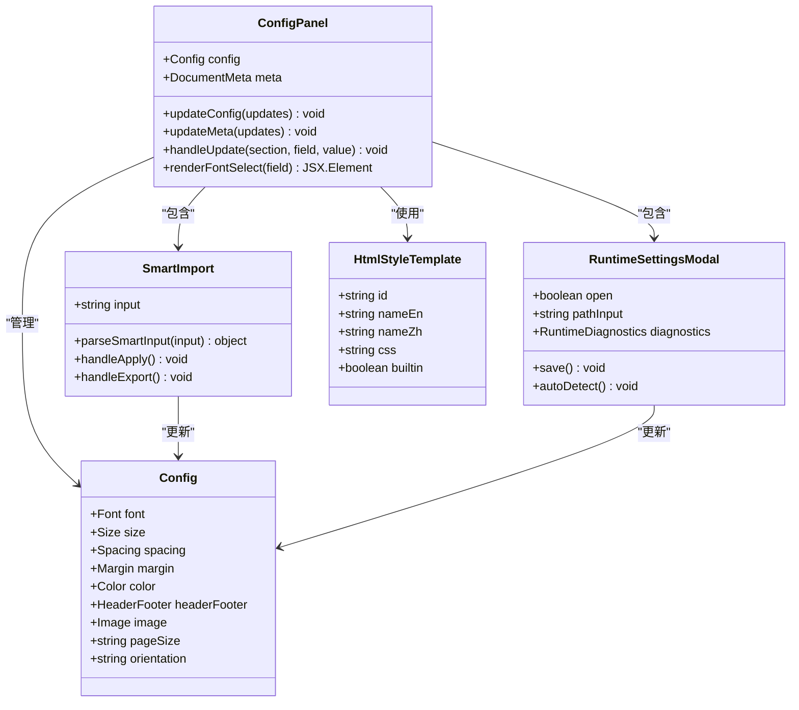
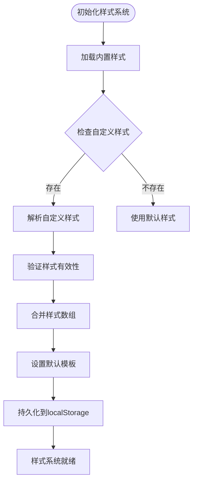
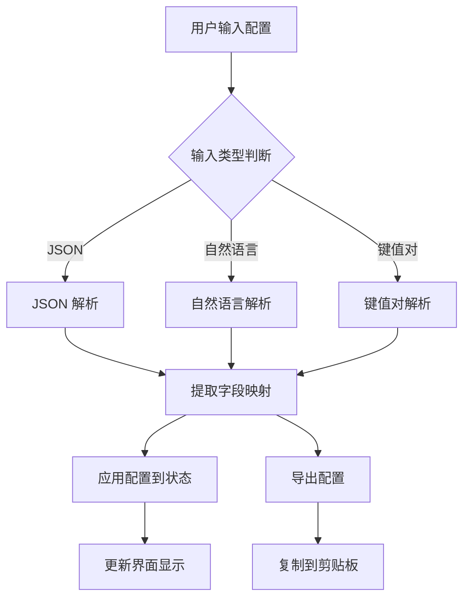

# 前端状态管理增强

<cite>
**本文档引用的文件**
- [useStore.ts](file://frontend-pages/src/store/useStore.ts)
- [App.tsx](file://frontend-pages/src/App.tsx)
- [main.tsx](file://frontend-pages/src/main.tsx)
- [templates.ts](file://frontend-pages/src/utils/templates.ts)
- [ConfigPanel.tsx](file://frontend-pages/src/components/config/ConfigPanel.tsx)
- [MarkdownEditor.tsx](file://frontend-pages/src/components/editor/MarkdownEditor.tsx)
- [PreviewPanel.tsx](file://frontend-pages/src/components/preview/PreviewPanel.tsx)
- [api.ts](file://frontend-pages/src/services/api.ts)
- [smartParser.ts](file://frontend/src/utils/smartParser.ts)
- [RuntimeSettingsModal.tsx](file://frontend/src/components/config/RuntimeSettingsModal.tsx)
- [SmartImport.tsx](file://frontend/src/components/config/SmartImport.tsx)
- [i18n.ts](file://frontend/src/i18n.ts)
- [AppLayout.tsx](file://frontend/src/components/layout/AppLayout.tsx)
- [package.json](file://frontend-pages/package.json)
- [vite.config.ts](file://frontend-pages/vite.config.ts)
</cite>

## 更新摘要
**所做更改**
- 新增frontend-pages项目的状态管理系统分析
- 更新状态管理增强部分，重点介绍useStore.ts的HTML样式管理功能
- 新增HTML样式模板系统的技术细节
- 扩展状态管理架构图，展示新的样式管理能力
- 更新依赖关系分析，包含样式持久化机制

## 目录
1. [简介](#简介)
2. [项目结构](#项目结构)
3. [核心组件](#核心组件)
4. [架构概览](#架构概览)
5. [详细组件分析](#详细组件分析)
6. [依赖关系分析](#依赖关系分析)
7. [性能考虑](#性能考虑)
8. [故障排除指南](#故障排除指南)
9. [结论](#结论)

## 简介

这是一个基于 React 和 TypeScript 的 Markdown 转 Word 工具的前端状态管理系统。该系统采用 Zustand 作为状态管理库，实现了完整的文档编辑、预览和导出功能。系统支持多种预览模式（Markdown、HTML、本地 Word 预览、PDF 预览、Collabora 在线编辑），提供丰富的配置选项和智能导入功能。

**更新** 前端页面版本新增了完善的HTML样式模板管理系统，支持用户自定义样式模板并进行持久化存储。

## 项目结构

前端项目采用模块化组织方式，主要分为以下几个核心目录：



**图表来源**
- [useStore.ts:1-291](file://frontend-pages/src/store/useStore.ts#L1-L291)
- [App.tsx:1-76](file://frontend-pages/src/App.tsx#L1-L76)

**章节来源**
- [main.tsx:1-11](file://frontend-pages/src/main.tsx#L1-L11)
- [package.json:1-35](file://frontend-pages/package.json#L1-L35)

## 核心组件

### Zustand 状态管理

系统的核心是基于 Zustand 的状态管理方案，提供了集中式的全局状态管理能力：



**图表来源**
- [useStore.ts:4-64](file://frontend-pages/src/store/useStore.ts#L4-L64)
- [useStore.ts:175-206](file://frontend-pages/src/store/useStore.ts#L175-L206)
- [templates.ts:1-7](file://frontend-pages/src/utils/templates.ts#L1-L7)

**更新** 新增HTML样式模板管理功能，支持用户自定义样式并进行持久化存储。

### HTML样式模板系统

系统新增了完整的HTML样式模板管理系统，支持内置样式和用户自定义样式的组合：



**图表来源**
- [useStore.ts:160-173](file://frontend-pages/src/store/useStore.ts#L160-L173)
- [useStore.ts:250-279](file://frontend-pages/src/store/useStore.ts#L250-L279)

**更新** 新增HTML样式模板的初始化和持久化机制，支持用户自定义样式的创建、修改和删除。

### 预览模式系统

系统支持五种不同的预览模式，每种模式都有其特定的功能和用途：

| 预览模式 | 描述 | 技术实现 | 适用场景 |
|---------|------|----------|----------|
| markdown | 即时 Markdown 预览 | MarkdownIt 解析 | 快速编辑和语法检查 |
| html | HTML 创意预览 | 自定义 CSS 模板 | 视觉效果预览和样式调试 |
| local | 本地 Word 预览 | docx-preview 渲染 | 快速文档预览 |
| pdf | PDF 预览 | PDF 生成 | 高保真文档预览 |
| collabora | 在线协作编辑 | Collabora 集成 | 多人协作编辑 |

**章节来源**
- [useStore.ts:57-64](file://frontend-pages/src/store/useStore.ts#L57-L64)
- [PreviewPanel.tsx:21-27](file://frontend-pages/src/components/preview/PreviewPanel.tsx#L21-L27)

## 架构概览

系统采用分层架构设计，各层职责清晰分离：



**图表来源**
- [App.tsx:12-76](file://frontend-pages/src/App.tsx#L12-L76)
- [useStore.ts:208-291](file://frontend-pages/src/store/useStore.ts#L208-L291)
- [api.ts:52-128](file://frontend-pages/src/services/api.ts#L52-L128)

**更新** 新增HTML样式模板的持久化存储机制，通过localStorage实现样式的跨会话保持。

## 详细组件分析

### Markdown 编辑器组件

Markdown 编辑器是系统的核心交互组件，集成了丰富的编辑功能：



**图表来源**
- [MarkdownEditor.tsx:11-124](file://frontend-pages/src/components/editor/MarkdownEditor.tsx#L11-L124)
- [useStore.ts:235-239](file://frontend-pages/src/store/useStore.ts#L235-L239)
- [api.ts:78-89](file://frontend-pages/src/services/api.ts#L78-L89)

编辑器的主要特性包括：

1. **实时状态同步**：通过 Zustand 实现与全局状态的双向绑定
2. **快捷键支持**：支持 Ctrl+B（粗体）、Ctrl+I（斜体）、Ctrl+S（保存）等常用快捷键
3. **智能插入**：支持在选中文本周围自动添加 Markdown 标记
4. **文档转换**：一键将 Markdown 转换为可下载的 DOCX 文件

**章节来源**
- [MarkdownEditor.tsx:16-69](file://frontend-pages/src/components/editor/MarkdownEditor.tsx#L16-L69)

### 预览面板组件

预览面板提供了多种预览模式，满足不同场景下的文档查看需求：



**图表来源**
- [PreviewPanel.tsx:13-316](file://frontend-pages/src/components/preview/PreviewPanel.tsx#L13-L316)

预览面板的关键功能：

1. **多模式支持**：根据用户选择动态切换预览模式
2. **自动预览**：支持自动触发预览更新（可配置）
3. **状态管理**：集成全局状态，实现实时响应
4. **导出功能**：支持多种格式的文档导出
5. **HTML样式管理**：支持内置和自定义HTML样式的动态切换

**更新** 新增HTML样式模板的动态管理和切换功能。

**章节来源**
- [PreviewPanel.tsx:33-83](file://frontend-pages/src/components/preview/PreviewPanel.tsx#L33-L83)

### 配置面板组件

配置面板提供了丰富的文档样式和布局选项：



**图表来源**
- [ConfigPanel.tsx:66-198](file://frontend-pages/src/components/config/ConfigPanel.tsx#L66-L198)
- [SmartImport.tsx:10-221](file://frontend/src/components/config/SmartImport.tsx#L10-L221)
- [RuntimeSettingsModal.tsx:11-180](file://frontend/src/components/config/RuntimeSettingsModal.tsx#L11-L180)

配置面板的主要功能：

1. **字体配置**：支持中文字体、英文字体、代码字体的独立配置
2. **尺寸调整**：提供从 H1 到 H6 的标题尺寸和正文尺寸设置
3. **间距控制**：可调节行距、段后间距和标题间距
4. **颜色主题**：支持标题、正文、链接、代码背景、引用边框的颜色自定义
5. **页面布局**：支持 A4、Letter 等纸张大小和纵向/横向设置
6. **智能导入**：支持自然语言描述和 JSON 格式的配置导入
7. **运行时设置**：支持 LibreOffice 路径配置和环境检测
8. **HTML样式管理**：支持样式模板的选择和管理

**更新** 新增HTML样式模板的选择和管理功能。

**章节来源**
- [ConfigPanel.tsx:112-197](file://frontend-pages/src/components/config/ConfigPanel.tsx#L112-L197)

### HTML样式模板系统

HTML样式模板系统提供了灵活的样式定制能力：



**图表来源**
- [useStore.ts:160-173](file://frontend-pages/src/store/useStore.ts#L160-L173)
- [templates.ts:91-96](file://frontend-pages/src/utils/templates.ts#L91-L96)

HTML样式模板系统的关键特性：

1. **内置样式支持**：提供四种预设的HTML样式模板
2. **自定义样式管理**：支持用户创建、修改和删除自定义样式
3. **持久化存储**：通过localStorage实现样式的跨会话保持
4. **动态切换**：支持在预览模式中动态切换不同的样式模板
5. **国际化支持**：样式名称支持中英文双语显示

**更新** 新增完整的HTML样式模板管理系统，包括初始化、持久化和动态管理功能。

**章节来源**
- [useStore.ts:250-279](file://frontend-pages/src/store/useStore.ts#L250-L279)
- [templates.ts:91-96](file://frontend-pages/src/utils/templates.ts#L91-L96)

### 智能导入系统

智能导入系统提供了多种配置导入方式，大大提升了用户体验：



**图表来源**
- [smartParser.ts:21-87](file://frontend/src/utils/smartParser.ts#L21-L87)
- [SmartImport.tsx:34-98](file://frontend/src/components/config/SmartImport.tsx#L34-L98)

智能导入支持的输入格式：

1. **JSON 格式**：标准的 JSON 对象，包含完整的配置信息
2. **自然语言**：中文描述，如"宋体 黑体 12号字 行距1.5倍 A4 纵向"
3. **键值对格式**：冒号分隔的键值对，每行一个配置项

**章节来源**
- [smartParser.ts:1-87](file://frontend/src/utils/smartParser.ts#L1-L87)

## 依赖关系分析

系统采用模块化设计，各组件之间的依赖关系清晰明确：

```mermaid
graph TB
subgraph "核心依赖"
A[Zustand] --> B[状态管理]
C[React] --> D[组件框架]
E[TypeScript] --> F[类型安全]
end
subgraph "编辑器依赖"
G[@uiw/react-codemirror] --> H[代码编辑器]
I[@codemirror/lang-markdown] --> J[Markdown 支持]
end
subgraph "预览依赖"
K[markdown-it] --> L[Markdown 解析]
M[docx-preview] --> N[Word 预览]
O[jszip] --> P[ZIP 文件处理]
end
subgraph "UI 依赖"
Q[lucide-react] --> R[图标组件]
S[clsx] --> T[类名合并]
end
subgraph "构建工具"
U[vite] --> V[开发服务器]
W[tailwindcss] --> X[样式框架]
end
subgraph "样式系统依赖"
Y[localStorage] --> Z[持久化存储]
AA[HtmlStyleTemplate] --> BB[样式接口]
end
A --> C
C --> E
G --> C
K --> C
Q --> C
U --> V
W --> X
Y --> Z
AA --> BB
```

**图表来源**
- [package.json:11-26](file://frontend-pages/package.json#L11-L26)
- [package.json:28-33](file://frontend-pages/package.json#L28-L33)

**更新** 新增HTML样式模板相关的依赖关系，包括localStorage持久化和样式接口定义。

**章节来源**
- [package.json:1-35](file://frontend-pages/package.json#L1-L35)

## 性能考虑

系统在设计时充分考虑了性能优化：

### 状态更新优化
- 使用 Zustand 的原子性状态更新，避免不必要的重渲染
- 通过局部状态更新减少组件重新渲染次数
- 智能的依赖追踪机制确保只有相关组件收到状态变化通知

### 预览性能优化
- 预览内容生成采用防抖机制，避免频繁的 API 调用
- 不同预览模式采用懒加载策略，按需加载相应资源
- 使用对象 URL 缓存预览内容，减少重复计算

### 编辑器性能优化
- CodeMirror 的增量更新机制，只重新渲染受影响的行
- 智能的语法高亮和自动完成功能，避免阻塞主线程
- 合理的内存管理，及时清理不再使用的资源

### HTML样式模板性能优化
- 样式模板采用懒加载策略，仅在需要时解析和应用
- localStorage缓存避免重复的样式解析和序列化
- 样式变更采用增量更新，最小化DOM操作

**更新** 新增HTML样式模板系统的性能优化策略。

## 故障排除指南

### 常见问题及解决方案

**问题1：LibreOffice 路径检测失败**
- 检查 LibreOffice 是否正确安装
- 确认 soffice.exe 文件存在且可执行
- 在 Windows 系统中使用管理员权限运行

**问题2：Collabora 预览无法加载**
- 确认 Collabora 服务正常运行
- 检查网络连接和防火墙设置
- 验证 CORS 配置是否正确

**问题3：预览内容不更新**
- 检查自动预览设置是否启用
- 确认 Markdown 内容是否有语法错误
- 尝试手动刷新预览

**问题4：配置导入失败**
- 检查输入格式是否符合要求
- 确认 JSON 格式是否正确
- 验证自然语言描述是否包含必要的关键词

**问题5：HTML样式模板丢失**
- 检查浏览器localStorage是否正常工作
- 确认样式模板数据格式是否正确
- 尝试重新加载页面或清除浏览器缓存

**问题6：样式切换无效**
- 检查目标样式模板是否存在
- 确认样式CSS代码是否有效
- 验证样式模板ID是否唯一

**章节来源**
- [RuntimeSettingsModal.tsx:44-57](file://frontend/src/components/config/RuntimeSettingsModal.tsx#L44-L57)
- [SmartImport.tsx:95-98](file://frontend/src/components/config/SmartImport.tsx#L95-L98)

## 结论

这个前端状态管理系统展现了现代化 React 应用的最佳实践。通过合理的架构设计和组件划分，系统实现了高度的模块化和可维护性。Zustand 的轻量级特性和强大的功能完美契合了项目需求，为复杂的文档编辑和预览场景提供了稳定可靠的状态管理基础。

**更新** 前端页面版本的增强主要体现在HTML样式模板管理系统的完善，通过localStorage实现样式的持久化存储，为用户提供了更加灵活和个性化的文档预览体验。

系统的亮点包括：
- 清晰的分层架构和职责分离
- 灵活的状态管理模式和响应式更新机制
- 丰富的预览模式和导出功能
- 智能的配置导入和国际化支持
- 完善的HTML样式模板管理系统
- 良好的性能优化和用户体验

**更新** 新增的HTML样式模板系统显著提升了系统的可扩展性和用户体验，用户可以根据需要创建和管理自定义样式模板。

未来可以考虑的方向：
- 添加更多的预览模板和样式选项
- 增强离线功能和缓存机制
- 扩展插件系统以支持更多格式
- 优化移动端的用户体验
- 增加样式模板的分享和导入功能