# 前端界面现代化

<cite>
**本文档引用的文件**
- [package.json](file://package.json)
- [frontend-pages/package.json](file://frontend-pages/package.json)
- [frontend-pages/src/App.tsx](file://frontend-pages/src/App.tsx)
- [frontend-pages/src/store/useStore.ts](file://frontend-pages/src/store/useStore.ts)
- [frontend-pages/src/components/config/ConfigPanel.tsx](file://frontend-pages/src/components/config/ConfigPanel.tsx)
- [frontend-pages/src/components/config/SmartImport.tsx](file://frontend-pages/src/components/config/SmartImport.tsx)
- [frontend-pages/src/components/preview/PreviewPanel.tsx](file://frontend-pages/src/components/preview/PreviewPanel.tsx)
- [frontend-pages/src/components/preview/HtmlStyleImport.tsx](file://frontend-pages/src/components/preview/HtmlStyleImport.tsx)
- [frontend-pages/src/components/editor/EditorToolbar.tsx](file://frontend-pages/src/components/editor/EditorToolbar.tsx)
- [frontend-pages/src/components/layout/AppLayout.tsx](file://frontend-pages/src/components/layout/AppLayout.tsx)
- [frontend-pages/src/components/layout/Header.tsx](file://frontend-pages/src/components/layout/Header.tsx)
- [frontend-pages/src/components/layout/Resizer.tsx](file://frontend-pages/src/components/layout/Resizer.tsx)
- [frontend-pages/src/components/ui/Toast.tsx](file://frontend-pages/src/components/ui/Toast.tsx)
- [frontend-pages/src/services/api.ts](file://frontend-pages/src/services/api.ts)
- [frontend-pages/src/utils/smartParser.ts](file://frontend-pages/src/utils/smartParser.ts)
- [frontend-pages/src/utils/templates.ts](file://frontend-pages/src/utils/templates.ts)
- [frontend-pages/src/i18n.ts](file://frontend-pages/src/i18n.ts)
- [frontend/vite.config.ts](file://frontend/vite.config.ts)
- [frontend/tsconfig.json](file://frontend/tsconfig.json)
- [frontend/src/main.tsx](file://frontend/src/main.tsx)
- [frontend/src/App.tsx](file://frontend/src/App.tsx)
- [frontend/src/store/useStore.ts](file://frontend/src/store/useStore.ts)
- [frontend/src/components/editor/MarkdownEditor.tsx](file://frontend/src/components/editor/MarkdownEditor.tsx)
- [frontend/src/components/editor/EditorToolbar.tsx](file://frontend/src/components/editor/EditorToolbar.tsx)
- [frontend/src/components/ui/Toast.tsx](file://frontend/src/components/ui/Toast.tsx)
- [frontend/src/components/layout/AppLayout.tsx](file://frontend/src/components/layout/AppLayout.tsx)
- [frontend/src/components/layout/Header.tsx](file://frontend/src/components/layout/Header.tsx)
- [frontend/src/components/config/ConfigPanel.tsx](file://frontend/src/components/config/ConfigPanel.tsx)
- [frontend/src/components/preview/PreviewPanel.tsx](file://frontend/src/components/preview/PreviewPanel.tsx)
- [frontend/src/utils/templates.ts](file://frontend/src/utils/templates.ts)
- [frontend/src/services/api.ts](file://frontend/src/services/api.ts)
- [frontend/src/i18n.ts](file://frontend/src/i18n.ts)
- [frontend/src/index.css](file://frontend/src/index.css)
- [frontend/src/App.css](file://frontend/src/App.css)
- [index.html](file://public/index.html)
- [CONFIG_SPEC.md](file://CONFIG_SPEC.md)
- [server.ts](file://src/server.ts)
- [cli.ts](file://src/cli.ts)
- [config.ts](file://src/core/config.ts)
- [types.ts](file://src/core/types.ts)
- [index.ts](file://src/index.ts)
- [index.ts](file://src/parser/index.ts)
- [tokenize.ts](file://src/parser/tokenize.ts)
- [transformer.ts](file://src/parser/transformer.ts)
- [index.ts](file://src/generator/index.ts)
- [document-builder.ts](file://src/generator/document-builder.ts)
- [api.ts](file://src/routes/api.ts)
- [index.ts](file://src/wopi/index.ts)
- [discovery.ts](file://src/wopi/discovery.ts)
- [storage.ts](file://src/wopi/storage.ts)
- [token.ts](file://src/wopi/token.ts)
- [Dockerfile](file://Dockerfile)
</cite>

## 更新摘要
**所做更改**
- 新增完整的frontend-pages前端应用架构，包含20+个新组件
- 新增智能配置导入系统，支持AI驱动的配置解析和导出
- 新增HTML样式管理系统，支持自定义CSS模板和样式导入
- 新增国际化系统，支持中英文双语界面和消息提示
- 新增Toast通知系统，提供全局消息提示功能
- 新增响应式布局系统，支持智能面板隐藏和列宽调整
- 新增三面板界面系统，包括编辑器列、预览列、配置面板
- 新增实时预览功能，支持5种预览模式
- 新增键盘快捷键支持，包括Ctrl+B、Ctrl+I、Ctrl+S
- 新增协作编辑功能，支持Collabora在线编辑

## 目录
1. [简介](#简介)
2. [项目结构](#项目结构)
3. [核心组件](#核心组件)
4. [架构概览](#架构概览)
5. [详细组件分析](#详细组件分析)
6. [依赖关系分析](#依赖关系分析)
7. [性能考虑](#性能考虑)
8. [故障排除指南](#故障排除指南)
9. [结论](#结论)

## 简介

这是一个现代化的 Markdown 到 Word 文档转换器，采用全新的React前端应用架构，提供实时预览、配置定制和协作编辑功能。项目基于TypeScript构建，使用Vite作为构建工具，集成Tailwind CSS样式系统，采用Zustand进行状态管理，并通过CodeMirror提供专业级编辑体验。

**更新** 新增完整的frontend-pages前端应用，包含现代化技术栈集成、三面板界面系统、智能配置管理、实时预览功能、Toast通知系统、键盘快捷键支持等核心特性。

该系统的核心特性包括：
- **现代化前端架构**：React + TypeScript + Vite + Tailwind CSS + Zustand
- **三面板界面系统**：编辑器列、预览列、配置面板的完整布局
- **智能状态管理**：Zustand提供高效的状态管理，支持配置、元数据、预览模式等状态
- **专业编辑体验**：CodeMirror集成，支持快捷键、语法高亮、自动补全
- **实时预览功能**：5种预览模式（Markdown即时、HTML创意✨、Docx预览、PDF预览、Collabora编辑）
- **智能配置管理**：支持中/英/代码字体独立设置、独立页边距控制、段落和标题间距控制
- **HTML创意预览模式**：4种CSS模板风格（现代暗黑、毛玻璃、复古杂志、赛博朋克）
- **响应式布局系统**：支持智能面板隐藏和列宽调整
- **AI驱动配置导入**：Smart Config Import面板，支持自然语言配置解析
- **自动预览机制**：防抖处理的智能预览更新
- **Toast通知系统**：全局消息提示，支持成功和错误状态
- **键盘快捷键支持**：Ctrl+B粗体、Ctrl+I斜体、Ctrl+S保存文档
- **国际化支持**：中英文双语界面和消息提示

## 项目结构

项目采用模块化架构，主要分为以下几个核心模块：

```mermaid
graph TB
subgraph "前端现代化层"
React[React应用<br/>frontend-pages/src/App.tsx]
Vite[Vite构建工具<br/>frontend-pages/vite.config.ts]
TypeScript[TypeScript支持<br/>frontend-pages/tsconfig.json]
Tailwind[Tailwind CSS<br/>frontend-pages/src/index.css]
Zustand[Zustand状态管理<br/>frontend-pages/src/store/useStore.ts]
CodeMirror[CodeMirror编辑器<br/>@uiw/react-codemirror]
SmartImport[Smart Config Import<br/>AI驱动配置导入]
HtmlStyleImport[HTML样式导入<br/>自定义CSS模板管理]
ToastSystem[Toast通知系统<br/>全局消息提示]
KeyboardShortcuts[键盘快捷键<br/>Ctrl+B/I/S支持]
I18nSystem[国际化系统<br/>中英文切换]
ResponsiveLayout[响应式布局<br/>智能面板隐藏]
ThreePanel[三面板界面<br/>编辑器/预览/配置]
APIIntegration[API集成<br/>服务端能力检测]
end
subgraph "核心处理层"
Parser[解析器<br/>src/parser/]
Generator[生成器<br/>src/generator/]
Config[配置管理<br/>src/core/config.ts]
end
subgraph "后端服务层"
Server[服务器<br/>src/server.ts]
WOPI[WOPI 协议<br/>src/wopi/]
API[API 路由<br/>src/routes/api.ts]
CLI[命令行接口<br/>src/cli.ts]
end
subgraph "外部依赖"
DOCX[docx.js<br/>DOCX 生成]
Express[Express.js<br/>Web 服务]
Collabora[Collabora<br/>在线编辑]
LibreOffice[LibreOffice<br/>PDF 转换]
markdown-it[markdown-it<br/>Markdown 解析]
docx-preview[docx-preview<br/>DOCX 预览]
Zod[Zod<br/>类型验证]
end
React --> Vite
React --> TypeScript
React --> Tailwind
React --> Zustand
React --> CodeMirror
React --> SmartImport
React --> HtmlStyleImport
React --> ToastSystem
React --> KeyboardShortcuts
React --> I18nSystem
React --> ResponsiveLayout
React --> ThreePanel
React --> APIIntegration
API --> Parser
API --> Generator
API --> Config
API --> WOPI
Server --> API
Server --> WOPI
CLI --> Parser
CLI --> Generator
Generator --> DOCX
API --> Express
API --> Collabora
API --> LibreOffice
CodeMirror --> markdown-it
PreviewPanel --> docx-preview
HtmlStyleImport --> HtmlStyleTemplate
APIIntegration --> Capabilities
```

**图表来源**
- [frontend-pages/package.json:12-24](file://frontend-pages/package.json#L12-L24)
- [frontend-pages/src/App.tsx:11-68](file://frontend-pages/src/App.tsx#L11-L68)
- [frontend-pages/src/store/useStore.ts:172-210](file://frontend-pages/src/store/useStore.ts#L172-L210)

**章节来源**
- [frontend-pages/package.json:12-42](file://frontend-pages/package.json#L12-L42)
- [frontend-pages/src/App.tsx:11-68](file://frontend-pages/src/App.tsx#L11-L68)

## 核心组件

### 现代化前端架构

**更新** 新增完整的React前端应用架构，采用现代化技术栈

系统采用现代化的React + TypeScript + Vite + Tailwind CSS + Zustand技术栈，提供高性能的用户界面：

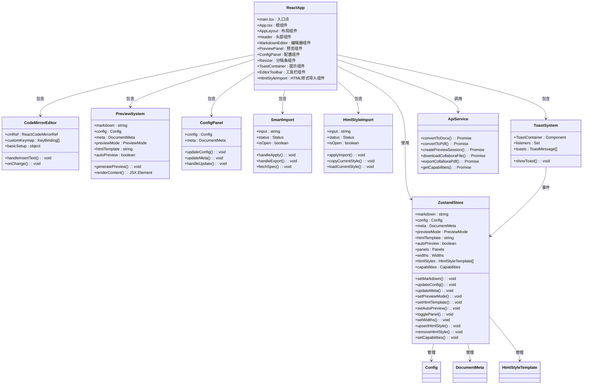

**图表来源**
- [frontend-pages/src/App.tsx:11-68](file://frontend-pages/src/App.tsx#L11-L68)
- [frontend-pages/src/store/useStore.ts:146-210](file://frontend-pages/src/store/useStore.ts#L146-L210)
- [frontend-pages/src/components/editor/MarkdownEditor.tsx:12-125](file://frontend-pages/src/components/editor/MarkdownEditor.tsx#L12-L125)
- [frontend-pages/src/components/preview/PreviewPanel.tsx:11-237](file://frontend-pages/src/components/preview/PreviewPanel.tsx#L11-L237)
- [frontend-pages/src/components/ui/Toast.tsx:12-46](file://frontend-pages/src/components/ui/Toast.tsx#L12-L46)

**章节来源**
- [frontend-pages/src/App.tsx:11-68](file://frontend-pages/src/App.tsx#L11-L68)
- [frontend-pages/src/store/useStore.ts:172-210](file://frontend-pages/src/store/useStore.ts#L172-L210)

## 架构概览

系统采用分层架构设计，现代化的前端应用与后端服务分离：

```mermaid
graph TB
subgraph "现代化前端层"
FE[React应用<br/>frontend-pages/src]
UI[用户界面<br/>组件化设计]
CodeMirror[CodeMirror编辑器<br/>专业编辑体验]
Preview[预览系统<br/>5种模式预览]
ConfigPanel[配置面板<br/>样式定制]
SmartConfig[Smart Config Import<br/>AI驱动配置导入]
HtmlStyleImport[HTML样式导入<br/>自定义CSS模板]
HtmlTemplates[HTML创意模板<br/>4种CSS风格]
AutoPreview[自动预览<br/>防抖机制]
ResponsiveLayout[响应式布局<br/>智能面板隐藏]
ToastSystem[Toast通知系统<br/>全局消息提示]
KeyboardShortcuts[键盘快捷键<br/>Ctrl+B/I/S支持]
I18nSystem[国际化系统<br/>中英文切换]
Zustand[Zustand状态管理<br/>全局状态]
Vite[Vite构建工具<br/>开发服务器]
TypeScript[TypeScript支持<br/>类型安全]
Tailwind[Tailwind CSS<br/>样式系统]
end
subgraph "应用层"
API[RESTful API<br/>路由处理]
WOPI[WOPI 协议<br/>文档协议]
CLI[命令行工具<br/>批量处理]
end
subgraph "业务逻辑层"
Parser[Markdown 解析器<br/>tokenize/transform]
Generator[文档生成器<br/>buildDocument]
ConfigMgr[配置管理器<br/>createConfig/mergeConfig]
end
subgraph "数据访问层"
Storage[文件存储<br/>临时文件管理]
Cache[缓存机制<br/>会话状态]
end
subgraph "基础设施"
Express[Express.js<br/>Web 服务器]
Collabora[Collabora<br/>在线编辑]
LibreOffice[LibreOffice<br/>PDF 转换]
markdown-it[markdown-it<br/>Markdown 解析]
docx-preview[docx-preview<br/>DOCX 预览]
```

**图表来源**
- [frontend-pages/src/App.tsx:11-68](file://frontend-pages/src/App.tsx#L11-L68)
- [frontend-pages/src/store/useStore.ts:172-210](file://frontend-pages/src/store/useStore.ts#L172-L210)
- [frontend-pages/src/services/api.ts:31-82](file://frontend-pages/src/services/api.ts#L31-L82)

## 详细组件分析

### 现代化前端组件

#### React应用架构

**更新** 新增完整的React前端应用架构分析

应用采用函数式组件和Hooks模式，实现响应式和可维护的代码结构：

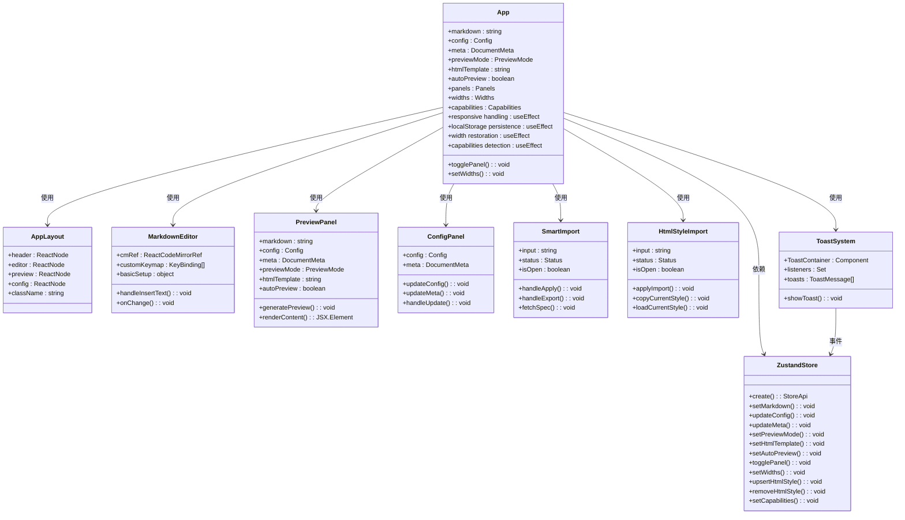

**图表来源**
- [frontend-pages/src/App.tsx:11-68](file://frontend-pages/src/App.tsx#L11-L68)
- [frontend-pages/src/components/layout/AppLayout.tsx:10-22](file://frontend-pages/src/components/layout/AppLayout.tsx#L10-L22)
- [frontend-pages/src/components/editor/MarkdownEditor.tsx:12-125](file://frontend-pages/src/components/editor/MarkdownEditor.tsx#L12-L125)
- [frontend-pages/src/components/preview/PreviewPanel.tsx:11-237](file://frontend-pages/src/components/preview/PreviewPanel.tsx#L11-L237)
- [frontend-pages/src/store/useStore.ts:172-210](file://frontend-pages/src/store/useStore.ts#L172-L210)
- [frontend-pages/src/components/ui/Toast.tsx:12-46](file://frontend-pages/src/components/ui/Toast.tsx#L12-L46)

#### Zustand状态管理系统

**更新** 新增Zustand状态管理系统的详细分析

系统采用Zustand提供轻量级但功能强大的状态管理：

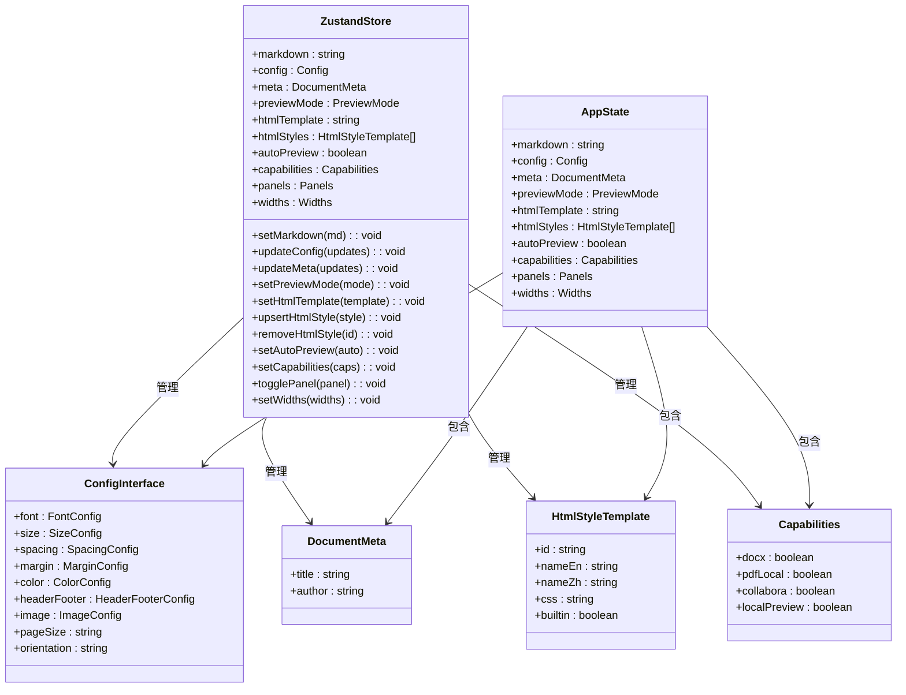

**图表来源**
- [frontend-pages/src/store/useStore.ts:3-104](file://frontend-pages/src/store/useStore.ts#L3-L104)
- [frontend-pages/src/store/useStore.ts:146-210](file://frontend-pages/src/store/useStore.ts#L146-L210)

**章节来源**
- [frontend-pages/src/store/useStore.ts:172-210](file://frontend-pages/src/store/useStore.ts#L172-L210)

### Toast通知系统

**新增** Toast通知系统组件分析

系统新增了全局Toast通知系统，提供统一的消息提示功能：

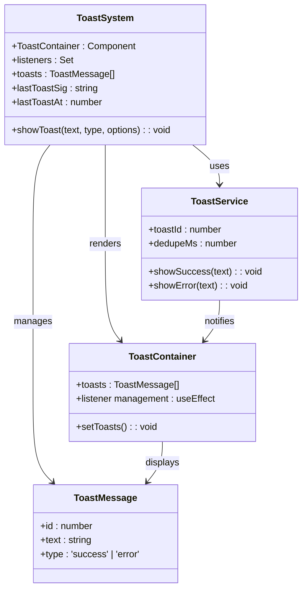

**图表来源**
- [frontend-pages/src/components/ui/Toast.tsx:12-46](file://frontend-pages/src/components/ui/Toast.tsx#L12-L46)

**章节来源**
- [frontend-pages/src/components/ui/Toast.tsx:12-46](file://frontend-pages/src/components/ui/Toast.tsx#L12-L46)

### CodeMirror编辑器集成

**更新** CodeMirror编辑器集成分析，新增键盘快捷键支持

系统集成了专业的CodeMirror编辑器，提供增强的Markdown编辑体验：

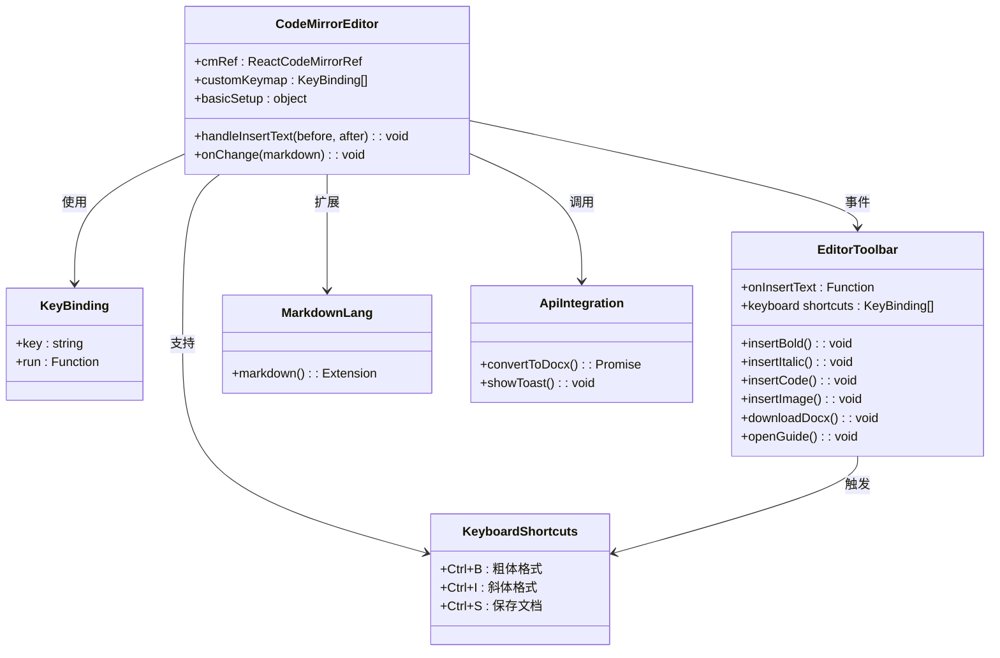

**图表来源**
- [frontend-pages/src/components/editor/MarkdownEditor.tsx:12-125](file://frontend-pages/src/components/editor/MarkdownEditor.tsx#L12-L125)

**章节来源**
- [frontend-pages/src/components/editor/MarkdownEditor.tsx:12-125](file://frontend-pages/src/components/editor/MarkdownEditor.tsx#L12-L125)

### 预览系统架构

**更新** 预览系统现已扩展到5种模式，支持HTML创意预览模式

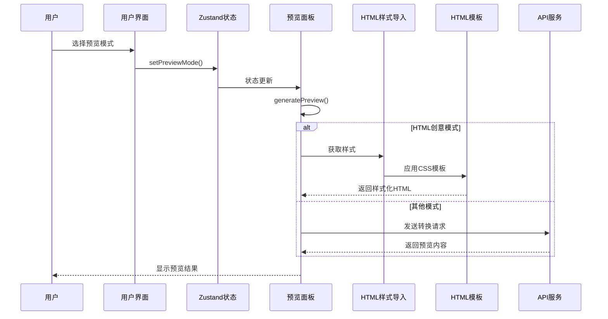

**图表来源**
- [frontend-pages/src/components/preview/PreviewPanel.tsx:19-64](file://frontend-pages/src/components/preview/PreviewPanel.tsx#L19-L64)
- [frontend-pages/src/utils/templates.ts:1-166](file://frontend-pages/src/utils/templates.ts#L1-166)

**章节来源**
- [frontend-pages/src/components/preview/PreviewPanel.tsx:19-64](file://frontend-pages/src/components/preview/PreviewPanel.tsx#L19-L64)

### Smart Config Import 面板

**新增** Smart Config Import 面板系统分析

系统提供智能配置导入功能，支持 AI 驱动的配置管理和导出：

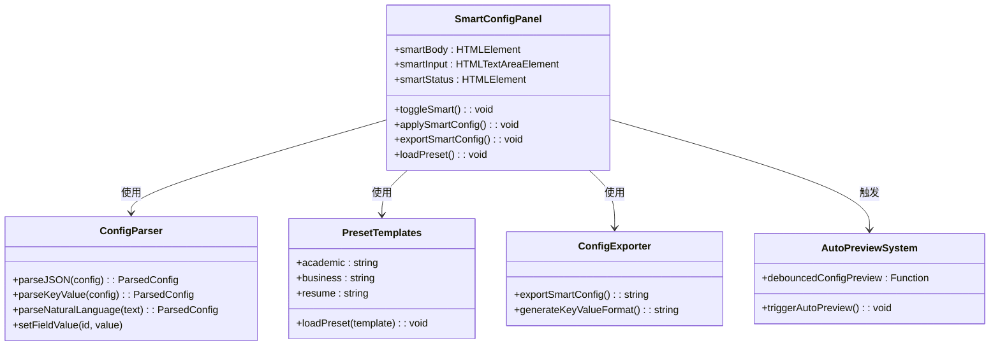

**图表来源**
- [frontend-pages/src/components/config/ConfigPanel.tsx:21-167](file://frontend-pages/src/components/config/ConfigPanel.tsx#L21-L167)

**章节来源**
- [frontend-pages/src/components/config/ConfigPanel.tsx:21-167](file://frontend-pages/src/components/config/ConfigPanel.tsx#L21-L167)

### HTML样式导入系统

**新增** HTML样式导入系统分析

系统提供HTML样式导入功能，支持自定义CSS模板的创建、导入和管理：

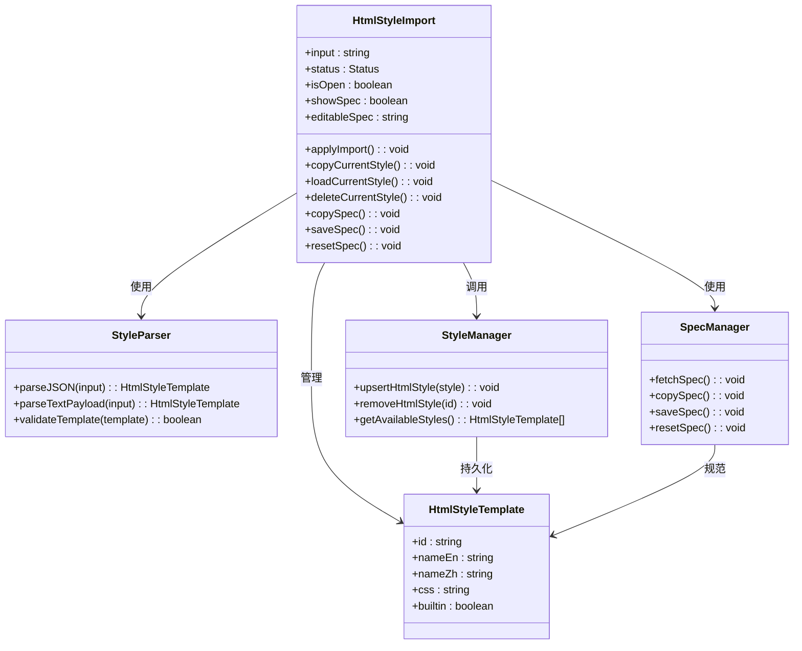

**图表来源**
- [frontend-pages/src/components/preview/HtmlStyleImport.tsx:10-221](file://frontend-pages/src/components/preview/HtmlStyleImport.tsx#L10-L221)

**章节来源**
- [frontend-pages/src/components/preview/HtmlStyleImport.tsx:10-221](file://frontend-pages/src/components/preview/HtmlStyleImport.tsx#L10-L221)

### HTML创意预览模式

**新增** HTML创意预览模式系统分析

系统提供4种CSS模板风格的HTML创意预览：

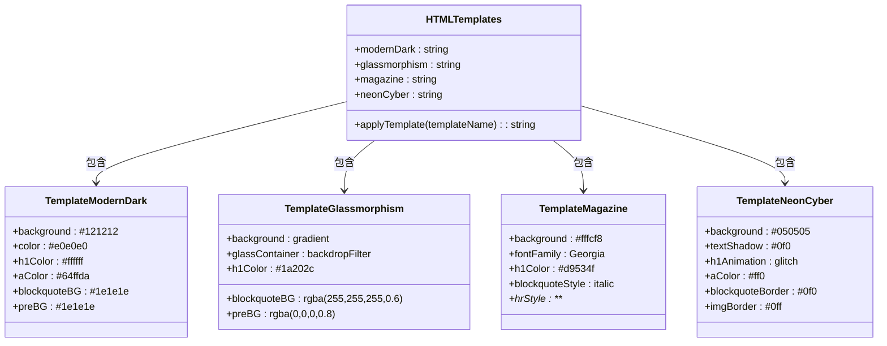

**图表来源**
- [frontend-pages/src/utils/templates.ts:1-166](file://frontend-pages/src/utils/templates.ts#L1-L166)

**章节来源**
- [frontend-pages/src/utils/templates.ts:1-166](file://frontend-pages/src/utils/templates.ts#L1-L166)

### 实时预览系统

**新增** 实时预览功能架构分析，支持5种预览模式

系统提供多种预览模式，支持实时预览和自动预览：

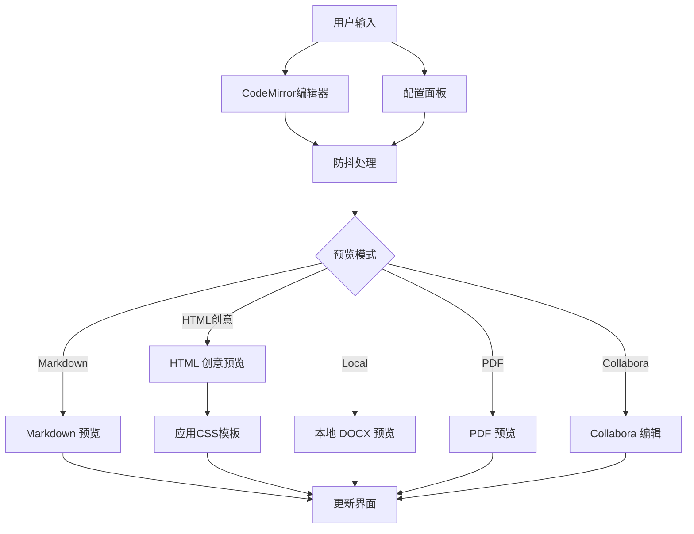

**图表来源**
- [frontend-pages/src/components/preview/PreviewPanel.tsx:51-64](file://frontend-pages/src/components/preview/PreviewPanel.tsx#L51-L64)

**章节来源**
- [frontend-pages/src/components/preview/PreviewPanel.tsx:51-64](file://frontend-pages/src/components/preview/PreviewPanel.tsx#L51-L64)

### 响应式布局系统

**更新** 响应式布局和智能面板隐藏功能，新增自动宽度恢复

系统提供智能的响应式布局，支持面板自动隐藏和宽度恢复：

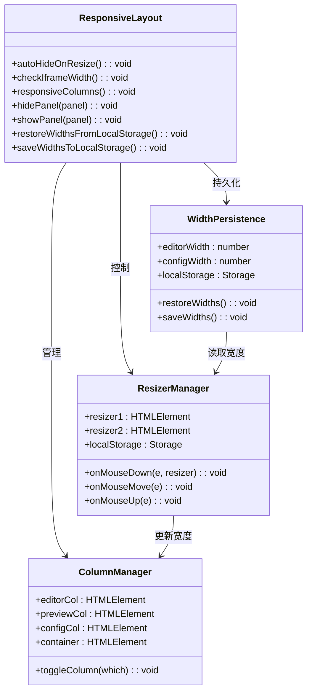

**图表来源**
- [frontend-pages/src/App.tsx:32-41](file://frontend-pages/src/App.tsx#L32-L41)

**章节来源**
- [frontend-pages/src/App.tsx:32-41](file://frontend-pages/src/App.tsx#L32-L41)

### 国际化系统

**新增** 国际化系统分析，支持中英文切换

系统提供完整的国际化支持，包括Toast消息的多语言显示：

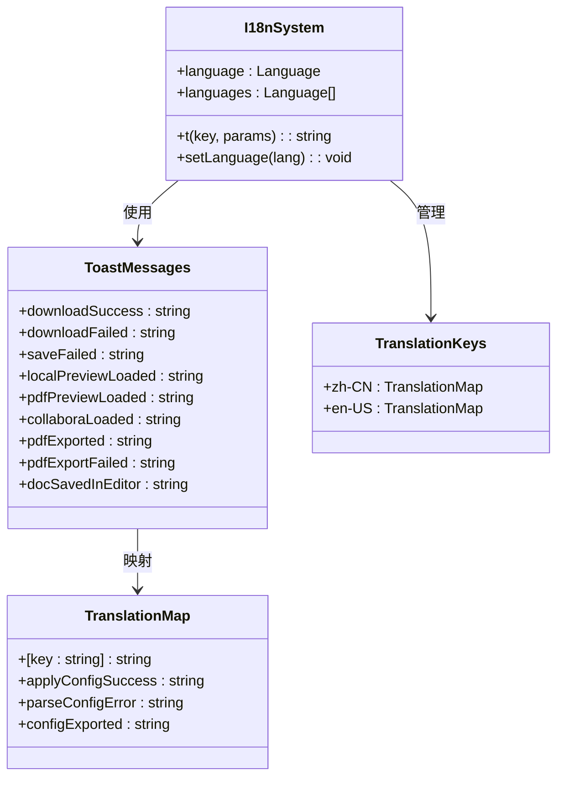

**图表来源**
- [frontend-pages/src/i18n.ts:224-238](file://frontend-pages/src/i18n.ts#L224-L238)

**章节来源**
- [frontend-pages/src/i18n.ts:224-238](file://frontend-pages/src/i18n.ts#L224-L238)

## 依赖关系分析

系统采用现代化的依赖管理，前端和后端分离：

```mermaid
graph TB
subgraph "前端现代化依赖"
React[react ^19.2.5<br/>React框架]
ReactDOM[react-dom ^19.2.5<br/>DOM渲染]
Zustand[zustand ^5.0.12<br/>状态管理]
CodeMirror[@uiw/react-codemirror<br/>编辑器集成]
MarkdownIt[markdown-it ^14.1.1<br/>Markdown解析]
DocxPreview[docx-preview ^0.3.7<br/>DOCX预览]
Lucide[lucide-react ^1.11.0<br/>图标组件]
Tailwind[tailwindcss ^4.2.4<br/>样式系统]
Vite[vite ^8.0.10<br/>构建工具]
TypeScript[typescript ~6.0.2<br/>类型定义]
ESLint[eslint ^10.2.1<br/>代码检查]
end
subgraph "后端依赖"
Express[express<br/>Web 服务器]
Cors[cors<br/>跨域处理]
LibreOffice[libreoffice-convert<br/>PDF 转换]
Zod[zod<br/>类型验证]
end
React --> Zustand
React --> CodeMirror
React --> DocxPreview
React --> Lucide
CodeMirror --> MarkdownIt
PreviewPanel --> DocxPreview
App --> Zustand
App --> API
App --> ToastSystem
API --> Express
ToastSystem --> Zustand
```

**图表来源**
- [frontend-pages/package.json:12-42](file://frontend-pages/package.json#L12-L42)

**章节来源**
- [frontend-pages/package.json:12-42](file://frontend-pages/package.json#L12-L42)

## 性能考虑

### 前端性能优化

**更新** 新增现代化前端技术栈的性能优化策略

系统在前端层面采用了多项现代化性能优化策略：

1. **React性能优化**
   - 使用React.memo和useMemo减少不必要的重渲染
   - Hook状态管理替代类组件，减少内存开销
   - 懒加载组件和按需导入优化初始包大小

2. **Vite构建优化**
   - 开发服务器热重载，提升开发体验
   - Tree-shaking消除未使用代码
   - 预构建依赖加速启动时间

3. **Zustand状态管理优化**
   - 轻量级状态管理，相比Redux减少约95%的代码量
   - 原子化状态更新，避免深层对象比较
   - 内存友好的状态结构设计

4. **CodeMirror编辑器优化**
   - 按需加载编辑器功能模块
   - 防抖处理减少频繁的预览更新
   - 智能缓存机制避免重复渲染

5. **Tailwind CSS优化**
   - JIT编译模式，仅生成使用的样式
   - 自定义配置减少未使用样式的生成
   - 响应式设计优化移动端性能

6. **响应式布局优化**
   - CSS Grid和Flexbox实现高效布局计算
   - 最小化重绘和回流操作
   - translate替代position属性进行动画

7. **Toast通知系统优化**
   - 事件驱动的消息传递，避免全局状态污染
   - 自动定时清除，防止内存泄漏
   - 动画过渡效果优化用户体验

8. **键盘快捷键优化**
   - 事件委托减少监听器数量
   - 防抖处理避免重复触发
   - 跨平台兼容性支持

9. **资源加载优化**
   - CDN加速静态资源
   - 图片懒加载和尺寸适配
   - 压缩和合并CSS/JS文件

10. **内存管理**
    - 及时清理事件监听器
    - 合理使用WeakMap和WeakSet
    - 避免内存泄漏

11. **智能配置导入优化**
    - 智能解析算法，支持多种输入格式
    - 预设模板缓存，提升加载速度
    - 错误处理和回退机制

12. **HTML样式管理优化**
    - 样式模板缓存和复用
    - 本地存储持久化自定义样式
    - 样式验证和清理机制

13. **API集成优化**
    - 能力检测和降级处理
    - 请求缓存和去重
    - 错误边界和重试机制

### 后端性能优化

1. **并发处理**
   - 使用异步非阻塞I/O操作
   - 连接池管理数据库连接
   - 缓存常用配置和模板

2. **资源管理**
   - 流式处理大文件
   - 及时释放临时文件
   - 内存使用监控

3. **网络优化**
   - Gzip压缩响应内容
   - 合理设置缓存头
   - CDN分发静态资源

## 故障排除指南

### 常见问题及解决方案

#### Vite开发服务器启动失败

**症状**: `npm run dev` 报错，无法启动开发服务器

**原因分析**:
- 端口3000被占用
- 依赖安装不完整
- Node.js版本不兼容

**解决步骤**:
1. 检查端口占用情况：`netstat -ano | findstr :3000`
2. 清理node_modules并重新安装依赖
3. 确认Node.js版本符合要求
4. 检查防火墙设置

#### CodeMirror编辑器加载失败

**症状**: 编辑器无法正常加载或显示空白

**原因分析**:
- CodeMirror资源文件加载失败
- JavaScript错误阻止初始化
- 样式冲突问题

**解决步骤**:
1. 检查网络连接和CDN访问
2. 查看浏览器控制台错误信息
3. 验证CDN资源可用性
4. 检查Tailwind CSS冲突

#### Zustand状态管理异常

**症状**: 状态更新不生效或出现意外行为

**原因分析**:
- 状态更新函数使用不当
- 订阅组件未正确接收状态更新
- 状态结构设计问题

**解决步骤**:
1. 检查状态更新函数的调用方式
2. 验证组件是否正确订阅状态
3. 确认状态结构的原子化设计
4. 使用React DevTools检查组件重渲染

#### Toast通知系统异常

**症状**: Toast消息无法显示或显示异常

**原因分析**:
- Toast容器未正确渲染
- 消息监听器注册失败
- 动画过渡效果冲突

**解决步骤**:
1. 检查ToastContainer组件是否在App根节点渲染
2. 验证showToast函数的调用时机
3. 查看浏览器控制台是否有错误信息
4. 确认CSS动画类名正确

#### 智能配置导入功能异常

**症状**: Smart Config Import面板无法解析配置或应用失败

**原因分析**:
- 输入格式不符合规范
- AI生成的配置文本格式错误
- 解析器错误处理异常

**解决步骤**:
1. 检查CONFIG_SPEC.md文件是否正确加载
2. 验证输入的配置格式是否符合规范
3. 查看解析错误的具体信息
4. 尝试使用预设模板进行对比

#### HTML样式导入功能异常

**症状**: HTML样式导入面板无法导入或应用样式

**原因分析**:
- CSS样式格式不符合规范
- 样式ID重复或冲突
- 本地存储权限问题

**解决步骤**:
1. 检查HTML_STYLE_SPEC.md文件是否正确加载
2. 验证CSS样式的完整性和正确性
3. 确认样式ID的唯一性
4. 检查浏览器的本地存储权限

#### 键盘快捷键功能异常

**症状**: Ctrl+B、Ctrl+I、Ctrl+S等快捷键无效

**原因分析**:
- 快捷键绑定冲突
- 编辑器焦点问题
- 浏览器安全策略限制

**解决步骤**:
1. 检查快捷键绑定是否正确
2. 确认编辑器处于焦点状态
3. 验证浏览器是否阻止快捷键
4. 尝试不同的浏览器测试

#### 响应式布局问题

**症状**: 响应式布局在某些屏幕尺寸下显示异常

**原因分析**:
- 媒体查询配置错误
- 样式优先级问题
- 组件挂载顺序问题

**解决步骤**:
1. 检查Tailwind CSS断点配置
2. 验证CSS优先级设置
3. 确认组件渲染顺序
4. 测试不同设备的显示效果

#### API通信问题

**症状**: 预览功能或下载功能报错

**原因分析**:
- CORS跨域问题
- 后端服务未启动
- 网络连接问题

**解决步骤**:
1. 检查Vite代理配置
2. 验证后端服务状态
3. 确认网络连接正常
4. 查看浏览器开发者工具的网络面板

### 开发调试技巧

1. **启用详细日志**
   ```bash
   npm run dev
   ```

2. **TypeScript类型检查**
   ```bash
   npx tsc --noEmit
   ```

3. **ESLint代码检查**
   ```bash
   npm run lint
   ```

4. **React DevTools调试**
   - 安装React DevTools浏览器扩展
   - 检查组件树和状态变化
   - 监控性能指标

## 结论

**更新** 本项目已成功实现现代化的React前端应用，具有以下显著特点：

**技术优势**:
- 采用现代化技术栈：React + TypeScript + Vite + Tailwind CSS + Zustand
- **新增** 完整的三面板界面系统，包括编辑器列、预览列和配置面板
- **新增** 智能状态管理系统，提供高效的状态管理
- **新增** CodeMirror编辑器集成，提供专业级编辑体验
- **新增** 实时预览功能，支持5种预览模式
- **新增** 智能配置管理，支持中/英/代码字体独立设置
- **新增** HTML创意预览模式，支持4种CSS模板风格
- **新增** AI驱动配置导入功能
- **新增** 响应式布局系统，支持智能面板隐藏
- **新增** 自动预览防抖机制
- **新增** Toast通知系统，提供全局消息提示
- **新增** 键盘快捷键支持，提升编辑效率
- **新增** 国际化系统，支持中英文切换
- **新增** HTML样式导入系统，支持自定义CSS模板
- **新增** 能力检测机制，支持服务端功能降级
- 前端界面现代化，用户体验优秀
- 后端服务稳定可靠，支持多种输出格式
- 集成协作编辑功能，提升工作效率

**创新特性**:
- **新增** 现代化前端架构，采用函数式组件和Hooks模式
- **新增** Zustand状态管理，提供轻量级但功能强大的状态管理
- **新增** Vite构建工具，提供快速开发体验
- **新增** Tailwind CSS样式系统，实现快速原型设计
- **新增** 智能配置导入面板，支持自然语言配置解析
- **新增** 三面板布局设计，提升工作流程效率
- **新增** CodeMirror编辑器，支持快捷键和语法高亮
- **新增** 智能实时预览，支持自动预览和手动刷新
- **新增** 全面的样式配置系统，支持字体、颜色、页面布局等定制
- **新增** HTML创意预览模式，提供多种视觉风格选择
- **新增** 自动预览防抖机制，平衡响应性和性能
- **新增** 响应式布局系统，支持智能面板隐藏
- **新增** Toast通知系统，提供统一的消息提示
- **新增** 键盘快捷键支持，包括Ctrl+B、Ctrl+I、Ctrl+S
- **新增** 国际化系统，支持中英文双语界面
- **新增** HTML样式导入系统，支持自定义CSS模板管理
- **新增** 能力检测机制，支持服务端功能降级处理
- 实时预览与编辑分离的设计理念
- 完善的错误处理和恢复机制

**扩展性**:
- 模块化的React组件架构
- **新增** 可扩展的状态管理方案
- **新增** 支持自定义CSS模板的创意预览系统
- **新增** AI驱动的配置导入导出功能
- **新增** Toast通知系统的插件化设计
- **新增** 键盘快捷键的可配置性
- **新增** 国际化系统的多语言扩展
- **新增** HTML样式导入系统的模板管理
- **新增** 能力检测机制的可扩展性
- 支持自定义样式和主题
- 易于集成新的文档格式和预览模式

**用户体验提升**:
- **新增** Toast通知提供即时反馈
- **新增** 键盘快捷键大幅提高编辑效率
- **新增** 自动宽度恢复避免重复设置
- **新增** 智能面板隐藏适应不同屏幕尺寸
- **新增** 国际化支持满足全球用户需求
- **新增** HTML样式导入系统支持个性化定制
- **新增** 能力检测机制提供清晰的功能状态反馈
- **新增** 多种预览模式满足不同使用场景

该系统为用户提供了一个功能完整、性能优异的现代化文档转换解决方案，适合个人用户和企业环境的各种使用场景。三面板界面系统特别适合需要同时查看编辑内容、预览效果和调整配置的专业用户。智能状态管理系统和响应式布局设计进一步提升了用户体验。现代化的技术栈选择确保了系统的可维护性和扩展性，为未来的功能扩展奠定了坚实的基础。Toast通知系统和键盘快捷键的加入使得整体用户体验更加流畅和专业。智能配置导入和HTML样式导入系统的加入为用户提供了更强大的定制能力和更丰富的视觉效果选择。