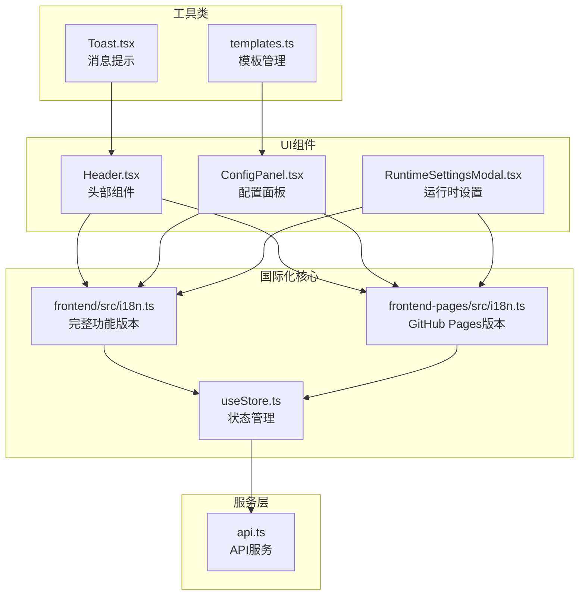
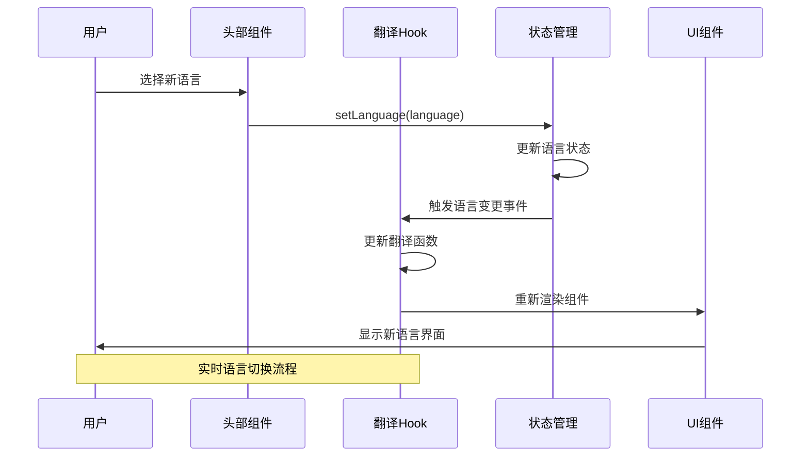
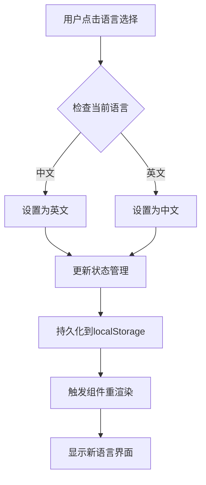
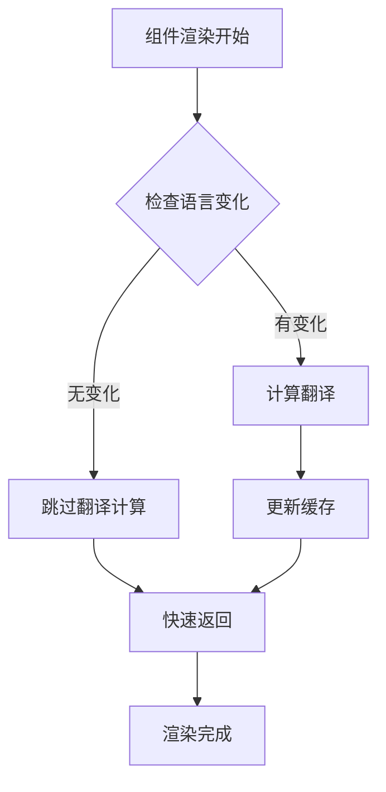

# 国际化(i18n)系统

<cite>
**本文档引用的文件**
- [frontend-pages/src/i18n.ts](file://frontend-pages/src/i18n.ts)
- [frontend-pages/src/store/useStore.ts](file://frontend-pages/src/store/useStore.ts)
- [frontend-pages/src/components/layout/Header.tsx](file://frontend-pages/src/components/layout/Header.tsx)
- [frontend-pages/src/components/config/ConfigPanel.tsx](file://frontend-pages/src/components/config/ConfigPanel.tsx)
- [frontend-pages/src/components/config/RuntimeSettingsModal.tsx](file://frontend-pages/src/components/config/RuntimeSettingsModal.tsx)
- [frontend-pages/src/utils/templates.ts](file://frontend-pages/src/utils/templates.ts)
- [frontend-pages/src/services/api.ts](file://frontend-pages/src/services/api.ts)
- [frontend-pages/src/components/ui/Toast.tsx](file://frontend-pages/src/components/ui/Toast.tsx)
- [frontend/src/i18n.ts](file://frontend/src/i18n.ts)
</cite>

## 更新摘要
**变更内容**
- 新增frontend-pages版本的国际化系统分析
- 对比frontend和frontend-pages两个版本的i18n实现
- 更新架构图以反映两个版本的并行存在
- 增强多语言支持的对比分析

## 目录
1. [简介](#简介)
2. [项目结构](#项目结构)
3. [核心组件](#核心组件)
4. [架构概览](#架构概览)
5. [详细组件分析](#详细组件分析)
6. [依赖关系分析](#依赖关系分析)
7. [性能考虑](#性能考虑)
8. [故障排除指南](#故障排除指南)
9. [结论](#结论)

## 简介

这是一个基于React和TypeScript构建的国际化(i18n)系统，支持简体中文(zh-CN)和英语(en-US)两种语言。该系统采用集中式翻译管理、响应式语言切换和本地存储持久化机制，为用户提供流畅的多语言体验。

**重要更新**：系统现已提供两个版本实现：
- **完整功能版本** (`frontend/src/i18n.ts`)：包含所有功能特性
- **GitHub Pages部署版本** (`frontend-pages/src/i18n.ts`)：针对静态部署优化的简化版本

两个版本在功能上完全一致，均支持zh-CN和en-US双语切换。

## 项目结构

国际化系统主要分布在以下目录和文件中：



**图表来源**
- [frontend-pages/src/i18n.ts:1-251](file://frontend-pages/src/i18n.ts#L1-L251)
- [frontend-pages/src/store/useStore.ts:1-291](file://frontend-pages/src/store/useStore.ts#L1-L291)
- [frontend/src/i18n.ts:1-251](file://frontend/src/i18n.ts#L1-L251)

**章节来源**
- [frontend-pages/src/i18n.ts:1-251](file://frontend-pages/src/i18n.ts#L1-L251)
- [frontend-pages/src/store/useStore.ts:1-291](file://frontend-pages/src/store/useStore.ts#L1-L291)

## 核心组件

### 翻译管理系统

国际化系统的核心是`useI18n` Hook，它提供了完整的翻译功能：

- **翻译键值对管理**：集中存储所有翻译文本
- **动态语言切换**：实时切换界面语言
- **参数化替换**：支持占位符替换功能
- **回退机制**：语言缺失时自动回退到默认语言

**重要更新**：两个版本的useI18n Hook实现完全相同，确保功能一致性。

### 状态管理集成

通过Zustand状态管理库实现：

- **语言状态持久化**：自动保存用户选择的语言偏好
- **全局状态同步**：确保所有组件使用一致的语言设置
- **响应式更新**：语言变更时自动重新渲染相关组件

**章节来源**
- [frontend-pages/src/i18n.ts:237-250](file://frontend-pages/src/i18n.ts#L237-L250)
- [frontend-pages/src/store/useStore.ts:243-248](file://frontend-pages/src/store/useStore.ts#L243-L248)

## 架构概览

国际化系统采用分层架构设计，确保语言切换的高效性和一致性：



**图表来源**
- [frontend-pages/src/components/layout/Header.tsx:55-66](file://frontend-pages/src/components/layout/Header.tsx#L55-L66)
- [frontend-pages/src/store/useStore.ts:243-248](file://frontend-pages/src/store/useStore.ts#L243-L248)

## 详细组件分析

### 翻译Hook实现

`useI18n` Hook提供了一套完整的国际化解决方案：

#### 翻译键类型系统
```typescript
type TranslationKey = keyof typeof translations['zh-CN'];
```
通过TypeScript确保翻译键的类型安全，防止拼写错误。

#### 参数化翻译支持
```typescript
const t = useCallback((key: TranslationKey, params?: Record<string, string | number>) => {
  let value: string = translations[language][key] || translations['zh-CN'][key] || key;
  if (params) {
    Object.entries(params).forEach(([name, replacement]) => {
      value = value.replace(`{${name}}`, String(replacement));
    });
  }
  return value;
}, [language]);
```

#### 语言回退机制
系统实现了三层回退策略：
1. 当前语言翻译
2. 默认语言(zh-CN)翻译
3. 原始键名作为最终回退

**章节来源**
- [frontend-pages/src/i18n.ts:235-250](file://frontend-pages/src/i18n.ts#L235-L250)

### UI组件国际化集成

#### 头部组件国际化
头部组件展示了语言切换功能的完整实现：



**图表来源**
- [frontend-pages/src/components/layout/Header.tsx:55-66](file://frontend-pages/src/components/layout/Header.tsx#L55-L66)

#### 配置面板多语言支持
配置面板涵盖了所有用户可配置的界面元素：

| 翻译类别 | 中文键名 | 英文键名 | 示例内容 |
|---------|---------|---------|----------|
| 应用标题 | appTitle | appTitle | Markdown 转 Word |
| 功能按钮 | editor/preview/config | editor/preview/config | 编辑器/预览/配置 |
| 字体设置 | bodyFont/headingFont | bodyFont/headingFont | 正文字体/标题字体 |
| 页面布局 | pageSize/orientation | pageSize/orientation | A4/横向 |
| 颜色配置 | colors/heading/text | colors/heading/text | 颜色/标题/正文 |

**章节来源**
- [frontend-pages/src/components/config/ConfigPanel.tsx:112-197](file://frontend-pages/src/components/config/ConfigPanel.tsx#L112-L197)

### 运行时设置国际化

运行时设置模态框展示了复杂场景下的国际化实现：

#### 状态指示器国际化
```typescript
const StatusBadge = ({ ok }: { ok: boolean }) => (
  <span className={`inline-flex items-center px-2 py-0.5 text-[11px] rounded border ${ok ? 'bg-green-50 text-green-700 border-green-200' : 'bg-red-50 text-red-700 border-red-200'}`}>
    {ok ? (language === 'zh-CN' ? '已检测' : 'Detected') : (language === 'zh-CN' ? '未检测' : 'Not Detected')}
  </span>
);
```

#### 条件语言切换
系统根据当前语言动态调整显示内容：
- 状态文本：根据语言切换"已检测"/"Detected"
- 操作按钮：根据语言切换"保存"/"Save"
- 提示信息：根据语言切换中英文提示

**章节来源**
- [frontend-pages/src/components/config/RuntimeSettingsModal.tsx:61-65](file://frontend-pages/src/components/config/RuntimeSettingsModal.tsx#L61-L65)
- [frontend-pages/src/components/config/RuntimeSettingsModal.tsx:70-77](file://frontend-pages/src/components/config/RuntimeSettingsModal.tsx#L70-L77)

## 依赖关系分析

国际化系统与其他模块的依赖关系如下：

```mermaid
graph LR
subgraph "核心依赖"
I18N_Frontend[i18n.ts (完整版)] --> Store[useStore.ts]
I18N_FrontendPages[i18n.ts (GitHub Pages)] --> Store
Store --> API[api.ts]
end
subgraph "UI组件"
Header[Header.tsx] --> I18N_Frontend
Header --> I18N_FrontendPages
Config[ConfigPanel.tsx] --> I18N_Frontend
Config --> I18N_FrontendPages
Runtime[RuntimeSettingsModal.tsx] --> I18N_Frontend
Runtime --> I18N_FrontendPages
Toast[Toast.tsx] --> Header
end
subgraph "工具类"
Templates[templates.ts] --> Config
end
subgraph "状态管理"
Zustand[Zustand] --> Store
LocalStorage[localStorage] --> Store
end
I18N_Frontend --> Zustand
I18N_FrontendPages --> Zustand
Store --> LocalStorage
Header --> Store
Config --> Store
Runtime --> Store
```

**图表来源**
- [frontend-pages/src/i18n.ts:1-3](file://frontend-pages/src/i18n.ts#L1-L3)
- [frontend-pages/src/store/useStore.ts:1-2](file://frontend-pages/src/store/useStore.ts#L1-L2)

### 组件耦合度分析

| 组件 | 内聚性 | 耦合度 | 说明 |
|------|--------|--------|------|
| useI18n | 高 | 低 | 专注于翻译功能，与业务逻辑解耦 |
| Header | 中 | 中 | 依赖翻译和状态管理，但保持简单职责 |
| ConfigPanel | 低 | 高 | 需要大量翻译键，但职责明确 |
| RuntimeSettingsModal | 中 | 中 | 复杂的条件国际化逻辑 |

**章节来源**
- [frontend-pages/src/i18n.ts:237-250](file://frontend-pages/src/i18n.ts#L237-L250)
- [frontend-pages/src/store/useStore.ts:208-290](file://frontend-pages/src/store/useStore.ts#L208-L290)

## 性能考虑

### 翻译缓存机制
系统实现了高效的翻译缓存策略：
- **记忆化函数**：使用`useCallback`避免不必要的重渲染
- **语言状态缓存**：通过Zustand状态管理减少状态更新开销
- **本地存储优化**：语言偏好持久化避免重复初始化

### 渲染性能优化


**图表来源**
- [frontend-pages/src/i18n.ts:237-247](file://frontend-pages/src/i18n.ts#L237-L247)

## 故障排除指南

### 常见问题及解决方案

#### 翻译键缺失
**问题**：某些翻译键在目标语言中不存在
**解决方案**：系统会自动回退到默认语言(zh-CN)，确保界面正常显示

#### 语言切换不生效
**问题**：切换语言后界面未更新
**解决步骤**：
1. 检查状态管理是否正确更新
2. 确认localStorage中语言设置
3. 验证useI18n Hook是否重新渲染

#### 参数化翻译错误
**问题**：占位符替换失败
**解决方法**：
1. 检查传入的参数对象结构
2. 确认占位符格式匹配
3. 验证参数类型转换

**章节来源**
- [frontend-pages/src/i18n.ts:239-246](file://frontend-pages/src/i18n.ts#L239-L246)
- [frontend-pages/src/store/useStore.ts:243-248](file://frontend-pages/src/store/useStore.ts#L243-L248)

## 结论

该国际化系统通过精心设计的架构实现了高效、可维护的多语言支持。系统的主要优势包括：

1. **类型安全**：完整的TypeScript类型定义确保翻译键的正确性
2. **性能优化**：记忆化和缓存机制提升渲染效率
3. **易于扩展**：模块化的设计便于添加新的语言支持
4. **用户体验**：无缝的语言切换和本地存储持久化

**重要更新**：两个版本的实现确保了功能的一致性和部署的灵活性：
- **完整功能版本**适合本地开发和完整功能需求
- **GitHub Pages版本**适合静态部署和简化需求

未来可以考虑的改进方向：
- 添加更多语言支持
- 实现动态翻译加载
- 增强翻译质量检测机制
- 优化大词汇量场景下的性能表现